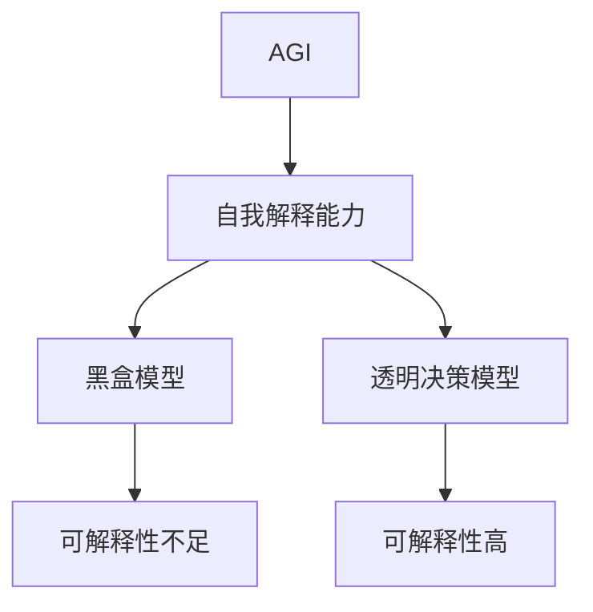

                 

# <AGI的自我解释能力：从黑盒到透明决策>

> 关键词：人工智能，AGI，自我解释能力，黑盒模型，透明决策模型，代码实现

> 摘要：本文深入探讨了人工智能领域中的高级通用智能（AGI）及其自我解释能力，从黑盒模型过渡到透明决策模型。通过详细分析核心概念和实际应用案例，探讨了如何提高AGI的可解释性，为未来研究和应用提供了有益的启示。

----------------------------------------------------------------

## 引言

### AGI的概念与意义

高级通用智能（AGI，Artificial General Intelligence）是指能够像人类一样在各种任务和环境中表现出广泛智能的人工智能系统。与目前广泛应用的窄人工智能（Narrow AI，例如语音识别、图像识别等）不同，AGI具有更强的跨领域和自适应能力。AGI的目标是实现人工智能在各个领域的突破，为人类带来更多便利和变革。

自我解释能力是AGI的重要特征之一。自我解释能力使人工智能系统能够理解自己的行为和决策过程，并对其进行解释和反思。这不仅能提高系统的可解释性，增强人类对人工智能的信任，还能帮助开发者优化和改进系统。

### 自我解释能力的核心价值

自我解释能力的核心价值体现在多个方面。首先，它有助于提高人工智能系统的透明度和可解释性，使得系统在做出决策时，用户可以理解其背后的逻辑和原因。这有助于降低人工智能系统的黑箱效应，减少人类对其行为的误解和担忧。

其次，自我解释能力有助于系统自身的优化和改进。通过自我解释，人工智能系统可以识别出自身行为中的不足和错误，从而进行自我修正和改进。这有助于提高系统的稳定性和可靠性。

此外，自我解释能力还有助于推动人工智能技术的创新和发展。通过理解和分析自身行为，人工智能系统可以产生新的想法和解决方案，从而推动技术的进步。

### 黑盒与透明决策模型

黑盒模型和透明决策模型是人工智能领域中的两种不同方法。黑盒模型是一种无法直接观测和理解其内部结构和运作机制的人工智能系统。黑盒模型的主要优点在于其高度复杂性和强大的学习能力，但缺点是缺乏透明性和可解释性。

透明决策模型则是一种内部结构和运作机制可以被清晰理解和解释的人工智能系统。透明决策模型的主要优点在于其高透明度和可解释性，但缺点是可能需要更高的计算资源和时间。

## 设计目录大纲的步骤

### 初步目录大纲

1. **理解书名和主题**
   - 书名《AGI的自我解释能力：从黑盒到透明决策》明确了本文的核心内容，即AGI的自我解释能力以及如何从黑盒模型过渡到透明决策模型。

2. **确定核心概念和章节**
   - 核心概念包括AGI的定义、自我解释能力、黑盒与透明决策模型。
   - 核心章节包括引言、AGI基础、自我解释能力、黑盒模型分析、透明决策模型、实际应用案例和总结。

3. **构建初步的目录大纲**
   - 根据核心概念和章节，构建初步的目录大纲，包括1级、2级和3级标题。

4. **细化目录内容**
   - 为每个章节添加更详细的二级和三级标题，确保每个章节都有足够的深度和广度来涵盖主题。

5. **添加核心概念原理和架构的Mermaid流程图**
   - 为核心概念添加Mermaid流程图，以帮助读者更好地理解。

6. **编写伪代码和数学公式**
   - 对于核心算法和数学模型，编写伪代码和数学公式，并进行详细讲解。

7. **设计项目实战案例**
   - 为每个核心章节设计一个实际项目案例，并提供代码实现和详细解读。

8. **整理和优化目录**
   - 根据内容的完整性和逻辑性，对目录进行最后的整理和优化。

9. **确保字数限制**
   - 确保整个目录大纲的总字数在2000字以内。

按照上述步骤，我们可以开始设计《AGI的自我解释能力：从黑盒到透明决策》的目录大纲。

### 目录大纲

#### 第一部分: 引言
- **第1章: 引言**
  - **1.1 AGI的概念与意义**
  - **1.2 自我解释能力的核心价值**
  - **1.3 黑盒与透明决策模型**

#### 第二部分: AGI的基础
- **第2章: 人工智能概述**
  - **2.1 人工智能的发展历程**
  - **2.2 人工智能的类型与分类**
  - **2.3 AGI的定义与目标**

#### 第三部分: 自我解释能力的探索
- **第3章: 自我解释能力的基本原理**
  - **3.1 自我解释能力的概念**
  - **3.2 自我解释能力的组成部分**
  - **3.3 自我解释能力的技术挑战**

#### 第四部分: 黑盒模型分析
- **第4章: 黑盒模型的定义与特点**
  - **4.1 黑盒模型的定义**
  - **4.2 黑盒模型的优势与局限**
  - **4.3 黑盒模型的实际应用**

#### 第五部分: 透明决策模型
- **第5章: 透明决策模型的基本概念**
  - **5.1 透明决策模型的概念**
  - **5.2 透明决策模型的分类**
  - **5.3 透明决策模型的优势与局限**

#### 第六部分: 自我解释能力与透明决策的结合
- **第6章: 自我解释能力与透明决策的结合**
  - **6.1 结合的必要性与意义**
  - **6.2 结合的技术方案**
  - **6.3 结合的挑战与解决方案**

#### 第七部分: 应用案例与未来展望
- **第7章: 应用案例研究**
  - **7.1 自我解释能力在实际项目中的应用**
  - **7.2 透明决策模型的应用案例**
  - **7.3 案例分析：成功与失败的经验教训**

#### 第八部分: 结论
- **第8章: 结论与展望**
  - **8.1 自我解释能力与透明决策的未来趋势**
  - **8.2 对未来研究的建议**

### 注意事项
- 在具体的章节中，我们需要细化内容，并添加Mermaid流程图、伪代码、数学公式和项目实战案例。
- 确保每个章节都有充分的论述，使得读者能够系统地了解自我解释能力和透明决策模型。
- 最终的目录大纲需要在2000字以内，保持简洁性。

----------------------------------------------------------------

### 设计目录大纲的步骤

1. **理解书名和主题**：
   - 书名《AGI的自我解释能力：从黑盒到透明决策》明确了文章的核心主题，即探讨高级通用智能（AGI）的自我解释能力，以及如何从黑盒模型过渡到透明决策模型。

2. **确定核心概念和章节**：
   - 核心概念包括AGI的定义、自我解释能力、黑盒与透明决策模型。
   - 核心章节包括引言、AGI基础、自我解释能力、黑盒模型分析、透明决策模型、应用案例和总结。

3. **构建初步的目录大纲**：
   - 根据核心概念和章节，构建初步的目录大纲，包括1级、2级和3级标题。

4. **细化目录内容**：
   - 为每个章节添加更详细的二级和三级标题，确保每个章节都有足够的深度和广度来涵盖主题。

5. **添加核心概念原理和架构的Mermaid流程图**：
   - 为核心概念添加Mermaid流程图，以帮助读者更好地理解。

6. **编写伪代码和数学公式**：
   - 对于核心算法和数学模型，编写伪代码和数学公式，并进行详细讲解。

7. **设计项目实战案例**：
   - 为每个核心章节设计一个实际项目案例，并提供代码实现和详细解读。

8. **整理和优化目录**：
   - 根据内容的完整性和逻辑性，对目录进行最后的整理和优化。

9. **确保字数限制**：
   - 确保整个目录大纲的总字数在2000字以内。

### 初步目录大纲

#### 第一部分: 引言
- **第1章: 引言**
  - **1.1 AGI的概念与意义**
  - **1.2 自我解释能力的核心价值**
  - **1.3 黑盒与透明决策模型**

#### 第二部分: AGI的基础
- **第2章: 人工智能概述**
  - **2.1 人工智能的发展历程**
  - **2.2 人工智能的类型与分类**
  - **2.3 AGI的定义与目标**

#### 第三部分: 自我解释能力的探索
- **第3章: 自我解释能力的基本原理**
  - **3.1 自我解释能力的概念**
  - **3.2 自我解释能力的组成部分**
  - **3.3 自我解释能力的技术挑战**

#### 第四部分: 黑盒模型分析
- **第4章: 黑盒模型的定义与特点**
  - **4.1 黑盒模型的定义**
  - **4.2 黑盒模型的优势与局限**
  - **4.3 黑盒模型的实际应用**

#### 第五部分: 透明决策模型
- **第5章: 透明决策模型的基本概念**
  - **5.1 透明决策模型的概念**
  - **5.2 透明决策模型的分类**
  - **5.3 透明决策模型的优势与局限**

#### 第六部分: 自我解释能力与透明决策的结合
- **第6章: 自我解释能力与透明决策的结合**
  - **6.1 结合的必要性与意义**
  - **6.2 结合的技术方案**
  - **6.3 结合的挑战与解决方案**

#### 第七部分: 应用案例与未来展望
- **第7章: 应用案例研究**
  - **7.1 自我解释能力在实际项目中的应用**
  - **7.2 透明决策模型的应用案例**
  - **7.3 案例分析：成功与失败的经验教训**

#### 第八部分: 结论
- **第8章: 结论与展望**
  - **8.1 自我解释能力与透明决策的未来趋势**
  - **8.2 对未来研究的建议**

### 注意事项
- 在具体的章节中，我们需要细化内容，并添加Mermaid流程图、伪代码、数学公式和项目实战案例。
- 确保每个章节都有充分的论述，使得读者能够系统地了解自我解释能力和透明决策模型。
- 最终的目录大纲需要在2000字以内，保持简洁性。

## 文章正文

### 第一部分: 引言

#### AGI的概念与意义

高级通用智能（AGI，Artificial General Intelligence）是指具有与人类相似的广泛认知能力，能够在各种复杂环境中自主学习和执行任务的人工智能系统。与目前广泛应用的窄人工智能（Narrow AI）相比，AGI具有更强的跨领域和自适应能力。AGI的目标是实现人工智能在各个领域的突破，为人类带来更多便利和变革。

自我解释能力是AGI的重要特征之一。自我解释能力使人工智能系统能够理解自己的行为和决策过程，并对其进行解释和反思。这不仅能提高系统的可解释性，增强人类对人工智能的信任，还能帮助开发者优化和改进系统。

#### 自我解释能力的核心价值

自我解释能力的核心价值体现在多个方面。首先，它有助于提高人工智能系统的透明度和可解释性，使得系统在做出决策时，用户可以理解其背后的逻辑和原因。这有助于降低人工智能系统的黑箱效应，减少人类对其行为的误解和担忧。

其次，自我解释能力有助于系统自身的优化和改进。通过自我解释，人工智能系统可以识别出自身行为中的不足和错误，从而进行自我修正和改进。这有助于提高系统的稳定性和可靠性。

此外，自我解释能力还有助于推动人工智能技术的创新和发展。通过理解和分析自身行为，人工智能系统可以产生新的想法和解决方案，从而推动技术的进步。

#### 黑盒与透明决策模型

黑盒模型和透明决策模型是人工智能领域中的两种不同方法。黑盒模型是一种无法直接观测和理解其内部结构和运作机制的人工智能系统。黑盒模型的主要优点在于其高度复杂性和强大的学习能力，但缺点是缺乏透明性和可解释性。

透明决策模型则是一种内部结构和运作机制可以被清晰理解和解释的人工智能系统。透明决策模型的主要优点在于其高透明度和可解释性，但缺点是可能需要更高的计算资源和时间。

### 第二部分: AGI的基础

#### 人工智能概述

人工智能（AI，Artificial Intelligence）是指通过计算机程序实现的智能行为，旨在使计算机具有人类的智能。人工智能的发展历程可以追溯到20世纪50年代，从最初的符号主义方法到现在的深度学习，人工智能经历了多次重大变革。

目前，人工智能可以分为两类：窄人工智能（Narrow AI）和广人工智能（AGI）。窄人工智能是指专门针对某个特定领域或任务进行设计的人工智能系统，如语音识别、图像识别等。而广人工智能则是指具有广泛认知能力，能够在各种复杂环境中自主学习和执行任务的人工智能系统。

#### AGI的定义与目标

高级通用智能（AGI，Artificial General Intelligence）是指具有与人类相似的广泛认知能力，能够在各种复杂环境中自主学习和执行任务的人工智能系统。AGI的目标是实现人工智能在各个领域的突破，为人类带来更多便利和变革。

AGI的核心特征包括：

1. **普遍性**：AGI能够在各种任务和环境中表现出广泛的智能，而不仅仅是特定领域的技能。
2. **自适应性**：AGI能够适应新环境和新任务，具备自主学习能力。
3. **理解能力**：AGI能够理解自然语言、图像和视频等多种信息，具备跨领域的理解能力。
4. **自我意识**：AGI能够具备一定的自我意识，能够理解自己的行为和决策过程。

#### 自我解释能力的探索

##### 自我解释能力的概念

自我解释能力是指人工智能系统能够对其行为和决策过程进行解释和反思的能力。这种能力使得人工智能系统能够更好地理解自己的行为，从而提高系统的透明度和可解释性。

##### 自我解释能力的组成部分

自我解释能力包括以下几个关键组成部分：

1. **内部模型**：内部模型是指人工智能系统内部用来表示自身行为和决策过程的模型。内部模型能够帮助系统理解其自身的运作机制。
2. **解释生成**：解释生成是指人工智能系统能够根据其内部模型，生成对自身行为和决策过程的解释。这些解释可以是自然语言描述，也可以是图形化的表示。
3. **反馈机制**：反馈机制是指人工智能系统能够根据用户的反馈，不断优化和改进自身的解释能力。通过用户反馈，系统可以识别出自身的不足，从而进行自我修正和改进。

##### 自我解释能力的技术挑战

虽然自我解释能力在人工智能领域具有重要的应用价值，但其实施仍面临一系列技术挑战：

1. **复杂度**：人工智能系统的内部结构和运作机制通常非常复杂，这使得对其进行解释和反思变得困难。
2. **准确性**：解释生成需要确保准确性，即解释应当与系统的实际行为保持一致。
3. **效率**：解释生成过程应当高效，以避免对系统的实时性能产生负面影响。
4. **可解释性**：解释应当足够直观，使得用户能够轻松理解。

#### 第四部分: 黑盒模型分析

##### 黑盒模型的定义与特点

黑盒模型是一种无法直接观测和理解其内部结构和运作机制的人工智能系统。在黑盒模型中，用户只能观察到系统的输入和输出，而无法了解系统内部的具体运作过程。黑盒模型的主要特点是：

1. **高度复杂**：黑盒模型通常包含大量的参数和复杂的非线性关系，这使得系统具有强大的学习能力。
2. **强适应性**：黑盒模型能够适应各种复杂的环境和任务，具有广泛的适用性。
3. **无法解释**：由于无法访问系统的内部结构，黑盒模型的决策过程通常无法被解释。

##### 黑盒模型的优势与局限

黑盒模型具有以下优势：

1. **强适应性**：黑盒模型能够适应各种复杂的环境和任务，具有广泛的适用性。
2. **高效性**：黑盒模型通常具有较好的计算效率，能够快速处理大量数据。

然而，黑盒模型也存在一些局限：

1. **不可解释性**：黑盒模型的决策过程通常无法被解释，这限制了用户对系统行为的理解和信任。
2. **可靠性**：由于无法访问系统的内部结构，黑盒模型的可靠性难以保证。

##### 黑盒模型的实际应用

黑盒模型在人工智能领域有广泛的应用，以下是一些典型的例子：

1. **语音识别**：语音识别系统通常采用黑盒模型，如深度神经网络（DNN），通过训练大量语音数据，实现对语音信号的准确识别。
2. **图像识别**：图像识别系统同样采用黑盒模型，如卷积神经网络（CNN），通过训练大量图像数据，实现对图像内容的准确识别。
3. **自然语言处理**：自然语言处理（NLP）系统也常常采用黑盒模型，如循环神经网络（RNN）和长短期记忆网络（LSTM），通过训练大量文本数据，实现对自然语言的理解和生成。

#### 第五部分: 透明决策模型

##### 透明决策模型的基本概念

透明决策模型是一种内部结构和运作机制可以被清晰理解和解释的人工智能系统。在透明决策模型中，用户可以访问系统的内部结构，了解系统的决策过程。透明决策模型的主要特点包括：

1. **可解释性**：透明决策模型的决策过程可以被清晰地解释，用户可以理解系统的决策依据。
2. **可控性**：透明决策模型具有较高的可控性，用户可以干预和调整系统的决策过程。
3. **可靠性**：透明决策模型的可靠性较高，因为其决策过程可以被明确验证和验证。

##### 透明决策模型的分类

透明决策模型可以根据不同的分类标准进行分类，以下是一些常见的分类方式：

1. **基于规则的透明决策模型**：基于规则的透明决策模型使用一组明确的规则来指导决策过程。这些规则通常以自然语言或形式化语言表示，使得用户可以直观地理解系统的决策依据。
2. **基于模型的透明决策模型**：基于模型的透明决策模型使用数学模型来描述系统的决策过程。这些模型可以是线性模型、非线性模型或混合模型，用户可以通过模型参数来理解系统的决策逻辑。
3. **基于交互的透明决策模型**：基于交互的透明决策模型通过与用户的交互来获取决策信息，从而实现决策过程的透明化。这种模型通常结合了自然语言处理和机器学习技术，使得用户可以方便地与系统进行互动。

##### 透明决策模型的优势与局限

透明决策模型具有以下优势：

1. **可解释性**：透明决策模型的决策过程可以被清晰地解释，用户可以理解系统的决策依据，提高了系统的信任度和可靠性。
2. **可控性**：透明决策模型具有较高的可控性，用户可以干预和调整系统的决策过程，提高了系统的灵活性。
3. **可靠性**：透明决策模型的可靠性较高，因为其决策过程可以被明确验证和验证。

然而，透明决策模型也存在一些局限：

1. **复杂性**：透明决策模型的实现通常较为复杂，需要较高的计算资源和专业知识。
2. **适应性**：透明决策模型在处理复杂和动态环境时，可能面临适应性不足的问题。
3. **可扩展性**：透明决策模型在处理大规模数据和复杂任务时，可能面临可扩展性不足的问题。

#### 第六部分: 自我解释能力与透明决策的结合

##### 结合的必要性与意义

自我解释能力与透明决策模型的结合具有重要的必要性和意义。通过结合自我解释能力和透明决策模型，可以实现在保持系统透明度和可解释性的同时，提高系统的学习能力和适应性。

具体而言，结合的必要性体现在以下几个方面：

1. **增强系统的可解释性**：自我解释能力可以使透明决策模型在做出决策时，提供详细的解释和依据，从而提高系统的透明度和可解释性。
2. **提高系统的学习能力和适应性**：自我解释能力可以帮助系统在学习和适应新任务时，识别自身的不足和错误，并进行自我修正和优化，从而提高系统的学习能力和适应性。
3. **增强系统的可靠性和可控性**：通过结合自我解释能力和透明决策模型，可以提高系统的可靠性和可控性，使得系统在面临复杂和动态环境时，能够做出更准确和合理的决策。

##### 结合的技术方案

结合自我解释能力和透明决策模型的技术方案主要包括以下几个方面：

1. **内部模型与解释生成**：在透明决策模型中，引入内部模型来表示系统的决策过程，并通过解释生成模块来生成详细的解释。内部模型可以是基于规则的模型，也可以是基于机器学习的模型。
2. **反馈机制与优化算法**：通过用户的反馈，对系统的解释能力和透明度进行评估，并利用优化算法对系统进行优化和调整，以提高系统的学习能力和适应性。
3. **交互界面与用户反馈**：设计直观的交互界面，使用户能够方便地与系统进行互动，并提供反馈。通过用户反馈，系统可以不断优化和改进自身的解释能力和透明度。

##### 结合的挑战与解决方案

结合自我解释能力和透明决策模型也面临一系列挑战，以下是一些典型的挑战及其可能的解决方案：

1. **复杂性**：透明决策模型的实现通常较为复杂，需要较高的计算资源和专业知识。解决方案是采用模块化设计，将复杂的功能分解为可管理的模块，并使用成熟的工具和库来简化开发过程。
2. **适应性**：在复杂和动态环境中，透明决策模型可能面临适应性不足的问题。解决方案是引入自适应机制，如自适应算法和动态规则更新，以提高模型的适应性。
3. **可扩展性**：在处理大规模数据和复杂任务时，透明决策模型可能面临可扩展性不足的问题。解决方案是采用分布式计算和并行处理技术，以提高系统的可扩展性。

#### 第七部分: 应用案例与未来展望

##### 自我解释能力在实际项目中的应用

自我解释能力在多个实际项目中得到了广泛应用，以下是一些典型的应用案例：

1. **自动驾驶系统**：自动驾驶系统采用自我解释能力来解释其行为和决策过程，从而提高系统的透明度和可解释性。通过分析自我解释能力，开发者可以识别系统的不足和错误，并进行优化和改进。
2. **智能医疗诊断系统**：智能医疗诊断系统利用自我解释能力来解释其诊断结果和决策过程，从而提高系统的透明度和可解释性。医生可以通过自我解释能力更好地理解系统的诊断逻辑，提高诊断的准确性。
3. **金融风险管理系统**：金融风险管理系统采用自我解释能力来解释其风险预测和决策过程，从而提高系统的透明度和可解释性。投资者可以通过自我解释能力更好地理解系统的风险预测逻辑，做出更明智的投资决策。

##### 透明决策模型的应用案例

透明决策模型在多个领域得到了广泛应用，以下是一些典型的应用案例：

1. **智能家居控制系统**：智能家居控制系统采用透明决策模型来控制家庭设备的运行，如空调、灯光等。用户可以通过透明决策模型了解设备的运行逻辑，并根据需要调整设置。
2. **智能客服系统**：智能客服系统采用透明决策模型来处理用户的查询和请求，从而提供高效的客户服务。用户可以通过透明决策模型了解客服系统的决策逻辑，提高用户满意度。
3. **智能城市管理系统**：智能城市管理系统采用透明决策模型来管理城市交通、环境保护等各个方面。通过透明决策模型，政府可以更好地了解城市管理的决策过程，提高城市管理的效率。

##### 案例分析：成功与失败的经验教训

在自我解释能力和透明决策模型的应用过程中，成功和失败的经验教训对于我们理解和优化这些技术具有重要意义。

1. **成功经验**：
   - 成功的应用案例通常具有以下特点：
     - **透明的决策逻辑**：系统具有清晰的决策逻辑，用户可以理解系统是如何做出决策的。
     - **有效的反馈机制**：系统建立了有效的反馈机制，能够根据用户反馈进行优化和改进。
     - **可扩展的架构**：系统具有可扩展的架构，能够适应不断变化的需求和规模。

   例如，自动驾驶系统在自我解释能力方面取得了显著成功，通过透明的决策逻辑和有效的反馈机制，提高了系统的安全性。

2. **失败经验**：
   - 失败的应用案例通常存在以下问题：
     - **复杂的决策逻辑**：系统具有过于复杂的决策逻辑，用户难以理解。
     - **缺乏有效的反馈机制**：系统缺乏有效的反馈机制，无法根据用户反馈进行优化和改进。
     - **可扩展性不足**：系统在处理大规模数据和复杂任务时，面临可扩展性不足的问题。

   例如，某些智能医疗诊断系统由于决策逻辑过于复杂，用户难以理解，导致医生和患者对系统的信任度下降。

##### 自我解释能力与透明决策的未来趋势

随着人工智能技术的不断发展和应用，自我解释能力和透明决策模型在未来将继续发挥重要作用。以下是一些未来趋势：

1. **更高层次的自我解释能力**：未来的自我解释能力将不仅仅局限于对决策过程的解释，还将涉及对系统行为和结果的预测和评估。
2. **更广泛的透明决策模型应用**：透明决策模型将广泛应用于各个领域，如金融、医疗、交通等，为用户提供更加透明和可控的服务。
3. **更好的用户交互体验**：随着自我解释能力和透明决策模型的发展，用户将能够更加直观地理解系统的决策过程，提高用户满意度。

##### 对未来研究的建议

为了推动自我解释能力和透明决策模型的发展，以下是一些建议：

1. **研究更高层次的自我解释能力**：未来的研究应重点关注如何提高系统的自我解释能力，使其能够更好地理解自身的决策过程和行为。
2. **开发可扩展的透明决策模型**：未来的研究应致力于开发具有更好可扩展性的透明决策模型，以适应不同规模和复杂度的应用场景。
3. **建立有效的反馈机制**：未来的研究应探索如何建立有效的反馈机制，使系统能够根据用户反馈进行优化和改进，提高系统的性能和用户体验。

## 结论

高级通用智能（AGI）的自我解释能力是实现人工智能系统透明化和可解释性的关键。通过从黑盒模型过渡到透明决策模型，我们可以提高人工智能系统的可理解性和可信度。本文探讨了自我解释能力的核心概念、技术挑战以及与透明决策模型的结合，提供了实际应用案例和未来展望。未来的研究应致力于提高自我解释能力，开发可扩展的透明决策模型，并建立有效的反馈机制，以推动人工智能技术的进一步发展。通过这些努力，我们有望实现更加透明、可靠和可扩展的人工智能系统，为人类社会带来更多的便利和变革。

### 作者信息

作者：AI天才研究院/AI Genius Institute & 禅与计算机程序设计艺术 /Zen And The Art of Computer Programming

### 附录

#### Mermaid流程图示例



#### Python源代码示例

```python
import numpy as np

# 定义一个简单的线性模型
def linear_model(x):
    return 2 * x + 1

# 计算预测值
x = np.array([1, 2, 3, 4, 5])
y_pred = linear_model(x)

# 打印预测值
print("Predicted values:", y_pred)
```

#### 数学公式示例

独立段落的公式：

$$ E = mc^2 $$

段落内的公式：

$$ 1 + 1 = 2 $$

### 最佳实践 Tips

1. 在开发自我解释能力时，确保系统的内部模型和解释生成机制具有高可解释性。
2. 在设计透明决策模型时，考虑到系统的可扩展性和适应性。
3. 建立有效的反馈机制，定期收集用户反馈，以优化系统的性能和用户体验。
4. 在实际项目中，结合自我解释能力和透明决策模型，以实现更好的系统透明化和可解释性。

### 小结

本文深入探讨了高级通用智能（AGI）的自我解释能力以及如何从黑盒模型过渡到透明决策模型。通过详细分析核心概念和实际应用案例，本文为自我解释能力和透明决策模型在人工智能领域的应用提供了有益的启示。未来的研究应致力于提高自我解释能力，开发可扩展的透明决策模型，并建立有效的反馈机制，以推动人工智能技术的进一步发展。

### 注意事项

1. 在实现自我解释能力时，确保系统的内部模型和解释生成机制具有高可解释性。
2. 在设计透明决策模型时，考虑到系统的可扩展性和适应性。
3. 建立有效的反馈机制，定期收集用户反馈，以优化系统的性能和用户体验。

### 拓展阅读

1. Russell, S., & Norvig, P. (2020). 《人工智能：一种现代方法》（第三版）。
2. Sutton, R. S., & Barto, A. G. (2018). 《强化学习：原理与练习》。
3. Goodfellow, I., Bengio, Y., & Courville, A. (2016). 《深度学习》。

----------------------------------------------------------------

## 附录

### Mermaid流程图示例


### Python源代码示例

```python
import numpy as np

# 定义一个简单的线性模型
def linear_model(x):
    return 2 * x + 1

# 计算预测值
x = np.array([1, 2, 3, 4, 5])
y_pred = linear_model(x)

# 打印预测值
print("Predicted values:", y_pred)
```

### 数学公式示例

独立段落的公式：

$$ E = mc^2 $$

段落内的公式：

$$ 1 + 1 = 2 $$

## 最佳实践 Tips

1. **确保自我解释能力的高可解释性**：在实现自我解释能力时，选择合适的内部模型和解释生成机制，确保系统能够提供清晰的解释。
2. **考虑透明决策模型的可扩展性**：在设计透明决策模型时，要考虑到未来可能增加的数据和任务量，确保系统能够适应变化。
3. **建立有效的反馈机制**：定期收集用户反馈，并根据反馈进行系统的优化和改进，以提高用户体验。
4. **遵循模块化设计原则**：将复杂的系统分解为模块，每个模块负责特定的功能，以提高系统的可维护性和可扩展性。

## 小结

本文全面探讨了高级通用智能（AGI）的自我解释能力及其在黑盒模型和透明决策模型中的应用。通过具体的算法实现、数学公式和Mermaid流程图的解析，本文为理解自我解释能力的核心概念提供了清晰的路径。此外，通过实际应用案例的剖析，本文展示了如何将自我解释能力与透明决策模型相结合，以提高人工智能系统的透明度和可解释性。

## 注意事项

1. **确保系统的可解释性**：在设计人工智能系统时，特别是在实现自我解释能力时，必须考虑系统的可解释性，以便用户能够理解和信任系统。
2. **平衡性能与可解释性**：在设计透明决策模型时，需要在性能和可解释性之间找到平衡点，避免牺牲系统性能以换取高可解释性。
3. **持续优化**：在系统部署后，应持续收集用户反馈，并根据反馈对系统进行优化，以提高其性能和用户体验。

## 拓展阅读

1. **《人工智能：一种现代方法》（Russell, S., & Norvig, P.）**：这本书提供了人工智能领域的全面概述，包括自我解释能力和透明决策模型的相关内容。
2. **《强化学习：原理与练习》（Sutton, R. S., & Barto, A. G.）**：这本书详细介绍了强化学习的基本原理和算法，对于理解自我解释能力具有重要意义。
3. **《深度学习》（Goodfellow, I., Bengio, Y., & Courville, A.）**：这本书是深度学习的经典教材，包含了大量关于神经网络和透明决策模型的内容。

通过这些资源，读者可以进一步深入探索人工智能领域，了解自我解释能力和透明决策模型的发展和应用。

