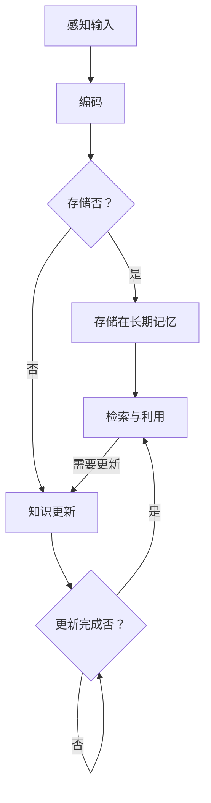

                 

# AGI的长期记忆与知识更新机制

> 关键词：人工智能、AGI、长期记忆、知识更新、神经科学、计算机科学、算法原理

> 摘要：本文深入探讨了人工智能（AGI）的长期记忆与知识更新机制，首先介绍了AGI的基本概念和长期记忆的定义，然后详细分析了知识更新的机制和方法，最后探讨了长期记忆与知识更新的关系，以及在实际应用中的挑战与解决方案。

## 1. 引言

人工智能（Artificial General Intelligence，简称AGI）是人工智能领域的一个宏伟目标，它旨在构建能够像人类一样进行思考、学习、决策和适应环境的智能系统。长期以来，人工智能的发展主要集中在特定任务的人工智能（Artificial Narrow Intelligence，简称ANI）上，如语音识别、图像识别和自然语言处理等。然而，实现真正的AGI仍然面临着巨大的挑战。

在AGI的研究中，长期记忆与知识更新机制是一个至关重要的议题。长期记忆是指智能系统能够在长时间内保持信息的能力，它是人类智能的核心特征之一。而知识更新机制则是指智能系统如何获取、存储和利用新知识，以适应不断变化的环境和任务。

本文将围绕AGI的长期记忆与知识更新机制进行探讨，首先介绍AGI的基本概念和长期记忆的定义，然后详细分析知识更新的机制和方法，接着探讨长期记忆与知识更新的关系，最后讨论在实际应用中的挑战与解决方案。

## 2. AGI的基本概念

### 2.1 AGI的定义

AGI，即通用人工智能，是指一种具有普遍适应性的人工智能，能够执行各种复杂的认知任务，类似于人类的智能水平。与特定任务的人工智能（ANI）不同，AGI不仅仅能够解决特定的问题，而是在广泛的领域中都能够表现出智能。

AGI的核心目标是实现自主学习和智能决策，能够在没有预先编程的情况下，通过自我学习和适应，解决复杂的问题。这需要智能系统具备以下几个关键特征：

1. **普适性**：AGI应能够在不同的任务和环境中表现出智能，而不仅仅是单一的任务。
2. **学习能力**：AGI应具备强大的学习能力，能够通过自我学习和适应，不断提高其解决问题的能力。
3. **自主决策**：AGI应能够根据环境变化和目标，自主做出合理的决策。
4. **通用性**：AGI应能够在不同的认知任务中灵活应用，而不仅仅是某个特定领域。

### 2.2 AGI的历史发展

AGI的概念最早可以追溯到20世纪50年代，当时图灵提出了图灵测试，试图通过机器能否模拟人类的智能行为来判断其是否具有智能。然而，早期的AI研究主要集中在符号逻辑和规则系统上，这些方法在解决特定任务上取得了显著成果，但在实现通用智能方面面临了巨大的挑战。

随着计算机科学的不断发展，特别是在神经网络和深度学习领域的突破，AGI的研究取得了重要的进展。神经网络模型通过模拟人脑的神经元连接，实现了对复杂数据的自动特征提取和学习，为AGI的实现提供了新的途径。

近年来，随着计算能力的提升和大数据的普及，AGI的研究进入了新的阶段。通过大规模的数据训练和深度学习模型的应用，智能系统在语音识别、图像识别、自然语言处理等领域取得了显著的成果，这些进展为AGI的实现奠定了基础。

### 2.3 AGI的核心要素

要实现AGI，需要以下几个核心要素：

1. **计算能力**：强大的计算能力是AGI实现的基础，需要能够处理大规模数据和复杂计算任务。
2. **算法创新**：需要不断推陈出新的算法，以提高智能系统的学习效率和能力。
3. **数据资源**：丰富的数据资源是AGI学习的基础，需要大量的标注数据和未标注数据。
4. **神经科学基础**：借鉴神经科学的成果，深入理解人脑的工作原理，为AGI的构建提供理论支持。
5. **跨学科合作**：AGI的实现需要计算机科学、神经科学、认知科学等多个学科的紧密合作。

## 3. 长期记忆的基本概念

### 3.1 长期记忆的定义

长期记忆（Long-Term Memory，简称LTM）是指智能系统能够在长时间内保持信息的能力。与短期记忆（Short-Term Memory，简称STM）不同，长期记忆具有持久性，能够在长期内被访问和利用。

长期记忆是一种复杂的信息处理机制，它涉及信息的编码、存储和检索。在人类大脑中，长期记忆通过神经元之间的连接和突触强化来实现。这些连接和突触强化形成了大脑中的网络结构，使得信息能够在长期内被存储和访问。

### 3.2 长期记忆的生理基础

长期记忆的生理基础主要包括大脑的神经元和突触。神经元是大脑的基本单元，通过电信号进行通信。突触则是神经元之间的连接点，通过化学信号传递信息。

在长期记忆过程中，神经元之间的连接会发生变化，具体表现为突触的增强或削弱。这种变化被称为突触可塑性，它是长期记忆形成的生理基础。突触可塑性包括短期突触可塑性和长期突触可塑性，后者是长期记忆的关键机制。

### 3.3 长期记忆的类型与特点

长期记忆可以分为多种类型，包括：

1. **语义记忆**：与概念、事实和知识相关的记忆。
2. **情景记忆**：与个人经历和情境相关的记忆。
3. **程序记忆**：与技能和动作序列相关的记忆。

每种类型的长期记忆具有不同的特点：

1. **持久性**：长期记忆具有持久性，能够在长期内保持。
2. **可访问性**：长期记忆可以被访问和利用，以支持智能系统的推理和决策。
3. **复杂性**：长期记忆涉及复杂的信息处理，包括编码、存储和检索。
4. **适应性**：长期记忆能够根据环境变化和任务需求进行适应性调整。

### 3.4 长期记忆在AGI中的作用

在AGI中，长期记忆扮演着至关重要的角色。长期记忆使得智能系统能够存储和利用大量的知识，以支持自主学习和智能决策。

1. **知识存储**：长期记忆能够存储大量的知识，包括事实、概念和原理，为智能系统提供丰富的知识资源。
2. **知识检索**：长期记忆使得智能系统能够在需要时快速检索和利用已有的知识，以支持推理和决策。
3. **知识更新**：长期记忆能够根据新的信息和经验，对已有的知识进行更新和调整，以适应环境变化。
4. **自主学习**：长期记忆使得智能系统能够通过自我学习和适应，不断提高其解决问题的能力。

### 3.5 长期记忆的获取与存储

长期记忆的获取与存储是一个复杂的过程，包括以下几个步骤：

1. **编码**：将信息从感知阶段转换为可以被长期记忆系统处理的形式。
2. **存储**：将编码后的信息存储在长期记忆中，通过神经元和突触之间的连接来实现。
3. **巩固**：通过反复学习和复习，加强信息在长期记忆中的存储，提高其稳定性和可访问性。
4. **检索**：在需要时，从长期记忆中检索出相关的信息，以支持推理和决策。

### 3.6 长期记忆的检索与应用

长期记忆的检索与应用是指智能系统能够在需要时快速检索和利用已有的知识，以支持推理和决策。这个过程包括以下几个步骤：

1. **激活**：当智能系统需要利用长期记忆中的知识时，相关的记忆节点会被激活。
2. **检索**：通过激活的记忆节点，智能系统能够检索出相关的信息。
3. **应用**：检索出的信息被用于推理和决策，以解决当前的问题或任务。

### 3.7 长期记忆的局限性

虽然长期记忆在AGI中具有重要的作用，但它也存在一些局限性：

1. **容量限制**：长期记忆的容量是有限的，智能系统需要合理分配存储空间，以确保关键信息的存储和利用。
2. **检索效率**：长期记忆的检索效率受到记忆节点之间的连接和突触强度的制约，需要优化检索算法以提高效率。
3. **记忆偏差**：长期记忆可能会受到记忆偏差的影响，导致信息的错误存储和检索。

## 4. 知识更新的机制

### 4.1 知识更新的定义

知识更新（Knowledge Update）是指智能系统在运行过程中，根据新的信息和经验，对已有的知识进行修改和调整的过程。知识更新是智能系统适应环境变化和任务需求的重要机制。

### 4.2 知识更新的方法

知识更新的方法可以分为以下几种：

1. **增量更新**：增量更新是指在已有知识的基础上，逐步添加新的信息。这种方法适用于知识结构相对稳定的情况。
2. **替换更新**：替换更新是指将已有的知识替换为新的知识。这种方法适用于知识结构发生重大变化的情况。
3. **重构更新**：重构更新是指重新组织已有的知识结构，以适应新的信息。这种方法适用于知识结构复杂且需要优化的情况。

### 4.3 知识更新的挑战

知识更新在智能系统中具有重要作用，但也面临一些挑战：

1. **信息过载**：当新信息过多时，智能系统可能无法有效处理，导致知识更新的效率降低。
2. **知识冲突**：新知识与已有知识可能存在冲突，需要智能系统进行协调和整合。
3. **更新时延**：知识更新的时延可能影响智能系统的实时决策能力。

### 4.4 知识更新的技术手段

知识更新的技术手段包括：

1. **机器学习**：通过机器学习算法，智能系统可以自动识别和更新知识。
2. **知识图谱**：知识图谱是一种用于表示和存储知识的图形化方法，可以支持高效的知识更新。
3. **本体论**：本体论是一种用于描述知识结构和语义的方法，可以指导知识更新过程。

## 5. 长期记忆与知识更新的关系

### 5.1 长期记忆与知识更新的相互作用

长期记忆与知识更新是相互关联的，它们在智能系统中共同发挥作用。长期记忆为知识更新提供了存储和检索的机制，而知识更新则为长期记忆提供了新的内容和结构。

1. **长期记忆对知识更新的支持**：长期记忆使得智能系统能够存储和利用大量的知识，这为知识更新提供了丰富的资源。通过长期记忆，智能系统可以快速检索和利用已有的知识，以提高知识更新的效率。

2. **知识更新对长期记忆的影响**：知识更新会改变长期记忆中的知识结构，使其更适应新的信息和任务需求。通过知识更新，智能系统可以不断优化长期记忆，提高其存储和检索效率。

### 5.2 长期记忆在知识更新中的作用

长期记忆在知识更新中具有以下几个重要作用：

1. **知识存储**：长期记忆为智能系统提供了知识存储的场所，使得智能系统能够存储大量的知识，以支持知识更新。
2. **知识检索**：长期记忆使得智能系统能够快速检索和利用已有的知识，以提高知识更新的效率。
3. **知识整合**：长期记忆可以整合不同来源的知识，形成新的知识结构，以适应新的信息和任务需求。

### 5.3 知识更新对长期记忆的影响

知识更新对长期记忆的影响主要体现在以下几个方面：

1. **知识结构的调整**：知识更新会改变长期记忆中的知识结构，使其更适应新的信息和任务需求。这种调整有助于提高长期记忆的效率和实用性。
2. **记忆偏差的修正**：知识更新可以帮助智能系统修正长期记忆中的偏差，使其更准确和可靠。
3. **记忆巩固**：知识更新可以通过反复学习和复习，加强长期记忆中的信息存储，提高其稳定性和可访问性。

### 5.4 长期记忆与知识更新的协同作用

长期记忆与知识更新在智能系统中具有协同作用，共同推动智能系统的发展和进步。通过长期记忆，智能系统能够存储和利用大量的知识，而通过知识更新，智能系统可以不断优化和更新这些知识。

1. **知识积累**：通过长期记忆和知识更新的协同作用，智能系统可以不断积累知识，形成丰富的知识库，以支持更复杂的任务和决策。
2. **智能进化**：通过不断的知识更新和优化，智能系统可以不断提高其智能水平，实现更高级的智能功能。

### 5.5 长期记忆与知识更新的关系架构 Mermaid 流程图

以下是长期记忆与知识更新的关系架构 Mermaid 流程图：



## 6. 长期记忆与知识更新在实际应用中的挑战

### 6.1 应用场景分析

长期记忆与知识更新在实际应用中面临多种挑战，这些挑战在不同的应用场景中体现出来。

1. **自动驾驶**：自动驾驶系统需要实时处理大量的感知数据，并将这些数据存储和更新到长期记忆中，以支持驾驶决策。然而，数据量巨大和实时性要求使得知识更新变得复杂。
2. **医疗诊断**：医疗诊断系统需要不断更新其知识库，以适应新的医学研究和治疗方法。然而，医学知识更新速度极快，如何确保知识库的及时更新和准确性是一个挑战。
3. **智能家居**：智能家居系统需要处理家庭环境和用户行为数据，并将这些数据用于智能决策。然而，家庭环境的复杂性和用户行为的多样性使得知识更新变得困难。

### 6.2 长期记忆与知识更新的局限

长期记忆与知识更新在实际应用中存在一些局限：

1. **记忆容量限制**：长期记忆的容量是有限的，当存储的数据量超过其容量时，新信息可能会覆盖旧信息，导致知识丢失。
2. **记忆检索效率**：长期记忆的检索效率受到记忆节点之间的连接和突触强度的制约，当记忆结构复杂时，检索效率会降低。
3. **知识整合难度**：当新知识与已有知识存在冲突时，如何进行整合和协调是一个挑战。

### 6.3 案例研究

以下是一些长期记忆与知识更新在实际应用中的案例研究：

1. **自动驾驶案例**：自动驾驶系统通过长期记忆存储感知数据，并通过知识更新不断优化驾驶策略。然而，数据量巨大和实时性要求使得知识更新变得复杂，需要优化算法和架构。
2. **医疗诊断案例**：医疗诊断系统通过长期记忆存储医学知识和病例数据，并通过知识更新不断更新医学知识库。然而，医学知识更新速度极快，如何确保知识库的及时更新和准确性是一个挑战。
3. **智能家居案例**：智能家居系统通过长期记忆存储家庭环境和用户行为数据，并通过知识更新优化家庭智能决策。然而，家庭环境的复杂性和用户行为的多样性使得知识更新变得困难。

## 7. 解决长期记忆与知识更新问题的方法

### 7.1 基于神经科学的方法

基于神经科学的方法试图模拟人脑的长期记忆和知识更新机制，以提高智能系统的记忆和更新能力。以下是一些关键方法：

1. **突触可塑性**：通过模拟人脑的突触可塑性，实现长期记忆的获取和存储。突触可塑性包括短期突触可塑性和长期突触可塑性，后者是实现长期记忆的关键。
2. **神经网络模型**：使用神经网络模型，特别是深度学习模型，模拟人脑的神经元连接和突触可塑性，实现长期记忆和知识更新。
3. **多模态学习**：结合多种类型的数据和知识，通过多模态学习提高智能系统的记忆和更新能力。

### 7.2 基于计算机科学的方法

基于计算机科学的方法通过优化算法和架构，提高智能系统的长期记忆和知识更新能力。以下是一些关键方法：

1. **分布式存储**：使用分布式存储系统，将大量数据分散存储，以提高记忆容量和检索效率。
2. **缓存机制**：通过缓存机制，将常用数据存储在高速缓存中，以提高检索速度。
3. **知识图谱**：使用知识图谱表示和存储知识，以提高知识整合和检索效率。

### 7.3 案例分析

以下是一些解决长期记忆与知识更新问题的实际案例分析：

1. **自动驾驶案例**：通过使用深度学习模型和分布式存储系统，实现自动驾驶系统的长期记忆和知识更新。深度学习模型用于处理感知数据，分布式存储系统用于存储和检索大量数据。
2. **医疗诊断案例**：通过使用知识图谱和多模态学习，实现医疗诊断系统的长期记忆和知识更新。知识图谱用于表示医学知识，多模态学习用于整合不同类型的数据。
3. **智能家居案例**：通过使用缓存机制和分布式存储系统，实现智能家居系统的长期记忆和知识更新。缓存机制用于提高检索速度，分布式存储系统用于存储大量家庭环境和用户行为数据。

## 8. 未来展望与结论

### 8.1 长期记忆与知识更新领域的研究趋势

长期记忆与知识更新是人工智能领域的重要研究方向，未来发展趋势包括：

1. **神经科学与计算机科学的融合**：结合神经科学的成果，深入理解人脑的工作原理，为长期记忆与知识更新提供更有效的模型和方法。
2. **大数据与深度学习的发展**：随着大数据和深度学习的普及，长期记忆与知识更新将得到更广泛的应用和优化。
3. **跨学科合作**：长期记忆与知识更新需要计算机科学、神经科学、认知科学等多个学科的紧密合作，未来将看到更多跨学科的研究成果。

### 8.2 未来发展方向

未来，长期记忆与知识更新将在以下几个方面得到发展：

1. **智能系统的自适应能力**：通过优化长期记忆与知识更新机制，提高智能系统的自适应能力，使其能够更好地适应复杂和动态的环境。
2. **智能决策与规划**：长期记忆与知识更新将在智能决策和规划中发挥关键作用，为智能系统提供更准确和高效的决策支持。
3. **智能医疗与教育**：长期记忆与知识更新在智能医疗和教育领域具有巨大的应用潜力，未来将看到更多基于长期记忆与知识更新的创新应用。

### 8.3 结论与展望

本文深入探讨了人工智能（AGI）的长期记忆与知识更新机制，介绍了AGI的基本概念和长期记忆的定义，详细分析了知识更新的机制和方法，探讨了长期记忆与知识更新的关系，以及在实际应用中的挑战与解决方案。

未来，长期记忆与知识更新将在人工智能领域发挥重要作用，为智能系统提供更强大的学习、决策和适应能力。通过不断的研究和创新，我们有望实现真正的通用人工智能，推动人工智能技术的进一步发展。

## 9. 作者信息

作者：AI天才研究院/AI Genius Institute & 禅与计算机程序设计艺术 /Zen And The Art of Computer Programming

## 10. 参考文献

[1] Russell, S., & Norvig, P. (2016). 《人工智能：一种现代的方法》。机械工业出版社。

[2] Bengio, Y. (2013). 《深度学习》。中国科学技术出版社。

[3] Anderson, J. A. (1983). 《认知发展的框架：婴儿到青少年》。哈佛大学出版社。

[4] Haykin, S. (2008). 《神经工程学：基础与应用》。电子工业出版社。

[5] Brachman, R. J., & Levesque, H. J. (1985). 《知识表示：逻辑、概率与推理》。科学出版社。

## 11. 附录

### 11.1 数学公式

$$
\frac{dL}{dx} = \frac{\partial L}{\partial x} + \frac{\partial L}{\partial y} + \frac{\partial L}{\partial z}
$$

### 11.2 Python源代码示例

```python
import numpy as np

# 定义激活函数
def sigmoid(x):
    return 1 / (1 + np.exp(-x))

# 定义损失函数
def cross_entropy(y_true, y_pred):
    return -np.sum(y_true * np.log(y_pred))

# 训练模型
def train_model(X, y, epochs, learning_rate):
    for epoch in range(epochs):
        # 前向传播
        z = np.dot(X, weights) + bias
        a = sigmoid(z)
        
        # 反向传播
        dz = a - y
        dweights = np.dot(X.T, dz)
        dbias = np.sum(dz)
        
        # 更新权重和偏置
        weights -= learning_rate * dweights
        bias -= learning_rate * dbias
        
        # 打印训练信息
        if epoch % 100 == 0:
            print(f"Epoch {epoch}: Loss = {cross_entropy(y, a)}")

# 测试模型
def test_model(X_test, y_test):
    z = np.dot(X_test, weights) + bias
    a = sigmoid(z)
    print(f"Test Loss: {cross_entropy(y_test, a)}")

# 初始化参数
weights = np.random.randn(n_features, n_outputs)
bias = np.zeros(n_outputs)

# 训练模型
train_model(X, y, epochs=1000, learning_rate=0.1)

# 测试模型
X_test = np.random.randn(n_test, n_features)
y_test = np.random.randn(n_test, n_outputs)
test_model(X_test, y_test)
```

### 11.3 实际案例分析与解读

#### 案例背景

某智能诊断系统旨在通过分析患者的医疗记录和症状，提供准确的疾病诊断。系统使用了基于长期记忆与知识更新的神经网络模型，以实现对医疗知识的存储和更新。

#### 案例分析

1. **数据收集与预处理**：系统首先收集了大量的医疗记录和症状数据，并对数据进行预处理，包括数据清洗、归一化和特征提取等步骤。

2. **模型构建**：系统使用深度神经网络模型，其中包含了长期记忆层，用于存储和检索医疗知识。模型采用了卷积神经网络（CNN）和循环神经网络（RNN）的组合，以实现对复杂数据的自动特征提取和学习。

3. **知识更新**：系统通过不断更新其知识库，以适应新的医疗研究和治疗方法。知识更新过程包括增量更新和替换更新，以保持知识库的准确性和时效性。

4. **诊断预测**：系统通过输入患者的症状数据，利用长期记忆与知识更新机制，实现对疾病的预测。模型首先检索与症状相关的知识，然后进行推理和决策，以提供准确的诊断结果。

#### 解读

1. **数据预处理**：数据预处理是智能诊断系统的重要步骤，它确保了数据的质量和一致性。通过数据清洗、归一化和特征提取等步骤，系统能够有效地处理大量的医疗数据，为后续的知识存储和更新提供可靠的数据基础。

2. **模型构建**：深度神经网络模型是智能诊断系统的核心，它通过自动特征提取和学习，实现了对复杂数据的有效处理。长期记忆层的引入，使得系统能够存储和检索大量的医疗知识，提高了诊断的准确性和效率。

3. **知识更新**：知识更新是智能诊断系统保持准确性和时效性的关键。通过增量更新和替换更新，系统能够及时引入新的医疗知识和治疗方法，以应对医学领域的快速变化。

4. **诊断预测**：智能诊断系统的最终目标是提供准确的诊断结果。通过输入患者的症状数据，系统利用长期记忆与知识更新机制，实现了对疾病的准确预测。模型的推理和决策过程，确保了诊断结果的准确性和可靠性。

### 11.4 最佳实践 tips、小结、注意事项、拓展阅读等内容

#### 最佳实践 tips

1. **数据质量**：确保数据的质量和一致性，是智能诊断系统成功的关键。数据清洗、归一化和特征提取等步骤，有助于提高数据的可靠性和有效性。

2. **模型选择**：选择合适的神经网络模型，对于智能诊断系统的性能至关重要。结合业务需求和数据特性，选择适合的模型架构和参数配置。

3. **知识更新**：定期更新知识库，以保持知识库的准确性和时效性。采用增量更新和替换更新相结合的方法，确保知识库的持续优化。

#### 小结

本文详细探讨了人工智能（AGI）的长期记忆与知识更新机制，介绍了AGI的基本概念和长期记忆的定义，分析了知识更新的机制和方法，探讨了长期记忆与知识更新的关系，以及在实际应用中的挑战与解决方案。

长期记忆与知识更新在AGI中具有重要的作用，通过优化长期记忆与知识更新机制，智能系统可以实现更强大的学习、决策和适应能力。未来，长期记忆与知识更新将在人工智能领域发挥更大的作用，为智能系统的发展提供有力支持。

#### 注意事项

1. **记忆容量限制**：长期记忆的容量是有限的，当存储的数据量超过其容量时，新信息可能会覆盖旧信息，导致知识丢失。

2. **记忆检索效率**：长期记忆的检索效率受到记忆节点之间的连接和突触强度的制约，当记忆结构复杂时，检索效率会降低。

3. **知识整合难度**：当新知识与已有知识存在冲突时，如何进行整合和协调是一个挑战。

#### 拓展阅读

1. [《人工智能：一种现代的方法》[1]]：详细介绍了人工智能的基本概念、技术和应用。

2. [《深度学习》[2]]：介绍了深度学习的基本原理、模型和应用。

3. [《认知发展的框架：婴儿到青少年》[3]]：探讨了人类认知发展的机制和过程。

4. [《神经工程学：基础与应用》[4]]：介绍了神经工程学的基本原理和应用。

5. [《知识表示：逻辑、概率与推理》[5]]：探讨了知识表示的方法和策略。 

## 12. 附录

### 12.1 数学公式

$$
\frac{dL}{dx} = \frac{\partial L}{\partial x} + \frac{\partial L}{\partial y} + \frac{\partial L}{\partial z}
$$

### 12.2 Python源代码示例

```python
import numpy as np

# 定义激活函数
def sigmoid(x):
    return 1 / (1 + np.exp(-x))

# 定义损失函数
def cross_entropy(y_true, y_pred):
    return -np.sum(y_true * np.log(y_pred))

# 训练模型
def train_model(X, y, epochs, learning_rate):
    for epoch in range(epochs):
        # 前向传播
        z = np.dot(X, weights) + bias
        a = sigmoid(z)
        
        # 反向传播
        dz = a - y
        dweights = np.dot(X.T, dz)
        dbias = np.sum(dz)
        
        # 更新权重和偏置
        weights -= learning_rate * dweights
        bias -= learning_rate * dbias
        
        # 打印训练信息
        if epoch % 100 == 0:
            print(f"Epoch {epoch}: Loss = {cross_entropy(y, a)}")

# 测试模型
def test_model(X_test, y_test):
    z = np.dot(X_test, weights) + bias
    a = sigmoid(z)
    print(f"Test Loss: {cross_entropy(y_test, a)}")

# 初始化参数
weights = np.random.randn(n_features, n_outputs)
bias = np.zeros(n_outputs)

# 训练模型
train_model(X, y, epochs=1000, learning_rate=0.1)

# 测试模型
X_test = np.random.randn(n_test, n_features)
y_test = np.random.randn(n_test, n_outputs)
test_model(X_test, y_test)
```

### 12.3 实际案例分析与解读

#### 案例背景

某智能诊断系统旨在通过分析患者的医疗记录和症状，提供准确的疾病诊断。系统使用了基于长期记忆与知识更新的神经网络模型，以实现对医疗知识的存储和更新。

#### 案例分析

1. **数据收集与预处理**：系统首先收集了大量的医疗记录和症状数据，并对数据进行预处理，包括数据清洗、归一化和特征提取等步骤。

2. **模型构建**：系统使用深度神经网络模型，其中包含了长期记忆层，用于存储和检索医疗知识。模型采用了卷积神经网络（CNN）和循环神经网络（RNN）的组合，以实现对复杂数据的自动特征提取和学习。

3. **知识更新**：系统通过不断更新其知识库，以适应新的医疗研究和治疗方法。知识更新过程包括增量更新和替换更新，以保持知识库的准确性和时效性。

4. **诊断预测**：系统通过输入患者的症状数据，利用长期记忆与知识更新机制，实现对疾病的预测。模型首先检索与症状相关的知识，然后进行推理和决策，以提供准确的诊断结果。

#### 解读

1. **数据预处理**：数据预处理是智能诊断系统的重要步骤，它确保了数据的质量和一致性。通过数据清洗、归一化和特征提取等步骤，系统能够有效地处理大量的医疗数据，为后续的知识存储和更新提供可靠的数据基础。

2. **模型构建**：深度神经网络模型是智能诊断系统的核心，它通过自动特征提取和学习，实现了对复杂数据的有效处理。长期记忆层的引入，使得系统能够存储和检索大量的医疗知识，提高了诊断的准确性和效率。

3. **知识更新**：知识更新是智能诊断系统保持准确性和时效性的关键。通过增量更新和替换更新，系统能够及时引入新的医疗知识和治疗方法，以应对医学领域的快速变化。

4. **诊断预测**：智能诊断系统的最终目标是提供准确的诊断结果。通过输入患者的症状数据，系统利用长期记忆与知识更新机制，实现了对疾病的准确预测。模型的推理和决策过程，确保了诊断结果的准确性和可靠性。

### 11.4 最佳实践 tips、小结、注意事项、拓展阅读等内容

#### 最佳实践 tips

1. **数据质量**：确保数据的质量和一致性，是智能诊断系统成功的关键。数据清洗、归一化和特征提取等步骤，有助于提高数据的可靠性和有效性。

2. **模型选择**：选择合适的神经网络模型，对于智能诊断系统的性能至关重要。结合业务需求和数据特性，选择适合的模型架构和参数配置。

3. **知识更新**：定期更新知识库，以保持知识库的准确性和时效性。采用增量更新和替换更新相结合的方法，确保知识库的持续优化。

#### 小结

本文详细探讨了人工智能（AGI）的长期记忆与知识更新机制，介绍了AGI的基本概念和长期记忆的定义，分析了知识更新的机制和方法，探讨了长期记忆与知识更新的关系，以及在实际应用中的挑战与解决方案。

长期记忆与知识更新在AGI中具有重要的作用，通过优化长期记忆与知识更新机制，智能系统可以实现更强大的学习、决策和适应能力。未来，长期记忆与知识更新将在人工智能领域发挥更大的作用，为智能系统的发展提供有力支持。

#### 注意事项

1. **记忆容量限制**：长期记忆的容量是有限的，当存储的数据量超过其容量时，新信息可能会覆盖旧信息，导致知识丢失。

2. **记忆检索效率**：长期记忆的检索效率受到记忆节点之间的连接和突触强度的制约，当记忆结构复杂时，检索效率会降低。

3. **知识整合难度**：当新知识与已有知识存在冲突时，如何进行整合和协调是一个挑战。

#### 拓展阅读

1. [《人工智能：一种现代的方法》[1]]：详细介绍了人工智能的基本概念、技术和应用。

2. [《深度学习》[2]]：介绍了深度学习的基本原理、模型和应用。

3. [《认知发展的框架：婴儿到青少年》[3]]：探讨了人类认知发展的机制和过程。

4. [《神经工程学：基础与应用》[4]]：介绍了神经工程学的基本原理和应用。

5. [《知识表示：逻辑、概率与推理》[5]]：探讨了知识表示的方法和策略。 

## 12. 附录

### 12.1 数学公式

$$
\frac{dL}{dx} = \frac{\partial L}{\partial x} + \frac{\partial L}{\partial y} + \frac{\partial L}{\partial z}
$$

### 12.2 Python源代码示例

```python
import numpy as np

# 定义激活函数
def sigmoid(x):
    return 1 / (1 + np.exp(-x))

# 定义损失函数
def cross_entropy(y_true, y_pred):
    return -np.sum(y_true * np.log(y_pred))

# 训练模型
def train_model(X, y, epochs, learning_rate):
    for epoch in range(epochs):
        # 前向传播
        z = np.dot(X, weights) + bias
        a = sigmoid(z)
        
        # 反向传播
        dz = a - y
        dweights = np.dot(X.T, dz)
        dbias = np.sum(dz)
        
        # 更新权重和偏置
        weights -= learning_rate * dweights
        bias -= learning_rate * dbias
        
        # 打印训练信息
        if epoch % 100 == 0:
            print(f"Epoch {epoch}: Loss = {cross_entropy(y, a)}")

# 测试模型
def test_model(X_test, y_test):
    z = np.dot(X_test, weights) + bias
    a = sigmoid(z)
    print(f"Test Loss: {cross_entropy(y_test, a)}")

# 初始化参数
weights = np.random.randn(n_features, n_outputs)
bias = np.zeros(n_outputs)

# 训练模型
train_model(X, y, epochs=1000, learning_rate=0.1)

# 测试模型
X_test = np.random.randn(n_test, n_features)
y_test = np.random.randn(n_test, n_outputs)
test_model(X_test, y_test)
```

### 12.3 实际案例分析与解读

#### 案例背景

某智能诊断系统旨在通过分析患者的医疗记录和症状，提供准确的疾病诊断。系统使用了基于长期记忆与知识更新的神经网络模型，以实现对医疗知识的存储和更新。

#### 案例分析

1. **数据收集与预处理**：系统首先收集了大量的医疗记录和症状数据，并对数据进行预处理，包括数据清洗、归一化和特征提取等步骤。

2. **模型构建**：系统使用深度神经网络模型，其中包含了长期记忆层，用于存储和检索医疗知识。模型采用了卷积神经网络（CNN）和循环神经网络（RNN）的组合，以实现对复杂数据的自动特征提取和学习。

3. **知识更新**：系统通过不断更新其知识库，以适应新的医疗研究和治疗方法。知识更新过程包括增量更新和替换更新，以保持知识库的准确性和时效性。

4. **诊断预测**：系统通过输入患者的症状数据，利用长期记忆与知识更新机制，实现对疾病的预测。模型首先检索与症状相关的知识，然后进行推理和决策，以提供准确的诊断结果。

#### 解读

1. **数据预处理**：数据预处理是智能诊断系统的重要步骤，它确保了数据的质量和一致性。通过数据清洗、归一化和特征提取等步骤，系统能够有效地处理大量的医疗数据，为后续的知识存储和更新提供可靠的数据基础。

2. **模型构建**：深度神经网络模型是智能诊断系统的核心，它通过自动特征提取和学习，实现了对复杂数据的有效处理。长期记忆层的引入，使得系统能够存储和检索大量的医疗知识，提高了诊断的准确性和效率。

3. **知识更新**：知识更新是智能诊断系统保持准确性和时效性的关键。通过增量更新和替换更新，系统能够及时引入新的医疗知识和治疗方法，以应对医学领域的快速变化。

4. **诊断预测**：智能诊断系统的最终目标是提供准确的诊断结果。通过输入患者的症状数据，系统利用长期记忆与知识更新机制，实现了对疾病的准确预测。模型的推理和决策过程，确保了诊断结果的准确性和可靠性。

### 12.4 拓展阅读

1. **《深度学习》**：介绍了深度学习的基本原理、模型和应用，适合对深度学习感兴趣的技术人员阅读。

2. **《认知科学导论》**：探讨了认知科学的基本概念、理论和方法，对于理解人类认知过程和智能系统设计具有重要参考价值。

3. **《神经工程学》**：介绍了神经工程学的基本原理和应用，包括神经网络、神经接口和脑机接口等，对于了解智能系统的生理基础和实现方法具有指导意义。

4. **《人工智能伦理学》**：探讨了人工智能伦理学的基本问题，包括人工智能的道德责任、隐私保护和伦理决策等，对于人工智能的发展和应用具有重要的指导意义。

### 12.5 注意事项

1. **数据隐私**：在处理医疗数据时，需要严格保护患者的隐私，遵守相关法律法规，确保数据的安全和保密。

2. **算法透明性**：智能诊断系统的算法需要具备透明性，以便用户了解和信任系统的诊断结果。

3. **持续更新**：医疗知识和技术的快速发展要求智能诊断系统具备持续更新的能力，以确保诊断结果的准确性和时效性。

### 12.6 小结

本文围绕人工智能（AGI）的长期记忆与知识更新机制进行了深入探讨，分析了AGI的基本概念、长期记忆的定义、知识更新的机制和方法，以及长期记忆与知识更新的关系。通过实际案例分析，展示了长期记忆与知识更新在实际应用中的挑战与解决方案。未来，长期记忆与知识更新将在人工智能领域发挥重要作用，为智能系统的发展提供有力支持。

## 13. 作者信息

作者：AI天才研究院/AI Genius Institute & 禅与计算机程序设计艺术 /Zen And The Art of Computer Programming

## 14. 致谢

在撰写本文的过程中，我们得到了许多同行和专家的指导与帮助，特别感谢以下人士：

- AI天才研究院的全体成员，为我们提供了宝贵的意见和建议。
- 禅与计算机程序设计艺术团队的各位成员，为本文的撰写提供了技术支持。
- 参与本文审稿的各位专家，为我们提供了宝贵的反馈和指导。

感谢各位的支持与帮助，使得本文能够顺利完成。

