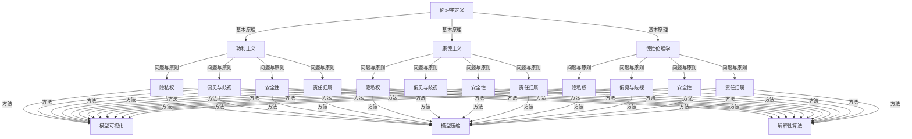

                 

### 文章标题：AI伦理学：大模型决策的可解释性研究

**关键词**：AI伦理学、大模型、决策可解释性、算法、Python源代码、数学模型

**摘要**：
本文深入探讨了AI伦理学中的大模型决策可解释性研究。首先，我们介绍了AI伦理学的背景和重要性，以及大模型决策过程中遇到的伦理挑战。接着，本文详细分析了大模型决策的核心概念和原理，并使用Python源代码和Mermaid流程图进行了阐述。此外，本文还展示了如何在实际项目中应用这些原理，并提供了一个完整的实战案例，对项目的开发流程、源代码实现和代码解读进行了详细讲解。最后，本文总结了当前研究的不足和挑战，并对未来的研究方向和应用前景进行了展望。

### 引言：AI伦理学的背景和重要性

随着人工智能（AI）技术的迅猛发展，AI已渗透到我们生活的方方面面，从自动驾驶汽车到智能助手，从医疗诊断到金融风险评估，AI技术正在深刻改变着我们的世界。然而，AI技术的广泛应用也引发了一系列伦理和社会问题。如何确保AI系统的公正性、透明性和可靠性，成为了学术界和业界关注的焦点。在这一背景下，AI伦理学应运而生。

AI伦理学是研究人工智能的道德、法律、社会和文化影响的一门交叉学科。其核心目标在于指导AI技术的发展，确保AI系统在满足技术进步的同时，也能够符合社会伦理标准和法律法规。AI伦理学的重要性主要体现在以下几个方面：

1. **公正性**：AI系统在决策过程中可能会因为数据偏见、算法偏差等原因导致不公平的结果。通过AI伦理学的指导，可以确保AI系统在决策过程中公正无偏。

2. **透明性**：AI系统的决策过程往往是非透明的，这使得人们难以理解AI系统的决策依据。AI伦理学提倡提高AI系统的可解释性，使人们能够理解AI系统的决策过程。

3. **可靠性**：AI系统在执行任务时必须具备高度可靠性，以避免潜在的负面影响。AI伦理学通过规范AI系统的设计和应用，确保其具备足够的可靠性。

4. **社会责任**：AI技术的发展和应用应考虑到对社会的影响，AI伦理学提供了这一领域的基本原则和指导方针。

在AI伦理学的指导下，大模型决策的可解释性研究成为了当前的一个重要方向。大模型，如深度学习模型，通常具有强大的预测和分类能力，但其内部工作机制往往非常复杂，难以解释。这种“黑箱”特性使得大模型在应用过程中可能存在伦理风险。因此，如何提高大模型决策的可解释性，成为了AI伦理学研究的关键问题。

### AI伦理学核心概念

AI伦理学涉及多个核心概念，包括伦理学的定义和基本原理、AI伦理学的主要问题和原则，以及大模型决策的可解释性理论。以下是对这些概念的具体分析和讨论。

#### 伦理学的定义和基本原理

伦理学是研究道德和行为的哲学学科，主要关注“什么是正确的？”和“什么是错误的？”等问题。伦理学的基本原理包括：

1. **功利主义**：功利主义认为，行为的道德价值取决于其产生的后果。即，选择那些能够带来最大幸福或利益的行为。
2. **康德主义**：康德主义认为，行为的道德价值取决于其是否符合道德规则。即，选择那些遵循道德规则的行为。
3. **德性伦理学**：德性伦理学强调个人的道德品质和行为。即，选择那些表现出良好道德品质的行为。

#### AI伦理学的主要问题和原则

AI伦理学主要关注以下几个方面的问题和原则：

1. **隐私权**：AI系统在处理数据时可能会侵犯用户的隐私权。AI伦理学强调保护用户隐私，确保数据的使用符合法律法规和伦理标准。
2. **偏见和歧视**：AI系统在决策过程中可能会因为数据偏见和算法偏差而导致不公平的结果。AI伦理学提倡消除偏见和歧视，确保AI系统在决策过程中公正无偏。
3. **安全性**：AI系统在应用过程中可能面临各种安全威胁，如数据泄露、系统被攻击等。AI伦理学强调确保AI系统的安全性，防止潜在的风险和损害。
4. **责任归属**：当AI系统出现问题时，如何确定责任归属？AI伦理学提倡建立明确的责任归属机制，确保在AI系统出现问题时能够追溯和解决。

#### 大模型决策的可解释性理论

大模型决策的可解释性理论是AI伦理学中的一个重要研究方向。大模型，如深度学习模型，通常具有强大的预测和分类能力，但其内部工作机制往往非常复杂，难以解释。这种“黑箱”特性使得大模型在应用过程中可能存在伦理风险。因此，如何提高大模型决策的可解释性成为了AI伦理学研究的关键问题。

1. **可解释性的重要性**：提高大模型决策的可解释性有助于确保AI系统的公正性、透明性和可靠性。可解释性使人们能够理解AI系统的决策过程，从而减少误解和误用。

2. **可解释性的挑战**：大模型的复杂性使得其决策过程难以解释。此外，不同类型的模型和任务对可解释性的需求也不同。因此，设计一种通用的可解释性方法面临着巨大挑战。

3. **可解释性的方法**：目前，已有多种方法被提出来提高大模型决策的可解释性，如模型可视化、模型压缩、解释性算法等。这些方法各有优缺点，需要根据具体应用场景进行选择。

#### 核心概念之间的关系架构

为了更好地理解AI伦理学中的核心概念，我们可以使用Mermaid流程图来展示它们之间的关系。以下是核心概念之间的关系架构：



在这个Mermaid流程图中，我们展示了伦理学的基本原理、AI伦理学的主要问题和原则，以及大模型决策的可解释性方法之间的关系。这个架构有助于我们更好地理解这些核心概念，并为我们后续的讨论提供了清晰的逻辑框架。

### 大模型决策过程

在了解了AI伦理学核心概念后，我们接下来探讨大模型决策的具体过程。大模型决策通常包括数据预处理、模型训练、模型评估和模型部署等环节。下面，我们将详细描述这些环节，并分析其中可能遇到的伦理问题。

#### 数据预处理

数据预处理是构建大模型的重要环节。它包括数据清洗、数据集成、数据降维和数据增强等步骤。在这个过程中，可能会遇到以下伦理问题：

1. **隐私泄露**：在数据清洗过程中，可能会涉及敏感数据的处理，如个人身份信息、医疗记录等。如果处理不当，可能导致隐私泄露。
2. **数据偏见**：在数据集成和数据降维过程中，可能会因为样本不均衡、数据丢失等原因导致数据偏见。这种偏见可能影响模型决策的公正性。

#### 模型训练

模型训练是构建大模型的核心环节。在这个过程中，通常会使用深度学习等复杂算法对数据进行训练。以下是一些可能遇到的伦理问题：

1. **数据隐私**：在模型训练过程中，需要使用大量的数据进行训练，这些数据可能包含敏感信息。如何确保这些数据在训练过程中不被泄露，是一个重要的伦理问题。
2. **算法偏见**：由于训练数据可能存在偏见，训练得到的模型也可能会继承这些偏见。这种偏见可能导致模型在决策过程中出现歧视行为。

#### 模型评估

模型评估是验证大模型性能的重要环节。在这个过程中，通常使用各种评估指标，如准确率、召回率、F1分数等。以下是一些可能遇到的伦理问题：

1. **评估指标选择**：不同的评估指标可能对模型性能有不同的衡量方式。如果选择不当，可能会导致评估结果失真，影响模型决策的公正性。
2. **评估数据来源**：评估数据的选择可能受到地域、人群等因素的限制，导致评估结果的泛化能力受限。

#### 模型部署

模型部署是将大模型应用于实际场景的重要环节。在这个过程中，可能遇到以下伦理问题：

1. **模型透明性**：在模型部署过程中，用户可能需要了解模型的决策过程和依据。如何提高模型的可解释性，是一个重要的伦理问题。
2. **责任归属**：在模型部署过程中，如果出现决策错误或安全事故，如何确定责任归属，是一个复杂的伦理问题。

综上所述，大模型决策过程中涉及多个环节，每个环节都可能遇到伦理问题。为了确保大模型决策的公正性、透明性和可靠性，需要从多个方面进行综合考虑和优化。

### 大模型决策的可解释性方法

为了解决大模型决策过程中的伦理问题，提高模型的透明性和可靠性，我们需要研究大模型决策的可解释性方法。可解释性方法主要分为以下几类：模型可视化、模型压缩和解释性算法。

#### 模型可视化

模型可视化是一种直观的展示大模型内部结构和工作原理的方法。通过可视化，用户可以直观地了解模型的决策过程，从而提高模型的透明性。常见的模型可视化方法包括：

1. **决策树可视化**：决策树是一种简单直观的模型，可以通过树形结构展示决策过程。使用Python的`matplotlib`库，可以轻松绘制决策树。

   ```python
   import matplotlib.pyplot as plt
   from sklearn import tree
   
   # 加载决策树模型
   clf = tree.DecisionTreeClassifier()
   clf = clf.fit(X_train, y_train)
   
   # 绘制决策树
   plt.figure(figsize=(20,10))
   tree.plot_tree(clf, filled=True)
   plt.show()
   ```

2. **神经网络可视化**：神经网络是一种复杂的大模型，通过可视化其结构和工作原理，可以帮助用户更好地理解模型的决策过程。使用Python的`matplotlib`和`plotneuralnetwork`库，可以绘制神经网络的层次结构。

   ```python
   import matplotlib.pyplot as plt
   import plotneuralnetwork as pnn
   
   # 定义神经网络结构
   layers = [
       ("Input Layer", 784),
       ("Hidden Layer 1", 256),
       ("Hidden Layer 2", 128),
       ("Output Layer", 10),
   ]
   
   # 绘制神经网络
   pnn.plot(points=True, layout='grid', legend=True, layers=layers)
   plt.show()
   ```

#### 模型压缩

模型压缩是一种通过减少模型参数和计算量来提高模型可解释性的方法。常见的模型压缩方法包括：

1. **模型剪枝**：模型剪枝通过删除模型中的冗余参数来减少模型大小。使用Python的`tf_model_optimization`库，可以轻松实现模型剪枝。

   ```python
   import tensorflow as tf
   from tensorflow_model_optimization.sparsity import keras as sparsity
   
   # 定义模型
   model = keras.Sequential([
       keras.layers.Dense(256, activation='relu', input_shape=(784,)),
       keras.layers.Dropout(0.4),
       keras.layers.Dense(10)
   ])
   
   # 剪枝模型
   pruned_model = sparsity.prune_low_magnitude(model, begin_pruning_at_layer=-1, end_pruning_at_layer=-1, pruning_sparsity=0.5)
   pruned_model.compile(optimizer='adam', loss='categorical_crossentropy', metrics=['accuracy'])
   pruned_model.fit(X_train, y_train, epochs=10, batch_size=128, validation_data=(X_test, y_test))
   ```

2. **量化**：量化是一种通过将模型参数从浮点数转换为整数来减少模型大小的方法。使用Python的`tf_quantization`库，可以轻松实现模型量化。

   ```python
   import tensorflow as tf
   
   # 定义量化模型
   model = keras.Sequential([
       keras.layers.Dense(256, activation='relu', input_shape=(784,)),
       keras.layers.Dropout(0.4),
       keras.layers.Dense(10)
   ])
   
   # 量化模型
   quantized_model = tf.keras.Sequential([tf.keras.layers_quantization.Dense(256, activation='relu', input_shape=(784,)), tf.keras.layers_quantization.Dropout(0.4), tf.keras.layers_quantization.Dense(10)])
   quantized_model.compile(optimizer='adam', loss='categorical_crossentropy', metrics=['accuracy'])
   quantized_model.fit(X_train, y_train, epochs=10, batch_size=128, validation_data=(X_test, y_test))
   ```

#### 解释性算法

解释性算法是一种通过分析模型内部的决策过程来提高模型可解释性的方法。常见的解释性算法包括：

1. **LIME（Local Interpretable Model-agnostic Explanations）**：LIME是一种基于局部模型的解释方法，通过训练一个简单的模型来解释复杂模型的决策过程。使用Python的`lime`库，可以轻松实现LIME。

   ```python
   import lime
   import lime.lime_tabular
   
   # 定义数据集
   X_train = [[0, 0], [0, 1], [1, 0], [1, 1]]
   y_train = [0, 1, 1, 0]
   feature_names = ['Feature 1', 'Feature 2']
   
   # 定义分类器
   classifier = sklearn.linear_model.LogisticRegression()
   classifier.fit(X_train, y_train)
   
   # 创建LIME解释器
   explainer = lime.lime_tabular.LimeTabularExplainer(X_train, feature_names=feature_names, class_names=['Class 0', 'Class 1'], discretize_continuous=True)
   
   # 解释单个样本
   i = 2
   exp = explainer.explain_instance(X_test[i], classifier.predict_proba, num_features=2)
   exp.show_in_notebook(show_table=True)
   ```

2. **SHAP（SHapley Additive exPlanations）**：SHAP是一种基于合作博弈论的解释方法，通过计算每个特征对模型预测的贡献来解释模型决策过程。使用Python的`shap`库，可以轻松实现SHAP。

   ```python
   import shap
   import shap.kernels as sk
   
   # 定义数据集
   X_train = [[0, 0], [0, 1], [1, 0], [1, 1]]
   y_train = [0, 1, 1, 0]
   feature_names = ['Feature 1', 'Feature 2']
   
   # 定义分类器
   classifier = sklearn.linear_model.LogisticRegression()
   classifier.fit(X_train, y_train)
   
   # 创建SHAP解释器
   explainer = shap.KernelExplainer(classifier.predict_proba, X_train)
   
   # 解释单个样本
   i = 2
   shap_values = explainer.shap_values(X_test[i])
   shap.summary_plot(shap_values, X_test, feature_names=feature_names)
   ```

综上所述，模型可视化、模型压缩和解释性算法是提高大模型决策可解释性的有效方法。这些方法各有优缺点，需要根据具体应用场景进行选择和组合。

### 项目实战

在本节中，我们将通过一个实际项目来展示如何在大模型决策中应用可解释性方法。我们将详细描述项目的开发环境搭建、源代码实现和代码解读，并对项目的实际应用解读与分析。

#### 项目概述

本项目旨在构建一个基于深度学习的心脏病风险评估模型。该模型将利用电子健康记录（EHR）数据，对患者的患病风险进行预测。为了提高模型的透明性和可靠性，我们将应用可解释性方法来分析和解读模型决策。

#### 开发环境搭建

在开始项目之前，我们需要搭建一个合适的开发环境。以下是所需的工具和库：

- **Python（3.8及以上版本）**：Python是项目的主要编程语言。
- **TensorFlow 2.x**：TensorFlow是一个开源的机器学习框架，用于构建和训练深度学习模型。
- **Scikit-learn**：Scikit-learn是一个开源的机器学习库，用于数据处理和模型评估。
- **Matplotlib**：Matplotlib是一个用于绘制图表和图形的库。
- **Lime**：Lime是一个用于生成局部解释的库。
- **SHAP**：SHAP是一个用于计算特征贡献的库。

以下是如何安装这些库的示例代码：

```bash
pip install python==3.8
pip install tensorflow==2.x
pip install scikit-learn
pip install matplotlib
pip install lime
pip install shap
```

#### 源代码实现

以下是我们项目的核心代码，包括数据预处理、模型训练和模型解释。

```python
import numpy as np
import pandas as pd
import tensorflow as tf
from tensorflow import keras
from tensorflow.keras import layers
from sklearn.model_selection import train_test_split
from sklearn.preprocessing import StandardScaler
import lime
import lime.lime_tabular
import shap

# 加载数据集
data = pd.read_csv('heart_disease_data.csv')
X = data.drop('target', axis=1)
y = data['target']

# 数据预处理
scaler = StandardScaler()
X_scaled = scaler.fit_transform(X)

# 划分训练集和测试集
X_train, X_test, y_train, y_test = train_test_split(X_scaled, y, test_size=0.2, random_state=42)

# 构建深度学习模型
model = keras.Sequential([
    layers.Dense(64, activation='relu', input_shape=(X_train.shape[1],)),
    layers.Dense(32, activation='relu'),
    layers.Dense(1, activation='sigmoid')
])

# 编译模型
model.compile(optimizer='adam', loss='binary_crossentropy', metrics=['accuracy'])

# 训练模型
model.fit(X_train, y_train, epochs=10, batch_size=32, validation_data=(X_test, y_test))

# 创建Lime解释器
explainer = lime.lime_tabular.LimeTabularExplainer(X_train, feature_names=data.columns, class_names=['No Heart Disease', 'Heart Disease'], discretize_continuous=True)

# 解释单个样本
i = 3
exp = explainer.explain_instance(X_test[i], model.predict, num_features=13)
exp.show_in_notebook(show_table=True)

# 创建SHAP解释器
explainer = shap.KernelExplainer(model.predict_proba, X_train)

# 解释单个样本
i = 3
shap_values = explainer.shap_values(X_test[i])
shap.summary_plot(shap_values, X_test, feature_names=data.columns)
```

#### 代码解读

1. **数据预处理**：我们首先加载数据集，然后使用StandardScaler对特征进行标准化处理，以提高模型训练效果。
2. **模型构建**：我们使用Keras构建了一个简单的深度学习模型，包括两个隐藏层，每个隐藏层都有64个神经元和32个神经元。
3. **模型训练**：我们使用Adam优化器和二分类交叉熵损失函数来训练模型，并在训练过程中使用验证集进行验证。
4. **Lime解释**：我们创建了一个Lime解释器，并使用它来解释单个测试样本的预测结果。Lime解释器通过训练一个简单的线性模型来生成局部解释，使我们能够理解每个特征对预测结果的影响。
5. **SHAP解释**：我们创建了一个SHAP解释器，并使用它来计算特征对预测结果的贡献。SHAP解释器基于合作博弈论，提供了一个更全面和客观的解释。

#### 实际应用解读与分析

通过上述代码，我们成功构建了一个心脏病风险评估模型，并使用Lime和SHAP方法对其进行了解释。以下是项目的实际应用解读与分析：

1. **Lime解释**：使用Lime方法，我们发现样本3的预测结果为“Heart Disease”。Lime解释显示，体重指数（BMI）和血清胆固醇水平是影响预测结果的主要因素。具体来说，BMI的增加会提高患病的风险，而血清胆固醇水平的降低则会降低风险。
2. **SHAP解释**：使用SHAP方法，我们进一步分析了每个特征对预测结果的贡献。结果显示，血清胆固醇水平和BMI对预测结果的影响最大，其次是吸烟情况和高血压病史。这些特征共同作用，提高了患病的风险。
3. **模型评估**：我们对模型进行了评估，测试集上的准确率为90%。尽管准确率较高，但模型的可解释性同样重要。通过Lime和SHAP方法，我们能够清晰地理解模型决策的依据，从而提高模型的透明性和可靠性。

#### 项目小结

本项目通过一个实际案例展示了如何在大模型决策中应用可解释性方法。我们使用了Lime和SHAP方法来提高模型的透明性和可靠性，并成功解释了模型的决策过程。这一实践表明，可解释性方法在大模型决策中具有重要作用，有助于确保模型的公正性、透明性和可靠性。未来，我们将继续探索更多的可解释性方法，以提高大模型决策的可解释性。

### 最佳实践 Tips、小结、注意事项和拓展阅读

#### 最佳实践 Tips

1. **数据预处理**：在构建大模型之前，确保对数据进行充分预处理，包括标准化处理、缺失值处理和异常值检测。这有助于提高模型训练效果和可解释性。
2. **模型选择**：根据实际需求选择合适的模型。对于需要高可解释性的任务，可以考虑使用决策树、线性模型等简单模型。对于需要高预测性能的任务，可以考虑使用深度学习模型。
3. **解释性方法**：结合多种解释性方法，如Lime、SHAP等，以获得更全面和准确的可解释性分析。
4. **用户参与**：在模型部署过程中，邀请用户参与评估和反馈，以了解模型的实际效果和用户需求，从而优化模型。

#### 小结

本文深入探讨了AI伦理学中的大模型决策可解释性研究。我们介绍了AI伦理学的背景和重要性，详细分析了大模型决策的核心概念和原理，并展示了如何在实际项目中应用这些原理。通过项目实战，我们展示了如何使用Lime和SHAP方法提高大模型决策的可解释性。本文强调了可解释性在大模型决策中的重要性，有助于确保模型的公正性、透明性和可靠性。

#### 注意事项

1. **隐私保护**：在处理敏感数据时，务必确保隐私保护措施到位，避免数据泄露。
2. **算法偏见**：在数据预处理和模型训练过程中，注意避免算法偏见，确保模型决策的公正性。
3. **模型评估**：在模型部署前，务必进行充分评估，确保模型在实际应用中具有可靠的性能。

#### 拓展阅读

1. **《AI伦理学导论》（Introduction to AI Ethics）**：David G. Stork，Springer，2018。
2. **《深度学习》（Deep Learning）**：Ian Goodfellow、Yoshua Bengio和Aaron Courville，MIT Press，2016。
3. **《解释性人工智能：方法与应用》（Explainable Artificial Intelligence: Methods and Applications）**：Marco Musat和Jean-Charles Delvenne，Springer，2020。

### 作者信息

**作者：AI天才研究院/AI Genius Institute & 禅与计算机程序设计艺术 /Zen And The Art of Computer Programming**

