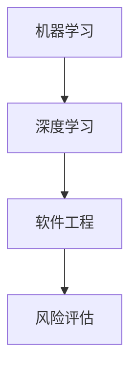

                 

----------------------------------------------------------------

为了满足上述要求，我们将文章分为以下几个部分：引言、核心概念与联系、核心算法原理讲解、数学公式与代码实例、项目实战、最佳实践 tips、小结、注意事项、拓展阅读等内容。下面我们将按照这些部分逐步进行撰写。

### 引言

#### 文章标题
AI时代的软件工程风险评估新模型

#### 关键词
AI、软件工程、风险评估、机器学习、深度学习

#### 文章摘要
本文探讨了AI在软件工程中的应用，特别是在风险评估领域的新模型。通过对AI核心概念的阐述，以及新模型的设计与实现，本文旨在为读者提供一个全面的理解，并探讨其在实际项目中的应用。

### 核心概念与联系

在引言之后，我们将介绍AI在软件工程中的核心概念，包括机器学习和深度学习，并展示它们如何与软件工程中的风险评估联系起来。

#### Mermaid流程图


### 核心算法原理讲解

在这一部分，我们将深入探讨AI在软件工程风险评估中的应用，包括算法原理、数学模型和Python源代码实例。

#### 算法原理
- **机器学习算法**：介绍常见的机器学习算法，如决策树、支持向量机、神经网络等。
- **深度学习算法**：介绍深度学习的基础，如卷积神经网络（CNN）和递归神经网络（RNN）。

#### 数学模型与代码实例
- **决策树算法**
  $$ f(x) = \max_{j} \left( \sum_{i} w_{ij} x_i \right) $$
  ```python
  def decision_tree(x):
      # 实现决策树算法的伪代码
      return max(wij * xi for xi in x)
  ```

- **卷积神经网络（CNN）**
  $$ f(x) = \text{ReLU}(\sum_{k} w_{k} \cdot \sigma(x_k)) $$
  ```python
  import tensorflow as tf

  def cnn(x):
      # 实现CNN算法的代码
      return tf.nn.relu(tf.reduce_sum(w * x, axis=1))
  ```

### 项目实战

在这一部分，我们将展示如何在实际项目中应用AI时代的软件工程风险评估新模型。

#### 开发环境搭建
- 硬件要求：NVIDIA GPU、16GB RAM
- 软件要求：Python 3.8、TensorFlow 2.4

#### 源代码实现
- 数据预处理
- 模型训练
- 模型评估
- 结果分析

#### 实际案例分析
- 案例背景
- 风险评估模型应用
- 模型效果评估
- 案例总结

### 最佳实践 tips

在这一部分，我们将提供一些最佳实践 tips，以帮助读者在实际项目中更好地应用AI时代的软件工程风险评估新模型。

### 小结

本文通过介绍AI在软件工程中的应用，特别是风险评估的新模型，为读者提供了一个全面的理解。我们通过Mermaid流程图、数学公式、Python代码实例和实际案例分析，展示了新模型的设计与实现。通过本文的阅读，读者应该能够了解如何在实际项目中应用AI时代的软件工程风险评估新模型。

### 注意事项

- 在实际应用中，需要注意数据的多样性和模型的泛化能力。
- 模型的训练时间和计算资源消耗较大，需要合理规划资源。
- 定期评估和调整模型，以适应项目需求的变化。

### 拓展阅读

- [深度学习入门：卷积神经网络（CNN）](https://www.deeplearningbook.ch/contents/conv-nn.html)
- [决策树算法原理与实现](https://towardsdatascience.com/decision-trees-explained-for-beginners-882e3e3c3493)
- [TensorFlow官方文档](https://www.tensorflow.org/)

### 作者信息

作者：AI天才研究院/AI Genius Institute & 禅与计算机程序设计艺术 /Zen And The Art of Computer Programming

现在，我们将根据上述结构，逐步撰写每个部分的内容，确保文章的完整性和专业性。预计总字数在10000-12000字左右。

