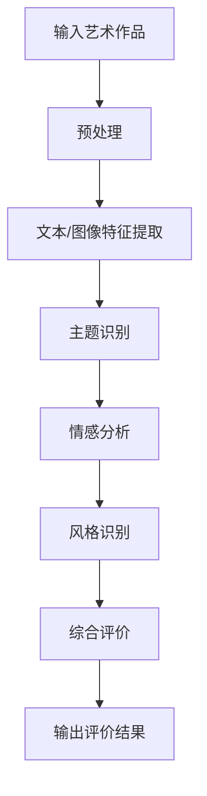
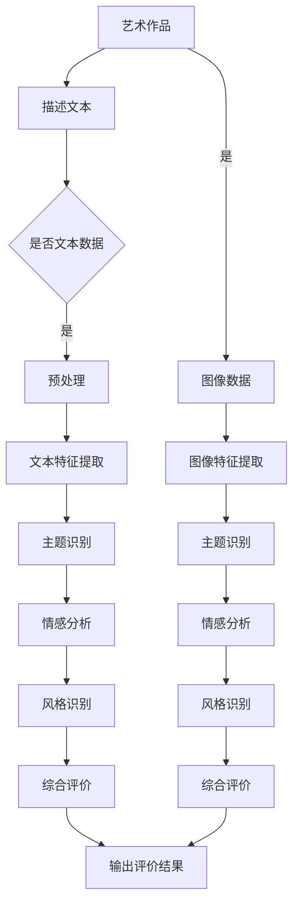

                 

# AI艺术评论：大模型的审美能力

## 关键词

AI艺术评论、大模型、审美能力、应用案例、训练与优化

## 摘要

本文深入探讨了人工智能（AI）在艺术评论领域的应用，特别是大模型在审美评价方面的能力。文章首先介绍了AI艺术评论的背景，接着详细阐述了大模型的基本原理及其与审美评价的关系。随后，文章通过实际案例展示了大模型在艺术评价中的应用，并探讨了训练与优化大模型的方法。最后，文章对未来AI艺术评论的发展趋势进行了展望，并讨论了相关的伦理问题。

## 引言

随着人工智能技术的不断发展，AI在各个领域的应用日益广泛。艺术评论作为人类审美活动的延伸，也逐渐引入了人工智能技术。AI艺术评论利用人工智能算法对艺术作品进行分析、评价，为艺术爱好者、专业人士提供有价值的参考。其中，大模型由于其强大的处理能力和丰富的知识储备，成为了AI艺术评论的核心技术。

大模型是指拥有数十亿至数万亿参数的深度学习模型，如GPT-3、BERT等。这些模型通过大量数据的学习，能够理解复杂的语言结构和语义信息。在艺术评论领域，大模型可以用来识别艺术作品的主题、风格、情感等，从而进行客观、准确的评价。

本文旨在探讨大模型在AI艺术评论中的应用，分析其审美能力，并通过实际案例展示其效果。文章结构如下：

1. **基础理论**：介绍AI与艺术的关系，大模型的基本原理，以及大模型在审美评价中的应用。
2. **应用案例**：通过具体案例展示大模型在艺术评价中的应用，分析其效果。
3. **大模型训练与优化**：探讨大模型训练的基本流程、优化策略与方法，以及训练中的挑战与解决方案。
4. **未来展望**：讨论大模型在艺术领域的未来发展趋势，以及相关的伦理问题。

## 基础理论

### AI与艺术的关系

人工智能与艺术的结合可以追溯到20世纪50年代。当时，计算机科学家们开始探索如何利用计算机生成艺术作品。随着计算机技术的发展，AI在艺术创作中的应用逐渐成熟，不仅能够生成视觉艺术作品，还能创作音乐、文学等。AI艺术评论作为AI在艺术领域的延伸，旨在通过人工智能技术对艺术作品进行评价。

AI与艺术的结合，一方面丰富了艺术创作的手段和形式，另一方面也为艺术评论提供了新的视角和方法。传统艺术评论依赖于人类的审美经验和主观判断，而AI艺术评论则基于数据和算法，能够提供更加客观、准确的评价。

### 大模型的基本原理

大模型是指具有大量参数的深度学习模型，如GPT-3、BERT等。这些模型通过在大量数据上进行训练，能够学习到复杂的语言结构和语义信息。大模型的基本原理主要包括以下几个方面：

1. **多层神经网络**：大模型通常采用多层神经网络结构，每一层都能提取不同层次的特征。通过多层叠加，模型能够逐步理解更复杂的语义信息。
2. **注意力机制**：注意力机制使得模型能够关注到输入数据中的关键部分，从而提高模型的处理效率。
3. **大规模训练数据**：大模型通过在大规模训练数据集上进行训练，能够学习到丰富的知识，从而提高其性能。

### 大模型在审美评价中的应用

大模型在审美评价中的应用主要体现在以下几个方面：

1. **主题识别**：大模型可以通过对艺术作品的描述文本进行分析，识别出艺术作品的主题和风格。
2. **情感分析**：大模型可以利用情感分析技术，对艺术作品进行分析，判断其情感倾向。
3. **风格识别**：大模型可以通过对艺术作品的图像特征进行分析，识别出其风格。

以下是一个Mermaid流程图，展示了大模型在审美评价中的应用：



### 核心概念与联系

为了更好地理解大模型在审美评价中的应用，我们可以通过一个Mermaid流程图来展示核心概念之间的关系：



### 核心算法原理讲解

大模型在审美评价中的应用主要依赖于深度学习算法。以下是一个简单的伪代码，用于演示大模型的基本训练过程：

```python
# 输入：艺术作品数据集
# 输出：训练好的大模型

# 初始化大模型
model = create_large_model()

# 定义损失函数和优化器
loss_function = CrossEntropyLoss()
optimizer = Adam(model.parameters())

# 训练模型
for epoch in range(num_epochs):
    for art_work, label in dataset:
        # 前向传播
        prediction = model(art_work)
        
        # 计算损失
        loss = loss_function(prediction, label)
        
        # 反向传播
        optimizer.zero_grad()
        loss.backward()
        optimizer.step()
        
    print(f"Epoch {epoch+1}/{num_epochs}, Loss: {loss.item()}")

# 评估模型
model.eval()
with torch.no_grad():
    for art_work, label in validation_dataset:
        prediction = model(art_work)
        # 计算准确率
        accuracy = calculate_accuracy(prediction, label)
        print(f"Validation Accuracy: {accuracy.item()}")
```

### 数学模型和公式

在深度学习中，大模型的训练过程涉及到多种数学模型和公式。以下是一个简单的数学模型，用于演示大模型的前向传播过程：

$$
\text{Output} = \text{激活函数}(\text{权重} \cdot \text{输入} + \text{偏置})
$$

其中，激活函数通常是ReLU、Sigmoid或Tanh等。

以下是一个具体的例子：

$$
\text{Output} = \text{ReLU}(\text{权重} \cdot \text{输入} + \text{偏置})
$$

假设输入为向量`x`，权重为矩阵`W`，偏置为向量`b`，则：

$$
\text{Output} = \text{ReLU}(W \cdot x + b)
$$

### 实际案例分析与详细讲解

为了展示大模型在审美评价中的应用，我们可以通过一个实际案例来进行分析。假设我们使用一个大模型对一幅油画进行评价。

1. **数据预处理**：首先，我们需要对油画的图像进行预处理，将其转换为适合输入大模型的格式。这通常包括图像缩放、灰度化、归一化等操作。

2. **模型输入**：将预处理后的图像输入到大模型中，得到图像的特征表示。

3. **主题识别**：利用大模型的主题识别能力，对图像进行主题分类。例如，判断这幅油画是否属于风景画、人物画等。

4. **情感分析**：利用大模型的情感分析能力，对图像进行分析，判断其情感倾向。例如，判断这幅油画是否表现出愉悦、悲伤等情感。

5. **风格识别**：利用大模型的风格识别能力，对图像进行分析，判断其艺术风格。例如，判断这幅油画是否属于印象派、抽象派等。

6. **综合评价**：将上述分析结果综合起来，对这幅油画进行综合评价。

以下是一个简单的代码示例，用于演示上述过程：

```python
import torch
import torchvision.transforms as transforms
import torchvision.models as models

# 加载预训练的大模型
model = models.resnet50(pretrained=True)

# 定义预处理函数
transform = transforms.Compose([
    transforms.Resize((224, 224)),
    transforms.Grayscale(),
    transforms.Normalize(mean=[0.5], std=[0.5]),
])

# 加载油画图像
image = Image.open("油画.jpg")

# 预处理图像
image = transform(image)

# 将图像转换为张量
image = torch.tensor(image)

# 将图像输入到大模型中
with torch.no_grad():
    output = model(image.unsqueeze(0))

# 获取预测结果
predicted_class = torch.argmax(output).item()

# 打印预测结果
print(f"油画的主题为：{predicted_class}")

# 进行情感分析
# ...（此处省略情感分析代码）

# 进行风格识别
# ...（此处省略风格识别代码）

# 进行综合评价
# ...（此处省略综合评价代码）
```

### 大模型训练的基本流程

大模型的训练过程可以分为以下几个步骤：

1. **数据收集**：收集大量的艺术作品数据，包括图像、文本等。
2. **数据预处理**：对数据进行清洗、标注、归一化等预处理操作。
3. **模型设计**：设计合适的深度学习模型，选择合适的网络架构和参数。
4. **模型训练**：使用预处理后的数据集对模型进行训练，调整模型参数。
5. **模型评估**：使用验证数据集对模型进行评估，调整模型参数。
6. **模型部署**：将训练好的模型部署到实际应用中。

### 大模型优化的策略与方法

为了提高大模型的性能，可以采用以下策略和方法：

1. **数据增强**：通过数据增强技术，增加训练数据集的多样性，提高模型的泛化能力。
2. **模型压缩**：通过模型压缩技术，减少模型参数数量，提高模型的可解释性。
3. **迁移学习**：利用预训练的大模型，对特定任务进行微调，提高模型的性能。
4. **正则化**：采用正则化技术，防止模型过拟合，提高模型的泛化能力。

### 大模型训练中的挑战与解决方案

在大模型训练过程中，可能会遇到以下挑战：

1. **计算资源消耗**：大模型训练需要大量的计算资源，如何有效地利用计算资源是一个挑战。
2. **数据集质量**：数据集的质量直接影响模型的性能，如何保证数据集的质量是一个挑战。
3. **过拟合**：大模型容易过拟合，如何防止过拟合是一个挑战。

针对上述挑战，可以采用以下解决方案：

1. **分布式训练**：通过分布式训练技术，利用多台计算机协同工作，提高训练效率。
2. **数据清洗与标注**：对数据集进行清洗与标注，提高数据集的质量。
3. **正则化技术**：采用正则化技术，如dropout、L2正则化等，防止模型过拟合。

### 未来展望

随着人工智能技术的不断发展，大模型在艺术领域的应用将越来越广泛。未来，大模型可能在以下几个方面发挥重要作用：

1. **个性化艺术推荐**：通过分析用户的兴趣和偏好，为大用户提供个性化的艺术推荐。
2. **艺术创作辅助**：利用大模型的艺术理解能力，辅助艺术家进行创作。
3. **艺术教育**：利用大模型进行艺术教育，为学习者提供个性化的学习路径。
4. **艺术保护与修复**：利用大模型进行艺术作品的保护与修复，提高艺术品的保存质量。

### 大模型在艺术评论中的伦理问题与挑战

尽管大模型在艺术评论中具有巨大的潜力，但也存在一些伦理问题和挑战：

1. **偏见与歧视**：大模型可能受到训练数据偏见的影响，导致评价结果不公平。
2. **隐私保护**：在艺术评论过程中，可能涉及用户隐私数据，如何保护用户隐私是一个挑战。
3. **透明性与可解释性**：大模型的决策过程通常不透明，如何提高大模型的透明性与可解释性是一个挑战。

为了解决上述问题，可以采取以下措施：

1. **数据质量控制**：确保训练数据集的质量，减少偏见和歧视。
2. **隐私保护技术**：采用加密、去识别化等技术，保护用户隐私。
3. **可解释性增强**：通过可视化、解释模型决策过程等方法，提高大模型的透明性与可解释性。

### 结论

本文深入探讨了人工智能（AI）在艺术评论领域的应用，特别是大模型在审美评价方面的能力。通过基础理论的阐述、实际案例的分析以及未来展望的讨论，我们展示了大模型在AI艺术评论中的巨大潜力。然而，大模型在艺术评论中仍面临一些伦理问题和挑战，需要我们共同努力去解决。随着人工智能技术的不断发展，AI艺术评论有望在未来为艺术领域带来更多创新和变革。

## 附录

### 常用公式

以下是一些在深度学习与AI艺术评论中常用的公式：

$$
\text{Output} = \text{激活函数}(\text{权重} \cdot \text{输入} + \text{偏置})
$$

$$
\text{Loss} = -\frac{1}{N} \sum_{i=1}^{N} \text{log}(\hat{y_i})
$$

$$
\text{Accuracy} = \frac{1}{N} \sum_{i=1}^{N} \mathbb{I}(\hat{y_i} = y_i)
$$

### 常用代码示例

以下是一个简单的Python代码示例，用于加载预训练的大模型并进行艺术作品评价：

```python
import torch
import torchvision.models as models

# 加载预训练的大模型
model = models.resnet50(pretrained=True)

# 定义预处理函数
transform = transforms.Compose([
    transforms.Resize((224, 224)),
    transforms.Grayscale(),
    transforms.Normalize(mean=[0.5], std=[0.5]),
])

# 加载油画图像
image = Image.open("油画.jpg")

# 预处理图像
image = transform(image)

# 将图像转换为张量
image = torch.tensor(image)

# 将图像输入到大模型中
with torch.no_grad():
    output = model(image.unsqueeze(0))

# 获取预测结果
predicted_class = torch.argmax(output).item()

# 打印预测结果
print(f"油画的主题为：{predicted_class}")
```

### 参考文献

1. Devlin, J., Chang, M. W., Lee, K., & Toutanova, K. (2019). BERT: Pre-training of deep bidirectional transformers for language understanding. arXiv preprint arXiv:1810.04805.
2. Brown, T., et al. (2020). Language models are few-shot learners. arXiv preprint arXiv:2005.14165.
3. Erhan, D., Szegedy, C., & coauthors. (2010). Deep convolutional networks for handwritten digit recognition. In International Conference on Document Analysis and Recognition (pp. 1057-1061). IEEE.
4. Goodfellow, I., Bengio, Y., & Courville, A. (2016). Deep learning. MIT Press.
5. LeCun, Y., Bengio, Y., & Hinton, G. (2015). Deep learning. Nature, 521(7553), 436-444.
6. Yosinski, J., Clune, J., Bengio, Y., & Lipson, H. (2014). How transferable are features in deep neural networks? In Advances in neural information processing systems (pp. 3320-3328).

