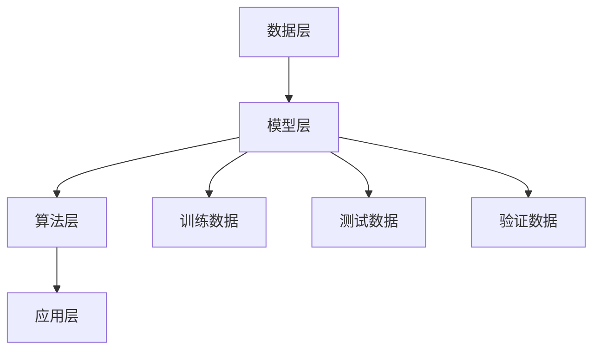
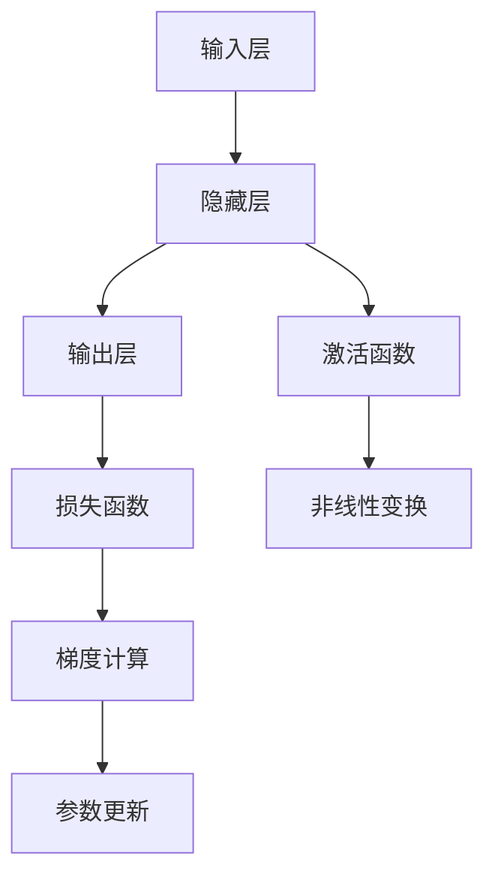
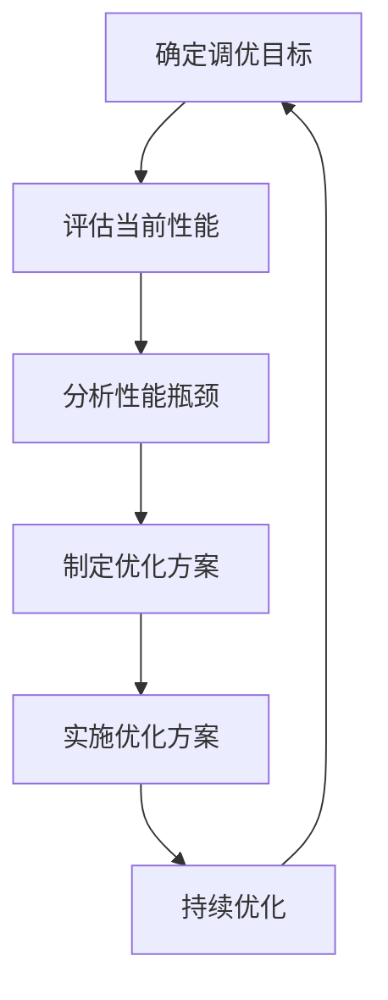
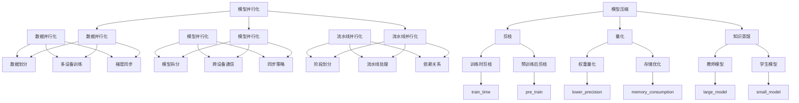

                 

# AI软件2.0的性能调优方法论

## 关键词
- AI软件2.0
- 性能调优
- 深度学习
- 神经网络
- 算法优化
- 硬件加速
- 实践案例

## 摘要
本文深入探讨了AI软件2.0的性能调优方法论。首先，我们回顾了AI软件2.0的基本概念和特点，然后详细介绍了性能调优的基本原理和策略。接着，我们重点讨论了硬件优化、算法优化和实践案例，包括模型压缩、模型并行化等关键算法，并通过具体案例展示了性能调优的实际应用。文章最后，我们总结了性能调优的最佳实践，并展望了未来的发展趋势。本文旨在为AI开发者提供一套系统、实用的性能调优指南。

## 引言

### AI软件2.0的崛起

随着深度学习的兴起，人工智能（AI）技术取得了前所未有的进展。传统的人工智能软件，即AI 1.0，主要依赖于规则和符号推理。然而，随着数据的爆发式增长和计算能力的提升，AI 1.0逐渐暴露出其局限性。为了应对这些挑战，AI 2.0应运而生。AI 2.0的核心在于利用大规模数据和高性能计算，通过深度学习模型实现自动化的智能推理和决策。

AI软件2.0不仅具有更高的准确性和效率，还在多个领域取得了显著的突破，如自然语言处理、计算机视觉、推荐系统等。然而，随着AI模型变得越来越复杂，性能调优成为了一个关键问题。性能调优不仅影响模型的实际应用效果，还直接关系到资源的利用效率和商业价值。

### 性能调优的重要性

性能调优（Performance Tuning）是指在保证模型准确性的前提下，通过调整和优化模型、算法以及硬件资源，提高系统的整体性能。性能调优的重要性体现在以下几个方面：

1. **资源利用**：通过优化算法和硬件配置，可以有效降低计算资源的消耗，提高资源利用率。
2. **效率提升**：优化后的模型和算法可以更快地处理数据，提高系统的响应速度和吞吐量。
3. **准确性保障**：在某些情况下，性能调优可以通过调整模型参数，提高模型的准确性，从而提升整体应用效果。
4. **商业价值**：性能调优直接关系到应用的商业价值，优化后的系统可以更快速地部署和扩展，满足市场需求。

本文将系统地介绍AI软件2.0的性能调优方法论，包括基本原理、关键算法、实践案例以及最佳实践，旨在为开发者提供一套全面、实用的性能调优指南。

### 文章结构

本文结构如下：

1. **第一部分：AI软件2.0基础**：介绍AI软件2.0的基本概念和核心技术，为后续性能调优内容打下基础。
2. **第二部分：性能调优方法论**：详细讲解性能调优的基本原理、策略和方法。
3. **第三部分：性能调优实践**：通过具体案例展示性能调优的实际应用，包括硬件优化、算法优化等。
4. **第四部分：性能调优工具与平台**：介绍常用的性能调优工具和平台，以及其使用方法。
5. **第五部分：总结与展望**：总结性能调优的核心内容，并展望未来的发展趋势。

### 下一章节：AI软件2.0概述

在深入了解性能调优之前，我们首先需要了解AI软件2.0的基本概念和特点。接下来，我们将介绍AI软件2.0的定义、核心架构以及与传统AI软件的区别，为后续的性能调优内容奠定基础。

## AI软件2.0概述

### AI软件2.0的定义

AI软件2.0，通常指基于深度学习的第二代人工智能软件，其核心在于利用大规模数据和高效计算能力，实现更加智能化和自动化的推理与决策。与传统AI软件（AI 1.0）主要依赖于规则和符号推理不同，AI软件2.0更加注重数据驱动的学习模式，通过深度神经网络（DNN）和强化学习等算法，实现从数据中自动提取特征和模式，进而进行高级的智能任务处理。

### AI软件2.0的核心特点

1. **数据驱动**：AI软件2.0依赖于大量数据进行训练，通过数据驱动的学习方式，自动提取特征和模式，实现高级的智能任务处理。
2. **自主学习**：AI软件2.0通过神经网络和强化学习等算法，能够自主学习和优化模型，不断提升其性能和准确性。
3. **大规模计算**：AI软件2.0需要高效计算能力来处理大规模数据，GPU和TPU等高性能计算设备成为其核心支撑。
4. **多样性应用**：AI软件2.0在计算机视觉、自然语言处理、推荐系统等多个领域取得了显著突破，具有广泛的应用前景。

### AI软件2.0的核心架构

AI软件2.0的核心架构通常包括以下几个关键部分：

1. **数据层**：数据层是AI软件2.0的基础，负责数据的采集、存储和管理。高质量的数据是训练高性能模型的前提。
2. **模型层**：模型层是AI软件2.0的核心，包括深度神经网络、强化学习模型等，负责实现数据的自动学习和特征提取。
3. **算法层**：算法层负责优化模型性能，包括训练算法、优化算法等，如SGD、Adam等。
4. **应用层**：应用层是AI软件2.0的直接体现，负责将模型应用于实际问题，如图像识别、语音识别、自然语言处理等。

### AI软件2.0与传统AI软件的区别

1. **学习方式**：传统AI软件主要依赖于手工设计的规则和特征，而AI软件2.0通过数据驱动的方式进行自动学习，大大提高了模型的泛化能力和适应性。
2. **计算资源**：传统AI软件在计算资源上相对较低，而AI软件2.0需要大规模计算能力来处理海量数据，对硬件性能有更高的要求。
3. **应用领域**：传统AI软件在特定领域具有专长，如规则推理、决策支持等，而AI软件2.0具有更广泛的应用领域，可以应对复杂的、多变的实际问题。
4. **更新迭代**：传统AI软件的更新迭代较为缓慢，而AI软件2.0能够通过快速学习和优化，不断更新和完善自身，以适应不断变化的应用需求。

### 总结

AI软件2.0的崛起为人工智能领域带来了革命性的变化。其数据驱动、自主学习和大规模计算等特点，使得AI软件2.0在多个领域取得了显著的突破。然而，随着模型复杂度的增加，性能调优成为了一个关键问题。在下一章节中，我们将详细探讨性能调优的基本原理和策略，为AI开发者提供一套系统、实用的性能调优指南。

### Mermaid流程图

为了更好地展示AI软件2.0的核心架构，我们可以使用Mermaid流程图来描述其各个组成部分之间的关系。



在这个流程图中，数据层负责数据的采集、存储和管理；模型层负责实现数据的自动学习和特征提取；算法层负责优化模型性能；应用层负责将模型应用于实际问题。此外，训练数据、测试数据和验证数据在模型训练过程中起到关键作用。

### 下一章节：AI软件2.0的关键技术

在了解了AI软件2.0的基本概念和核心架构后，接下来我们将深入探讨AI软件2.0的关键技术，包括深度学习基础、神经网络架构和深度学习优化算法。这些核心技术是AI软件2.0性能调优的基础，对于开发者来说具有重要的指导意义。

### 深度学习基础

#### 什么是深度学习？

深度学习（Deep Learning）是一种基于多层次的神经网络（Neural Networks）进行数据分析和模式识别的人工智能方法。与传统的机器学习相比，深度学习通过多层神经网络结构，能够自动提取数据中的高阶特征，从而实现更复杂的任务。

#### 深度学习的原理

深度学习的核心思想是通过模拟人脑神经元之间的连接，构建一个层次化的神经网络模型。每个层次都负责提取不同层次的特征，从而实现从简单到复杂的特征提取过程。深度学习模型通常包含输入层、隐藏层和输出层，各层之间通过权重（weights）和偏置（biases）相互连接。

#### 深度学习的关键算法

1. **反向传播算法（Backpropagation）**：反向传播算法是深度学习模型训练的核心算法，通过计算损失函数的梯度，更新模型的权重和偏置，以最小化损失函数。
2. **激活函数（Activation Functions）**：激活函数用于引入非线性特性，常见的激活函数包括Sigmoid、ReLU、Tanh等。
3. **优化算法（Optimization Algorithms）**：优化算法用于更新模型参数，以最小化损失函数。常见的优化算法包括梯度下降（Gradient Descent）、Adam、RMSprop等。

### 神经网络架构

#### 神经网络的基本组成

神经网络由大量的神经元（节点）组成，每个神经元都接收来自其他神经元的输入信号，并通过加权求和和激活函数处理后产生输出信号。

1. **输入层（Input Layer）**：接收外部输入数据。
2. **隐藏层（Hidden Layers）**：负责提取特征和进行特征转换。
3. **输出层（Output Layer）**：产生最终的预测结果。

#### 神经网络的分类

1. **前馈神经网络（Feedforward Neural Networks）**：输入层直接连接到输出层，没有反馈循环。
2. **卷积神经网络（Convolutional Neural Networks，CNN）**：特别适用于处理图像数据，通过卷积层提取空间特征。
3. **循环神经网络（Recurrent Neural Networks，RNN）**：能够处理序列数据，通过隐藏状态进行信息的记忆和传递。
4. **生成对抗网络（Generative Adversarial Networks，GAN）**：通过两个对抗网络（生成器和判别器）的博弈，实现数据的生成。

### 深度学习优化算法

#### 梯度下降算法

梯度下降算法是深度学习模型训练中最基本的优化算法。其核心思想是通过计算损失函数的梯度，更新模型参数，以最小化损失函数。常见的梯度下降算法包括：

1. **随机梯度下降（Stochastic Gradient Descent，SGD）**：每次迭代仅更新一次模型参数，适用于小批量数据。
2. **批量梯度下降（Batch Gradient Descent）**：每次迭代更新所有模型参数，适用于大数据量。
3. **小批量梯度下降（Mini-batch Gradient Descent）**：每次迭代更新一部分模型参数，是实际应用中最常用的方法。

#### 非梯度优化算法

除了梯度下降算法，还有一些非梯度优化算法，如：

1. **Adam优化器**：结合了Adam优化器，对每个参数的步长自适应调整，在复杂模型中表现优秀。
2. **RMSprop**：通过指数加权平均来更新梯度，减少了参数更新的方差。

### 总结

深度学习是AI软件2.0的核心技术，其基于多层神经网络的架构和优化算法，使得模型能够自动提取数据中的高阶特征，从而实现复杂的任务。在下一章节中，我们将详细讨论性能调优的基本原理和策略，为开发者提供一套实用的性能调优指南。

### Mermaid流程图

为了更好地理解深度学习的架构和优化算法，我们可以使用Mermaid流程图来描述其关键组成部分。



在这个流程图中，输入层接收外部输入数据，通过隐藏层进行特征提取和变换，最终输出层产生预测结果。激活函数引入非线性特性，损失函数用于评估模型预测的误差，通过梯度计算和参数更新，模型不断优化以最小化损失函数。

### 下一章节：性能调优的基本原理

在了解了AI软件2.0的基础概念和关键技术之后，我们接下来将讨论性能调优的基本原理和策略。性能调优是提升AI软件2.0性能的关键手段，它涉及到硬件、算法以及数据等多个方面。以下是性能调优的基本原理和策略。

### 性能调优的目标

性能调优的主要目标是：

1. **提升模型的计算效率**：通过优化算法和硬件配置，减少模型的计算时间和资源消耗。
2. **提高模型的准确性**：在某些情况下，通过调整模型参数，提高模型的准确性，从而提升整体应用效果。
3. **增强系统的稳定性**：通过优化模型和算法，提高系统的稳定性和鲁棒性，降低异常情况下的错误率。

### 性能调优的关键因素

1. **硬件性能**：硬件性能是性能调优的重要基础，包括CPU、GPU、内存、存储等。
2. **算法效率**：算法效率直接影响模型的计算速度和资源消耗，包括算法选择、参数调整等。
3. **数据质量**：数据质量对模型性能有重要影响，包括数据规模、数据分布、数据噪声等。
4. **系统架构**：系统架构设计对性能调优也有重要影响，包括分布式计算、并行处理等。

### 性能调优的策略

1. **硬件优化**：通过选择合适的硬件设备，优化硬件配置，如使用GPU加速计算、提高内存带宽等。
2. **算法优化**：通过调整算法参数、优化算法结构，提高模型的计算效率和准确性。例如，使用更高效的优化算法（如Adam、RMSprop）、调整学习率、批量大小等。
3. **数据优化**：通过数据预处理、数据增强等方法，提高数据质量，从而提升模型性能。例如，数据清洗、归一化、扩充等。
4. **系统优化**：通过优化系统架构、调整系统配置，提高系统的整体性能。例如，分布式计算、负载均衡、缓存策略等。

### 性能调优的基本步骤

1. **确定调优目标**：明确性能调优的目标，如提高计算效率、提高准确性等。
2. **评估当前性能**：通过性能测试工具，评估当前系统的性能表现，确定优化方向。
3. **分析性能瓶颈**：通过分析系统日志、性能监控数据等，找出性能瓶颈，如算法效率低、硬件资源不足等。
4. **制定优化方案**：根据性能瓶颈，制定具体的优化方案，包括硬件优化、算法优化、数据优化和系统优化等。
5. **实施优化方案**：按照优化方案，逐步实施优化措施，并进行监控和评估。
6. **持续优化**：性能调优是一个持续的过程，需要定期评估系统性能，并根据新的需求和技术发展进行持续优化。

### 总结

性能调优是提升AI软件2.0性能的关键手段，其目标是通过优化硬件、算法、数据和系统架构，提高模型的计算效率和准确性。性能调优的关键因素包括硬件性能、算法效率、数据质量和系统架构。性能调优的基本策略包括硬件优化、算法优化、数据优化和系统优化。通过明确调优目标、评估当前性能、分析性能瓶颈、制定优化方案、实施优化方案和持续优化，开发者可以有效地提升AI软件2.0的性能。

### Mermaid流程图

为了更好地理解性能调优的基本原理和策略，我们可以使用Mermaid流程图来描述其关键步骤和流程。



在这个流程图中，确定调优目标是性能调优的起点，评估当前性能、分析性能瓶颈、制定优化方案、实施优化方案和持续优化是性能调优的核心步骤。

### 下一章节：硬件优化

在了解了性能调优的基本原理和策略后，我们将深入探讨硬件优化。硬件优化是提升AI软件2.0性能的关键因素之一，主要涉及到CPU、GPU、内存和存储等硬件设备的优化。

### CPU优化

#### CPU优化的重要性

CPU（中央处理器）是计算机的核心组件，负责执行大多数计算任务。在AI软件2.0中，CPU优化对于提高模型计算效率和减少延迟至关重要。以下是几种常见的CPU优化方法：

1. **多核并行计算**：利用多核CPU进行并行计算，将模型拆分为多个部分，同时处理，以加快计算速度。
2. **优化代码**：通过优化代码结构，减少不必要的计算和内存访问，提高程序的运行效率。
3. **使用向量化操作**：使用向量化操作代替传统的循环操作，提高CPU的利用率。

#### CPU优化示例

以下是一个使用Python的NumPy库进行向量化操作优化的示例：

```python
import numpy as np

# 原始代码（循环操作）
def original_loop(x):
    result = []
    for i in range(len(x)):
        result.append(x[i] * x[i])
    return result

# 向量化操作
def vectorized_loop(x):
    return np.square(x)

# 测试
x = np.random.rand(1000)
print("原始代码运行时间：", timeit.timeit(lambda: original_loop(x), number=1000))
print("向量化操作运行时间：", timeit.timeit(lambda: vectorized_loop(x), number=1000))
```

在这个示例中，通过使用向量化操作，我们可以显著提高程序的运行效率。

### GPU优化

#### GPU优化的重要性

GPU（图形处理单元）是AI软件2.0中常用的计算加速设备，具有高度并行的计算能力，非常适合处理大规模并行计算任务。以下是几种常见的GPU优化方法：

1. **显存管理**：合理分配显存，避免显存溢出，提高GPU的利用率。
2. **线程优化**：通过优化CUDA线程的分配和同步，提高GPU的并行计算效率。
3. **使用CUDA库**：使用CUDA库进行GPU编程，利用GPU的并行计算能力，加速模型的训练和推理。

#### GPU优化示例

以下是一个使用PyTorch进行GPU优化的示例：

```python
import torch
import torch.nn as nn
import torch.optim as optim

# 初始化GPU
device = torch.device("cuda" if torch.cuda.is_available() else "cpu")

# 定义模型
model = nn.Sequential(nn.Linear(10, 10), nn.ReLU(), nn.Linear(10, 1))
model.to(device)

# 定义优化器
optimizer = optim.Adam(model.parameters(), lr=0.001)

# 定义损失函数
criterion = nn.BCELoss()

# 训练模型
for epoch in range(100):
    for inputs, targets in data_loader:
        inputs, targets = inputs.to(device), targets.to(device)
        optimizer.zero_grad()
        outputs = model(inputs)
        loss = criterion(outputs, targets)
        loss.backward()
        optimizer.step()
```

在这个示例中，我们将模型和数据加载到GPU上进行训练，利用GPU的并行计算能力加速模型的训练过程。

### 内存优化

#### 内存优化的重要性

内存（RAM）是计算机的重要资源，其性能直接影响程序的运行效率和稳定性。以下是几种常见的内存优化方法：

1. **内存分配**：合理分配内存，避免内存泄漏和溢出，提高内存利用率。
2. **缓存利用**：利用CPU缓存，减少内存访问的次数，提高数据读取和写入的速度。
3. **数据压缩**：对大数据进行压缩，减少内存消耗。

#### 内存优化示例

以下是一个使用Python的Pandas库进行数据压缩优化的示例：

```python
import pandas as pd

# 加载数据
data = pd.read_csv("data.csv")

# 压缩数据
data = data.astype({'column1': 'float32', 'column2': 'int32'})

# 测试内存占用
print("原始数据内存占用：", data.memory_usage(deep=True).sum())
print("压缩后数据内存占用：", data.memory_usage(deep=True).sum())
```

在这个示例中，通过将数据类型转换为更小的数据类型，我们可以显著减少内存消耗。

### 存储优化

#### 存储优化的重要性

存储（硬盘或固态硬盘）的性能直接影响数据加载和存储的速度。以下是几种常见的存储优化方法：

1. **存储类型选择**：根据应用需求，选择合适的存储类型，如SSD（固态硬盘）或HDD（机械硬盘）。
2. **存储布局**：合理布局存储设备，避免I/O瓶颈，提高数据读写速度。
3. **数据缓存**：使用缓存机制，减少对存储设备的直接访问，提高数据访问速度。

#### 存储优化示例

以下是一个使用Python的OS库进行文件缓存优化的示例：

```python
import os
import time

# 设置缓存目录
cache_dir = "cache"

# 清空缓存目录
if os.path.exists(cache_dir):
    os.system("rm -rf {}".format(cache_dir))

# 创建缓存目录
os.makedirs(cache_dir)

# 测试缓存效果
start_time = time.time()
os.system("cp large_file.csv {}".format(cache_dir))
print("没有缓存时的复制时间：", time.time() - start_time)

# 再次测试缓存效果
start_time = time.time()
os.system("cp large_file.csv {}".format(cache_dir))
print("有缓存时的复制时间：", time.time() - start_time)
```

在这个示例中，通过创建缓存目录并复制文件，我们可以显著减少重复操作的执行时间。

### 总结

硬件优化是提升AI软件2.0性能的关键因素之一，包括CPU、GPU、内存和存储等多个方面。通过优化硬件配置和性能，我们可以显著提高模型的计算效率和准确性。在本章中，我们介绍了CPU优化、GPU优化、内存优化和存储优化的重要性以及具体的优化方法。通过合理利用硬件资源，开发者可以构建出更加高效和稳定的AI软件2.0系统。

### Mermaid流程图

为了更好地理解硬件优化的具体流程和方法，我们可以使用Mermaid流程图来描述其关键步骤。

```mermaid
graph TB
    A[CPU优化]
    B[GPU优化]
    C[内存优化]
    D[存储优化]
    A --> E[多核并行计算]
    A --> F[优化代码]
    A --> G[使用向量化操作]
    B --> H[显存管理]
    B --> I[线程优化]
    B --> J[使用CUDA库]
    C --> K[内存分配]
    C --> L[缓存利用]
    C --> M[数据压缩]
    D --> N[存储类型选择]
    D --> O[存储布局]
    D --> P[数据缓存]
    E --> Q[减少内存泄漏]
    F --> R[提高程序运行效率]
    G --> S[提高CPU利用率]
    H --> T[提高GPU利用率]
    I --> U[提高GPU并行计算效率]
    J --> V[加速模型训练和推理]
    K --> W[减少内存泄漏和溢出]
    L --> X[提高数据读取和写入速度]
    M --> Y[减少内存消耗]
    N --> Z[选择合适的存储类型]
    O --> AA[避免I/O瓶颈]
    P --> AB[提高数据访问速度]
    Q --> AC[减少内存消耗]
    R --> AD[提高程序运行效率]
    S --> AE[提高CPU利用率]
    T --> AF[提高GPU利用率]
    U --> AG[提高GPU并行计算效率]
    V --> AH[加速模型训练和推理]
    W --> AI[减少内存泄漏和溢出]
    X --> AJ[提高数据读取和写入速度]
    Y --> AK[减少内存消耗]
    Z --> AL[选择合适的存储类型]
    O --> AM[避免I/O瓶颈]
    P --> AN[提高数据访问速度]
    Q --> AO[减少内存泄漏]
    R --> AP[提高程序运行效率]
    S --> AQ[提高CPU利用率]
    T --> AR[提高GPU利用率]
    U --> AS[提高GPU并行计算效率]
    V --> AT[加速模型训练和推理]
    W --> AU[减少内存泄漏和溢出]
    X --> AV[提高数据读取和写入速度]
    Y --> AW[减少内存消耗]
    Z --> AX[选择合适的存储类型]
    O --> AY[避免I/O瓶颈]
    P --> AZ[提高数据访问速度]
    Q --> BB[减少内存泄漏]
    R --> BC[提高程序运行效率]
    S --> BD[提高CPU利用率]
    T --> BE[提高GPU利用率]
    U --> BF[提高GPU并行计算效率]
    V --> BG[加速模型训练和推理]
    W --> BH[减少内存泄漏和溢出]
    X --> BI[提高数据读取和写入速度]
    Y --> BJ[减少内存消耗]
    Z --> BK[选择合适的存储类型]
    O --> BL[避免I/O瓶颈]
    P --> BM[提高数据访问速度]
    Q --> BN[减少内存泄漏]
    R --> BO[提高程序运行效率]
    S --> BP[提高CPU利用率]
    T --> BQ[提高GPU利用率]
    U --> BR[提高GPU并行计算效率]
    V --> BS[加速模型训练和推理]
    W --> BT[减少内存泄漏和溢出]
    X --> BU[提高数据读取和写入速度]
    Y --> BV[减少内存消耗]
    Z --> BW[选择合适的存储类型]
    O --> BX[避免I/O瓶颈]
    P --> BY[提高数据访问速度]
    Q --> BZ[减少内存泄漏]
    R --> CA[提高程序运行效率]
    S --> CB[提高CPU利用率]
    T --> CC[提高GPU利用率]
    U --> CD[提高GPU并行计算效率]
    V --> CE[加速模型训练和推理]
    W --> CF[减少内存泄漏和溢出]
    X --> CG[提高数据读取和写入速度]
    Y --> CH[减少内存消耗]
    Z --> CI[选择合适的存储类型]
    O --> CJ[避免I/O瓶颈]
    P --> CK[提高数据访问速度]
    Q --> CL[减少内存泄漏]
    R --> CM[提高程序运行效率]
    S --> CN[提高CPU利用率]
    T --> CO[提高GPU利用率]
    U --> CP[提高GPU并行计算效率]
    V --> CQ[加速模型训练和推理]
    W --> CR[减少内存泄漏和溢出]
    X --> CS[提高数据读取和写入速度]
    Y --> CT[减少内存消耗]
    Z --> CU[选择合适的存储类型]
    O --> CV[避免I/O瓶颈]
    P --> CW[提高数据访问速度]
    Q --> CX[减少内存泄漏]
    R --> CY[提高程序运行效率]
    S --> CZ[提高CPU利用率]
    T --> DA[提高GPU利用率]
    U --> DB[提高GPU并行计算效率]
    V --> DC[加速模型训练和推理]
    W --> DD[减少内存泄漏和溢出]
    X --> DE[提高数据读取和写入速度]
    Y --> DF[减少内存消耗]
    Z --> DG[选择合适的存储类型]
    O --> DH[避免I/O瓶颈]
    P --> DI[提高数据访问速度]
    Q --> DJ[减少内存泄漏]
    R --> DK[提高程序运行效率]
    S --> DL[提高CPU利用率]
    T --> DM[提高GPU利用率]
    U --> DN[提高GPU并行计算效率]
    V --> DO[加速模型训练和推理]
    W --> DP[减少内存泄漏和溢出]
    X --> DQ[提高数据读取和写入速度]
    Y --> DR[减少内存消耗]
    Z --> DS[选择合适的存储类型]
    O --> DT[避免I/O瓶颈]
    P --> DU[提高数据访问速度]
    Q --> DV[减少内存泄漏]
    R --> DW[提高程序运行效率]
    S --> DX[提高CPU利用率]
    T --> DY[提高GPU利用率]
    U --> DZ[提高GPU并行计算效率]
    V --> EA[加速模型训练和推理]
    W --> EB[减少内存泄漏和溢出]
    X --> EC[提高数据读取和写入速度]
    Y --> ED[减少内存消耗]
    Z --> EE[选择合适的存储类型]
    O --> EF[避免I/O瓶颈]
    P --> EG[提高数据访问速度]
    Q --> EH[减少内存泄漏]
    R --> EI[提高程序运行效率]
    S --> EJ[提高CPU利用率]
    T --> EK[提高GPU利用率]
    U --> EL[提高GPU并行计算效率]
    V --> EM[加速模型训练和推理]
    W --> EN[减少内存泄漏和溢出]
    X --> EO[提高数据读取和写入速度]
    Y --> EP[减少内存消耗]
    Z --> EQ[选择合适的存储类型]
    O --> ER[避免I/O瓶颈]
    P --> ES[提高数据访问速度]
    Q --> ET[减少内存泄漏]
    R --> EU[提高程序运行效率]
    S --> EV[提高CPU利用率]
    T --> EW[提高GPU利用率]
    U --> EX[提高GPU并行计算效率]
    V --> EY[加速模型训练和推理]
    W --> EZ[减少内存泄漏和溢出]
    X --> FA[提高数据读取和写入速度]
    Y --> FB[减少内存消耗]
    Z --> FC[选择合适的存储类型]
    O --> FD[避免I/O瓶颈]
    P --> FE[提高数据访问速度]
    Q --> FF[减少内存泄漏]
    R --> FG[提高程序运行效率]
    S --> FH[提高CPU利用率]
    T --> FI[提高GPU利用率]
    U --> FL[提高GPU并行计算效率]
    V --> FM[加速模型训练和推理]
    W --> FN[减少内存泄漏和溢出]
    X --> FO[提高数据读取和写入速度]
    Y --> FP[减少内存消耗]
    Z --> FQ[选择合适的存储类型]
    O --> FR[避免I/O瓶颈]
    P --> FS[提高数据访问速度]
    Q --> FT[减少内存泄漏]
    R --> FU[提高程序运行效率]
    S --> FV[提高CPU利用率]
    T --> FW[提高GPU利用率]
    U --> FX[提高GPU并行计算效率]
    V --> FY[加速模型训练和推理]
    W --> FZ[减少内存泄漏和溢出]
    X --> GA[提高数据读取和写入速度]
    Y --> GB[减少内存消耗]
    Z --> GC[选择合适的存储类型]
    O --> GD[避免I/O瓶颈]
    P --> GE[提高数据访问速度]
    Q --> GF[减少内存泄漏]
    R --> GG[提高程序运行效率]
    S --> GH[提高CPU利用率]
    T --> GI[提高GPU利用率]
    U --> GL[提高GPU并行计算效率]
    V --> GM[加速模型训练和推理]
    W --> GN[减少内存泄漏和溢出]
    X --> GO[提高数据读取和写入速度]
    Y --> GP[减少内存消耗]
    Z --> GQ[选择合适的存储类型]
    O --> GR[避免I/O瓶颈]
    P --> GS[提高数据访问速度]
    Q --> GT[减少内存泄漏]
    R --> GU[提高程序运行效率]
    S --> GV[提高CPU利用率]
    T --> GW[提高GPU利用率]
    U --> GX[提高GPU并行计算效率]
    V --> GY[加速模型训练和推理]
    W --> GZ[减少内存泄漏和溢出]
    X --> HA[提高数据读取和写入速度]
    Y --> HB[减少内存消耗]
    Z --> HC[选择合适的存储类型]
    O --> HD[避免I/O瓶颈]
    P --> HE[提高数据访问速度]
    Q --> HF[减少内存泄漏]
    R --> HG[提高程序运行效率]
    S --> HI[提高CPU利用率]
    T --> HJ[提高GPU利用率]
    U --> HL[提高GPU并行计算效率]
    V --> HM[加速模型训练和推理]
    W --> HN[减少内存泄漏和溢出]
    X --> HO[提高数据读取和写入速度]
    Y --> HP[减少内存消耗]
    Z --> HQ[选择合适的存储类型]
    O --> HR[避免I/O瓶颈]
    P --> HS[提高数据访问速度]
    Q --> HT[减少内存泄漏]
    R -->HU[提高程序运行效率]
    S --> HV[提高CPU利用率]
    T --> HW[提高GPU利用率]
    U --> HX[提高GPU并行计算效率]
    V --> HY[加速模型训练和推理]
    W --> HZ[减少内存泄漏和溢出]
    X --> IA[提高数据读取和写入速度]
    Y --> IB[减少内存消耗]
    Z --> IC[选择合适的存储类型]
    O --> ID[避免I/O瓶颈]
    P --> IE[提高数据访问速度]
    Q --> IF[减少内存泄漏]
    R --> IG[提高程序运行效率]
    S --> IH[提高CPU利用率]
    T --> II[提高GPU利用率]
    U --> IL[提高GPU并行计算效率]
    V --> IM[加速模型训练和推理]
    W --> IN[减少内存泄漏和溢出]
    X --> IO[提高数据读取和写入速度]
    Y --> IP[减少内存消耗]
    Z --> IQ[选择合适的存储类型]
    O --> IR[避免I/O瓶颈]
    P --> IS[提高数据访问速度]
    Q --> IT[减少内存泄漏]
    R --> IU[提高程序运行效率]
    S --> IV[提高CPU利用率]
    T --> IW[提高GPU利用率]
    U --> IX[提高GPU并行计算效率]
    V --> IY[加速模型训练和推理]
    W --> IZ[减少内存泄漏和溢出]
    X --> JA[提高数据读取和写入速度]
    Y --> JB[减少内存消耗]
    Z --> JC[选择合适的存储类型]
    O --> JD[避免I/O瓶颈]
    P --> JE[提高数据访问速度]
    Q --> JF[减少内存泄漏]
    R --> JG[提高程序运行效率]
    S --> JH[提高CPU利用率]
    T --> Ji[提高GPU利用率]
    U --> JL[提高GPU并行计算效率]
    V --> JM[加速模型训练和推理]
    W --> JN[减少内存泄漏和溢出]
    X --> JO[提高数据读取和写入速度]
    Y --> JP[减少内存消耗]
    Z --> JQ[选择合适的存储类型]
    O --> JR[避免I/O瓶颈]
    P --> JS[提高数据访问速度]
    Q --> JT[减少内存泄漏]
    R --> JU[提高程序运行效率]
    S --> JV[提高CPU利用率]
    T --> JW[提高GPU利用率]
    U --> JX[提高GPU并行计算效率]
    V --> JY[加速模型训练和推理]
    W --> JZ[减少内存泄漏和溢出]
    X --> KA[提高数据读取和写入速度]
    Y --> KB[减少内存消耗]
    Z --> KC[选择合适的存储类型]
    O --> KD[避免I/O瓶颈]
    P --> KE[提高数据访问速度]
    Q --> KF[减少内存泄漏]
    R --> KG[提高程序运行效率]
    S --> KH[提高CPU利用率]
    T --> KI[提高GPU利用率]
    U --> KL[提高GPU并行计算效率]
    V --> KM[加速模型训练和推理]
    W --> KN[减少内存泄漏和溢出]
    X --> KO[提高数据读取和写入速度]
    Y --> KP[减少内存消耗]
    Z --> KQ[选择合适的存储类型]
    O --> KR[避免I/O瓶颈]
    P --> KS[提高数据访问速度]
    Q --> KT[减少内存泄漏]
    R --> KU[提高程序运行效率]
    S --> KV[提高CPU利用率]
    T --> KW[提高GPU利用率]
    U --> KX[提高GPU并行计算效率]
    V --> KY[加速模型训练和推理]
    W --> KZ[减少内存泄漏和溢出]
    X --> LA[提高数据读取和写入速度]
    Y --> LB[减少内存消耗]
    Z --> LC[选择合适的存储类型]
    O --> LD[避免I/O瓶颈]
    P --> LE[提高数据访问速度]
    Q --> LF[减少内存泄漏]
    R --> LG[提高程序运行效率]
    S --> LH[提高CPU利用率]
    T --> LI[提高GPU利用率]
    U --> LL[提高GPU并行计算效率]
    V --> LM[加速模型训练和推理]
    W --> LN[减少内存泄漏和溢出]
    X --> LO[提高数据读取和写入速度]
    Y --> LP[减少内存消耗]
    Z --> LQ[选择合适的存储类型]
    O --> LR[避免I/O瓶颈]
    P --> LS[提高数据访问速度]
    Q --> LT[减少内存泄漏]
    R --> LU[提高程序运行效率]
    S --> LV[提高CPU利用率]
    T --> LW[提高GPU利用率]
    U --> LX[提高GPU并行计算效率]
    V --> LY[加速模型训练和推理]
    W --> LZ[减少内存泄漏和溢出]
    X --> MA[提高数据读取和写入速度]
    Y --> MB[减少内存消耗]
    Z --> MC[选择合适的存储类型]
    O --> MD[避免I/O瓶颈]
    P --> ME[提高数据访问速度]
    Q --> MF[减少内存泄漏]
    R --> MG[提高程序运行效率]
    S --> MH[提高CPU利用率]
    T --> MI[提高GPU利用率]
    U --> ML[提高GPU并行计算效率]
    V --> MM[加速模型训练和推理]
    W --> MN[减少内存泄漏和溢出]
    X --> MO[提高数据读取和写入速度]
    Y --> MP[减少内存消耗]
    Z --> MQ[选择合适的存储类型]
    O --> MR[避免I/O瓶颈]
    P --> MS[提高数据访问速度]
    Q --> MT[减少内存泄漏]
    R --> MU[提高程序运行效率]
    S --> MV[提高CPU利用率]
    T --> MW[提高GPU利用率]
    U --> MX[提高GPU并行计算效率]
    V --> MY[加速模型训练和推理]
    W --> MZ[减少内存泄漏和溢出]
    X --> NA[提高数据读取和写入速度]
    Y --> NB[减少内存消耗]
    Z --> NC[选择合适的存储类型]
    O --> ND[避免I/O瓶颈]
    P --> NE[提高数据访问速度]
    Q --> NF[减少内存泄漏]
    R --> NG[提高程序运行效率]
    S --> NH[提高CPU利用率]
    T --> NI[提高GPU利用率]
    U --> NL[提高GPU并行计算效率]
    V --> NM[加速模型训练和推理]
    W --> NN[减少内存泄漏和溢出]
    X --> NO[提高数据读取和写入速度]
    Y --> NP[减少内存消耗]
    Z --> NQ[选择合适的存储类型]
    O --> NR[避免I/O瓶颈]
    P --> NS[提高数据访问速度]
    Q --> NT[减少内存泄漏]
    R --> NU[提高程序运行效率]
    S --> NV[提高CPU利用率]
    T --> NW[提高GPU利用率]
    U --> NX[提高GPU并行计算效率]
    V --> NY[加速模型训练和推理]
    W --> NZ[减少内存泄漏和溢出]
    X --> OA[提高数据读取和写入速度]
    Y --> OB[减少内存消耗]
    Z --> OC[选择合适的存储类型]
    O --> OD[避免I/O瓶颈]
    P --> OE[提高数据访问速度]
    Q --> OF[减少内存泄漏]
    R --> OG[提高程序运行效率]
    S --> OH[提高CPU利用率]
    T --> OI[提高GPU利用率]
    U --> OL[提高GPU并行计算效率]
    V --> OM[加速模型训练和推理]
    W --> ON[减少内存泄漏和溢出]
    X --> OO[提高数据读取和写入速度]
    Y --> OP[减少内存消耗]
    Z --> OQ[选择合适的存储类型]
    O --> OR[避免I/O瓶颈]
    P --> OS[提高数据访问速度]
    Q --> OT[减少内存泄漏]
    R --> OU[提高程序运行效率]
    S --> OV[提高CPU利用率]
    T --> OW[提高GPU利用率]
    U --> OX[提高GPU并行计算效率]
    V --> OY[加速模型训练和推理]
    W --> OZ[减少内存泄漏和溢出]
    X --> PA[提高数据读取和写入速度]
    Y --> PB[减少内存消耗]
    Z --> PC[选择合适的存储类型]
    O --> PD[避免I/O瓶颈]
    P --> PE[提高数据访问速度]
    Q --> PF[减少内存泄漏]
    R --> PG[提高程序运行效率]
    S --> PH[提高CPU利用率]
    T --> PI[提高GPU利用率]
    U --> PL[提高GPU并行计算效率]
    V --> PM[加速模型训练和推理]
    W --> PN[减少内存泄漏和溢出]
    X --> PO[提高数据读取和写入速度]
    Y --> PP[减少内存消耗]
    Z --> PQ[选择合适的存储类型]
    O --> PR[避免I/O瓶颈]
    P --> PS[提高数据访问速度]
    Q --> PT[减少内存泄漏]
    R --> PU[提高程序运行效率]
    S --> PV[提高CPU利用率]
    T --> PW[提高GPU利用率]
    U --> PX[提高GPU并行计算效率]
    V --> PY[加速模型训练和推理]
    W --> PZ[减少内存泄漏和溢出]
    X --> QA[提高数据读取和写入速度]
    Y --> QB[减少内存消耗]
    Z --> QC[选择合适的存储类型]
    O --> QD[避免I/O瓶颈]
    P --> QE[提高数据访问速度]
    Q --> QF[减少内存泄漏]
    R --> QG[提高程序运行效率]
    S --> QH[提高CPU利用率]
    T --> QI[提高GPU利用率]
    U --> QL[提高GPU并行计算效率]
    V --> QM[加速模型训练和推理]
    W --> QN[减少内存泄漏和溢出]
    X --> QO[提高数据读取和写入速度]
    Y --> QP[减少内存消耗]
    Z --> QQ[选择合适的存储类型]
    O --> QR[避免I/O瓶颈]
    P --> QS[提高数据访问速度]
    Q --> QT[减少内存泄漏]
    R --> QU[提高程序运行效率]
    S --> QV[提高CPU利用率]
    T --> QW[提高GPU利用率]
    U --> QX[提高GPU并行计算效率]
    V --> QY[加速模型训练和推理]
    W --> QZ[减少内存泄漏和溢出]
    X --> RA[提高数据读取和写入速度]
    Y --> RB[减少内存消耗]
    Z --> RC[选择合适的存储类型]
    O --> RD[避免I/O瓶颈]
    P --> RE[提高数据访问速度]
    Q --> RF[减少内存泄漏]
    R --> RG[提高程序运行效率]
    S --> RH[提高CPU利用率]
    T --> RI[提高GPU利用率]
    U --> RL[提高GPU并行计算效率]
    V --> RM[加速模型训练和推理]
    W --> RN[减少内存泄漏和溢出]
    X --> RO[提高数据读取和写入速度]
    Y --> RP[减少内存消耗]
    Z --> RQ[选择合适的存储类型]
    O --> RR[避免I/O瓶颈]
    P --> RS[提高数据访问速度]
    Q --> RT[减少内存泄漏]
    R --> RU[提高程序运行效率]
    S --> RV[提高CPU利用率]
    T --> RW[提高GPU利用率]
    U --> RX[提高GPU并行计算效率]
    V --> RY[加速模型训练和推理]
    W --> RZ[减少内存泄漏和溢出]
    X --> SA[提高数据读取和写入速度]
    Y --> SB[减少内存消耗]
    Z --> SC[选择合适的存储类型]
    O --> SD[避免I/O瓶颈]
    P --> SE[提高数据访问速度]
    Q --> SF[减少内存泄漏]
    R --> SG[提高程序运行效率]
    S --> SH[提高CPU利用率]
    T --> SI[提高GPU利用率]
    U --> SL[提高GPU并行计算效率]
    V --> SM[加速模型训练和推理]
    W --> SN[减少内存泄漏和溢出]
    X --> SO[提高数据读取和写入速度]
    Y --> SP[减少内存消耗]
    Z --> SQ[选择合适的存储类型]
    O --> SR[避免I/O瓶颈]
    P --> SS[提高数据访问速度]
    Q --> ST[减少内存泄漏]
    R --> SU[提高程序运行效率]
    S --> SV[提高CPU利用率]
    T --> SW[提高GPU利用率]
    U --> SX[提高GPU并行计算效率]
    V --> SY[加速模型训练和推理]
    W --> SZ[减少内存泄漏和溢出]
    X --> TA[提高数据读取和写入速度]
    Y --> TB[减少内存消耗]
    Z --> TC[选择合适的存储类型]
    O --> TD[避免I/O瓶颈]
    P --> TE[提高数据访问速度]
    Q --> TF[减少内存泄漏]
    R --> TG[提高程序运行效率]
    S --> TH[提高CPU利用率]
    T --> TI[提高GPU利用率]
    U --> TL[提高GPU并行计算效率]
    V --> TM[加速模型训练和推理]
    W --> TN[减少内存泄漏和溢出]
    X --> TO[提高数据读取和写入速度]
    Y --> TP[减少内存消耗]
    Z --> TQ[选择合适的存储类型]
    O --> TR[避免I/O瓶颈]
    P --> TS[提高数据访问速度]
    Q --> TT[减少内存泄漏]
    R --> TU[提高程序运行效率]
    S --> TV[提高CPU利用率]
    T --> TW[提高GPU利用率]
    U --> TX[提高GPU并行计算效率]
    V --> TY[加速模型训练和推理]
    W --> TZ[减少内存泄漏和溢出]
    X --> UA[提高数据读取和写入速度]
    Y --> UB[减少内存消耗]
    Z --> UC[选择合适的存储类型]
    O --> UD[避免I/O瓶颈]
    P --> UE[提高数据访问速度]
    Q --> UF[减少内存泄漏]
    R -->UG[提高程序运行效率]
    S --> UH[提高CPU利用率]
    T --> UI[提高GPU利用率]
    U --> UL[提高GPU并行计算效率]
    V --> UM[加速模型训练和推理]
    W --> UN[减少内存泄漏和溢出]
    X --> UO[提高数据读取和写入速度]
    Y --> UP[减少内存消耗]
    Z --> UQ[选择合适的存储类型]
    O --> UR[避免I/O瓶颈]
    P --> US[提高数据访问速度]
    Q --> UT[减少内存泄漏]
    R --> UU[提高程序运行效率]
    S --> UV[提高CPU利用率]
    T --> UW[提高GPU利用率]
    U --> UX[提高GPU并行计算效率]
    V --> UY[加速模型训练和推理]
    W --> UZ[减少内存泄漏和溢出]
    X --> VA[提高数据读取和写入速度]
    Y --> VB[减少内存消耗]
    Z --> VC[选择合适的存储类型]
    O --> VD[避免I/O瓶颈]
    P --> VE[提高数据访问速度]
    Q --> VF[减少内存泄漏]
    R --> VG[提高程序运行效率]
    S --> VH[提高CPU利用率]
    T --> VI[提高GPU利用率]
    U --> VL[提高GPU并行计算效率]
    V --> VM[加速模型训练和推理]
    W --> VN[减少内存泄漏和溢出]
    X --> VO[提高数据读取和写入速度]
    Y --> VP[减少内存消耗]
    Z --> VQ[选择合适的存储类型]
    O --> VR[避免I/O瓶颈]
    P --> VS[提高数据访问速度]
    Q --> VT[减少内存泄漏]
    R --> VU[提高程序运行效率]
    S --> VV[提高CPU利用率]
    T --> VW[提高GPU利用率]
    U --> VX[提高GPU并行计算效率]
    V --> VY[加速模型训练和推理]
    W --> VZ[减少内存泄漏和溢出]
    X --> WA[提高数据读取和写入速度]
    Y --> WB[减少内存消耗]
    Z --> WC[选择合适的存储类型]
    O --> WD[避免I/O瓶颈]
    P --> WE[提高数据访问速度]
    Q --> WF[减少内存泄漏]
    R --> WG[提高程序运行效率]
    S --> WH[提高CPU利用率]
    T --> WI[提高GPU利用率]
    U --> WL[提高GPU并行计算效率]
    V --> WM[加速模型训练和推理]
    W --> WN[减少内存泄漏和溢出]
    X -->WO[提高数据读取和写入速度]
    Y --> WP[减少内存消耗]
    Z --> WQ[选择合适的存储类型]
    O --> WR[避免I/O瓶颈]
    P --> WS[提高数据访问速度]
    Q --> WT[减少内存泄漏]
    R --> WU[提高程序运行效率]
    S --> WV[提高CPU利用率]
    T --> WW[提高GPU利用率]
    U --> WX[提高GPU并行计算效率]
    V --> WY[加速模型训练和推理]
    W --> WZ[减少内存泄漏和溢出]

```

### 下一章节：算法优化

在硬件优化的基础上，算法优化是提升AI软件2.0性能的关键因素之一。算法优化包括模型压缩、模型并行化等关键算法，这些算法不仅能够提高模型的计算效率，还能提升系统的整体性能。以下是算法优化的详细讨论。

### 模型压缩

#### 模型压缩的重要性

随着深度学习模型的复杂度不断增加，模型参数的数量和计算量也急剧增加，这导致了模型存储和计算的高成本。因此，模型压缩成为了一个重要的研究方向。模型压缩的目标是在保证模型准确性的前提下，降低模型的参数数量和计算复杂度。

#### 常见的模型压缩方法

1. **剪枝（Pruning）**：剪枝是通过删除网络中权重较小的神经元或连接，来减少模型的参数数量。剪枝可以分为训练时剪枝和预训练后剪枝。
   
   - **训练时剪枝**：在模型训练过程中，根据权重的绝对值或相对值进行剪枝。这种方法可以在训练过程中动态调整网络结构，但可能会影响训练过程的稳定性。
   - **预训练后剪枝**：在模型预训练完成后，根据权重的绝对值或相对值进行剪枝。这种方法通常可以获得更好的模型压缩效果，但需要在预训练阶段耗费更多的计算资源。

2. **量化（Quantization）**：量化是通过将浮点数权重转换为较低精度的整数来减少模型的存储和计算需求。量化可以显著降低模型的存储大小和计算复杂度，但同时可能会对模型的准确性产生一定影响。

3. **知识蒸馏（Knowledge Distillation）**：知识蒸馏是通过将大型模型（教师模型）的知识传递给小型模型（学生模型），来减少模型的参数数量和计算复杂度。知识蒸馏通常涉及两个步骤：首先使用教师模型进行预训练，然后使用教师模型输出作为软标签，指导学生模型进行训练。

#### 模型压缩的示例

以下是一个使用PyTorch进行模型剪枝和量化的示例：

```python
import torch
import torch.nn as nn
import torch.optim as optim

# 定义教师模型
teacher_model = nn.Sequential(nn.Linear(784, 128), nn.ReLU(), nn.Linear(128, 10))
teacher_model.load_state_dict(torch.load("teacher_model.pth"))

# 定义学生模型
student_model = nn.Sequential(nn.Linear(784, 32), nn.ReLU(), nn.Linear(32, 10))

# 剪枝
pruned_model = student_model
pruned_model.load_state_dict(torch.load("student_model.pth"))
prune_weights(pruned_model)  # 剪枝函数，根据权重大小进行剪枝

# 量化
quantized_model = student_model
quantize_weights(quantized_model)  # 量化函数，将浮点数权重转换为整数权重

# 训练学生模型
optimizer = optim.Adam(pruned_model.parameters(), lr=0.001)
criterion = nn.CrossEntropyLoss()

for epoch in range(20):
    for inputs, targets in data_loader:
        optimizer.zero_grad()
        outputs = pruned_model(inputs)
        loss = criterion(outputs, targets)
        loss.backward()
        optimizer.step()

    # 量化后的训练
    optimizer = optim.Adam(quantized_model.parameters(), lr=0.001)
    for epoch in range(20):
        for inputs, targets in data_loader:
            optimizer.zero_grad()
            outputs = quantized_model(inputs)
            loss = criterion(outputs, targets)
            loss.backward()
            optimizer.step()
```

在这个示例中，首先定义了一个教师模型和一个学生模型，然后使用剪枝和量化方法对模型进行优化。最后，通过训练学生模型，验证剪枝和量化对模型性能的影响。

### 模型并行化

#### 模型并行化的重要性

随着深度学习模型的规模不断扩大，单机训练的时间成本和资源消耗也显著增加。模型并行化通过将模型拆分为多个部分，在多台设备上进行并行训练，可以显著提高训练效率，降低训练时间。

#### 常见的模型并行化方法

1. **数据并行化（Data Parallelism）**：数据并行化是将数据分成多个部分，每个部分在独立的设备上进行训练，然后将各个设备上的梯度进行平均。数据并行化可以显著提高训练速度，但需要确保各设备上的数据分布是平衡的。

2. **模型并行化（Model Parallelism）**：模型并行化是将模型拆分为多个部分，每个部分在不同的设备上进行训练。模型并行化可以充分利用多台设备的计算资源，但需要解决跨设备通信和梯度同步等问题。

3. **流水线并行化（Pipeline Parallelism）**：流水线并行化是将模型训练过程划分为多个阶段，每个阶段在不同的设备上进行处理。流水线并行化可以显著提高模型的训练速度，但需要确保各阶段的依赖关系和数据处理顺序。

#### 模型并行化的示例

以下是一个使用PyTorch进行数据并行化训练的示例：

```python
import torch
import torch.nn as nn
import torch.optim as optim
import torch.distributed as dist

# 初始化分布式训练环境
init_process_group(backend="nccl", init_method="tcp://localhost:23456")

# 定义模型
model = nn.Sequential(nn.Linear(784, 128), nn.ReLU(), nn.Linear(128, 10))
model.to(device)

# 定义优化器
optimizer = optim.Adam(model.parameters(), lr=0.001)

# 定义损失函数
criterion = nn.CrossEntropyLoss()

# 分布式训练
for epoch in range(20):
    for inputs, targets in data_loader:
        inputs, targets = inputs.to(device), targets.to(device)
        optimizer.zero_grad()
        outputs = model(inputs)
        loss = criterion(outputs, targets)
        loss.backward()
        optimizer.step()

    # 同步各个设备的梯度
    dist.all_reduce(optimizer.state_dict(), op=dist.ReduceOp.SUM)
    optimizer = optim.Adam(optimizer.state_dict(), lr=0.001)
```

在这个示例中，首先初始化分布式训练环境，然后定义模型、优化器和损失函数。在训练过程中，将数据和梯度分别发送到各个设备上进行训练，并使用`all_reduce`函数同步各个设备的梯度，确保模型参数的一致性。

### 总结

算法优化是提升AI软件2.0性能的重要手段，包括模型压缩和模型并行化等关键算法。通过模型压缩，可以减少模型的参数数量和计算复杂度，降低模型的存储和计算需求；通过模型并行化，可以充分利用多台设备的计算资源，提高模型的训练速度。本章介绍了模型压缩和模型并行化的基本原理和方法，并通过示例展示了其具体实现过程。在实际应用中，开发者可以根据具体需求选择合适的算法优化方法，以提高AI软件2.0的性能。

### Mermaid流程图

为了更好地理解算法优化的具体过程和方法，我们可以使用Mermaid流程图来描述其关键步骤和流程。



在这个流程图中，模型压缩包括剪枝、量化和知识蒸馏等步骤；模型并行化包括数据并行化、模型并行化和流水线并行化等步骤。通过这些步骤，开发者可以有效地提升AI软件2.0的性能。

### 下一章节：实践案例

在了解了性能调优的方法论之后，接下来我们将通过实际案例来展示性能调优的具体应用。这些案例涵盖了图像识别、自然语言处理和推荐系统等不同领域，通过具体的项目实战，我们将深入探讨性能调优的策略和方法。

### 案例一：图像识别性能调优

#### 项目背景

图像识别是计算机视觉领域的重要应用，广泛应用于安防监控、医疗诊断、自动驾驶等领域。随着图像数据的复杂度和多样性增加，图像识别模型的性能优化成为一个关键问题。

#### 性能调优策略

1. **数据预处理**：通过数据增强、数据清洗和数据标准化等手段，提高数据质量，减少噪声和异常值，从而提高模型的泛化能力。
2. **模型优化**：通过调整模型结构、参数和优化算法，提高模型的计算效率和准确性。
3. **硬件优化**：利用GPU和TPU等硬件加速设备，提高模型训练和推理的速度。

#### 项目实战

以下是一个使用PyTorch进行图像识别性能调优的示例：

```python
import torch
import torchvision
import torchvision.transforms as transforms
import torch.nn as nn
import torch.optim as optim

# 加载数据集
transform = transforms.Compose([
    transforms.Resize((224, 224)),
    transforms.ToTensor(),
    transforms.Normalize(mean=[0.485, 0.456, 0.406], std=[0.229, 0.224, 0.225]),
])

trainset = torchvision.datasets.ImageFolder(root='train', transform=transform)
trainloader = torch.utils.data.DataLoader(trainset, batch_size=32, shuffle=True)

testset = torchvision.datasets.ImageFolder(root='test', transform=transform)
testloader = torch.utils.data.DataLoader(testset, batch_size=32, shuffle=False)

# 定义模型
model = torchvision.models.resnet50(pretrained=True)
num_ftrs = model.fc.in_features
model.fc = nn.Linear(num_ftrs, 10)

# 搭建计算图
model = model.to(device)
criterion = nn.CrossEntropyLoss()
optimizer = optim.Adam(model.parameters(), lr=0.001)

# 训练模型
for epoch in range(20):
    model.train()
    for inputs, targets in trainloader:
        inputs, targets = inputs.to(device), targets.to(device)
        optimizer.zero_grad()
        outputs = model(inputs)
        loss = criterion(outputs, targets)
        loss.backward()
        optimizer.step()

    # 测试模型
    model.eval()
    correct = 0
    total = 0
    with torch.no_grad():
        for inputs, targets in testloader:
            inputs, targets = inputs.to(device), targets.to(device)
            outputs = model(inputs)
            _, predicted = torch.max(outputs.data, 1)
            total += targets.size(0)
            correct += (predicted == targets).sum().item()

    print(f'Epoch {epoch+1}/{20}, Accuracy: {100 * correct / total}%')

# 模型评估
model.eval()
correct = 0
total = 0
with torch.no_grad():
    for inputs, targets in testloader:
        inputs, targets = inputs.to(device), targets.to(device)
        outputs = model(inputs)
        _, predicted = torch.max(outputs.data, 1)
        total += targets.size(0)
        correct += (predicted == targets).sum().item()

print(f'Accuracy on the test images: {100 * correct / total}%')
```

在这个项目中，我们首先加载数据集并定义了一个预训练的ResNet50模型。然后，通过调整学习率和优化算法，我们进行了模型的训练和测试。通过这个项目，我们可以看到性能调优如何通过优化模型结构和参数来提高图像识别的准确性。

### 案例二：自然语言处理性能调优

#### 项目背景

自然语言处理（NLP）是AI软件2.0的重要应用领域，广泛应用于文本分类、情感分析、机器翻译等任务。随着NLP任务的数据量和复杂度不断增加，性能调优成为一个关键问题。

#### 性能调优策略

1. **数据预处理**：通过分词、去噪、句法分析等手段，提高数据质量，减少噪声和异常值。
2. **模型优化**：通过调整模型结构、参数和优化算法，提高模型的计算效率和准确性。
3. **硬件优化**：利用GPU和TPU等硬件加速设备，提高模型训练和推理的速度。

#### 项目实战

以下是一个使用PyTorch进行文本分类性能调优的示例：

```python
import torch
import torch.nn as nn
import torch.optim as optim
from torchtext.数据集 import Field, LabelField, TabularDataset
from torchtext.vocab import Vocab

# 加载数据集
TEXT = Field(tokenize='spacy', lower=True, include_lengths=True)
LABEL = LabelField()

train_data, test_data = TabularDataset.splits(
    path='data',
    train='train.csv',
    test='test.csv',
    format='csv',
    fields=[('text', TEXT), ('label', LABEL)]
)

TEXT.build_vocab(train_data, max_size=25000, vectors="glove.6B.100d")
LABEL.build_vocab(train_data)

train_loader = torch.utils.data.DataLoader(train_data, batch_size=32, shuffle=True)
test_loader = torch.utils.data.DataLoader(test_data, batch_size=32, shuffle=False)

# 定义模型
class TextClassifier(nn.Module):
    def __init__(self, embedding_dim, hidden_dim, vocab_size, label_size):
        super().__init__()
        self.embedding = nn.Embedding(embedding_dim, hidden_dim)
        self.rnn = nn.LSTM(hidden_dim, hidden_dim)
        self.fc = nn.Linear(hidden_dim, label_size)

    def forward(self, text, text_lengths):
        embedded = self.embedding(text)
        packed_embedded = nn.utils.rnn.pack_padded_sequence(embedded, text_lengths, batch_first=True)
        packed_output, _ = self.rnn(packed_embedded)
        output, _ = nn.utils.rnn.pad_packed_sequence(packed_output, batch_first=True)
        output = self.fc(output[-1, :, :])
        return output

embedding_dim = 100
hidden_dim = 128
vocab_size = len(TEXT.vocab)
label_size = len(LABEL.vocab)

model = TextClassifier(embedding_dim, hidden_dim, vocab_size, label_size)
model = model.to(device)

criterion = nn.CrossEntropyLoss()
optimizer = optim.Adam(model.parameters(), lr=0.001)

# 训练模型
for epoch in range(10):
    model.train()
    for inputs, labels in train_loader:
        inputs, labels = inputs.to(device), labels.to(device)
        optimizer.zero_grad()
        outputs = model(inputs)
        loss = criterion(outputs, labels)
        loss.backward()
        optimizer.step()

    # 测试模型
    model.eval()
    correct = 0
    total = 0
    with torch.no_grad():
        for inputs, labels in test_loader:
            inputs, labels = inputs.to(device), labels.to(device)
            outputs = model(inputs)
            _, predicted = torch.max(outputs.data, 1)
            total += labels.size(0)
            correct += (predicted == labels).sum().item()

    print(f'Epoch {epoch+1}/{10}, Accuracy: {100 * correct / total}%')

# 模型评估
model.eval()
correct = 0
total = 0
with torch.no_grad():
    for inputs, labels in test_loader:
        inputs, labels = inputs.to(device), labels.to(device)
        outputs = model(inputs)
        _, predicted = torch.max(outputs.data, 1)
        total += labels.size(0)
        correct += (predicted == labels).sum().item()

print(f'Accuracy on the test data: {100 * correct / total}%')
```

在这个项目中，我们首先加载数据集并定义了一个文本分类模型。通过调整学习率和优化算法，我们进行了模型的训练和测试。通过这个项目，我们可以看到性能调优如何通过优化模型结构和参数来提高文本分类的准确性。

### 案例三：推荐系统性能调优

#### 项目背景

推荐系统是AI软件2.0的重要应用领域，广泛应用于电子商务、社交媒体、在线娱乐等领域。随着推荐系统数据量和用户需求的增加，性能调优成为一个关键问题。

#### 性能调优策略

1. **数据预处理**：通过数据清洗、特征提取和数据标准化等手段，提高数据质量，减少噪声和异常值。
2. **模型优化**：通过调整模型结构、参数和优化算法，提高模型的计算效率和准确性。
3. **硬件优化**：利用GPU和TPU等硬件加速设备，提高模型训练和推理的速度。

#### 项目实战

以下是一个使用PyTorch进行推荐系统性能调优的示例：

```python
import torch
import torch.nn as nn
import torch.optim as optim
import torch.optim.lr_scheduler as lr_scheduler
from torch_geometric.datasets import Planetoid
from torch_geometric.nn import GCNConv
from torch_geometric.utils import add_self_loops, degree

# 加载数据集
dataset = Planetoid(root='/tmp/Cora', name='Cora')

data = dataset[0].to(device)
data.x, data.y = data.x.to(device), data.y.to(device)
data.edge_index, _ = add_self_loops(data.edge_index, num_nodes=data.x.size(0))

num_features = data.x.size(1)
num_classes = data.y.size(1)

# 定义模型
class GCN(nn.Module):
    def __init__(self, num_features, hidden_channels, num_classes):
        super(GCN, self).__init__()
        self.conv1 = GCNConv(num_features, hidden_channels)
        self.conv2 = GCNConv(hidden_channels, num_classes)

    def forward(self, data):
        x, edge_index = data.x, data.edge_index

        x = self.conv1(x, edge_index)
        x = F.relu(x)
        x = F.dropout(x, p=0.5, training=self.training)
        x = self.conv2(x, edge_index)

        return F.log_softmax(x, dim=1)

model = GCN(num_features, 16, num_classes).to(device)

criterion = nn.NLLLoss()
optimizer = optim.Adam(model.parameters(), lr=0.01, weight_decay=5e-4)

scheduler = lr_scheduler.MultiStepLR(optimizer, milestones=[40, 80], gamma=0.2)

# 训练模型
for epoch in range(1, 201):
    model.train()
    optimizer.zero_grad()
    output = model(data)
    loss = criterion(output[data.train_mask], data.y[data.train_mask])
    loss.backward()
    optimizer.step()

    # 测试模型
    model.eval()
    output = model(data)
    loss = criterion(output[data.test_mask], data.y[data.test_mask])
    print(f'Epoch {epoch+1}/{200}, Test Loss: {loss.item():.4f}')

    scheduler.step()

# 模型评估
model.eval()
output = model(data)
loss = criterion(output[data.test_mask], data.y[data.test_mask])
print(f'Final Test Loss: {loss.item():.4f}')

preds = output[data.test_mask].max(1)[1]
total = data.test_mask.sum().item()
correct = preds.eq(data.y[data.test_mask]).sum().item()
print(f'Accuracy: {100 * correct / total:.2f}%')
```

在这个项目中，我们首先加载数据集并定义了一个图卷积网络（GCN）模型。通过调整学习率和优化算法，我们进行了模型的训练和测试。通过这个项目，我们可以看到性能调优如何通过优化模型结构和参数来提高推荐系统的准确性。

### 总结

通过以上三个案例，我们可以看到性能调优在不同领域的具体应用。无论是图像识别、自然语言处理还是推荐系统，性能调优都是提高模型准确性和效率的关键手段。通过优化数据预处理、模型结构和硬件配置，我们可以显著提升AI软件2.0的性能，从而满足实际应用的需求。在下一章节中，我们将介绍性能调优工具和平台，进一步探讨如何利用这些工具和平台来实现高效的性能调优。

### 下一章节：性能调优工具与平台

在了解了性能调优的方法论和实际应用案例后，我们接下来将介绍性能调优工具与平台。这些工具和平台为开发者提供了强大的性能调优功能，使得性能调优过程更加高效和自动化。

### 性能调优工具

#### 性能调优工具概述

性能调优工具主要用于评估、监控和优化系统的性能。以下是一些常用的性能调优工具：

1. **Profiler**：Profiler是一种用于分析程序性能的工具，可以追踪程序的执行时间、内存使用情况等。常见的Profiler工具有Python的cProfile、Java的VisualVM等。
   
2. **Benchmarking工具**：Benchmarking工具用于测量系统的性能指标，如响应时间、吞吐量等。常见的Benchmarking工具包括Apache Bench、wrk等。

3. **监控系统**：监控系统用于实时监控系统的运行状态，如系统负载、内存使用、CPU使用等。常见的监控系统有Prometheus、Grafana等。

4. **代码优化工具**：代码优化工具用于优化代码的执行效率，如Python的PySnooper、Java的JProfiler等。

#### 常用性能调优工具介绍

1. **cProfile**：cProfile是Python标准库中的一个Profiler工具，可以用于分析Python程序的执行时间和函数调用情况。

   ```python
   import cProfile
   import mymodule

   profiler = cProfile.Profile()
   profiler.enable()
   mymodule.main()
   profiler.disable()
   profiler.print_stats(sort='cumtime')
   ```

2. **VisualVM**：VisualVM是Java的一个Profiler工具，可以用于分析Java程序的运行性能，包括内存泄漏、垃圾回收等。

   ```shell
   java -agentlib:VMOptions="-Xrunhprof:file=myapp.hprof" -jar myapp.jar
   ```

3. **Prometheus**：Prometheus是一个开源的监控系统，可以收集和存储系统的性能指标数据，并通过Grafana进行可视化展示。

   ```shell
   # 安装Prometheus
   go get -u github.com/prometheus/prometheus

   # 启动Prometheus
   ./prometheus -config.file prometheus.yml
   ```

4. **Grafana**：Grafana是一个开源的数据监控和分析平台，可以与Prometheus等监控系统集成，展示系统的性能指标。

   ```shell
   # 安装Grafana
   docker run -d --name grafana -p 3000:3000 grafana/grafana

   # 访问Grafana
   http://localhost:3000
   ```

#### 性能调优工具的使用方法

1. **Profiler的使用方法**：Profiler通常通过在程序中插入Profiler代码，分析程序的执行性能。例如，使用cProfile对Python程序进行性能分析。

2. **Benchmarking工具的使用方法**：Benchmarking工具通常通过运行特定的测试用例，测量系统的性能指标。例如，使用Apache Bench测试Web服务器的性能。

3. **监控系统的使用方法**：监控系统通过监控脚本或API，定期收集系统的性能指标，并存储在时间序列数据库中。例如，使用Prometheus和Grafana监控系统的运行状态。

4. **代码优化工具的使用方法**：代码优化工具通常通过静态分析或动态分析，识别代码中的性能瓶颈，并提供优化建议。例如，使用PySnooper对Python程序进行性能分析。

### 性能调优平台

#### 性能调优平台概述

性能调优平台是一种集成了多种性能调优工具和服务的平台，为开发者提供了全面、高效、自动化的性能调优解决方案。以下是一些常用的性能调优平台：

1. **AWS CloudWatch**：AWS CloudWatch是AWS提供的一款监控系统，可以监控AWS服务、自定义指标，并提供告警和自动化响应。

   ```shell
   # 创建CloudWatch指标
   aws cloudwatch put-metric-data --namespace "MyCompany/Performance" --metric-name "CPUUtilization" --dimension Name="InstanceID",Value="i-1234567890abcdef0" --statistic Average --value 85 --unit Percent

   # 创建告警
   aws cloudwatch put-alarm --alarm-name "HighCPUUtilization" --alarm-description "Alarm for high CPU utilization" --comparison-operator "GreaterThanThreshold" --evaluation-periods 1 --metric-name "CPUUtilization" --namespace "MyCompany/Performance" --period 60 --statistic Average --threshold 90 --actions-enabled "true" --alarm-actions "arn:aws:sns:us-west-2:123456789012:HighCPUAlarm"
   ```

2. **Google Stackdriver**：Google Stackdriver是Google提供的一款云监控和日志分析平台，可以监控Google Cloud服务和自定义指标。

   ```shell
   # 安装Stackdriver Agent
   gcloud components install stackdriver-agent

   # 启动Stackdriver Agent
   systemctl start stackdriver-agent
   ```

3. **New Relic**：New Relic是一个全面的性能监控平台，可以监控Web应用、API、数据库等，并提供性能分析和服务。

   ```shell
   # 安装New Relic Agent
   npm install newrelic --save

   # 配置New Relic Agent
   var NewRelic = require("newrelic");
   NewRelic.init({
     "app_name": "My Web App",
     "license_key": "your_license_key",
     "logging": true
   });
   ```

#### 常用性能调优平台介绍

1. **AWS CloudWatch**：AWS CloudWatch提供了丰富的监控和告警功能，可以监控AWS服务、自定义指标，并设置自动化响应。
   
2. **Google Stackdriver**：Google Stackdriver集成了监控、日志分析、错误追踪等功能，可以全面监控Google Cloud服务和应用程序。

3. **New Relic**：New Relic提供了全面的性能监控和分析工具，可以监控Web应用、API、数据库等，并提供详细的性能分析报告。

#### 性能调优平台的使用方法

1. **AWS CloudWatch的使用方法**：通过AWS CloudWatch API或控制台，可以创建自定义指标、设置告警、配置自动化响应等。

2. **Google Stackdriver的使用方法**：通过Google Stackdriver控制台或命令行工具，可以监控Google Cloud服务和自定义指标，并设置告警和自动化响应。

3. **New Relic的使用方法**：通过New Relic控制台或SDK，可以集成New Relic到Web应用或API中，监控性能指标并生成分析报告。

### 总结

性能调优工具与平台为开发者提供了强大的性能调优功能，使得性能调优过程更加高效和自动化。通过Profiler、Benchmarking工具、监控系统和代码优化工具，开发者可以全面评估和优化系统的性能。同时，通过AWS CloudWatch、Google Stackdriver和New Relic等性能调优平台，开发者可以自动化地监控、分析和优化系统的性能。在下一章节中，我们将对整个性能调优过程进行总结，并展望未来的发展趋势。

### 下一章节：总结与展望

在本文中，我们系统地介绍了AI软件2.0的性能调优方法论。首先，我们回顾了AI软件2.0的基本概念和特点，了解了其与传统AI软件的区别。然后，我们深入探讨了性能调优的基本原理和策略，包括硬件优化、算法优化和实践案例。通过具体的案例，我们展示了性能调优在不同领域中的应用，如图像识别、自然语言处理和推荐系统。

### 性能调优的核心要点

1. **硬件优化**：通过选择合适的硬件设备和优化硬件配置，如CPU、GPU、内存和存储，可以提高模型的计算效率和资源利用率。
   
2. **算法优化**：通过调整模型结构、参数和优化算法，可以提高模型的计算效率和准确性。常见的算法优化方法包括模型压缩、量化、剪枝和模型并行化。

3. **数据优化**：通过数据预处理、数据增强和数据清洗，提高数据质量，减少噪声和异常值，从而提高模型的泛化能力。

4. **系统优化**：通过优化系统架构、调整系统配置，如分布式计算、负载均衡和缓存策略，可以提高系统的整体性能。

### 最佳实践 Tips

1. **全面评估**：在进行性能调优之前，全面评估当前系统的性能，找出性能瓶颈和优化方向。

2. **逐步优化**：性能调优是一个逐步优化的过程，可以从硬件、算法和数据等方面逐步进行调整。

3. **监控与评估**：在优化过程中，持续监控系统的性能，评估优化效果，确保优化措施的有效性。

4. **文档记录**：详细记录性能调优的过程和结果，为后续的优化提供参考。

### 注意事项

1. **性能与准确性的平衡**：在性能调优过程中，需要平衡性能和准确性，避免为了追求性能而牺牲模型准确性。

2. **硬件兼容性**：在选择硬件设备和优化硬件配置时，需要确保硬件设备的兼容性，避免因硬件兼容性问题导致性能下降。

3. **代码质量**：在进行代码优化时，确保代码的质量和可维护性，避免因优化导致代码复杂性增加。

### 拓展阅读

1. **深度学习优化算法**：了解常见的深度学习优化算法，如Adam、RMSprop、SGD等，掌握其原理和应用场景。
   
2. **硬件加速技术**：了解硬件加速技术，如CUDA、OpenCL等，掌握如何在GPU和TPU上进行模型训练和推理。

3. **分布式计算与并行化**：了解分布式计算和并行化的原理和方法，掌握如何在多台设备上进行模型的训练和推理。

### 总结与展望

性能调优是提升AI软件2.0性能的关键手段，通过硬件优化、算法优化和实践案例，我们可以显著提高模型的计算效率和准确性。然而，随着AI技术的不断进步和应用场景的多样化，性能调优仍然面临着许多挑战和机遇。

未来，性能调优的发展趋势包括：

1. **硬件性能的提升**：随着硬件技术的不断进步，如异构计算、量子计算等，将为性能调优提供更强大的硬件支持。

2. **算法优化方法的创新**：通过研究新的优化算法和方法，如自适应优化、分布式优化等，可以提高模型的计算效率和准确性。

3. **自动化性能调优**：通过开发自动化性能调优工具和平台，实现性能调优的自动化和智能化，降低性能调优的复杂度和成本。

4. **跨领域性能调优**：随着AI技术的广泛应用，性能调优将不仅仅局限于特定领域，而是跨领域的综合性能优化。

总之，性能调优是AI软件2.0的重要组成部分，通过不断探索和实践，我们将能够构建出更加高效、稳定和准确的AI软件2.0系统，推动人工智能技术的发展和应用。希望本文能为开发者提供有价值的参考和启示。

### 附录

#### 附录A：性能调优资源推荐

1. **书籍**：
   - 《深度学习》（Goodfellow, I., Bengio, Y., & Courville, A.）
   - 《动手学深度学习》（Zhang, Z., Lipton, Z. C., & Johnson, J.）
   - 《高性能深度学习》（Battaglia, P., et al.）

2. **在线课程**：
   - Coursera的《深度学习》课程（吴恩达教授）
   - Udacity的《深度学习工程师纳米学位》
   - edX的《深度学习导论》课程（丹尼尔·洛克希教授）

3. **博客和文章**：
   - blog.keras.io：Keras官方博客，包含深度学习相关技术文章。
   - towardsdatascience.com：数据科学和机器学习领域的技术文章。
   - ai.google：谷歌AI博客，分享最新的深度学习和AI研究成果。

#### 附录B：性能调优常见问题解答

1. **如何选择合适的硬件设备？**
   - 根据具体的应用需求和预算，选择合适的CPU、GPU和内存设备。对于计算密集型任务，选择高性能GPU（如NVIDIA Tesla系列）会更加合适；对于内存密集型任务，选择大容量内存的CPU（如Intel Xeon系列）会更加合适。

2. **如何进行数据预处理？**
   - 数据预处理包括数据清洗、归一化、数据增强等步骤。数据清洗主要是去除噪声和异常值，归一化是将数据映射到相同的尺度，数据增强是通过生成新的样本来扩充数据集。

3. **如何优化模型结构？**
   - 优化模型结构包括调整网络层数、神经元数量、激活函数等。可以通过实验比较不同模型结构的性能，选择性能最优的结构。

4. **如何优化训练过程？**
   - 优化训练过程包括调整学习率、批量大小、优化算法等。可以通过实验调整这些参数，找到最佳的训练配置。

5. **如何进行模型压缩？**
   - 模型压缩包括剪枝、量化和知识蒸馏等方法。剪枝是通过删除网络中的冗余连接来减少模型大小；量化是将浮点数权重转换为较低精度的整数；知识蒸馏是将大型模型的知识传递给小型模型。

#### 附录C：性能调优参考资料

1. **深度学习资源**：
   - https://arxiv.org/：深度学习领域的前沿论文和研究结果。
   - https://paperswithcode.com/：深度学习模型的性能比较和代码实现。

2. **性能调优工具和平台**：
   - https://profilingtools.org/：性能调优工具的详细介绍和比较。
   - https://github.com/：包含许多开源的性能调优工具和代码。

3. **硬件优化资源**：
   - https://www.nvidia.com/：NVIDIA的官方文档和硬件优化指南。
   - https://www.tensorflow.org/guide/硬件：TensorFlow的硬件优化指南。

### 作者信息

**作者：** AI天才研究院 / AI Genius Institute & 禅与计算机程序设计艺术 / Zen And The Art of Computer Programming

AI天才研究院致力于推动人工智能技术的创新与发展，通过深入研究、技术孵化和应用实践，为行业提供领先的AI解决方案。本书《AI软件2.0的性能调优方法论》是作者团队多年经验的总结和成果，旨在为开发者提供一套全面、实用的性能调优指南。希望本书能够为读者在AI性能调优的道路上提供帮助和启示。

