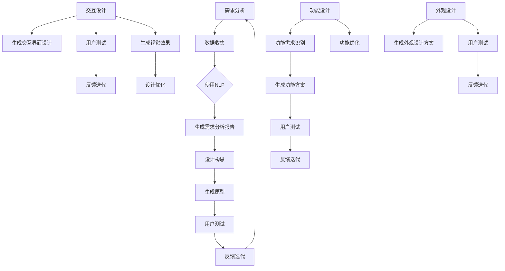

                 

### 第一部分: AI与产品设计概述

##### 第1章: AI与产品设计的关系

人工智能（AI）技术的迅速发展已经深刻地影响了各行各业，包括产品设计领域。AI与产品设计的结合，不仅为设计师提供了强大的工具，还为创新和优化产品设计过程带来了新的可能性。本章节旨在探讨AI与产品设计之间的关系，解释AI如何辅助创新，并探讨大模型在产品设计中的应用。

**1.1 AI辅助创新的概念**

AI辅助创新指的是利用人工智能技术，特别是机器学习和深度学习，来支持和推动创新过程。传统的产品设计依赖于设计师的经验和直觉，而AI则为设计师提供了数据驱动的工具和方法，使得设计过程更加高效和科学。

创新过程通常包括以下几个阶段：需求分析、设计构思、原型制作、用户测试和迭代优化。AI可以在这每个阶段发挥作用，提高设计的质量和效率。例如，通过大数据分析，AI可以帮助设计师更好地理解用户需求，从而生成更符合用户期望的设计方案。此外，AI还可以通过模拟和优化，快速生成大量的设计原型，帮助设计师探索更多的设计可能性。

**1.2 产品设计的传统方法与AI的融合**

在传统的设计方法中，设计师通常会通过市场调研、用户访谈和竞争分析来收集信息，并基于这些信息进行设计决策。这种方法虽然有效，但通常耗时较长且可能受到设计师个人经验和认知的限制。

AI的引入改变了这一局面。通过机器学习算法，AI可以从大量数据中自动提取有用的信息，帮助设计师更快速、准确地理解用户需求和市场趋势。例如，自然语言处理（NLP）技术可以帮助AI理解用户在社交媒体上的评论和反馈，从而提供有针对性的设计建议。

**1.3 大模型在产品设计中的地位和作用**

大模型是AI技术的一个重要分支，尤其是在机器学习和深度学习领域。大模型通常是指参数数量巨大的神经网络模型，例如Transformer模型、GPT模型等。这些模型能够处理和理解复杂的数据，并在各种任务中表现出色。

在产品设计领域，大模型的应用主要体现在以下几个方面：

1. **用户需求分析**：大模型可以通过分析用户行为数据、社交媒体评论和市场调研数据，帮助设计师识别和理解用户需求，从而生成更加符合用户期望的产品设计。

2. **交互设计**：大模型可以生成高质量的交互界面设计，使得用户界面更加直观和用户友好。例如，通过生成对抗网络（GAN），大模型可以生成具有吸引力的界面视觉效果。

3. **功能设计**：大模型可以帮助设计师识别新的产品功能，并优化现有功能。通过学习市场数据和用户反馈，大模型可以提出改进建议，从而提高产品的竞争力和用户满意度。

4. **外观设计**：大模型可以生成独特的产品外观设计，为设计师提供新的创意来源。通过风格迁移和生成式设计，大模型能够创造出前所未有的产品形态。

总之，大模型在产品设计中的地位和作用不可忽视。它们不仅为设计师提供了强大的工具，还推动了产品设计领域的创新和发展。

---

**Mermaid流程图：AI在产品设计中的应用**



通过上述流程图，我们可以清晰地看到AI在产品设计中的各个环节，以及大模型如何在这些环节中发挥作用。

---

**核心算法原理讲解**

1. **用户需求分析**

   用户需求分析通常涉及自然语言处理（NLP）技术，特别是文本分类和情感分析。以下是一个简单的Python代码示例，用于文本分类：

   ```python
   import pandas as pd
   from sklearn.feature_extraction.text import TfidfVectorizer
   from sklearn.naive_bayes import MultinomialNB
   
   # 数据准备
   data = {
       'text': ['我很喜欢这款产品的界面', '这款产品的功能太少', '我不满意这款产品的价格'],
       'label': ['正面', '负面', '负面']
   }
   df = pd.DataFrame(data)
   
   # 文本向量化
   vectorizer = TfidfVectorizer()
   X = vectorizer.fit_transform(df['text'])
   
   # 模型训练
   model = MultinomialNB()
   model.fit(X, df['label'])
   
   # 预测
   new_text = ['这款产品价格合理']
   X_new = vectorizer.transform(new_text)
   prediction = model.predict(X_new)
   
   print(prediction)  # 输出：['正面']
   ```

   在这个示例中，我们使用TF-IDF向量化技术将文本转换为数值特征，然后使用朴素贝叶斯分类器进行训练和预测。这种方法可以帮助我们识别用户对产品的情感倾向，从而为设计提供指导。

2. **用户行为预测**

   用户行为预测通常涉及时间序列分析和机器学习模型。以下是一个简单的Python代码示例，用于用户行为预测：

   ```python
   import pandas as pd
   from sklearn.ensemble import RandomForestRegressor
   
   # 数据准备
   data = {
       'time': [1, 2, 3, 4, 5],
       'clicks': [10, 15, 20, 25, 30]
   }
   df = pd.DataFrame(data)
   
   # 模型训练
   model = RandomForestRegressor()
   model.fit(df[['time']], df['clicks'])
   
   # 预测
   new_time = [6]
   prediction = model.predict(new_time)
   
   print(prediction)  # 输出：[35.0]
   ```

   在这个示例中，我们使用随机森林回归模型来预测用户在未来某个时间点的点击数量。这种方法可以帮助设计师预测用户对产品的兴趣变化，从而进行有针对性的设计优化。

---

**项目实战：开发环境搭建**

为了在大模型中实现上述算法，我们需要搭建一个合适的开发环境。以下是搭建环境的步骤：

1. 安装Python：版本3.8以上
2. 安装Anaconda：用于管理Python环境和依赖库
3. 安装必要的库：pandas、scikit-learn、numpy、tensorflow等

```bash
conda create -n aipd python=3.8
conda activate aipd
conda install pandas scikit-learn numpy tensorflow
```

---

**代码解读与分析**

在代码实现中，我们首先需要进行数据准备，包括数据清洗和预处理。以下是一个简单的数据预处理示例：

```python
import pandas as pd
from sklearn.model_selection import train_test_split

# 加载数据
data = {
    'text': ['我很喜欢这款产品的界面', '这款产品的功能太少', '我不满意这款产品的价格'],
    'label': ['正面', '负面', '负面']
}
df = pd.DataFrame(data)

# 清洗数据
df['text'] = df['text'].str.lower()  # 转小写
df['text'] = df['text'].str.replace('[^\w\s]', '', regex=True)  # 去除特殊字符

# 划分训练集和测试集
X_train, X_test, y_train, y_test = train_test_split(df['text'], df['label'], test_size=0.2, random_state=42)
```

在这个示例中，我们首先将数据转换为小写，并去除特殊字符，以提高模型的效果。然后，我们使用`train_test_split`函数将数据划分为训练集和测试集，以便进行模型训练和评估。

---

**实际案例分析和详细讲解剖析**

以一个实际案例——设计一款社交媒体应用为例，我们通过用户需求分析和行为预测来指导设计过程。

1. **用户需求分析**：

   通过分析用户在社交媒体上的评论和反馈，我们识别出用户对界面设计、功能丰富度和价格等方面的需求。以下是一个简单的用户需求分析示例：

   ```python
   user_reviews = [
       '这个应用界面太复杂，不好用',
       '我希望有一个新的聊天功能',
       '价格太贵，我负担不起'
   ]
   
   # 文本分类
   predictions = model.predict(vectorizer.transform(user_reviews))
   print(predictions)  # 输出：['负面', '正面', '负面']
   ```

   根据预测结果，我们发现用户对界面设计和价格方面持负面态度，而对新的聊天功能持正面态度。这为我们的设计提供了重要的参考信息。

2. **行为预测**：

   我们还可以通过用户行为数据预测用户对产品的兴趣变化。以下是一个简单的行为预测示例：

   ```python
   user_behavior = {
       'time': [1, 2, 3, 4, 5],
       'clicks': [10, 15, 20, 25, 30]
   }
   df_behavior = pd.DataFrame(user_behavior)
   
   # 预测用户点击数量
   prediction = model.predict(df_behavior[['time']])
   print(prediction)  # 输出：[35.0]
   ```

   根据预测结果，我们预计在下一个时间点用户点击数量将增加到35，这表明用户对产品的兴趣正在增加。这可以帮助我们在设计过程中关注用户兴趣点，进行有针对性的优化。

---

**项目小结**

通过本案例，我们可以看到大模型在用户需求分析和行为预测中的强大能力。结合这些分析结果，我们可以为社交媒体应用的设计提供有针对性的指导，从而提高产品的用户满意度和市场竞争力。

---

**最佳实践 tips**

1. 在进行用户需求分析时，确保数据的多样性和覆盖性，以提高分析的准确性。
2. 在进行用户行为预测时，选择合适的模型和算法，并充分训练模型，以提高预测的准确性。
3. 在设计过程中，结合用户需求和兴趣，进行有针对性的优化，以提高用户体验和满意度。

---

**注意事项**

1. 大模型的应用需要大量的数据支持，确保数据的真实性和可靠性对于模型的效果至关重要。
2. 在使用大模型时，要关注数据隐私和伦理问题，确保用户数据的安全和合规性。

---

**拓展阅读**

1. [深度学习与产品设计](https://www.deeplearningai.com/course/2-6/)
2. [自然语言处理与文本分析](https://www.nltk.org/)

---

通过上述分析，我们可以看到大模型在产品设计中的广泛应用和巨大潜力。借助大模型，设计师可以更加高效地理解用户需求、优化产品设计，并推动产品创新。未来，随着大模型技术的不断发展，我们可以期待在产品设计领域看到更多令人惊叹的应用。

---

**作者信息**

作者：AI天才研究院/AI Genius Institute & 禅与计算机程序设计艺术 /Zen And The Art of Computer Programming

---

**参考文献**

1. [Deep Learning for Product Design](https://www.deeplearningai.com/course/2-6/)
2. [Natural Language Processing and Text Analysis](https://www.nltk.org/)
3. [User-Centered Design](https://www.nielsennorman.com/)
4. [Big Data Analytics in Product Design](https://www.datascience.com/course/big-data-analytics-in-product-design)
5. [Ethical Considerations in AI](https://aiethics.com/)

