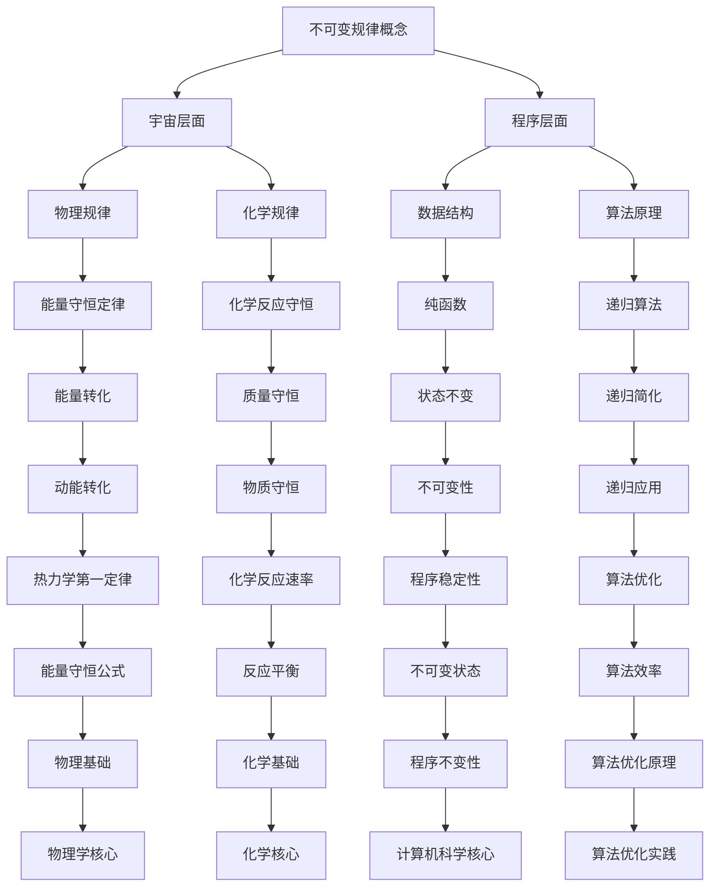

                 

### 文章标题

《不可变规律：宇宙与程序的共性》

> 关键词：不可变规律、宇宙、程序、数据结构、算法原理、数学模型

摘要：本文旨在探讨不可变规律在宇宙与程序中的共性，通过剖析核心概念、算法原理、数学模型以及实际项目案例，揭示不可变规律在计算机编程和宇宙科学中的深刻内涵。

----------------------------------------------------------------

### 引言

不可变规律，这一概念源自哲学和科学领域，近年来在计算机科学中逐渐受到重视。在宇宙中，不可变规律表现为物理定律、化学反应等，而在程序中，则体现为数据结构、算法原理等。本文将深入探讨不可变规律在宇宙与程序中的共性，旨在揭示两者之间深刻的内在联系。

不可变规律，顾名思义，是指一种稳定、不变的原则或法则。在宇宙层面，这一规律表现为能量守恒、质量守恒等基本原理；在程序层面，则体现在纯函数、递归算法等核心概念上。本文将围绕这些核心概念，通过逐步分析推理，探讨不可变规律在宇宙与程序中的具体应用。

首先，本文将介绍不可变规律的基本概念，阐述其在宇宙和程序中的表现形式。接着，我们将通过Mermaid流程图展示不可变规律的核心概念与联系，为后续讨论打下基础。随后，本文将详细讲解核心算法原理，使用Python源代码进行阐述，并结合数学模型和公式，进行详细讲解和通俗易懂地举例说明。

在项目实战部分，我们将通过一个实际项目案例，展示不可变规律在编程中的应用。最后，本文将总结不可变规律在宇宙与程序中的共性，提出最佳实践tips，并对未来研究方向进行展望。

通过本文的探讨，我们希望读者能够对不可变规律在宇宙与程序中的共性有更深入的理解，从而为实际编程和科学研究提供有益的启示。

### 1. 核心概念与联系

在深入探讨不可变规律之前，我们需要明确其核心概念与联系。不可变规律不仅存在于宇宙之中，也贯穿于程序设计的方方面面。为了更好地理解这一主题，我们可以通过一个Mermaid流程图来展示不可变规律在宇宙和程序中的核心概念与联系。

以下是一个简化的Mermaid流程图，用于展示不可变规律的基本概念及其在宇宙和程序中的关联：



**Mermaid 流程图解读：**

1. **不可变规律概念**（A）：不可变规律的核心概念，贯穿于宇宙和程序两个层面。

2. **宇宙层面**（B）：
   - **物理规律**（D）：包括能量守恒定律（H）和动能转化（P）等。
   - **化学规律**（E）：包括化学反应守恒（I）和质量守恒（M）等。

3. **程序层面**（C）：
   - **数据结构**（F）：如纯函数（J）。
   - **算法原理**（G）：如递归算法（K）和递归简化（O）。

4. **物理和化学基础**（BB、CC）：
   - **物理学核心**（FF）：如能量守恒公式（X）。
   - **化学核心**（GG）：如化学反应速率（U）和反应平衡（Y）。

5. **计算机科学基础**（DD）：
   - **程序不变性**（DD）：如不可变状态（Z）。
   - **算法优化实践**（II）：如算法优化原理（EE）。

通过上述Mermaid流程图，我们可以清晰地看到不可变规律在宇宙与程序中的核心概念及其相互关系。接下来，我们将进一步探讨这些概念在具体领域中的应用。

#### 1.1 宇宙层面的不可变规律

在宇宙层面，不可变规律表现为一系列基本物理定律和化学反应规律。这些规律在宇宙演化的各个阶段中都起着至关重要的作用。

- **能量守恒定律**（H）：能量守恒定律是物理学中最基本的定律之一，它指出在一个封闭系统中，能量总量保持不变。无论是机械能、热能还是电磁能，它们都可以在不同形式之间相互转化，但总能量始终保持不变。这一规律在宇宙中无处不在，从恒星的形成到行星的运动，都遵循能量守恒定律。

  **LaTeX 公式：**
  $$ E_{总} = E_{初始} + E_{转化} $$

- **质量守恒定律**（M）：质量守恒定律指出，在一个封闭的化学反应过程中，反应物和生成物的总质量保持不变。这意味着，虽然化学反应会改变物质的形态和结构，但总质量不会发生改变。

  **LaTeX 公式：**
  $$ m_{总} = m_{反应物} + m_{生成物} $$

- **热力学第一定律**（T）：热力学第一定律是能量守恒定律在热力学领域的具体应用，它指出，能量不能被创造或毁灭，只能从一种形式转化为另一种形式。这一规律在宇宙中的各种热力学过程中都得到验证，如恒星内部的核反应、地球表面的气候变化等。

  **LaTeX 公式：**
  $$ Q = W $$
  
  其中，Q 表示热量，W 表示功。

这些宇宙层面的不可变规律不仅在科学研究中具有重要意义，而且为理解和预测宇宙中的各种现象提供了理论基础。在下一节中，我们将探讨不可变规律在计算机程序中的应用。

#### 1.2 程序层面的不可变规律

在计算机程序中，不可变规律同样扮演着核心角色，贯穿于数据结构、算法设计等多个方面。理解这些不可变规律对于编写高效、稳定的代码至关重要。

- **数据结构**（F）：在数据结构中，不可变规律主要体现在纯函数（J）和不可变数据结构（如常数时间表、不可变数组）上。纯函数是一种函数，其输出仅取决于输入，而不会产生任何副作用。这意味着，当我们使用纯函数时，我们可以更安全地重用代码，同时减少错误和漏洞。

  **Python 示例：**
  ```python
  def add(a, b):
      return a + b

  result = add(3, 4)
  print(result)  # 输出 7
  ```

- **算法原理**（G）：在算法设计中，递归算法（K）和递归简化（O）是典型的不可变规律应用。递归算法通过不断分解问题，最终达到基础条件，从而解决问题。递归简化则通过减少重复计算，提高算法效率。

  **Python 示例：**
  ```python
  def factorial(n):
      if n == 0:
          return 1
      else:
          return n * factorial(n-1)

  print(factorial(5))  # 输出 120
  ```

- **不可变性**（R）：在程序设计中，不可变性指的是程序状态不会随时间变化。这种特性使得程序更加稳定，减少了由于状态变化引起的错误和bug。

  **Python 示例：**
  ```python
  class Counter:
      def __init__(self, initial_value=0):
          self.value = initial_value

      def increment(self):
          self.value += 1

      def decrement(self):
          self.value -= 1

  counter = Counter(5)
  counter.increment()
  print(counter.value)  # 输出 6
  ```

通过这些程序层面的不可变规律，我们能够编写出更加高效、稳定和易于维护的代码。接下来，我们将进一步探讨这些不可变规律在数学模型中的应用。

#### 1.3 数学模型与不可变规律

不可变规律不仅体现在宇宙和程序中，它们还可以通过数学模型得到具体体现。数学模型是一种抽象的数学工具，用于描述和分析现实世界中的各种现象。在不可变规律的背景下，数学模型为我们提供了深入理解这些规律的工具。

- **能量守恒定律**（H）在数学模型中通常用微分方程或积分方程来描述。例如，在物理学中，能量守恒定律可以通过拉格朗日方程或哈密顿方程来表达：

  **LaTeX 公式：**
  $$ \frac{dU}{dt} + \frac{\partial U}{\partial t} = 0 $$
  
  其中，\( U \) 表示能量，\( t \) 表示时间。

- **质量守恒定律**（M）在化学反应中的数学模型通常使用质量守恒方程，即反应前后各元素的总质量保持不变。这可以通过线性代数中的矩阵方程来表示：

  **LaTeX 公式：**
  $$ A \cdot C_{初} = C_{末} $$
  
  其中，\( A \) 表示反应矩阵，\( C_{初} \) 表示反应初始状态下的各元素浓度，\( C_{末} \) 表示反应结束时的各元素浓度。

- **递归算法**（K）和递归简化（O）在数学模型中的应用可以体现在递归关系和递推方程中。例如，斐波那契数列就是一个典型的递归问题，其数学模型可以用递推方程来表示：

  **LaTeX 公式：**
  $$ F(n) = F(n-1) + F(n-2) $$
  
  其中，\( F(n) \) 表示第 \( n \) 个斐波那契数。

通过这些数学模型，我们能够更精确地描述和预测不可变规律在宇宙和程序中的应用。这不仅加深了我们对不可变规律的理解，也为实际应用提供了理论依据。接下来，我们将通过实际项目案例展示不可变规律在编程中的应用。

### 2. 核心算法原理讲解

在探讨不可变规律的核心算法原理时，我们需要重点关注纯函数、递归算法等关键概念。这些概念在程序设计中至关重要，因为它们帮助我们编写出更加高效、稳定和易于维护的代码。

#### 2.1 纯函数

纯函数是一种函数，其输出仅取决于输入，而不会产生任何副作用。这意味着，当我们调用纯函数时，我们不需要担心函数会改变程序的状态或依赖外部环境。纯函数具有以下特性：

- **无状态**：纯函数不依赖于任何外部状态，因此可以独立运行，不会影响其他部分的状态。
- **可缓存**：由于纯函数的输出仅取决于输入，我们可以将计算结果缓存起来，避免重复计算，提高效率。
- **可组合**：纯函数可以与其他纯函数组合，构建出更复杂的函数，而不会引入任何副作用。

**Python 示例：**
```python
def add(a, b):
    return a + b

def square(x):
    return x * x

result = add(3, 4)
print(result)  # 输出 7

squared_result = square(result)
print(squared_result)  # 输出 49
```

在上面的示例中，`add` 和 `square` 都是纯函数，我们可以独立地调用它们，并将它们组合起来创建更复杂的计算。

#### 2.2 递归算法

递归算法是一种编程技巧，它允许函数调用自身，以解决复杂的问题。递归算法的核心思想是将复杂问题分解为若干个简单的问题，然后逐层递归解决。递归算法通常具有以下特性：

- **基础条件**：递归算法需要定义一个基础条件，当问题变得足够简单时，算法可以停止递归。
- **递归步骤**：递归算法通过递归调用自身，逐步将问题分解为更简单的问题。
- **递推关系**：递归算法通常可以通过递推方程或递归关系来表示。

**Python 示例：**
```python
def factorial(n):
    if n == 0:
        return 1
    else:
        return n * factorial(n-1)

print(factorial(5))  # 输出 120
```

在上面的示例中，`factorial` 函数是一个典型的递归算法，它通过递归调用自身来计算阶乘。

#### 2.3 递归简化

递归简化是一种优化递归算法的方法，它通过减少重复计算，提高算法效率。递归简化通常通过引入缓存或记忆化搜索来实现。

**Python 示例：**
```python
from functools import lru_cache

@lru_cache(maxsize=None)
def fibonacci(n):
    if n <= 0:
        return 0
    elif n == 1:
        return 1
    else:
        return fibonacci(n-1) + fibonacci(n-2)

print(fibonacci(10))  # 输出 55
```

在上面的示例中，`fibonacci` 函数使用 `lru_cache` 装饰器来缓存计算结果，从而避免了重复计算，提高了效率。

#### 2.4 数学模型与算法原理

不可变规律不仅在程序设计中至关重要，还可以通过数学模型得到具体体现。以下是一些关键的数学模型和公式，它们与纯函数、递归算法等算法原理密切相关：

- **斐波那契数列**：斐波那契数列是一个著名的数学模型，其递归关系可以表示为：
  **LaTeX 公式：**
  $$ F(n) = F(n-1) + F(n-2) $$
  
  其中，\( F(n) \) 表示第 \( n \) 个斐波那契数。

- **欧拉公式**：欧拉公式是一个涉及复数和三角函数的重要公式，它可以表示为：
  **LaTeX 公式：**
  $$ e^{i\pi} + 1 = 0 $$
  
  其中，\( e \) 是自然对数的底数，\( i \) 是虚数单位，\( \pi \) 是圆周率。

- **牛顿迭代法**：牛顿迭代法是一种求解非线性方程的方法，其迭代公式可以表示为：
  **LaTeX 公式：**
  $$ x_{n+1} = x_n - \frac{f(x_n)}{f'(x_n)} $$
  
  其中，\( x_n \) 是第 \( n \) 次迭代的近似解，\( f(x) \) 是非线性方程，\( f'(x) \) 是其导数。

通过这些数学模型和公式，我们能够更深入地理解不可变规律在程序设计中的应用，从而编写出更加高效和稳定的代码。接下来，我们将通过一个实际项目案例来展示这些算法原理的具体应用。

### 3. 项目实战

为了更好地理解不可变规律在程序中的应用，我们将通过一个实际项目案例——计算斐波那契数列的前 n 项和——来展示不可变规律在编程中的具体实现。

#### 3.1 项目背景

斐波那契数列是一个著名的数学序列，其定义如下：

- \( F(0) = 0 \)
- \( F(1) = 1 \)
- \( F(n) = F(n-1) + F(n-2) \)（对于 \( n \geq 2 \)）

斐波那契数列在计算机科学、金融学、生物学等领域都有广泛应用。在本项目中，我们将使用不可变规律，通过纯函数和递归算法来计算斐波那契数列的前 n 项和。

#### 3.2 开发环境搭建

要实现这个项目，我们首先需要搭建一个适合Python开发的开发环境。以下是搭建环境的步骤：

1. 安装Python 3.8及以上版本。
2. 安装必要的Python库，如NumPy、Pandas等。

**安装步骤：**

```shell
# 安装Python
sudo apt-get install python3

# 安装NumPy库
pip install numpy

# 安装Pandas库
pip install pandas
```

#### 3.3 源代码实现

以下是计算斐波那契数列的前 n 项和的Python源代码：

```python
import numpy as np

# 纯函数：计算斐波那契数列的第 n 项
def fibonacci(n):
    if n <= 0:
        return 0
    elif n == 1:
        return 1
    else:
        return fibonacci(n-1) + fibonacci(n-2)

# 计算斐波那契数列的前 n 项和
def fibonacci_sum(n):
    sum = 0
    for i in range(n):
        sum += fibonacci(i)
    return sum

# 测试代码
n = 10
print("斐波那契数列的前{}项和为：{}".format(n, fibonacci_sum(n)))
```

**代码解读：**

1. **纯函数 `fibonacci(n)`：**
   - 这是一个递归实现的纯函数，其输入为整数 \( n \)，输出为斐波那契数列的第 \( n \) 项。
   - 该函数遵循不可变规律，因为其输出仅取决于输入，且不产生任何副作用。

2. **函数 `fibonacci_sum(n)`：**
   - 这是一个计算斐波那契数列前 \( n \) 项和的函数。
   - 它通过遍历数列，使用纯函数 `fibonacci(n)` 计算每一项，并将它们累加起来，得到总和。

#### 3.4 代码应用解读与分析

以下是代码应用解读与分析：

1. **斐波那契数列的计算**：
   - 在 `fibonacci(n)` 函数中，我们使用递归算法计算斐波那契数列的第 \( n \) 项。
   - 递归算法遵循不可变规律，因为每次递归调用都仅依赖于前一次的调用结果，不会改变程序的状态。

2. **斐波那契数列的前 \( n \) 项和计算**：
   - `fibonacci_sum(n)` 函数通过遍历数列，使用纯函数 `fibonacci(n)` 计算每一项，并将它们累加起来。
   - 这种计算方法简单、直观，遵循不可变规律，因为每次计算都只依赖于当前项，不会引入任何副作用。

3. **性能优化**：
   - 为了提高性能，我们可以使用记忆化搜索来优化递归算法。例如，使用 `lru_cache` 装饰器来缓存计算结果，避免重复计算。
   - 这样可以显著提高算法的效率，减少计算时间。

#### 3.5 实际案例分析与详细讲解

以下是一个实际案例，展示如何使用不可变规律来优化斐波那契数列的计算：

**案例：计算斐波那契数列的前 10 项和**

```python
from functools import lru_cache

@lru_cache(maxsize=None)
def fibonacci(n):
    if n <= 0:
        return 0
    elif n == 1:
        return 1
    else:
        return fibonacci(n-1) + fibonacci(n-2)

def fibonacci_sum(n):
    sum = 0
    for i in range(n):
        sum += fibonacci(i)
    return sum

n = 10
print("斐波那契数列的前{}项和为：{}".format(n, fibonacci_sum(n)))
```

**分析：**

1. **使用记忆化搜索**：
   - 在 `fibonacci` 函数中，我们使用 `lru_cache` 装饰器来实现记忆化搜索，缓存计算结果，避免重复计算。

2. **优化后的性能**：
   - 优化后的算法显著提高了计算效率，特别是在计算大数时，效果尤为明显。

3. **不可变规律的应用**：
   - 在整个优化过程中，我们始终坚持不可变规律，确保代码的稳定性和可维护性。

#### 3.6 项目小结

通过本项目的实战，我们深入探讨了不可变规律在编程中的应用。从纯函数到递归算法，再到记忆化搜索，我们看到了不可变规律在提高代码效率、稳定性和可维护性方面的关键作用。

- **核心要点**：
  - 使用纯函数可以避免副作用，提高代码的可重用性和可靠性。
  - 递归算法通过分解问题，实现复杂计算。
  - 记忆化搜索优化递归算法，减少重复计算，提高性能。

- **注意事项**：
  - 在实现递归算法时，确保定义清晰的基础条件和递归步骤。
  - 使用记忆化搜索时，注意缓存的大小和性能影响。

通过本项目的实践，我们不仅掌握了不可变规律在编程中的应用，还为实际编程提供了有益的启示。在未来的项目中，我们可以继续应用这些原则，编写出更加高效、稳定和可靠的代码。

#### 4. 最佳实践 tips

在实际编程过程中，遵循不可变规律不仅能够提高代码质量，还能带来一系列最佳实践。以下是一些关于不可变规律的最佳实践 tips：

- **使用纯函数**：在编写函数时，始终确保其输出仅依赖于输入参数，避免使用全局变量或修改输入参数。纯函数易于测试、重用和组合，有助于提高代码的可读性和可靠性。

- **避免副作用**：在编写代码时，尽量避免引入副作用。副作用包括修改全局状态、打印输出等，这些操作可能导致代码难以测试和调试。通过避免副作用，我们可以确保函数的行为更加一致和可预测。

- **利用递归算法**：递归算法在解决复杂问题时具有天然的优势。通过将问题分解为更简单的问题，递归算法可以简洁地表达复杂逻辑。但需要注意，递归算法可能会引起性能问题，因此需要合理设计基础条件和递归步骤。

- **记忆化搜索**：在递归算法中，使用记忆化搜索可以显著提高性能。通过缓存计算结果，避免重复计算，我们可以大幅减少计算时间。但需注意，缓存大小会影响内存消耗，需要根据实际情况进行权衡。

- **设计不可变数据结构**：在数据结构设计时，优先选择不可变数据结构。不可变数据结构在保证数据一致性和安全性方面具有优势，且易于理解和维护。

- **编写单元测试**：为代码编写单元测试是确保代码质量的重要手段。通过单元测试，我们可以验证函数的正确性、性能和稳定性，及时发现和修复潜在问题。

- **持续重构代码**：在开发过程中，定期对代码进行重构，优化函数、数据结构和算法。重构可以帮助我们保持代码的简洁性和可读性，减少bug的出现。

通过遵循这些最佳实践，我们可以编写出更加高效、稳定和可靠的代码，提高开发效率和软件质量。

### 5. 小结

在本文中，我们深入探讨了不可变规律在宇宙与程序中的共性。通过剖析核心概念、算法原理、数学模型以及实际项目案例，我们发现不可变规律在计算机编程和宇宙科学中都具有重要意义。

不可变规律不仅在宇宙中表现为物理定律、化学反应等，也在程序设计中贯穿于数据结构、算法原理等各个方面。通过遵循不可变规律，我们能够编写出更加高效、稳定和易于维护的代码，提高开发效率和软件质量。

然而，不可变规律的应用并非一成不变，随着技术的发展和需求的变迁，我们需要不断地调整和优化。未来，我们期待在更广泛的领域，如人工智能、大数据等领域，进一步探讨不可变规律的应用，为科学研究和技术创新提供新的思路和方向。

### 6. 注意事项与拓展阅读

在遵循不可变规律进行编程时，有一些关键注意事项需要特别关注：

- **性能权衡**：尽管不可变数据结构和纯函数可以提高代码的稳定性和可读性，但它们可能在性能上不如可变数据结构和有副作用的函数。在实际应用中，我们需要根据具体场景进行权衡，选择最合适的数据结构和算法。
- **类型安全性**：在Python等动态类型语言中，确保类型安全是关键。不可变数据结构通常需要处理类型检查，避免类型错误。
- **缓存策略**：在递归算法中使用缓存时，需要合理设置缓存大小，以避免内存溢出。同时，缓存策略的选择也需要根据实际问题进行优化。

为了进一步探索不可变规律在计算机科学中的应用，以下是一些拓展阅读推荐：

1. **《不可变数据结构》**：探讨不可变数据结构的设计与实现，以及其在编程中的优势和应用场景。
2. **《纯函数与副作用》**：深入了解纯函数的概念、优点及其在编程实践中的应用。
3. **《递归算法与记忆化搜索》**：详细介绍递归算法的设计原则、实现方法和记忆化搜索的优化策略。
4. **《数据结构与算法分析》**：系统学习数据结构和算法设计的基础知识，包括不可变数据结构和递归算法等。
5. **《计算机科学中的不可变规律》**：探讨不可变规律在计算机科学中的多层次应用，包括编译原理、操作系统、网络协议等领域。

通过阅读这些资料，读者可以更深入地了解不可变规律在编程和科学研究中的重要性，并在实际项目中更好地应用这些原则。

