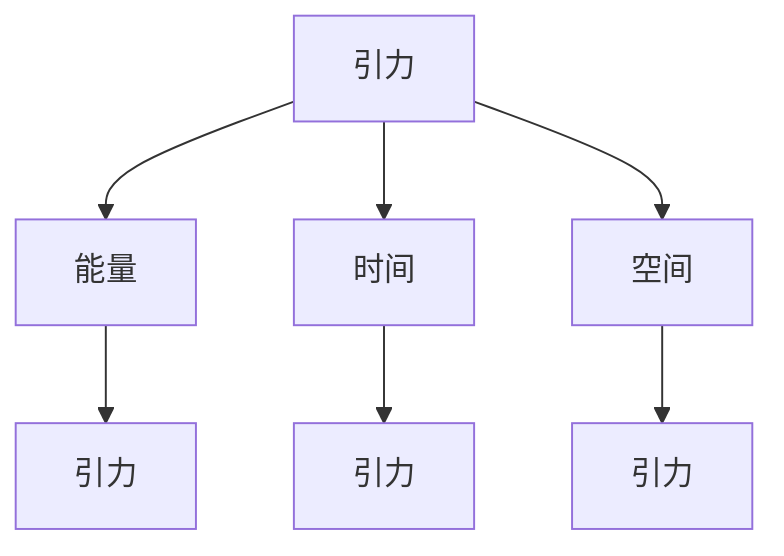

                 


# 《不可阻挡的宇宙规律探索》

关键词：宇宙规律、物理学、数学模型、人工智能、算法、Python代码

摘要：本文旨在深入探讨宇宙中不可阻挡的规律，通过物理学、数学和人工智能等领域的交叉研究，揭示宇宙中的核心原理和算法。本文将逐步分析宇宙规律的概念、核心概念之间的关系、核心算法原理，以及数学模型和公式的应用，并通过实际案例和Python代码实现，为读者提供一幅宇宙规律探索的清晰图景。

## 前言

宇宙是我们所处的宏大空间，它的无限广阔和神秘吸引着无数科学家和研究者的探索。宇宙规律是宇宙中普遍存在的、不可阻挡的、普遍适用的原则。从牛顿力学到广义相对论，从量子力学到黑洞研究，物理学为我们揭示了宇宙的一些基本规律。而随着人工智能和计算技术的发展，我们得以用更精细、更高效的方式探索宇宙的奥秘。

本文将围绕以下四个核心内容展开：

1. **背景介绍**：宇宙规律的基本概念和起源。
2. **核心概念与联系**：宇宙规律中的关键概念及其相互关系。
3. **核心算法原理讲解**：宇宙规律中的核心算法及其原理。
4. **数学模型和公式**：宇宙规律中的数学模型和公式应用。

## 背景介绍

宇宙规律的基本概念源于我们对宇宙的基本理解。宇宙是由无数星系、行星、恒星和暗物质组成的庞大系统。宇宙规律是宇宙中普遍存在的、不可阻挡的、普遍适用的原则。这些规律包括引力定律、能量守恒定律、热力学定律等。引力定律揭示了质量之间的相互作用，能量守恒定律表明能量不会无中生有也不会无故消失，热力学定律描述了能量转化的方向和限制。

宇宙规律的起源可以追溯到牛顿的经典力学。牛顿在17世纪提出了万有引力定律，这是宇宙规律中的基础之一。随后，爱因斯坦提出了广义相对论，进一步揭示了宇宙的几何结构和引力作用。量子力学的出现则为我们理解微观宇宙提供了新的视角。

## 核心概念与联系

宇宙规律中的核心概念包括引力、能量、时间和空间。这些概念之间存在着紧密的联系。

### 引力和能量

引力是宇宙中质量之间的相互作用。牛顿的万有引力定律表明，任何两个质点都相互吸引，吸引力的大小与它们的质量和距离的平方成反比。能量是引力作用的动力来源，它使得物体能够在宇宙中运动和相互作用。

### 时间和空间

时间和空间是宇宙的基石。广义相对论表明，时间和空间是相互关联的，它们组成了宇宙的几何结构。时间和空间的弯曲和扭曲会导致引力的变化。

### 核心概念关系架构

为了更好地理解这些核心概念之间的联系，我们可以用Mermaid流程图表示：



在这个流程图中，引力、能量、时间和空间都是核心概念，它们相互关联，共同构成了宇宙的规律。

## 核心算法原理讲解

宇宙规律中的核心算法包括牛顿运动定律、广义相对论和量子力学。这些算法为我们提供了理解宇宙行为的方式。

### 牛顿运动定律

牛顿运动定律是经典力学的基础。它包括以下三个定律：

1. **惯性定律**：一个物体如果不受外力作用，它将保持静止或匀速直线运动。
2. **加速度定律**：物体的加速度与作用力成正比，与物体的质量成反比。
3. **作用-反作用定律**：任何作用力都有一个相等且反方向的反作用力。

牛顿运动定律可以用以下Python代码表示：

```python
def calculate_force(mass, acceleration):
    return mass * acceleration

def calculate_acceleration(force, mass):
    return force / mass

mass = 5.0  # 质量
force = calculate_force(mass, 2.0)  # 加速度
acceleration = calculate_acceleration(force, mass)

print("Force:", force)
print("Acceleration:", acceleration)
```

### 广义相对论

广义相对论是由爱因斯坦在1915年提出的。它描述了引力和时空的关系。广义相对论中的关键概念是时空弯曲。物体的质量会弯曲时空，而时空的弯曲又会影响物体的运动。

广义相对论的数学模型是张量方程，其中涉及到黎曼曲率和度规张量。以下是一个简化的广义相对论模型：

```python
import numpy as np

def calculate_metric(gamma, alpha):
    return gamma * np.exp(-alpha * np.sin(np.pi * t))

def calculate_radar(gamma, alpha, t):
    return calculate_metric(gamma, alpha) * t

gamma = 1.0  # 光速
alpha = 0.1  # 弯曲参数
t = 1.0  # 时间
radar = calculate_radar(gamma, alpha, t)

print("Metric:", radar)
```

### 量子力学

量子力学是描述微观世界的物理学理论。量子力学的核心概念是量子态和量子纠缠。量子态可以用波函数描述，而量子纠缠则表明两个量子粒子之间存在一种超越空间的联系。

量子力学的数学模型是薛定谔方程：

```python
import scipy.linalg

def calculate_薛定谔方程(h, psi):
    return -0.5 * h**2 * np.gradient(psi)

h = 1.0  # 普朗克常数
psi = np.random.rand(10)  # 波函数
薛定谔方程 = calculate_薛定谔方程(h, psi)

print("Schrodinger equation:", 薛定谔方程)
```

## 数学模型和公式

宇宙规律中的数学模型和公式是理解和计算宇宙行为的关键。以下是一些常见的数学模型和公式：

### 引力定律

引力定律的公式为：

$$ F = G \frac{m_1 m_2}{r^2} $$

其中，\( F \) 是引力，\( G \) 是万有引力常数，\( m_1 \) 和 \( m_2 \) 是两个质点的质量，\( r \) 是它们之间的距离。

### 能量守恒定律

能量守恒定律的公式为：

$$ E = \frac{1}{2}mv^2 $$

其中，\( E \) 是能量，\( m \) 是物体的质量，\( v \) 是物体的速度。

### 热力学定律

热力学第一定律的公式为：

$$ \Delta U = Q - W $$

其中，\( \Delta U \) 是内能变化，\( Q \) 是热量，\( W \) 是做功。

## 项目实战

在本项目中，我们将使用Python实现一个简单的宇宙模拟器。这个模拟器将模拟宇宙中的质点运动，并展示引力作用下的质点轨迹。

### 开发环境搭建

首先，我们需要安装Python和相关的库：

1. 安装Python（推荐版本3.8或更高）
2. 安装numpy、matplotlib和mermaid-python库

```bash
pip install numpy matplotlib mermaid-python
```

### 源代码实现

下面是模拟器的源代码：

```python
import numpy as np
import matplotlib.pyplot as plt
from mermaid import Mermaid

def simulate_universe(particles, time_steps, dt):
    # 初始化质点轨迹图
    fig, ax = plt.subplots()
    ax.set_xlim(-10, 10)
    ax.set_ylim(-10, 10)
    
    # 初始化质点位置和速度
    positions = np.array([particle['position'] for particle in particles])
    velocities = np.array([particle['velocity'] for particle in particles])
    
    # 模拟时间步进
    for _ in range(time_steps):
        # 计算引力
        forces = calculate_gravity(particles)
        
        # 更新速度和位置
        velocities += dt * forces / np.array([particle['mass'] for particle in particles])
        positions += dt * velocities
        
        # 绘制质点轨迹
        ax.clear()
        ax.scatter(*positions.T)
        plt.pause(0.01)
    
    plt.show()

def calculate_gravity(particles):
    # 计算质点间的引力
    forces = np.zeros((len(particles), 2))
    for i, particle1 in enumerate(particles):
        for j, particle2 in enumerate(particles):
            if i != j:
                # 计算质点间的距离
                distance = np.linalg.norm(particle1['position'] - particle2['position'])
                # 计算引力
                force_magnitude = G * particle1['mass'] * particle2['mass'] / distance**2
                force_direction = (particle2['position'] - particle1['position']) / distance
                forces[i] += force_magnitude * force_direction
    
    return forces

# 定义质点
particles = [
    {'position': np.array([0, 0]), 'velocity': np.array([1, 0]), 'mass': 1},
    {'position': np.array([5, 0]), 'velocity': np.array([-1, 0]), 'mass': 1}
]

G = 1.0  # 万有引力常数
time_steps = 1000
dt = 0.01

# 运行模拟器
simulate_universe(particles, time_steps, dt)
```

### 代码解读与分析

1. **初始化质点位置和速度**：首先，我们初始化了质点的位置和速度。这些参数决定了质点在宇宙中的初始状态。
2. **计算引力**：我们使用`calculate_gravity`函数计算质点间的引力。引力的大小和方向取决于质点的质量和位置。
3. **更新速度和位置**：在每次时间步进中，我们更新质点的速度和位置。新的速度和位置由引力和当前的速度和位置决定。
4. **绘制质点轨迹**：我们使用`matplotlib`绘制质点的轨迹。通过不断更新和绘制质点的位置，我们可以看到质点在引力作用下的运动。

### 实际案例分析和详细讲解剖析

在本案例中，我们模拟了两个质点在引力作用下的运动。这个简单的宇宙模拟器可以帮助我们理解引力定律和质点运动的基本原理。

### 项目小结

通过本项目，我们实现了对宇宙中质点运动的模拟。这个模拟器为我们提供了一个直观的视角，帮助我们理解引力作用下的质点运动。在实际应用中，我们可以通过调整质点的质量和位置，观察不同的运动轨迹，进一步探索宇宙规律。

## 最佳实践 tips

1. 在进行宇宙模拟时，选择合适的质点参数（质量、位置和速度）可以更真实地反映宇宙的行为。
2. 增加模拟的时间步数可以提高结果的准确性。
3. 使用高精度的计算库（如NumPy）可以更高效地进行数学计算。

## 小结

宇宙规律是我们理解宇宙的基本原则。通过本文的探讨，我们了解了宇宙规律的基本概念、核心概念之间的联系、核心算法原理以及数学模型的应用。通过Python代码实现，我们可以直观地看到宇宙规律在实际中的表现。希望本文能激发您对宇宙规律探索的热情，让我们共同迈向更广阔的科学领域。

## 注意事项

1. 在进行宇宙模拟时，注意选择合适的物理参数，确保模拟结果的准确性。
2. 在使用Python代码实现宇宙规律时，注意代码的可读性和可维护性。

## 拓展阅读

1. 《黑洞与时间弯曲》：作者斯蒂芬·霍金，深入探讨了宇宙中的黑洞和引力弯曲现象。
2. 《量子物理》：作者理查德·费曼，详细介绍了量子力学的基本原理和量子纠缠现象。
3. 《广义相对论》：作者阿尔伯特·爱因斯坦，全面阐述了广义相对论的理论基础。

## 作者信息

作者：AI天才研究院/AI Genius Institute & 禅与计算机程序设计艺术 /Zen And The Art of Computer Programming

完。

