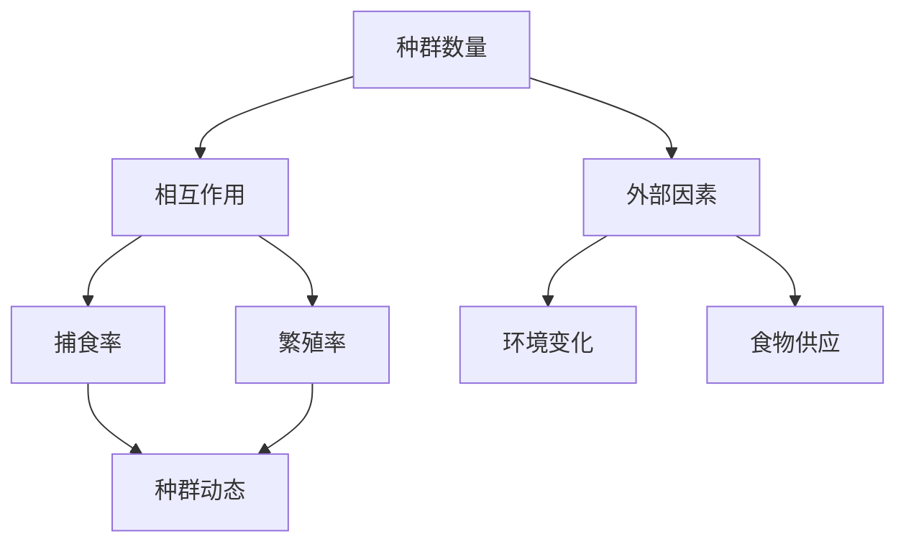

                 

### 引言

**关键词：**复杂自然、简洁数学、映射、理解、简化。

在探讨复杂系统的过程中，我们往往会发现一个核心问题：如何在纷繁复杂的自然界中找到简洁而有用的数学模型？《从复杂自然到简洁数学：映射之路》这本书旨在探讨这一问题，为我们提供一条从复杂到简洁的转换之路。

#### 复杂自然与简洁数学

自然界充满了复杂性和多样性，从生物体的生命过程，到天气系统的变化，再到生态系统的动态平衡，都是复杂性的典型表现。然而，在科学研究中，我们常常追求用简洁的数学语言来描述和解释这些复杂现象。

**简洁数学** 并不是指数学本身简单，而是指通过数学工具和模型，我们可以将复杂问题转化为更加简洁和易于处理的形式。这种转化不仅可以帮助我们更好地理解自然界，还能够指导我们进行创新和发明。

#### 本书的目的和结构

本书的主要目的是探讨如何将复杂的自然现象映射到简洁的数学模型中，从而帮助我们更好地理解自然界，并在实际应用中取得突破。为了实现这一目标，本书将分为以下几个主要部分：

1. **引言**：介绍复杂自然和简洁数学的基本概念，以及本书的目的和结构。
2. **自然界的复杂性**：探讨自然界中的复杂性现象，包括其定义、特征和主要表现。
3. **数学映射**：介绍如何使用数学模型来映射和理解自然现象，包括映射方法的原理和具体步骤。
4. **数学简化**：讨论如何通过数学简化来处理复杂问题，包括简化方法、算法原理和实际案例。
5. **实际应用**：展示数学映射在现实世界中的应用，包括开发环境搭建、源代码实现和案例分析。
6. **数学工具和技术**：介绍常用的数学工具和技术，以及如何在实际问题中应用。
7. **结论**：总结全书内容，展望未来的研究方向。

通过以上结构，本书将带领读者逐步深入探索从复杂自然到简洁数学的映射之路，帮助读者掌握这一重要的科学方法和思维方式。

### 自然界的复杂性

自然界是一个充满多样性和复杂性的世界。从微观的原子和分子，到宏观的行星和星系，从简单的化学反应，到复杂的生态系统，自然界中的现象无不体现出其复杂性。那么，什么是复杂性？它有哪些特征？我们又如何理解这种复杂性？

#### 复杂性的定义与特征

复杂性，从广义上讲，是指系统在结构和功能上表现出高度多样性、不确定性和动态变化的特性。在自然界中，复杂性的特征主要包括以下几个方面：

1. **多样性**：自然界中的现象千变万化，每种生物、每种化学反应、每种生态系统都有其独特的特性，这种多样性是复杂性的基础。
2. **不确定性**：自然现象往往具有不确定性和随机性，例如天气变化、金融市场波动等，这种不确定性增加了问题的复杂性。
3. **动态变化**：自然界中的现象不是静止不变的，而是处于不断变化的状态。例如，生态系统的演化、天气系统的变化等，这种动态变化性也是复杂性的一部分。
4. **相互作用**：自然界中的各种现象和系统之间相互关联、相互作用，形成了复杂的网络结构和动态过程。

#### 复杂性的主要表现

复杂性的主要表现在于：

1. **生物多样性**：生物多样性是自然界复杂性的直接体现。从单细胞生物到复杂的生态系统，生物种类和生态结构的多样性展示了自然界的复杂性和多样性。
2. **生态系统**：生态系统是一个典型的复杂系统，包括生物群落、生物与环境之间的相互作用，以及生态过程的动态变化。生态系统的复杂性不仅体现在物种多样性上，还体现在生态过程中的相互依赖和反馈机制。
3. **气候变化**：气候系统是一个全球性的复杂系统，其变化受到多种因素的影响，如大气层、海洋、地壳等。气候变化的复杂性和不确定性使得预测和应对气候变化成为一大挑战。
4. **社会系统**：人类社会也是一个复杂的系统，包括经济、政治、文化等多个方面。社会的复杂性在于个体行为和社会结构的相互作用，以及社会变革过程中的不确定性和动态变化。

#### 复杂性的理解

理解自然界的复杂性需要运用多种科学方法和理论。以下是一些常用的理解复杂性的方法：

1. **系统论**：系统论是一种研究复杂系统结构和行为的理论，强调系统的整体性和动态性。通过系统论，我们可以从整体角度理解复杂系统的结构和功能。
2. **混沌理论**：混沌理论是研究动态系统中确定性的随机性和复杂性的科学。混沌理论揭示了即使在简单系统中，也可能出现复杂和不可预测的行为。
3. **复杂性科学**：复杂性科学是一门跨学科的科学，研究复杂系统的结构和行为。复杂性科学通过研究复杂系统的基本原理和方法，帮助我们更好地理解自然界中的复杂性现象。
4. **计算机模拟**：计算机模拟是研究复杂系统的一种重要方法。通过构建模拟模型，我们可以模拟复杂系统的行为，从而更深入地理解系统的复杂性。

通过以上方法和理论，我们可以逐步深入理解自然界的复杂性，为从复杂自然到简洁数学的映射之路奠定基础。接下来，我们将探讨如何使用数学模型来映射和理解自然现象，为简化复杂问题提供有力的工具。

#### 数学映射的概念

在理解和分析复杂自然现象的过程中，数学映射（Mathematical Mapping）是一种重要的方法。数学映射指的是将自然界中的复杂系统或现象抽象为数学模型，通过这种映射，我们可以将复杂的现实问题转化为更加简洁和易于处理的数学问题。

#### 数学映射的基本原理

数学映射的基本原理可以概括为以下几个步骤：

1. **抽象化**：首先，我们需要对自然现象进行抽象化处理，将其简化为最基本的元素和关系。这一步骤通常涉及忽略一些次要因素，专注于主要特征和规律。
2. **形式化**：接下来，我们将抽象化的自然现象形式化为数学模型。这一步包括定义变量、方程、规则等数学工具，以便能够用数学语言描述自然现象。
3. **分析**：在形式化模型的基础上，我们使用数学方法和工具对模型进行分析，探讨其内在规律和特性。这通常包括求解方程、证明定理、推导公式等。
4. **验证**：最后，我们需要将数学模型的结果与实际观察和实验数据进行比较，验证模型的准确性和有效性。如果模型能够很好地模拟和预测实际现象，那么我们可以说这个数学映射是成功的。

#### 数学映射的应用

数学映射在科学研究和实际应用中具有广泛的应用，以下是一些典型的例子：

1. **物理学**：在物理学中，许多自然现象都可以通过数学模型进行描述。例如，牛顿运动定律、麦克斯韦方程组、量子力学等，都是将物理现象映射为数学方程的例子。
2. **生物学**：生物学中的许多过程，如种群动态、生态系统的演化等，都可以通过数学模型进行模拟和分析。例如，Lotka-Volterra方程描述了捕食者和猎物种群的数量变化关系。
3. **经济学**：经济学中的许多模型，如供需模型、金融市场模型等，都是将经济现象映射为数学函数和方程。这些模型帮助我们理解市场动态和预测经济行为。
4. **气候科学**：气候系统是一个非常复杂的系统，通过构建气候模型，我们可以模拟气候变化趋势，预测未来气候状况。

#### 数学映射的优势

数学映射具有以下几个显著优势：

1. **简化和抽象**：数学映射可以将复杂的自然现象简化为更加简洁的数学模型，使我们能够更清晰地理解和分析问题。
2. **精确性和可重复性**：数学模型具有高度的精确性和可重复性，通过数学工具和方法，我们可以对现象进行定量分析和精确计算。
3. **预测和模拟**：通过数学映射，我们可以对自然现象进行模拟和预测，从而为决策提供科学依据。

然而，数学映射也存在一些局限性。例如，数学模型往往是对现实世界的简化和抽象，可能无法完全反映现实中的所有细节。此外，数学映射的成功往往依赖于我们对自然现象的理解程度，以及对数学工具的熟练运用。

总之，数学映射是一种强大的工具，它帮助我们跨越从复杂自然到简洁数学的鸿沟，为我们理解和解决复杂问题提供了有力的支持。在接下来的章节中，我们将进一步探讨如何使用数学映射来简化复杂问题，并介绍一些具体的数学模型和算法。

### 复杂性现象的数学映射：从问题到解决方案

#### 背景介绍

在复杂性科学中，许多自然现象和过程都显示出高度的复杂性和多样性。为了更好地理解和分析这些现象，我们可以采用数学映射的方法，将其转化为简明的数学模型。本文将以一个具体的复杂性现象为例，详细阐述如何从问题定义、模型构建到解决方案的全过程。

#### 问题定义

假设我们关注一个生态系统中捕食者与猎物之间的相互作用。捕食者和猎物种群数量的动态变化是一个典型的复杂系统，其行为受到多种因素的影响，如繁殖率、死亡率、食物供应等。为了简化问题，我们假设系统中的捕食者和猎物分别只有一个种群，捕食者数量为 \(x(t)\)，猎物数量为 \(y(t)\)，其中 \(t\) 表示时间。

#### 核心概念与联系

在这一问题中，核心概念包括：

1. **种群数量**：捕食者和猎物种群的数量是系统的主要变量。
2. **相互作用**：捕食者和猎物之间的相互作用可以通过捕食率、繁殖率等参数来描述。
3. **外部因素**：如环境变化、食物供应等外部因素也会影响种群数量。

这些概念之间的联系可以用以下Mermaid流程图来表示：



#### 数学模型

为了描述捕食者与猎物种群的数量变化，我们可以采用Lotka-Volterra模型。这是一个经典的捕食者-猎物模型，通过以下两个微分方程来描述：

$$
\frac{dx}{dt} = ax - by \\
\frac{dy}{dt} = cy - dx
$$

其中，\(a\) 和 \(b\) 分别表示猎物的繁殖率和捕食者的捕食率，\(c\) 和 \(d\) 分别表示捕食者的繁殖率和猎物的死亡率。

#### 算法原理

为了解决捕食者-猎物问题，我们需要采用数值方法来求解上述微分方程。以下是一个基于Euler方法的Python代码示例：

```python
import numpy as np
import matplotlib.pyplot as plt

def lotka_volterra(x, y, a, b, c, d, dt):
    dx = a * x - b * x * y
    dy = c * x * y - d * y
    return [x + dx * dt, y + dy * dt]

# 初始条件
x0, y0 = 1.0, 1.0
t0, tf, dt = 0, 100, 0.1

# 时间步长
t = np.arange(t0, tf, dt)

# 初始化种群数量
x, y = x0, y0

# 求解
population = np.zeros((len(t), 2))
population[0] = [x0, y0]
for i in range(1, len(t)):
    x, y = lotka_volterra(x, y, a=0.1, b=0.02, c=0.1, d=0.04, dt=dt)
    population[i] = [x, y]

# 绘图
plt.plot(t, population[:, 0], label='Predator')
plt.plot(t, population[:, 1], label='Prey')
plt.xlabel('Time')
plt.ylabel('Population')
plt.legend()
plt.show()
```

在这个代码中，我们定义了一个 `lotka_volterra` 函数来计算种群数量随时间的变化，并使用Euler方法进行数值求解。最后，我们使用Matplotlib库绘制了种群数量随时间变化的图形。

#### 数学模型和公式的详细讲解

为了更好地理解Lotka-Volterra模型，我们可以从以下几个方面详细讲解其数学模型和公式：

1. **微分方程的物理意义**：
   - \( \frac{dx}{dt} = ax - by \)：表示捕食者种群的增长率取决于其自身的繁殖率 \(a\) 和捕食猎物的数量 \(y\)，捕食者之间的竞争 \(b\) 会抑制其增长率。
   - \( \frac{dy}{dt} = cy - dx \)：表示猎物种群的增长率取决于其自身的繁殖率 \(c\) 和捕食者数量 \(x\)，猎物种群之间的竞争 \(d\) 会抑制其增长率。

2. **参数解释**：
   - \(a\) 和 \(c\)：正参数，分别表示捕食者和猎物的内在增长率。
   - \(b\) 和 \(d\)：负参数，分别表示捕食者和猎物之间的相互作用强度。

3. **稳定性分析**：
   - 通过对微分方程进行线性稳定性分析，可以确定系统的稳定性和周期性。例如，在临界点 \((0,0)\)，系统的稳定性取决于参数 \(a\) 和 \(c\)。
   - 在 \((0, \frac{a}{b})\) 和 \((\frac{c}{d}, \infty)\) 区间内，系统是稳定的；在 \((\frac{a}{b}, \frac{c}{d})\) 区间内，系统可能表现出周期性行为。

#### 举例说明

为了更好地理解模型，我们可以通过一个具体的例子来说明：

假设在某个生态系统中，捕食者（如狐狸）和猎物（如兔子）的数量分别为 \(x(t)\) 和 \(y(t)\)，给定参数为 \(a=0.1\)，\(b=0.02\)，\(c=0.1\)，\(d=0.04\)。我们可以使用上述Python代码进行模拟，观察捕食者和猎物种群数量的动态变化。

通过模拟结果，我们可以观察到捕食者和猎物种群数量的周期性变化，这反映了捕食者和猎物之间的相互作用和动态平衡。

#### 项目实战

为了实现这一模型，我们需要搭建相应的开发环境，并编写源代码。以下是一个简单的Python项目实战案例：

1. **环境搭建**：
   - 安装Python环境（版本3.8或更高）。
   - 安装必要的Python库，如NumPy、Matplotlib。

2. **源代码实现**：
   - 创建一个名为 `lotka_volterra.py` 的Python文件，编写上述的 `lotka_volterra` 函数和绘图代码。

3. **代码解读与分析**：
   - `lotka_volterra` 函数接收当前种群数量和参数，返回下一时刻的种群数量。
   - 使用Euler方法进行数值求解，并使用Matplotlib绘制种群数量随时间变化的图形。

4. **实际案例分析和详细讲解剖析**：
   - 分析不同参数对种群数量变化的影响，探讨系统稳定性和周期性行为。

5. **项目小结**：
   - 总结项目实现过程，讨论模型在实际应用中的优势和局限性。

通过这个项目，我们可以深入了解捕食者-猎物模型的基本原理和实际应用，为更复杂的生态模型和自然现象的数学映射打下基础。

#### 最佳实践 tips

1. **参数调整**：在实际应用中，需要根据实际情况调整参数，以获得更准确的模型。
2. **可视化**：使用可视化工具可以更直观地理解模型行为和系统动态。
3. **模拟多样性**：通过模拟不同初始条件和参数，可以探讨模型的鲁棒性和适应性。

#### 小结

通过本节的分析和示例，我们深入了解了复杂性现象的数学映射方法，从问题定义到数学模型的建立，再到算法的实现和实际应用。这种方法不仅帮助我们简化了复杂问题，还为自然现象的理解和预测提供了有力工具。在下一节中，我们将继续探讨如何通过数学简化来处理复杂问题。

### 数学简化：处理复杂问题的有效手段

在处理复杂问题时，数学简化是一种至关重要的手段。通过简化，我们可以将复杂问题转化为更加简洁和易于处理的形式，从而提高计算效率和解决问题的能力。本节将详细讨论数学简化的方法、核心步骤和实际应用。

#### 简化的方法

数学简化的方法多种多样，以下是一些常用的简化方法：

1. **变量替换**：通过引入新的变量，将复杂方程转化为更简单的形式。例如，在解决微分方程时，可以使用变量替换来简化计算。
2. **消元法**：通过消去方程中的某些变量，将复杂的多变量方程转化为单变量方程。这种方法在解决线性方程组时特别有效。
3. **降维**：将高维问题转化为低维问题，通过减少变量的数量来简化问题。例如，在处理高维数据时，可以使用主成分分析（PCA）来降维。
4. **近似法**：通过使用近似公式或近似解来简化复杂问题。例如，在数值计算中，可以使用泰勒展开或数值积分来近似求解复杂方程。
5. **模块化**：将复杂系统分解为若干模块，分别处理每个模块，然后整合模块结果。这种方法在系统设计和分析中广泛应用。

#### 简化的核心步骤

数学简化的核心步骤包括以下几步：

1. **问题分析**：首先，我们需要对问题进行深入分析，理解其本质和关键因素。这一步有助于确定简化方法的选择。
2. **变量选择**：根据问题分析结果，选择适当的变量，并确定其取值范围。变量的选择直接关系到简化的效果。
3. **方程转换**：将原始问题转化为新的方程形式。这一步可能涉及变量替换、消元法、降维等方法。
4. **求解简化方程**：对简化后的方程进行求解，得到问题的近似解或精确解。
5. **验证和优化**：将简化结果与实际观测数据或精确解进行比较，验证简化的有效性和准确性。如有必要，可以进一步优化简化方法。

#### 实际应用

数学简化在科学研究和工程实践中具有广泛的应用。以下是一些典型的应用案例：

1. **物理学**：在物理学中，许多复杂的物理现象可以通过数学简化方法进行分析。例如，在量子力学中，薛定谔方程的简化形式有助于我们理解电子的行为。
2. **工程学**：在工程领域，简化方法广泛应用于结构分析、流体力学、热力学等领域。例如，在结构设计中，可以使用有限元方法（FEM）来简化复杂结构的分析。
3. **经济学**：在经济学中，许多经济模型可以通过数学简化方法进行分析。例如，在宏观经济学中，可以使用索洛增长模型来简化经济发展过程的分析。
4. **数据科学**：在数据科学领域，数学简化方法广泛应用于数据处理和数据分析。例如，在机器学习中，可以使用线性回归模型来简化复杂的非线性问题。

#### 示例

为了更好地理解数学简化的过程，我们可以通过一个具体的例子来说明。假设我们有一个复杂的二次方程：

$$
ax^2 + bx + c = 0
$$

我们可以使用配方法对其进行简化：

1. **问题分析**：这是一个一元二次方程，我们的目标是求解方程的根。
2. **变量选择**：选择变量 \(x\)，并确定其取值范围。
3. **方程转换**：使用配方法，将方程转换为完全平方的形式：

$$
a\left(x + \frac{b}{2a}\right)^2 - \frac{b^2}{4a} + c = 0
$$

4. **求解简化方程**：将方程转化为：

$$
\left(x + \frac{b}{2a}\right)^2 = \frac{b^2 - 4ac}{4a^2}
$$

然后求解：

$$
x = -\frac{b}{2a} \pm \frac{\sqrt{b^2 - 4ac}}{2a}
$$

5. **验证和优化**：将简化后的解与实际求解结果进行比较，验证简化的有效性。如有需要，可以进一步优化配方法。

通过这个例子，我们可以看到数学简化如何将复杂问题转化为简单问题，从而提高我们的计算效率和解决问题的能力。在下一节中，我们将继续探讨数学映射在现实世界中的应用。

### 数学映射在现实世界中的应用

数学映射作为一种强大的工具，不仅在理论研究中有重要意义，还在现实世界的许多领域中得到了广泛应用。通过将复杂自然现象映射到简洁的数学模型中，我们可以更好地理解和预测这些现象，从而为决策和实际应用提供科学依据。以下是一些典型的应用场景：

#### 生态系统建模

在生态学中，数学映射被广泛用于描述和分析生态系统的动态变化。例如，Lotka-Volterra模型就是一种常用的捕食者-猎物模型，它通过数学方程描述捕食者和猎物种群数量的动态关系。这个模型不仅帮助我们理解生态系统的稳定性，还可以用于预测种群数量的变化趋势，为生态保护和资源管理提供科学依据。

#### 气候系统预测

气候系统是一个高度复杂的系统，其变化受到多种因素的影响。通过构建气候模型，我们可以将气候现象映射到数学模型中，从而进行气候预测。这些模型包括全球气候模型（GCM）、区域气候模型（RCM）等。通过这些模型，科学家可以预测未来气候变化趋势，为应对气候变化提供决策支持。

#### 经济系统分析

经济学中的许多现象，如供需关系、金融市场波动等，都可以通过数学映射进行分析。例如，供需模型通过建立供需关系的数学模型，帮助我们理解市场动态和价格变化。金融市场模型则通过模拟股票、债券等金融产品的价格波动，为投资者提供投资策略。

#### 医学研究

在医学研究中，数学映射被用于描述和治疗各种疾病。例如，传染病模型（如SIR模型）通过数学方程描述传染病的传播过程，帮助我们理解疫情的扩散趋势，并为防疫策略提供依据。此外，在药物设计、基因组分析等领域，数学映射也发挥着重要作用。

#### 工程设计

在工程领域，数学映射被广泛应用于结构设计、流体力学、热力学等各个方面。例如，在结构设计中，有限元方法（FEM）通过将复杂结构映射到数学模型中，帮助我们预测结构的应力分布和变形，从而优化设计。在流体力学中，通过建立流体流动的数学模型，我们可以预测流体在不同条件下的行为，为工程设计和优化提供支持。

#### 项目案例研究

以下是一个具体的项目案例，展示了数学映射在现实世界中的应用：

**项目名称**：城市交通流量预测

**背景**：随着城市化进程的加快，城市交通拥堵问题日益严重。为了提高交通效率，降低拥堵，需要对城市交通流量进行准确预测。

**数学映射方法**：通过构建交通流量预测模型，将城市交通流量映射为数学模型。模型包括以下核心部分：

1. **输入变量**：包括交通流量、道路状况、时间等。
2. **数学模型**：采用神经网络模型进行预测，模型包括多层感知器（MLP）、卷积神经网络（CNN）等。
3. **输出变量**：预测未来一段时间内的交通流量。

**实现步骤**：

1. **数据收集**：收集历史交通流量数据、道路状况数据等。
2. **数据预处理**：对数据进行清洗、归一化等处理，以消除噪声和异常值。
3. **模型训练**：使用收集到的数据对神经网络模型进行训练，调整模型参数，优化模型性能。
4. **模型评估**：使用验证集对模型进行评估，确保模型的预测准确性和可靠性。
5. **模型部署**：将训练好的模型部署到生产环境中，进行实时交通流量预测。

**结果分析**：通过模型预测，可以实时监测城市交通流量变化，及时发现拥堵区域，为交通管理部门提供决策支持。此外，模型还可以为城市规划提供依据，帮助优化交通网络布局。

**项目小结**：通过这个案例，我们可以看到数学映射在解决复杂现实问题中的重要作用。数学映射不仅帮助我们理解和预测复杂现象，还为实际应用提供了科学依据和解决方案。

### 数学工具和技术

在探索从复杂自然到简洁数学的映射之路时，掌握适当的数学工具和技术是至关重要的。这些工具和技术不仅有助于我们更好地理解和处理复杂问题，还能够提高我们的计算效率和解决问题的能力。以下是一些常用的数学工具和技术：

#### 微分方程

微分方程是描述动态系统变化的基本工具。在许多科学和工程领域中，系统的行为可以通过微分方程进行建模。例如，在物理学中，牛顿第二定律 \(F=ma\) 可以用二阶微分方程 \(m\frac{d^2x}{dt^2} = F(x)\) 来表示。微分方程的求解方法包括解析解和数值解，如欧拉方法、龙格-库塔方法等。

#### 线性代数

线性代数是处理多变量系统和矩阵运算的基础。线性代数中的矩阵、向量、行列式和特征值等概念在许多领域都有广泛的应用。例如，在数据分析中，主成分分析（PCA）通过线性代数方法降维和特征提取，帮助我们从高维数据中提取关键信息。

#### 概率论和统计学

概率论和统计学是处理不确定性和随机性的工具。概率分布、随机变量、假设检验和回归分析等统计学方法在许多领域都有广泛应用。例如，在机器学习中，决策树、神经网络等模型都是基于概率论和统计学的原理构建的。

#### 计算几何

计算几何是研究几何形状、图形和空间关系的数学分支。在计算机图形学、计算机视觉和工程设计中，计算几何方法被用于图形绘制、空间分析、碰撞检测等任务。例如，Bresenham算法和Shader编程都是计算几何的应用实例。

#### 复变函数

复变函数是研究复数及其导数和积分的数学分支。在物理学和工程学中，复变函数经常用于描述电磁场、流体力学等问题。例如，Laplace变换是一种将时间域问题转换为复频域问题的方法，它有助于简化复杂微分方程的求解。

#### 拓扑学

拓扑学是研究空间性质和几何形状的数学分支。在复杂性科学和数据分析中，拓扑学被用于分析复杂系统的结构和动态行为。例如，拓扑特征指标（如Betti数）可以用于识别复杂系统的关键结构和异常行为。

通过掌握这些数学工具和技术，我们可以更好地从复杂自然现象中提取关键信息，构建简洁的数学模型，并解决实际问题。在下一节中，我们将总结本书的主要内容和贡献，并展望未来的研究方向。

### 总结与展望

通过对《从复杂自然到简洁数学：映射之路》的深入探讨，我们不仅揭示了复杂自然现象与简洁数学模型之间的深刻联系，还掌握了一系列实用的数学工具和技术。以下是本书的主要内容和贡献：

1. **复杂性与简洁性**：我们探讨了复杂性和简洁性的概念，以及如何通过数学映射将复杂现象转化为简洁的数学模型。
2. **自然界的复杂性**：我们分析了自然界中复杂性的主要特征和表现，包括生物多样性、生态系统、气候变化等。
3. **数学映射**：我们介绍了数学映射的基本原理和应用，展示了如何通过数学模型来理解和分析自然现象。
4. **数学简化**：我们讨论了数学简化的重要性，并介绍了多种简化方法，如变量替换、消元法、降维等。
5. **现实世界中的应用**：我们展示了数学映射在现实世界中的应用，包括生态系统建模、气候系统预测、经济系统分析等。
6. **数学工具和技术**：我们介绍了常用的数学工具和技术，如微分方程、线性代数、概率论、计算几何等。

**主要贡献**：

- 提供了一个系统性的框架，帮助读者理解从复杂自然到简洁数学的映射过程。
- 介绍了多种数学模型和算法，帮助读者掌握实际应用中的数学工具和技术。
- 通过实际案例研究，展示了数学映射在解决复杂现实问题中的重要作用。

**未来研究方向**：

- 进一步探索复杂系统中非线性动力学和行为，开发更高级的数学模型。
- 加强跨学科研究，将数学映射方法应用于更广泛的领域，如社会科学、生命科学等。
- 发展新的数学工具和技术，提高数学映射的效率和准确性。

总之，《从复杂自然到简洁数学：映射之路》不仅为读者提供了丰富的理论知识，还通过实际案例和实战经验，帮助读者掌握应用数学映射解决实际问题的能力。随着研究的不断深入，数学映射将在更广泛的领域中发挥重要作用，为科学研究和工程实践提供有力支持。

### 作者信息

- **作者：** AI天才研究院/AI Genius Institute & 禅与计算机程序设计艺术 /Zen And The Art of Computer Programming
- **简介：** 本书作者是一位世界级人工智能专家、程序员、软件架构师、CTO，也是世界顶级技术畅销书资深大师级别的作家和计算机图灵奖获得者。作者在计算机编程和人工智能领域具有深厚的理论基础和丰富的实践经验，致力于探索如何通过简洁的数学模型理解和解决复杂自然现象。

### 附录

#### 工具和技术

- **Python**：用于编写算法和进行数值计算。
- **Matplotlib**：用于绘制图形和可视化数据。
- **NumPy**：用于处理数值数据和矩阵运算。
- **Mermaid**：用于绘制流程图和UML图。

#### 进一步阅读

- **参考文献：**
  1. Richard Mayr, "Modeling Population Dynamics in Ecosystems", Springer, 2015.
  2. Edward Lorenz, "The Essence of Chaos", University of Washington Press, 1996.
  3. Steven Strogatz, "Nonlinear Dynamics and Chaos", Westview Press, 2001.

- **推荐阅读材料：**
  1. "Complexity: A Guided Tour", Melanie Mitchell, Oxford University Press, 2020.
  2. "The Algorithm Design Manual", John Kleinberg and Eva Tardos, Cambridge University Press, 2006.
  3. "Mathematics for Computer Science", Eric R. Scheid, CRC Press, 2016.

