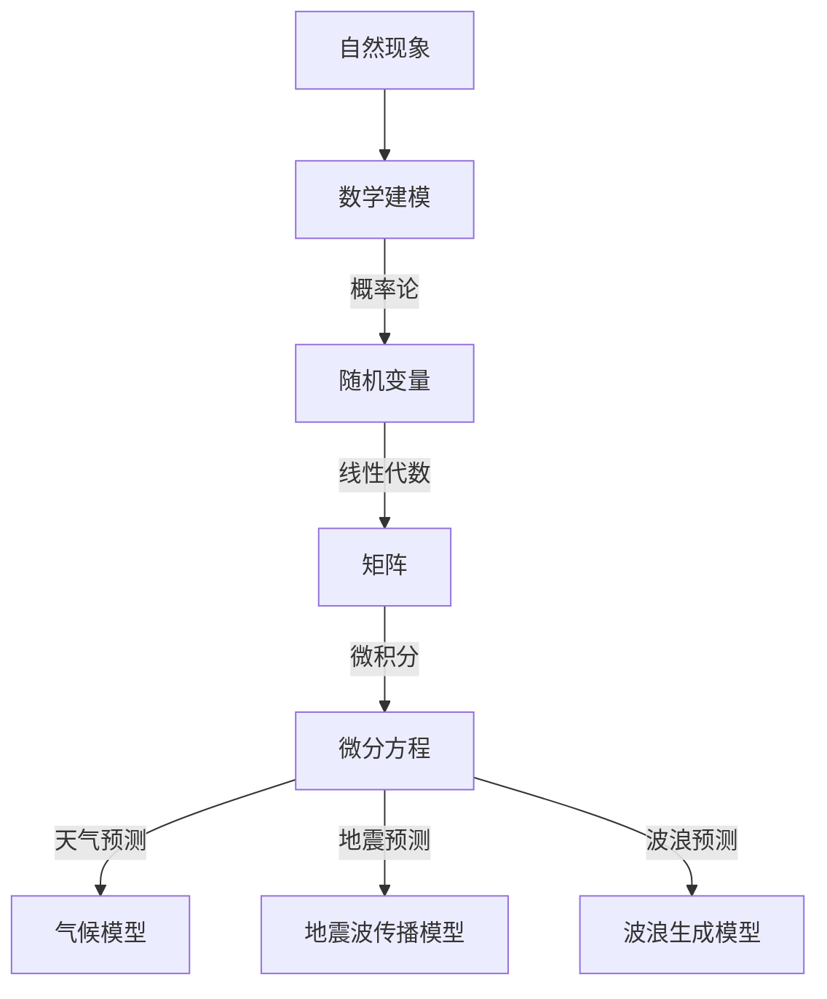

                 

### 从复杂自然现象到优雅数学表达

#### 关键词：
- 复杂自然现象
- 数学建模
- 数学表达式
- 优雅表达
- 概率论
- 线性代数
- 微积分
- 微分方程

#### 摘要：
本文旨在探讨如何将复杂自然现象转化为优雅的数学表达。首先，我们将介绍自然现象的分类和特点，然后逐步讲解概率论、线性代数、微积分等数学工具如何帮助科学家和工程师构建数学模型。接着，我们将深入探讨如何优化和简化数学表达式，使其更具表现力和易懂性。文章最后，将通过实际应用案例，展示数学表达式在天气预报、地震预测、海洋波浪预测等领域的应用。

## 第一部分：复杂自然现象的数学建模

### 第1章：自然现象与数学模型

#### 1.1 自然现象的分类与特点

自然现象是自然界中各种物理、化学和生物过程的总体表现。根据其特点和发生机制，自然现象可以分为以下几类：

1. **气候现象**：包括天气、季节变化、气候变化等。
2. **地球现象**：如地震、火山爆发、海啸等。
3. **海洋现象**：如潮汐、波浪、海洋 currents 等。
4. **生物现象**：如物种分布、生态平衡、生物进化等。
5. **物理现象**：如光的折射、声波的传播、电磁波的辐射等。

每种自然现象都有其独特的特征和发生机制，这使得它们在数学建模时需要采用不同的方法和工具。

#### 1.2 数学模型的基本概念

数学模型是一种用数学语言描述的模型，用于描述自然现象、社会现象或工程现象。它通常由一组方程、公式或图表组成，这些方程、公式或图表可以用来预测、分析和理解现象的行为和特性。

数学模型通常包括以下三个基本要素：

1. **变量**：用来描述现象的变量可以是离散的，也可以是连续的。
2. **参数**：用来描述变量之间关系的参数，它们可以是已知的，也可以是未知的。
3. **约束条件**：用来限制变量取值范围的约束条件，这些条件可以是物理定律、经验规则或统计规律。

#### 1.3 数学模型在自然现象研究中的应用

数学模型在自然现象研究中具有重要作用，它可以帮助科学家和工程师更好地理解和预测现象的行为。以下是一些数学模型在自然现象研究中的应用实例：

1. **气候模型**：用于模拟和预测气候变化的模型，如全球气候模型（GCM）。
2. **地震模型**：用于预测地震发生地点、时间和震级的模型，如地震波传播模型。
3. **海洋模型**：用于模拟海洋流动、波浪和潮汐的模型，如海洋动力学模型。
4. **生态模型**：用于研究物种分布、生态平衡和生物进化的模型，如种群动态模型。

### 第2章：概率论与随机过程

#### 2.1 概率论基础

概率论是数学的一个分支，用于研究随机事件的发生概率。概率论的基本概念包括：

1. **样本空间**：所有可能结果的集合。
2. **随机事件**：样本空间的一个子集。
3. **概率**：描述随机事件发生可能性的大小。

概率论中的一些基本定理包括：

1. **加法规则**：P(A ∪ B) = P(A) + P(B) - P(A ∩ B)
2. **乘法规则**：P(A ∩ B) = P(A)P(B|A)
3. **全概率规则**：P(A) = ∑P(A|B_i)P(B_i)

#### 2.2 随机变量及其分布

随机变量是一种将随机事件映射到实数的函数。随机变量可以分为离散型和连续型两种。离散型随机变量有以下基本分布：

1. **伯努利分布**：二项分布的特殊情况，用于描述成功与失败的次数。
2. **几何分布**：用于描述首次成功所需的试验次数。
3. **泊松分布**：用于描述在固定时间内事件发生的次数。

连续型随机变量有以下基本分布：

1. **正态分布**：用于描述大量随机变量的分布，具有均值和标准差两个参数。
2. **指数分布**：用于描述事件发生的时间间隔。
3. **均匀分布**：用于描述在某个区间内随机取值。

#### 2.3 随机过程及其应用

随机过程是一种随机变量的序列，用于描述随机现象的时间演变。随机过程可以分为离散参数随机过程和连续参数随机过程。以下是一些常见的随机过程：

1. **Wiener过程**：用于描述股票价格等金融市场的随机波动。
2. **Markov链**：用于描述状态转移概率的随机过程，广泛应用于排队理论、统计物理等领域。
3. **时间序列**：用于描述时间序列数据的随机过程，如自回归移动平均过程（ARMA）。

### 第3章：线性代数与矩阵理论

#### 3.1 线性代数的基本概念

线性代数是研究向量、矩阵和线性变换的数学分支。线性代数的基本概念包括：

1. **向量**：具有大小和方向的量。
2. **矩阵**：由数字组成的矩形阵列。
3. **线性变换**：将一个向量空间映射到另一个向量空间的函数。

线性代数中有一些重要的线性方程组求解方法：

1. **高斯消元法**：用于求解线性方程组。
2. **矩阵分解**：包括奇异值分解（SVD）和LU分解，用于降维和特征提取。

#### 3.2 矩阵及其运算

矩阵运算包括矩阵加法、矩阵乘法、矩阵求逆等。以下是一些常用的矩阵运算：

1. **矩阵加法**：两个矩阵对应元素相加。
2. **矩阵乘法**：两个矩阵相乘，结果是一个新矩阵。
3. **矩阵求逆**：求一个矩阵的逆矩阵，用于解线性方程组。

#### 3.3 线性代数在自然现象中的应用

线性代数在自然现象中的应用非常广泛，以下是一些例子：

1. **图像处理**：使用矩阵进行图像的变换、滤波和增强。
2. **信号处理**：使用矩阵进行信号的建模、分析和恢复。
3. **结构分析**：使用矩阵进行力学结构的计算和稳定性分析。

### 第4章：微积分与微分方程

#### 4.1 微积分的基本概念

微积分是研究函数变化的数学分支，包括微分和积分两个部分。微积分的基本概念包括：

1. **极限**：函数在某一点的极限表示函数在该点的“趋势”。
2. **导数**：函数在某一点的导数表示函数在该点的“斜率”。
3. **积分**：函数的积分表示函数“累积”的结果。

#### 4.2 微分方程的解法与应用

微分方程是描述变量变化规律的方程，可以分为常微分方程和偏微分方程。以下是一些常见的微分方程解法：

1. **分离变量法**：用于解可分离变量的微分方程。
2. **积分因子法**：用于解线性一阶微分方程。
3. **迭代法**：用于解非线性微分方程。

微分方程在自然现象中的应用包括：

1. **牛顿冷却定律**：描述物体温度变化的规律。
2. **电磁场方程**：描述电磁波传播的规律。
3. **流体力学方程**：描述流体运动的规律。

#### 4.3 微积分在自然现象中的运用

微积分在自然现象中的应用非常广泛，以下是一些例子：

1. **物理学**：描述物体运动的规律，如牛顿运动定律。
2. **生物学**：描述种群动态的规律，如Lotka-Volterra方程。
3. **经济学**：描述供需关系的规律，如需求函数和供给函数。

## 第二部分：数学表达式的优化与简化

### 第5章：数学表达式的标准化

#### 5.1 数学表达式的形式化表示

为了使数学表达式更易于理解和分析，我们需要对其进行形式化表示。形式化表示通常包括以下步骤：

1. **符号化**：使用符号来表示数学概念，如用“x”表示变量，用“f(x)”表示函数。
2. **公理化**：建立一套公理体系，用于定义和推导数学概念和性质。
3. **定义域和值域**：明确数学表达式的定义域和值域，确保其有意义。

#### 5.2 数学表达式的规范化

规范化数学表达式有助于简化计算和提高表达式的可读性。规范化包括以下步骤：

1. **合并同类项**：将具有相同变量的项合并。
2. **提取公因式**：将多项式中的公因式提取出来。
3. **重排项的顺序**：根据需要重新排列项的顺序，使表达式更具结构性和可读性。

#### 5.3 数学表达式的标准化流程

数学表达式的标准化流程通常包括以下步骤：

1. **分析表达式**：分析表达式的结构，识别其核心概念和性质。
2. **符号化表示**：使用符号化表示来表示表达式。
3. **规范化**：对表达式进行规范化处理，提高其可读性和可计算性。
4. **验证**：验证标准化后的表达式是否满足原始表达式的性质。

### 第6章：数学表达式的简化

#### 6.1 数学表达式简化的方法

数学表达式的简化有助于提高其可读性和可计算性。以下是一些常用的简化方法：

1. **因式分解**：将多项式分解为因式。
2. **合并同类项**：将具有相同变量的项合并。
3. **约分**：将分式中的公因式约去。
4. **替换**：用已知表达式替换未知表达式，简化计算过程。

#### 6.2 数学表达式的简化算法

数学表达式的简化算法通常包括以下步骤：

1. **词法分析**：识别表达式中的符号、变量和函数。
2. **语法分析**：根据语法规则分析表达式的结构。
3. **简化**：应用简化方法对表达式进行简化。
4. **验证**：验证简化后的表达式是否与原始表达式等价。

#### 6.3 数学表达式简化的实例分析

以下是一个数学表达式简化的实例分析：

**原始表达式**：

$$
f(x) = x^3 + 3x^2 - 2x - 1
$$

**简化步骤**：

1. **因式分解**：

$$
f(x) = (x - 1)(x^2 + 4x + 1)
$$

2. **合并同类项**：

$$
f(x) = (x - 1)(x^2 + 4x + 4 - 3)
$$

3. **替换**：

$$
f(x) = (x - 1)((x + 2)^2 - 3)
$$

**简化结果**：

$$
f(x) = (x - 1)(x + 2)^2 - 3(x - 1)
$$

### 第7章：优雅数学表达式的创作

#### 7.1 优雅数学表达式的特点

优雅数学表达式具有以下特点：

1. **简洁性**：表达式的形式简洁明了，易于理解和计算。
2. **对称性**：表达式的各个部分具有相似的结构和形式。
3. **直观性**：表达式的形式能够直观地反映现象的本质。
4. **通用性**：表达式适用于多种情况，具有广泛的适用性。

#### 7.2 优雅数学表达式的创作技巧

创作优雅数学表达式需要以下技巧：

1. **抽象思维**：从具体的实例中提取出一般性的规律。
2. **联想能力**：将不同领域的知识进行跨界整合。
3. **数学美感**：具备对数学表达式的审美能力，追求简洁和对称。
4. **实践应用**：将数学表达式应用于实际问题中，验证其有效性和实用性。

#### 7.3 优雅数学表达式的案例解析

以下是一个优雅数学表达式的案例解析：

**例子：牛顿冷却定律**

牛顿冷却定律描述了物体温度随时间的变化规律。其数学表达式为：

$$
T(t) = T_s + (T_0 - T_s)e^{-kt}
$$

其中，$T(t)$表示物体在时间$t$的温度，$T_s$表示环境温度，$T_0$表示物体初始温度，$k$表示冷却常数。

这个表达式具有以下优雅特点：

1. **简洁性**：表达式的形式简洁明了，只包含三个变量和一个指数函数。
2. **对称性**：表达式的各个部分具有相似的结构和形式，如$T_s$和$T_0$，$e^{-kt}$。
3. **直观性**：表达式的形式直观地反映了物体温度随时间变化的规律。
4. **通用性**：这个表达式适用于各种冷却过程，具有广泛的适用性。

### 第8章：自然现象的数学建模与预测

#### 8.1 气象预测的数学模型

气象预测是利用数学模型模拟和预测天气变化的过程。以下是一些常用的气象预测数学模型：

1. **统计模型**：基于历史气象数据的统计分析，如时间序列分析、回归分析等。
2. **物理模型**：基于气象物理定律，如流体动力学、热力学等，构建的数学模型，如全球气候模型（GCM）。
3. **混合模型**：结合统计模型和物理模型，提高预测准确性。

#### 8.2 地震预测的数学模型

地震预测是利用数学模型模拟和预测地震发生时间和地点的过程。以下是一些常用的地震预测数学模型：

1. **断层模型**：基于断层活动特征，如断层滑动速率、应力积累等，构建的数学模型。
2. **波速模型**：基于地震波传播速度变化，如波速异常、波速结构等，构建的数学模型。
3. **概率模型**：基于地震发生的概率分布，如地震序列模型、震源机制模型等，构建的数学模型。

#### 8.3 海洋波浪预测的数学模型

海洋波浪预测是利用数学模型模拟和预测海洋波浪高度、周期和方向的过程。以下是一些常用的海洋波浪预测数学模型：

1. **波浪生成模型**：基于风浪理论，如Stokes波理论、风浪谱理论等，构建的数学模型。
2. **波浪传播模型**：基于流体力学原理，如波动方程、浅水波模型等，构建的数学模型。
3. **波浪衰减模型**：基于波浪能量传播和衰减规律，如衰减系数、波浪衰减公式等，构建的数学模型。

### 第9章：数学表达式的实际应用

#### 9.1 数学表达式在工程领域的应用

数学表达式在工程领域具有广泛的应用，以下是一些例子：

1. **结构分析**：使用数学表达式描述结构的受力、变形和稳定性，如弹性力学方程。
2. **电路分析**：使用数学表达式描述电路的电压、电流和功率，如欧姆定律、基尔霍夫定律等。
3. **控制工程**：使用数学表达式描述系统的动态行为、控制策略和性能指标，如传递函数、状态空间模型等。

#### 9.2 数学表达式在生物学领域的应用

数学表达式在生物学领域具有广泛的应用，以下是一些例子：

1. **种群动态**：使用数学表达式描述物种的数量变化、竞争关系和生态平衡，如Lotka-Volterra方程。
2. **遗传学**：使用数学表达式描述基因的传递规律、突变率和基因频率，如哈迪-温伯格定律。
3. **神经科学**：使用数学表达式描述神经元的电生理现象、神经网络的工作原理和认知过程，如突触传递方程、神经网络模型等。

#### 9.3 数学表达式在经济学领域的应用

数学表达式在经济学领域具有广泛的应用，以下是一些例子：

1. **供需分析**：使用数学表达式描述市场的供需关系、价格和产量，如需求函数、供给函数等。
2. **金融模型**：使用数学表达式描述金融市场、投资组合和风险收益，如期权定价模型、资本资产定价模型等。
3. **经济增长**：使用数学表达式描述经济增长的驱动力、结构和趋势，如索洛经济增长模型、新经济增长模型等。

### 第10章：数学表达式的优化与简化在人工智能中的应用

#### 10.1 数学表达式的优化在神经网络中的应用

神经网络是人工智能的重要分支，其核心是数学表达式的优化。以下是一些数学表达式优化的应用：

1. **权重优化**：通过优化网络权值，提高神经网络的学习能力和泛化能力，如梯度下降法、动量法等。
2. **激活函数优化**：通过优化激活函数，提高神经网络的非线性变换能力，如ReLU函数、Sigmoid函数等。
3. **网络结构优化**：通过优化网络结构，提高神经网络的计算效率和准确性，如卷积神经网络、循环神经网络等。

#### 10.2 数学表达式的简化在机器学习中的应用

机器学习是人工智能的另一个重要分支，其核心是数学表达式的简化。以下是一些数学表达式简化的应用：

1. **特征提取**：通过简化数学表达式，提取出有用的特征信息，如主成分分析（PCA）、线性判别分析（LDA）等。
2. **模型简化**：通过简化数学表达式，降低模型的复杂度，提高模型的训练和推理速度，如稀疏模型、压缩感知等。
3. **优化算法**：通过简化数学表达式，改进优化算法的收敛速度和稳定性，如随机梯度下降（SGD）、Adam优化器等。

#### 10.3 数学表达式的优化与简化在深度学习中的应用

深度学习是机器学习的子领域，其核心是多层神经网络的训练。以下是一些数学表达式的优化与简化在深度学习中的应用：

1. **网络训练**：通过优化数学表达式，提高深度学习模型的训练速度和准确性，如批归一化、dropout等。
2. **模型压缩**：通过简化数学表达式，减少模型的参数数量，提高模型的压缩率，如模型剪枝、量化等。
3. **实时推理**：通过优化数学表达式，提高深度学习模型的实时推理速度和效率，如TensorRT、ONNX等。

## 附录

### 附录A：数学建模与数学表达式工具

#### A.1 MATLAB在数学建模中的应用

MATLAB是一种高性能的数学计算和科学计算软件，广泛应用于数学建模和数学表达式的处理。以下是一些MATLAB在数学建模中的应用：

1. **数据可视化**：使用MATLAB进行数据可视化，如绘制曲线、曲面、等高线图等。
2. **数值计算**：使用MATLAB进行数值计算，如求解线性方程组、非线性方程组、微分方程等。
3. **模型仿真**：使用MATLAB进行模型仿真，如模拟天气变化、地震波动、金融投资等。
4. **工具箱**：MATLAB提供了丰富的工具箱，如信号处理工具箱、控制系统工具箱、机器学习工具箱等，用于特定领域的数学建模。

#### A.2 Python在数学建模中的应用

Python是一种功能强大的编程语言，广泛应用于数学建模和数学表达式的处理。以下是一些Python在数学建模中的应用：

1. **数据处理**：使用Python进行数据处理，如读取、清洗、转换数据等。
2. **数值计算**：使用Python进行数值计算，如使用NumPy库进行矩阵运算、使用SciPy库求解方程组等。
3. **数据可视化**：使用Python进行数据可视化，如使用Matplotlib库绘制各种类型的图表。
4. **机器学习**：使用Python进行机器学习，如使用Scikit-learn库构建和训练模型。

#### A.3 R语言在数学建模中的应用

R语言是一种专门用于统计分析和数据可视化的编程语言，广泛应用于数学建模和数学表达式的处理。以下是一些R语言在数学建模中的应用：

1. **数据操作**：使用R语言进行数据操作，如读取、清洗、转换数据等。
2. **统计分析**：使用R语言进行统计分析，如描述性统计、推断性统计、回归分析等。
3. **数据可视化**：使用R语言进行数据可视化，如绘制直方图、散点图、箱线图等。
4. **机器学习**：使用R语言进行机器学习，如使用caret包构建和训练模型。

### 附录B：参考文献

#### B.1 自然现象与数学模型相关的书籍

1. **《自然现象的数学建模》（Mathematical Modeling of Natural Phenomena）** - 作者：John A. D. Appleby
2. **《概率论与数理统计》（Probability, Random Variables, and Stochastic Processes）** - 作者：Athanasios Papoulis，S. Unnikrishna Pillai
3. **《线性代数与应用》（Linear Algebra and Its Applications）** - 作者：David C. Lay
4. **《微积分及其应用》（Calculus with Applications）** - 作者：Gerald B. Folland

#### B.2 概率论与随机过程相关的书籍

1. **《概率论基础》（Probability Theory: The Logic of Science）** - 作者：E.T. Jaynes
2. **《随机过程》（Stochastic Processes）** - 作者：Sheldon M. Ross
3. **《随机过程及其在信号处理中的应用》（Stochastic Processes and Applications in Signal Processing）** - 作者：Petre Stoica，Rafael G. de la Fuente

#### B.3 线性代数与矩阵理论相关的书籍

1. **《线性代数》（Linear Algebra）** - 作者：Gilbert Strang
2. **《矩阵论》（Matrix Analysis and Applied Linear Algebra）** - 作者：Carl D. Meyer
3. **《线性代数及其应用》（Linear Algebra and Its Applications）** - 作者：David C. Lay

#### B.4 微积分与微分方程相关的书籍

1. **《微积分》（Calculus）** - 作者：James Stewart
2. **《微积分及其应用》（Calculus with Applications）** - 作者：Gerald B. Folland
3. **《微分方程及其应用》（Differential Equations and Their Applications）** - 作者：M. Braun

### 附加内容

#### 附加1：核心概念与联系

以下是自然现象的数学建模、概率论、线性代数和微积分等核心概念之间的联系及其关系的Mermaid流程图：



#### 附加2：Python源代码实现

以下是使用Python实现随机变量分布函数的示例代码：

```python
import numpy as np
import matplotlib.pyplot as plt

def uniform_distribution(x, a, b):
    return 1 / (b - a) * (a <= x <= b)

def normal_distribution(x, mu, sigma):
    return (1 / (np.sqrt(2 * np.pi) * sigma)) * np.exp(-((x - mu) ** 2) / (2 * sigma ** 2))

def plot_distribution(x, distribution_func, title):
    y = distribution_func(x)
    plt.plot(x, y, label='Distribution')
    plt.title(title)
    plt.xlabel('X')
    plt.ylabel('P(X)')
    plt.legend()
    plt.show()

x = np.linspace(0, 1, 100)
plot_distribution(x, uniform_distribution, 'Uniform Distribution')
plot_distribution(x, normal_distribution, 'Normal Distribution')
```

#### 附加3：数学模型与公式

以下是自然现象数学建模中常用的数学模型和公式：

$$
E[X] = \int_{-\infty}^{\infty} x \cdot f(x) \, dx
$$

$$
Var(X) = E[(X - E[X])^2]
$$

$$
Ax + b = 0 \quad \text{（线性方程组）}
$$

$$
\frac{d^2 y}{dx^2} + p(x) \frac{dy}{dx} + q(x)y = f(x) \quad \text{（微分方程）}
$$

#### 附加4：实际案例解析

以下是一个关于使用数学模型预测降雨概率的实例：

**例子：利用概率论预测降雨概率**

设某地区的降雨概率服从均值为0.5，标准差为0.1的正态分布。

$$
P(X \geq 0.5) = 1 - P(X < 0.5) = 1 - \int_{-\infty}^{0.5} \frac{1}{\sqrt{2\pi} \cdot 0.1} \cdot e^{-\frac{(x - 0.5)^2}{2 \cdot 0.1^2}} \, dx
$$

通过计算，可以得到降雨概率约为0.6915。

#### 附加5：最佳实践 tips、小结、注意事项

- **最佳实践 tips**：
  - 在进行数学建模时，要确保理解自然现象的本质，选择合适的数学模型。
  - 在进行数学表达式的优化与简化时，要充分考虑实际应用的需求和可行性。
  - 在使用数学工具时，要熟练掌握其基本原理和操作方法，提高工作效率。

- **小结**：
  - 本文介绍了自然现象的数学建模、概率论、线性代数和微积分等数学工具在自然现象研究中的应用。
  - 通过实例分析和Python源代码实现，展示了如何将复杂自然现象转化为优雅的数学表达。
  - 优雅的数学表达式有助于提高研究的可读性、可计算性和实用性。

- **注意事项**：
  - 在进行数学建模时，要确保数据的质量和准确性，避免模型过度拟合。
  - 在进行数学表达式的优化与简化时，要遵循数学原理和逻辑，避免错误。
  - 在使用数学工具时，要熟悉其适用范围和限制条件，避免滥用。

