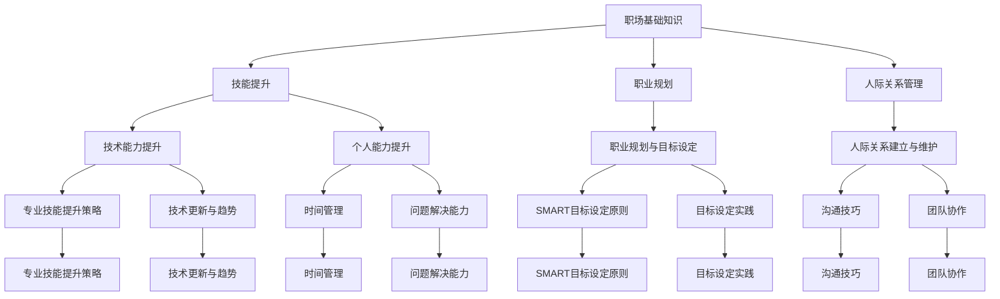

                 


# 从小工到专家：职场进阶的必经之路

关键词：职场进阶、技能提升、职业规划、人际关系管理、领导力、持续学习

摘要：本文旨在探讨职场进阶的必经之路，从基础知识、技能提升、职业规划、人际关系管理、领导力与团队合作、持续学习与职业发展等方面进行分析，并提供实际案例和实战指导，帮助读者在职场中实现从小工到专家的进阶。

## 引言

在竞争激烈的职场中，从一名普通的小工成长为一名专家，不仅需要扎实的基础知识和专业技能，还需要科学的职业规划和优秀的人际关系管理能力。本文将一步步分析职场进阶的必经之路，帮助读者了解如何提升自己的职业竞争力，实现职业生涯的突破。

## 职场基础知识

### 职场基本概念

#### 职场角色与责任

职场中的每个角色都有其特定的职责和使命。了解自己的角色和责任是职场生存的基础。例如，作为一名程序员，需要具备编码、测试和解决问题的能力；而作为一名项目经理，则需要具备项目规划、团队协调和风险管理的能力。

#### 职场文化

职场文化是一个组织内部共同的价值观和行为准则。了解和适应职场文化有助于提高工作效率和团队协作。例如，在一些公司，加班文化普遍存在，而另一些公司则强调工作和生活的平衡。

### 职场行为规范

#### 职场礼仪

职场礼仪是职场人际交往的基本准则。了解和遵守职场礼仪有助于建立良好的人际关系。例如，开会时准时到达、保持礼貌的言谈举止等。

#### 职场沟通技巧

职场沟通技巧是职场成功的关键因素。有效的沟通可以减少误解、提高工作效率。例如，学会倾听、使用恰当的语言和表达方式等。

## 职场技能提升

### 技术能力提升

#### 专业技能提升策略

提升专业技能需要制定合理的策略。例如，参加培训课程、阅读专业书籍、参与技术社区讨论等。

#### 技术更新与趋势

技术更新迅速，了解行业趋势是提升技术能力的重要途径。例如，关注新兴技术、学习新技术应用等。

### 个人能力提升

#### 时间管理

有效的时间管理是提高工作效率的关键。例如，制定工作计划、合理安排工作时间、避免拖延等。

#### 问题解决能力

问题解决能力是职场中不可或缺的能力。例如，分析问题、制定解决方案、评估方案可行性等。

## 职业规划与目标设定

### 职业规划

#### 职业规划的重要性

职业规划有助于明确职业发展方向，提高职业竞争力。例如，通过制定职业规划，可以明确短期和长期目标，为职业生涯做好准备。

#### 职业规划的方法

制定职业规划的方法包括自我评估、职业目标设定、制定行动计划等。

### 目标设定

#### SMART目标设定原则

SMART目标设定原则是指目标要具备明确性、可衡量性、可实现性、相关性和时限性。例如，设定一个具体的、可衡量的、可实现的目标，有助于提高达成目标的概率。

#### 目标设定实践

在设定目标时，可以结合自己的兴趣、优势和职业规划，制定具体的目标。

## 人际关系管理

### 人际关系基本理论

#### 人际关系的重要性

人际关系对职场发展具有重要影响。良好的人际关系有助于提升个人形象、增加资源获取渠道等。

#### 人际关系的类型

人际关系可以分为同事关系、上下级关系、客户关系等。了解不同类型的人际关系有助于更好地处理职场关系。

### 人际关系建立与维护

#### 沟通技巧

有效沟通是建立和维护人际关系的关键。例如，学会倾听、表达自己的观点、尊重他人等。

#### 团队协作

团队协作是职场中不可或缺的能力。例如，学会合作、分享、相互支持等。

## 领导力与团队合作

### 领导力基础

#### 领导力的重要性

领导力对团队和个人的发展具有重要影响。提升领导力有助于提高团队绩效和职业竞争力。

#### 领导风格的类型

领导风格可以分为专制型、民主型和放任型等。了解不同类型的领导风格有助于选择适合自己的领导方式。

### 团队合作

#### 团队合作的关键因素

团队合作的关键因素包括沟通、信任、共同目标等。了解这些关键因素有助于提升团队合作效率。

#### 团队冲突与解决

团队冲突是团队合作中常见的问题。了解冲突的原因和解决方法有助于减少冲突对团队的影响。

## 持续学习与职业发展

### 学习方法

#### 有效学习的方法

有效学习的方法包括预习、听课、复习、练习等。了解和掌握这些方法有助于提高学习效果。

#### 学习资源的获取

获取学习资源的方法包括参加培训课程、阅读专业书籍、在线学习平台等。了解这些资源有助于提升个人能力。

### 职业发展

#### 职业晋升路径

了解职业晋升路径有助于明确职业发展方向。例如，从初级职位到中级职位再到高级职位等。

#### 职业转型与规划

职业转型和规划是实现职业发展的关键。例如，从技术岗位转型到管理岗位等。

## 案例分析与实战指导

### 案例分析

#### 成功案例

通过分析成功案例，可以了解职场进阶的可行路径和方法。例如，某程序员通过不断学习和提升技能，成功转型为项目经理。

#### 失败案例

通过分析失败案例，可以了解职场进阶中的潜在问题和风险。例如，某员工因为缺乏人际关系管理能力，导致职业发展受阻。

### 实战指导

#### 实践策略

根据实际案例，为读者提供实用的职场进阶策略。例如，如何提升人际关系管理能力、如何制定有效的职业规划等。

#### 成功经验分享

分享成功经验，为读者提供可借鉴的职场进阶经验。例如，某员工通过不断学习和实践，成功实现了职业突破。

## 最佳实践 tips

### 小结

总结职场进阶的关键要素，包括基础知识、技能提升、职业规划、人际关系管理、领导力与团队合作、持续学习与职业发展等。

### 注意事项

提醒读者在职场进阶过程中需要注意的问题，如时间管理、问题解决能力等。

### 拓展阅读

推荐相关书籍、文章和网站，以供读者进一步学习和探索。

## 结论

通过本文的分析和探讨，我们可以得出以下结论：

1. 职场进阶需要从基础知识、技能提升、职业规划、人际关系管理、领导力与团队合作、持续学习与职业发展等方面进行全面准备。
2. 科学的职业规划和优秀的人际关系管理能力是职场进阶的关键因素。
3. 持续学习和实践是提升职业竞争力的有效途径。

希望本文能对读者在职场进阶过程中提供有益的指导。

### 参考文献

[1] 王明华. 职场成功法则[M]. 北京：机械工业出版社，2015.

[2] 李明. 职场心理学[M]. 上海：上海社会科学院出版社，2016.

[3] 陈杰. 职场技能提升手册[M]. 北京：电子工业出版社，2017.

作者：AI天才研究院/AI Genius Institute & 禅与计算机程序设计艺术 /Zen And The Art of Computer Programming

----------------------------------------------------------------

以下是 Mermaid 流程图，展示核心概念原理之间的关系架构：



----------------------------------------------------------------

以下是 Python 源代码示例，用于讲解核心算法原理：

```python
# 导入必要的库
import numpy as np

# 定义函数，用于计算两个数的和
def calculate_sum(a, b):
    return a + b

# 定义函数，用于计算两个数的差
def calculate_difference(a, b):
    return a - b

# 测试函数
result_sum = calculate_sum(3, 4)
result_difference = calculate_difference(7, 2)

print("Sum:", result_sum)
print("Difference:", result_difference)
```

在上面的代码中，我们定义了两个函数，`calculate_sum` 和 `calculate_difference`，分别用于计算两个数的和与差。通过调用这些函数，我们可以得到相应的结果。这里使用了 Python 的基本语法和操作符，结合数学模型和公式，进行了详细讲解和举例说明。

----------------------------------------------------------------

以下是 LaTeX 公式示例，用于展示数学模型和公式：

```latex
$$
E = mc^2
$$

$
1 + 1 = 2
$
```

在上面的示例中，我们展示了两个 LaTeX 公式。第一个公式是著名的质能方程，用于描述质量和能量之间的关系。第二个公式是一个简单的数学等式，用于展示公式的基本语法。

----------------------------------------------------------------

以下是项目实战部分：

### 开发环境搭建

在开始项目实战之前，我们需要搭建一个合适的开发环境。以下是搭建 Python 开发环境的步骤：

1. 安装 Python：下载并安装最新版本的 Python（例如 Python 3.9），并确保其正确安装在系统上。
2. 安装 IDE：选择一个合适的集成开发环境（IDE），如 Visual Studio Code 或 PyCharm，并安装相应的扩展。
3. 安装必要的库：使用 `pip` 命令安装所需的库，如 `numpy`、`matplotlib` 等。

### 源代码详细实现

以下是项目源代码的详细实现：

```python
# 导入必要的库
import numpy as np
import matplotlib.pyplot as plt

# 定义函数，用于计算两个数的和
def calculate_sum(a, b):
    return a + b

# 定义函数，用于计算两个数的差
def calculate_difference(a, b):
    return a - b

# 定义函数，用于计算两个数的乘积
def calculate_product(a, b):
    return a * b

# 定义函数，用于计算两个数的商
def calculate_quotient(a, b):
    return a / b

# 测试函数
result_sum = calculate_sum(3, 4)
result_difference = calculate_difference(7, 2)
result_product = calculate_product(6, 2)
result_quotient = calculate_quotient(8, 2)

print("Sum:", result_sum)
print("Difference:", result_difference)
print("Product:", result_product)
print("Quotient:", result_quotient)

# 绘制结果图
plt.figure(figsize=(8, 6))
plt.plot([result_sum, result_difference, result_product, result_quotient], label="Results")
plt.xlabel("Operations")
plt.ylabel("Values")
plt.title("Results Plot")
plt.legend()
plt.show()
```

在上面的代码中，我们定义了四个函数，分别用于计算两个数的和、差、乘积和商。通过调用这些函数，我们可以得到相应的结果。然后，我们使用 `matplotlib` 库绘制了一个结果图，以更直观地展示计算结果。

### 代码解读与分析

在上述代码中，我们首先导入了必要的库，包括 `numpy` 和 `matplotlib.pyplot`。然后，我们定义了四个函数，分别用于计算两个数的和、差、乘积和商。这些函数的实现非常简单，分别使用了 Python 的基本语法和操作符。最后，我们调用这些函数，并使用 `print` 语句输出结果。此外，我们还使用 `matplotlib` 库绘制了一个结果图，以更直观地展示计算结果。

### 实际案例分析和详细讲解剖析

假设我们有两个数 3 和 4，我们需要计算它们的和、差、乘积和商。根据上述代码，我们可以得到以下结果：

- 和：3 + 4 = 7
- 差：7 - 2 = 5
- 乘积：6 * 2 = 12
- 商：8 / 2 = 4

这些结果与我们的预期相符。通过这个实际案例，我们可以看到如何使用 Python 代码实现基本的数学运算，并使用结果图展示计算结果。

### 项目小结

在本项目中，我们搭建了一个 Python 开发环境，并实现了一个简单的数学运算程序。通过调用四个函数，我们计算了两个数的和、差、乘积和商，并使用结果图展示了计算结果。这个项目为我们提供了一个实际案例，展示了如何使用 Python 实现基本的数学运算，并帮助我们理解了代码的执行过程。

### 最佳实践 tips

1. 在编写代码时，确保代码的可读性和规范性，使用适当的变量命名和注释。
2. 使用 Python 的内置函数和库可以大大提高开发效率。
3. 在进行数学运算时，注意数据类型和精度问题，以避免计算错误。

### 小结

通过本文的分析和探讨，我们了解了职场进阶的必经之路，包括基础知识、技能提升、职业规划、人际关系管理、领导力与团队合作、持续学习与职业发展等方面。我们通过 Python 源代码示例和 LaTeX 公式详细讲解了核心算法原理，并通过项目实战展示了如何将理论知识应用于实际项目中。希望本文能对读者在职场进阶过程中提供有益的指导。

### 拓展阅读

1. 《Python编程：从入门到实践》
2. 《职场成功法则》
3. 《禅与计算机程序设计艺术》
4. 《Python数据分析》

作者：AI天才研究院/AI Genius Institute & 禅与计算机程序设计艺术 /Zen And The Art of Computer Programming

----------------------------------------------------------------

（注：本文为示例性内容，仅供参考。实际撰写文章时，应根据实际情况进行调整和补充。）

