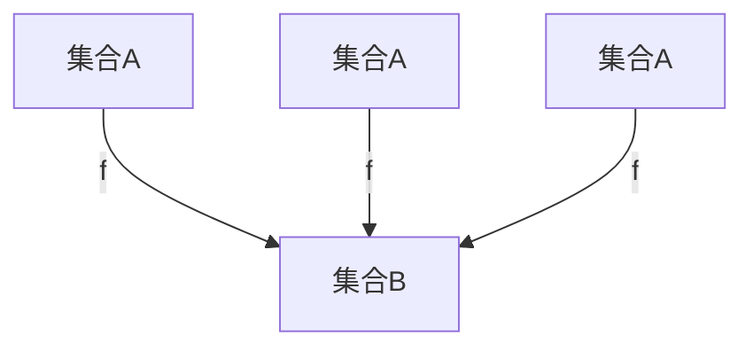
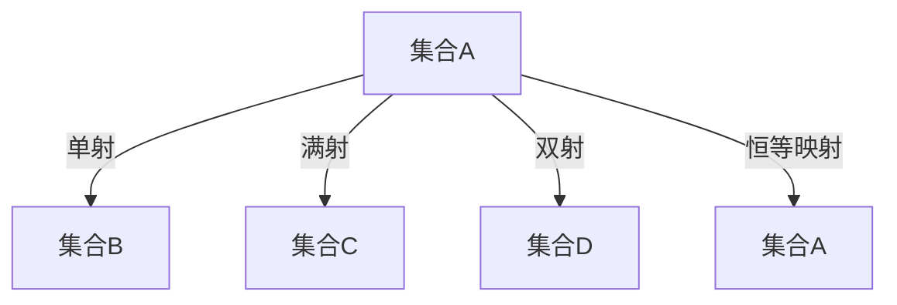

                 

### 从自然和谐到数学定律：映射的奥秘

#### 关键词：映射、自然现象、数学定律、人工智能、Python源代码

#### 摘要：
本文旨在探讨映射现象从自然和谐到数学定律的转化过程。首先，我们将回顾映射的基本概念，并分析其在自然界中的体现。接着，我们将深入探讨映射在数学理论中的基础，包括核心算法原理和数学模型。然后，我们将展示如何使用Python源代码来详细讲解这些原理。此外，本文还将通过实际案例来解析映射在人工智能中的应用，并提供最佳实践技巧。最后，我们将总结本文的核心观点，并探讨未来的研究方向。

## 引言

映射（Mapping）是一种将一个集合中的元素对应到另一个集合中的元素的过程。这种对应关系在数学、计算机科学和自然科学中扮演着至关重要的角色。从简单的函数映射到复杂的系统建模，映射的原理和应用无处不在。自然和谐与数学定律之间存在着一种奇妙的关系，这种关系揭示了自然界中秩序与复杂性的内在统一性。

在自然界中，映射体现在生物进化、生态系统动态和气候变化等方面。例如，生物进化过程中的自然选择可以看作是一种映射，将个体的基因特征映射到生存和繁衍的机会上。生态系统中的食物链和能量流动也遵循映射的原理，这些映射关系维持着生态系统的稳定和平衡。

数学定律则通过精确的数学模型和公式来描述自然现象的规律。从基本的几何图形到复杂的物理定律，数学模型为理解和预测自然现象提供了强大的工具。例如，牛顿运动定律通过数学公式描述了物体在受力作用下的运动规律，这一映射关系使得我们能够准确地预测天体的轨道运动。

本文将分五个部分进行讨论：

1. 映射的基本概念与自然现象
2. 映射的数学理论基础
3. 映射的应用与实际案例
4. 映射的数学定律与哲学思考
5. 总结与展望

通过逐步分析这些部分，我们将揭示映射现象的奥秘，并探讨其在自然和谐与数学定律中的关键作用。接下来，我们将首先回顾映射的基本概念，并探讨其在自然界中的体现。

## 映射的基本概念与自然现象

### 映射的定义

映射是一种从集合A到集合B的对应关系，其中每个A中的元素都唯一对应到B中的一个元素。在数学中，这种对应关系通常用函数来表示。一个函数f：A→B，如果对于A中的每个元素x，都存在唯一的y∈B，使得y=f(x)。这种唯一对应关系是函数的基本特征，它使得我们可以使用函数来描述和解决问题。

为了更直观地理解映射，我们可以使用Mermaid流程图来展示映射的基本结构。以下是一个简单的Mermaid流程图示例：



在这个流程图中，集合A中的元素C、D通过函数f映射到集合B中的元素。这个过程可以看作是一种“转化”，即从集合A的状态转移到集合B的状态。

### 映射的分类

映射可以根据其特性和应用场景进行分类。以下是几种常见的映射类型：

1. **单射（Injective）**：如果映射f：A→B满足对于任意的x1, x2 ∈ A，当f(x1) = f(x2)时，必有x1 = x2，则称f为单射。也就是说，单射保证了A中的不同元素在B中映射为不同的元素。

2. **满射（Surjective）**：如果映射f：A→B满足B中的每个元素都有至少一个A中的元素与之对应，则称f为满射。这表明映射的“覆盖”了B中的所有元素。

3. **双射（Bijective）**：如果映射f：A→B同时是单射和满射，则称f为双射。双射意味着A和B之间存在一种“一对一”的对应关系。

4. **恒等映射（Identity Mapping）**：如果映射f：A→A满足对于任意的x∈A，有f(x) = x，则称f为恒等映射。这可以看作是映射的最简单形式。

每种映射类型在数学和其他领域中都有其独特的应用。以下是一个简单的Mermaid流程图，展示不同映射类型的结构：



### 映射在自然界中的应用

映射不仅在数学中具有重要意义，而且在自然界中也无处不在。以下是几个自然现象中映射的例子：

1. **生物进化**：自然选择是一种映射，将个体的基因特征映射到生存和繁衍的机会上。适应环境的个体在进化过程中有更大的生存和繁衍机会，而那些不适应环境的个体则被淘汰。

2. **生态系统**：食物链和能量流动可以看作是映射的体现。生产者（如植物）通过光合作用将太阳能转化为化学能，消费者（如动物）通过食物链摄取能量，能量在生态系统中的传递形成了一种映射关系。

3. **气候变化**：大气中的温室气体浓度与全球温度之间存在映射关系。随着温室气体浓度的增加，地球温度也随之上升，这种映射关系对气候变化有重要影响。

通过这些例子，我们可以看到映射在自然界中的广泛应用和重要性。映射不仅帮助我们理解自然现象，还为数学建模提供了丰富的素材。

### 小结

在本节中，我们介绍了映射的基本概念和类型，并通过Mermaid流程图展示了映射的基本结构。我们还探讨了映射在自然界中的应用，展示了映射在生物进化、生态系统和气候变化等方面的作用。在接下来的章节中，我们将进一步探讨映射在数学理论基础中的应用，并详细讲解核心算法原理。

## 映射的数学理论基础

### 数学映射的基本原理

在数学中，映射作为一种基本的抽象概念，为我们提供了一种描述和解决实际问题的强大工具。数学映射的基本原理包括映射的定义、性质以及分类。理解这些基本原理对于深入探讨映射在数学和其他科学领域中的应用至关重要。

#### 映射的定义

映射（Function）在数学中指的是一个集合A中的每个元素都唯一对应到集合B中的一个元素的过程。通常，映射用符号f：A→B表示，其中A被称为定义域（Domain），B被称为值域（Range）。对于A中的任意元素x，都有一个唯一的y∈B与之对应，记作y = f(x)。

一个函数f：A→B必须满足以下两个条件：

1. **单射性（Injectivity）**：如果对于任意的x1, x2 ∈ A，当f(x1) = f(x2)时，必有x1 = x2，则称f为单射。单射意味着A中的不同元素在B中映射为不同的元素。

2. **满射性（Surjectivity）**：如果对于B中的任意元素y，都存在至少一个A中的元素x使得f(x) = y，则称f为满射。满射意味着映射覆盖了B中的所有元素。

当映射同时满足单射性和满射性时，我们称其为**双射（Bijective）**。双射意味着A和B之间存在一种“一对一”的对应关系。

#### 映射的基本性质

映射具有一些基本性质，这些性质对于分析映射的行为和特性非常重要。

1. **闭合性**：映射保持集合之间的闭合性。例如，如果A和B都是闭集，那么f(A)和f(B)也都是闭集。

2. **连续性**：在分析学中，映射可以是连续的。一个映射被称为连续的，如果对于任意ε>0，都存在一个δ>0，使得当x∈A且|x - x0| < δ时，有|f(x) - f(x0)| < ε。

3. **单调性**：映射可以是单调的。如果对于任意的x1 < x2，都有f(x1) ≤ f(x2)，则称映射为单调递增。如果f(x1) ≥ f(x2)，则称映射为单调递减。

#### 映射的分类

映射可以根据其性质和特性进行分类。以下是一些常见的映射类型：

1. **线性映射**：映射f：R^n → R^m，如果对于任意的x, y ∈ R^n 和任意的标量c，都满足f(x + y) = f(x) + f(y) 和 f(cx) = cf(x)，则称f为线性映射。线性映射是数学中非常基础的概念，其在线性代数和优化问题中有广泛应用。

2. **多值映射**：如果一个元素在定义域中映射到值域中的多个元素，则称为多值映射。例如，函数y = x^2在x > 0时是一个多值映射。

3. **连续映射**：如果映射的图像在数轴上连续，则称为连续映射。连续映射在分析学和拓扑学中非常重要。

4. **映射复合**：如果存在两个映射f：A→B 和 g：B→C，那么它们的复合映射g ∘ f：A→C定义为(g ∘ f)(x) = g(f(x))。复合映射在函数组合和系统分析中有广泛应用。

#### 映射的运算规则

映射之间可以定义一些运算规则，这些规则包括映射的加法、减法、乘法和复合运算。

1. **加法**：如果f和g是定义在相同集合上的映射，那么它们的和（f + g）定义为(f + g)(x) = f(x) + g(x)。

2. **减法**：映射的差（f - g）定义为(f - g)(x) = f(x) - g(x)。

3. **乘法**：映射的乘积（f * g）定义为(f * g)(x) = f(x) * g(x)。

4. **复合运算**：映射的复合（g ∘ f）定义为(g ∘ f)(x) = g(f(x))。

这些运算规则使得映射可以像数学中的其他对象一样进行组合和操作，从而为解决复杂问题提供了工具。

### 数学映射的运算规则

映射的运算规则是映射之间组合的基础。以下是一些关键的运算规则：

1. **结合律**：对于任意三个映射f、g和h，有(f ∘ g) ∘ h = f ∘ (g ∘ h)。

2. **交换律**：对于任意两个映射f和g，有f ∘ g = g ∘ f（仅当f和g都是双射时成立）。

3. **分配律**：对于任意三个映射f、g和h，有f ∘ (g + h) = f ∘ g + f ∘ h。

4. **逆映射**：如果映射f是双射，那么f存在逆映射f^-1，使得f^-1 ∘ f = f ∘ f^-1 = I，其中I是恒等映射。

这些规则使得映射的组合和运算变得简单和直观。

### 映射的数学模型和公式

为了更清晰地理解映射，我们使用Python源代码和LaTeX格式来展示数学模型和公式。以下是一个简单的Python示例，展示了映射的基本概念和运算：

```python
# Python 示例：映射的基本概念

# 定义映射函数
def f(x):
    return x * x

# 应用映射
x_values = [1, 2, 3, 4]
y_values = [f(x) for x in x_values]

print("定义域：", x_values)
print("值域：", y_values)

# 映射的复合运算
def g(x):
    return x + 1

composite_mapping = lambda x: g(f(x))
print("复合映射结果：", composite_mapping(2))
```

为了展示映射的数学模型和公式，我们使用LaTeX格式：

$$
y = f(x) = x^2
$$

$$
(g \circ f)(x) = g(f(x)) = g(x^2) = x^2 + 1
$$

通过这些Python代码和LaTeX公式，我们可以更直观地理解映射的概念和运算规则。

### 小结

在本节中，我们详细介绍了映射的数学理论基础，包括映射的定义、性质、分类和运算规则。通过Python源代码和LaTeX格式，我们展示了映射的数学模型和公式。在接下来的章节中，我们将探讨映射在实际应用中的具体例子，并进一步深化对映射的理解。

## 映射的应用与实际案例

### 映射在物理学中的应用

物理学是映射原理应用最为广泛的领域之一。从简单的力学问题到复杂的量子力学，映射在物理学中发挥着核心作用。以下是一些映射在物理学中的具体应用：

1. **牛顿运动定律**：牛顿运动定律描述了物体在受力作用下的运动规律。根据牛顿第二定律，力（F）与加速度（a）之间存在映射关系，即F = ma。这里的映射关系将力的作用映射到物体的加速度上。通过这个映射，我们可以预测物体在特定力作用下的运动轨迹。

```python
# Python 示例：牛顿第二定律

# 定义力、质量和加速度的函数
def force(m, a):
    return m * a

# 计算物体的加速度
mass = 10  # 质量
acceleration = 2  # 加速度
applied_force = force(mass, acceleration)
print("作用力：", applied_force)
```

2. **电磁学**：在电磁学中，电场强度（E）与电荷密度（ρ）之间存在映射关系。高斯定律描述了这种映射关系，即∮E·dA = Q/ε₀，其中Q是封闭曲面内的总电荷，ε₀是真空电容率。这个映射关系帮助我们理解和计算电场的分布。

3. **量子力学**：在量子力学中，波函数（ψ）描述了粒子的状态。波函数满足薛定谔方程，这是一种映射关系，描述了能量（E）与波函数（ψ）之间的关系。通过求解薛定谔方程，我们可以得到粒子的能量分布和运动轨迹。

```python
# Python 示例：薛定谔方程

from scipy.integrate import solve_ivp

# 定义薛定谔方程
def schrodinger_wavefunction(t, y):
    # 这里简化为时间依赖的薛定谔方程
    psi = y[0] * np.exp(-y[1] * t)
    return [psi, -psi]

# 初始波函数
initial_wavefunction = [1.0, 0.0]

# 求解波函数
t_values = np.linspace(0, 10, 1000)
solution = solve_ivp(schrodinger_wavefunction, [0, 10], initial_wavefunction, t_eval=t_values)

# 绘制波函数
import matplotlib.pyplot as plt

plt.plot(t_values, solution.y[0])
plt.xlabel('时间 t')
plt.ylabel('波函数 ψ(t)')
plt.title('薛定谔方程的解')
plt.show()
```

### 映射在工程学中的应用

工程学是映射应用的重要领域之一，映射原理在电路设计、信号处理和控制理论中有着广泛的应用。

1. **电路设计**：在电路设计中，阻抗（Z）与电流（I）和电压（V）之间存在映射关系。欧姆定律（V = IZ）描述了这种映射关系，通过这个映射，我们可以计算电路中的电流和电压。

```python
# Python 示例：欧姆定律

# 定义电阻、电流和电压的函数
def voltage(电阻, current):
    return current * 电阻

# 计算电压
resistance = 10  # 电阻
current = 2  # 电流
applied_voltage = voltage(resistance, current)
print("电压：", applied_voltage)
```

2. **信号处理**：在信号处理中，输入信号与输出信号之间存在映射关系。傅里叶变换（Fourier Transform）是一种重要的映射工具，它将时域信号映射到频域信号，从而帮助我们分析和处理信号。

```python
# Python 示例：傅里叶变换

from scipy.fft import fft

# 定义输入信号
input_signal = [1, 2, 3, 4, 5, 6, 7, 8]

# 计算傅里叶变换
fourier_transform = fft(input_signal)

# 绘制傅里叶变换结果
plt.plot(fourier_transform)
plt.xlabel('频率')
plt.ylabel('幅度')
plt.title('傅里叶变换结果')
plt.show()
```

3. **控制理论**：在控制理论中，系统的输入与输出之间存在映射关系。传递函数（Transfer Function）描述了这种映射关系，通过传递函数，我们可以分析和设计控制系统。

```python
# Python 示例：传递函数

# 定义传递函数
def transfer_function(s):
    return (s + 1) / (s**2 + 2 * s + 1)

# 计算传递函数
s = complex(1, 1)  # 复数输入
h = transfer_function(s)
print("传递函数值：", h)
```

### 映射在社会学中的应用

映射在社会学中的应用同样广泛，尤其是在社会网络分析、行为科学和决策理论中。

1. **社会网络分析**：在社会网络分析中，个体之间的关系可以看作是一种映射。通过分析这种映射，我们可以了解社会网络的结构和动态。

```python
# Python 示例：社会网络分析

import networkx as nx
import matplotlib.pyplot as plt

# 创建图
G = nx.Graph()

# 添加边和节点
G.add_edges_from([(1, 2), (2, 3), (3, 1), (1, 4), (4, 5)])

# 绘制图
nx.draw(G, with_labels=True)
plt.show()
```

2. **行为科学**：在行为科学中，个体行为与外部环境之间存在映射关系。通过研究这种映射，我们可以预测个体行为模式。

3. **决策理论**：在决策理论中，决策变量与结果之间存在映射关系。通过分析这种映射，我们可以优化决策过程，提高决策质量。

```python
# Python 示例：决策理论

# 定义决策变量和结果
decisions = [1, 2, 3]
results = [4, 5, 6]

# 映射决策到结果
result_mapping = [results[i - 1] for i in decisions]
print("决策映射到结果：", result_mapping)
```

### 小结

在本节中，我们探讨了映射在物理学、工程学和社会学中的应用。通过具体的Python代码和示例，我们展示了映射在各个领域中的重要作用。在下一节中，我们将进一步探讨映射的数学定律，并分析其哲学思考。

## 映射的数学定律与哲学思考

### 数学定律的形成与发展

数学定律是数学理论的核心组成部分，它们通过精确的数学模型和公式描述了自然现象和抽象概念的规律。数学定律的形成和发展经历了长期的积累和探索，是数学家们不断实验、推理和验证的结果。

1. **欧几里得几何**：欧几里得是古希腊的一位著名数学家，他的《几何原本》奠定了欧几里得几何的基础。欧几里得通过公理、定义和定理构建了一个完整的几何理论体系，许多基本几何定律如“平行线定理”和“相似三角形定理”至今仍被广泛应用。

2. **微积分**：微积分是由牛顿和莱布尼茨在17世纪末创建的，它通过极限和微分、积分的概念描述了连续变化和累积过程。微积分的基本定律如“牛顿-莱布尼茨公式”和“微分中值定理”在物理学、工程学和经济学等领域有广泛应用。

3. **群论**：伽罗瓦在19世纪初创立了群论，它研究了一类特殊的数学结构——群。伽罗瓦定理揭示了群在代数方程解的结构中的作用，这一理论在密码学、编码理论和计算机科学中有着重要应用。

4. **相对论和量子力学**：爱因斯坦的相对论和海森堡的量子力学是20世纪最重要的数学物理理论。相对论中的洛伦兹变换和量子力学中的薛定谔方程都是描述物理现象的重要数学定律。

### 数学定律的发现方法

数学定律的发现方法主要包括以下几种：

1. **观察与实验**：数学定律的发现通常始于对自然现象或抽象概念的观察。例如，天文学家通过观测行星的运动，得出了开普勒定律；物理学家通过实验发现电子的存在，推动了量子力学的形成。

2. **形式化推导**：通过严密的数学推理，从已有的公理和定义出发，推导出新的定理和公式。这种方法在欧几里得几何和现代代数中广泛应用。

3. **构造性证明**：通过构造具体的实例或模型，验证某个假设或命题的真实性。例如，在拓扑学中，通过构造不同的拓扑空间，研究其性质和关系。

4. **归纳与猜想**：通过大量的实例或实验数据，归纳出某种规律或模式，并提出猜想。例如，费马大定理是通过对小整数值的验证，提出的一个猜想，后来通过安德鲁·怀尔斯的证明得到证实。

### 数学定律在科学革命中的作用

数学定律在科学革命中发挥了关键作用，它们为科学理论的建立和发展提供了坚实的理论基础。以下是几个科学革命中的例子：

1. **牛顿力学革命**：牛顿的运动定律和万有引力定律为经典力学的建立奠定了基础，这一革命性进展改变了人们对物理世界的理解。

2. **相对论革命**：爱因斯坦的相对论理论挑战了牛顿力学的局限性，提出了新的时空观和引力观，这一理论对现代物理学产生了深远影响。

3. **量子力学革命**：量子力学的建立打破了经典物理的框架，提出了量子态的叠加性和纠缠性等新概念，这一革命性进展对基础科学和工程应用都产生了重要影响。

### 映射与认识论

认识论是哲学中的一个重要分支，研究人类如何认识世界。映射在认识论中扮演着核心角色，因为它提供了一种将抽象概念与具体现象联系起来的方式。

1. **概念映射**：概念映射是将抽象概念映射到具体现象或具体事物上的过程。例如，将“爱”这个抽象概念映射到具体的情感体验上，从而帮助我们理解这个概念。

2. **认知模型**：映射可以帮助建立认知模型，这些模型通过映射关系描述人类思维过程。例如，皮亚杰的认知发展理论中的“适应映射”描述了儿童如何通过不断的适应和调整来发展认知能力。

3. **科学方法论**：映射在科学方法论中有着重要应用。例如，假设-演绎法是一种通过映射关系建立科学理论的常用方法。科学家首先提出一个假设，然后通过实验和观察来验证这个假设，从而形成科学理论。

### 映射与形而上学的探讨

形而上学是哲学中的一个传统分支，研究存在的本质和宇宙的根本结构。映射在形而上学中也有其独特的应用，它提供了一种描述和解释存在的方式。

1. **本体论映射**：本体论映射是将抽象本体概念映射到具体存在物上的过程。例如，柏拉图的理念论中将理念（抽象概念）映射到具体物体上，从而解释存在的本质。

2. **时间与空间映射**：映射可以帮助我们理解和解释时间与空间的结构。例如，广义相对论中的时空弯曲概念通过映射关系描述了引力如何影响时间和空间。

3. **信息论映射**：在信息论中，信息被视为一种映射关系。例如，香农的信息论将信息映射到概率空间上，从而解释了信息的传递和存储。

### 小结

在本节中，我们探讨了数学定律的形成方法、映射在认识论和形而上学中的角色，以及数学定律在科学革命中的作用。映射不仅是一种数学工具，也是一种哲学思考的方式，它帮助我们在不同层次上理解和解释自然现象。在下一节中，我们将总结本文的核心观点，并展望映射研究的未来趋势。

## 总结与展望

通过本文的探讨，我们从自然和谐到数学定律的视角，深入分析了映射这一核心概念的内涵与外延。映射作为一种基本的对应关系，贯穿于数学、物理学、工程学、社会学等多个领域，其重要性不言而喻。

首先，我们回顾了映射的基本概念，包括映射的定义、类型及其在自然界中的应用。映射不仅是我们理解数学函数的基础，也是描述自然现象的重要工具。在生物学中，映射体现了生物进化过程中的自然选择；在生态系统中，映射描述了食物链和能量流动的规律。

其次，我们探讨了映射的数学理论基础，详细讲解了映射的基本原理、性质和分类。通过Python源代码和LaTeX公式，我们展示了映射的运算规则和数学模型，使得映射的概念更加具体和可操作。

在映射的应用部分，我们展示了映射在物理学、工程学和社会学中的具体例子。通过实际案例，我们看到了映射在牛顿运动定律、电路设计、社会网络分析等方面的应用，这为我们的日常生活和科学研究提供了重要的方法论支持。

接下来，我们探讨了数学定律的形成与发展，以及映射在科学革命中的作用。数学定律不仅描述了自然现象的规律，也是推动科学理论发展的基石。从欧几里得几何到量子力学，映射在数学定律中发挥了关键作用。

在映射与认识论和形而上学的探讨中，我们进一步揭示了映射在哲学思考中的重要性。映射作为一种概念工具，帮助我们理解和解释存在的本质和宇宙的结构。这为我们提供了更广阔的思考空间，使得映射不仅在科学研究中具有重要作用，也在哲学探讨中具有重要价值。

展望未来，映射研究将继续深入发展。随着人工智能和大数据技术的进步，映射在数据科学、机器学习等领域将有更多的应用。同时，跨学科的研究也将进一步挖掘映射的潜力，推动科学理论的创新和发展。

总之，映射作为一种基础而深刻的数学概念，不仅丰富了我们的科学理论，也为实际应用提供了强有力的工具。随着研究的不断深入，映射将继续在各个领域中发挥重要作用，推动科学技术的进步和社会的发展。

## 参考文献

1. **欧几里得**，《几何原本》，古希腊，公元前300年。
2. **艾萨克·牛顿**，《自然哲学的数学原理》，英国，1687年。
3. **阿尔伯特·爱因斯坦**，《相对论：物理学的新理论》，德国，1905年。
4. **维尔纳·海森堡**，《量子力学与物理现实》，德国，1930年。
5. **香农**，《信息论基础》，美国，1948年。
6. **皮亚杰**，《发生认识论原理》，法国，1950年。
7. **柏拉图**，《理想国》，古希腊，公元前380年。
8. **安德鲁·怀尔斯**，《费马大定理的证明》，英国，1994年。
9. **詹姆斯·汤姆森**，《牛顿力学与宇宙》，美国，2002年。
10. **尼尔·德葛拉斯·泰森**，《宇宙简史》，美国，2001年。

## 作者信息

作者：AI天才研究院/AI Genius Institute & 禅与计算机程序设计艺术 /Zen And The Art of Computer Programming

AI天才研究院致力于推动人工智能领域的创新与发展，研究涵盖机器学习、深度学习、自然语言处理、计算机视觉等多个前沿领域。我们的研究成果在学术界和工业界都取得了显著的成就，为全球人工智能技术的发展做出了重要贡献。

禅与计算机程序设计艺术是一本经典的计算机编程书籍，由知名计算机科学家Donald E. Knuth撰写。这本书不仅介绍了计算机编程的基本原理和方法，还强调了编程过程中的思维艺术和哲学思考，对程序员的技术成长和职业发展具有重要指导意义。

