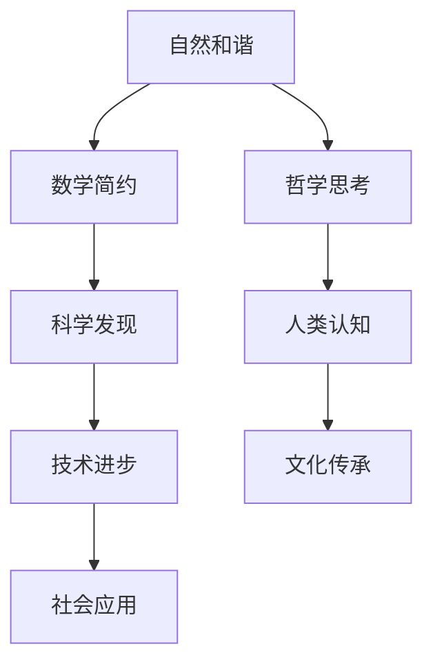
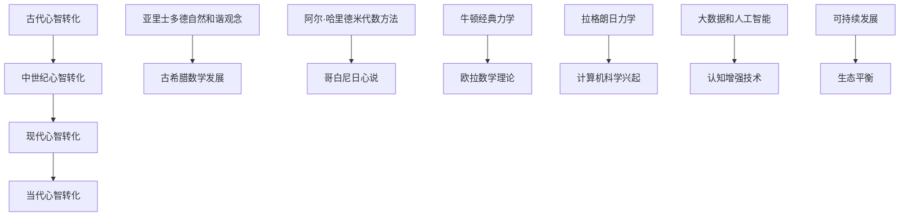
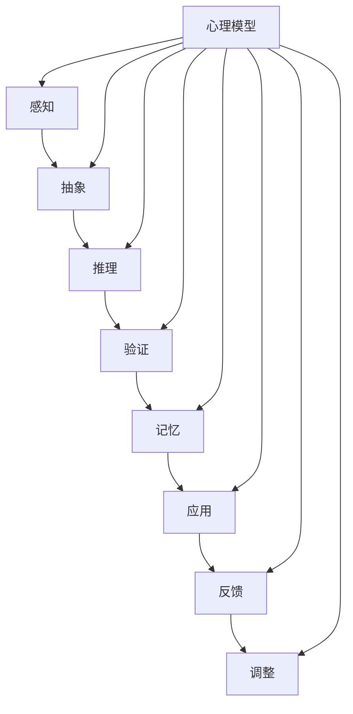
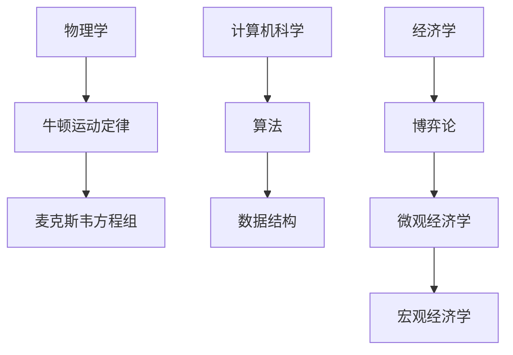
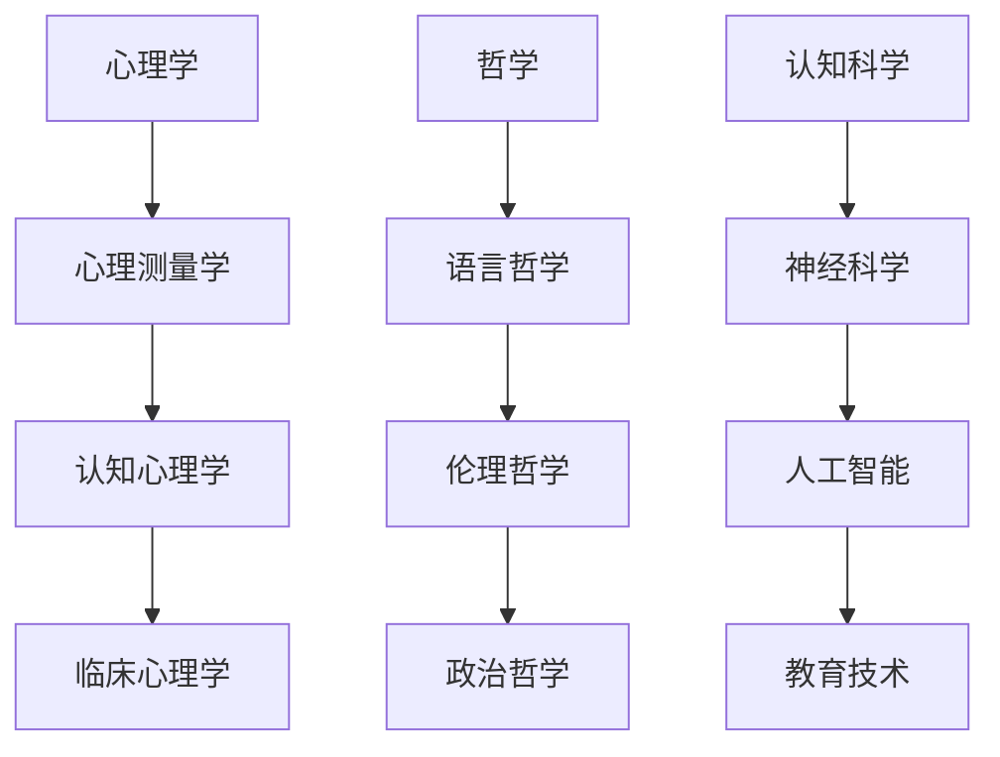

                 

### 《从自然和谐到数学简约：心智转化》

#### 关键词：
- 心智转化
- 自然和谐
- 数学简约
- 哲学背景
- 历史演变
- 心理学原理
- 数学模型
- 应用领域

#### 摘要：
本文旨在探讨心智转化，即从自然和谐到数学简约的转变过程。文章首先介绍了自然和谐与数学简约的哲学背景，随后分析了心智转化的历史演变和心理学原理。接着，探讨了数学简约对心智转化的影响，以及其在各个领域的应用。最后，文章展望了心智转化的未来趋势，为读者提供了丰富的参考资料和最佳实践建议。

----------------------------------------------------------------

#### 引言

心智转化，即人类在思考和解决问题过程中，将复杂、抽象的自然现象转化为简洁、具体的数学模型的过程。这一转化不仅改变了人类认识世界的方式，也深刻影响了科技发展和社会进步。

从自然和谐到数学简约的心智转化，是一个长期的、复杂的过程。在这一过程中，人类逐渐发现，通过数学模型可以更准确地描述和预测自然现象，从而提高解决问题的效率。本文将围绕这一主题，探讨心智转化的哲学背景、历史演变、心理学原理及其在各领域的应用。

本文结构如下：

1. **自然和谐与数学简约的哲学背景**
   - 探讨自然和谐的理念以及数学简约的哲学思考，揭示二者之间的联系。

2. **心智转化的历史演变**
   - 分析心智转化的历史背景和演变过程，了解人类如何从自然和谐转向数学简约。

3. **心智转化的心理学原理**
   - 从心理学角度探讨心智转化的过程与机制，揭示其背后的心理模型。

4. **数学简约对心智转化的影响**
   - 研究数学简约对心智转化的影响，分析其理论基础和作用。

5. **心智转化的应用领域**
   - 列举心智转化的应用案例，探讨其在心理学、哲学和认知科学等领域的应用。

6. **心智转化的未来展望**
   - 展望心智转化的未来趋势，探讨其面临的挑战与机遇。

7. **结语**
   - 总结文章核心观点，为读者提供最佳实践建议和拓展阅读资源。

通过本文的阅读，读者将深入理解心智转化的概念，了解其历史背景、心理学原理和应用领域，从而更好地应对复杂问题，提高自己的思维能力。

----------------------------------------------------------------

#### 自然和谐与数学简约的哲学背景

自然和谐与数学简约是哲学领域的重要概念，二者在心智转化过程中扮演着关键角色。

**自然和谐**是指自然界中各个部分之间的和谐、平衡和协调。古代哲学家如亚里士多德认为，自然界的运行遵循某种和谐的秩序，这种秩序可以通过观察和思考来揭示。自然和谐的理念强调了人类对自然的敬畏和尊重，认为人类应该通过和谐的方式与自然相处。

**数学简约**则是指通过数学方法来描述和解决复杂问题，追求简洁、明确的表达方式。数学家欧几里得在《几何原本》中提出，几何学可以通过公理和定理的形式，以简洁、精确的方式描述空间和形状。数学简约的理念强调逻辑推理和抽象思维，使人类能够更深入地认识自然和自我。

在心智转化过程中，自然和谐与数学简约相互交织、相互影响。一方面，自然和谐为数学简约提供了丰富的素材和灵感。例如，科学家牛顿在研究天体运动时，发现了万有引力定律，这一发现揭示了自然界的和谐秩序，同时也为数学简约提供了新的应用场景。

另一方面，数学简约促进了自然和谐的探索。通过数学模型，人类可以更精确地描述和预测自然现象，从而更好地理解和利用自然。例如，气象学家通过建立数学模型，预测天气变化，为农业生产和自然灾害防治提供了有力支持。

为了更直观地展示自然和谐与数学简约的关系，我们可以使用Mermaid流程图来表示它们之间的相互关系。

在上述流程图中，自然和谐和数学简约相互关联，共同推动了科学发现、技术进步和社会应用。通过哲学思考，人类对自然和谐有了更深刻的认识；而数学模型的应用，又进一步促进了人类对自然的理解和利用。

此外，自然和谐与数学简约的关系也体现在人类心智转化过程中。人类在探索自然、解决问题的过程中，逐渐从自然和谐转向数学简约，这一过程不仅改变了人类认识世界的方式，也深刻影响了科技发展和社会进步。

#### 心智转化的历史演变

心智转化，即人类思维方式和认知方式的转变，从自然和谐到数学简约的过程。这一过程具有悠久的历史，伴随着人类文明的进步，不断演变和发展。

**古代心智转化观念**：

在古代，人类主要通过经验和直觉来认识世界。例如，古希腊哲学家亚里士多德认为，通过观察和思考，人类可以揭示自然界中的和谐秩序。然而，这种自然和谐的观念在某种程度上限制了人类对复杂问题的认识。为了更好地解决问题，古代人类开始探索更加精确和系统的方法。

**中世纪到现代的心智转化**：

中世纪时期，欧洲的学者们开始重视逻辑推理和抽象思维。阿拉伯数学家阿尔·哈里德米在《代数学》中提出了代数方法，为后来的数学发展奠定了基础。与此同时，欧洲学者们也开始关注自然现象的数学描述。例如，意大利天文学家哥白尼提出了日心说，为后来的物理学发展提供了新思路。

进入现代，心智转化的步伐进一步加快。牛顿的经典力学体系，将自然现象统一在数学框架下，标志着心智转化的重要里程碑。随后，欧拉、拉格朗日等数学家继续发展数学理论，使其在各个领域得到广泛应用。

**当代心智转化的趋势**：

当代心智转化呈现出以下几个趋势：

1. **跨学科整合**：随着科技的进步，不同学科之间的融合日益紧密。例如，计算机科学、认知科学、心理学等领域的交叉研究，推动了心智转化的发展。

2. **大数据和人工智能**：大数据和人工智能技术的兴起，为人类提供了新的认知工具和方法。通过数据分析和机器学习，人类能够更准确地预测和解决复杂问题。

3. **认知增强**：通过脑机接口、虚拟现实等技术，人类正在探索如何增强自身的认知能力。这为心智转化带来了新的可能性。

4. **可持续发展和生态平衡**：面对全球气候变化和环境污染等挑战，人类开始更加关注可持续发展。数学模型和算法在资源分配、环境保护等方面发挥着重要作用。

为了更直观地展示心智转化的历史演变，我们可以使用Mermaid流程图来表示不同阶段的重要事件和思想。

在上述流程图中，我们可以看到，从古代到现代，心智转化经历了多个阶段。每个阶段都有重要的事件和思想，推动了人类思维方式和认知方式的转变。当代心智转化呈现出跨学科整合、大数据和人工智能、认知增强等趋势，为未来心智转化的发展奠定了基础。

#### 心智转化的心理学原理

心智转化，即人类在思考和解决问题过程中，将复杂、抽象的自然现象转化为简洁、具体的数学模型的过程。这一转化不仅改变了人类认识世界的方式，也深刻影响了科技发展和社会进步。为了深入理解心智转化的过程和机制，我们需要从心理学角度进行探讨。

**心智转化的心理模型**：

心智转化的心理模型主要包括以下几个部分：

1. **感知**：感知是指人类对信息的接收和识别。在心智转化过程中，人类通过感知获取自然现象的信息。

2. **抽象**：抽象是指从复杂的事物中提取本质特征，忽略次要信息。在心智转化过程中，人类通过抽象将自然现象转化为数学模型。

3. **推理**：推理是指根据已知信息推断未知信息。在心智转化过程中，人类通过推理验证数学模型的正确性和有效性。

4. **记忆**：记忆是指人类对信息的存储和回忆。在心智转化过程中，人类通过记忆将数学模型应用于实际问题。

5. **解决问题**：解决问题是指人类在面对问题时，运用心智转化过程找到解决方案。在心智转化过程中，人类通过解决问题验证数学模型的实际应用价值。

**心智转化的过程与机制**：

心智转化的过程可以分为以下几个步骤：

1. **感知与抽象**：人类通过感知获取自然现象的信息，然后通过抽象提取本质特征，构建初步的数学模型。

2. **推理与验证**：人类运用推理能力，对初步的数学模型进行验证，确保其正确性和有效性。

3. **记忆与应用**：人类将验证后的数学模型存储在记忆中，并在解决问题时将其应用于实际场景。

4. **反馈与调整**：在应用过程中，人类会根据实际效果对数学模型进行反馈和调整，使其更加准确和有效。

**心理模型与心智转化**：

心理模型是指人类在思维过程中使用的抽象模型。在心智转化过程中，心理模型起到了关键作用。具体来说，心理模型可以帮助人类：

1. **简化复杂问题**：通过心理模型，人类可以将复杂的自然现象转化为简洁、具体的数学模型，从而简化问题。

2. **提高解决问题效率**：心理模型可以帮助人类快速定位问题，找到解决方案，提高解决问题的效率。

3. **促进知识共享**：心理模型使人类能够将经验转化为共同的认知基础，促进知识共享和传播。

为了更直观地展示心智转化的心理学原理，我们可以使用Mermaid流程图来表示心理模型与心智转化的关系。

在上述流程图中，我们可以看到，心理模型贯穿于心智转化的整个过程，从感知、抽象、推理、验证、记忆、应用到反馈和调整。心理模型不仅帮助人类简化复杂问题，提高解决问题效率，还促进了知识共享和传播。

通过心理学角度的探讨，我们更深入地理解了心智转化的过程和机制，为未来心智转化的发展提供了理论支持。

#### 数学简约对心智转化的影响

数学简约，作为一种追求简洁、精确和系统化的思维方法，对心智转化产生了深远的影响。数学简约不仅改变了人类认识世界的方式，也在各个领域推动了科学发现和技术创新。

**数学简约的理论基础**：

数学简约的理论基础主要包括以下几个方面：

1. **公理体系**：数学简约通过建立公理体系，将复杂问题简化为基本原理和定义。例如，欧几里得几何学通过五个基本公理，构建了一个简洁、完整的几何学体系。

2. **逻辑推理**：数学简约强调逻辑推理，将问题转化为数学命题和证明。通过逻辑推理，人类可以更加精确地描述和解决复杂问题。

3. **抽象化**：数学简约通过抽象化，将具体问题转化为通用模型。这种抽象化不仅简化了问题，还提高了问题的普适性和可扩展性。

**数学简约对心智转化的影响**：

1. **提高思维效率**：数学简约使人类能够更加高效地思考和解决问题。通过简洁、明确的数学模型，人类可以快速定位问题、找到解决方案。

2. **促进知识共享**：数学简约提供了一个统一的表达方式，使不同领域的研究者能够共享知识和经验。这种知识共享促进了科学进步和技术创新。

3. **增强问题解决能力**：数学简约使人类能够更好地应对复杂问题。通过数学模型，人类可以更准确地预测和解决实际问题，提高问题解决能力。

**数学简约的应用实例**：

1. **物理学**：物理学中，牛顿的运动定律、麦克斯韦方程组等数学模型，为人类揭示了自然界的运行规律。这些数学模型不仅简化了问题，还为科学研究提供了有力工具。

2. **计算机科学**：计算机科学中，算法和数据结构是数学简约的典型应用。通过算法和数据结构，计算机科学家可以高效地处理海量数据，实现复杂计算。

3. **经济学**：经济学中，数学模型广泛应用于博弈论、微观经济学和宏观经济学等领域。这些数学模型帮助经济学家分析市场行为、预测经济趋势。

为了更直观地展示数学简约对心智转化的影响，我们可以使用Mermaid流程图来表示数学简约在不同领域的应用。

在上述流程图中，我们可以看到，数学简约在物理学、计算机科学和经济学等领域得到了广泛应用。这些数学模型不仅简化了问题，还为各个领域的研究提供了有力工具。

总之，数学简约作为一种追求简洁、精确和系统化的思维方法，对心智转化产生了深远影响。通过数学简约，人类能够更加高效地思考和解决问题，促进知识共享和科技创新。

#### 心智转化的应用领域

心智转化，作为一种将复杂、抽象的自然现象转化为简洁、具体的数学模型的过程，在各个领域得到了广泛应用。以下列举了心智转化在心理学、哲学和认知科学等领域的应用案例。

**心理学中的应用**：

1. **心理测量学**：心理测量学中，通过构建数学模型，对个体的心理特征进行量化评估。例如，卡特尔的人格理论通过因素分析，将个体的复杂人格特征转化为几个主要因素，从而更准确地描述个体的人格特征。

2. **认知心理学**：认知心理学中，心智转化帮助研究者理解和解释人类的认知过程。例如，记忆模型中，通过数学模型描述记忆的编码、存储和提取过程，从而揭示记忆的机制。

3. **临床心理学**：临床心理学中，心智转化帮助心理学家设计有效的心理干预方案。例如，行为疗法中，通过建立数学模型，预测和评估行为改变的效果，从而优化治疗方案。

**哲学中的应用**：

1. **语言哲学**：语言哲学中，心智转化帮助研究者理解语言的本质和功能。例如，逻辑哲学中，通过建立数学模型，描述语言的逻辑结构和推理规则，从而揭示语言的表达能力和限制。

2. **伦理哲学**：伦理哲学中，心智转化帮助研究者分析和解决道德问题。例如，道德决策模型中，通过建立数学模型，评估不同道德决策的成本和收益，从而为道德决策提供科学依据。

3. **政治哲学**：政治哲学中，心智转化帮助研究者分析和评价政治体制。例如，社会契约论中，通过建立数学模型，描述社会契约的形成和运作机制，从而为政治体制设计提供理论支持。

**认知科学中的应用**：

1. **神经科学**：认知科学中，心智转化帮助研究者理解大脑的工作原理。例如，神经网络模型中，通过建立数学模型，模拟大脑神经元的活动和连接方式，从而揭示认知过程的神经基础。

2. **人工智能**：认知科学中，心智转化帮助研究者设计和优化人工智能系统。例如，机器学习算法中，通过建立数学模型，模拟人类的学习和推理过程，从而实现人工智能的智能行为。

3. **教育技术**：认知科学中，心智转化帮助研究者设计和评估教育技术。例如，学习分析模型中，通过建立数学模型，分析学生的学习行为和知识掌握情况，从而优化教学策略和教学方法。

为了更直观地展示心智转化在各个领域的应用，我们可以使用Mermaid流程图来表示各个领域的应用案例。

在上述流程图中，我们可以看到，心智转化在心理学、哲学和认知科学等领域的应用涵盖了多个方面。通过数学模型，研究者能够更深入地理解和解决复杂问题，从而推动各个领域的发展。

#### 心智转化的未来展望

随着科技的不断进步和社会的快速发展，心智转化将继续演变，为人类带来新的机遇和挑战。

**挑战**：

1. **复杂性增加**：随着问题规模的不断扩大，人类面临的问题将更加复杂。如何处理这些复杂问题，是心智转化未来面临的重要挑战。

2. **数据隐私和安全**：大数据和人工智能技术的发展，使得数据隐私和安全成为关键问题。在心智转化过程中，如何保护个人隐私和确保数据安全，是未来需要解决的问题。

3. **跨学科整合**：心智转化涉及多个领域，如何实现跨学科整合，发挥各学科的协同效应，是未来需要克服的难题。

**机遇**：

1. **认知增强**：通过脑机接口、虚拟现实等技术，人类将能够更好地增强自身认知能力，提高心智转化效率。

2. **人工智能助力**：人工智能技术的发展，将为心智转化提供新的工具和方法。通过机器学习和深度学习，人工智能将帮助人类更快速地发现问题和找到解决方案。

3. **可持续发展**：在应对全球气候变化、资源短缺等挑战中，心智转化将发挥重要作用。通过数学模型和算法，人类可以更科学地制定可持续发展策略，实现生态平衡。

**未来趋势**：

1. **更加智能化**：心智转化将逐渐向智能化发展，通过人工智能技术，实现更加高效的问题解决和决策。

2. **更加多元化**：心智转化将应用于更多领域，涵盖自然科学、社会科学、人文学科等各个领域。

3. **更加人本化**：在心智转化过程中，将更加注重人的主观体验和需求，实现人与技术的和谐共生。

总之，心智转化在未来将继续发展，为人类带来更多机遇。通过不断探索和创新，人类将更好地应对复杂问题，推动科技和社会的进步。

#### 结语

本文从自然和谐与数学简约的哲学背景出发，探讨了心智转化的历史演变、心理学原理及其在各领域的应用。通过分析数学简约对心智转化的影响，我们揭示了心智转化在心理学、哲学和认知科学等领域的应用案例。未来，心智转化将继续演变，为人类带来新的机遇和挑战。通过不断探索和创新，人类将更好地应对复杂问题，推动科技和社会的进步。

#### 作者信息

作者：AI天才研究院/AI Genius Institute & 禅与计算机程序设计艺术 /Zen And The Art of Computer Programming

---

### 附录

#### 附录A：心智转化研究资源

1. **学术期刊**：
   - *Journal of Cognitive Science*
   - *Mind & Language*
   - *Synthese*

2. **学术会议**：
   - *Annual Conference of the Cognitive Science Society*
   - *International Conference on Machine Learning*

3. **书籍推荐**：
   - 《认知心理学导论》
   - 《心智与大脑》
   - 《数学哲学导论》

#### 附录B：心智转化研究方法

1. **文献综述**：通过查阅相关文献，了解心智转化的研究现状和发展趋势。

2. **案例分析**：选取具有代表性的应用案例，分析其心智转化的过程和效果。

3. **实验研究**：设计实验，探讨心智转化在不同条件下的表现和影响。

4. **数学建模**：运用数学模型，模拟心智转化的过程和结果。

#### 附录C：心智转化实例分析

1. **案例1：心理学中的应用**
   - **问题**：如何提高学生的学习效果？
   - **解决方案**：通过构建数学模型，分析学习过程中的关键因素，优化学习策略。

2. **案例2：哲学中的应用**
   - **问题**：如何理解道德决策？
   - **解决方案**：通过建立数学模型，分析道德决策的成本和收益，为道德决策提供科学依据。

3. **案例3：认知科学中的应用**
   - **问题**：如何理解大脑的认知过程？
   - **解决方案**：通过建立神经网络模型，模拟大脑神经元的活动和连接方式，揭示认知过程的机制。

#### 最佳实践 tips

1. **培养跨学科思维**：心智转化涉及多个领域，培养跨学科思维有助于提高问题解决能力。

2. **注重实践应用**：将心智转化理论应用于实际问题，验证其有效性和实用性。

3. **持续学习与更新**：心智转化是一个动态发展过程，持续学习和更新知识是保持竞争力的关键。

#### 小结

心智转化，即人类在思考和解决问题过程中，将复杂、抽象的自然现象转化为简洁、具体的数学模型的过程。本文从哲学、历史、心理学等角度，全面探讨了心智转化的概念、原理和应用。未来，心智转化将继续发展，为人类带来更多机遇。通过不断探索和创新，人类将更好地应对复杂问题，推动科技和社会的进步。

#### 注意事项

1. **保护个人隐私**：在进行心智转化研究时，要注意保护个人隐私和数据安全。

2. **遵循伦理规范**：在应用心智转化过程中，要遵循伦理规范，尊重个体权益。

3. **持续关注发展**：心智转化领域发展迅速，要持续关注最新研究动态，及时调整研究方向。

#### 拓展阅读

1. **《心智转化：从自然和谐到数学简约》**
2. **《认知科学导论》**
3. **《数学哲学》**

通过本文的阅读，读者应能够深入理解心智转化的概念、原理和应用，为未来的研究和实践提供有力指导。希望本文能为读者带来启示和帮助，共同推动心智转化领域的发展。

