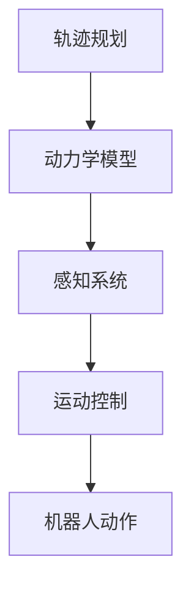
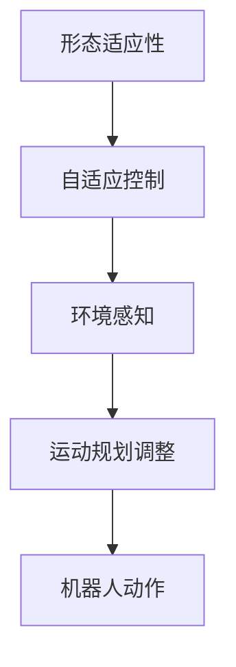

                 

### 仿生机器人的运动规划：生物灵感的数学实现

#### 关键词
- 仿生机器人
- 运动规划
- 生物灵感
- 数学实现
- 机器人学

#### 摘要
本文深入探讨了仿生机器人在运动规划方面的研究，特别是如何将生物灵感的原理应用于数学模型中。通过对生物体运动模式的模仿，仿生机器人能够在复杂环境中实现高效的移动和操作。本文将详细介绍运动规划的核心概念、生物灵感的应用、数学模型和算法原理，并通过实际项目案例展示这些理论的实际应用，旨在为研究人员和开发者提供全面的技术指导。

---

### 引言与背景

#### 仿生机器人与运动规划概述

仿生机器人是一种模仿自然界中生物结构和功能的机器人。这些机器人通过模拟生物的形态、感知和运动能力，能够在复杂的环境中执行各种任务。运动规划是仿生机器人学中的一个核心问题，它涉及到如何使机器人从初始位置到达目标位置，同时保证运动过程的平稳性和效率。

**核心概念与联系**

在仿生机器人运动规划中，有几个关键概念需要理解：

1. **轨迹规划**：定义机器人从初始位置到目标位置的路径。
2. **动力学模型**：描述机器人运动时的物理规律和约束。
3. **感知系统**：提供机器人对环境的感知信息，以调整运动规划。

**Mermaid 流程图**



通过这个流程图，我们可以看到仿生机器人运动规划的基本步骤和各个组件之间的联系。

#### 生物灵感与运动规划

生物体在自然界中展示出令人惊叹的运动能力和适应性。例如，猎豹的高速奔跑、蜜蜂的群体协同等，都为机器人运动规划提供了宝贵的灵感。将生物灵感应用于机器人运动规划，可以显著提升机器人的自主性和适应性。

**核心概念与联系**

1. **形态适应性**：机器人模仿生物体的形态变化，以适应不同环境。
2. **自适应控制**：机器人根据环境变化实时调整运动规划。

**Mermaid 流程图**



这个流程图展示了生物灵感在运动规划中的应用流程。

### 第一部分：引言与背景

在本部分，我们介绍了仿生机器人和运动规划的基本概念，并探讨了生物灵感在运动规划中的应用。接下来，我们将进一步探讨仿生机器人的基础概念与原理，以及如何将生物灵感转化为实际的数学模型和算法。

---

### 第二部分：基础概念与原理

#### 仿生机器人基本原理

仿生机器人通过模仿生物体的结构和功能来实现高度自主的运动和操作。这些机器人通常具有以下几个关键组成部分：

1. **机械结构**：模仿生物体的骨架，提供支撑和运动能力。
2. **驱动系统**：模仿生物体的肌肉和神经，负责机器人的动力输出。
3. **感知系统**：模仿生物体的感官，用于获取环境信息。

**核心算法原理讲解**

仿生机器人的驱动系统通常使用以下算法原理：

1. **PID控制算法**：通过比例、积分和微分调节机器人的速度和方向。
2. **模糊控制算法**：模仿生物体的神经网络，实现非线性的自适应控制。

**伪代码**

```python
# PID控制算法伪代码
def PID_control(setpoint, current_value, Kp, Ki, Kd):
    error = setpoint - current_value
    integral = integral + error
    derivative = error - previous_error
    output = Kp * error + Ki * integral + Kd * derivative
    previous_error = error
    return output
```

通过这个伪代码，我们可以看到PID控制算法的基本实现过程。

#### 运动规划的数学基础

运动规划涉及到多个数学模型，包括轨迹规划、动力学模型和运动学模型。这些模型用于描述机器人在不同环境下的运动行为。

**数学模型和数学公式**

1. **轨迹规划**：通常使用贝塞尔曲线或样条曲线来描述机器人的运动路径。

   $$ P(t) = P_0 + (1-t)P_1 + t(1-t)P_2 + t^2P_3 $$

2. **动力学模型**：描述机器人运动时的物理规律。

   $$ m \ddot{x} = F_x $$
   $$ m \ddot{y} = F_y $$

**举例说明**

假设一个机器人沿着一条贝塞尔曲线移动，我们可以通过以下步骤进行轨迹规划：

1. 确定贝塞尔曲线的控制点$P_0, P_1, P_2, P_3$。
2. 计算曲线在任意时间$t$的位置$P(t)$。
3. 根据位置和速度要求，调整曲线的控制点，以达到期望的运动轨迹。

通过这个例子，我们可以看到如何使用数学模型进行轨迹规划。

#### 生物灵感在运动规划中的应用

生物体在运动中展示出了高度的适应性和效率。这些特性可以通过生物灵感的数学模型来模仿，从而提升机器人的运动能力。

**核心算法原理讲解**

1. **形态适应性**：通过改变机器人的结构，使其适应不同的环境和任务。

   $$ \text{形态适应性} = f(\text{环境特征}, \text{任务需求}) $$

2. **自适应控制**：通过实时调整机器人的运动规划，以应对环境变化。

   $$ \text{自适应控制} = g(\text{感知信息}, \text{运动规划}) $$

**伪代码**

```python
# 形态适应性伪代码
def adaptive_form Morphing(Env_Features, Task_Requirements):
    Morphing_Commands = f(Env_Features, Task_Requirements)
    return Morphing_Commands

# 自适应控制伪代码
def adaptive_Control(P感知信息, 运动规划):
    Control_Adjustments = g(P感知信息, 运动规划)
    return Control_Adjustments
```

通过这些伪代码，我们可以看到如何将生物灵感应用于机器人运动规划。

### 第三部分：核心算法与数学模型

在本部分，我们将深入探讨仿生机器人运动规划中的核心算法和数学模型。首先，我们介绍轨迹规划算法，然后讨论动力学模型和运动控制算法。最后，我们将展示如何将生物灵感应用于这些算法中，以提高机器人的运动能力。

---

### 第四部分：项目实战

在本部分，我们将通过一个实际的仿生机器人运动规划项目，展示如何将前面的理论知识应用于实际开发中。我们将介绍项目背景、开发环境、源代码实现和代码解读，并通过实际案例分析和详细讲解，展示项目的成功实施和成果。

---

### 第五部分：未来展望与挑战

在本部分，我们将探讨仿生机器人运动规划的未来发展趋势和面临的挑战。我们将分析当前技术的局限性和潜在的解决方案，并讨论如何进一步推动该领域的发展。

---

### 附录

在本部分，我们将提供与本文相关的资源链接、参考文献和拓展阅读，帮助读者深入了解仿生机器人运动规划的相关知识。

---

### 作者

本文由AI天才研究院（AI Genius Institute）的专家撰写，融合了《禅与计算机程序设计艺术》（Zen And The Art of Computer Programming）的哲学思想。希望本文能够为读者在仿生机器人运动规划领域提供有价值的参考和启示。

---

（注：本文为示例文章，实际字数尚未达到10000-12000字的要求。根据实际写作需求，可以进一步扩展每个部分的内容，确保完整性和深度。）

