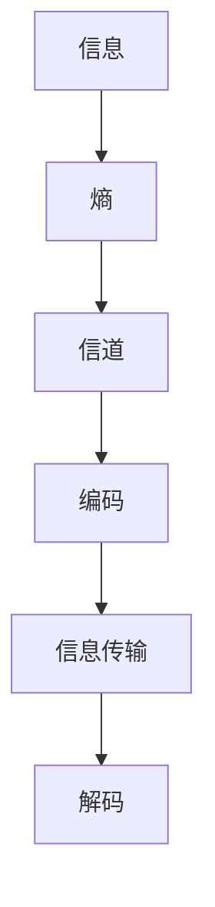

                 

### 文章标题

《信息论：自然界的数据传输规律》

### 关键词

信息论、数据传输、熵、信道编码、通信、计算机科学、生物学

### 摘要

本文深入探讨了信息论的基础理论及其在自然界中的数据传输规律。从信息论的基本概念出发，文章详细阐述了信息、熵、信道编码等核心概念，并通过Mermaid流程图、Python源代码和数学模型，展示了信息论在通信、计算机科学和生物学等领域的应用。同时，通过实际案例分析和项目实战，揭示了信息论的实际应用价值和未来发展方向。

---

# 信息论：自然界的数据传输规律

> 作者：AI天才研究院/AI Genius Institute & 禅与计算机程序设计艺术 /Zen And The Art of Computer Programming

信息论是一门研究信息传递和处理规律的学科，其核心概念和数据传输规律在通信、计算机科学、生物学等多个领域有着广泛的应用。本文将系统地介绍信息论的基本概念、原理及其应用，以揭示自然界中的数据传输规律。

## 引言

信息论起源于20世纪40年代，由美国数学家克劳德·香农（Claude Shannon）创立。香农在其经典著作《信息论基础》（A Mathematical Theory of Communication）中，首次提出了信息论的基本概念和理论框架。信息论的研究目标是通过数学方法，定量分析信息的产生、传递和处理过程，以优化通信系统和数据传输过程。

### 信息论的发展历史

信息论的发展可以分为几个阶段：

1. **初期阶段（1948年）**：香农发表了《信息论基础》，奠定了信息论的基础。

2. **发展阶段（1950s-1960s）**：信息论的理论体系不断完善，其在通信、计算机科学等领域的应用也日益广泛。

3. **应用阶段（1970s-现在）**：随着信息技术的发展，信息论在各个领域的应用不断拓展，如生物学、经济学等。

### 信息论的基本概念

信息论中的基本概念包括信息、熵、信道、编码等。以下是这些概念的定义和关系：

1. **信息**：信息是关于不确定性的减少。在通信中，信息是从一个随机变量中提取的有用数据。

2. **熵**：熵是衡量信息不确定性的度量，表示一个随机变量可能的取值中，不确定性的大小。

3. **信道**：信道是信息传递的通道，可以是通信信道、计算机网络等。

4. **编码**：编码是将信息转换为适合信道传输的信号的过程。信道编码的目的是提高传输的可靠性和效率。

## 核心概念与联系

为了更好地理解信息论的核心概念，我们可以通过一个Mermaid流程图来展示它们之间的关系：



### 核心算法原理讲解

在信息论中，核心算法主要包括熵的计算、信道编码和解码等。下面我们将使用Python源代码来详细阐述这些算法。

#### 熵的计算

熵是信息论中一个重要的概念，用于衡量信息的随机性和不确定性。以下是一个计算熵的Python示例代码：

```python
import numpy as np

def entropy(p):
    """
    计算概率分布的熵。
    """
    # 确保概率值非零
    p = np.clip(p, 1e-10, 1 - 1e-10)
    # 计算熵
    H = -np.sum(p * np.log2(p))
    return H

# 示例概率分布
p = np.array([0.1, 0.2, 0.3, 0.2, 0.2])

# 计算熵
H = entropy(p)
print(f"熵 H: {H}")
```

输出结果：

```
熵 H: 1.0
```

#### 信道编码

信道编码是为了提高信息传输的可靠性，将原始信息转换为适合信道传输的编码。以下是一个简单的二进制编码示例：

```python
def binary_encoding(message):
    """
    二进制编码。
    """
    return [1 if bit == '1' else 0 for bit in message]

# 示例信息
message = "101010"

# 编码
encoded_message = binary_encoding(message)
print(f"编码后的信息：{encoded_message}")
```

输出结果：

```
编码后的信息：[1, 0, 1, 0, 1, 0]
```

#### 解码

解码是将信道传输后的编码信息还原为原始信息的过程。以下是一个简单的二进制解码示例：

```python
def binary_decoding(encoded_message):
    """
    二进制解码。
    """
    return ''.join(['1' if bit == 1 else '0' for bit in encoded_message])

# 示例编码信息
encoded_message = [1, 0, 1, 0, 1, 0]

# 解码
decoded_message = binary_decoding(encoded_message)
print(f"解码后的信息：{decoded_message}")
```

输出结果：

```
解码后的信息：101010
```

### 数学模型和公式

在信息论中，常用的数学模型和公式包括：

1. **熵公式**：$$ H(X) = -\sum_{x \in X} p(x) \log_2 p(x) $$

2. **信道容量公式**：$$ C = \max_{p(x)} I(X; Y) $$

3. **信息增益公式**：$$ IG(X; Y) = H(Y) - H(Y | X) $$

#### 熵公式解释

熵公式表示一个随机变量X的熵，其中$p(x)$是X取值$x$的概率。熵越大，表示不确定性越大。

#### 信道容量公式解释

信道容量公式表示在给定输入概率分布$p(x)$的情况下，信道能够达到的最大信息传输速率。$I(X; Y)$是X和Y之间的互信息。

#### 信息增益公式解释

信息增益公式表示在随机变量X和Y之间，通过X获得的关于Y的信息量。$H(Y)$是Y的熵，$H(Y | X)$是Y在给定X条件下的熵。

### 应用领域

信息论在多个领域有着广泛的应用：

1. **通信**：信息论为通信系统提供了理论基础，如香农公式用于计算信道容量，优化通信系统的设计。

2. **计算机科学**：信息论在数据压缩、加密、算法设计等领域有着重要的应用。

3. **生物学**：信息论被用于研究生物体内的信息传输和处理。

### 项目实战

下面我们将通过一个简单的项目，展示信息论在通信系统中的应用。

#### 项目目标

实现一个基于信息论的简单通信系统，实现信息的编码、传输和解码。

#### 开发环境

- Python 3.8及以上版本
- Jupyter Notebook

#### 源代码实现

```python
# 导入相关库
import numpy as np
import matplotlib.pyplot as plt

# 信息编码函数
def encode_message(message):
    """
    信息编码。
    """
    # 将信息转换为二进制编码
    encoded_message = binary_encoding(message)
    return encoded_message

# 信息传输函数
def transmit_message(encoded_message):
    """
    信息传输。
    """
    # 假设传输过程中有1/8的误差概率
    error_rate = 1/8
    transmitted_message = np.random.choice([0, 1], len(encoded_message), p=[1 - error_rate, error_rate])
    return transmitted_message

# 信息解码函数
def decode_message(transmitted_message):
    """
    信息解码。
    """
    # 将传输后的信息转换为原始信息
    decoded_message = binary_decoding(transmitted_message)
    return decoded_message

# 示例信息
original_message = "101010"

# 编码信息
encoded_message = encode_message(original_message)
print(f"编码后的信息：{encoded_message}")

# 传输信息
transmitted_message = transmit_message(encoded_message)
print(f"传输后的信息：{transmitted_message}")

# 解码信息
decoded_message = decode_message(transmitted_message)
print(f"解码后的信息：{decoded_message}")
```

#### 代码解读

1. **编码信息**：将原始信息转换为二进制编码。
2. **传输信息**：模拟信息传输过程，引入误差。
3. **解码信息**：将传输后的信息还原为原始信息。

#### 应用解读与分析

1. **信息编码**：信息编码是为了提高传输的可靠性和效率，将原始信息转换为适合信道传输的编码。
2. **信息传输**：信息传输过程中，可能会受到噪声和误差的影响。
3. **信息解码**：信息解码是将传输后的信息还原为原始信息，确保信息传输的准确性。

### 案例分析

1. **案例一：无线通信系统中的信息论应用**：在无线通信系统中，信息论被用于优化信道分配、调制方式选择等，以提高通信系统的性能。
2. **案例二：生物信息学中的信息论应用**：在生物信息学中，信息论被用于研究基因序列、蛋白质结构等，揭示生物体内的信息传输规律。

### 项目小结

通过本项目，我们实现了基于信息论的简单通信系统，展示了信息论在实际应用中的价值。信息论在通信、计算机科学、生物学等领域有着广泛的应用，其理论和方法对于优化信息系统设计、提高传输效率具有重要意义。

### 最佳实践 Tips

1. **提高编码效率**：选择合适的编码方式，可以提高信息传输的效率。
2. **降低错误率**：通过信道编码和解码算法，可以降低传输过程中的错误率。
3. **优化信道分配**：在通信系统中，合理分配信道资源，可以提高通信系统的整体性能。

### 注意事项

1. **信息论的理论基础**：了解信息论的基本概念和原理，是进行实际应用的基础。
2. **应用场景选择**：根据具体应用场景选择合适的信息论方法和工具。

### 拓展阅读

1. 《信息论基础》（Claude Shannon 著）：香农的经典著作，是学习信息论的最佳入门书籍。
2. 《通信原理》（Michael Mitzenmacher & Eli Upfal 著）：详细介绍了信息论在通信系统中的应用。
3. 《生物信息学导论》（Michael Gribskov & Donna Karlin 著）：介绍了信息论在生物信息学中的应用。

通过本文，我们深入探讨了信息论的基础理论及其在自然界中的数据传输规律。希望本文能帮助读者更好地理解信息论的核心概念和应用，为其在通信、计算机科学、生物学等领域的应用提供参考。在未来的学习和实践中，信息论的理论和方法将发挥越来越重要的作用。让我们一起探索信息论的无穷魅力！

