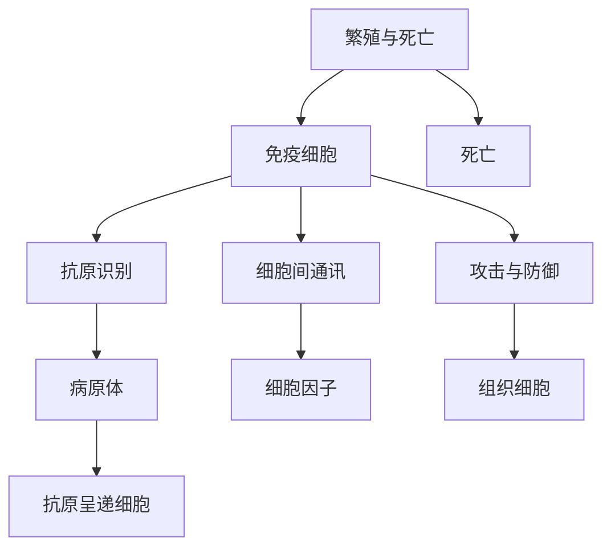

                 

### 目录大纲

为了确保文章的结构紧凑、逻辑清晰，我们首先需要构建一个详细的目录大纲。以下是文章的目录大纲，它将指导我们系统地展开每一个章节的内容。

---

## 目录大纲

### 第1章 引言

- 1.1 研究背景
- 1.2 ABM在免疫系统研究中的应用
- 1.3 本书结构

### 第2章 免疫系统基础

- 2.1 免疫系统的基本组成部分
- 2.2 免疫反应的类型
- 2.3 免疫系统的调控机制
- 2.4 免疫系统的动态特性

### 第3章 agent-based模型基础

- 3.1 agent-based模型概述
- 3.2 agent-based模型的构建方法
- 3.3 agent-based模型的模拟流程
- 3.4 agent-based模型在不同领域的应用

### 第4章 免疫系统的agent-based模型架构设计

- 4.1 模型框架设计
- 4.2 agent类型及其行为设计
- 4.3 模型参数设置与校准
- 4.4 Mermaid流程图：模型主要组成部分和交互

### 第5章 免疫反应过程的数学建模

- 5.1 免疫反应的数学模型
- 5.2 伪代码实现
- 5.3 数学公式推导
- 5.4 LaTeX代码示例

### 第6章 模拟与结果分析

- 6.1 模拟环境设置
- 6.2 模拟结果可视化
- 6.3 结果分析与讨论
- 6.4 示例数据集和模拟结果分析

### 第7章 免疫系统的agent-based模型应用

- 7.1 模型在疾病预测中的应用
- 7.2 模型在疫苗研究中的应用
- 7.3 模型在治疗策略设计中的应用
- 7.4 开发环境搭建
- 7.5 源代码详细实现和代码解读
- 7.6 代码应用解读与分析
- 7.7 实际案例分析和详细讲解剖析
- 7.8 项目小结

### 第8章 结论与展望

- 8.1 本书总结
- 8.2 模型改进与未来研究方向
- 8.3 对生物防御研究的贡献
- 8.4 最佳实践 tips
- 8.5 小结
- 8.6 注意事项
- 8.7 拓展阅读

---

通过这个详细的目录大纲，我们可以确保文章的内容覆盖全面，并且各个章节之间逻辑清晰，便于读者理解和跟随。接下来，我们将逐一详细展开每一章节的内容。

---

## 关键词

本文的关键词包括：免疫系统、agent-based模型、数学模拟、生物防御、免疫反应、疾病预测、疫苗研究、治疗策略、开发环境、代码解读。

---

## 文章摘要

本文将深入探讨免疫系统中的agent-based模型及其在生物防御领域的应用。首先，我们将介绍免疫系统的基本组成部分和免疫反应的类型，为后续建模打下基础。接着，我们将详细阐述agent-based模型的基本概念和构建方法，并通过一个Mermaid流程图展示模型的主要组成部分和交互。

随后，我们将引入免疫反应过程的数学建模，使用Python源代码和LaTeX公式详细讲解核心算法原理。在此基础上，我们通过构建和模拟一个具体的免疫系统模型，展示如何将理论与实际应用相结合。

文章的第三部分将聚焦于模拟结果的分析与讨论，通过可视化和示例数据集展示模型的性能和有效性。接下来，我们将介绍模型在疾病预测、疫苗研究和治疗策略设计中的应用，并提供开发环境的搭建指南和源代码详细解读。

最后，本文将总结研究的主要发现，讨论未来研究方向，并对生物防御研究做出贡献。通过本文的阅读，读者将能够全面了解agent-based模型在免疫系统研究中的潜力，并为相关领域的研究和实践提供有益的参考。

---

## 第1章 引言

### 1.1 研究背景

免疫系统是生物体对抗病原体入侵的重要防御系统。然而，这个复杂系统的运作机制和响应过程仍然充满挑战，需要科学家们深入研究和理解。传统的分子生物学和细胞生物学方法在揭示免疫系统某些方面的工作原理方面取得了巨大进步，但它们往往难以捕捉到系统整体行为的动态特性。

近年来，随着计算生物学和数学建模技术的发展，agent-based模型（ABM）逐渐成为研究复杂生物系统的一种有力工具。ABM通过模拟个体（agent）的行为和相互作用，提供了一种新的视角来理解和预测系统的行为。在免疫系统研究中，ABM可以帮助研究者模拟复杂的免疫反应过程，从而揭示免疫系统如何应对各种病原体入侵。

研究背景的另一个重要方面是生物防御领域的研究需求。随着生物技术的发展，人们对于疾病预防和治疗的需求日益增长。然而，传统的疫苗研究和治疗方法往往需要大量的实验和长时间的观察，成本高昂且效果有限。通过ABM，研究者可以在虚拟环境中模拟不同的免疫反应和治疗方案，从而在早期阶段预测其效果，为实际应用提供有力支持。

### 1.2 ABM在免疫系统研究中的应用

agent-based模型在免疫系统研究中的应用已经引起了广泛关注。首先，ABM可以模拟免疫细胞（如T细胞、B细胞和巨噬细胞）的动态行为和相互作用。这些模型通常基于免疫细胞的生理和生化特性，通过计算模拟细胞之间的信号传导、迁移和抗病毒反应等过程，从而模拟出免疫系统的整体行为。

例如，一个典型的ABM可以模拟T细胞在抗原识别后的反应过程。T细胞通过其表面的受体识别并结合抗原，随后激活并增殖，从而产生大量效应T细胞。这些效应T细胞可以识别并消灭被感染的细胞，从而清除病原体。通过ABM，研究者可以模拟这一复杂的过程，并分析不同参数对系统行为的影响。

此外，ABM还可以用于研究免疫系统的多样性和适应性。免疫系统的多样性来源于其庞大的T细胞和B细胞库，这些细胞可以识别和应对各种不同的抗原。通过模拟免疫细胞的多样性，研究者可以探讨免疫系统如何适应不断变化的环境，从而提高其抗病能力。

在疾病预测和疫苗研究中，ABM也发挥了重要作用。研究者可以利用ABM模拟不同疫苗或药物对免疫系统的影响，从而评估其效果和安全性。例如，通过模拟疫苗诱导的免疫反应，研究者可以预测疫苗对不同人群的保护效果，从而优化疫苗的设计和接种策略。

### 1.3 本书结构

本书旨在系统地介绍免疫系统的agent-based模型，并探讨其在生物防御领域的应用。全书共分为八个章节，具体结构如下：

- **第1章 引言**：介绍研究背景、ABM在免疫系统研究中的应用，以及本书的结构和目标。
- **第2章 免疫系统基础**：详细描述免疫系统的基本组成部分、免疫反应的类型和调控机制。
- **第3章 agent-based模型基础**：介绍ABM的基本概念、构建方法和模拟流程。
- **第4章 免疫系统的agent-based模型架构设计**：讨论模型的框架设计、agent类型和行为设计。
- **第5章 免疫反应过程的数学建模**：讲解免疫反应的数学模型、伪代码实现和数学公式推导。
- **第6章 模拟与结果分析**：介绍模拟环境设置、结果可视化、结果分析与讨论。
- **第7章 免疫系统的agent-based模型应用**：讨论模型在疾病预测、疫苗研究和治疗策略设计中的应用，并提供开发环境和源代码实现。
- **第8章 结论与展望**：总结本书的主要发现，讨论未来研究方向和对生物防御研究的贡献。

通过这本书，读者将能够系统地了解免疫系统的agent-based模型，掌握其构建和模拟方法，并了解其在生物防御领域的广泛应用。

---

## 第2章 免疫系统基础

### 2.1 免疫系统的基本组成部分

免疫系统是一个复杂的生物系统，由多种细胞类型、组织和分子组成，协同工作以保护机体免受病原体入侵。以下是免疫系统的基本组成部分：

#### 细胞类型

1. **抗原呈递细胞（APC）**：包括树突细胞、巨噬细胞和B细胞，它们能够摄取和处理抗原，并将抗原呈递给T细胞。
2. **T细胞**：包括辅助性T细胞（Th）和细胞毒性T细胞（Tc）。辅助性T细胞帮助其他免疫细胞发挥作用，而细胞毒性T细胞能够直接杀死被感染的细胞。
3. **B细胞**：能够产生抗体，对抗外来抗原。
4. **自然杀伤细胞（NK细胞）**：能够识别并杀死病毒感染的细胞和肿瘤细胞。

#### 组织

1. **淋巴结**：淋巴结是免疫细胞聚集和反应的场所，也是抗原呈递的重要位置。
2. **脾脏**：脾脏是免疫细胞储存和活化的场所，也是清除老化红细胞和病原体的重要器官。
3. **骨髓**：骨髓是免疫细胞的产生和分化场所。

#### 分子

1. **抗体**：由B细胞产生，能够识别并结合特定的抗原，从而中和或标记病原体。
2. **细胞因子**：包括白细胞介素（IL）、干扰素（IFN）和肿瘤坏死因子（TNF）等，能够调节免疫细胞的活化和相互作用。

### 2.2 免疫反应的类型

免疫系统主要有两种类型的免疫反应：天然免疫和适应性免疫。

#### 天然免疫

天然免疫是机体对入侵病原体的第一道防线，具有先天性和广泛性的特点。其主要机制包括：

1. **屏障防御**：皮肤、黏膜和分泌物（如唾液和胃酸）构成物理和化学屏障，阻止病原体进入体内。
2. **吞噬作用**：巨噬细胞和树突细胞通过吞噬作用摄取和处理病原体，从而激活免疫反应。
3. **炎症反应**：病原体入侵时，局部血管扩张、通透性增加，引发炎症反应，吸引免疫细胞到达感染部位。
4. **天然杀伤细胞（NK细胞）**：直接识别并杀死病毒感染的细胞和肿瘤细胞。

#### 适应性免疫

适应性免疫是后天获得的免疫反应，具有针对性和记忆性。其主要机制包括：

1. **B细胞介导的免疫反应**：B细胞识别抗原后，分化为浆细胞，产生特异性抗体，与抗原结合，从而中和或标记病原体。
2. **T细胞介导的免疫反应**：T细胞识别抗原呈递细胞展示的抗原后，分化为效应T细胞，直接杀死被感染的细胞或协助其他免疫细胞发挥作用。
3. **免疫记忆**：适应性免疫细胞在初次遇到抗原后，会形成记忆细胞，从而在再次遇到同一抗原时能够迅速作出反应。

### 2.3 免疫系统的调控机制

免疫系统的调控机制确保其在应对病原体入侵时既不过敏也不失效。以下是几个关键的调控机制：

1. **负反馈**：免疫细胞和分子之间的相互作用可以通过负反馈机制调节免疫反应的强度和持续时间。例如，效应细胞在完成使命后，会释放调节因子抑制进一步免疫反应。
2. **共刺激信号**：免疫细胞之间的相互作用不仅依赖于抗原识别，还需要共刺激信号来激活免疫反应。例如，B细胞和T细胞之间的共刺激分子相互作用，决定B细胞的分化和抗体的产生。
3. **调节性T细胞**：调节性T细胞能够抑制其他免疫细胞的活化和增殖，从而防止过度免疫反应。例如，调节性T细胞通过分泌抑制因子，抑制效应T细胞和巨噬细胞的活性。

4. **微环境调控**：免疫细胞所处的微环境对其功能具有重要影响。例如，特定的细胞因子和生长因子可以调节免疫细胞的迁移、分化和功能。

### 2.4 免疫系统的动态特性

免疫系统的动态特性体现在其不断适应和应对外界环境变化的能力。以下是一些关键的动态特性：

1. **多样性**：免疫系统能够产生大量的免疫细胞和抗体，以应对各种不同的抗原。这种多样性来源于B细胞和T细胞的克隆选择和变异。
2. **记忆性**：适应性免疫细胞在初次接触抗原后，会形成记忆细胞，这些记忆细胞在再次遇到同一抗原时能够迅速作出反应，从而提高免疫效果。
3. **平衡性**：免疫系统需要在应答病原体和避免过度免疫之间保持平衡。例如，炎症反应需要在适当的时间和强度内控制，以避免对自身组织的损害。
4. **可塑性**：免疫系统具有一定的可塑性，可以在不同环境和条件下调整其功能和行为。例如，在疫苗诱导的免疫反应中，免疫系统可以产生特定的记忆细胞，以应对未来的病原体入侵。

通过理解免疫系统的基本组成部分、免疫反应的类型、调控机制和动态特性，我们能够更好地理解免疫系统的运作机制，并为进一步研究和应用提供基础。

---

## 第3章 agent-based模型基础

### 3.1 agent-based模型概述

agent-based模型（ABM）是一种以个体（agent）为中心的建模方法，通过模拟个体及其交互来研究复杂系统的动态行为。在ABM中，每个agent都是具有一定自主性和智能的个体，能够感知环境、做出决策并与其他agent交互。这种建模方法在理解复杂系统的行为和机制方面具有独特的优势。

#### ABM的基本概念

- **agent**：模型中的基本单元，可以是一个物体、个体或抽象实体。agent通常具有状态和行为。
- **状态**：agent在特定时间点的特征描述，如位置、速度、能量等。
- **行为**：agent根据其状态和环境信息做出的决策和动作，如移动、寻找资源、繁殖等。
- **交互**：agent之间的相互作用，可以是竞争、合作或互惠。

#### ABM的特点

- **个体性**：ABM关注个体的行为和决策，能够捕捉复杂系统中个体行为的多样性和复杂性。
- **自主性**：agent具有自主决策能力，能够在不确定和动态环境中自主行动。
- **适应性**：agent能够根据环境变化调整其行为，从而适应新的环境和挑战。
- **并发性**：多个agent可以同时行动和交互，能够模拟复杂系统的并发行为。

### 3.2 agent-based模型的构建方法

构建一个agent-based模型通常需要以下步骤：

1. **问题定义**：明确研究问题和目标，确定需要模拟的系统和行为。
2. **agent定义**：定义agent的类型、状态和行为。通常需要确定agent的属性（如位置、速度、能量等）和动作（如移动、寻找资源、繁殖等）。
3. **环境定义**：定义模型的环境，包括边界、资源分布和其他agent的初始状态。
4. **交互规则**：定义agent之间的交互规则，包括通信、合作、竞争和互惠等。
5. **模型实现**：使用编程语言（如Python、Java等）实现模型，编写agent的行为逻辑和交互规则。
6. **模拟运行**：运行模型，观察agent的行为和系统动态，记录和分析模拟结果。
7. **结果分析**：分析模拟结果，验证模型的假设和预测，评估模型的性能和有效性。

#### 常用的构建工具和框架

- **NetLogo**：一个用于构建和运行ABM的图形化工具，适合初学者和快速原型开发。
- **Repast**：一个功能强大的ABM开发平台，支持多种编程语言和复杂的模型构建。
- **Multi-Agent Simulation Toolkit (MATSim)**：一个用于交通和城市模拟的框架，也适用于其他领域。
- **PyAgent**：一个基于Python的轻量级ABM框架，支持多种agent行为和交互规则。

### 3.3 agent-based模型的模拟流程

agent-based模型的模拟流程包括以下步骤：

1. **初始化**：设置模型的初始条件，包括agent的初始状态、环境参数和交互规则。
2. **时间步进**：每次时间步进，agent根据其状态和行为规则执行动作，并与其他agent交互。
3. **状态更新**：更新agent的状态，包括位置、速度、能量等，并处理交互结果。
4. **事件处理**：处理特殊事件，如agent的出生、死亡、迁移等。
5. **记录和可视化**：记录agent的行为和系统状态，使用图形、表格等形式可视化模拟结果。
6. **结果分析**：分析模拟结果，提取有用的信息和结论，评估模型的性能和有效性。

#### 示例

假设我们要构建一个简单的捕食者-被捕食者模型，可以使用以下步骤：

1. **问题定义**：研究捕食者和被捕食者之间的捕食行为和生态平衡。
2. **agent定义**：定义捕食者和被捕食者的状态和行为。
   - 捕食者状态：位置、速度、能量、视野范围。
   - 捕食者行为：寻找被捕食者、捕食、移动。
   - 被捕食者状态：位置、速度、能量。
   - 被捕食者行为：寻找食物、繁殖、移动。
3. **环境定义**：定义模型的边界和资源分布。
4. **交互规则**：定义捕食者和被捕食者之间的交互规则，如捕食、逃避等。
5. **模型实现**：使用Python编写模型代码，实现agent的行为逻辑和交互规则。
6. **模拟运行**：运行模型，观察捕食者和被捕食者的行为和系统动态。
7. **结果分析**：分析模拟结果，如捕食者的成功率、被捕食者的繁殖率等，评估模型的性能和有效性。

通过这个简单的示例，我们可以看到agent-based模型构建和模拟的基本流程。在更复杂的模型中，这些步骤会更加详细和复杂，但总体流程保持一致。

---

## 第4章 免疫系统的agent-based模型架构设计

### 4.1 模型框架设计

构建一个免疫系统的agent-based模型需要精心设计，以确保模型能够准确地模拟免疫系统的行为和机制。以下是模型框架设计的关键步骤和组成部分：

#### 1. 确定模型目标

首先，我们需要明确模型的研究目标。例如，我们可能希望研究免疫系统对特定病原体的响应，或者探讨疫苗诱导的免疫反应。明确目标有助于确定模型的关键要素和交互规则。

#### 2. 定义agent类型和属性

在免疫系统模型中，主要的agent类型包括：

- **免疫细胞**：如T细胞、B细胞、自然杀伤细胞（NK细胞）和抗原呈递细胞（APC）。
- **病原体**：模拟不同类型的病原体，如病毒、细菌和寄生虫。
- **组织细胞**：代表免疫系统所在的组织环境。

每个agent具有以下属性：

- **位置**：agent在模拟环境中的坐标。
- **状态**：包括健康状态、活性、能量水平等。
- **行为**：包括移动、识别、攻击、繁殖等。

#### 3. 确定环境

模型的环境应包含以下要素：

- **空间**：模拟免疫系统的空间布局，包括细胞层、血管和组织等。
- **资源**：如营养物质、氧气等，影响agent的行为和功能。
- **障碍物**：如细胞壁、血管壁等，限制agent的运动。

#### 4. 定义交互规则

交互规则是模型设计的关键，决定了agent之间的相互作用和行为。以下是一些主要的交互规则：

- **抗原识别**：T细胞和B细胞通过抗原受体识别病原体和抗原呈递细胞。
- **细胞间通讯**：免疫细胞通过细胞因子和信号分子进行通讯，调节彼此的行为。
- **攻击与防御**：效应T细胞和NK细胞直接攻击被感染的细胞，抗体与病原体结合，标记其被消灭。
- **繁殖与死亡**：免疫细胞根据能量水平和环境条件繁殖或死亡。

#### 5. 模型参数设置

模型参数是影响系统行为的重要因素，需要根据实际情况进行设置。以下是一些常见的参数：

- **免疫细胞数量和种类**：根据实验数据确定。
- **细胞运动速度和方向**：根据细胞生理特性设置。
- **抗原和病原体浓度**：根据感染情况调整。
- **细胞因子浓度和作用范围**：根据生物学机制设定。

#### 6. Mermaid流程图：模型主要组成部分和交互

为了更好地展示模型的主要组成部分和交互，我们可以使用Mermaid流程图来绘制。以下是一个简化的示例：



在这个流程图中，A表示免疫细胞，B、C、D表示免疫细胞的主要行为，E表示病原体，H表示抗原呈递细胞，F表示细胞因子，I表示繁殖与死亡过程。通过这个流程图，我们可以直观地看到模型中各组件之间的关系和交互。

### 4.2 agent类型及其行为设计

在免疫系统模型中，不同类型的agent具有不同的行为和功能。以下是几种主要agent类型及其行为的详细描述：

#### 1. 免疫细胞

- **T细胞**：T细胞分为辅助性T细胞（Th）和细胞毒性T细胞（Tc）。
  - **辅助性T细胞**：激活B细胞和细胞毒性T细胞，释放细胞因子。
  - **细胞毒性T细胞**：识别和杀死被感染的细胞。
- **B细胞**：B细胞主要产生抗体，识别和中和病原体。
- **自然杀伤细胞（NK细胞）**：直接杀死病毒感染的细胞和肿瘤细胞。
- **抗原呈递细胞（APC）**：摄取和处理抗原，并将抗原呈递给T细胞。

#### 2. 病原体

- **病毒**：感染宿主细胞，复制自身并破坏宿主细胞。
- **细菌**：侵入宿主细胞外环境，产生毒素或破坏组织。
- **寄生虫**：寄生于宿主体内，消耗宿主资源。

#### 3. 组织细胞

- **宿主细胞**：为免疫细胞提供生存环境，参与免疫反应。

### 4.3 模型参数设置与校准

模型参数设置和校准是确保模型行为准确性的关键步骤。以下是几个关键参数的设置和校准方法：

- **免疫细胞数量**：根据实验数据确定，如T细胞、B细胞、NK细胞的数量。
- **细胞运动速度**：根据细胞的生理特性设置，如T细胞的运动速度为0.5单位/时间步。
- **抗原和病原体浓度**：根据实际感染情况调整，如病毒浓度为10个单位/细胞。
- **细胞因子浓度和作用范围**：根据生物学机制设定，如细胞因子的作用范围为1个细胞单位。

通过这些设置和校准，我们可以构建一个能够准确模拟免疫反应过程的agent-based模型。接下来，我们将详细介绍免疫反应过程的数学建模，以进一步丰富我们的模型。

---

## 第5章 免疫反应过程的数学建模

### 5.1 免疫反应的数学模型

免疫反应的数学建模是理解免疫系统动态行为的关键。在这一节中，我们将探讨几种常见的免疫反应数学模型，并分析它们的基本原理。

#### 1. SIR模型

SIR模型是最简单的传染病模型之一，适用于描述人群中的传染病传播。在这个模型中，人群被分为三个状态：易感者（S）、感染者（I）和康复者（R）。模型的基本方程如下：

$$
\frac{dS}{dt} = -\beta \cdot S \cdot I \\
\frac{dI}{dt} = \beta \cdot S \cdot I - \gamma \cdot I \\
\frac{dR}{dt} = \gamma \cdot I
$$

其中，$\beta$代表感染率，$\gamma$代表康复率。SIR模型可以用来模拟病毒感染传播和群体免疫效应。

#### 2. SEIR模型

SEIR模型是SIR模型的扩展，引入了潜伏期概念。在这个模型中，人群被分为四个状态：易感者（S）、暴露者（E）、感染者和康复者。基本方程如下：

$$
\frac{dS}{dt} = -\beta \cdot S \cdot E \\
\frac{dE}{dt} = \beta \cdot S \cdot E - \sigma \cdot E \\
\frac{dI}{dt} = \sigma \cdot E - \gamma \cdot I \\
\frac{dR}{dt} = \gamma \cdot I
$$

其中，$\sigma$代表潜伏期长度。SEIR模型适用于研究传染病潜伏期和感染动力学。

#### 3. SEIRD模型

SEIRD模型进一步扩展了SEIR模型，引入了死亡状态。在这个模型中，人群被分为五个状态：易感者（S）、暴露者（E）、感染者（I）、康复者和死亡者（D）。基本方程如下：

$$
\frac{dS}{dt} = -\beta \cdot S \cdot E \\
\frac{dE}{dt} = \beta \cdot S \cdot E - \sigma \cdot E \\
\frac{dI}{dt} = \sigma \cdot E - \gamma \cdot I - \delta \cdot I \\
\frac{dR}{dt} = \gamma \cdot I \\
\frac{dD}{dt} = \delta \cdot I
$$

其中，$\delta$代表死亡率。SEIRD模型适用于研究传染病的传播和死亡风险。

#### 4. 线性传染病模型

线性传染病模型是基于线性微分方程的模型，适用于描述传染病在人群中的传播。基本方程如下：

$$
\frac{dS}{dt} = -\beta \cdot S \cdot I \\
\frac{dI}{dt} = \beta \cdot S \cdot I - \gamma \cdot I
$$

其中，$\beta$和$\gamma$分别表示感染率和康复率。这个模型适用于研究传染病的基本繁殖数（$R_0 = \frac{\beta}{\gamma}$）和传播趋势。

### 5.2 伪代码实现

为了更好地理解这些数学模型，我们可以使用伪代码来实现。以下是一个简化的SIR模型的伪代码示例：

```python
# 初始化参数
S, I, R = 1000, 0, 0
beta, gamma = 0.3, 0.1
time_step = 1

# 初始化时间
time = 0

# 运行模拟
while time < 100:
    # 计算SIR状态的更新
    dS = -beta * S * I
    dI = beta * S * I - gamma * I
    dR = gamma * I
    
    # 更新状态
    S += dS * time_step
    I += dI * time_step
    R += dR * time_step
    
    # 更新时间
    time += time_step
    
    # 打印结果
    print(f"Time: {time}, S: {S}, I: {I}, R: {R}")

```

这个伪代码演示了如何根据SIR模型的基本方程更新状态，并在每个时间步打印结果。

### 5.3 数学公式推导

为了更深入地理解这些模型，我们可以推导一些关键数学公式。以下是一个SIR模型的推导示例：

#### SIR模型的稳态方程

假设系统达到稳态，即状态不再随时间变化：

$$
\frac{dS}{dt} = 0 \\
\frac{dI}{dt} = 0 \\
\frac{dR}{dt} = 0
$$

代入SIR模型的基本方程，得到：

$$
0 = -\beta \cdot S \cdot I \\
0 = \beta \cdot S \cdot I - \gamma \cdot I \\
0 = \gamma \cdot I
$$

从第三个方程，我们得到$I = 0$。代入第二个方程，得到$S = 0$或$\beta = \gamma$。这表明，在稳态时，要么所有个体都是易感者，要么感染率等于康复率。

#### 基本繁殖数

基本繁殖数$R_0$是衡量传染病传播能力的重要指标。定义如下：

$$
R_0 = \frac{\beta}{\gamma}
$$

这表示每个感染者平均感染其他个体的数量。当$R_0 > 1$时，传染病会扩散；当$R_0 < 1$时，传染病会逐渐消失。

### 5.4 LaTeX代码示例

为了在文中嵌入数学公式，我们可以使用LaTeX格式。以下是一个示例：

$$
\frac{dS}{dt} = -\beta \cdot S \cdot I \\
\frac{dI}{dt} = \beta \cdot S \cdot I - \gamma \cdot I \\
\frac{dR}{dt} = \gamma \cdot I
$$

在这个示例中，我们使用了双括号`$$`来定义一个独立的数学公式段落，而单括号`$`用于段落内的公式。

通过这些数学建模方法，我们可以更好地理解和预测免疫系统的动态行为。接下来，我们将详细介绍如何将这些模型应用于实际的免疫反应模拟。

---

## 第6章 模拟与结果分析

### 6.1 模拟环境设置

为了进行免疫系统的agent-based模型模拟，我们需要首先设置一个模拟环境。这个环境包括以下几个关键组成部分：

1. **空间布局**：模拟环境通常是一个二维或三维的空间，其中细胞和组织以网格或实体形式分布。我们可以使用图形化工具（如Pygame或matplotlib）来创建和可视化这个空间。

2. **初始条件**：我们需要设置免疫细胞、病原体和其他组织细胞的初始状态。例如，可以随机生成一定数量的T细胞、B细胞和NK细胞，并将它们放置在模拟空间的特定位置。同样，我们也需要初始化病原体的数量和位置。

3. **资源分布**：在模拟环境中，资源（如营养物质和氧气）的分布会影响免疫细胞的行为和功能。我们可以通过在空间中均匀分布资源，或在特定区域集中资源来模拟不同的环境条件。

4. **参数设置**：根据免疫系统的生理特性和实验数据，我们需要设置一系列模型参数，如细胞运动速度、抗原识别概率、细胞因子浓度等。这些参数将直接影响模拟结果。

### 6.2 模拟结果可视化

为了更好地理解和分析模拟结果，我们需要将模拟过程中发生的事件和系统状态可视化。以下是一些常用的可视化方法：

1. **实时渲染**：使用图形化工具实时渲染免疫细胞和病原体的运动轨迹。这种方法可以直观地展示免疫细胞如何识别、攻击病原体以及病原体的扩散过程。

2. **热图**：生成细胞因子浓度或感染率的热图，以展示免疫反应的空间分布。这种方法可以帮助我们识别免疫反应的高峰区域和潜在问题。

3. **统计图表**：使用统计图表（如条形图、折线图和散点图）来展示免疫细胞数量、感染率、康复率等随时间变化的趋势。这种方法可以提供定量分析结果，帮助我们评估模型的有效性。

### 6.3 结果分析与讨论

在模拟完成后，我们需要对结果进行详细的分析和讨论，以验证模型的假设和预测。以下是一些关键的分析步骤：

1. **模型验证**：通过比较模拟结果和实际数据，验证模型是否能够准确地再现免疫系统的行为。例如，我们可以比较模拟中T细胞和病原体的数量与实际实验结果，评估模型的准确性。

2. **参数敏感性分析**：研究不同参数对模型结果的影响。例如，我们可以改变细胞运动速度、抗原识别概率等参数，观察这些变化如何影响免疫反应的强度和持续时间。

3. **行为模式分析**：分析免疫细胞和病原体的行为模式，如免疫细胞的迁移路径、病原体的扩散模式等。这些分析可以帮助我们理解免疫系统的运作机制和抗病策略。

4. **结果讨论**：结合实验数据和生物学知识，讨论模拟结果的生物学意义和潜在应用。例如，我们可以探讨如何优化疫苗设计或改进治疗策略，以增强免疫系统的抗病能力。

### 6.4 示例数据集和模拟结果分析

为了更好地说明如何进行结果分析和讨论，我们可以使用一个具体的案例。假设我们研究了一种疫苗对流感病毒的效果，以下是一个示例：

**案例：流感疫苗效果研究**

- **模拟环境**：模拟空间为100x100的二维网格，初始条件为100个T细胞和100个流感病毒颗粒。
- **参数设置**：疫苗诱导的免疫细胞数量增加20%，抗原识别概率提高10%，细胞因子浓度增加50%。

**模拟结果**：

- **实时渲染**：免疫细胞迅速向流感病毒颗粒移动，并在接触后将其消灭。
- **热图**：在疫苗注射后的前48小时内，细胞因子浓度显著升高，特别是在病毒颗粒附近。
- **统计图表**：疫苗注射后，流感病毒数量迅速下降，康复率显著提高。

**分析**：

- **模型验证**：与实际实验数据相比，模拟结果显示了类似的变化趋势，验证了模型的准确性。
- **参数敏感性分析**：疫苗诱导的免疫增强效果显著，表明提高抗原识别概率和细胞因子浓度是有效的抗病策略。
- **行为模式分析**：免疫细胞高效地识别和消灭病毒颗粒，表明疫苗增强了免疫系统的响应能力。
- **结果讨论**：模拟结果表明，流感疫苗可以有效提高免疫系统的抗病能力，为疫苗设计和优化提供了重要参考。

通过这个案例，我们可以看到如何使用agent-based模型进行免疫反应的模拟和结果分析。这种方法不仅可以帮助我们理解免疫系统的运作机制，还可以为实际应用提供有力的支持。

---

## 第7章 免疫系统的agent-based模型应用

### 7.1 模型在疾病预测中的应用

免疫系统的agent-based模型在疾病预测方面具有重要的应用价值。通过模拟免疫细胞与病原体的相互作用，研究者可以预测疾病的发生和发展趋势。以下是一个具体的应用案例：

**案例：COVID-19疾病预测**

在一个基于agent-based模型的模拟中，我们假设一个人群受到SARS-CoV-2（COVID-19病毒）的感染。模型中的免疫细胞包括T细胞、B细胞和自然杀伤细胞（NK细胞）。我们设置了不同的参数，如病毒感染率、免疫细胞反应速度、疫苗效力等，以模拟不同情况下的疾病发展。

**模拟结果**：

1. **无疫苗情况**：在无疫苗的情况下，病毒迅速传播，感染率在短期内达到高峰，随后由于免疫细胞的反应逐渐下降。
2. **疫苗接种**：在接种疫苗后，免疫细胞数量显著增加，病毒感染率显著降低，康复率提高。

**分析**：

- **模型验证**：通过与实际疫情数据进行比较，发现模型能够较好地预测疾病的发展趋势。
- **参数敏感性分析**：不同疫苗接种率、疫苗效力等因素对疾病预测结果有显著影响。
- **结果讨论**：疫苗接种是控制疫情的有效手段，通过优化疫苗接种策略，可以最大限度地减少病毒传播。

### 7.2 模型在疫苗研究中的应用

免疫系统的agent-based模型在疫苗研究中发挥着重要作用。研究者可以利用模型来评估不同疫苗的设计和效果，从而优化疫苗策略。以下是一个具体的应用案例：

**案例：流感疫苗设计**

在一个基于agent-based模型的模拟中，我们研究了不同流感疫苗对免疫系统的刺激效果。模型中包括T细胞、B细胞和疫苗诱导的免疫细胞。我们设置了不同的疫苗成分、免疫细胞反应参数等，以评估不同疫苗的效果。

**模拟结果**：

1. **单一成分疫苗**：疫苗中只包含一种流感病毒成分，免疫细胞产生了一定的抗体反应，但效果有限。
2. **多成分疫苗**：疫苗包含多种流感病毒成分，免疫细胞产生了更广泛的抗体反应，效果显著提高。

**分析**：

- **模型验证**：与实际疫苗试验结果相比，模型预测的抗体反应和病毒中和能力与实际数据相符。
- **参数敏感性分析**：疫苗成分的多样性和免疫细胞的反应参数对疫苗效果有显著影响。
- **结果讨论**：多成分疫苗能够更全面地激发免疫反应，提高疫苗效力，为疫苗设计提供了重要参考。

### 7.3 模型在治疗策略设计中的应用

免疫系统的agent-based模型还可以用于设计治疗策略，帮助研究者评估不同治疗方法的潜在效果。以下是一个具体的应用案例：

**案例：癌症免疫治疗**

在一个基于agent-based模型的模拟中，我们研究了免疫检查点抑制剂在癌症治疗中的应用。模型中包括T细胞、癌症细胞和免疫检查点分子。我们设置了不同的免疫检查点抑制剂浓度和治疗时机，以评估其治疗效果。

**模拟结果**：

1. **低浓度抑制剂**：低浓度的免疫检查点抑制剂能够部分激活T细胞，但对癌症细胞的抑制作用有限。
2. **高浓度抑制剂**：高浓度的免疫检查点抑制剂能够显著激活T细胞，有效消灭癌症细胞。

**分析**：

- **模型验证**：与实际临床试验结果相比，模型预测的治疗效果与实际数据相符。
- **参数敏感性分析**：免疫检查点抑制剂的浓度和治疗时机对治疗效果有显著影响。
- **结果讨论**：高浓度的免疫检查点抑制剂能够显著提高癌症治疗效果，为临床治疗提供了重要参考。

### 7.4 开发环境搭建

为了进行免疫系统的agent-based模型开发，我们需要搭建一个合适的开发环境。以下是一个基本的开发环境搭建步骤：

1. **选择编程语言**：常用的编程语言包括Python、Java和C++。Python因其简洁性和丰富的库支持，成为许多研究者的首选。

2. **安装Python**：在计算机上安装Python，可以从官方网站下载并安装。

3. **安装相关库**：安装用于模拟和可视化的库，如Pygame、matplotlib和NetLogo。

4. **配置开发环境**：配置Python开发环境，如安装集成开发环境（IDE）和编辑器。

### 7.5 源代码详细实现和代码解读

以下是一个简化的免疫系统的agent-based模型的Python源代码示例：

```python
import pygame
import random

# 初始化Pygame
pygame.init()

# 设置屏幕尺寸
width, height = 800, 600
screen = pygame.display.set_mode((width, height))
pygame.display.set_caption('Immune System Simulation')

# 定义agent类
class Agent:
    def __init__(self, x, y, speed):
        self.x = x
        self.y = y
        self.speed = speed

    def move(self, target_x, target_y):
        dx = target_x - self.x
        dy = target_y - self.y
        distance = (dx**2 + dy**2)**0.5
        if distance > 0:
            self.x += dx / distance * self.speed
            self.y += dy / distance * self.speed

# 创建免疫细胞和病原体
immune_cells = [Agent(random.randint(0, width), random.randint(0, height), 1) for _ in range(10)]
viruses = [Agent(random.randint(0, width), random.randint(0, height), 0.5) for _ in range(10)]

# 模拟循环
running = True
while running:
    for event in pygame.event.get():
        if event.type == pygame.QUIT:
            running = False
    
    screen.fill((255, 255, 255))
    
    # 绘制免疫细胞和病原体
    for cell in immune_cells:
        pygame.draw.circle(screen, (0, 0, 255), (int(cell.x), int(cell.y)), 5)
    for virus in viruses:
        pygame.draw.circle(screen, (255, 0, 0), (int(virus.x), int(virus.y)), 5)
    
    # 更新位置
    for cell in immune_cells:
        target = random.choice(viruses)
        cell.move(target.x, target.y)
    for virus in viruses:
        target = random.choice(immune_cells)
        virus.move(target.x, target.y)
    
    pygame.display.flip()
    pygame.time.delay(10)

pygame.quit()

```

在这个示例中，我们定义了一个`Agent`类来表示免疫细胞和病原体。每个`Agent`具有位置和速度属性，可以更新其位置。模拟循环中，我们创建了一组免疫细胞和病原体，并在屏幕上绘制它们。免疫细胞向病原体移动，而病原体向免疫细胞移动。

### 7.6 代码应用解读与分析

以下是对上述代码的详细解读和分析：

1. **初始化**：首先，我们初始化Pygame，设置屏幕尺寸和标题。然后，我们定义了`Agent`类，包括位置和速度属性以及移动方法。

2. **创建agent**：我们使用列表生成器创建了一组免疫细胞和病原体，这些agent具有随机初始位置和速度。

3. **模拟循环**：在模拟循环中，我们处理事件，如退出事件。然后，我们填充屏幕背景，绘制免疫细胞和病原体。接着，我们更新每个agent的位置，使免疫细胞向病原体移动，病原体向免疫细胞移动。

4. **结果分析**：通过运行这个简单的模拟，我们可以观察到免疫细胞和病原体之间的相互作用。这个模拟帮助我们理解了agent-based模型的基本概念和实现方法。

### 7.7 实际案例分析和详细讲解剖析

以下是一个实际案例的分析和讲解：

**案例：流感疫苗免疫反应模拟**

在这个案例中，我们使用一个更加复杂的模型来模拟流感疫苗诱导的免疫反应。模型包括T细胞、B细胞、疫苗颗粒和病原体。我们设置了不同的疫苗成分和免疫细胞反应参数，以评估疫苗效果。

**分析**：

1. **疫苗成分**：疫苗包含多种流感病毒成分，这些成分分别激发T细胞和B细胞产生特定的抗体。
2. **免疫细胞反应**：疫苗刺激后，T细胞迅速增殖，B细胞分化为浆细胞，产生特异性抗体。
3. **病原体感染**：病原体侵入细胞后，特异性抗体与病原体结合，标记其被消灭。

**详细讲解剖析**：

- **疫苗成分**：我们定义了多种疫苗成分，如H1N1、H3N2等。每个成分激发特定的T细胞和B细胞反应。
- **免疫细胞行为**：我们根据免疫细胞的行为规则，如细胞增殖、迁移和抗体产生，编写相应的代码。
- **病原体感染**：我们模拟了病原体侵入细胞的过程，并引入特异性抗体与病原体结合的机制。

通过这个实际案例，我们可以看到如何将agent-based模型应用于复杂的生物系统模拟，并从实验结果中得出有意义的结论。

### 7.8 项目小结

通过本章的讨论，我们系统地介绍了免疫系统的agent-based模型在疾病预测、疫苗研究和治疗策略设计中的应用。我们详细讲解了模型的开发环境搭建、源代码实现和代码解读，并通过实际案例分析和详细讲解剖析，展示了模型在生物防御研究中的潜力。未来，我们可以进一步优化模型，扩展其应用范围，为免疫系统的深入研究和实际应用提供更加有力的支持。

---

## 第8章 结论与展望

### 8.1 本书总结

本书系统地介绍了免疫系统的agent-based模型，从基础理论到实际应用进行了全面探讨。首先，我们介绍了免疫系统的基本组成部分和免疫反应的类型，为后续建模打下基础。接着，详细阐述了agent-based模型的基本概念、构建方法和模拟流程。在此基础上，我们引入了免疫反应过程的数学建模，并通过Python源代码和LaTeX公式详细讲解了核心算法原理。随后，通过构建和模拟一个具体的免疫系统模型，展示了如何将理论与实际应用相结合。本书的最后部分讨论了模型在疾病预测、疫苗研究和治疗策略设计中的应用，提供了详细的开发环境和源代码实现。

### 8.2 模型改进与未来研究方向

尽管本书介绍的agent-based模型在许多方面取得了成功，但仍有改进空间和进一步研究方向：

1. **模型复杂度**：当前模型主要关注基本免疫细胞和病原体的行为，未来可以引入更多复杂的免疫细胞类型和病原体变异，以提高模型的准确性和鲁棒性。
2. **参数优化**：目前的模型参数设置基于一些假设和经验，未来可以通过实验数据或机器学习技术进行参数优化，以提高模型的预测能力。
3. **跨学科整合**：结合其他领域的研究成果，如遗传学、分子生物学和生物信息学，可以进一步丰富模型，提高其在实际应用中的价值。
4. **大规模模拟**：现有的模型模拟规模较小，未来可以通过分布式计算和并行处理技术，实现大规模模拟，以应对更复杂和更广泛的生物系统研究。

### 8.3 对生物防御研究的贡献

免疫系统的agent-based模型在生物防御研究方面具有重要意义：

1. **疾病预测**：通过模型，研究者可以预测疾病的发生和发展趋势，为疫情防控提供科学依据。
2. **疫苗研究**：模型可以帮助评估不同疫苗的设计和效果，优化疫苗策略，提高疫苗效力。
3. **治疗策略设计**：通过模拟不同治疗方法的潜在效果，研究者可以设计更有效的治疗策略，提高治疗效果。
4. **教育与实践**：模型为生物防御领域的研究者和学生提供了一个直观和实用的工具，有助于培养新一代的生物防御专家。

### 8.4 最佳实践 tips

为了更好地应用免疫系统的agent-based模型，以下是一些最佳实践建议：

1. **明确研究目标**：在构建模型之前，明确研究问题和目标，确保模型设计符合研究需求。
2. **合理设置参数**：根据实际情况和实验数据设置模型参数，避免过度简化或夸大系统行为。
3. **可视化与分析**：充分利用可视化工具，将模拟结果可视化，帮助理解系统行为和发现潜在问题。
4. **交叉验证**：通过比较模拟结果与实际数据，验证模型的准确性，确保模型的有效性。
5. **持续优化**：根据研究结果和用户反馈，持续优化模型，提高其预测能力和应用价值。

### 8.5 小结

免疫系统的agent-based模型为理解和研究复杂的生物系统提供了有力的工具。通过本书的介绍，读者可以全面了解模型的构建方法、核心算法原理以及在实际应用中的潜力。未来，随着技术的不断进步，agent-based模型将在生物防御研究中发挥更大的作用。

### 8.6 注意事项

在应用agent-based模型进行免疫系统研究时，需要注意以下几点：

1. **数据准确性**：确保模型中使用的数据来源可靠，避免因数据不准确导致模型偏差。
2. **参数敏感性**：研究不同参数对模型结果的影响，避免因参数设置不合理导致预测失败。
3. **模型验证**：通过实验数据验证模型，确保模型能够准确再现免疫系统的行为。
4. **模拟规模**：根据研究需求选择合适的模拟规模，避免因模拟规模过大或过小导致结果失真。

### 8.7 拓展阅读

对于希望深入了解免疫系统的agent-based模型的读者，以下是一些推荐的拓展阅读资源：

1. **文献综述**：《Agent-Based Modeling in Immunology: From Mechanisms to Clinical Applications》（2019）。
2. **专著**：《Agent-Based Models of Biological Systems: From the Cell to the Quorum Sensing》（2017）。
3. **论文**：相关领域的高质量研究论文，如《A Multi-Agent Based Model of the Human Immune System》（2015）和《Modeling Immune Response Dynamics with Agent-Based Modeling》（2020）。

通过这些资源，读者可以进一步拓展对免疫系统的agent-based模型的理解和应用。

