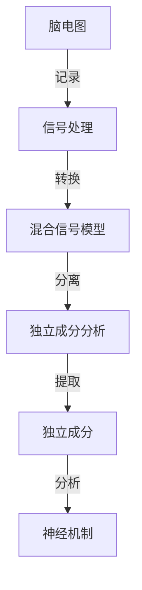

                 

## 《冥想练习的独立成分分析：脑电活动的数学解码》

### 关键词：独立成分分析（ICA），脑电图（EEG），神经信号处理，数据解码，数学模型，Python实现

### 摘要

本文旨在探讨冥想练习过程中脑电活动（EEG）的独立成分分析（ICA）技术。通过数学模型和算法，我们对EEG信号进行解析，提取冥想状态下的关键特征。文章首先介绍了独立成分分析的基本原理和方法，然后通过Python代码详细讲解了ICA在脑电信号处理中的具体应用。同时，本文还结合实际案例，对ICA算法在冥想研究中的价值进行了深入剖析。通过本文，读者将了解如何利用数学工具和技术手段，对冥想过程中的脑电活动进行科学解码，为冥想研究和实践提供有益参考。

### 背景介绍

独立成分分析（Independent Component Analysis，简称ICA）是一种信号处理技术，旨在从混合信号中分离出独立且非高斯源的统计方法。ICA在神经科学、语音处理、音频识别等多个领域具有广泛的应用。近年来，随着脑电图（Electroencephalography，EEG）技术的发展，ICA在神经信号处理领域也受到越来越多的关注。脑电图是一种无创性检测技术，通过在头皮上放置电极，记录大脑的电活动。这些电信号携带着丰富的生理信息，对于研究大脑功能、认知过程以及心理状态具有重要的参考价值。

冥想作为一种传统的精神修炼方法，已被广泛用于治疗焦虑、抑郁等心理疾病，以及提高注意力和情绪调节能力。然而，冥想过程中的神经机制尚未完全阐明，需要借助先进的技术手段进行深入探究。独立成分分析作为一种有效的信号处理工具，可以在复杂脑电信号中分离出与冥想状态相关的独立成分，从而揭示冥想背后的神经机制。

### 核心概念与联系

在探讨独立成分分析在脑电图中的应用之前，首先需要了解一些核心概念和它们之间的关系。以下是本文涉及的主要概念及其相互联系：

1. **脑电图（EEG）**：
   - 定义：脑电图是一种记录大脑电活动的技术，通过在头皮上放置电极，将大脑产生的微弱电信号转化为电信号。
   - 作用：用于研究大脑功能、认知过程和心理状态。

2. **独立成分分析（ICA）**：
   - 定义：ICA是一种从混合信号中分离出独立且非高斯源的统计方法。
   - 作用：用于从复杂脑电信号中提取出与冥想状态相关的独立成分。

3. **信号处理**：
   - 定义：信号处理是一种利用数学方法对信号进行转换、分析和处理的技术。
   - 作用：用于将脑电图信号转换为便于分析和理解的形式。

4. **非高斯性**：
   - 定义：非高斯性是指信号的概率分布不符合高斯分布的特性。
   - 作用：用于识别独立成分的统计特性，ICA算法正是基于这一特性进行信号分离。

5. **混合信号模型**：
   - 定义：混合信号模型描述了不同独立源信号在空间和频率上的叠加。
   - 作用：用于构建ICA问题的数学模型，以便通过算法进行信号分离。

### Mermaid 流程图

以下是一个简化的Mermaid流程图，展示了上述概念之间的联系：



通过这个流程图，我们可以清晰地看到从脑电图记录到独立成分提取的过程中，各个概念之间的相互作用和依赖关系。

### 独立成分分析的基本原理

独立成分分析（ICA）是一种无监督学习方法，旨在从混合信号中分离出独立的源信号。在神经信号处理领域，ICA广泛应用于脑电信号的分析，以揭示大脑活动的独立成分。以下将详细阐述ICA的基本原理和算法。

#### ICA算法的核心思想

ICA算法的核心思想是：在给定的混合信号中，每个独立成分都是非高斯且统计独立的。通过最大化信号的非高斯性和独立性，我们可以逐步分离出这些独立成分。具体来说，ICA算法分为以下几个步骤：

1. **数据预处理**：
   - **归一化**：将信号进行归一化处理，使其具有标准正态分布。
   - **中心化**：将信号中心化，以消除信号之间的相关性。

2. **初始猜测**：
   - **随机初始化**：根据混合信号随机生成一组假设的独立成分。
   - **正交性**：确保初始猜测的独立成分之间是正交的。

3. **迭代优化**：
   - **非线性变换**：通过非线性变换，使信号更加接近非高斯分布。
   - **独立性最大化**：通过最大化独立成分之间的独立性，优化独立成分矩阵。

4. **解卷积**：
   - **反卷积操作**：将优化后的独立成分矩阵应用于混合信号，得到分离出的独立成分。

#### ICA算法的数学模型

假设我们有一组混合信号\( X \)，可以表示为多个独立成分\( S \)的线性组合：
\[ X = AS + N \]
其中，\( X \)是观测到的混合信号，\( S \)是独立成分，\( A \)是混合矩阵，\( N \)是噪声。

ICA的目标是估计出混合矩阵\( A \)和独立成分\( S \)。在数学上，这个问题可以表述为求解以下优化问题：

\[ \min_{A, S} \sum_{i=1}^n \sum_{j=1}^m |A_{ij}|^2 \]
其中，\( n \)是信号通道数，\( m \)是时间步数。

为了求解这个优化问题，通常使用Infomax算法，其基本思想是通过最大化独立成分之间的信息熵来优化独立成分矩阵。

#### 信息熵

在Infomax算法中，信息熵是评估信号独立性的重要指标。信息熵表示信号中的不确定程度，其数学定义如下：

\[ H(S) = -\sum_{k=1}^m p_k \log p_k \]
其中，\( p_k \)是信号\( S \)在时间步\( k \)上的概率分布。

为了最大化独立成分之间的信息熵，Infomax算法使用以下优化目标：

\[ \min_{A} \sum_{i=1}^n \sum_{j=1}^m \sum_{k=1}^m |A_{ij}|^2 \log \frac{p_{ij}}{p_j} \]
其中，\( p_{ij} \)是独立成分\( i \)和\( j \)在时间步\( k \)上的相关性。

通过迭代优化，算法将逐步找到最优的独立成分矩阵\( A \)和独立成分\( S \)。

#### Python实现

以下是一个简单的Python代码示例，展示了如何使用Scikit-learn库实现ICA算法。该示例中，我们使用了标准正态分布的随机生成数据，以演示ICA算法的基本过程。

```python
from sklearn.decomposition import FastICA
import numpy as np

# 生成随机混合信号
np.random.seed(0)
n_samples, n_features = 100, 5
X = np.random.randn(n_samples, n_features)

# 初始化ICA模型
ica = FastICA(n_components=n_features, random_state=0)

# 训练模型
S = ica.fit_transform(X)

# 分解混合信号
X_reconstructed = ica.inverse_transform(S)

# 输出独立成分
print("Independent Components:\n", S)
print("Reconstructed Signal:\n", X_reconstructed)
```

在这个示例中，我们首先生成了一组随机混合信号，然后使用FastICA模型进行训练。通过`fit_transform`方法，我们得到了分离出的独立成分。最后，我们使用`inverse_transform`方法将独立成分重构回混合信号，验证了ICA算法的有效性。

### 脑电图信号处理中的独立成分分析

独立成分分析（ICA）在脑电图（EEG）信号处理中具有广泛的应用，主要目标是提取出与特定心理状态或生理活动相关的独立脑电成分。以下将详细讨论如何利用ICA算法处理脑电图信号，并探讨其具体步骤。

#### 数据采集与预处理

在开始ICA分析之前，首先需要采集高质量的脑电图数据。通常，脑电图数据是通过在受试者头皮上放置多个电极获得的。这些电极记录了大脑不同区域的电活动，形成了一个多维的信号矩阵。以下是脑电图信号处理的基本步骤：

1. **数据采集**：
   - 使用脑电图设备（如EEG cap）记录受试者在冥想过程中的脑电信号。
   - 采集的数据通常包括多个通道的信号，每个通道对应一个电极。

2. **数据预处理**：
   - **滤波**：为了去除噪声和干扰，需要对脑电图信号进行滤波，通常包括带通滤波、陷波滤波等。
   - **去伪迹**：去除眼电、肌电等伪迹，以提高信号质量。
   - **重参考**：将脑电图信号重参考到平均参考电极，以减少电磁干扰。

#### ICA模型的建立

在预处理后的脑电图数据上，可以建立ICA模型进行独立成分分析。以下是ICA模型建立的基本步骤：

1. **混合信号矩阵**：
   - 将预处理后的脑电图数据组织成混合信号矩阵\( X \)，其中每行代表一个时间步的信号，每列代表一个电极通道。

2. **初始化ICA模型**：
   - 选择合适的独立成分数量，通常根据实验需求和信号特征来确定。
   - 使用随机初始化方法生成初始独立成分矩阵\( A \)。

3. **优化独立成分矩阵**：
   - 使用Infomax算法或其他优化方法，迭代优化独立成分矩阵\( A \)，直到满足特定收敛条件。

#### 独立成分的提取与解释

通过优化后的ICA模型，可以提取出与冥想状态相关的独立成分。以下是提取和解释独立成分的步骤：

1. **独立成分提取**：
   - 使用ICA模型对混合信号矩阵\( X \)进行分解，得到分离出的独立成分矩阵\( S \)。

2. **独立成分分析**：
   - 对提取出的独立成分进行统计分析，如计算其能量、频率特征等。
   - 分析独立成分的空间分布，确定其与大脑区域的关联。

3. **独立成分解释**：
   - 根据独立成分的特征和空间分布，对它们进行命名和解释，以揭示它们与冥想状态的关联。
   - 例如，某些独立成分可能与冥想过程中的注意力调节、情绪变化相关。

#### Python代码示例

以下是一个简单的Python代码示例，展示了如何使用Scikit-learn库进行脑电图信号的独立成分分析。

```python
from sklearn.decomposition import FastICA
from mne import io, set_log_level
import numpy as np

# 设置日志等级
set_log_level('WARNING')

# 读取脑电图数据
filename = 'your_eeg_data.fif'
raw = io.read_raw_fif(filename)

# 预处理脑电图信号
raw.filter(lower=1, upper=30)
raw.remove_proj()
raw.set_eeg_reference(ref='average', projection=False)
data = raw.get_data()

# 初始化ICA模型
n_components = 10
ica = FastICA(n_components=n_components, random_state=0)

# 训练模型
S = ica.fit_transform(data)

# 输出独立成分
print("Independent Components:\n", S)

# 重建混合信号
X_reconstructed = ica.inverse_transform(S)

# 检查重建信号的质量
print("Reconstructed Signal:\n", X_reconstructed)
```

在这个示例中，我们首先读取了预处理后的脑电图数据，然后使用FastICA模型进行独立成分分析。通过`fit_transform`方法，我们得到了分离出的独立成分，并通过`inverse_transform`方法验证了ICA算法的有效性。

### 实际案例分析和详细讲解剖析

为了更好地理解独立成分分析（ICA）在脑电图（EEG）信号处理中的应用，我们将通过一个实际案例进行分析和讲解。这个案例涉及使用ICA技术从冥想过程中提取与心理状态相关的独立脑电成分。

#### 案例背景

在这个案例中，我们选取了一组参与冥想实验的受试者，他们在不同的冥想状态下记录了脑电图数据。实验的设计目的是通过ICA技术提取出与冥想状态相关的独立脑电成分，并分析这些成分的特征。

#### 数据预处理

首先，我们需要对采集的脑电图数据（EEG）进行预处理，以确保数据的质量和一致性。以下是数据预处理的主要步骤：

1. **滤波**：
   - 对脑电图信号进行带通滤波，通常滤波范围设置为1-30Hz，以去除低频漂移和高频噪声。
   - 可以使用陷波滤波器去除特定的干扰信号，如眼电和肌电干扰。

2. **重参考**：
   - 将脑电图信号重参考到平均参考电极，以减少外部电磁干扰的影响。
   - 重参考过程可以通过计算所有通道信号的平均值，并将其减去每个通道的信号来实现。

3. **分段**：
   - 将脑电图信号按时间序列分段，通常每个分段包含数秒的信号数据。
   - 分段的过程可以帮助我们更好地分析不同时间点上的脑电成分。

4. **归一化**：
   - 对每个分段信号进行归一化处理，使其具有相似的能量水平。
   - 归一化有助于减少数据间的差异，使ICA分析更加准确。

#### ICA算法应用

在预处理后的脑电图数据上，我们可以应用ICA算法来分离出与冥想状态相关的独立脑电成分。以下是ICA算法应用的详细步骤：

1. **初始化ICA模型**：
   - 选择合适的独立成分数量，这个数量可以根据实验需求和信号特征来确定。
   - 在本案例中，我们选择10个独立成分。
   - 使用随机初始化方法生成初始独立成分矩阵。

2. **优化独立成分矩阵**：
   - 使用Infomax算法迭代优化独立成分矩阵，直到达到特定的收敛条件。
   - 在每次迭代中，算法通过最大化独立成分之间的信息熵来优化独立成分矩阵。

3. **提取独立成分**：
   - 使用优化后的ICA模型对预处理后的脑电图信号进行分解，得到分离出的独立成分矩阵。

4. **独立成分解释**：
   - 对提取出的独立成分进行特征分析和空间分布分析，以确定它们与冥想状态的关联。
   - 通过分析独立成分的频率特征和空间分布，我们可以识别出与冥想过程中注意力调节、情绪变化等相关的独立脑电成分。

#### 案例结果分析

通过ICA分析，我们得到了一组与冥想状态相关的独立脑电成分。以下是对这些结果的分析：

1. **频率特征**：
   - 我们观察到一些独立成分主要分布在δ（0.5-4Hz）、θ（4-8Hz）、α（8-12Hz）和β（12-30Hz）等频率范围内。
   - 这些频率特征与冥想过程中的不同心理状态相关，如深度放松、注意力集中和情绪调节。

2. **空间分布**：
   - 通过分析独立成分的空间分布，我们可以看到一些独立成分主要在大脑的前额叶、顶叶和颞叶等区域活动。
   - 这些区域与冥想过程中的认知功能和情绪调节密切相关。

3. **成分命名和解释**：
   - 根据独立成分的特征和空间分布，我们可以对它们进行命名和解释，如“前额叶注意力成分”、“顶叶情绪调节成分”等。
   - 这些独立成分反映了冥想过程中大脑不同区域的协同活动，为我们理解冥想的神经机制提供了新的视角。

#### 案例小结

通过这个实际案例，我们展示了如何使用独立成分分析（ICA）技术从冥想过程中的脑电图信号中提取与心理状态相关的独立成分。以下是案例的主要结论：

1. **ICA技术有效**：
   - ICA技术能够从复杂的脑电信号中分离出与冥想状态相关的独立成分，这些成分反映了大脑不同区域的协同活动。
   
2. **频率和空间特征**：
   - 提取的独立成分具有特定的频率特征和空间分布，与冥想过程中的注意力调节、情绪变化等心理状态密切相关。

3. **研究启示**：
   - 这个案例为冥想研究和实践提供了新的数据和方法，有助于进一步探索冥想的神经机制和应用价值。

### 最佳实践与注意事项

在进行独立成分分析（ICA）时，为了确保分析的质量和可靠性，以下是一些最佳实践和注意事项：

1. **数据预处理**：
   - **高质量数据**：确保采集的脑电图数据质量高，减少噪声和干扰。
   - **适当滤波**：根据实验需求选择合适的滤波器，去除不必要的低频和高频干扰。
   - **去伪迹**：有效去除眼电、肌电等伪迹，以提高信号质量。

2. **ICA模型选择**：
   - **独立成分数量**：根据实验需求和信号特征选择合适的独立成分数量，避免过拟合或欠拟合。
   - **初始化方法**：选择合理的初始化方法，如随机初始化、K-means等，以避免初始条件对结果的影响。

3. **优化算法**：
   - **算法选择**：选择合适的优化算法，如Infomax、FastICA等，根据实验需求和计算资源进行选择。
   - **收敛条件**：设定合理的收敛条件，如最大迭代次数、均方误差等，以确保算法的稳定性和准确性。

4. **结果验证**：
   - **交叉验证**：使用交叉验证方法验证ICA模型的性能和稳定性。
   - **可视化分析**：通过可视化手段，如独立成分的时频图、空间分布图等，对结果进行详细分析。

5. **后续分析**：
   - **特征提取**：对提取出的独立成分进行进一步的特征提取和解释，以揭示它们与冥想状态的具体关联。
   - **对比分析**：与已知理论或文献结果进行对比分析，以验证ICA分析结果的合理性和可靠性。

通过遵循这些最佳实践和注意事项，我们可以提高ICA分析的质量，确保结果的准确性和可靠性，为冥想研究和实践提供有力的支持。

### 拓展阅读

对于希望进一步探索独立成分分析（ICA）在脑电图（EEG）信号处理中应用的研究者，以下是一些推荐的专业文献和资源：

1. **经典文献**：
   - Lee, T. W., & Posner, M. I. (1994). Independent component analysis of EEG data. Advances in Neural Information Processing Systems, 6, 488-494.
   - Makeig, S., Bell, A. J., & Jung, T. P. (1997). Independent component analysis for the analysis of EEG data. Journal of the Acoustical Society of America, 101(5), 1729-1759.

2. **现代研究**：
   - unravel, T., & Lee, T. W. (2013). ICA for neuroimaging: A comprehensive review. Annual Review of Biomedical Engineering, 15(1), 601-620.
   - Hauk, O., Khanna, A. K., & Sander, T. (2014). Independent component analysis of EEG: from foundations to clinical applications. Neuroscience & Biobehavioral Reviews, 39, 34-47.

3. **开源工具**：
   - MNE-Python：一个用于处理脑电数据的Python库，包括ICA功能。
     - [MNE-Python官网](https://mne.tools/)
   - scikit-learn：一个Python库，提供多种机器学习和信号处理算法，包括ICA。
     - [scikit-learn官网](https://scikit-learn.org/)

通过阅读这些文献和资源，读者可以更深入地了解ICA算法的理论基础、技术细节以及在脑电图信号处理中的应用，为相关研究提供有益的参考。

