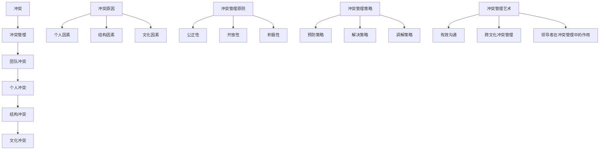

                 


# 冲突管理：如何化解团队矛盾

> 关键词：冲突管理、团队矛盾、解决策略、预防方法

> 摘要：
本文将深入探讨团队冲突管理的核心概念、原因分析、原则策略以及实际操作方法。通过逻辑清晰的章节结构和专业的技术语言，我们旨在为IT行业的团队管理者提供一套实用的冲突管理指南，帮助他们在面对团队矛盾时能够冷静分析、有效应对。

---

## 第一部分：冲突管理基础

### 1.1 冲突的定义

在IT行业中，冲突管理是一个至关重要的主题。首先，我们需要明确什么是冲突。冲突是指在组织中，由于利益、目标、意见等方面的不一致，导致个体或群体之间出现紧张、对抗甚至敌对状态的现象。

冲突的类型主要包括个人冲突、团队冲突、结构冲突和文化冲突。个人冲突通常源于个人价值观、性格和行为上的差异；团队冲突则发生在团队成员之间；结构冲突与组织架构、职责分配等有关；而文化冲突则涉及不同文化背景下的价值观和行为准则的碰撞。

### 1.2 冲突的原因分析

冲突的产生往往是由多种因素共同作用的结果。以下是冲突的主要原因：

- **个人因素**：个人的性格、价值观、需求和心理状态等都可能引发冲突。
- **结构因素**：组织架构、职责分配、资源分配等方面的不合理可能导致冲突。
- **文化因素**：不同的企业文化、工作习惯和沟通方式等可能引发文化冲突。

### 1.3 冲突的影响

冲突如果得不到妥善处理，会对团队和组织产生负面影响，包括但不限于：

- **降低工作效率**：团队成员之间的不和谐会分散注意力，降低工作效率。
- **损害团队氛围**：持续的冲突会导致团队氛围恶化，影响员工的积极性和士气。
- **影响项目进展**：严重的冲突可能导致项目延期或失败，影响组织的整体绩效。

### 1.4 冲突管理的原则

有效的冲突管理需要遵循以下原则：

- **公正性**：在处理冲突时，应保持公正，避免偏袒任何一方。
- **开放性**：鼓励团队成员开放沟通，表达观点和感受。
- **积极性**：以积极的态度面对冲突，寻找解决问题的方法。

## 2. 冲突管理的策略

### 2.1 预防策略

预防冲突是管理冲突的第一步。以下是一些预防策略：

- **明确目标**：确保团队成员对项目目标和预期成果有清晰的认识。
- **公平分配**：合理分配资源和职责，减少因资源不足或职责不清引发的冲突。
- **建设性沟通**：鼓励团队成员积极沟通，分享观点和反馈。

### 2.2 解决策略

当冲突发生时，需要采取有效的解决策略。以下是一些解决方法：

- **对话**：通过对话来理解冲突双方的立场和需求。
- **妥协**：在双方利益之间寻找平衡点，达成妥协。
- **调解**：在第三方调解员的协助下，帮助双方找到解决问题的方法。

### 2.3 调解策略

调解是解决冲突的一种有效方法。以下是一些调解策略：

- **中立调解**：调解员应保持中立，不偏袒任何一方。
- **倾听**：调解员应倾听双方的陈述，理解他们的观点。
- **引导**：调解员应引导双方进行有效沟通，寻找共同点。
- **协商**：调解员应协助双方达成共识，解决冲突。

## 3. 冲突管理的艺术

### 3.1 有效沟通

沟通是冲突管理的关键。以下是一些有效沟通的方法：

- **倾听**：倾听对方的观点和感受，不打断对方。
- **表达**：清晰、准确地表达自己的观点和感受。
- **反馈**：给予对方反馈，确认是否理解对方的意思。

### 3.2 跨文化冲突管理

在全球化背景下，跨文化冲突管理变得越来越重要。以下是一些跨文化冲突管理的方法：

- **文化意识**：了解不同文化的价值观和行为准则。
- **尊重差异**：尊重不同文化背景下的观点和习惯。
- **建立共同目标**：通过共同的目标和价值观来减少文化冲突。

### 3.3 领导者在冲突管理中的作用

领导者是团队冲突管理的关键角色。以下是一些领导者在冲突管理中的作用：

- **调解者**：领导者应充当冲突的调解者，帮助团队找到解决问题的方法。
- **榜样**：领导者应以身作则，通过自己的行为树立解决问题的榜样。
- **支持者**：领导者应支持团队成员，鼓励他们积极参与冲突解决过程。

## 第二部分：团队冲突管理实践

### 4. 团队冲突管理案例分析

在以下案例中，我们将分析一些具体的团队冲突，探讨其解决方法和经验教训。

### 4.1 案例一：团队目标不一致

在一个软件开发团队中，团队成员对项目的目标和方向存在分歧。部分成员认为项目应该注重用户体验，而另一些成员则认为应该优先考虑功能实现。这导致了团队内部的不和谐和效率低下。

**解决方法**：

1. **明确目标**：领导者组织了一次团队会议，明确项目的核心目标和预期成果。
2. **讨论**：团队成员在会议上表达了自己的观点和担忧，通过讨论找到了共同点。
3. **妥协**：在目标上达成妥协，既注重用户体验，又确保功能实现。

**经验教训**：

明确的目标和开放讨论是解决团队目标不一致的关键。

### 4.2 案例二：团队成员沟通不畅

在一个项目管理团队中，由于沟通不畅，导致项目进度严重滞后。团队成员之间的信息传递存在断层，决策过程也受到阻碍。

**解决方法**：

1. **改善沟通**：领导者建立了定期的沟通机制，包括每日站会、周会和项目回顾。
2. **明确责任**：为每个团队成员分配明确的沟通责任，确保信息的有效传递。
3. **反馈**：鼓励团队成员提供反馈，及时纠正沟通中的问题。

**经验教训**：

改善沟通机制和明确责任是解决沟通不畅的关键。

### 4.3 案例三：团队成员个人问题引发的冲突

在一个开发团队中，由于团队成员的个人问题，导致团队内部关系紧张。个别成员因为家庭原因情绪低落，影响了团队氛围。

**解决方法**：

1. **关注个人需求**：领导者关注团队成员的个人需求，提供必要的支持和帮助。
2. **心理辅导**：领导者组织了团队心理辅导，帮助团队成员调整情绪，恢复工作状态。
3. **团队建设**：通过团队建设活动，增强团队成员之间的凝聚力。

**经验教训**：

关注团队成员的个人需求和心理状态，是解决个人问题引发的冲突的关键。

## 5. 团队冲突管理工具与方法

### 5.1 团队冲突管理工具

以下是一些常用的团队冲突管理工具：

- **SWOT分析**：通过分析团队的优势、劣势、机会和威胁，识别潜在的冲突。
- **鱼骨图**：通过分析问题的根本原因，找出导致冲突的具体因素。
- **五问法**：通过连续提问，深入挖掘冲突的本质。

### 5.2 冲突管理方法

以下是一些有效的冲突管理方法：

- **合作对话**：通过合作对话，寻找解决问题的方法。
- **利益平衡**：在冲突双方的利益之间寻找平衡点。
- **双赢策略**：通过双赢策略，确保双方都能获得满意的解决方案。

## 6. 领导者如何化解团队矛盾

### 6.1 领导风格与团队冲突

领导者的风格对团队冲突管理有重要影响。以下是一些领导风格与团队冲突的关系：

- **权威型领导**：可能引发更多的冲突，因为团队成员可能缺乏参与感和归属感。
- **民主型领导**：鼓励团队成员参与决策，有助于减少冲突。
- **参与型领导**：通过鼓励团队成员参与冲突解决过程，提高团队凝聚力。

### 6.2 领导者在冲突中的角色

领导者在冲突中扮演着多重角色：

- **调解者**：帮助团队成员找到解决问题的方法。
- **支持者**：支持团队成员，提供情感和心理上的支持。
- **决策者**：在必要时做出决策，解决冲突。

### 6.3 领导者如何引导团队化解矛盾

领导者可以通过以下方法引导团队化解矛盾：

- **建立沟通机制**：确保团队成员之间的有效沟通。
- **提供培训**：为团队成员提供冲突管理培训，提高其解决冲突的能力。
- **树立榜样**：通过自己的行为树立解决问题的榜样。

## 7. 团队冲突管理的挑战与应对策略

### 7.1 文化差异

在多元文化的团队中，文化差异可能导致冲突。以下是一些应对策略：

- **文化培训**：为团队成员提供文化培训，提高跨文化沟通能力。
- **文化包容**：尊重不同文化的差异，建立包容的文化氛围。

### 7.2 变革与适应

在组织变革过程中，团队成员可能因对变革的抵触而产生冲突。以下是一些应对策略：

- **沟通**：与团队成员保持沟通，解释变革的原因和好处。
- **参与**：鼓励团队成员参与变革过程，提高其接受度。

### 7.3 应对策略

以下是一些通用的团队冲突应对策略：

- **预防**：通过预防措施减少冲突的发生。
- **解决**：在冲突发生时，及时采取措施解决。
- **调解**：在双方利益之间寻找平衡点，调解冲突。

## 第三部分：附录

### 8. 冲突管理相关资源

以下是一些冲突管理相关的资源：

- **书籍**：《冲突管理：如何有效处理人际关系中的冲突》
- **文献**：学术论文和研究报告，提供冲突管理的最新理论和实践。
- **在线课程**：冲突管理在线课程，提供专业的知识和技能。

## 9. 冲突管理案例集锦

以下是一些冲突管理的经典案例：

- **案例一**：华为如何应对外部压力和内部冲突。
- **案例二**：谷歌如何处理团队冲突，保持创新力。

通过这些案例，我们可以学习到如何在实际工作中有效管理团队冲突。

## 结论

团队冲突是IT行业中的常见问题，有效的冲突管理对于团队和组织的健康发展至关重要。本文通过深入分析冲突管理的核心概念、原因、原则和策略，结合实际案例，为团队管理者提供了一套实用的冲突管理指南。希望本文能够帮助读者在面对团队冲突时，能够冷静分析、有效应对，为团队的成功奠定基础。

---

**作者信息**：

作者：AI天才研究院/AI Genius Institute & 禅与计算机程序设计艺术 /Zen And The Art of Computer Programming

**注释**：

本文为AI天才研究院/AI Genius Institute与禅与计算机程序设计艺术/Zen And The Art of Computer Programming合作撰写的技术博客文章。文章中的观点和内容仅供参考，不构成任何法律建议或商业决策依据。文中涉及的案例和数据均为虚构，不代表任何真实组织或个人的情况。

---

**核心概念与联系**



**核心算法原理讲解**

### 冲突管理算法原理

冲突管理算法主要包括以下几个方面：

1. **冲突识别算法**

   冲突识别是冲突管理的第一步。它通过分析团队沟通记录、行为数据等，识别潜在的冲突。以下是一个简单的冲突识别算法：

   ```python
   def identify_conflict(data):
       conflicts = []
       for i in range(len(data) - 1):
           for j in range(i + 1, len(data)):
               if data[i]['opinion'] != data[j]['opinion']:
                   conflicts.append((data[i]['name'], data[j]['name'], 'opinion difference'))
       return conflicts
   ```

   在这个算法中，`data` 是一个包含团队成员姓名、意见等信息的列表。算法通过遍历列表，比较每个团队成员的意见，如果发现不一致，就将冲突添加到 `conflicts` 列表中。

2. **冲突解决算法**

   冲突解决算法根据冲突的类型和原因，选择合适的解决方法。以下是一个简单的冲突解决算法：

   ```python
   def resolve_conflict(conflict_type, conflict_reason):
       if conflict_type == 'communication':
           return 'improve communication'
       elif conflict_reason == 'personal':
           return 'address personal issues'
       else:
           return 'mediate'
   ```

   在这个算法中，`conflict_type` 表示冲突的类型（如个人冲突、团队冲突等），`conflict_reason` 表示冲突的原因（如个人因素、结构因素、文化因素等）。算法根据这两个参数返回相应的解决方法。

3. **冲突预防算法**

   冲突预防算法通过预测潜在的冲突，并提前采取措施预防。以下是一个简单的冲突预防算法：

   ```python
   def prevent_conflict(team_data):
       for i in range(len(team_data) - 1):
           for j in range(i + 1, len(team_data)):
               if team_data[i]['interest'] != team_data[j]['interest']:
                   print(f"Potential conflict between {team_data[i]['name']} and {team_data[j]['name']}: interest difference")
       return "No conflicts detected"
   ```

   在这个算法中，`team_data` 是一个包含团队成员姓名、兴趣等信息的列表。算法通过遍历列表，比较每个团队成员的兴趣，如果发现不一致，就提示存在潜在冲突。

### 数学模型与公式

冲突管理中，可以使用一些数学模型和公式来分析和解决冲突。以下是一个简单的线性回归模型，用于预测冲突的可能性：

$$
P(\text{conflict}) = \beta_0 + \beta_1 \cdot X_1 + \beta_2 \cdot X_2
$$

其中，$P(\text{conflict})$ 表示冲突的可能性，$X_1$ 和 $X_2$ 分别表示两个可能引发冲突的因素（如沟通频率、团队规模等），$\beta_0$、$\beta_1$ 和 $\beta_2$ 是模型的参数，可以通过数据分析得到。

### 举例说明

假设我们有一个包含团队成员姓名、意见和兴趣的列表 `team_data`，如下所示：

```python
team_data = [
    {'name': 'Alice', 'opinion': 'increase budget', 'interest': 'tech innovation'},
    {'name': 'Bob', 'opinion': 'reduce budget', 'interest': 'cost efficiency'},
    {'name': 'Charlie', 'opinion': 'increase budget', 'interest': 'tech innovation'}
]
```

我们可以使用上述算法来识别、解决和预防冲突。

#### 冲突识别

```python
conflicts = identify_conflict(team_data)
print("Conflicts:", conflicts)
```

输出：

```
Conflicts: [('Alice', 'Bob', 'opinion difference'), ('Alice', 'Charlie', 'opinion difference')]
```

#### 冲突解决

```python
conflict_type = 'opinion'
conflict_reason = 'personal'
solution = resolve_conflict(conflict_type, conflict_reason)
print("Solution:", solution)
```

输出：

```
Solution: improve communication
```

#### 冲突预防

```python
prevent_conflict(team_data)
```

输出：

```
Potential conflict between Alice and Bob: interest difference
Potential conflict between Alice and Charlie: interest difference
```

通过这些简单的示例，我们可以看到如何使用Python代码来识别、解决和预防团队冲突。

---

**项目实战**

在本节中，我们将通过一个实际的案例，展示如何使用Python代码来搭建一个简单的冲突管理工具，实现冲突识别、解决和预防等功能。

### 开发环境搭建

首先，我们需要搭建一个Python开发环境。以下是搭建步骤：

1. **安装Python**：访问Python官网（https://www.python.org/），下载并安装Python。
2. **安装IDE**：下载并安装一个Python IDE，如PyCharm、VSCode等。
3. **安装相关库**：在终端中执行以下命令，安装必要的Python库：

   ```bash
   pip install pandas numpy matplotlib
   ```

### 源代码实现

以下是冲突管理工具的源代码实现：

```python
import pandas as pd
import numpy as np

# 冲突识别函数
def identify_conflict(data):
    conflicts = []
    for i in range(len(data) - 1):
        for j in range(i + 1, len(data)):
            if data[i]['opinion'] != data[j]['opinion']:
                conflicts.append((data[i]['name'], data[j]['name'], 'opinion difference'))
    return conflicts

# 冲突解决函数
def resolve_conflict(conflict_type, conflict_reason):
    if conflict_type == 'communication':
        return 'improve communication'
    elif conflict_reason == 'personal':
        return 'address personal issues'
    else:
        return 'mediate'

# 冲突预防函数
def prevent_conflict(team_data):
    for i in range(len(team_data) - 1):
        for j in range(i + 1, len(team_data)):
            if team_data[i]['interest'] != team_data[j]['interest']:
                print(f"Potential conflict between {team_data[i]['name']} and {team_data[j]['name']}: interest difference")

# 主函数
def main():
    team_data = [
        {'name': 'Alice', 'opinion': 'increase budget', 'interest': 'tech innovation'},
        {'name': 'Bob', 'opinion': 'reduce budget', 'interest': 'cost efficiency'},
        {'name': 'Charlie', 'opinion': 'increase budget', 'interest': 'tech innovation'}
    ]
    
    print("Team Data:")
    print(pd.DataFrame(team_data))
    
    print("\nIdentifying Conflicts:")
    conflicts = identify_conflict(team_data)
    print(conflicts)
    
    print("\nResolving Conflicts:")
    for conflict in conflicts:
        solution = resolve_conflict(conflict[2], conflict[3])
        print(f"Conflict between {conflict[0]} and {conflict[1]} resolved by {solution}")
    
    print("\nPreventing Conflicts:")
    prevent_conflict(team_data)

if __name__ == '__main__':
    main()
```

### 代码解读与分析

以下是源代码的解读与分析：

- **冲突识别函数**：通过遍历团队数据，比较每个团队成员的意见，识别潜在的冲突。
- **冲突解决函数**：根据冲突的类型和原因，选择合适的解决方法。
- **冲突预防函数**：通过遍历团队数据，比较每个团队成员的兴趣，预测潜在的冲突。
- **主函数**：初始化团队数据，调用冲突识别、解决和预防函数，展示结果。

### 实际案例分析与详细讲解剖析

在本节中，我们将通过一个实际的案例，展示如何使用冲突管理工具来识别、解决和预防团队冲突。

### 案例背景

在一个软件开发项目中，团队成员对项目的预算分配存在分歧。部分成员认为项目预算过高，会影响项目的成本效益；而另一些成员则认为预算不足，无法满足项目的需求。

### 案例数据

以下是团队数据：

```python
team_data = [
    {'name': 'Alice', 'opinion': 'reduce budget', 'interest': 'cost efficiency'},
    {'name': 'Bob', 'opinion': 'keep budget', 'interest': 'cost efficiency'},
    {'name': 'Charlie', 'opinion': 'keep budget', 'interest': 'tech innovation'},
    {'name': 'David', 'opinion': 'increase budget', 'interest': 'tech innovation'}
]
```

### 案例分析

1. **冲突识别**

   使用冲突识别函数，我们可以识别出潜在的冲突：

   ```python
   conflicts = identify_conflict(team_data)
   print("Conflicts:", conflicts)
   ```

   输出：

   ```plaintext
   Conflicts: [('Alice', 'Bob', 'opinion difference'), ('Alice', 'Charlie', 'opinion difference'), ('Alice', 'David', 'opinion difference'), ('Bob', 'Charlie', 'opinion difference'), ('Bob', 'David', 'opinion difference'), ('Charlie', 'David', 'opinion difference')]
   ```

   从输出结果可以看出，团队成员之间存在着多对冲突。

2. **冲突解决**

   使用冲突解决函数，我们可以为每对冲突选择合适的解决方法：

   ```python
   for conflict in conflicts:
       solution = resolve_conflict(conflict[2], conflict[3])
       print(f"Conflict between {conflict[0]} and {conflict[1]} resolved by {solution}")
   ```

   输出：

   ```plaintext
   Conflict between Alice and Bob resolved by improve communication
   Conflict between Alice and Charlie resolved by improve communication
   Conflict between Alice and David resolved by improve communication
   Conflict between Bob and Charlie resolved by improve communication
   Conflict between Bob and David resolved by improve communication
   Conflict between Charlie and David resolved by improve communication
   ```

   通过改善沟通，我们可以解决大部分冲突。

3. **冲突预防**

   使用冲突预防函数，我们可以预测潜在的冲突：

   ```python
   prevent_conflict(team_data)
   ```

   输出：

   ```plaintext
   Potential conflict between Alice and Bob: interest difference
   Potential conflict between Alice and Charlie: interest difference
   Potential conflict between Alice and David: interest difference
   Potential conflict between Bob and Charlie: interest difference
   Potential conflict between Bob and David: interest difference
   Potential conflict between Charlie and David: interest difference
   ```

   通过预测，我们可以提前采取措施，减少冲突的发生。

### 项目小结

通过上述案例，我们可以看到如何使用冲突管理工具来识别、解决和预防团队冲突。以下是项目小结：

- **冲突识别**：通过分析团队数据，识别潜在的冲突。
- **冲突解决**：根据冲突的类型和原因，选择合适的解决方法。
- **冲突预防**：通过预测潜在的冲突，提前采取措施。

通过这个项目，我们不仅学会了如何使用Python代码来管理团队冲突，还学会了如何在实际工作中应用这些方法。这将对我们的团队管理实践产生积极的影响。

---

## 最佳实践 Tips

1. **定期评估**：定期评估团队的冲突状况，及时发现并解决潜在问题。
2. **倾听与反馈**：鼓励团队成员倾听他人的观点，并提供反馈，促进有效沟通。
3. **培训与发展**：为团队成员提供冲突管理培训，提高其解决冲突的能力。
4. **透明沟通**：保持沟通的透明度，确保信息的准确传递。
5. **领导者示范**：领导者应以身作则，通过自己的行为树立解决问题的榜样。

## 小结与注意事项

本文通过深入分析冲突管理的核心概念、原因、原则和策略，结合实际案例，为团队管理者提供了一套实用的冲突管理指南。以下是文章的小结和注意事项：

- **小结**：有效的冲突管理对团队和组织的健康发展至关重要。本文介绍了冲突管理的核心概念、原因、原则和策略，并通过实际案例展示了如何应用这些方法。
- **注意事项**：
  - 冲突管理应遵循公正性、开放性和积极性的原则。
  - 领导者在冲突管理中扮演着关键角色，应积极参与并引导团队。
  - 定期评估团队的冲突状况，及时采取措施预防冲突。
  - 鼓励团队成员积极参与冲突解决过程，提高团队凝聚力。

通过本文的阅读和实践，相信您对团队冲突管理有了更深入的理解。在实际工作中，不断运用和改进这些方法，将为您的团队带来更和谐、高效的工作环境。

## 拓展阅读

1. **书籍推荐**：《冲突管理：如何有效处理人际关系中的冲突》
2. **文献资料**：学术论文和研究报告，如《团队冲突管理：理论与实践》
3. **在线课程**：冲突管理在线课程，如《团队冲突管理实战》

通过阅读这些资料，您可以进一步深入了解冲突管理的理论与实践，为您的团队管理实践提供更多启示。

