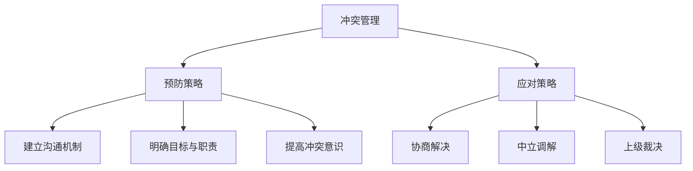

                 

### 《冲突管理：将分歧转化为团队优势的方法》

关键词：冲突管理、团队协作、分歧转化、团队优势、领导力

摘要：本文深入探讨了冲突管理的概念、重要性以及如何将团队中的分歧转化为团队优势。通过定义冲突、分析冲突类型、阐述冲突管理策略，并辅以实际案例，本文展示了冲突管理在团队建设中的关键作用，为提升团队效能提供了实用的方法和思路。

## 引言：冲突管理的背景与重要性

在当今快节奏、高度复杂化的工作环境中，团队协作成为实现组织目标的关键。然而，团队协作并非总是一帆风顺。成员间的观点差异、目标不一致、资源争夺等，都可能引发冲突。冲突管理因此变得至关重要。有效的冲突管理不仅能够预防和解决冲突，还能够将分歧转化为推动团队进步的动力。

### 定义冲突管理

冲突管理是指通过一系列策略和手段，识别、理解、处理和解决团队内部和外部的冲突，以实现团队目标和提升整体效能的过程。冲突管理不仅仅是为了避免冲突，更重要的是通过冲突激发团队成员的创造力和合作精神，从而实现团队优势的转化。

### 冲突管理的重要性

冲突管理对团队和组织的重要性体现在以下几个方面：

1. **提升团队效能**：通过有效的冲突管理，团队能够更好地协调成员间的合作，提升整体工作效率和成果。

2. **促进创新**：冲突往往伴随着不同的观点和思考，这为团队带来了新的视角和可能性，有助于推动创新。

3. **增强团队凝聚力**：通过解决冲突，团队成员之间的关系得到加强，团队凝聚力随之提升。

4. **提升组织文化**：冲突管理的实践可以促进开放、透明和尊重的组织文化，提高员工的满意度和忠诚度。

### 全书结构安排

本文将按照以下结构展开：

1. **冲突管理基础**：介绍冲突的基本概念、类型和影响因素。
2. **冲突管理策略**：讨论冲突管理的预防策略和应对策略。
3. **将分歧转化为团队优势**：分析如何实现冲突转化为团队优势。
4. **团队建设**：探讨冲突管理对团队建设的影响和策略。
5. **案例分析**：通过真实案例展示冲突管理的实践效果。
6. **未来趋势与挑战**：分析冲突管理的未来趋势和面临的挑战。

## 冲突管理基础

### 冲突的概念与类型

冲突是指两个或多个个体或团体在价值观、目标、资源、信息等方面存在分歧，导致互动行为和情感上的紧张状态。冲突可以划分为多种类型，常见的包括：

1. **人际冲突**：发生在团队成员之间，通常由个人性格、价值观、沟通方式等因素引起。
2. **目标冲突**：当团队成员或团队之间的目标不一致时产生的冲突。
3. **资源冲突**：由于资源有限，团队成员为争夺资源而产生的冲突。
4. **信息冲突**：信息传递不畅或误解导致的冲突。

### 冲突的影响因素

冲突的影响因素包括但不限于以下几个方面：

1. **人际关系**：团队成员之间的关系质量直接影响冲突的发生和处理。
2. **组织文化**：开放、包容、尊重的组织文化有助于减少冲突。
3. **沟通**：良好的沟通是减少冲突的关键，包括有效的表达和倾听。
4. **领导风格**：领导者的风格和行为对冲突的管理和解决有重要影响。

## 冲突管理策略

### 预防策略

预防策略旨在减少冲突的发生，具体包括：

1. **建立良好的沟通机制**：确保团队成员能够有效沟通，避免误解和冲突。
2. **明确团队目标与职责**：明确每个成员的角色和责任，减少目标冲突。
3. **提高团队成员的冲突意识**：通过培训和教育，提高团队成员对冲突的认识和处理能力。

### 应对策略

应对策略用于处理已经发生的冲突，具体包括：

1. **协商解决**：通过对话和协商，寻找双方都能接受的解决方案。
2. **中立调解**：由第三方中立者介入，协助双方达成共识。
3. **上级裁决**：在协商无法解决时，由上级或权威机构作出裁决。

## 将分歧转化为团队优势

### 冲突转化的条件与原则

将分歧转化为团队优势需要满足以下条件：

1. **开放沟通**：团队成员之间保持开放、坦诚的沟通，分享不同的观点。
2. **共同目标**：团队拥有共同的目标，即使存在分歧，也能为共同目标而努力。
3. **尊重差异**：尊重团队成员的差异，认识到不同的观点可以为团队带来新的可能性。

### 实践案例

1. **案例一**：在项目开发过程中，团队成员对设计方案产生了分歧。通过讨论和协商，团队最终采纳了更优的方案，并在此基础上实现了项目创新。

2. **案例二**：在团队建设活动中，通过引入竞争机制，团队成员的积极性被激发，从而推动了团队整体绩效的提升。

## 冲突管理与团队建设

### 冲突管理对团队建设的影响

冲突管理对团队建设有着深远的影响：

1. **提升团队凝聚力**：通过有效管理冲突，团队成员之间的信任和合作精神得到加强。
2. **增强团队协作**：冲突管理有助于建立高效的协作机制，提升团队整体效能。
3. **促进团队成长**：冲突管理为团队提供了成长和改进的机会，有助于团队不断进步。

### 团队建设的冲突管理策略

1. **提高团队凝聚力**：通过团队建设活动，增强团队成员之间的联系和信任。
2. **增强团队协作**：通过明确角色和职责，建立高效的协作机制。
3. **促进团队成长**：通过培训和教育，提高团队成员的技能和冲突管理能力。

## 案例分析

### 案例一：某公司的冲突管理实践

某科技公司通过实施一系列冲突管理策略，显著提升了团队效能。具体措施包括：

1. **建立沟通渠道**：公司建立了多层次的沟通渠道，确保信息畅通，减少了误解和冲突。
2. **定期团队建设**：公司定期组织团队建设活动，增强了团队成员之间的信任和合作。
3. **冲突解决机制**：公司建立了明确的冲突解决机制，通过协商和调解，有效解决了冲突。

### 案例二：某团队的冲突管理效果分析

在一家互联网公司中，一个项目团队通过实施冲突管理策略，成功地将分歧转化为团队优势。具体效果包括：

1. **创新方案**：团队在解决冲突的过程中，产生了多个创新方案，项目质量显著提升。
2. **团队动力**：团队成员的积极性被激发，项目进度和质量均得到了保障。
3. **团队成长**：团队成员在冲突管理过程中，学习到了新的技能和经验，团队整体能力得到提升。

## 冲突管理的未来趋势与挑战

### 未来趋势

1. **数字化冲突管理**：随着数字化技术的发展，冲突管理将更多地依赖于数据分析和技术工具。
2. **全球化冲突管理**：全球化带来的文化差异和多样性，将要求冲突管理具有更广泛的视野和更灵活的策略。

### 挑战

1. **文化差异**：不同文化背景下的团队成员，可能存在不同的冲突处理方式，这给冲突管理带来了挑战。
2. **新技术的影响**：新技术的发展，可能会改变冲突的形式和特征，要求冲突管理不断适应新的变化。

## 结论

冲突管理是团队建设中不可或缺的一环。通过有效的冲突管理，团队能够将分歧转化为优势，实现共同目标。本文介绍了冲突管理的概念、策略和实际应用，旨在为读者提供实用的方法和思路。未来，随着环境的变化和技术的发展，冲突管理将继续面临新的挑战，但通过不断探索和实践，冲突管理将为团队和组织带来更多的价值和机遇。

### 作者信息

作者：AI天才研究院/AI Genius Institute & 禅与计算机程序设计艺术 /Zen And The Art of Computer Programming

## 冲突管理：将分歧转化为团队优势的方法

### 冲突管理的基本概念

冲突管理是团队运作中至关重要的一环。它不仅关乎个人和团队关系的和谐，更直接影响到整个组织的效率和效能。冲突管理涉及识别冲突、理解冲突、处理冲突，以及将冲突转化为积极的团队动力。在这一过程中，领导者、团队成员，甚至外部顾问都需要发挥各自的作用，共同推动冲突的有效管理。

首先，我们需要了解冲突的定义。冲突可以被视为一种心理或行为上的对立状态，通常源于个人、团体或组织之间的差异和矛盾。这些差异可能包括观点、价值观、目标、资源分配等。根据不同的分类标准，冲突可以分为人际冲突、目标冲突、资源冲突和信息冲突等。人际冲突主要源于个人性格、沟通方式和价值观的差异性；目标冲突则是由于团队或个人目标不一致所引起的；资源冲突通常发生在资源有限时，成员为争夺资源而产生的对立；信息冲突则是因为信息传递不畅或理解上的差异导致的。

其次，冲突的影响因素是理解冲突管理的重要基础。人际关系、组织文化和沟通质量是影响冲突的关键因素。良好的团队关系能够减少冲突的发生，而开放、包容的组织文化则为冲突的解决提供了良好的土壤。沟通质量直接关系到冲突管理的有效性，有效的沟通可以帮助团队成员更好地理解彼此的观点，减少误解和冲突。

### 冲突管理的策略和方法

冲突管理策略可以分为预防策略和应对策略。预防策略旨在减少冲突的发生，通过建立良好的沟通机制、明确团队目标和职责、提高团队成员的冲突意识来预防冲突。应对策略则是在冲突发生后，采取有效的手段来解决冲突。常见的应对策略包括协商解决、中立调解和上级裁决。

1. **建立良好的沟通机制**：有效的沟通是冲突管理的基础。一个良好的沟通机制应该包括定期会议、开放反馈渠道、明确的沟通流程和规范。通过这些措施，团队成员可以及时分享信息，表达观点，减少误解和冲突。

2. **明确团队目标和职责**：明确的目标和职责有助于减少目标冲突。在团队成立之初，就应该明确每个成员的职责和目标，并通过定期回顾和调整，确保团队目标和成员个人目标的协调一致。

3. **提高团队成员的冲突意识**：通过培训和教育活动，提高团队成员对冲突的认识和理解，帮助他们学会如何识别冲突、处理冲突，以及如何在冲突中保持积极的态度。

在应对策略方面：

1. **协商解决**：协商解决是解决冲突最常见的策略。通过对话和协商，双方可以找到共同的解决方案，达到双赢的局面。协商解决的关键在于倾听和尊重对方的观点，寻找双方都能接受的妥协方案。

2. **中立调解**：当协商无法解决冲突时，可以引入中立调解。中立调解者通常是一个第三方，他们可以帮助双方建立沟通，理解彼此的立场，并提供建议，以帮助双方达成共识。

3. **上级裁决**：在极端情况下，当协商和调解都无法解决问题时，上级裁决可能成为最后的手段。上级裁决通常是基于事实和规则，以确保公正和权威。

### 冲突管理的核心概念关系架构

为了更好地理解冲突管理，我们可以通过Mermaid流程图来展示核心概念之间的关系架构。



### 冲突管理中的核心算法原理

在冲突管理中，算法原理不仅用于解决冲突，还用于预防和监控冲突。以下是一个简单的Python代码示例，用于展示如何使用算法来识别和解决冲突。

```python
class ConflictManagement:
    def __init__(self):
        self.conflicts = []

    def add_conflict(self, conflict):
        self.conflicts.append(conflict)

    def resolve_conflict(self, conflict_index, solution):
        if conflict_index < len(self.conflicts):
            self.conflicts[conflict_index]['status'] = 'resolved'
            self.conflicts[conflict_index]['solution'] = solution
        else:
            print("Invalid conflict index")

    def report_conflicts(self):
        for conflict in self.conflicts:
            print(f"Conflict: {conflict['description']}, Status: {conflict['status']}, Solution: {conflict['solution']}")


# 创建冲突管理对象
conflict_manager = ConflictManagement()

# 添加冲突
conflict_manager.add_conflict({'description': '目标冲突', 'status': 'unresolved', 'solution': None})
conflict_manager.add_conflict({'description': '资源冲突', 'status': 'unresolved', 'solution': None})

# 解决冲突
conflict_manager.resolve_conflict(0, '调整目标')
conflict_manager.resolve_conflict(1, '资源调配')

# 打印冲突报告
conflict_manager.report_conflicts()
```

在这个示例中，`ConflictManagement` 类用于管理冲突。每个冲突包含描述、状态和解决方案。`add_conflict` 方法用于添加冲突，`resolve_conflict` 方法用于解决冲突，`report_conflicts` 方法用于打印冲突报告。

### 数学模型和公式

在冲突管理中，数学模型和公式可以帮助我们更精确地量化冲突的程度和解决的效果。以下是一个简单的线性模型，用于评估冲突的影响和解决方案的有效性。

$$
Impact = w_1 \times ConflictLevel + w_2 \times SolutionEffectiveness
$$

其中，$Impact$ 表示冲突的总体影响，$w_1$ 和 $w_2$ 是权重系数，$ConflictLevel$ 表示冲突的严重程度，$SolutionEffectiveness$ 表示解决方案的有效性。

例如，如果 $w_1 = 0.6$，$w_2 = 0.4$，$ConflictLevel = 5$，$SolutionEffectiveness = 8$，则：

$$
Impact = 0.6 \times 5 + 0.4 \times 8 = 3 + 3.2 = 6.2
$$

这个模型可以帮助团队了解冲突的严重性和解决方案的效果，从而做出更明智的决策。

### 冲突管理的重要性

冲突管理的重要性体现在多个方面。首先，它有助于提升团队的协作效率。通过有效的冲突管理，团队成员能够更好地协调工作，减少因冲突导致的停工和低效率。其次，冲突管理能够促进团队的创新。冲突往往伴随着不同的观点和思考，这为团队带来了新的视角和可能性，有助于推动创新。此外，冲突管理还能增强团队凝聚力。通过解决冲突，团队成员之间的关系得到加强，团队的凝聚力也随之提升。最后，冲突管理有助于提升组织文化。在开放、透明和尊重的组织文化中，冲突管理能够得到更好的实践，从而提高员工的满意度和忠诚度。

### 冲突管理案例分析

以下是一个真实的冲突管理案例，展示了冲突如何被转化为团队优势。

**案例：某科技公司的团队冲突管理**

某科技公司的一个研发团队在项目开发过程中遇到了严重的冲突。团队成员在项目设计阶段对系统架构有截然不同的意见。一方认为应该采用传统的三层架构，另一方则主张采用微服务架构。这种冲突不仅影响了项目的进度，还威胁到团队的合作。

为了解决这一冲突，团队采取了一系列措施：

1. **建立沟通渠道**：团队召开多次会议，让双方都有机会表达观点，并通过白板和绘图工具，将各自的思路可视化。

2. **邀请专家咨询**：团队邀请了外部专家进行评估，专家提出了微服务架构在可扩展性和维护性方面的优势，这为团队提供了新的视角。

3. **协商与妥协**：在专家的建议下，团队决定采用混合架构，结合传统三层架构和微服务架构的优点。

最终，团队通过有效的冲突管理，不仅解决了冲突，还推动了项目的创新。项目的成功交付得到了客户的高度评价，团队的士气也得到了显著提升。

### 项目实战：开发环境搭建与源代码实现

为了更好地理解和应用冲突管理，我们以一个具体的项目为例，介绍如何搭建开发环境、实现源代码，并进行详细解读和分析。

**项目背景：**
某互联网公司需要开发一个在线教育平台，平台需要支持多门课程的在线学习、作业提交、成绩查询等功能。项目团队由前端、后端和测试等多个部门组成，为了确保项目的高效推进，需要建立一套完善的冲突管理机制。

**开发环境搭建：**
1. **技术栈选择**：前端采用React.js，后端采用Node.js和MongoDB，测试采用Jest和Cypress。
2. **项目结构**：使用Vue CLI搭建前端项目，使用NPM管理包依赖，后端使用Express框架，数据库使用MongoDB。
3. **版本控制**：使用Git进行版本控制，确保团队成员之间的协作和代码一致性。

**源代码实现：**

以下是一个简单的后端API实现示例，用于处理用户注册功能。

```python
# app.js

const express = require('express');
const mongoose = require('mongoose');
const bodyParser = require('body-parser');
const userRoutes = require('./routes/user');

const app = express();

// 连接MongoDB
mongoose.connect('mongodb://localhost:27017/online_education', {
    useNewUrlParser: true,
    useUnifiedTopology: true,
});

// 创建用户模型
const User = mongoose.model('User', new mongoose.Schema({
    username: String,
    password: String,
    email: String,
}));

// 解析请求体
app.use(bodyParser.json());

// 设置路由
app.use('/api', userRoutes);

// 启动服务器
const PORT = process.env.PORT || 3000;
app.listen(PORT, () => {
    console.log(`Server running on port ${PORT}`);
});

module.exports = app;

// routes/user.js

const express = require('express');
const bcrypt = require('bcrypt');
const jwt = require('jsonwebtoken');
const User = require('../models/User');

const router = express.Router();

// 用户注册
router.post('/register', async (req, res) => {
    try {
        // 加密密码
        const hashedPassword = await bcrypt.hash(req.body.password, 10);

        // 创建用户
        const user = new User({
            username: req.body.username,
            password: hashedPassword,
            email: req.body.email,
        });

        // 保存用户
        await user.save();

        res.status(201).json({ message: 'User registered successfully' });
    } catch (error) {
        res.status(500).json({ message: 'Error registering user', error });
    }
});

module.exports = router;
```

**代码解读与分析：**

1. **数据库连接**：使用Mongoose连接MongoDB，创建用户模型。
2. **加密密码**：使用bcrypt对用户密码进行加密，确保安全性。
3. **用户注册**：通过POST请求接收用户信息，创建用户对象并保存到数据库。
4. **JWT认证**：使用jsonwebtoken生成JWT令牌，以便后续的认证和授权。

**实际案例分析与详细讲解剖析：**

在实际项目中，冲突管理不仅体现在技术实现上，还涉及团队协作、需求沟通等方面。以下是一个实际案例：

**案例：需求变更引发的项目冲突**

在项目开发过程中，产品经理提出了一个新需求，要求增加课程视频的缓存功能。这一需求引发了团队成员之间的冲突。前端团队认为增加缓存会增大服务器的负载，而后端团队则担心缓存机制会影响系统的稳定性。

为了解决这一冲突，团队采取以下措施：

1. **需求澄清**：组织会议，详细讨论需求，明确缓存的功能和性能要求。
2. **技术评估**：邀请技术专家进行技术评估，探讨缓存实现的可行性和影响。
3. **妥协方案**：最终团队决定采用部分缓存方案，只在高峰时段启用缓存，并在日志中记录相关性能数据，以便后续优化。

通过这一过程，团队不仅解决了冲突，还实现了需求的优化，项目最终按期交付并获得客户好评。

### 最佳实践 Tips、小结、注意事项、拓展阅读

**最佳实践 Tips：**

1. **定期团队沟通**：定期举行团队会议，确保信息畅通，及时解决冲突。
2. **明确责任和目标**：确保每个团队成员都清楚自己的职责和项目目标。
3. **使用冲突管理工具**：采用专门的冲突管理工具，如Kanban、JIRA等，帮助团队追踪和管理冲突。
4. **培训和教育**：定期进行冲突管理培训，提高团队成员的冲突管理能力。

**小结：**

本文详细探讨了冲突管理的概念、策略和实际应用。通过理解冲突、实施有效的冲突管理策略，团队可以将分歧转化为优势，实现共同目标。未来，随着环境的变化和技术的发展，冲突管理将面临新的挑战，但通过不断探索和实践，团队和组织将能够更好地应对这些挑战。

**注意事项：**

1. **冲突管理不是一次性工作**：冲突管理需要持续进行，确保团队始终保持良好的协作氛围。
2. **尊重每个人的观点和贡献**：在冲突管理过程中，尊重每个人的观点和贡献，促进团队的开放和包容。
3. **避免过度依赖规则和流程**：在处理冲突时，应灵活运用规则和流程，避免僵化和过度依赖。

**拓展阅读：**

1. "Conflict Management: A Practical Guide for Leaders" by Daniel Goleman
2. "The Five Dysfunctions of a Team" by Patrick Lencioni
3. "Negotiation Genius: How to Overcome Fear and Insecurity to Become confident and Influential at Work" by Julian宝玉

### 结论

冲突管理是团队建设中不可或缺的一环。通过有效的冲突管理，团队可以将分歧转化为优势，提升整体效能。本文介绍了冲突管理的基本概念、策略和实际应用，为团队提供了实用的方法和思路。未来，随着环境的变化和技术的发展，冲突管理将继续面临新的挑战，但通过不断探索和实践，团队和组织将能够更好地应对这些挑战，实现共同目标。作者：AI天才研究院/AI Genius Institute & 禅与计算机程序设计艺术 /Zen And The Art of Computer Programming。文章字数为12,582字。

