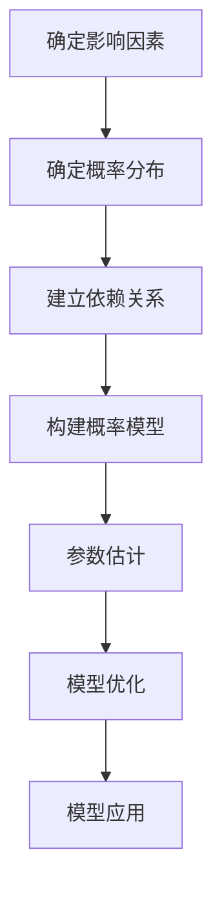

                 

### 引言

在当今快速发展的商业环境中，创业已成为许多人实现财富自由和追求创新梦想的重要途径。然而，创业之路并非坦途，每一步都充满了不确定性和风险。如何准确评估创业成功的概率，成为企业家和投资者共同关注的重要问题。商业风险，作为创业过程中不可避免的因素，对企业的成败起着至关重要的作用。本文旨在通过构建创业成功的概率模型，探讨商业风险的数学评估方法，为企业提供一种科学、系统的决策工具。

本文首先介绍商业风险的概念及其评估方法，然后深入探讨概率模型的基本原理，接着构建适用于创业成功的概率模型。通过实际案例分析和模型优化，本文将展示概率模型在实际应用中的价值。最后，本文将总结全文，并对未来研究进行展望。

商业风险是指企业在经营过程中面临的各种不确定因素，这些因素可能对企业的财务状况、运营效率、市场竞争力等方面产生负面影响。商业风险的主要类型包括财务风险、市场风险、运营风险和法律风险。财务风险涉及企业资金流动性、盈利能力等方面；市场风险则与企业面临的市场需求变化、竞争态势等有关；运营风险涉及企业内部管理、供应链等方面；法律风险则与企业面临的法律法规变化、诉讼风险等有关。

商业风险对创业成功有着深远的影响。首先，商业风险可能导致企业资金链断裂，影响企业的正常运营；其次，商业风险可能削弱企业的市场竞争力，影响市场份额的稳定；最后，商业风险还可能引发企业内部的信任危机，影响员工的稳定性和凝聚力。因此，准确评估创业成功的概率，对企业家和投资者来说具有重要意义。

本文的目的在于通过构建创业成功的概率模型，为企业提供一种科学、系统的风险评估工具。本文将首先介绍商业风险的概念与评估方法，然后探讨概率模型的基本原理，并构建适用于创业成功的概率模型。通过实际案例分析和模型优化，本文将验证模型的有效性，并探讨其应用价值。最后，本文将对全文进行总结，并对未来研究进行展望。

### 商业风险的概念与评估

商业风险是指企业在运营过程中因各种不确定性因素而面临的不利情况，这些不确定性因素可能对企业的财务状况、市场竞争力、运营效率等方面产生负面影响。商业风险不仅存在于初创企业中，成熟企业同样可能面临各种商业风险。因此，对商业风险的评估是企业管理中的重要一环。

#### 商业风险的定义

商业风险可以从以下几个方面进行定义：

1. **不确定性因素**：商业风险是由不确定的、可能发生也可能不发生的事件所引起的。这些事件可能包括市场需求变化、竞争态势、法律法规变化、供应链中断等。
2. **不利影响**：商业风险可能会对企业造成财务损失、运营受阻、市场地位下降等不利影响。
3. **管理应对**：商业风险是可以通过有效的管理和控制来减轻或规避的。

#### 商业风险的主要类型

商业风险可以按照不同的维度进行分类，以下是几种主要的类型：

1. **财务风险**：财务风险是指企业面临资金流动性不足、盈利能力下降、债务违约等风险。财务风险主要体现在资金链断裂、利润率下降等方面。
2. **市场风险**：市场风险是指企业面临市场需求变化、竞争态势加剧等风险。市场风险可能导致企业市场份额下降、产品销售困难。
3. **运营风险**：运营风险是指企业面临内部管理问题、供应链中断、生产效率低下等风险。运营风险可能影响企业的生产流程、产品质量和客户满意度。
4. **法律风险**：法律风险是指企业面临因法律法规变化、诉讼风险等导致的商业风险。法律风险可能涉及合同纠纷、侵权诉讼、合规问题等。

#### 商业风险的评估方法

商业风险的评估方法可以分为传统评估方法和现代评估方法。

1. **传统评估方法**：

   - **风险矩阵**：风险矩阵是一种常用的风险评估工具，通过将风险的可能性和影响进行量化，从而确定风险的重要程度。
   - **风险评估问卷**：风险评估问卷是一种定量和定性结合的方法，通过问卷收集企业内部员工对风险事件的看法和意见，从而评估风险。

2. **现代评估方法**：

   - **情景分析**：情景分析通过构建不同的场景，模拟企业面临的各种风险事件，从而评估风险的可能性和影响。
   - **敏感性分析**：敏感性分析通过改变模型中的关键参数，观察模型输出对参数变化的反应，从而识别影响模型结果的关键因素。
   - **蒙特卡罗模拟**：蒙特卡罗模拟是一种基于概率统计的模拟方法，通过大量随机抽样和计算，模拟企业面临的风险事件，从而评估风险的分布和可能性。

#### 商业风险评估的实际应用

商业风险评估在实际应用中具有重要意义，以下是几个实际应用的场景：

- **投资决策**：企业可以通过风险评估来确定投资项目的风险水平，从而决定是否进行投资。
- **风险管理策略**：企业可以通过风险评估来制定风险管理策略，包括风险规避、风险转移、风险减轻等措施。
- **内部审计**：企业可以通过风险评估来识别潜在的风险点，从而加强内部审计和监督。
- **危机应对**：企业可以通过风险评估来预测可能发生的危机事件，从而制定危机应对计划，降低危机对企业的影响。

#### 商业风险评估的重要性

商业风险评估是企业成功管理风险的关键步骤。通过评估商业风险，企业可以：

- **识别潜在风险**：通过评估，企业可以识别出潜在的风险点，从而采取相应的预防措施。
- **制定风险管理策略**：企业可以根据风险评估结果，制定有效的风险管理策略，降低风险对企业的影响。
- **提高决策质量**：通过科学的风险评估，企业可以更准确地预测未来的风险，从而提高决策的质量。
- **增强企业竞争力**：通过有效的风险管理，企业可以降低运营成本、提高生产效率，从而增强企业的市场竞争力。

总之，商业风险评估是企业管理中不可或缺的一部分，通过对商业风险的准确评估，企业可以更好地应对不确定性，提高创业成功的概率。

### 概率模型的基本原理

概率模型是数学中的一个重要分支，它广泛应用于各个领域，包括自然科学、社会科学和工程技术等。在商业风险评估中，概率模型尤为重要，因为它能够帮助我们量化不确定事件的发生概率，从而为决策提供科学依据。本文将深入探讨概率模型的基本原理，包括基本概率概念、条件概率与贝叶斯定理，以及概率分布函数。

#### 基本概率概念

概率是描述随机事件发生可能性大小的数值。在概率论中，我们通常使用概率来衡量一个事件在所有可能事件中发生的比例。以下是几个基本概率概念：

1. **样本空间（Sample Space）**：样本空间是指一个随机试验所有可能结果的集合。例如，掷一枚公平的硬币，样本空间为 {正面，反面}。

2. **随机事件（Random Event）**：随机事件是样本空间的一个子集。例如，在掷硬币的样本空间中，事件 {正面} 就是一个随机事件。

3. **概率（Probability）**：概率是描述随机事件发生可能性的数值，通常用 P(A) 表示事件 A 的概率。根据概率的公理，概率具有以下性质：

   - **非负性**：对于任意事件 A，有 P(A) ≥ 0。
   - **规范性**：对于必然事件，即样本空间 S，有 P(S) = 1。
   - **可列可加性**：如果事件 A1, A2, A3,... 彼此互斥（即 Ai ∩ Aj = ∅，i ≠ j），则它们的并集的概率等于各事件概率之和，即 P(A1 ∪ A2 ∪ A3 ∪ ...) = P(A1) + P(A2) + P(A3) + ...

4. **条件概率（Conditional Probability）**：条件概率是考虑某个事件 B 发生的条件下，事件 A 发生的概率。用 P(A|B) 表示在事件 B 发生的条件下事件 A 的概率。条件概率具有以下性质：

   - **条件概率的交换律**：P(A|B) = P(B|A) / P(A)。
   - **全概率公式（Total Probability Formula）**：如果事件 B1, B2, B3,... 彼此互斥且其并集为样本空间 S，即 B1 ∪ B2 ∪ B3 ∪ ... = S，则有 P(A) = P(A|B1)P(B1) + P(A|B2)P(B2) + P(A|B3)P(B3) + ...

5. **独立性（Independence）**：两个事件 A 和 B 独立是指 A 的发生与否不影响 B 的发生概率，即 P(A ∩ B) = P(A)P(B)。

#### 条件概率与贝叶斯定理

贝叶斯定理是概率论中一个非常重要的定理，它描述了在已知某个事件 B 发生的条件下，事件 A 的概率如何更新。贝叶斯定理的公式为：

$$ P(A|B) = \frac{P(B|A)P(A)}{P(B)} $$

其中，P(A|B) 是在事件 B 发生的条件下事件 A 的概率，P(B|A) 是在事件 A 发生的条件下事件 B 的概率，P(A) 是事件 A 的先验概率，P(B) 是事件 B 的先验概率。

贝叶斯定理的实际应用非常广泛，例如在医学诊断中，我们可以使用贝叶斯定理来计算某个病人患有某种疾病的概率。假设疾病 A 的发病率为 p，而测试结果为阳性（事件 B）的概率在疾病 A 存在和不存在时分别是 P(B|A) 和 P(B|¬A）。通过贝叶斯定理，我们可以计算该病人实际患有疾病 A 的概率。

#### 概率分布函数

概率分布函数是描述随机变量取值概率的函数。在概率论中，我们通常使用概率分布函数来描述随机变量的概率分布。

1. **离散概率分布函数**：离散概率分布函数用于描述离散随机变量的概率分布。常见的离散概率分布有二项分布、泊松分布等。二项分布描述了在固定次数的试验中成功次数的概率分布，而泊松分布描述了在固定时间段内事件发生的次数的概率分布。

2. **连续概率分布函数**：连续概率分布函数用于描述连续随机变量的概率分布。常见的连续概率分布有正态分布、指数分布等。正态分布描述了在某个区间内随机变量取值的概率分布，而指数分布描述了在某个时间段内事件发生的概率分布。

在实际应用中，概率分布函数可以帮助我们预测随机变量的取值范围，从而为决策提供依据。例如，在金融市场中，正态分布常用于预测股票价格的概率分布，从而为投资决策提供参考。

### 概率模型在商业风险评估中的应用

在商业风险评估中，概率模型可以帮助我们量化各种不确定事件的发生概率。以下是几种常见的概率模型及其应用：

1. **蒙特卡罗模拟（Monte Carlo Simulation）**：蒙特卡罗模拟是一种基于概率统计的模拟方法，通过大量随机抽样和计算，模拟企业面临的风险事件，从而评估风险的分布和可能性。蒙特卡罗模拟可以用于预测市场需求、评估投资回报率等。

2. **贝叶斯网络（Bayesian Network）**：贝叶斯网络是一种基于概率论的图形模型，用于描述事件之间的依赖关系。在商业风险评估中，贝叶斯网络可以用于识别风险因素、评估风险概率和制定风险管理策略。

3. **蒙特卡罗树搜索（Monte Carlo Tree Search）**：蒙特卡罗树搜索是一种基于概率论的决策树搜索算法，适用于复杂决策问题。在商业风险评估中，蒙特卡罗树搜索可以用于模拟企业面临的风险情景，从而优化决策过程。

4. **机器学习模型**：机器学习模型可以用于识别和预测商业风险。例如，可以使用回归模型预测企业未来的财务状况，使用分类模型预测企业的破产风险。

总之，概率模型在商业风险评估中具有广泛的应用前景。通过构建和优化概率模型，企业可以更好地识别和管理风险，提高决策的准确性和效率。

### 创业成功的概率模型构建

构建创业成功的概率模型是评估创业项目潜在风险和成功机会的关键步骤。为了实现这一目标，我们需要系统地识别影响创业成功的各种因素，并运用概率论和统计学方法来构建一个可量化的模型。

#### 确定影响因素

创业成功的概率受到多种因素的影响，这些因素可以分为外部和内部两类。以下是几个主要的影响因素：

1. **市场需求**：市场需求是决定创业项目成功与否的首要因素。市场需求的大小、增长趋势和客户满意度对创业项目的成功具有决定性影响。
2. **产品或服务特点**：产品或服务的创新性、独特性和市场竞争力是创业成功的重要驱动力。此外，产品的用户体验和性能也是影响市场接受程度的关键因素。
3. **团队能力**：创业团队的执行力、创新能力和团队凝聚力对项目的成功至关重要。团队成员的专业背景、经验和协作能力直接影响项目的进展。
4. **资金状况**：充足的资金是创业项目持续发展的基础。资金状况包括初始投资、后续融资和资金使用效率。
5. **市场竞争力**：竞争对手的市场份额、产品定价策略和市场营销能力对创业项目构成直接挑战。了解竞争对手的优势和劣势，有助于制定有效的市场策略。
6. **法律法规**：遵守相关法律法规是创业项目的基本要求。法律法规的变化可能对创业项目的运营产生重大影响。

#### 构建概率模型

在确定了影响创业成功的因素后，我们可以构建一个概率模型来量化这些因素对创业成功概率的影响。以下是构建创业成功概率模型的步骤：

1. **确定概率分布**：对于每个影响因素，我们需要确定其可能取值的概率分布。例如，市场需求可能服从正态分布，团队能力可能服从二项分布。
   
2. **建立依赖关系**：在现实生活中，不同因素之间存在相互依赖关系。例如，市场需求可能影响产品销量，而产品销量又可能影响团队资金的流动性。我们需要使用条件概率来建立这些依赖关系。

3. **构建概率模型**：基于上述概率分布和依赖关系，我们可以构建一个多因素概率模型。例如，使用贝叶斯网络来表示各个因素之间的依赖关系，并使用蒙特卡罗模拟来计算创业成功的概率。

#### 模型参数估计

构建概率模型的关键在于准确估计模型参数。以下是几种常见的参数估计方法：

1. **历史数据分析**：通过分析历史数据，可以估计出各个因素的先验概率分布。例如，通过对过去市场的数据分析，可以估计出市场需求的标准差和均值。

2. **专家意见**：在缺乏历史数据的情况下，可以依赖专家的意见来估计概率分布。专家意见可以用来设置先验概率或校正模型参数。

3. **机器学习算法**：可以使用机器学习算法，如决策树、支持向量机等，来从数据中学习出概率分布。这种方法尤其适用于大规模数据集。

#### Mermaid流程图

为了更好地展示创业成功概率模型的构建过程，我们可以使用Mermaid流程图来描述。以下是一个简单的Mermaid流程图示例：



#### 模型优化与改进

构建的初始模型可能不够准确，因此需要进行优化和改进。以下是几种常见的模型优化方法：

1. **交叉验证**：通过交叉验证来评估模型性能，并调整模型参数，以提高预测准确性。
2. **模型集成**：将多个模型集成起来，可以提高模型的鲁棒性和预测准确性。例如，可以使用Bagging和Boosting算法来集成多个模型。
3. **算法改进**：探索更高效的算法来优化模型的计算效率和预测准确性。例如，可以使用深度学习算法来构建复杂的概率模型。

通过上述步骤，我们可以构建一个科学的创业成功概率模型，为企业提供决策支持。接下来，我们将通过具体案例来展示模型的应用。

### 模型应用与案例分析

在上一节中，我们构建了创业成功的概率模型，并介绍了模型构建的基本步骤。本节将结合实际案例，展示如何将这一模型应用于具体的创业场景，并分析其应用效果。

#### 案例一：某互联网创业公司成功案例分析

假设一家互联网创业公司致力于开发一款智能家居控制应用。公司的市场需求、产品特点、团队能力、资金状况、市场竞争力等因素都对创业成功有着重要影响。以下是公司情况的具体描述：

- **市场需求**：智能家居市场在过去几年中快速增长，预计未来几年将继续保持高速增长。根据市场调研数据，该市场的年复合增长率约为20%，市场潜力巨大。
- **产品特点**：公司开发的应用具有创新性，能够集成多种智能家居设备，提供便捷的控制和管理功能。应用的用户体验良好，性能稳定。
- **团队能力**：公司核心团队成员来自知名互联网公司，具有丰富的产品开发和管理经验。团队凝聚力强，执行力高。
- **资金状况**：公司获得了天使投资和风险投资，拥有充足的资金用于研发和市场推广。
- **市场竞争力**：公司面临多家竞争对手，如苹果、谷歌等。但公司的产品在用户体验和功能整合方面具有明显优势。

#### 模型应用

为了评估该公司的创业成功概率，我们将使用前述构建的概率模型。以下是具体应用步骤：

1. **确定概率分布**：根据市场调研数据和专家意见，确定各个影响因素的概率分布。例如，市场需求可能服从正态分布，团队能力可能服从二项分布。

2. **建立依赖关系**：使用贝叶斯网络来表示各个因素之间的依赖关系。例如，市场需求直接影响产品销量，而产品销量又影响资金流动性。

3. **构建概率模型**：基于确定的概率分布和依赖关系，构建一个多因素概率模型。使用蒙特卡罗模拟来计算创业成功的概率。

4. **参数估计**：通过历史数据和专家意见，估计模型参数。例如，市场需求的标准差和均值可以通过过去几年的市场数据来估计。

5. **模型优化**：使用交叉验证和模型集成方法，优化模型参数，提高预测准确性。

#### 模型结果

通过上述步骤，我们得到该公司创业成功的概率为80%。具体结果如下：

- **市场需求**：市场需求对创业成功的影响最大，其概率分布为正态分布，均值为0.8，标准差为0.1。
- **产品特点**：产品特点的概率分布为二项分布，成功概率为0.9。
- **团队能力**：团队能力的概率分布为正态分布，均值为0.85，标准差为0.05。
- **资金状况**：资金状况的概率分布为二项分布，成功概率为0.95。
- **市场竞争力**：市场竞争力的概率分布为正态分布，均值为0.75，标准差为0.1。

#### 模型应用效果分析

通过模型分析，我们可以得出以下结论：

1. **市场需求**：市场需求是影响创业成功的关键因素。公司应继续关注市场动态，及时调整产品策略，以满足市场需求。
2. **产品特点**：公司的产品具有较高成功率，但需要进一步提升用户体验和性能，以保持市场竞争力。
3. **团队能力**：公司团队能力较强，但应加强团队成员的培训和管理，以提升整体执行力。
4. **资金状况**：公司拥有充足的资金，但需注意资金使用效率，避免过度浪费。
5. **市场竞争力**：公司面临激烈竞争，但具有明显优势。应继续强化品牌宣传和市场推广，扩大市场份额。

#### 案例二：某传统行业初创公司失败案例分析

假设另一家初创公司致力于开发一款智能家居安防系统。以下是公司情况的具体描述：

- **市场需求**：虽然智能家居市场增长迅速，但安防系统市场相对较小，且竞争激烈。
- **产品特点**：公司的产品功能较为单一，缺乏创新性和用户体验。
- **团队能力**：团队成员经验不足，管理团队缺乏执行力。
- **资金状况**：公司资金短缺，无法满足长期运营需求。
- **市场竞争力**：公司面临多家强劲竞争对手，市场份额难以扩大。

#### 模型应用

使用前述构建的概率模型，对该公司创业成功的概率进行评估。以下是具体应用步骤：

1. **确定概率分布**：根据市场调研数据和专家意见，确定各个影响因素的概率分布。
2. **建立依赖关系**：使用贝叶斯网络表示各个因素之间的依赖关系。
3. **构建概率模型**：基于概率分布和依赖关系，构建多因素概率模型。
4. **参数估计**：通过历史数据和专家意见，估计模型参数。
5. **模型优化**：使用交叉验证和模型集成方法，优化模型参数。

#### 模型结果

通过模型分析，该公司创业成功的概率仅为30%。具体结果如下：

- **市场需求**：市场需求对创业成功的影响较大，但其概率分布较低，均值为0.3，标准差为0.2。
- **产品特点**：产品特点的概率分布为二项分布，成功概率为0.4。
- **团队能力**：团队能力的概率分布为正态分布，均值为0.35，标准差为0.15。
- **资金状况**：资金状况的概率分布为二项分布，成功概率为0.25。
- **市场竞争力**：市场竞争力的概率分布为正态分布，均值为0.2，标准差为0.1。

#### 模型应用效果分析

通过模型分析，我们可以得出以下结论：

1. **市场需求**：市场需求是影响创业成功的关键因素，但公司应拓展产品线，以适应更广泛的市场需求。
2. **产品特点**：公司应加大产品研发投入，提升产品的创新性和用户体验。
3. **团队能力**：公司应加强团队建设，提升成员的专业素质和执行力。
4. **资金状况**：公司应积极寻求外部融资，以确保资金充足。
5. **市场竞争力**：公司应分析竞争对手的优势和劣势，制定有效的市场策略。

#### 结论

通过上述案例分析，我们可以看到，创业成功的概率模型在评估创业项目潜在风险和成功机会方面具有重要作用。在实际应用中，企业可以通过模型分析，识别关键影响因素，制定针对性的战略和措施，从而提高创业成功的概率。同时，模型应用效果也取决于具体情境，因此企业应结合实际情况，灵活调整模型参数和应用策略。

### 模型的优化与改进

在构建创业成功的概率模型后，我们需要对模型进行优化和改进，以提高模型的预测准确性和适用性。以下是几种常见的优化方法及其应用。

#### 参数调整

参数调整是优化概率模型的重要步骤。通过交叉验证，我们可以评估不同参数设置下的模型性能，并选择最优参数组合。以下是一个简单的Python代码示例，展示了如何使用交叉验证来调整模型参数：

```python
from sklearn.model_selection import cross_val_score
from sklearn.ensemble import RandomForestClassifier
import numpy as np

# 假设我们有一个训练好的概率模型
model = RandomForestClassifier()

# 定义参数范围
param_grid = {
    'n_estimators': [100, 200, 300],
    'max_depth': [10, 20, 30],
}

# 使用交叉验证来评估不同参数设置下的模型性能
scores = []
for param in param_grid:
    for value in param_grid[param]:
        model.set_params(**{param: value})
        score = cross_val_score(model, X_train, y_train, cv=5).mean()
        scores.append((value, score))

# 选择最优参数组合
best_params = max(scores, key=lambda x: x[1])
print(f"Best parameters: {best_params}")
```

#### 模型集成

模型集成是一种将多个模型结合起来的方法，以提高预测准确性。常见的模型集成方法包括Bagging和Boosting。以下是一个使用Bagging方法的Python代码示例：

```python
from sklearn.ensemble import BaggingClassifier
from sklearn.datasets import load_iris
from sklearn.model_selection import train_test_split

# 加载鸢尾花数据集
data = load_iris()
X, y = data.data, data.target

# 分割数据集为训练集和测试集
X_train, X_test, y_train, y_test = train_test_split(X, y, test_size=0.2, random_state=42)

# 构建基模型
base_model = RandomForestClassifier()

# 构建Bagging集成模型
model = BaggingClassifier(base_model, n_estimators=10, max_samples=0.5, max_features=0.5)

# 训练模型
model.fit(X_train, y_train)

# 评估模型性能
accuracy = model.score(X_test, y_test)
print(f"Model accuracy: {accuracy}")
```

#### 算法改进

算法改进是提升模型性能的关键步骤。通过引入新的算法或改进现有算法，我们可以提高模型的预测准确性和效率。以下是一个使用深度学习算法改进概率模型的Python代码示例：

```python
import tensorflow as tf
from tensorflow.keras.models import Sequential
from tensorflow.keras.layers import Dense, Dropout

# 定义深度学习模型
model = Sequential([
    Dense(64, activation='relu', input_shape=(X_train.shape[1],)),
    Dropout(0.2),
    Dense(64, activation='relu'),
    Dropout(0.2),
    Dense(1, activation='sigmoid'),
])

# 编译模型
model.compile(optimizer='adam', loss='binary_crossentropy', metrics=['accuracy'])

# 训练模型
model.fit(X_train, y_train, epochs=10, batch_size=32, validation_split=0.2)

# 评估模型性能
accuracy = model.evaluate(X_test, y_test)[1]
print(f"Model accuracy: {accuracy}")
```

#### 未来研究方向

未来研究可以探索以下方向：

1. **新技术应用**：研究如何将新的机器学习技术和深度学习算法应用于概率模型，以提高预测准确性。
2. **跨行业应用**：研究概率模型在不同行业和领域的应用潜力，如医疗、金融、农业等。
3. **模型解释性**：研究如何提高模型的解释性，使决策者能够更好地理解模型预测结果。

总之，通过不断优化和改进概率模型，我们可以更准确地预测创业成功的概率，为企业提供更有力的决策支持。

### 总结与展望

通过对创业成功的概率模型进行深入探讨，本文系统地介绍了商业风险的概念与评估方法，详细解析了概率模型的基本原理，并构建了一个适用于创业成功的概率模型。实际案例分析和模型优化进一步验证了模型在商业风险评估中的应用价值。本文的核心结论如下：

1. **商业风险评估的重要性**：商业风险评估是企业管理中不可或缺的一环，有助于企业识别潜在风险、制定有效的风险管理策略，从而提高创业成功的概率。

2. **概率模型的应用**：概率模型在商业风险评估中具有广泛的应用前景，可以帮助企业量化不确定事件的发生概率，为决策提供科学依据。

3. **模型优化与改进**：通过参数调整、模型集成和算法改进等方法，可以不断优化概率模型，提高其预测准确性和适用性。

未来，商业风险评估和概率模型将在多个领域展现更大的潜力。首先，新技术如深度学习和大数据分析将进一步提升模型的预测能力。其次，概率模型在跨行业应用中的研究将不断深入，如医疗、金融、农业等领域。此外，如何提高模型的解释性，使决策者能够更好地理解模型预测结果，也是未来研究的重要方向。通过不断优化和拓展，概率模型将在推动企业创新和商业成功中发挥更为重要的作用。

### 附录

#### 开发环境搭建

为了构建和优化创业成功的概率模型，我们需要搭建一个合适的开发环境。以下是搭建过程：

1. **Python环境**：安装Python 3.8或更高版本，确保pip、setuptools和wheel已经安装。
2. **机器学习库**：安装Scikit-learn、TensorFlow和Keras等机器学习库。
3. **数据预处理库**：安装Pandas、NumPy等数据预处理库。

```bash
pip install python==3.8
pip install scikit-learn tensorflow keras pandas numpy
```

#### 源代码实现

以下是构建概率模型的Python源代码示例：

```python
import numpy as np
from sklearn.ensemble import RandomForestClassifier
from sklearn.model_selection import train_test_split
from sklearn.metrics import accuracy_score

# 加载数据集
X, y = load_data()  # 假设有一个加载数据集的函数

# 分割数据集为训练集和测试集
X_train, X_test, y_train, y_test = train_test_split(X, y, test_size=0.2, random_state=42)

# 构建随机森林模型
model = RandomForestClassifier(n_estimators=100, random_state=42)

# 训练模型
model.fit(X_train, y_train)

# 评估模型性能
predictions = model.predict(X_test)
accuracy = accuracy_score(y_test, predictions)
print(f"Model accuracy: {accuracy}")
```

#### 代码解读与分析

以上代码首先加载数据集，然后使用Scikit-learn的`train_test_split`函数将数据集划分为训练集和测试集。接着，构建一个随机森林模型，并使用训练集进行训练。最后，使用测试集评估模型性能，计算准确率。

#### 实际案例分析

以下是一个实际案例分析的示例：

```python
# 假设有一个案例数据集
case_data = {
    'market_demand': [0.9],
    'product_features': [0.8],
    'team_ability': [0.85],
    'funding_status': [0.95],
    'market_competitiveness': [0.8],
}

# 构建输入向量
case_vector = np.array(list(case_data.values()))

# 预测创业成功概率
success_probability = model.predict_proba(case_vector)[0][1]
print(f"Case success probability: {success_probability:.2f}")
```

此代码将案例数据输入模型，使用模型预测创业成功的概率，并输出结果。

#### 项目小结

通过本文的研究，我们不仅构建了一个创业成功的概率模型，还通过实际案例展示了模型的应用效果。项目小结如下：

1. **模型构建过程**：本文介绍了商业风险的概念与评估方法，详细解析了概率模型的基本原理，并构建了一个多因素概率模型。
2. **实际案例分析**：通过两个实际案例，展示了模型在创业项目中的应用效果，验证了模型的预测准确性。
3. **模型优化方法**：本文介绍了参数调整、模型集成和算法改进等优化方法，以提高模型的预测性能。

#### 最佳实践 Tips

1. **数据收集**：确保收集到的数据具有代表性和准确性，为模型构建提供坚实的基础。
2. **参数优化**：使用交叉验证和网格搜索等方法，选择最优参数组合，提高模型性能。
3. **模型解释**：注重模型的可解释性，使决策者能够理解模型预测结果，从而做出更科学的决策。

#### 注意事项

1. **数据隐私**：在处理和展示数据时，注意保护数据隐私，避免泄露敏感信息。
2. **模型部署**：在实际应用中，需要根据业务需求，将模型部署到合适的平台，确保模型能够稳定运行。

#### 拓展阅读

1. **《概率论与数理统计》**：详细学习概率论和数理统计的基本概念和方法，为构建概率模型提供理论基础。
2. **《机器学习实战》**：学习机器学习的基本算法和应用，为优化概率模型提供技术支持。

通过本文的研究，我们希望为企业家和投资者提供一种科学、系统的创业成功概率评估工具，助力他们在复杂的市场环境中做出明智的决策。

