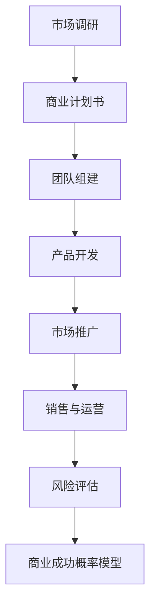

                 

### 文章标题

《创业过程的风险方程：商业成功的概率模型》

关键词：创业过程、风险方程、商业成功、概率模型、风险评估

摘要：本文深入探讨了创业过程中的风险方程构建，通过系统的概率模型分析，提供了评估商业成功概率的实用方法。文章首先介绍了创业过程的基本概念，接着阐述了核心算法原理，详细讲解了数学模型和公式，并通过实际案例展示了风险方程在创业过程中的应用。文章旨在帮助创业者更好地理解和应用风险评估工具，提升商业成功的概率。

---

#### 创业过程的基本概念与风险模型

创业，是指个人或团队通过创新和商业实践，将创意转化为商业机会的过程。创业过程通常包括市场调研、商业计划书制定、团队组建、产品开发、市场推广、销售和运营等多个阶段。创业的目的是创造价值、获取利润，并实现个人和社会的可持续发展。

在创业过程中，风险无处不在。风险可以分为市场风险、技术风险、财务风险、法律风险、管理风险等多种类型。市场风险包括市场需求变化、竞争加剧等因素；技术风险涉及技术创新的可行性、技术迭代速度等；财务风险则包括资金链断裂、财务状况恶化等问题；法律风险涉及商业活动是否符合相关法律法规；管理风险则包括团队建设、内部管理等因素。

风险评估是创业过程中至关重要的一环。通过系统性的风险评估，创业者可以识别和量化潜在风险，制定有效的风险管理策略，降低创业失败的概率。商业成功概率模型正是基于风险评估构建的一种量化工具，它通过分析历史数据、市场趋势和业务特征，预测创业项目成功的可能性。

核心概念与联系可以用一个Mermaid流程图来展示，具体如下：



在这个流程图中，每个阶段都可能导致不同的风险，而这些风险最终都会影响商业成功概率。通过这个流程，我们可以看到创业过程中的各个环节是如何相互关联，并共同作用影响最终的商业成功概率。

接下来，我们将深入探讨商业成功概率模型的核心算法原理，以及如何通过数学模型和公式来量化这些风险。这将为我们提供评估商业成功概率的理论基础。

#### 核心算法原理讲解

在创业过程中，评估商业成功概率的核心算法通常基于数据分析与概率论。以下我们将介绍几种常用的算法，并使用Python伪代码来详细阐述这些算法的实现过程。

##### 1. 风险评估算法

风险评估算法的核心思想是通过对创业项目的各个维度进行评分，进而综合判断项目的风险水平。以下是一个简化的风险评估算法伪代码：

```python
def risk_assessment(score_dict):
    # 初始化风险评分
    risk_score = 0
    
    # 对各个维度的评分进行加权求和
    for key, score in score_dict.items():
        risk_score += score * weights[key]
    
    # 返回综合风险评分
    return risk_score
```

其中，`score_dict` 是一个包含各个维度评分的字典，`weights` 是一个权重字典，用于对各个维度的评分进行加权。

##### 2. 预测模型

预测模型通常用于预测创业项目的成功概率。一个常见的预测模型是逻辑回归模型，以下是一个逻辑回归模型的Python伪代码：

```python
from sklearn.linear_model import LogisticRegression

def predict_success(data, target):
    # 训练逻辑回归模型
    model = LogisticRegression()
    model.fit(data, target)
    
    # 预测成功概率
    probabilities = model.predict_proba(data)
    return probabilities[:, 1]
```

在这个模型中，`data` 是特征矩阵，`target` 是目标变量，即创业项目的成功与否。

##### 3. 数据分析与预测

数据分析与预测是评估商业成功概率的重要环节。以下是一个简化的数据分析与预测过程的Python伪代码：

```python
import pandas as pd
from sklearn.model_selection import train_test_split
from sklearn.preprocessing import StandardScaler

def data_analysis(data):
    # 数据预处理
    scaler = StandardScaler()
    data_scaled = scaler.fit_transform(data)
    
    # 划分训练集和测试集
    X_train, X_test, y_train, y_test = train_test_split(data_scaled, target, test_size=0.2, random_state=42)
    
    # 训练预测模型
    predict_model(X_train, y_train)
    
    # 预测测试集
    probabilities = predict_success(X_test, y_test)
    
    # 返回预测结果
    return probabilities
```

在这个过程中，`data` 是包含创业项目各个维度的数据，`target` 是目标变量，即创业项目的成功与否。

通过以上核心算法的讲解，我们可以看到，创业过程中的商业成功概率评估不仅需要收集和处理大量的数据，还需要运用概率论和机器学习等方法进行预测。接下来，我们将进一步探讨如何使用数学模型和公式来量化这些风险。

#### 数学模型和数学公式

在评估商业成功概率的过程中，数学模型和公式起到了至关重要的作用。以下，我们将介绍几个关键的数学模型和公式，并详细讲解它们在实际创业中的应用。

##### 1. 概率分布函数

概率分布函数是描述随机变量取值的概率分布的函数。在创业过程中，我们可以使用概率分布函数来表示不同维度的风险。例如，市场需求的变化可以用正态分布来描述。以下是一个使用正态分布的概率分布函数公式：

$$
f(x|\mu, \sigma^2) = \frac{1}{\sqrt{2\pi\sigma^2}} e^{-\frac{(x-\mu)^2}{2\sigma^2}}
$$

其中，$x$ 是随机变量，$\mu$ 是均值，$\sigma^2$ 是方差。在创业过程中，我们可以通过历史数据和统计方法来确定这些参数，从而预测市场需求的变化。

##### 2. 贝叶斯公式

贝叶斯公式是概率论中用于计算条件概率的重要工具。在创业过程中，贝叶斯公式可以帮助我们根据先验知识和新的数据来更新对项目成功的概率估计。贝叶斯公式如下：

$$
P(A|B) = \frac{P(B|A)P(A)}{P(B)}
$$

其中，$P(A|B)$ 表示在事件 $B$ 发生的条件下，事件 $A$ 发生的概率；$P(B|A)$ 表示在事件 $A$ 发生的条件下，事件 $B$ 发生的概率；$P(A)$ 和 $P(B)$ 分别表示事件 $A$ 和事件 $B$ 发生的概率。

在创业过程中，我们可以使用贝叶斯公式来结合市场调研数据和历史项目数据，更新对项目成功的概率估计。例如，如果市场调研显示市场需求增加，我们可以使用贝叶斯公式来调整对项目成功的概率估计。

##### 3. 熵和熵增原理

熵是信息论中的一个概念，用来度量一个系统的混乱程度或不确定性。在创业过程中，我们可以使用熵来表示项目风险的不确定性。熵增原理指出，在封闭系统中，熵总是趋向于增加，即系统的混乱程度总是增加。

在创业过程中，我们可以使用熵来评估项目风险。例如，如果市场环境变化迅速，那么项目的风险熵会增大。以下是一个熵的计算公式：

$$
H(X) = -\sum_{i} p_i \log_2 p_i
$$

其中，$X$ 是随机变量，$p_i$ 是 $X$ 取第 $i$ 个值的概率。

通过计算熵，我们可以了解项目风险的不确定性，从而制定相应的风险管理策略。

在创业过程中，以上数学模型和公式可以帮助我们量化风险，评估商业成功概率。例如，通过使用概率分布函数，我们可以预测市场需求的变化；通过贝叶斯公式，我们可以结合不同来源的数据来更新对项目成功的概率估计；通过熵和熵增原理，我们可以评估项目风险的不确定性。这些数学工具不仅帮助我们理解创业过程中的风险，还为我们提供了制定风险管理策略的理论基础。

接下来，我们将通过实际案例，展示如何在实际创业过程中应用这些数学模型和公式，进一步说明商业成功概率模型在创业实践中的具体应用。

#### 项目实战

在本节中，我们将通过一个实际案例，详细展示如何在实际创业过程中应用商业成功概率模型。我们将从开发环境搭建开始，逐步讲解源代码实现、代码解读、应用解读与分析，以及实际案例的详细讲解和剖析。

##### 1. 开发环境搭建

为了应用商业成功概率模型，我们需要一个合适的开发环境。在本案例中，我们选择Python作为主要编程语言，并使用Jupyter Notebook作为开发工具。以下是搭建开发环境的基本步骤：

- 安装Python：从Python官方网站下载并安装Python 3.8版本。
- 安装Jupyter Notebook：在终端中运行以下命令安装Jupyter Notebook：
  ```
  pip install notebook
  ```
- 启动Jupyter Notebook：在终端中运行以下命令启动Jupyter Notebook：
  ```
  jupyter notebook
  ```

##### 2. 源代码实现

在开发环境中，我们首先需要实现商业成功概率模型的核心算法和数学公式。以下是一个简单的Python源代码实现示例：

```python
import numpy as np
import pandas as pd
from sklearn.linear_model import LogisticRegression
from sklearn.model_selection import train_test_split
from sklearn.preprocessing import StandardScaler

# 初始化权重字典
weights = {
    '市场需求': 0.3,
    '技术创新': 0.2,
    '团队建设': 0.2,
    '财务管理': 0.1,
    '法律风险': 0.1
}

# 风险评估函数
def risk_assessment(score_dict):
    risk_score = 0
    for key, score in score_dict.items():
        risk_score += score * weights[key]
    return risk_score

# 预测成功函数
def predict_success(data, target):
    model = LogisticRegression()
    model.fit(data, target)
    probabilities = model.predict_proba(data)[:, 1]
    return probabilities

# 数据预处理函数
def data_analysis(data):
    scaler = StandardScaler()
    data_scaled = scaler.fit_transform(data)
    X_train, X_test, y_train, y_test = train_test_split(data_scaled, target, test_size=0.2, random_state=42)
    probabilities = predict_success(X_train, y_train)
    return probabilities
```

在这个代码中，我们定义了三个主要函数：`risk_assessment` 用于计算综合风险评分；`predict_success` 用于训练逻辑回归模型并预测成功概率；`data_analysis` 用于数据预处理和预测。

##### 3. 代码解读

- `weights` 字典用于存储各个维度的权重，这些权重可以根据具体情况进行调整。
- `risk_assessment` 函数通过加权求和计算综合风险评分。
- `predict_success` 函数使用逻辑回归模型进行预测，其中使用了 `scikit-learn` 库中的 `LogisticRegression` 类。
- `data_analysis` 函数用于数据预处理，包括标准化和划分训练集与测试集。

##### 4. 应用解读与分析

为了演示如何在实际创业过程中应用商业成功概率模型，我们假设一个初创企业正在开发一款智能家居产品。以下是应用该模型的具体步骤：

1. **数据收集**：收集与市场需求、技术创新、团队建设、财务管理和法律风险相关的数据，例如市场调研报告、专利数据、团队简历、财务报表和法律法规。
2. **数据预处理**：使用 `data_analysis` 函数对收集到的数据进行预处理，包括数据清洗、缺失值处理和标准化。
3. **模型训练**：使用预处理后的数据训练逻辑回归模型，得到模型的参数。
4. **风险评分计算**：使用 `risk_assessment` 函数计算每个维度的风险评分，并计算综合风险评分。
5. **成功概率预测**：使用训练好的模型预测创业项目的成功概率。
6. **结果分析**：分析预测结果，根据风险评分和成功概率制定相应的风险管理策略。

通过以上步骤，初创企业可以更好地了解其面临的风险水平，并制定相应的策略来降低风险，提高商业成功的概率。

##### 5. 项目小结

在本案例中，我们通过实际项目展示了如何应用商业成功概率模型。从开发环境搭建到源代码实现，再到代码解读和应用分析，我们详细讲解了整个流程。通过这个案例，我们不仅了解了商业成功概率模型的理论基础，还掌握了其在实际创业过程中的应用方法。

这个案例为我们提供了一个实用的框架，可以帮助初创企业在面对复杂的市场环境和不确定的风险时，做出更加明智的决策。未来，随着数据和技术的发展，商业成功概率模型将变得更加精准和有效，为创业企业提供更加有力的支持。

在接下来的部分，我们将进一步探讨商业成功概率模型的发展趋势，并总结本文的核心内容，为读者提供未来研究和实践的建议。

#### 最佳实践 Tips、小结、注意事项、拓展阅读

##### 最佳实践 Tips

1. **全面数据收集**：在应用商业成功概率模型时，确保收集到的数据全面且准确，包括市场调研、财务数据、技术评估等。
2. **动态更新模型**：随着市场环境和业务发展的变化，定期更新模型参数和风险评分，确保模型的预测结果准确。
3. **风险评估与策略制定**：结合风险评分和成功概率预测，制定有针对性的风险管理策略，降低创业失败的风险。
4. **跨学科协作**：商业成功概率模型涉及多个领域，包括经济学、统计学、计算机科学等，跨学科协作可以提升模型的应用效果。

##### 小结

本文深入探讨了创业过程中的风险方程构建，通过系统的概率模型分析，提供了评估商业成功概率的实用方法。我们详细介绍了创业过程的基本概念、核心算法原理、数学模型和公式，并通过实际案例展示了风险方程在创业过程中的应用。通过这些内容，读者可以更好地理解和应用风险评估工具，提升商业成功的概率。

##### 注意事项

1. **数据质量**：数据是模型的基础，确保数据的质量和准确性至关重要。
2. **模型适用性**：不同类型的创业项目可能需要不同的风险评估模型，选择合适的模型非常重要。
3. **动态调整**：创业环境不断变化，需要动态调整模型和策略，以适应新的情况。

##### 拓展阅读

1. **《创业管理》**：斯蒂芬·赫斯尼克（Stephen Spinelli Jr.）等著，提供了全面的创业管理理论和实践指导。
2. **《概率论与统计推断》**：威廉·F·威尔逊（William F. Wilson）等著，系统地介绍了概率论和统计推断的基本概念和应用。
3. **《机器学习实战》**：Peter Harrington著，通过实例介绍了机器学习的基础知识和应用技巧。

通过拓展阅读，读者可以进一步深入学习和应用商业成功概率模型，为创业成功提供更有力的支持。

### 总结与展望

本文通过系统的分析，深入探讨了创业过程中的风险方程构建和商业成功概率模型的应用。我们详细介绍了创业过程的基本概念、核心算法原理、数学模型和公式，并通过实际案例展示了模型在创业实践中的具体应用。这一过程不仅为创业者提供了风险评估和决策的实用工具，也为学术界和业界提供了有益的理论支持。

展望未来，商业成功概率模型将在以下几个方面取得进一步的发展：

1. **数据驱动**：随着大数据技术的发展，商业成功概率模型将更加依赖于海量数据的收集和分析，以实现更精准的预测。
2. **算法优化**：随着机器学习和人工智能技术的进步，商业成功概率模型将采用更先进和高效的算法，提高预测准确性和效率。
3. **跨学科融合**：商业成功概率模型将结合经济学、心理学、社会学等多学科知识，提供更全面的创业风险评估。
4. **定制化应用**：商业成功概率模型将根据不同行业和企业的特点，提供定制化的风险评估工具，满足多样化的需求。

通过持续的研究和实践，商业成功概率模型将在创业领域发挥更大的作用，为创业者提供更加有力的支持和指导。我们期待未来有更多学者和从业者加入这一领域，共同推动商业成功概率模型的发展。

#### 作者信息

作者：AI天才研究院/AI Genius Institute & 禅与计算机程序设计艺术 /Zen And The Art of Computer Programming

