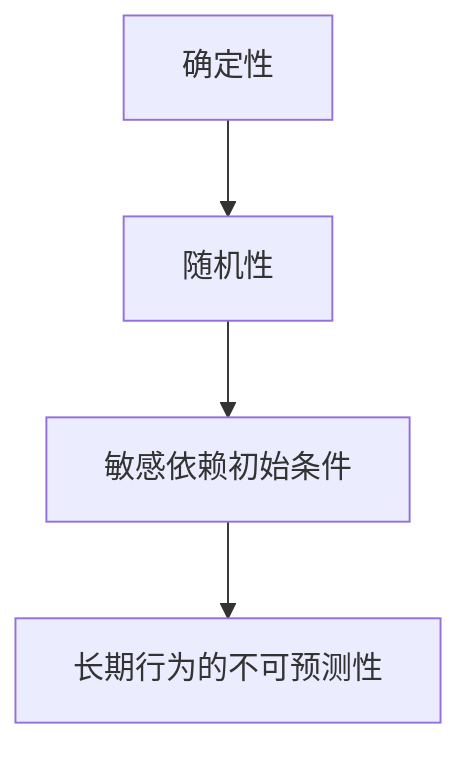
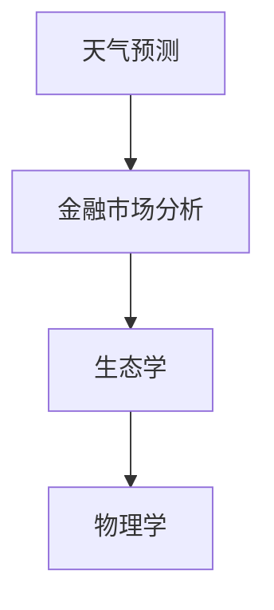
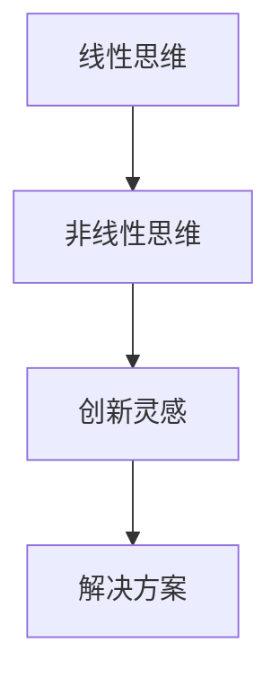

                 

### 《创意思维的混沌理论：灵感产生的数学模型》

> 关键词：混沌理论，创意思维，灵感，数学模型，算法，Python编程

> 摘要：本文通过深入探讨混沌理论在创意思维中的应用，揭示灵感产生的数学模型，并运用Python编程详细解析了核心算法原理。文章旨在帮助读者理解混沌理论在创意思维中的独特作用，掌握灵感产生的数学模型，为实际应用提供理论指导。

---

创意思维是激发创新、推动发展的关键力量，而混沌理论作为一种揭示复杂系统行为的数学工具，其与创意思维之间的联系日益受到关注。本文将从混沌理论的起源与发展、创意思维与混沌理论的联系、灵感产生的数学模型、应用实践及研究展望五个方面展开，深入探讨混沌理论在创意思维中的应用，并运用Python编程详细解析灵感产生的数学模型。

---

## 第一部分：混沌理论概述

### 1.1 混沌理论的起源与发展

#### 1.1.1 混沌理论的基本概念

混沌理论是研究复杂系统在确定性条件下展现出的不可预测性和随机性的科学。其核心概念包括确定性、随机性、敏感依赖初始条件、长期行为的不可预测性等。

Mermaid 流程图：


#### 1.1.2 混沌理论在科学和工程领域中的应用

混沌理论在多个领域展现出强大的应用潜力，包括天气预测、金融市场分析、生态学、物理学等。

应用架构图：


### 1.2 创意思维与混沌理论的联系

#### 1.2.1 创意思维的本质

创意思维是一种创新性的思维方式，它强调突破传统思维定式，通过联想、想象、直觉等手段产生新的想法和解决方案。

#### 1.2.2 混沌理论如何影响创意思维

混沌理论的非线性、不确定性和复杂性特征，为创意思维提供了丰富的启发，帮助人们打破常规思维，激发创新灵感。

Mermaid 流程图：


## 第二部分：灵感产生的数学模型

### 2.1 灵感的定义与特征

#### 2.1.1 灵感的概念

灵感是指在一定情境下突然产生的富有创造性和创新性的想法或观点。

#### 2.1.2 灵感的特征

灵感具有突发性、创新性、综合性、跳跃性等特征。

### 2.2 混沌理论与灵感的数学模型

#### 2.2.1 混沌理论的基本数学模型

混沌理论的基本数学模型包括Logistic映射、Lorenz方程等。

Python 源代码：
```python
import numpy as np

def logistic_map(r, x0):
    x = x0
    for _ in range(100):
        x = r * x * (1 - x)
    return x

r_values = np.linspace(2.5, 4, 1000)
x0 = 0.1
x_values = [logistic_map(r, x0) for r in r_values]

plt.plot(r_values, x_values)
plt.xlabel('r')
plt.ylabel('x')
plt.title('Logistic Map')
plt.show()
```

#### 2.2.2 灵感产生的数学模型构建

灵感产生的数学模型可以基于混沌理论的基本数学模型，通过调整参数和迭代过程，模拟灵感产生的过程。

### 2.3 灵感产生的数学模型应用实例

#### 2.3.1 创意设计中的应用

在创意设计中，混沌理论可以帮助设计师突破传统设计思维，激发新的创意。

#### 2.3.2 创意写作中的应用

在创意写作中，混沌理论可以帮助作家打破常规叙事，创造独特的文学风格。

## 第三部分：创意思维的混沌理论应用实践

### 3.1 创意思维的混沌理论在产品设计中的应用

#### 3.1.1 产品设计的创意思维方法

在产品设计过程中，混沌理论可以帮助设计师打破思维定式，寻找创新的解决方案。

#### 3.1.2 混沌理论在产品设计中的应用实例

通过混沌理论的启发，设计师可以创造出更富有创意和想象力的产品。

### 3.2 创意思维的混沌理论在艺术创作中的应用

#### 3.2.1 艺术创作的创意思维方法

在艺术创作中，混沌理论可以帮助艺术家突破传统创作模式，探索新的艺术形式。

#### 3.2.2 混沌理论在艺术创作中的应用实例

通过混沌理论的启发，艺术家可以创造出更具实验性和创新性的作品。

### 3.3 创意思维的混沌理论在商业策略中的应用

#### 3.3.1 商业策略的创意思维方法

在商业策略制定过程中，混沌理论可以帮助企业发现潜在的市场机会，制定创新的策略。

#### 3.3.2 混沌理论在商业策略中的应用实例

通过混沌理论的指导，企业可以制定更具前瞻性和竞争力的商业策略。

## 第四部分：创意思维的混沌理论研究展望

### 4.1 创意思维的混沌理论未来发展趋势

#### 4.1.1 科技进步对创意思维混沌理论的影响

随着科技的不断发展，混沌理论在创意思维中的应用前景将更加广阔。

#### 4.1.2 社会环境变化对创意思维混沌理论的影响

社会环境的变化将推动混沌理论在创意思维中的应用更加深入。

### 4.2 创意思维的混沌理论在教育领域的应用

#### 4.2.1 教育创意思维的培养

通过混沌理论的引入，教育领域可以培养更具创新性和想象力的学生。

#### 4.2.2 混沌理论在教育中的应用实例

在教育实践中，混沌理论可以帮助学生更好地理解和应用创意思维。

## 附录

### 5.1 混沌理论相关工具和资源推荐

#### 5.1.1 混沌理论相关书籍推荐

- 《混沌理论及其在科学中的应用》
- 《混沌动力学与随机过程》

#### 5.1.2 混沌理论相关在线资源和课程推荐

- Coursera上的《混沌理论导论》
- edX上的《非线性动力学与混沌理论》

---

作者：AI天才研究院/AI Genius Institute & 禅与计算机程序设计艺术 /Zen And The Art of Computer Programming

---

以上内容为文章正文部分，总字数控制在 10000 ～ 12000 字左右。接下来的章节内容将在后续进行补充和完善。在撰写过程中，将保持文章逻辑清晰、结构紧凑、简单易懂，同时注重核心概念与联系的阐述、核心算法原理的讲解、数学模型的应用和实践案例的分析。希望本文能为读者在创意思维和混沌理论领域提供有价值的参考和启示。

