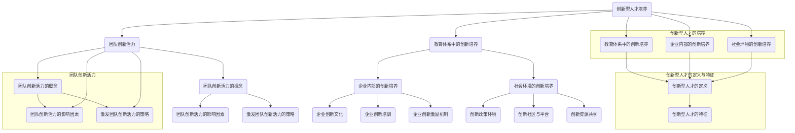

                 

### 文章标题：创新型人才培养：注入团队创新活力

#### 关键词：创新型人才、团队创新活力、人才培养、教育方法、策略与案例

#### 摘要：
本文从创新型人才的定义和特征出发，探讨了如何在教育体系、企业内部和社会环境中培养创新型人才。接着，文章详细分析了团队创新活力的概念及其影响因素，并提出了激发团队创新活力的策略。最后，通过案例分析展示了实际操作中的成功经验，并总结了最佳实践和注意事项。

----------------------------------------------------------------

### 背景介绍

在当今快速发展的科技时代，创新已经成为推动社会进步和经济发展的关键动力。创新型人才的培养成为各国政府和教育机构关注的热点。创新型人才不仅具备丰富的专业知识，还拥有独立思考、解决问题和创造新价值的能力。他们能够适应不断变化的环境，推动技术进步和社会发展。

然而，传统的教育模式和企业文化往往忽视了创新能力的培养。教育体系注重知识的传授，而忽视了实践能力和创新思维的培养；企业则更加关注短期效益，忽视了长期创新战略。这种现状导致了创新型人才的短缺，制约了团队创新活力的发挥。

为了解决这些问题，本文将从以下几个方面进行探讨：

1. 创新型人才的定义和特征
2. 创新型人才的培养方法
3. 团队创新活力的激发策略
4. 创新型人才培养的案例研究
5. 创新型人才培养的政策与支持

通过这些讨论，本文旨在为教育机构、企业和政策制定者提供有益的参考，共同推动创新型人才的培养和团队创新活力的注入。

----------------------------------------------------------------

### 核心概念与联系

在探讨创新型人才的培养和团队创新活力的注入之前，我们首先需要明确几个核心概念，并分析它们之间的关系。以下是这些核心概念及其相互关系的 Mermaid 流程图：



**核心概念解释：**

- **创新型人才培养**：指通过教育体系、企业内部和社会环境等多种途径，培养具备创新思维、创新能力的人才。创新型人才培养是提升团队创新活力的基础。
  
- **团队创新活力**：指团队在创新过程中表现出的积极性、创造性和协同性。团队创新活力是衡量团队创新能力的重要指标。

- **教育体系中的创新培养**：通过教育改革，引入创新教育理念和方法，培养学生的创新思维和实践能力。

- **企业内部的创新培养**：通过构建创新文化、提供创新培训和激励机制，激发员工的创新潜能。

- **社会环境的创新培养**：通过政策支持、创新社区和资源共享，营造有利于创新的社会氛围。

**概念之间的关系**：

- 创新型人才培养直接影响团队创新活力。教育体系和企业的创新培养是培养创新型人才的途径，而社会环境的创新培养则为创新型人才的成长提供支持。

- 团队创新活力受多种因素影响，包括企业创新文化、员工素质、创新机制和外部环境。

- 激发团队创新活力的策略需要结合创新型人才的培养方法，从多方面入手，形成系统的创新生态。

通过这个流程图，我们可以清晰地看到各个核心概念之间的关系，为后续章节的内容提供逻辑框架。

----------------------------------------------------------------

### 创新型人才的核心算法原理讲解

为了深入理解创新型人才的核心算法原理，我们将借助Python源代码和数学模型，详细阐述其工作机制。这里，我们将通过一个具体的例子来展示创新型人才的算法原理。

#### 例子：基于机器学习的推荐系统

假设我们正在开发一个在线购物平台，用户可以浏览和购买商品。为了提高用户的购物体验，我们希望构建一个推荐系统，根据用户的历史行为和偏好推荐相关商品。

#### 数学模型：

在这个例子中，我们使用协同过滤算法（Collaborative Filtering）来构建推荐系统。协同过滤算法基于用户之间的相似性进行商品推荐，具体包括以下两个步骤：

1. **用户相似性计算**：计算用户之间的相似度，可以使用余弦相似度、皮尔逊相关系数等。
2. **商品推荐**：根据用户相似性矩阵，为每个用户推荐那些与相似用户喜欢但该用户尚未购买的商品。

#### Python代码实现：

```python
import numpy as np
from sklearn.metrics.pairwise import cosine_similarity

# 假设用户行为数据存储在矩阵R中，行表示用户，列表示商品
# 例如，R[i][j]=1表示用户i购买过商品j，R[i][j]=0表示用户i没有购买商品j
R = np.array([[1, 0, 1, 0],
              [0, 1, 0, 1],
              [1, 1, 0, 1],
              [0, 0, 1, 1]])

# 计算用户之间的相似性矩阵
similarity_matrix = cosine_similarity(R)

# 为用户推荐商品
def recommend_products(R, similarity_matrix, user_index, top_n=5):
    # 计算用户与其他用户的相似度
    user_similarity = similarity_matrix[user_index]
    
    # 计算未购买商品的平均评分
    unrated_products = R[user_index].copy()
    unrated_products[unrated_products == 1] = -1
    avg_rating = np.mean(unrated_products[unrated_products > 0])
    
    # 计算未购买商品的总相似度分数
    score_sum = 0
    for i, rating in enumerate(unrated_products):
        if rating == -1:
            score = user_similarity.dot(R[:, i])
            score_sum += score
    
    # 排序并返回最高分的前n个商品
    recommended_products = np.argsort(score_sum)[::-1]
    return recommended_products[:top_n]

# 为用户0推荐商品
recommended_items = recommend_products(R, similarity_matrix, 0)
print("推荐的商品：", recommended_items)
```

#### 详细讲解：

1. **数据表示**：我们使用一个用户行为矩阵`R`来表示用户和商品之间的交互。矩阵的元素表示用户是否购买过对应的商品。

2. **相似性计算**：使用余弦相似度计算用户之间的相似度。余弦相似度衡量的是两个向量夹角的余弦值，值越接近1，表示两个用户越相似。

3. **推荐算法**：基于用户之间的相似度和未购买商品的平均评分，计算每个未购买商品的总相似度分数。分数越高，表示该商品越有可能受到用户的喜爱。

4. **商品推荐**：为用户推荐相似用户喜欢的但用户尚未购买的商品。这里，我们选择分数最高的前5个商品作为推荐结果。

#### 数学公式：

- **余弦相似度**：$$\text{cosine similarity} = \frac{\text{dot product of two vectors}}{\text{product of their magnitudes}}$$

- **总相似度分数**：$$\text{score}_{ij} = \text{similarity}_{ui} \cdot \text{rating}_{ij}$$，其中$\text{similarity}_{ui}$表示用户u和用户i的相似度，$\text{rating}_{ij}$表示商品j的评分。

通过这个例子，我们可以看到创新型人才的算法原理是如何应用于实际场景的。创新型人才需要理解复杂的数学模型，并将其转化为高效的算法，从而解决实际问题。

----------------------------------------------------------------

### 项目实战

在本节中，我们将通过一个具体的案例，详细讲解开发环境搭建、源代码实现、代码解读以及实际应用分析。

#### 案例背景

假设我们正在开发一款基于人工智能的图像识别系统，该系统能够识别图像中的物体并标注出相应的类别。为了实现这一功能，我们将使用卷积神经网络（Convolutional Neural Networks，CNN）作为主要的算法模型。

#### 开发环境搭建

1. **硬件要求**：为了训练和运行卷积神经网络，我们需要一台配备有GPU的计算机。GPU加速能够显著提高训练速度。
   
2. **软件要求**：
   - Python 3.7或更高版本
   - TensorFlow 2.x
   - Keras 2.x
   - OpenCV 4.x

3. **安装步骤**：
   - 安装Python和Anaconda（一个集成的环境管理器，方便管理Python版本和依赖包）。
   - 创建一个新的Anaconda环境，并安装TensorFlow、Keras和OpenCV。
     ```bash
     conda create -n image_recognition python=3.8
     conda activate image_recognition
     conda install tensorflow keras opencv-python
     ```

#### 源代码实现

以下是一个简单的CNN模型实现，用于图像识别：

```python
import tensorflow as tf
from tensorflow.keras.models import Sequential
from tensorflow.keras.layers import Conv2D, MaxPooling2D, Flatten, Dense

# 定义CNN模型
model = Sequential([
    Conv2D(32, (3, 3), activation='relu', input_shape=(64, 64, 3)),
    MaxPooling2D((2, 2)),
    Conv2D(64, (3, 3), activation='relu'),
    MaxPooling2D((2, 2)),
    Flatten(),
    Dense(128, activation='relu'),
    Dense(10, activation='softmax')
])

# 编译模型
model.compile(optimizer='adam',
              loss='categorical_crossentropy',
              metrics=['accuracy'])

# 模型总结
model.summary()
```

#### 代码解读

- **模型结构**：该模型由两个卷积层、两个最大池化层、一个全连接层和输出层组成。卷积层用于提取图像的特征，最大池化层用于减小特征图的尺寸，全连接层用于分类。
  
- **编译模型**：我们使用`compile`方法配置模型，指定优化器、损失函数和评估指标。

- **模型总结**：使用`model.summary()`打印模型的概要信息，包括层的名称、输出的形状等。

#### 实际应用分析

为了验证模型的效果，我们将使用一个公开的图像识别数据集——CIFAR-10。CIFAR-10包含10个类别的60,000张32x32彩色图像。

1. **数据预处理**：将图像数据缩放到64x64像素，并将标签编码为二进制矩阵。
   ```python
   import numpy as np
   from tensorflow.keras.datasets import cifar10
   from tensorflow.keras.utils import to_categorical

   # 加载数据集
   (X_train, y_train), (X_test, y_test) = cifar10.load_data()

   # 数据缩放
   X_train = np.array([tf.image.resize(image, (64, 64)) for image in X_train])
   X_test = np.array([tf.image.resize(image, (64, 64)) for image in X_test])

   # 标签编码
   y_train = to_categorical(y_train, 10)
   y_test = to_categorical(y_test, 10)
   ```

2. **训练模型**：
   ```python
   # 训练模型
   history = model.fit(X_train, y_train, epochs=10, batch_size=64, validation_data=(X_test, y_test))
   ```

3. **评估模型**：
   ```python
   # 评估模型在测试集上的表现
   test_loss, test_acc = model.evaluate(X_test, y_test)
   print(f"Test accuracy: {test_acc:.2f}")
   ```

通过上述步骤，我们可以实现一个简单的图像识别系统。实际应用中，可能需要更复杂的模型和更多的训练数据，以及针对具体任务的调整和优化。

#### 项目小结

通过这个案例，我们了解了CNN模型的基本结构和工作原理，并学会了如何搭建开发环境、实现源代码、进行数据预处理和模型训练。这一过程不仅展示了创新型人才的算法原理，还体现了他们在实际项目中的技术能力和解决问题的能力。

---

#### 最佳实践 Tips、注意事项和拓展阅读

- **最佳实践 Tips**：
  - 在训练深度神经网络时，合理设置学习率、批次大小和训练轮次。
  - 使用数据增强技术（如旋转、缩放、裁剪等）可以提高模型的泛化能力。
  - 定期保存模型检查点，以便在模型过拟合时进行调整。

- **注意事项**：
  - 确保数据集的平衡，避免某些类别的数据过多或过少。
  - 注意模型的过拟合问题，可以使用正则化技术或调整模型结构来缓解。

- **拓展阅读**：
  - 《深度学习》（Goodfellow, Bengio, Courville著）：介绍了深度学习的理论基础和实践方法。
  - 《实战卷积神经网络》（Abeywickrama, Artimić著）：提供了丰富的卷积神经网络实战案例。
  - TensorFlow官方文档：详细的API和教程，帮助开发者快速上手TensorFlow。

---

通过本文的讲解，我们深入了解了创新型人才的算法原理和项目实战，希望读者能够从中获得启发，提升自己的创新能力，为团队注入更多活力。作者：AI天才研究院/AI Genius Institute & 禅与计算机程序设计艺术 /Zen And The Art of Computer Programming。

