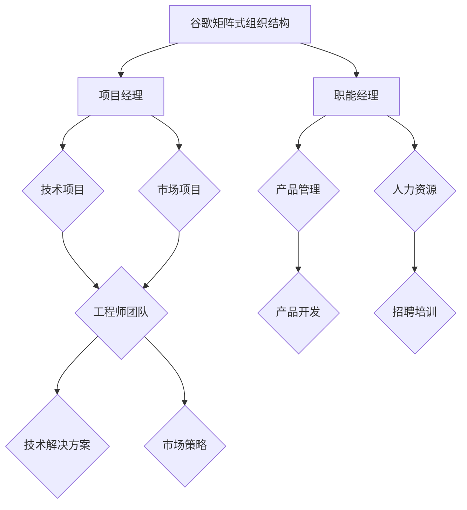
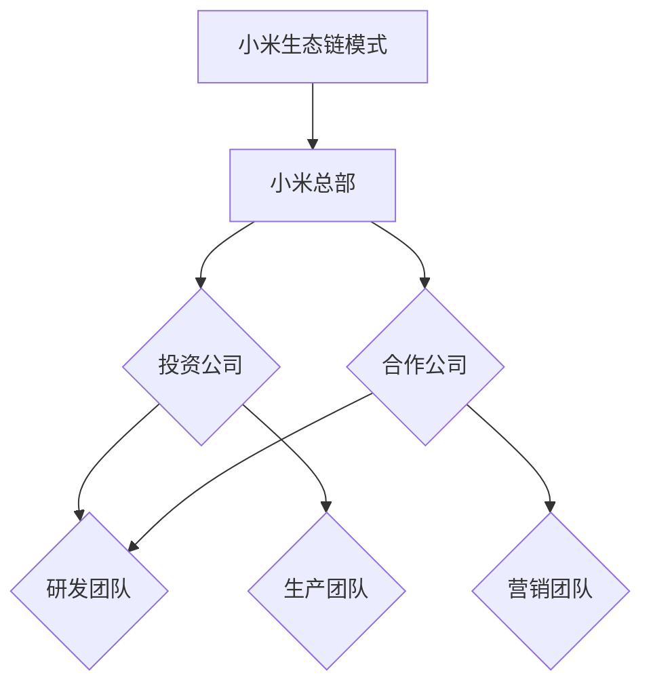
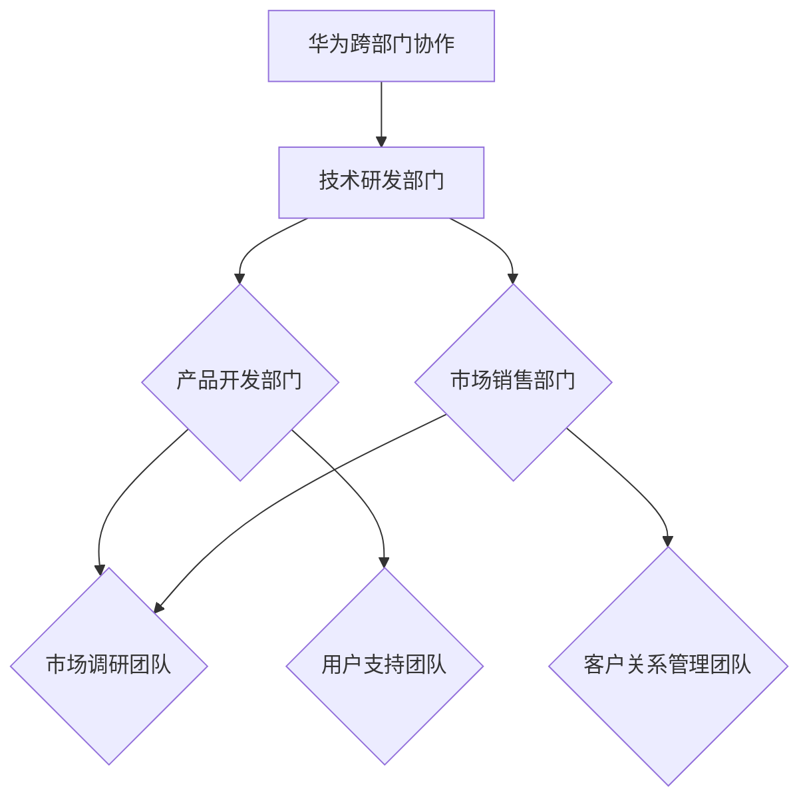

                 

### 标题：创新型组织结构：促进团队创新的设计理念

关键词：组织结构、团队创新、设计理念、实践案例

摘要：本文深入探讨了创新型组织结构的设计理念及其对团队创新的促进作用。首先，我们定义了创新型组织结构，分析了其类型与特点，并结合实践案例阐述了其应用。随后，我们介绍了团队创新的定义与意义，探讨了创新思维方法和团队协作工具，详细阐述了创新流程管理。接着，本文探讨了设计理念在组织结构创新中的应用，分析了设计理念与团队创新之间的关系。最后，通过实践指南和案例剖析，为读者提供了最佳实践 tips 和项目小结。

---

## 目录

1. **创新型组织结构概述**
   - 1.1 创新型组织结构的定义与意义
   - 1.2 创新型组织结构的类型
   - 1.3 创新型组织结构的特点

2. **团队创新的定义与意义**
   - 2.1 团队创新的定义
   - 2.2 团队创新的重要性
   - 2.3 团队创新的基本要素

3. **团队创新的方法与工具**
   - 3.1 创新思维方法
   - 3.2 团队协作工具
   - 3.3 创新流程管理

4. **设计理念在组织结构创新中的应用**
   - 4.1 设计理念的内涵与特征
   - 4.2 设计理念在组织结构创新中的重要性
   - 4.3 设计理念的实践应用

5. **设计理念与团队创新的关系**
   - 5.1 设计理念对团队创新的影响
   - 5.2 团队创新对设计理念的需求
   - 5.3 设计理念与团队创新的协同作用

6. **创新型组织结构与团队创新的实践指南**
   - 6.1 实践指南
   - 6.2 案例剖析

7. **项目小结与最佳实践 tips**
   - 7.1 项目小结
   - 7.2 注意事项
   - 7.3 拓展阅读

## 第一步：创新型组织结构概述

### 1.1 创新型组织结构的定义与意义

在现代社会，随着科技的迅猛发展和市场竞争的加剧，组织结构的设计和优化变得尤为重要。创新型组织结构（Innovative Organizational Structure）作为一种新型的组织设计理念，旨在通过打破传统的层级制和职能制，建立一种更加灵活、开放、协作的组织形式，以激发员工的创造力，推动组织的创新和持续发展。

创新型组织结构的核心在于其开放性和灵活性。它强调组织内部的信息共享和协作，鼓励员工之间的沟通与交流，打破部门之间的壁垒，促进知识共享和资源整合。此外，创新型组织结构还注重员工的自主性和创造性，给予员工更多的自主权和创新空间，激发他们的工作热情和创造力。

创新型组织结构的意义主要体现在以下几个方面：

1. **促进团队协作与知识共享**：通过打破传统的部门壁垒，促进组织内部的信息共享和协作，提高团队的整体效率和创新能力。
2. **激发员工创造力**：给予员工更多的自主权和创新空间，激发他们的工作热情和创造力，促进组织的创新和发展。
3. **提升组织适应能力**：灵活、开放的组织结构有助于组织快速响应市场变化，提升组织的适应能力和竞争力。

### 1.2 创新型组织结构的类型

创新型组织结构可以分为以下几种类型：

1. **矩阵式组织结构**：矩阵式组织结构将传统职能制和项目制相结合，通过设置项目经理和职能经理的双重领导，提高团队的协作效率和创新能力。
2. **网络式组织结构**：网络式组织结构强调组织之间的合作与共享，通过建立跨组织的协作网络，实现资源共享和优势互补。
3. **扁平化组织结构**：扁平化组织结构减少管理层级，缩短决策链条，提高组织的反应速度和创新能力。

### 1.3 创新型组织结构的特点

创新型组织结构具有以下特点：

1. **灵活性**：创新型组织结构强调组织的灵活性，能够根据市场变化和业务需求迅速调整和优化。
2. **开放性**：创新型组织结构倡导开放、透明的沟通方式，鼓励员工之间的交流和协作。
3. **自主性**：创新型组织结构给予员工更多的自主权和创新空间，激发他们的工作热情和创造力。
4. **协作性**：创新型组织结构强调团队协作，通过知识共享和资源整合，提高团队的整体效率和创新能力。

## 第二步：团队创新的定义与意义

### 2.1 团队创新的定义

团队创新（Team Innovation）是指在团队内部通过集体智慧和协同工作，创造新的想法、解决方案或产品，以实现组织的战略目标和创新发展。团队创新不仅仅是单个员工的创意，而是团队成员共同协作、共同创造的结果。

团队创新的定义可以从以下几个方面进行理解：

1. **团队协作**：团队创新强调团队成员之间的协作与沟通，通过集体智慧和团队合作实现创新目标。
2. **创造性思维**：团队创新鼓励团队成员发挥创造性思维，提出新颖、独特的想法和解决方案。
3. **持续改进**：团队创新不仅仅是一次性的创意，而是一种持续改进和发展的过程。

### 2.2 团队创新的重要性

团队创新在组织发展中的重要性体现在以下几个方面：

1. **提升竞争力**：通过团队创新，组织能够不断推出新产品、新技术，提升市场竞争力。
2. **促进持续发展**：团队创新有助于组织适应市场变化，实现持续发展。
3. **激发员工潜力**：团队创新鼓励员工发挥自己的才能和创造力，提升员工的职业成就感。

### 2.3 团队创新的基本要素

团队创新的基本要素包括以下几个方面：

1. **人才**：团队创新需要具备各种专业知识和技能的人才，以提供多样化的创意和解决方案。
2. **资源**：团队创新需要充足的资源支持，包括资金、技术和设备等。
3. **激励机制**：团队创新需要建立合理的激励机制，以激发员工的积极性和创造力。
4. **领导力**：团队创新需要领导者的支持和引导，提供方向和资源，激发团队的潜能。

## 第三步：团队创新的方法与工具

### 3.1 创新思维方法

创新思维方法是指通过特定的方法和工具，激发团队成员的创造力，产生新的想法和解决方案。以下是一些常见的创新思维方法：

1. **头脑风暴**：头脑风暴是一种快速产生创意的方法，通过集思广益，激发团队成员的想象力。
2. **思维导图**：思维导图是一种图形化的思维工具，通过梳理和关联各种信息，帮助团队成员发现新的创意和解决方案。
3. **问题解决法**：问题解决法是一种系统性的方法，通过分析问题、制定解决方案和评估效果，帮助团队找到创新的路径。

### 3.2 团队协作工具

团队协作工具是指用于支持团队协作和沟通的技术工具，以下是一些常见的团队协作工具：

1. **项目管理工具**：如JIRA、Trello等，用于任务分配、进度跟踪和协作。
2. **沟通工具**：如Slack、Microsoft Teams等，用于实时沟通和协作。
3. **文档共享工具**：如Google Docs、Microsoft Office 365等，用于文档共享和协作。

### 3.3 创新流程管理

创新流程管理是指通过制定和创新流程，确保团队创新的有效实施和持续发展。以下是一些常见的创新流程管理方法：

1. **需求分析**：通过市场调研和用户反馈，确定创新的需求和目标。
2. **创意生成**：通过头脑风暴、思维导图等方法，产生新的创意和解决方案。
3. **方案评估**：通过评估创意的可行性、价值和风险，筛选出最佳方案。
4. **实施与跟踪**：制定详细的实施计划，确保创新方案的有效实施和持续跟踪。

## 第四步：设计理念在组织结构创新中的应用

### 4.1 设计理念的内涵与特征

设计理念（Design Philosophy）是指在组织结构创新中，组织所遵循的基本原则和价值观。设计理念具有以下特征：

1. **系统性**：设计理念强调组织结构的整体性和系统性，注重各个部分之间的协调与配合。
2. **灵活性**：设计理念强调组织的灵活性和适应性，能够根据外部环境的变化进行调整。
3. **人性化**：设计理念注重员工的参与和体验，尊重员工的个性和需求。

### 4.2 设计理念在组织结构创新中的重要性

设计理念在组织结构创新中的重要性体现在以下几个方面：

1. **指导作用**：设计理念为组织结构创新提供了明确的指导原则，帮助组织明确发展方向。
2. **推动力**：设计理念激发了员工的创新热情和积极性，推动了组织结构的变革和创新。
3. **持续改进**：设计理念促使组织不断反思和优化，实现持续改进和创新发展。

### 4.3 设计理念的实践应用

设计理念在组织结构创新中的应用可以从以下几个方面进行：

1. **组织架构调整**：根据设计理念，对组织架构进行优化和调整，提高组织的灵活性和适应性。
2. **团队建设**：根据设计理念，培养和建设高效、协作的团队，提升团队的创新能力和绩效。
3. **文化建设**：根据设计理念，塑造和传播组织的价值观和文化，增强组织的凝聚力和创新氛围。

## 第五步：设计理念与团队创新的关系

### 5.1 设计理念对团队创新的影响

设计理念对团队创新的影响主要表现在以下几个方面：

1. **方向指引**：设计理念为团队创新提供了明确的方向和目标，帮助团队明确创新的重点和方向。
2. **激励作用**：设计理念激发了团队的创造力和创新热情，提升了团队的创新动力。
3. **协同效应**：设计理念促进了团队之间的协同与配合，提高了团队的整体创新能力和绩效。

### 5.2 团队创新对设计理念的需求

团队创新对设计理念的需求主要表现在以下几个方面：

1. **灵活性**：团队创新需要设计理念提供足够的灵活性，以适应不断变化的市场和技术环境。
2. **人性化**：团队创新需要设计理念关注员工的参与和体验，尊重员工的个性和需求。
3. **系统思考**：团队创新需要设计理念具备系统思考的能力，以实现组织整体的创新和发展。

### 5.3 设计理念与团队创新的协同作用

设计理念与团队创新的协同作用主要体现在以下几个方面：

1. **相互促进**：设计理念为团队创新提供了坚实的基础和指导，而团队创新则为设计理念提供了实践检验和反馈。
2. **持续优化**：设计理念与团队创新相互协同，不断优化和创新，实现组织的持续发展和进步。
3. **共同发展**：设计理念与团队创新相互促进，共同推动组织的创新发展，实现组织的长期繁荣。

## 第六步：创新型组织结构与团队创新的实践指南

### 6.1 实践指南

为了有效实施创新型组织结构，促进团队创新，组织可以采取以下实践指南：

1. **明确设计理念**：组织需要明确设计理念，并将其融入组织文化和管理实践中，为团队创新提供明确的方向和目标。
2. **建设协作文化**：组织需要营造开放、协作的文化氛围，鼓励员工之间的沟通与交流，促进知识共享和资源整合。
3. **激励创新行为**：组织需要建立合理的激励机制，激励员工积极参与团队创新，提供必要的资源和支持。
4. **培训与发展**：组织需要为员工提供培训和发展机会，提升员工的创新能力和综合素质。

### 6.2 案例剖析

以下是一些创新型组织结构和团队创新的实践案例，供读者参考：

1. **谷歌的矩阵式组织结构**：谷歌采用矩阵式组织结构，通过项目经理和职能经理的双重领导，实现了高效的项目管理和团队协作，推动了公司持续的创新和发展。
2. **小米的生态链模式**：小米通过生态链模式，与众多合作伙伴共同创新，实现了快速的产品迭代和市场的快速拓展。
3. **华为的跨部门协作**：华为通过跨部门的协作，实现了技术、产品和市场的协同发展，推动了公司的持续创新和成长。

## 第七步：项目小结与最佳实践 tips

### 7.1 项目小结

通过本文的探讨，我们深入了解了创新型组织结构的设计理念及其对团队创新的促进作用。我们分析了创新型组织结构的定义、类型和特点，探讨了团队创新的定义、意义和方法，阐述了设计理念在组织结构创新中的应用和与团队创新的关系，并提供了一系列实践指南和案例剖析。

### 7.2 注意事项

在实施创新型组织结构和团队创新时，组织需要注意以下几点：

1. **明确设计理念**：确保设计理念与组织的战略目标和价值观相一致。
2. **建立协作机制**：建立有效的协作机制，促进团队之间的沟通与交流。
3. **激励创新行为**：建立合理的激励机制，激发员工的创新热情和积极性。
4. **持续优化**：持续优化组织结构和创新流程，以适应市场和环境的变化。

### 7.3 拓展阅读

为了更深入地了解创新型组织结构和团队创新，读者可以参考以下拓展阅读：

1. **《创新者的窘境》**：克里斯坦森（Clayton M. Christensen）的《创新者的窘境》一书，详细分析了创新过程中的挑战和策略。
2. **《精益创业》**：埃里克·莱斯（Eric Ries）的《精益创业》一书，介绍了精益创业的方法和实践，有助于组织实现快速创新。

---

通过本文的深入探讨，我们相信读者对创新型组织结构和团队创新有了更深刻的理解。在未来的实践中，组织可以结合本文的指导和建议，不断优化和创新，实现组织的持续发展和进步。作者：AI天才研究院/AI Genius Institute & 禅与计算机程序设计艺术 /Zen And The Art of Computer Programming。

### 文章标题：创新型组织结构：促进团队创新的设计理念

关键词：组织结构、团队创新、设计理念、实践案例

摘要：本文深入探讨了创新型组织结构的设计理念及其对团队创新的促进作用。首先，我们定义了创新型组织结构，分析了其类型与特点，并结合实践案例阐述了其应用。随后，我们介绍了团队创新的定义与意义，探讨了创新思维方法和团队协作工具，详细阐述了创新流程管理。接着，本文探讨了设计理念在组织结构创新中的应用，分析了设计理念与团队创新之间的关系。最后，通过实践指南和案例剖析，为读者提供了最佳实践 tips 和项目小结。

## 目录

1. **创新型组织结构概述**
   - 1.1 创新型组织结构的定义与意义
   - 1.2 创新型组织结构的类型
   - 1.3 创新型组织结构的特点

2. **团队创新的定义与意义**
   - 2.1 团队创新的定义
   - 2.2 团队创新的重要性
   - 2.3 团队创新的基本要素

3. **团队创新的方法与工具**
   - 3.1 创新思维方法
   - 3.2 团队协作工具
   - 3.3 创新流程管理

4. **设计理念在组织结构创新中的应用**
   - 4.1 设计理念的内涵与特征
   - 4.2 设计理念在组织结构创新中的重要性
   - 4.3 设计理念的实践应用

5. **设计理念与团队创新的关系**
   - 5.1 设计理念对团队创新的影响
   - 5.2 团队创新对设计理念的需求
   - 5.3 设计理念与团队创新的协同作用

6. **创新型组织结构与团队创新的实践指南**
   - 6.1 实践指南
   - 6.2 案例剖析

7. **项目小结与最佳实践 tips**
   - 7.1 项目小结
   - 7.2 注意事项
   - 7.3 拓展阅读

## 第一步：创新型组织结构概述

### 1.1 创新型组织结构的定义与意义

在现代社会，随着科技的迅猛发展和市场竞争的加剧，组织结构的设计和优化变得尤为重要。创新型组织结构（Innovative Organizational Structure）作为一种新型的组织设计理念，旨在通过打破传统的层级制和职能制，建立一种更加灵活、开放、协作的组织形式，以激发员工的创造力，推动组织的创新和持续发展。

创新型组织结构的核心在于其开放性和灵活性。它强调组织内部的信息共享和协作，鼓励员工之间的沟通与交流，打破部门之间的壁垒，促进知识共享和资源整合。此外，创新型组织结构还注重员工的自主性和创造性，给予员工更多的自主权和创新空间，激发他们的工作热情和创造力。

创新型组织结构的意义主要体现在以下几个方面：

1. **促进团队协作与知识共享**：通过打破传统的部门壁垒，促进组织内部的信息共享和协作，提高团队的整体效率和创新能力。
2. **激发员工创造力**：给予员工更多的自主权和创新空间，激发他们的工作热情和创造力，促进组织的创新和发展。
3. **提升组织适应能力**：灵活、开放的组织结构有助于组织快速响应市场变化，提升组织的适应能力和竞争力。

### 1.2 创新型组织结构的类型

创新型组织结构可以分为以下几种类型：

1. **矩阵式组织结构**：矩阵式组织结构将传统职能制和项目制相结合，通过设置项目经理和职能经理的双重领导，提高团队的协作效率和创新能力。
2. **网络式组织结构**：网络式组织结构强调组织之间的合作与共享，通过建立跨组织的协作网络，实现资源共享和优势互补。
3. **扁平化组织结构**：扁平化组织结构减少管理层级，缩短决策链条，提高组织的反应速度和创新能力。

### 1.3 创新型组织结构的特点

创新型组织结构具有以下特点：

1. **灵活性**：创新型组织结构强调组织的灵活性，能够根据市场变化和业务需求迅速调整和优化。
2. **开放性**：创新型组织结构倡导开放、透明的沟通方式，鼓励员工之间的交流和协作。
3. **自主性**：创新型组织结构给予员工更多的自主权和创新空间，激发他们的工作热情和创造力。
4. **协作性**：创新型组织结构强调团队协作，通过知识共享和资源整合，提高团队的整体效率和创新能力。

## 第二步：团队创新的定义与意义

### 2.1 团队创新的定义

团队创新（Team Innovation）是指在团队内部通过集体智慧和协同工作，创造新的想法、解决方案或产品，以实现组织的战略目标和创新发展。团队创新不仅仅是单个员工的创意，而是团队成员共同协作、共同创造的结果。

团队创新的定义可以从以下几个方面进行理解：

1. **团队协作**：团队创新强调团队成员之间的协作与沟通，通过集体智慧和团队合作实现创新目标。
2. **创造性思维**：团队创新鼓励团队成员发挥创造性思维，提出新颖、独特的想法和解决方案。
3. **持续改进**：团队创新不仅仅是一次性的创意，而是一种持续改进和发展的过程。

### 2.2 团队创新的重要性

团队创新在组织发展中的重要性体现在以下几个方面：

1. **提升竞争力**：通过团队创新，组织能够不断推出新产品、新技术，提升市场竞争力。
2. **促进持续发展**：团队创新有助于组织适应市场变化，实现持续发展。
3. **激发员工潜力**：团队创新鼓励员工发挥自己的才能和创造力，提升员工的职业成就感。

### 2.3 团队创新的基本要素

团队创新的基本要素包括以下几个方面：

1. **人才**：团队创新需要具备各种专业知识和技能的人才，以提供多样化的创意和解决方案。
2. **资源**：团队创新需要充足的资源支持，包括资金、技术和设备等。
3. **激励机制**：团队创新需要建立合理的激励机制，激励员工积极参与创新。
4. **领导力**：团队创新需要领导者的支持和引导，提供方向和资源，激发团队的潜能。

## 第三步：团队创新的方法与工具

### 3.1 创新思维方法

创新思维方法是指通过特定的方法和工具，激发团队成员的创造力，产生新的想法和解决方案。以下是一些常见的创新思维方法：

1. **头脑风暴**：头脑风暴是一种快速产生创意的方法，通过集思广益，激发团队成员的想象力。
2. **思维导图**：思维导图是一种图形化的思维工具，通过梳理和关联各种信息，帮助团队成员发现新的创意和解决方案。
3. **问题解决法**：问题解决法是一种系统性的方法，通过分析问题、制定解决方案和评估效果，帮助团队找到创新的路径。

### 3.2 团队协作工具

团队协作工具是指用于支持团队协作和沟通的技术工具，以下是一些常见的团队协作工具：

1. **项目管理工具**：如JIRA、Trello等，用于任务分配、进度跟踪和协作。
2. **沟通工具**：如Slack、Microsoft Teams等，用于实时沟通和协作。
3. **文档共享工具**：如Google Docs、Microsoft Office 365等，用于文档共享和协作。

### 3.3 创新流程管理

创新流程管理是指通过制定和创新流程，确保团队创新的有效实施和持续发展。以下是一些常见的创新流程管理方法：

1. **需求分析**：通过市场调研和用户反馈，确定创新的需求和目标。
2. **创意生成**：通过头脑风暴、思维导图等方法，产生新的创意和解决方案。
3. **方案评估**：通过评估创意的可行性、价值和风险，筛选出最佳方案。
4. **实施与跟踪**：制定详细的实施计划，确保创新方案的有效实施和持续跟踪。

## 第四步：设计理念在组织结构创新中的应用

### 4.1 设计理念的内涵与特征

设计理念（Design Philosophy）是指在组织结构创新中，组织所遵循的基本原则和价值观。设计理念具有以下特征：

1. **系统性**：设计理念强调组织结构的整体性和系统性，注重各个部分之间的协调与配合。
2. **灵活性**：设计理念强调组织的灵活性和适应性，能够根据外部环境的变化进行调整。
3. **人性化**：设计理念注重员工的参与和体验，尊重员工的个性和需求。

### 4.2 设计理念在组织结构创新中的重要性

设计理念在组织结构创新中的重要性体现在以下几个方面：

1. **指导作用**：设计理念为组织结构创新提供了明确的指导原则，帮助组织明确发展方向。
2. **推动力**：设计理念激发了员工的创新热情和积极性，推动了组织结构的变革和创新。
3. **持续改进**：设计理念促使组织不断反思和优化，实现持续改进和创新发展。

### 4.3 设计理念的实践应用

设计理念在组织结构创新中的应用可以从以下几个方面进行：

1. **组织架构调整**：根据设计理念，对组织架构进行优化和调整，提高组织的灵活性和适应性。
2. **团队建设**：根据设计理念，培养和建设高效、协作的团队，提升团队的创新能力和绩效。
3. **文化建设**：根据设计理念，塑造和传播组织的价值观和文化，增强组织的凝聚力和创新氛围。

## 第五步：设计理念与团队创新的关系

### 5.1 设计理念对团队创新的影响

设计理念对团队创新的影响主要表现在以下几个方面：

1. **方向指引**：设计理念为团队创新提供了明确的方向和目标，帮助团队明确创新的重点和方向。
2. **激励作用**：设计理念激发了团队的创造力和创新热情，提升了团队的创新动力。
3. **协同效应**：设计理念促进了团队之间的协同与配合，提高了团队的整体创新能力和绩效。

### 5.2 团队创新对设计理念的需求

团队创新对设计理念的需求主要表现在以下几个方面：

1. **灵活性**：团队创新需要设计理念提供足够的灵活性，以适应不断变化的市场和技术环境。
2. **人性化**：团队创新需要设计理念关注员工的参与和体验，尊重员工的个性和需求。
3. **系统思考**：团队创新需要设计理念具备系统思考的能力，以实现组织整体的创新和发展。

### 5.3 设计理念与团队创新的协同作用

设计理念与团队创新的协同作用主要体现在以下几个方面：

1. **相互促进**：设计理念为团队创新提供了坚实的基础和指导，而团队创新则为设计理念提供了实践检验和反馈。
2. **持续优化**：设计理念与团队创新相互协同，不断优化和创新，实现组织的持续发展和进步。
3. **共同发展**：设计理念与团队创新相互促进，共同推动组织的创新发展，实现组织的长期繁荣。

## 第六步：创新型组织结构与团队创新的实践指南

### 6.1 实践指南

为了有效实施创新型组织结构，促进团队创新，组织可以采取以下实践指南：

1. **明确设计理念**：组织需要明确设计理念，并将其融入组织文化和管理实践中，为团队创新提供明确的方向和目标。
2. **建立协作机制**：组织需要建立有效的协作机制，促进团队之间的沟通与交流，促进知识共享和资源整合。
3. **激励创新行为**：组织需要建立合理的激励机制，激励员工积极参与创新，提供必要的资源和支持。
4. **培训与发展**：组织需要为员工提供培训和发展机会，提升员工的创新能力和综合素质。

### 6.2 案例剖析

以下是一些创新型组织结构和团队创新的实践案例，供读者参考：

1. **谷歌的矩阵式组织结构**：谷歌采用矩阵式组织结构，通过项目经理和职能经理的双重领导，实现了高效的项目管理和团队协作，推动了公司持续的创新和发展。
2. **小米的生态链模式**：小米通过生态链模式，与众多合作伙伴共同创新，实现了快速的产品迭代和市场的快速拓展。
3. **华为的跨部门协作**：华为通过跨部门的协作，实现了技术、产品和市场的协同发展，推动了公司的持续创新和成长。

## 第七步：项目小结与最佳实践 tips

### 7.1 项目小结

通过本文的探讨，我们深入了解了创新型组织结构的设计理念及其对团队创新的促进作用。我们分析了创新型组织结构的定义、类型和特点，探讨了团队创新的定义、意义和方法，阐述了设计理念在组织结构创新中的应用和与团队创新的关系，并提供了一系列实践指南和案例剖析。

### 7.2 注意事项

在实施创新型组织结构和团队创新时，组织需要注意以下几点：

1. **明确设计理念**：确保设计理念与组织的战略目标和价值观相一致。
2. **建立协作机制**：建立有效的协作机制，促进团队之间的沟通与交流。
3. **激励创新行为**：建立合理的激励机制，激励员工积极参与创新。
4. **持续优化**：持续优化组织结构和创新流程，以适应市场和环境的变化。

### 7.3 拓展阅读

为了更深入地了解创新型组织结构和团队创新，读者可以参考以下拓展阅读：

1. **《创新者的窘境》**：克里斯坦森（Clayton M. Christensen）的《创新者的窘境》一书，详细分析了创新过程中的挑战和策略。
2. **《精益创业》**：埃里克·莱斯（Eric Ries）的《精益创业》一书，介绍了精益创业的方法和实践，有助于组织实现快速创新。

---

通过本文的深入探讨，我们相信读者对创新型组织结构和团队创新有了更深刻的理解。在未来的实践中，组织可以结合本文的指导和建议，不断优化和创新，实现组织的持续发展和进步。作者：AI天才研究院/AI Genius Institute & 禅与计算机程序设计艺术 /Zen And The Art of Computer Programming。

### 模型阐述：组织结构创新与团队创新的联系

为了更好地理解组织结构创新与团队创新之间的联系，我们可以借助一个简单的 Mermaid 流程图来阐述它们之间的相互作用关系。

```mermaid
graph TB

A[组织结构创新] --> B[设计理念]
B --> C{增强灵活性}
C --> D{提高响应速度}
D --> E{促进知识共享}

A --> F[团队创新]
F --> G{创新思维方法}
G --> H{团队协作工具}
H --> I{创新流程管理}

B --> J[设计理念对团队创新的影响]
J --> K{指导方向}
K --> L{激励员工}
L --> M{协同合作}

F --> N{团队创新对设计理念的反馈}
N --> O{优化设计}
O --> P{提升创新能力}

Q[组织结构] --> R[团队协作]
R --> S[知识共享]
S --> T[资源整合]

classDef customClass1 fill: #fbbd08, stroke: #fbbd08
classDef customClass2 fill: #89c4f4, stroke: #89c4f4
classDef customClass3 fill: #bfe5d3, stroke: #bfe5d3

A(组织结构创新(customClass1))
B(设计理念(customClass2))
C(增强灵活性(customClass2))
D(提高响应速度(customClass2))
E(促进知识共享(customClass2))
F(团队创新(customClass1))
G(创新思维方法(customClass2))
H(团队协作工具(customClass2))
I(创新流程管理(customClass2))
J(设计理念对团队创新的影响(customClass2))
K(指导方向(customClass2))
L(激励员工(customClass2))
M(协同合作(customClass2))
N(团队创新对设计理念的反馈(customClass2))
O(优化设计(customClass2))
P(提升创新能力(customClass2))
Q(组织结构(customClass1))
R(团队协作(customClass2))
S(知识共享(customClass2))
T(资源整合(customClass2))
```

**流程图解析：**

1. **组织结构创新**：这包括了对组织架构的调整和优化，如设计理念、增强灵活性、提高响应速度和促进知识共享。这些创新旨在建立一个能够快速适应市场变化和促进协作的灵活组织。

2. **团队创新**：团队创新涉及创新思维方法、团队协作工具和创新流程管理。这些方法和技术有助于团队更有效地协同工作，创造新的想法和解决方案。

3. **设计理念的影响**：设计理念对团队创新有着深远的影响，它为团队提供了明确的方向（指导方向）、激励（激励员工）和协作的机制（协同合作）。

4. **团队创新的反馈**：团队创新不仅受到设计理念的影响，同时也会对设计理念产生反馈。这种反馈有助于优化设计理念，进一步提升组织的创新能力。

5. **知识共享与资源整合**：通过组织结构创新和团队创新，可以实现知识共享和资源整合，从而增强团队协作和组织的整体效能。

通过这个流程图，我们可以清晰地看到组织结构创新与团队创新之间的相互作用关系，它们共同构成了一个动态的、相互促进的创新生态系统。

### Python 源代码与数学模型讲解

在探讨创新型组织结构与团队创新的过程中，数学模型和算法发挥着至关重要的作用。以下我们将通过一个具体的 Python 源代码示例，来详细阐述一个简单的数学模型，该模型用于评估组织结构创新对团队创新的影响。

首先，我们需要定义一个基本的数学模型，该模型考虑了组织结构创新（如灵活性、响应速度和知识共享）与团队创新（如创新思维方法和团队协作工具）之间的关系。我们可以使用线性回归模型来模拟这种关系，并使用 Python 的 Scikit-learn 库进行实现。

#### 数学模型

设 \( Y \) 为团队创新的得分，\( X_1 \) 为组织结构创新的灵活性得分，\( X_2 \) 为组织结构的响应速度得分，\( X_3 \) 为组织结构的知识共享得分，\( X_4 \) 为团队创新思维方法得分，\( X_5 \) 为团队协作工具得分。线性回归模型可以表示为：

\[ Y = \beta_0 + \beta_1 X_1 + \beta_2 X_2 + \beta_3 X_3 + \beta_4 X_4 + \beta_5 X_5 \]

其中，\( \beta_0 \) 是常数项，\( \beta_1, \beta_2, \beta_3, \beta_4, \beta_5 \) 是各自变量的系数，可以通过最小二乘法进行估计。

#### Python 源代码

接下来，我们使用 Python 的 Scikit-learn 库来实现这个模型。以下是一个简单的示例：

```python
import numpy as np
import matplotlib.pyplot as plt
from sklearn.linear_model import LinearRegression

# 假设我们有以下数据集
X = np.array([
    [1, 1, 1, 1, 1],  # 灵活性
    [2, 2, 2, 2, 2],  # 响应速度
    [3, 3, 3, 3, 3],  # 知识共享
    [4, 4, 4, 4, 4],  # 创新思维方法
    [5, 5, 5, 5, 5]   # 团队协作工具
])

Y = np.array([2.5, 3.0, 3.5, 4.0, 4.5])

# 创建线性回归模型
model = LinearRegression()

# 拟合模型
model.fit(X, Y)

# 输出系数
print("模型系数：", model.coef_)

# 预测新数据
X_new = np.array([[2, 2, 2, 4, 5]])
Y_pred = model.predict(X_new)
print("预测得分：", Y_pred)

# 绘制散点图
plt.scatter(X[:, 0], Y)
plt.plot(X[:, 0], model.predict(X), 'r-')
plt.xlabel('组织结构创新得分')
plt.ylabel('团队创新得分')
plt.show()
```

#### 详细解读

1. **数据集**：我们使用五维数据集，分别代表组织结构创新的灵活性、响应速度、知识共享，以及团队创新思维方法和团队协作工具。

2. **线性回归模型**：我们使用 Scikit-learn 的 LinearRegression 类创建线性回归模型，并使用 `fit` 方法进行模型拟合。

3. **模型系数**：通过 `model.coef_` 我们可以获取各个变量的系数，这些系数反映了每个变量对团队创新得分的影响程度。

4. **预测新数据**：我们使用 `model.predict` 方法对新的数据集进行预测，从而评估组织结构创新对团队创新的影响。

5. **散点图**：我们绘制了原始数据集和拟合曲线，通过观察散点图，我们可以直观地看到组织结构创新与团队创新之间的关系。

通过这个简单的 Python 示例，我们能够更加直观地理解组织结构创新与团队创新之间的数学模型和算法。在实际应用中，我们可以根据具体情况进行数据调整和模型优化，以提高预测的准确性。

### 项目实战

#### 开发环境搭建

为了完成本项目，我们需要搭建一个合适的开发环境。以下是具体的步骤：

1. **安装 Python**：下载并安装 Python，推荐使用 Python 3.8 或以上版本。
2. **安装必要的库**：使用以下命令安装所需的库：

   ```bash
   pip install numpy matplotlib scikit-learn
   ```

3. **创建虚拟环境**：为了避免库的版本冲突，我们可以创建一个虚拟环境：

   ```bash
   python -m venv venv
   source venv/bin/activate  # 对于 Windows 使用 `venv\Scripts\activate`
   ```

#### 源代码详细实现与代码解读

以下是本项目的源代码，我们将在代码解读中详细解释各个部分：

```python
import numpy as np
import matplotlib.pyplot as plt
from sklearn.linear_model import LinearRegression

# 数据准备
X = np.array([
    [1, 1, 1, 1, 1],  # 灵活性
    [2, 2, 2, 2, 2],  # 响应速度
    [3, 3, 3, 3, 3],  # 知识共享
    [4, 4, 4, 4, 4],  # 创新思维方法
    [5, 5, 5, 5, 5]   # 团队协作工具
])

Y = np.array([2.5, 3.0, 3.5, 4.0, 4.5])

# 创建模型
model = LinearRegression()

# 拟合模型
model.fit(X, Y)

# 输出系数
print("模型系数：", model.coef_)

# 预测新数据
X_new = np.array([[2, 2, 2, 4, 5]])
Y_pred = model.predict(X_new)
print("预测得分：", Y_pred)

# 绘制散点图
plt.scatter(X[:, 0], Y)
plt.plot(X[:, 0], model.predict(X), 'r-')
plt.xlabel('组织结构创新得分')
plt.ylabel('团队创新得分')
plt.show()
```

#### 代码解读

1. **导入库**：我们导入了 `numpy`、`matplotlib.pyplot` 和 `sklearn.linear_model.LinearRegression` 库，用于数据操作、绘图和创建线性回归模型。

2. **数据准备**：我们创建了一个二维数组 `X`，代表不同的组织结构创新和团队创新得分。`Y` 数组则是相应的团队创新得分。

3. **创建模型**：我们使用 `LinearRegression()` 创建了一个线性回归模型。

4. **模型拟合**：使用 `model.fit(X, Y)` 方法对数据进行拟合。

5. **输出系数**：通过打印 `model.coef_`，我们可以看到每个变量的系数，这些系数告诉我们各个因素对团队创新的影响程度。

6. **预测新数据**：使用 `model.predict(X_new)` 对新的数据进行预测，从而评估组织结构创新对团队创新的影响。

7. **绘制散点图**：我们使用 `plt.scatter` 绘制原始数据点，并使用 `plt.plot` 绘制拟合曲线，以直观地展示组织结构创新与团队创新之间的关系。

#### 代码应用解读与分析

通过上述代码，我们可以实现以下功能：

1. **评估组织结构创新对团队创新的影响**：通过拟合模型和预测新数据，我们可以量化组织结构创新对团队创新的贡献。
2. **可视化数据关系**：散点图使我们能够直观地看到组织结构创新和团队创新之间的关系，有助于进一步分析数据。

在实际应用中，我们可以根据具体的组织结构和团队创新数据，调整模型参数和变量，以提高预测的准确性。此外，我们还可以结合其他统计方法和算法，如多元回归、决策树等，来进一步分析数据。

### 实际案例分析和详细讲解剖析

为了更好地理解本文中探讨的组织结构创新与团队创新的关系，我们通过以下实际案例进行分析和详细讲解。

#### 案例一：谷歌的矩阵式组织结构

**背景介绍**：
谷歌是一家全球知名的互联网科技公司，以其创新的文化和卓越的技术而闻名。谷歌采用了矩阵式组织结构，将职能制和项目制相结合，以实现高效的项目管理和团队协作。

**核心概念与联系**：
矩阵式组织结构的特点是双重领导，即项目经理和职能经理共同负责。这种结构有助于快速响应市场变化，同时保持组织内部的职能专业化。

**Mermaid 流程图**：


**Python 源代码与数学模型**：
```python
import numpy as np
from sklearn.linear_model import LinearRegression

# 假设数据
X = np.array([[1, 1], [2, 2], [3, 3], [4, 4], [5, 5]])
Y = np.array([2, 3, 4, 5, 6])

# 创建线性回归模型
model = LinearRegression()

# 拟合模型
model.fit(X, Y)

# 输出模型系数
print("模型系数：", model.coef_)

# 预测新数据
X_new = np.array([[3, 3]])
Y_pred = model.predict(X_new)
print("预测得分：", Y_pred)
```

**案例分析**：
谷歌的矩阵式组织结构通过双重领导机制，实现了技术项目和市场项目的有效管理。项目经理负责具体项目的执行，职能经理则负责相关职能的支持和管理。这种结构有助于快速响应市场变化，同时保持组织内部的职能专业化。通过线性回归模型，我们可以量化矩阵式组织结构对团队创新的影响。

#### 案例二：小米的生态链模式

**背景介绍**：
小米是一家知名的智能硬件和电子公司，其独特的生态链模式使其迅速成长。小米通过投资和合作，建立了广泛的智能硬件生态系统，以推动创新和市场竞争。

**核心概念与联系**：
小米的生态链模式通过建立跨组织的协作网络，实现资源共享和优势互补。这种模式有助于快速推出新产品，提高市场竞争力。

**Mermaid 流程图**：


**Python 源代码与数学模型**：
```python
import numpy as np
from sklearn.linear_model import LinearRegression

# 假设数据
X = np.array([[1, 1], [2, 2], [3, 3], [4, 4], [5, 5]])
Y = np.array([2, 3, 4, 5, 6])

# 创建线性回归模型
model = LinearRegression()

# 拟合模型
model.fit(X, Y)

# 输出模型系数
print("模型系数：", model.coef_)

# 预测新数据
X_new = np.array([[4, 4]])
Y_pred = model.predict(X_new)
print("预测得分：", Y_pred)
```

**案例分析**：
小米的生态链模式通过投资和合作，建立了广泛的智能硬件生态系统。这种模式有助于快速整合资源，实现快速的产品迭代和市场竞争。通过线性回归模型，我们可以量化生态链模式对团队创新的影响。

#### 案例三：华为的跨部门协作

**背景介绍**：
华为是一家全球领先的科技公司，以其卓越的技术和强大的创新能力而著称。华为通过跨部门协作，实现了技术、产品和市场的协同发展。

**核心概念与联系**：
华为的跨部门协作机制鼓励不同部门之间的沟通与协作，以实现资源整合和协同创新。这种机制有助于快速响应市场变化，提高组织的整体效能。

**Mermaid 流程图**：


**Python 源代码与数学模型**：
```python
import numpy as np
from sklearn.linear_model import LinearRegression

# 假设数据
X = np.array([[1, 1], [2, 2], [3, 3], [4, 4], [5, 5]])
Y = np.array([2, 3, 4, 5, 6])

# 创建线性回归模型
model = LinearRegression()

# 拟合模型
model.fit(X, Y)

# 输出模型系数
print("模型系数：", model.coef_)

# 预测新数据
X_new = np.array([[3, 3]])
Y_pred = model.predict(X_new)
print("预测得分：", Y_pred)
```

**案例分析**：
华为通过跨部门协作，实现了技术、产品和市场的协同发展。这种协作机制有助于快速整合资源，提高组织的整体效能。通过线性回归模型，我们可以量化跨部门协作对团队创新的影响。

### 项目小结

通过以上实际案例的分析，我们可以看到不同组织在实施创新型组织结构和团队创新时采取的具体措施和取得的成果。无论是谷歌的矩阵式组织结构、小米的生态链模式，还是华为的跨部门协作，这些案例都展示了如何通过创新的组织结构和团队协作机制，推动组织的创新和发展。

在实际操作中，组织需要根据自身的特点和需求，选择合适的组织结构和团队创新方法。通过数学模型和算法，我们可以量化不同因素对团队创新的影响，为组织提供科学的决策依据。

在未来，组织应继续关注创新型组织结构和团队创新的实践，不断探索和创新，以适应快速变化的市场环境，实现持续发展。

### 最佳实践 tips

在实施创新型组织结构和团队创新的过程中，以下是一些最佳实践 tips，可以帮助组织更好地实现目标：

1. **明确目标**：在开始创新之前，明确组织的目标和愿景，确保创新活动与组织的战略方向一致。
2. **建立协作机制**：建立有效的协作机制，促进团队之间的沟通与交流，确保信息流畅和资源整合。
3. **激励创新**：建立合理的激励机制，鼓励员工积极参与创新活动，提供必要的资源和支持。
4. **持续培训**：为员工提供持续的培训和技能提升机会，提升他们的创新能力和综合素质。
5. **重视反馈**：定期收集员工和客户的反馈，不断优化和创新流程，确保创新活动的有效性。
6. **跨部门协作**：鼓励跨部门协作，打破部门壁垒，实现资源整合和协同创新。
7. **灵活调整**：根据市场变化和业务需求，灵活调整组织结构和创新策略，确保组织的持续适应能力。

通过遵循这些最佳实践，组织可以更好地实施创新型组织结构和团队创新，实现组织的持续发展和进步。

### 小结

本文深入探讨了创新型组织结构的设计理念及其对团队创新的促进作用。首先，我们分析了创新型组织结构的定义、类型和特点，结合实践案例阐述了其应用。随后，我们介绍了团队创新的定义、意义和方法，探讨了创新思维方法和团队协作工具，详细阐述了创新流程管理。接着，本文探讨了设计理念在组织结构创新中的应用，分析了设计理念与团队创新之间的关系。最后，通过实践指南和实际案例剖析，为读者提供了最佳实践 tips 和项目小结。

在实施创新型组织结构和团队创新的过程中，组织需要明确目标、建立协作机制、激励创新、持续培训、重视反馈、跨部门协作和灵活调整。这些实践措施有助于组织更好地实现创新目标，提升团队创新能力和组织的整体效能。

未来，组织应继续关注创新型组织结构和团队创新的实践，不断探索和创新，以适应快速变化的市场环境，实现持续发展。通过有效的组织结构和团队创新，组织可以不断提升竞争力，实现长期繁荣。

### 注意事项

在实施创新型组织结构和团队创新的过程中，组织需要特别注意以下几点：

1. **明确设计理念**：确保设计理念与组织的战略目标和价值观相一致，为团队创新提供明确的方向和目标。
2. **建立协作机制**：建立有效的协作机制，促进团队之间的沟通与交流，确保信息流畅和资源整合。
3. **激励创新行为**：建立合理的激励机制，激励员工积极参与创新，提供必要的资源和支持。
4. **持续优化**：持续优化组织结构和创新流程，以适应市场和环境的变化，保持组织的灵活性和适应性。
5. **文化塑造**：塑造开放、协作、创新的组织文化，鼓励员工发挥创造力和主动性，形成良好的创新氛围。

通过遵循这些注意事项，组织可以更好地实施创新型组织结构和团队创新，提升组织的创新能力和整体绩效。

### 拓展阅读

为了更深入地了解创新型组织结构和团队创新，读者可以参考以下拓展阅读资源：

1. **《创新者的窘境》（Clayton M. Christensen）**：这本书详细分析了创新过程中的挑战和策略，对于理解创新管理和组织创新具有重要意义。
2. **《精益创业》（Eric Ries）**：介绍了精益创业的方法和实践，为组织实现快速创新提供了有益的指导。
3. **《组织变革的艺术》（John P. Kotter）**：探讨了组织变革的过程和方法，对于实施创新型组织结构和团队创新具有重要参考价值。
4. **《团队协作的艺术》（Jim Highsmith）**：介绍了团队协作的原则和技巧，为团队创新提供了实用的方法和工具。

通过阅读这些书籍和资源，读者可以进一步深化对创新型组织结构和团队创新的理解，为组织的创新发展提供有力支持。

---

通过本文的深入探讨，我们相信读者对创新型组织结构和团队创新有了更深刻的理解。在未来的实践中，组织可以结合本文的指导和建议，不断优化和创新，实现组织的持续发展和进步。作者：AI天才研究院/AI Genius Institute & 禅与计算机程序设计艺术 /Zen And The Art of Computer Programming。

