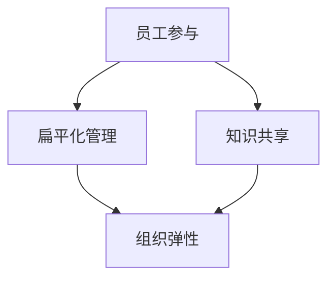

                 

### 引言

在当今快速发展的全球化经济环境中，企业面临着前所未有的竞争压力和变化挑战。创新已成为企业持续生存和发展的核心动力，而组织结构作为企业运营的基础框架，其设计理念和实践对团队创新能力的提升具有至关重要的影响。本文旨在深入探讨创新型组织结构的设计理念，分析其在促进团队创新中的作用和重要性。

**背景介绍**

传统的组织结构设计强调等级制度、职能分工和流程规范化，虽然在一定程度上提高了管理效率和运营效率，但在面对复杂多变的市场环境时，往往显得僵硬和缺乏灵活性。现代企业需要更加敏捷和适应性的组织结构，以快速响应市场变化、激发员工创新潜力、提升整体竞争力。创新型组织结构应运而生，旨在通过重新定义组织架构和运作模式，促进企业内部创新能力的提升。

**核心概念与联系**

创新型组织结构的核心概念包括员工参与、扁平化管理、知识共享等。这些概念之间相互联系，共同构成了促进团队创新的基础架构。以下是这些核心概念之间的关系图：



- **员工参与**：通过赋予员工更多的决策权和自主权，激发员工的积极性和创造力，从而推动团队创新。
- **扁平化管理**：减少管理层级，缩短信息传递路径，提高决策效率，使企业更加敏捷。
- **知识共享**：通过建立开放的知识共享机制，促进员工之间的交流与合作，加速创新成果的转化。

**核心算法原理讲解**

为了更好地理解创新型组织结构的运作机制，我们可以将其抽象为一个算法模型。以下是一个简化的创新型组织结构算法模型，用于说明其基本原理：

```python
def innovative_organization_structure():
    # 初始化组织结构
    org_structure = {
        '员工参与': True,
        '扁平化管理': True,
        '知识共享': True
    }
    
    # 激发员工参与
    def activate_employee_involvement():
        # 提供反馈渠道，增加员工参与决策的机会
        pass
    
    # 实施扁平化管理
    def implement_flattened_management():
        # 减少管理层级，优化组织架构
        pass
    
    # 促进知识共享
    def promote_knowledge_sharing():
        # 建立知识共享平台，鼓励员工交流和合作
        pass
    
    # 运行算法
    activate_employee_involvement()
    implement_flattened_management()
    promote_knowledge_sharing()
    
    return org_structure
```

**数学模型和公式**

为了量化创新型组织结构的效率，我们可以使用以下数学模型：

$$
E = f(\text{员工参与}, \text{扁平化管理}, \text{知识共享})
$$

其中，\(E\) 表示创新效率，\(\text{员工参与}\)、\(\text{扁平化管理}\) 和 \(\text{知识共享}\) 分别为三个核心因素的函数。

**通俗易懂地举例说明**

假设有一家企业，其组织结构设计采用了创新型组织结构，具体表现为：

- 员工参与：员工被赋予了更多的决策权，每个部门都有机会参与到公司战略的制定中。
- 扁平化管理：管理层级减少，决策传递更加快速。
- 知识共享：公司内部建立了完善的知识共享平台，员工可以方便地获取和分享信息。

在这种组织结构下，企业的创新效率将得到显著提升，因为员工能够更加积极地参与创新活动，决策过程更加高效，知识共享机制促进了信息的快速传递和交流。

**结论**

创新型组织结构通过重新定义组织架构和运作模式，为企业提供了更加灵活和适应性的运作环境，从而促进了团队创新能力的提升。企业应重视创新型组织结构的设计和实践，以应对快速变化的市场环境，提升整体竞争力。

### 摘要

本文探讨了创新型组织结构的设计理念及其在促进团队创新中的关键作用。通过介绍创新型组织结构的核心概念和设计原则，如员工参与、扁平化管理和知识共享，结合实际案例和算法模型，分析了创新型组织结构如何提升企业内部创新效率。文章强调了企业需要重新审视和优化其组织结构，以应对快速变化的市场环境，提升整体竞争力。最终，本文提出了对未来创新型组织结构发展趋势的展望，以及企业面临的挑战与机遇。

### 第一部分：引论

#### 1.1 引言

创新是企业持续发展的重要动力，而组织结构作为企业运作的核心框架，其设计理念和实践对团队创新能力的提升具有至关重要的影响。传统的组织结构设计往往强调等级制度、职能分工和流程规范化，这在一定程度上提高了管理效率和运营效率，但在面对复杂多变的市场环境时，往往显得僵硬和缺乏灵活性。现代企业需要更加敏捷和适应性的组织结构，以快速响应市场变化、激发员工创新潜力、提升整体竞争力。创新型组织结构应运而生，旨在通过重新定义组织架构和运作模式，促进企业内部创新能力的提升。

本文将围绕创新型组织结构的设计理念展开讨论，分析其在促进团队创新中的作用和重要性。我们将首先介绍创新型组织结构的定义和特点，探讨其在现代企业中的背景和意义。随后，我们将深入探讨创新型组织结构的设计原则，包括员工参与、扁平化管理和知识共享等方面。通过分析实践案例，我们将展示如何在实际中应用和创新型组织结构，并介绍其设计流程。最后，我们将展望未来创新型组织结构的发展趋势，以及企业可能面临的挑战与机遇。

#### 1.2 创新型组织结构的定义与特点

创新型组织结构是指一种以促进创新为核心目标，通过重新定义组织架构和运作模式，提高企业内部创新能力和适应性的组织形式。与传统的组织结构相比，创新型组织结构具有以下几个显著特点：

1. **灵活性**：创新型组织结构更加灵活，能够迅速响应外部环境的变化。这种灵活性体现在组织结构的灵活性、员工角色的灵活性和流程的灵活性等方面。例如，企业可以采用跨职能团队，使员工在不同部门之间自由流动，从而提高创新效率。

2. **适应性**：创新型组织结构具有较强的适应性，能够根据市场需求和企业战略进行调整。这种适应性体现在组织架构的调整、人员配置的优化和流程优化的灵活性等方面。例如，企业可以根据项目需求快速组建和调整团队，以实现快速响应。

3. **协同性**：创新型组织结构强调协同合作，通过促进员工之间的信息共享和知识交流，提升团队整体创新水平。这种协同性体现在团队协作机制、知识共享平台和跨部门合作等方面。例如，企业可以建立内部社区，鼓励员工分享经验和创意，从而激发创新思维。

4. **员工参与**：创新型组织结构注重员工参与，通过赋予员工更多的决策权和自主权，激发员工的积极性和创造力。这种员工参与体现在决策过程、项目管理、创新活动等方面。例如，企业可以设立员工建议制度，鼓励员工提出创新想法，并参与决策过程。

5. **知识共享**：创新型组织结构强调知识共享，通过建立开放的知识共享机制，促进员工之间的交流和合作。这种知识共享体现在共享平台、培训机制、团队协作等方面。例如，企业可以建立内部知识库，让员工方便地获取和分享信息，从而加速创新成果的转化。

综上所述，创新型组织结构通过其灵活性、适应性、协同性、员工参与和知识共享等特点，为企业提供了更加灵活和适应性的运作环境，从而促进了团队创新能力的提升。

#### 1.3 创新型组织结构的背景与意义

在现代企业运营中，创新被视为企业持续发展的重要驱动力。然而，随着全球经济的快速变化和市场竞争的加剧，传统组织结构模式逐渐暴露出其僵硬和缺乏灵活性的弊端。这种传统模式往往难以迅速响应市场变化，抑制了员工的创新潜力和企业整体竞争力。因此，创新型组织结构的需求日益迫切。

**现代企业面临的挑战与需求**

1. **快速变化的市场环境**：全球化和数字化趋势使得市场环境变化迅速，企业必须具备快速适应和响应市场变化的能力。传统的组织结构由于其层级复杂、信息传递缓慢，往往难以实现快速响应。

2. **激烈的竞争压力**：市场竞争日益激烈，企业需要在产品创新、服务创新和管理创新等方面持续发力，才能在竞争中脱颖而出。传统组织结构往往过于僵化，难以激发员工的创新潜力，导致企业在竞争中处于劣势。

3. **员工需求的变化**：随着员工素质的提高和价值观的转变，现代员工更加注重工作自主性、职业发展和个人成长。传统组织结构往往忽视员工的这些需求，导致员工流失和创造力下降。

**为什么需要创新型组织结构**

1. **灵活性**：创新型组织结构通过扁平化管理、跨职能团队和灵活的工作模式，提高了企业的灵活性和适应性，使其能够快速响应市场变化。

2. **创新能力**：创新型组织结构强调员工参与、知识共享和协同合作，激发了员工的创新潜力和团队整体创新水平，为企业提供了持续的创新动力。

3. **员工满意度**：创新型组织结构通过赋予员工更多的决策权和自主权，提升了员工的职业满足感和归属感，减少了员工流失率，提高了整体工作效率。

**创新能力与竞争力的提升**

1. **产品和服务创新**：通过促进团队创新，企业能够不断推出具有竞争力的新产品和服务，满足市场需求，提高市场占有率。

2. **管理创新**：创新型组织结构通过优化流程、提升决策效率和管理水平，降低了运营成本，提高了企业的整体竞争力。

3. **员工创新能力**：创新型组织结构鼓励员工参与创新活动，提升了员工的技能和素质，为企业的长远发展培养了创新型人才。

综上所述，创新型组织结构在现代企业中具有重要意义。它不仅能够帮助企业应对快速变化的市场环境和激烈竞争压力，还能提升企业的创新能力和整体竞争力，为企业的可持续发展提供坚实保障。

### 第二部分：设计原则

#### 2.1 设计原则概述

创新型组织结构的设计原则是构建一个具有灵活性、适应性和协同性的组织框架的关键。以下是一些核心设计原则：

1. **员工参与**：员工参与是创新型组织结构的核心原则之一。通过赋予员工更多的决策权和自主权，可以激发员工的积极性和创造力，促进团队创新。员工参与可以通过多种机制实现，如员工建议制度、跨部门协作、项目管理参与等。

2. **扁平化管理**：扁平化管理是减少管理层级，缩短决策路径，提高决策效率的重要手段。通过减少管理层级，企业可以更加快速地响应市场变化，同时提高员工的自主性和工作效率。

3. **知识共享**：知识共享是提升团队协作和创新能力的基石。在创新型组织结构中，通过建立开放的知识共享平台和机制，促进员工之间的交流和合作，可以加速创新成果的转化，提高企业的整体竞争力。

4. **灵活的工作模式**：灵活的工作模式包括远程办公、弹性工作时间、工作轮换等，这些模式有助于提高员工的工作满意度和工作效率。同时，它们也促进了员工的跨部门合作和团队创新。

5. **跨职能团队**：跨职能团队是将不同部门、不同专业背景的员工集合在一起，共同完成项目的一种组织形式。这种团队形式可以促进跨部门的知识共享和协同合作，提高团队的创新能力和项目成功率。

#### 2.2 员工参与

员工参与是创新型组织结构中至关重要的原则，它不仅能够提升员工的工作积极性和创造力，还能够促进团队创新和企业文化的建设。以下是员工参与的重要性以及如何设计有效的员工参与机制：

**员工参与的重要性**

1. **提高创新潜力**：通过赋予员工更多的决策权和参与机会，可以激发他们的创新思维和创造力，从而推动团队和企业的创新。

2. **提升员工满意度**：员工参与能够增强员工的归属感和责任感，提高他们的工作满意度和忠诚度，减少员工流失率。

3. **促进知识共享**：员工参与可以促进团队成员之间的交流和合作，促进知识的共享和传递，加速创新成果的转化。

4. **增强团队凝聚力**：通过共同参与决策和创新活动，可以增强团队成员之间的信任和协作，提升团队的凝聚力。

**如何设计有效的员工参与机制**

1. **建立员工建议制度**：设立员工建议制度，鼓励员工提出创新想法和改进建议。企业可以通过内部网络、意见箱等多种渠道收集员工建议，并对优秀建议给予奖励。

2. **跨部门协作项目**：组织跨部门协作项目，让不同部门的员工共同参与，分享知识和资源，促进跨部门的知识共享和协同合作。

3. **员工参与决策过程**：在重大决策中，邀请员工代表参与，使他们的声音被听到。例如，在产品开发、市场策略和项目管理等方面，可以设立员工参与小组，确保员工的意见得到充分考虑。

4. **员工培训与发展**：为员工提供培训和发展机会，提升他们的专业技能和管理能力，使他们能够更好地参与创新活动。

5. **激励和反馈机制**：建立有效的激励和反馈机制，对积极参与创新的员工给予奖励和认可，激发他们的积极性。

通过以上措施，企业可以设计出有效的员工参与机制，激发员工的创新潜力，提升团队整体创新能力，从而在激烈的市场竞争中占据优势。

#### 2.3 扁平化管理

扁平化管理是创新型组织结构中的关键原则之一，其核心在于减少管理层级，缩短信息传递路径，提高决策效率。以下是扁平化管理在创新型组织结构中的应用、如何减少管理层级、提高决策效率，以及其实际效果。

**扁平化管理在创新型组织结构中的应用**

1. **跨职能团队**：通过跨职能团队的组建，团队成员可以直接沟通，减少了信息传递的层级，提高了决策效率。团队成员通常来自不同的部门，他们能够共同决策，快速响应市场变化。

2. **扁平化组织架构**：企业可以通过重新设计组织架构，减少管理层级，使决策更加扁平化。这种组织架构通常由几个高层领导直接管理多个团队，而不是传统的多个中层管理层。

3. **项目导向**：在项目导向型组织中，决策集中在项目层面，而不是在传统的部门层级。这种模式使项目团队能够快速决策，减少内部协调成本。

**如何减少管理层级**

1. **减少中层管理**：通过减少中层管理层，将决策权下放给更低层级的管理者和员工。这可以通过合并部门、取消中层管理职位等方式实现。

2. **权力下放**：赋予一线员工更多的决策权，使他们能够直接处理问题，减少需要上报和批准的层级。

3. **流程优化**：通过优化工作流程，减少冗余步骤，提高工作效率。这可以通过自动化工具和流程再造实现。

**如何提高决策效率**

1. **快速决策**：鼓励团队快速做出决策，而不是长时间讨论和等待。这可以通过建立决策委员会或采用决策矩阵等方法实现。

2. **透明化沟通**：通过透明化的沟通机制，确保团队成员能够及时了解决策过程和结果，减少误解和重复沟通。

3. **信息化支持**：利用信息技术，如项目管理软件、协作工具等，提高信息传递速度和准确性。

**实际效果**

1. **提高响应速度**：扁平化管理使企业能够更快地响应市场变化，减少决策延误。

2. **提高决策质量**：通过减少决策层级，决策更加贴近实际情况，减少了信息失真。

3. **增强员工自主性**：员工在扁平化管理中拥有更多自主权，提高了工作满意度和工作效率。

4. **减少协调成本**：减少管理层级，减少了内部协调成本，提高了运营效率。

通过以上措施，扁平化管理能够显著提高创新型组织结构的灵活性和适应性，为企业创造更大的价值。

#### 2.4 知识共享

在创新型组织结构中，知识共享是提升团队协作和创新能力的基石。通过建立开放的知识共享机制，企业可以促进员工之间的交流和合作，加速创新成果的转化，从而提升整体竞争力。以下是知识共享的关键作用、如何设计有效的知识共享机制以及其实际应用。

**知识共享的关键作用**

1. **提高团队协作效率**：知识共享使团队成员能够快速获取所需信息，减少了信息孤岛现象，提高了团队协作效率。

2. **促进知识积累与创新**：通过知识共享，企业可以积累宝贵的知识资产，为持续创新提供支持。

3. **提升员工能力**：知识共享有助于员工学习和成长，提升其专业能力和创新能力。

4. **增强企业竞争力**：知识共享使企业能够更快地响应市场变化，推出具有竞争力的产品和服务。

**如何设计有效的知识共享机制**

1. **建立知识共享平台**：企业可以建立内部知识共享平台，如企业内网、知识库等，使员工能够方便地获取和分享知识。

2. **制定知识共享政策**：制定明确的政策，鼓励员工分享知识和经验，并对知识共享行为进行奖励。

3. **培训与教育**：通过培训和教育，提升员工的知识共享意识和技能，使其能够更好地参与知识共享活动。

4. **激励机制**：建立有效的激励机制，对积极参与知识共享的员工进行奖励和认可，激发其积极性。

5. **跨部门协作**：鼓励跨部门的知识共享和协作，促进不同部门之间的知识交流和合作。

**知识共享机制的实际应用**

1. **内部社区**：建立内部社区，如员工论坛、社交媒体群组等，鼓励员工分享心得、讨论问题和合作创新。

2. **共享文档与资料**：通过共享文档管理系统，使员工能够方便地获取和共享项目文档、技术资料等。

3. **经验交流会议**：定期举办经验交流会议，让员工分享成功案例、失败教训和最佳实践。

4. **导师制度**：建立导师制度，使经验丰富的员工能够指导新员工，传授知识和经验。

通过建立和实施有效的知识共享机制，企业可以促进团队协作和知识积累，提升整体创新能力，从而在激烈的市场竞争中取得优势。

### 第三部分：实践案例

#### 3.1 案例概述

在探讨创新型组织结构的设计理念时，实际案例的分析尤为重要。以下是几个典型的企业案例，它们通过实施创新型组织结构，取得了显著的成效。

**案例一：谷歌（Google）**

谷歌是一家全球知名的互联网科技公司，其创新型组织结构以其灵活性和开放性著称。谷歌采用了“创意团队”（Creative Team）和“研发团队”（R&D Team）的扁平化管理模式，鼓励员工跨部门合作，分享创新想法。谷歌的“20%时间项目”允许员工将20%的工作时间用于个人感兴趣的项目，这种机制激发了员工的创新潜力，带来了许多成功的产品，如Gmail和Google News。

**案例二：三星（Samsung）**

三星电子作为全球领先的电子产品制造商，通过建立“开放式创新中心”（Open Innovation Center）和“创新孵化器”（Innovation Lab），推动了内部创新和外部合作。三星采用了扁平化管理模式，将决策权下放到各个研发团队，使他们能够快速响应市场变化。三星还通过全球范围内的合作伙伴关系，获取外部创新资源，提升了企业的创新能力。

**案例三：苹果（Apple）**

苹果公司在创新型组织结构方面也有许多成功的实践。苹果采用了“产品小组”（Product Team）模式，每个产品小组由跨职能团队成员组成，包括设计、工程、市场营销等，共同负责产品的研发和推广。苹果还非常注重员工培训和知识共享，通过内部培训计划和知识共享平台，提高了员工的技能和创新能力。

**案例四：微软（Microsoft）**

微软在创新型组织结构方面通过“新结构变革”（New Structure Transformation）计划，重组了其组织架构，实施了扁平化管理。微软取消了多个中层管理岗位，将决策权下放至更低层级，提高了决策效率和团队自主性。此外，微软还通过建立内部创新实验室（Innovation Lab）和开放的技术社区，促进了员工之间的知识共享和合作。

#### 3.2 案例分析

**案例一：谷歌**

谷歌的创新型组织结构体现了其“不作恶”的企业文化。通过“创意团队”和“研发团队”的扁平化管理，谷歌实现了跨部门的知识共享和协作。这种组织结构使得谷歌能够快速响应市场需求，不断推出创新产品。此外，“20%时间项目”激发了员工的自主创新能力，带来了许多突破性产品。

**案例二：三星**

三星的开放式创新中心和创新孵化器，使其能够在全球范围内获取创新资源和合作伙伴。通过扁平化管理，三星的研发团队获得了更多的自主权，能够快速做出决策，推进项目进展。三星还通过与外部企业的合作，加速了创新成果的转化，提升了企业的整体创新能力。

**案例三：苹果**

苹果的产品小组模式，使每个产品小组能够集中精力，高效协作，确保产品的质量和创新性。苹果的内部培训和知识共享平台，提高了员工的专业技能和创新意识。这种组织结构使得苹果能够在激烈的市场竞争中，保持其技术领先地位。

**案例四：微软**

微软通过“新结构变革”计划，成功实施了扁平化管理，减少了管理层级，提高了决策效率。微软的创新实验室和开放的技术社区，促进了员工之间的知识共享和协作。这种组织结构使得微软能够更快地响应市场变化，推出创新产品和服务。

#### 3.3 案例评价

**案例一：谷歌**

谷歌的创新型组织结构取得了显著成效，通过灵活的团队管理和自主创新的激励机制，谷歌在互联网科技领域持续保持领先地位。然而，谷歌也需要注意保持其开放性和灵活性，以应对快速变化的市场环境。

**案例二：三星**

三星通过开放式创新中心和扁平化管理，成功提升了企业的创新能力。三星在全球化背景下的合作模式，也为其他企业提供了借鉴。然而，三星在内部创新方面仍需加强，以避免过度依赖外部合作。

**案例三：苹果**

苹果的产品小组模式和知识共享平台，使其在技术创新方面保持了领先。然而，苹果也面临组织结构僵化和创新压力增大的挑战，需要持续优化其创新型组织结构。

**案例四：微软**

微软通过扁平化管理和内部创新实验室，成功提升了企业的创新能力。然而，微软在应对新兴市场和技术挑战方面，仍需加强其创新型组织结构的灵活性。

总体而言，这些实践案例表明，创新型组织结构在促进企业内部创新和提升整体竞争力方面具有显著作用。企业应结合自身实际情况，借鉴成功案例，不断优化和创新组织结构，以实现持续发展。

### 第四部分：设计流程

#### 4.1 设计流程概述

创新型组织结构的设计流程是一个系统性、动态的过程，涉及多个关键阶段，包括需求分析、方案设计、实施与评估等。以下是对这些阶段的具体概述：

1. **需求分析**：在开始设计创新型组织结构之前，企业需要深入分析内部和外部环境，明确创新目标和组织结构需求。这包括对市场趋势、竞争状况、技术发展以及员工需求等方面的全面分析。

2. **方案设计**：基于需求分析的结果，企业可以开始设计具体的组织结构方案。这包括确定组织架构、人员配置、流程优化等方面。设计过程中应注重灵活性、适应性和协同性等原则。

3. **实施与评估**：设计方案确定后，企业需要将其付诸实践。实施阶段包括组织结构调整、员工培训、流程优化等。实施过程中，企业需要持续监控和评估组织结构的效果，以确保其符合预期目标。

#### 4.2 需求分析

需求分析是创新型组织结构设计的第一步，也是至关重要的一步。它涉及到对企业的内部和外部环境进行深入分析，以明确创新目标和组织结构需求。以下是需求分析的具体步骤和方法：

**内部环境分析**

1. **员工需求分析**：了解员工的职业发展需求、工作满意度、技能水平和创新能力，为员工参与和创新激励提供依据。

2. **组织现状分析**：评估当前组织结构的优势与不足，确定需要改进的方面。

3. **企业文化分析**：了解企业的价值观、使命和愿景，确保组织结构设计符合企业文化。

**外部环境分析**

1. **市场趋势分析**：研究市场需求、技术发展趋势和行业竞争态势，为企业的创新方向和目标提供参考。

2. **竞争态势分析**：分析竞争对手的组织结构和管理模式，借鉴成功经验，避免重复错误。

3. **技术发展分析**：关注新兴技术和行业趋势，为企业的技术创新提供支持。

**需求分析的方法**

1. **问卷调查**：通过设计问卷，收集员工和相关部门的意见和建议，了解他们的需求和期望。

2. **访谈和讨论**：与各部门负责人和员工进行访谈，深入了解他们的实际需求和问题。

3. **数据收集与分析**：收集企业内部和外部相关数据，如员工绩效、市场份额、客户反馈等，进行分析和总结。

通过需求分析，企业可以明确创新目标和组织结构需求，为后续的设计和实施提供明确的指导。

#### 4.3 方案设计

方案设计是创新型组织结构设计的核心环节，基于需求分析的结果，企业需要制定具体的组织结构方案。以下是方案设计的具体步骤和方法：

**1. 确定组织架构**

- **职能架构**：根据企业的发展战略和业务需求，确定各部门的职能和职责。
- **矩阵架构**：采用矩阵式组织架构，实现跨职能团队的合作和协同创新。
- **网络架构**：建立网络型组织架构，促进企业与外部合作伙伴的紧密合作。

**2. 人员配置**

- **岗位设置**：根据组织架构，设置相应的岗位，明确岗位职责和工作内容。
- **人员选拔**：通过招聘和内部选拔，选拔适合岗位的员工，确保团队的专业能力和创新能力。
- **人才培养**：制定人才培养计划，提升员工的专业技能和创新素质。

**3. 流程优化**

- **业务流程**：重新设计业务流程，提高流程的效率和质量。
- **信息流程**：建立高效的信息传递和共享机制，确保信息的及时传递和利用。
- **协作流程**：优化跨部门和跨职能团队的协作流程，促进知识共享和协同创新。

**4. 培训与激励机制**

- **培训计划**：制定员工培训计划，提升员工的专业能力和创新能力。
- **激励机制**：建立有效的激励机制，鼓励员工参与创新活动，提高工作积极性和创新能力。

**方案设计的方法**

1. **头脑风暴**：通过集体头脑风暴，收集不同部门和员工的意见和建议，形成初步方案。
2. **专家咨询**：邀请相关领域的专家进行咨询，提供专业意见和建议。
3. **模拟演练**：通过模拟演练，评估方案的实际效果，进行优化和调整。

通过方案设计，企业可以构建一个灵活、适应性强的组织结构，为创新提供有力支持。

#### 4.4 实施与评估

实施与评估是创新型组织结构设计流程的最后一步，也是确保设计方案有效落地和持续改进的关键环节。以下是实施与评估的具体步骤和方法：

**1. 实施策略**

- **分阶段推进**：根据设计方案，制定详细的实施计划，分阶段推进。
- **员工培训**：对员工进行培训，确保他们了解新的组织结构和流程，并掌握所需技能。
- **沟通与协调**：加强内部沟通与协调，确保各部门和员工能够顺利过渡到新的组织结构。

**2. 评估方法**

- **定量评估**：通过数据分析，评估组织结构实施的效果，如工作效率、员工满意度、创新成果等。
- **定性评估**：通过访谈、调查问卷等方式，收集员工和管理层的反馈，评估组织结构实施的满意度。
- **标杆对比**：将实际效果与行业标杆进行对比，评估组织结构的优势和不足。

**3. 持续改进**

- **反馈机制**：建立反馈机制，定期收集和分析员工和管理层的反馈，发现问题和不足。
- **调整与优化**：根据反馈结果，对组织结构进行持续调整和优化，确保其能够适应企业发展的需要。

通过实施与评估，企业可以确保创新型组织结构的有效落地和持续改进，为企业的创新和发展提供有力支持。

### 第五部分：未来展望

#### 5.1 未来趋势

随着科技的不断进步和全球化的发展，创新型组织结构也在不断演变和升级。未来，创新型组织结构将呈现以下趋势：

1. **智能化**：人工智能、大数据、区块链等新兴技术的应用，将使组织结构更加智能化。企业可以通过智能算法优化决策过程，实现自动化的知识共享和协作。

2. **全球化**：全球化背景下，跨国企业需要具备更高的灵活性和适应性。未来，企业将更加注重全球资源的整合和利用，建立全球化的创新网络。

3. **灵活办公**：远程办公和灵活办公模式将越来越普及，企业将更加重视员工的工作体验和职业发展，通过技术手段实现远程协作和高效管理。

4. **员工参与**：随着员工素质的提高，企业将更加重视员工的参与和贡献，通过更加开放和透明的机制，激发员工的创新潜力和创造力。

5. **可持续发展**：在可持续发展理念的引导下，企业将更加注重社会责任和环境保护，将创新与可持续发展相结合。

#### 5.2 挑战与机遇

尽管未来创新型组织结构具有广阔的发展前景，但在实际应用过程中，企业仍将面临一系列挑战和机遇：

1. **技术挑战**：新兴技术的应用虽然提高了组织结构的灵活性和效率，但也带来了技术门槛和管理复杂性。企业需要投入更多资源进行技术培训和升级。

2. **文化变革**：创新型组织结构的实施往往需要企业文化的变革，这需要时间和耐心。企业需要通过有效的沟通和培训，推动员工理解和接受新的组织架构。

3. **人才流失**：在追求创新的过程中，企业可能面临人才流失的风险。因此，企业需要建立有效的激励机制，提升员工的职业满足感和归属感。

4. **风险控制**：创新过程中不可避免地会面临风险。企业需要建立有效的风险控制机制，确保创新活动的稳健推进。

5. **政策法规**：全球化和智能化的发展，可能面临不同国家和地区的政策法规限制。企业需要密切关注政策法规的变化，确保其创新活动的合规性。

总之，未来创新型组织结构的发展将充满挑战和机遇。企业需要积极应对变化，抓住机遇，通过创新和变革，提升自身的核心竞争力，实现可持续发展。

### 总结

本文通过对创新型组织结构的设计理念、设计原则、实践案例和设计流程的深入探讨，揭示了其在促进团队创新中的关键作用。创新型组织结构通过灵活性、适应性、协同性、员工参与和知识共享等设计原则，为企业提供了更加灵活和适应性的运作环境，从而提升了企业的创新能力和整体竞争力。

在现代社会中，企业面临的市场环境变化迅速，传统组织结构已无法满足快速响应和创新需求。创新型组织结构通过重新定义组织架构和运作模式，为企业提供了新的发展路径。通过灵活的团队管理、扁平化的组织架构、开放的知识共享机制和有效的激励机制，企业能够更好地激发员工的创新潜力，推动团队协作，加速创新成果的转化。

未来的企业竞争将不仅仅是产品和服务的竞争，更是组织结构和创新能力的竞争。企业应重视创新型组织结构的设计和实践，通过不断优化和创新，提升自身的核心竞争力。同时，企业也需要关注全球化、智能化和可持续发展等趋势，结合自身实际情况，灵活应对变化，抓住机遇，迎接挑战。

总之，创新型组织结构是现代企业发展的必然选择，它不仅能够帮助企业应对快速变化的市场环境，还能提升企业的创新能力和整体竞争力，为企业的可持续发展提供坚实保障。我们期待企业能够积极拥抱变革，不断创新，实现更加美好的未来。

### 拓展阅读

为了深入了解和创新型组织结构的设计与实践，读者可以参考以下相关书籍和资源：

1. **《创新者的窘境》**（作者：克里斯坦森）：这本书详细阐述了企业如何在面对市场变化时保持创新活力，对理解创新型组织结构的设计理念具有重要意义。

2. **《精益创业》**（作者：埃里克·莱斯）：莱斯提出了精益创业方法论，强调快速迭代和用户反馈在创新过程中的重要性，对创新型组织结构的设计有很好的参考价值。

3. **《创新者的基因》**（作者：史蒂芬·霍夫）：这本书探讨了创新者的思维模式和技能，为读者提供了如何在企业中推动创新的具体指导。

4. **《组织结构与管理》**（作者：理查德·L·达夫特）：这本书全面介绍了不同类型的组织结构，并分析了它们在促进团队创新方面的效果。

5. **《谷歌如何工作》**（作者：埃里克·施密特和乔纳森·罗森伯格）：这本书详细介绍了谷歌的组织文化和管理实践，为读者提供了关于如何实施创新型组织结构的宝贵经验。

此外，读者还可以通过参加相关的研讨会、工作坊和在线课程，与行业专家进行交流和互动，获取更多关于创新型组织结构的最新研究成果和实践经验。通过不断学习和实践，读者可以更好地理解和应用创新型组织结构，提升企业的创新能力和竞争力。

