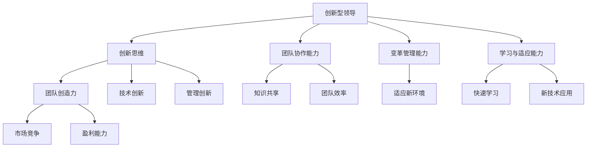
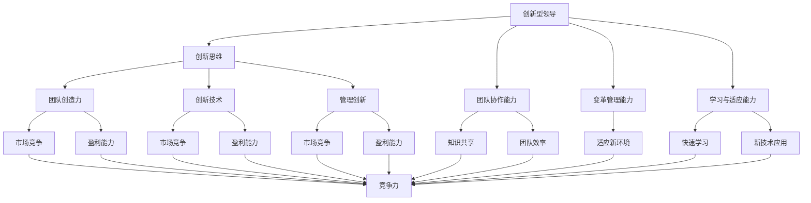

                 

## 文章标题

《创新型领导：激发团队创造力的方法》

### 关键词

- 创新型领导
- 团队创造力
- 创新思维
- 领导力
- 管理策略

### 摘要

本文旨在探讨创新型领导如何在现代企业中发挥关键作用，激发团队创造力，从而推动企业创新和发展。文章首先介绍了创新型领导的定义和重要性，然后分析了创新思维的培养方法，以及团队创造力激发的策略。通过实际案例的解析，文章进一步展示了创新型领导在实践中的应用效果。最后，文章总结了未来发展方向和挑战，为读者提供了实用的管理策略和建议。

## 引言与背景

在当今快速变化和竞争激烈的市场环境中，创新已成为企业生存和发展的关键。而创新型领导作为推动创新的核心力量，其作用愈发凸显。创新型领导不仅能够激发团队成员的创新潜力，还能构建支持创新的团队文化和环境。因此，研究和探讨创新型领导如何激发团队创造力，具有重要的现实意义。

### 创新型领导的定义

创新型领导，是指那些能够在复杂多变的环境中，通过创新思维和领导技能，激发团队创造力和创新能力，从而实现企业目标的管理者。创新型领导不仅关注短期的绩效，更注重企业长期的发展和竞争力的提升。他们具备以下特点：

1. **愿景和目标导向**：创新型领导具有清晰的愿景和目标，能够为企业的发展指明方向。
2. **创新思维**：他们具备强烈的创新意识和创新思维，能够推动企业进行技术创新和管理创新。
3. **团队协作能力**：创新型领导擅长建立高效的团队，促进团队成员之间的协作和知识共享。
4. **变革管理能力**：他们能够有效地应对企业变革，引导团队适应新的环境和挑战。
5. **学习与适应能力**：创新型领导具备快速学习和适应新知识、新技术的能力。

### 创新型领导与企业发展

创新型领导对企业的发展具有深远的影响。首先，他们能够通过激发团队创造力，推动企业的技术创新和产品创新，从而提高企业的市场竞争力和盈利能力。其次，创新型领导能够构建支持创新的团队文化和环境，为团队成员提供充分的自由和资源，鼓励他们尝试新的想法和方法。此外，创新型领导还能够通过有效的变革管理，推动企业适应外部环境的变化，保持持续的创新动力。

### 当前环境下的创新需求

在当前全球化和数字化的大背景下，企业面临的市场竞争愈发激烈，创新已成为企业生存和发展的关键。创新不仅体现在技术层面，还包括商业模式、管理方法等多个方面。为了应对这些挑战，企业需要培养创新型领导，激发团队创造力，以应对不断变化的市场环境和客户需求。

### 创新型领导的重要性

创新型领导在企业创新和发展中扮演着至关重要的角色。首先，他们能够通过激发团队创造力，推动企业的技术创新和产品创新，从而提高企业的市场竞争力和盈利能力。其次，创新型领导能够构建支持创新的团队文化和环境，为团队成员提供充分的自由和资源，鼓励他们尝试新的想法和方法。此外，创新型领导还能够通过有效的变革管理，推动企业适应外部环境的变化，保持持续的创新动力。

总之，创新型领导是企业实现创新和发展的重要保障。只有培养和引进创新型领导，才能在激烈的市场竞争中立于不败之地。

## 核心概念与联系

在讨论创新型领导如何激发团队创造力之前，我们需要明确一些核心概念，并理解它们之间的相互关系。以下是一个用于描述这些概念关系的 Mermaid 流程图：

### 创新思维

创新思维是创新型领导的核心能力之一。它包括发散思维、收敛思维、批判性思维等多种思维方式，能够帮助领导者发现新的问题和机会，并找到创新的解决方案。创新思维不仅涉及技术层面，还包括商业模式、管理方法等多个方面。

### 团队创造力

团队创造力是团队在面对挑战和机遇时，通过协作和知识共享，产生新的想法和解决方案的能力。团队创造力不仅能够提高团队的绩效，还能促进企业的创新和发展。创新型领导通过激发团队成员的创新思维，培养团队创造力。

### 创新技术

创新技术在企业的创新过程中起着至关重要的作用。它包括新技术、新工艺、新产品等方面的创新，能够帮助企业提升竞争力。创新型领导通过推动技术创新，促进企业的持续发展。

### 管理创新

管理创新是指企业在管理模式、流程、制度等方面的创新。管理创新能够提高企业的运营效率，降低成本，提升竞争力。创新型领导通过推动管理创新，优化企业的运营和管理。

### 团队协作能力

团队协作能力是创新型领导的重要能力之一。它包括团队成员之间的沟通、协作、合作等能力，能够促进团队的协同工作，提高团队的整体效率。创新型领导通过建立高效的团队协作机制，激发团队创造力。

### 变革管理能力

变革管理能力是创新型领导在应对企业变革时的重要能力。它包括变革的规划、实施、监控等环节，能够帮助企业顺利度过变革期，保持持续的创新动力。创新型领导通过有效的变革管理，推动企业持续创新。

### 学习与适应能力

学习与适应能力是创新型领导在快速变化的市场环境中，保持竞争力的重要能力。它包括快速学习新知识、新技术、新方法，并迅速适应新的环境和挑战。创新型领导通过不断学习和适应，推动企业的持续创新。

以上核心概念之间的关系，可以用以下 Mermaid 流程图表示：

通过这个流程图，我们可以清晰地看到创新型领导如何通过激发创新思维、培养团队协作能力、推动技术创新和管理创新，以及变革管理和学习与适应能力，最终激发团队创造力，提高企业的市场竞争力和盈利能力。

## 创新型领导的核心能力

要成为一名成功的创新型领导，不仅需要具备深厚的专业知识，还需要掌握一系列核心能力。这些能力不仅能够帮助领导者激发团队创造力，还能推动企业的创新和发展。以下将详细探讨创新型领导的关键能力，包括愿景和目标导向、创新思维、团队协作能力、变革管理能力以及学习与适应能力。

### 愿景和目标导向

愿景和目标导向是创新型领导的核心能力之一。一个有远见的领导能够清晰地描绘出企业的未来发展方向，并制定明确的战略目标。这不仅能够为团队提供明确的指导方向，还能激励团队成员为之努力。创新型领导通过制定具有挑战性和可行性的目标，推动团队不断前进，实现企业的长期发展。

**案例分析：** 以苹果公司的史蒂夫·乔布斯为例，他具有强烈的愿景和目标导向。他不仅为苹果公司制定了明确的产品方向，还通过不断的创新，推动了苹果公司从一家小型电脑公司成长为全球科技巨头。

### 创新思维

创新思维是创新型领导的重要能力。它包括发散思维、收敛思维、批判性思维等多种思维方式，能够帮助领导者发现新的问题和机会，并找到创新的解决方案。创新型领导需要具备敏锐的洞察力，能够从不同角度看待问题，从而发现潜在的创新点。

**案例分析：** 3M公司的创始人之一，斯隆，就是一个典型的创新思维领导者。他鼓励员工尝试新的想法和方法，并给予他们充分的自由和资源。这种创新文化使得3M公司不断推出新的产品和服务，成为行业领袖。

### 团队协作能力

团队协作能力是创新型领导不可或缺的能力。一个高效的团队需要领导者能够协调不同成员的工作，促进他们之间的沟通和协作。创新型领导通过建立良好的团队协作机制，激发团队成员的潜力，实现团队的目标。

**案例分析：** 英特尔公司的安德鲁·格罗夫（Andrew Grove）是一个出色的团队协作领导者。他通过建立明确的团队目标和考核机制，激励团队成员共同努力，最终带领英特尔公司成为全球半导体行业的领导者。

### 变革管理能力

变革管理能力是创新型领导在应对企业变革时的重要能力。在快速变化的市场环境中，企业需要不断调整战略和运营模式，以适应新的环境和挑战。创新型领导需要具备敏锐的洞察力，能够预判市场变化，并有效地推动企业变革。

**案例分析：** 通用电气（GE）的杰克·韦尔奇（Jack Welch）就是一个变革管理的典范。他通过一系列的变革措施，如精简组织结构、推动多元化战略等，成功将通用电气从一家传统的制造业公司转变为一个全球化的多元化企业。

### 学习与适应能力

学习与适应能力是创新型领导在快速变化的市场环境中，保持竞争力的重要能力。创新型领导需要具备快速学习新知识、新技术、新方法的能力，并迅速适应新的环境和挑战。这种能力不仅能够帮助领导者应对市场变化，还能推动企业的持续创新和发展。

**案例分析：** 亚马逊的杰夫·贝索斯（Jeff Bezos）就是一个学习与适应能力强大的领导者。他通过不断学习和尝试，成功将亚马逊从一家在线书店发展成为全球最大的电子商务平台。

### 总结

综上所述，创新型领导的核心能力包括愿景和目标导向、创新思维、团队协作能力、变革管理能力和学习与适应能力。这些能力不仅能够帮助领导者激发团队创造力，还能推动企业的创新和发展。通过以上案例分析，我们可以看到这些能力在实际中的应用效果，也为其他领导者提供了宝贵的经验和启示。

## 创新思维的培养方法

创新思维是创新型领导的核心能力之一，它能够帮助领导者在复杂多变的环境中，发现新的问题和机会，并找到创新的解决方案。要培养创新思维，需要从多个方面入手，包括创新思维的训练、激发方法以及培养策略。

### 创新思维的训练

**1. 提高观察能力**

观察能力是创新思维的基础。一个有洞察力的领导者能够从日常工作和生活中发现新的问题和机会。通过培养细致入微的观察能力，领导者可以更好地理解问题和需求，从而找到创新的解决方案。

**2. 开发发散思维**

发散思维是创新思维的核心。通过开发发散思维，领导者可以从多个角度看待问题，发现更多可能的解决方案。例如，通过头脑风暴和思维导图等方法，领导者可以激发团队成员的创造力，收集各种可能的解决方案。

**3. 培养批判性思维**

批判性思维是创新思维的另一个重要方面。领导者需要具备批判性思维能力，能够对现有的想法和方案进行评估和优化。通过批判性思维，领导者可以筛选出最具潜力的解决方案，并不断完善和改进。

**4. 学习跨学科知识**

跨学科知识是培养创新思维的重要资源。通过学习不同领域的知识，领导者可以拓宽视野，发现新的问题和解决方案。例如，计算机科学、经济学、心理学等领域的知识，都可以为创新思维提供丰富的素材。

### 创新思维的激发方法

**1. 设定明确的挑战**

设定明确的挑战是激发创新思维的有效方法。领导者可以通过设定具有挑战性的目标和问题，激励团队成员思考和解决。这种挑战可以激发团队成员的创造力，促使他们寻找创新的解决方案。

**2. 提供资源和支持**

创新需要资源和支持。领导者需要为团队成员提供必要的资源和支持，如时间、资金、技术等。通过提供这些资源，领导者可以减少团队成员在创新过程中的障碍，鼓励他们大胆尝试新的想法和方法。

**3. 创造自由宽松的环境**

自由宽松的环境是激发创新思维的关键。领导者需要创造一个开放、包容、鼓励尝试和失败的环境，让团队成员能够自由地表达自己的想法和意见。这种环境可以激发团队成员的创造力，促进创新思维的产生。

### 创新思维的培养策略

**1. 建立持续的学习机制**

持续的学习机制是培养创新思维的重要策略。领导者需要建立持续的学习机制，鼓励团队成员不断学习新知识、新技术和新方法。通过学习，团队成员可以拓宽视野，提高自身的创新能力。

**2. 培养团队协作精神**

团队协作精神是培养创新思维的关键。领导者需要培养团队成员之间的协作精神，促进他们之间的沟通和合作。通过团队协作，团队成员可以相互启发，共同解决问题，提高创新效率。

**3. 鼓励创新实践**

鼓励创新实践是培养创新思维的重要策略。领导者需要鼓励团队成员勇于实践，将创新想法转化为实际的解决方案。通过创新实践，团队成员可以积累经验，提高创新能力。

**4. 奖励创新成果**

奖励创新成果是培养创新思维的有效方法。领导者需要建立奖励机制，对创新成果进行奖励和表彰。通过奖励，领导者可以激发团队成员的创新热情，鼓励他们持续创新。

### 实践案例

**案例：谷歌公司的创新文化**

谷歌公司以其创新文化和实践而闻名。谷歌的领导者通过多种方法激发创新思维，包括：

- **设立“20%时间政策”**：谷歌允许员工在工作时间的20%用于探索个人感兴趣的项目，这种政策激发了员工的创造力。
- **鼓励团队协作**：谷歌鼓励跨团队的合作，促进不同领域知识的交流和碰撞。
- **提供丰富的资源**：谷歌为员工提供丰富的资源和工具，支持他们的创新实践。

通过这些方法，谷歌成功地培养了一种创新思维的文化，推动了公司的持续创新和发展。

### 总结

创新思维的培养是一个系统化的过程，需要从多个方面入手，包括训练、激发方法和培养策略。通过提高观察能力、开发发散思维、培养批判性思维和学习跨学科知识，领导者可以提升自身的创新思维。同时，通过设定明确的挑战、提供资源和支持、创造自由宽松的环境等激发方法，以及建立持续的学习机制、培养团队协作精神、鼓励创新实践和奖励创新成果等培养策略，领导者可以有效地培养团队的创新思维，推动企业的持续创新和发展。

## 团队创造力的概念与模型

团队创造力是企业创新的重要驱动力，它涉及到团队成员在协作过程中产生新想法、新方法和新解决方案的能力。为了更好地理解团队创造力的本质，我们需要探讨其概念、关键要素以及评估方法。

### 概念

团队创造力是指团队成员通过协作、沟通和知识共享，共同产生新的想法、方法或解决方案的能力。团队创造力不仅体现在技术层面，还包括商业模式、管理方法等多个方面。它是一个综合性的能力，涉及到团队成员的思维、技能、知识等多个方面。

### 关键要素

团队创造力包含多个关键要素，这些要素相互作用，共同推动团队创造力的提升。以下是一些关键要素：

**1. 知识共享：** 知识共享是团队创造力的基础。通过共享知识，团队成员可以相互学习，拓宽视野，从而产生新的想法和解决方案。

**2. 团队协作：** 团队协作是团队创造力的重要保障。高效的团队协作能够促进团队成员之间的沟通和合作，提高团队的整体创造力。

**3. 创新思维：** 创新思维是团队创造力的重要驱动因素。具备创新思维的团队成员能够从不同角度看待问题，发现新的问题和解决方案。

**4. 领导风格：** 领导风格对团队创造力有重要影响。创新型领导能够激发团队成员的创造力，提供必要的资源和支持，营造自由创新的环境。

**5. 激励机制：** 激励机制能够激发团队成员的积极性和创造力。合理的激励机制可以奖励团队成员的创新成果，提高他们的创新动力。

### 模型

为了更好地理解和评估团队创造力，我们可以使用以下模型：

**1. 知识共享模型：** 该模型认为团队创造力取决于团队成员之间的知识共享程度。知识共享越充分，团队创造力越高。

**2. 创新过程模型：** 该模型描述了团队创造力产生的过程，包括问题识别、想法生成、方案评估和方案实施等环节。每个环节的顺利进行都有助于提升团队创造力。

**3. 创造力评估模型：** 该模型通过评估团队在知识共享、团队协作、创新思维、领导风格和激励机制等方面的表现，全面评估团队创造力水平。

### 评估方法

评估团队创造力需要采用科学的方法，以下是一些常用的评估方法：

**1. 创新产出评估：** 通过评估团队在一段时间内产生的创新成果，如新产品、新服务、新商业模式等，来衡量团队创造力。

**2. 成果质量评估：** 通过评估团队产生的创新成果的质量，如创新性、可行性、市场潜力等，来衡量团队创造力。

**3. 成果应用评估：** 通过评估团队产生的创新成果在实际应用中的效果，如对业务增长的贡献、客户满意度等，来衡量团队创造力。

**4. 团队成员反馈：** 通过对团队成员进行问卷调查或访谈，收集他们对团队创造力水平的反馈，从而评估团队创造力。

### 总结

团队创造力是企业创新的重要驱动力，它涉及到多个关键要素，包括知识共享、团队协作、创新思维、领导风格和激励机制。通过使用合适的评估方法，我们可以全面评估团队创造力水平，从而有针对性地提升团队创造力，推动企业的持续创新和发展。

## 团队创造力激发策略

激发团队创造力是创新型领导的重要任务之一。为了有效地激发团队创造力，领导者在制定策略时需要从多个方面入手。以下将详细探讨领导者的角色、团队文化建设以及创新项目设计等策略，并提供实际案例进行说明。

### 领导者的角色

在激发团队创造力过程中，领导者的角色至关重要。领导者不仅是团队的引导者和推动者，还是团队成员的榜样和支持者。以下是一些具体的策略：

**1. 建立明确的愿景和目标**

领导者需要明确企业的愿景和目标，并将其传达给团队成员。这有助于激发团队成员的使命感，使他们更愿意投入到创新工作中。

**2. 提供资源和支持**

领导者应确保团队成员获得必要的资源和支持，如时间、资金和技术等。通过提供这些资源，领导者可以减少团队成员在创新过程中的障碍，鼓励他们大胆尝试。

**3. 鼓励自主性和创造力**

领导者应鼓励团队成员发挥自主性和创造力，允许他们探索新的想法和方法。这种自由和包容的工作环境有助于激发团队成员的创新能力。

**4. 及时反馈和激励**

领导者应及时给予团队成员反馈和激励，肯定他们的创新成果，鼓励他们继续努力。这种积极的反馈和激励可以增强团队成员的创新动力。

### 团队文化建设

团队文化对团队创造力有深远影响。一个积极、开放和创新的团队文化能够激发团队成员的创造力。以下是一些具体的策略：

**1. 促进知识共享**

领导者应鼓励团队成员之间的知识共享，建立知识共享的平台，如内部交流论坛、培训课程等。通过知识共享，团队成员可以相互学习，提高整体创造力。

**2. 建立信任和协作**

建立信任和协作的团队文化是激发团队创造力的关键。领导者可以通过团队建设活动和协作任务，增强团队成员之间的信任和协作。

**3. 鼓励创新和尝试**

领导者应鼓励团队成员勇于创新和尝试，允许他们犯错。这种包容和鼓励的环境可以激发团队成员的创新精神，提高团队创造力。

**4. 奖励创新成果**

领导者应建立奖励机制，对团队成员的创新成果进行奖励和表彰。这种奖励可以激励团队成员继续创新，提高团队的整体创造力。

### 创新项目设计

创新项目设计是激发团队创造力的重要手段。以下是一些具体的策略：

**1. 明确项目目标和范围**

在设计创新项目时，领导者应明确项目的目标和范围，确保团队成员了解项目的具体要求和期望。这有助于团队成员集中精力，提高项目成功率。

**2. 提供多样化的挑战**

领导者应设计多样化的挑战，鼓励团队成员从不同角度思考问题，寻找创新的解决方案。这种多样化的挑战可以激发团队成员的创造力。

**3. 创造自由创新的环境**

领导者应创造一个自由创新的环境，允许团队成员自由表达自己的想法和意见。这种环境可以激发团队成员的创造力，促进创新项目的发展。

**4. 鼓励跨团队协作**

领导者应鼓励跨团队协作，促进不同团队之间的交流和合作。这种跨团队协作可以激发新的创新点，提高项目成功率。

### 实际案例

**案例：谷歌的“20%时间政策”**

谷歌公司以其创新文化而闻名，其中“20%时间政策”是一个典型案例。谷歌允许员工在工作时间的20%用于探索个人感兴趣的项目。这一政策激发了员工的创造力，产生了许多创新产品，如Gmail和AdSense。通过这一政策，谷歌不仅提高了员工的满意度，还推动了公司的持续创新。

**案例：3M的“15%时间政策”**

3M公司也采用了类似的创新策略，即“15%时间政策”。这一政策鼓励员工在工作时间的15%用于自主探索项目。通过这一政策，3M公司推出了许多创新产品，如贴纸和 Scotch Tape。这一政策不仅提高了员工的工作积极性，还推动了公司的持续创新。

### 总结

激发团队创造力需要领导者在角色、团队文化建设和创新项目设计等方面采取一系列策略。通过明确愿景和目标、提供资源和支持、鼓励自主性和创造力、建立信任和协作等策略，领导者可以激发团队创造力，推动企业的持续创新和发展。同时，通过建立知识共享机制、鼓励创新和尝试、提供多样化的挑战、创造自由创新的环境和鼓励跨团队协作等策略，领导者可以进一步激发团队创造力，实现企业的长期发展目标。

## 创新型领导的实践案例

为了更好地理解创新型领导在激发团队创造力方面的实际应用效果，以下将介绍两个实践案例：公司A的转型之路和公司B的创新之旅。通过这两个案例，我们将深入分析创新型领导的策略、实施过程以及取得的成果。

### 案例一：公司A的转型之路

**背景：** 公司A是一家传统的制造业企业，面临着激烈的市场竞争和成本压力。为了保持竞争优势，公司决定进行转型，从传统的制造模式转向以创新为核心的业务模式。

**创新型领导策略：** 
1. **愿景与目标**：公司A的领导者提出了明确的愿景和目标，即通过技术创新和产品创新，将公司打造成行业领导者。
2. **资源分配**：公司A为创新项目提供了充足的资金和资源支持，确保团队成员可以大胆尝试新的想法和方法。
3. **团队建设**：领导者通过团队建设活动和培训，增强了团队成员之间的信任和协作，营造了一个自由创新的工作环境。
4. **激励机制**：公司A建立了激励机制，对创新成果进行奖励和表彰，激励团队成员持续创新。

**实施过程：**
1. **问题识别**：领导者通过调研和数据分析，识别了公司面临的挑战和机遇，为创新项目提供了明确的方向。
2. **方案设计**：团队进行了头脑风暴，提出了多个创新方案，包括新产品开发、工艺改进和商业模式创新等。
3. **方案评估**：领导者对创新方案进行评估，选择最具潜力的方案进行实施。
4. **项目实施**：团队开始实施创新项目，包括技术研发、市场调研、产品测试等环节。

**成果：**
1. **技术创新**：公司A成功开发了几款具有竞争力的新产品，提高了产品的技术含量和市场竞争力。
2. **管理创新**：公司A优化了生产流程，降低了生产成本，提高了运营效率。
3. **市场拓展**：公司A通过创新产品和创新的商业模式，成功打开了新的市场，实现了业务的多元化。
4. **团队凝聚力**：通过创新项目的实施，团队成员的凝聚力和创新能力得到了显著提升。

### 案例二：公司B的创新之旅

**背景：** 公司B是一家初创企业，专注于新兴技术的研发和应用。为了在竞争激烈的市场中脱颖而出，公司B决定通过持续创新，打造独特的竞争优势。

**创新型领导策略：**
1. **愿景与目标**：公司B的领导者提出了“成为行业创新领导者”的愿景，鼓励团队成员追求卓越。
2. **资源分配**：公司B为创新项目提供了充足的资金和资源支持，并建立了专门的创新团队。
3. **团队建设**：领导者通过团队建设活动和培训，增强了团队成员之间的信任和协作，营造了一个自由创新的工作环境。
4. **激励机制**：公司B建立了激励机制，对创新成果进行奖励和表彰，激励团队成员持续创新。

**实施过程：**
1. **问题识别**：领导者通过市场调研和客户反馈，识别了公司面临的挑战和机遇，为创新项目提供了明确的方向。
2. **方案设计**：创新团队进行了头脑风暴，提出了多个创新方案，包括新技术研发、产品功能优化和商业模式创新等。
3. **方案评估**：领导者对创新方案进行评估，选择最具潜力的方案进行实施。
4. **项目实施**：创新团队开始实施创新项目，包括技术研发、产品测试、市场推广等环节。

**成果：**
1. **技术创新**：公司B成功研发了多项新技术，如人工智能、大数据分析等，为公司的产品和服务提供了强大的技术支持。
2. **产品创新**：公司B推出了具有创新功能的新产品，满足了市场需求，赢得了客户的认可。
3. **市场拓展**：公司B通过创新产品和创新的商业模式，成功打开了新的市场，实现了业务的快速增长。
4. **团队凝聚力**：通过创新项目的实施，团队成员的凝聚力和创新能力得到了显著提升。

### 总结

以上两个案例展示了创新型领导在激发团队创造力方面的实际应用效果。通过明确的愿景和目标、充足的资源支持、团队建设和激励机制等策略，公司A和公司B成功地推动了创新项目的发展，实现了业务转型和快速增长。这些实践案例为其他企业提供了宝贵的经验和启示，证明了创新型领导在激发团队创造力、推动企业创新和发展中的关键作用。

## 总结与展望

本文通过深入探讨创新型领导如何激发团队创造力，阐述了创新思维的培养、团队协作能力的提升、创新项目设计的重要性，并结合实际案例展示了创新型领导在实践中的应用效果。以下是对全文的总结和展望。

### 总结

1. **创新型领导的重要性**：创新型领导在企业创新和发展中起着至关重要的作用。他们通过激发团队成员的创新思维，提升团队协作能力，推动技术创新和管理创新，为企业提供持续的竞争优势。

2. **创新思维的培养方法**：创新思维是创新型领导的核心能力之一。通过提高观察能力、开发发散思维、培养批判性思维和学习跨学科知识，领导可以提升自身的创新思维。

3. **团队创造力的概念与模型**：团队创造力是团队在面对挑战和机遇时，通过协作和知识共享，产生新的想法和解决方案的能力。了解团队创造力的关键要素和评估方法，有助于领导者更有效地激发团队创造力。

4. **团队创造力激发策略**：领导者在激发团队创造力时，需要从领导者的角色、团队文化建设、创新项目设计等方面采取多种策略，如提供资源支持、建立激励机制、促进知识共享和鼓励创新尝试。

5. **实践案例**：通过公司A和公司B的案例，我们看到了创新型领导在激发团队创造力方面的实际应用效果，以及他们在愿景和目标导向、资源支持、团队建设和激励机制等方面的成功策略。

### 展望

1. **未来发展方向**：随着全球化和数字化的发展，企业面临着更加复杂和多变的环境。创新型领导需要具备更强的适应能力和创新能力，以应对未来的挑战。

2. **技术趋势的影响**：新技术的不断涌现，如人工智能、大数据、区块链等，将对企业的创新和发展产生深远影响。创新型领导需要关注这些技术趋势，并将其融入企业的创新实践中。

3. **持续学习的重要性**：在快速变化的环境中，持续学习是创新型领导保持竞争力的关键。领导者需要不断提升自身的知识和技能，以适应新的环境和挑战。

4. **跨学科合作**：未来的创新将越来越依赖跨学科合作。领导者在激发团队创造力时，应鼓励不同领域之间的交流和合作，促进创新的产生。

5. **社会责任**：企业在追求创新和发展的同时，应承担起社会责任。创新型领导需要关注企业的可持续发展，推动绿色创新和社会创新。

### 小结

创新型领导在激发团队创造力、推动企业创新和发展中起着至关重要的作用。通过本文的探讨，我们不仅了解了创新型领导的定义和重要性，还学习了如何培养创新思维、激发团队创造力和实施创新项目。希望读者能够将这些理念应用到实际工作中，成为具备创新精神和领导力的领导者，为企业的发展贡献力量。

### 注意事项

1. **平衡创新与风险**：在推动创新过程中，领导者需要平衡创新与风险，避免盲目追求创新而忽视风险控制。

2. **持续评估与调整**：创新项目实施过程中，领导者需要持续评估项目的进展和效果，及时调整策略，确保创新目标的实现。

3. **关注员工需求**：在激发团队创造力时，领导者应关注员工的需求和感受，建立支持创新的工作环境，提高员工的工作满意度和忠诚度。

### 拓展阅读

- 《创新者的窘境》：克莱顿·克里斯滕森（Clayton Christensen）的《创新者的窘境》一书，深入探讨了企业在创新过程中的困境和挑战，对理解创新管理具有重要参考价值。
- 《创新思维》：爱德华·德·波诺（Edward de Bono）的《创新思维》一书，介绍了多种创新思维工具和方法，有助于培养创新思维。

通过阅读这些拓展材料，读者可以进一步深入了解创新管理和领导力的相关理论和实践，提升自身的创新能力和领导力。

