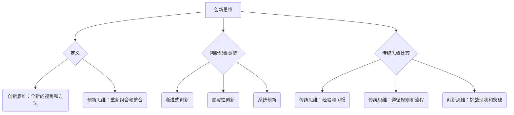
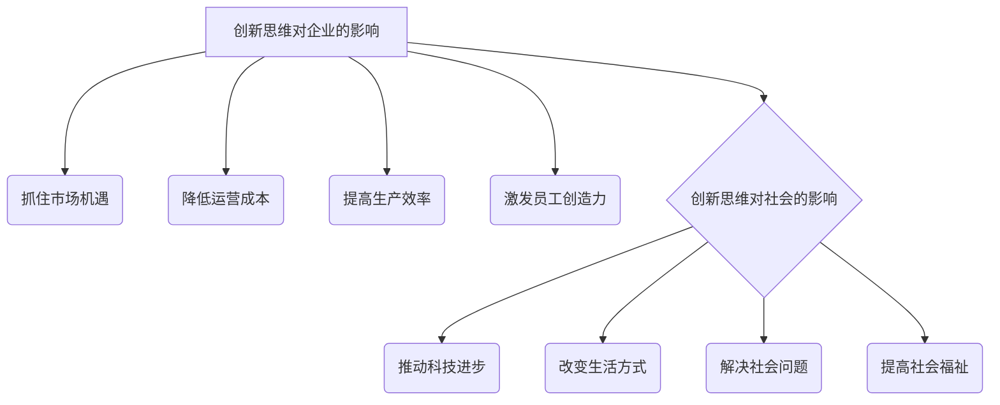
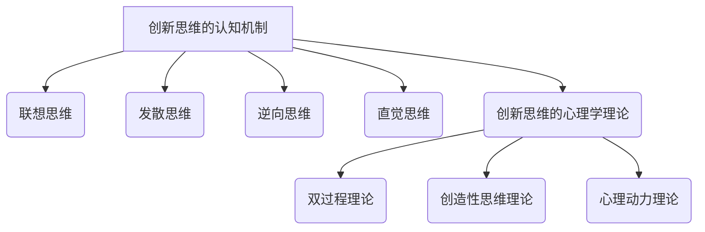
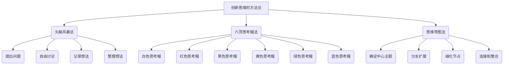
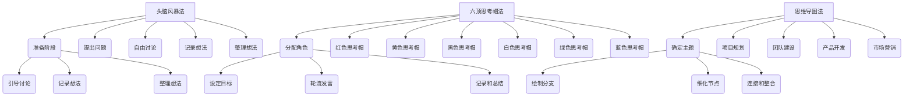
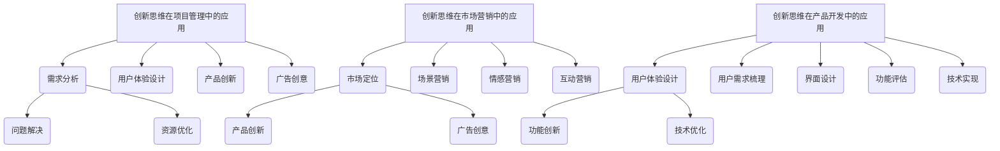
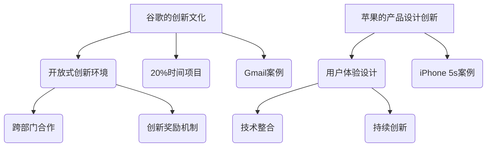
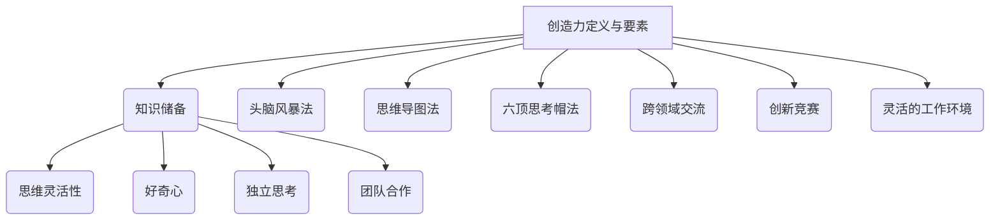
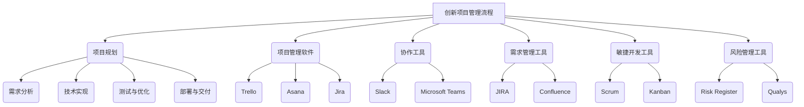
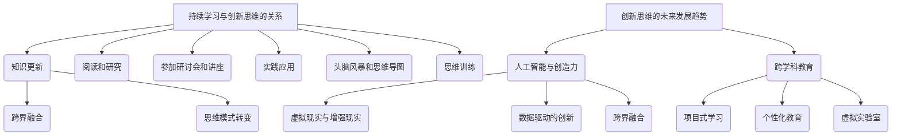

                 

### 文章标题

《创新思维培养：激发团队创造力的方法》

### 关键词

- 创新思维
- 团队创造力
- 培养策略
- 实践方法
- 激励机制
- 项目管理
- 案例分析

### 摘要

本文旨在探讨如何培养创新思维并激发团队创造力，从而推动个人与组织的持续发展。首先，我们定义了创新思维的基础概念，并探讨了其重要性。接着，文章介绍了创新思维的心理学基础和认知机制，以及一系列实用的创新思维工具。通过实际案例和案例分析，我们展示了如何将创新思维应用于日常工作中。随后，文章重点讨论了如何建立高效的创新团队和激发团队创造力。此外，还介绍了创新项目管理的核心原则和方法，并提供了创新思维培养的策略和实践。最后，文章对未来创新思维的发展趋势进行了展望，并提供了拓展阅读的建议。通过本文，读者将了解创新思维的培养方法，掌握激发团队创造力的技巧，为个人和组织的创新实践提供有力支持。

---

## 目录大纲

### 第一部分：创新思维概述

#### 第1章：创新思维的基础概念

- 背景介绍
- 核心概念与联系：创新思维的定义与类型
- 创新思维与传统思维的比较

#### 第2章：创新思维的重要性与影响

- 创新思维对企业的影响
- 创新思维对社会的影响

### 第二部分：创新思维原理

#### 第3章：创新思维的心理学基础

- 创新思维的认知机制
- 创新思维的心理学理论

#### 第4章：创新思维的方法论

- 头脑风暴法
- 六顶思考帽法
- 思维导图法

### 第三部分：创新思维工具

#### 第5章：创新思维工具的应用

- 头脑风暴法的实际应用
- 六顶思考帽法的实际应用
- 思维导图法的实际应用

### 第四部分：创新思维实践

#### 第6章：创新思维在日常工作中的应用

- 创新思维在项目管理中的应用
- 创新思维在市场营销中的应用
- 创新思维在产品开发中的应用

#### 第7章：创新思维案例研究

- 案例一：谷歌的创新文化
- 案例二：苹果的产品设计创新

### 第五部分：团队创造力激发

#### 第8章：建立高效创新团队

- 创新团队的组成与角色
- 创新团队的沟通与协作
- 创新团队的激励与成长

#### 第9章：激发团队创造力

- 创造力的定义与要素
- 创造力激发的方法与策略

### 第六部分：创新项目管理

#### 第10章：创新项目管理的核心原则

- 创新项目管理的挑战与机遇
- 创新项目管理的核心原则

#### 第11章：创新项目管理的方法与工具

- 创新项目管理流程
- 创新项目管理工具

### 第七部分：创新思维培养策略

#### 第12章：持续培养创新思维

- 持续学习与创新思维的关系
- 培养创新思维的策略与实践

#### 第13章：创新思维的未来发展趋势

- 创新思维在未来的影响
- 创新思维教育的趋势

### 参考文献

---

## 第一部分：创新思维概述

### 第1章：创新思维的基础概念

#### 背景介绍

在当今快速发展的社会，创新已成为推动企业和个人发展的关键因素。创新思维作为一种独特的思维方式，能够帮助我们发掘新的解决方案，应对复杂多变的环境。因此，理解创新思维的基础概念，对于培养和提升创新能力具有重要意义。

#### 核心概念与联系

创新思维的定义：

创新思维是指通过全新的视角和独特的方法，对现有知识、技术和资源进行重新组合和整合，从而产生新颖、有价值的想法和解决方案的思维方式。

创新思维的类型：

1. **渐进式创新**：通过逐步改进现有产品或服务，提高其性能、效率和用户体验。
2. **颠覆性创新**：颠覆现有市场格局，引入全新的产品或服务，改变消费者的行为和习惯。
3. **系统创新**：从整体系统出发，重新设计和优化各个环节，实现整体性能的提升。

创新思维与传统思维的比较：

传统思维强调经验和习惯，注重稳定性和安全性。而创新思维则强调挑战现状，寻求变革和突破。传统思维倾向于遵循既定的规则和流程，而创新思维则敢于打破常规，探索未知领域。

#### 实例说明

例如，在科技行业，苹果公司通过颠覆性创新，推出了iPod、iPhone和iPad等革命性产品，彻底改变了音乐、通信和消费电子市场。谷歌公司则通过渐进式创新，不断优化其搜索引擎和广告系统，成为全球最大的互联网公司之一。

#### Mermaid 流程图

### 第2章：创新思维的重要性与影响

#### 创新思维对企业的影响

创新思维对企业具有深远的影响。首先，它能够帮助企业抓住市场机遇，开发出具有竞争优势的产品和服务。例如，谷歌的搜索引擎技术和广告系统，使其在互联网市场取得了巨大的成功。

其次，创新思维有助于企业降低运营成本，提高生产效率。通过不断优化流程和技术，企业可以减少资源浪费，提高资源利用率。

此外，创新思维能够激发员工的积极性和创造力，形成企业的核心竞争力。一个具有创新精神的企业，能够吸引和留住优秀人才，推动企业的可持续发展。

#### 创新思维对社会的影响

创新思维对社会的影响同样显著。首先，它推动了科技进步和社会发展。历史上，许多重大的科技进步，如互联网、智能手机和人工智能等，都是创新思维的结果。

其次，创新思维改变了人们的生产和生活方式。例如，共享经济模式的出现，改变了人们的出行方式、住宿方式和消费方式。

此外，创新思维有助于解决社会问题，提高社会福祉。例如，通过技术创新，我们可以更有效地解决环境污染、资源短缺和公共卫生问题。

#### 实例说明

例如，在医疗领域，创新思维推动了医疗技术的进步，如基因编辑、人工智能辅助诊断和远程医疗等，极大地提高了医疗服务的质量和效率。

在环保领域，创新思维推动了可再生能源技术的发展，如太阳能、风能和氢能等，为减少温室气体排放和保护地球环境做出了重要贡献。

#### Mermaid 流程图

---

## 第二部分：创新思维原理

### 第3章：创新思维的心理学基础

#### 创新思维的认知机制

创新思维是一个复杂的认知过程，涉及到多种认知机制的相互作用。以下是对几个关键认知机制的简要介绍：

1. **联想思维**：通过将看似无关的事物联系起来，产生新的想法。例如，苹果公司创始人史蒂夫·乔布斯将音乐和便携式电子设备相结合，创造了iPod。

2. **发散思维**：从一个中心点出发，探索多种可能的解决方案。这种思维方式有助于发现新的视角和创新的解决方案。

3. **逆向思维**：从相反的角度思考问题，挑战传统的解决方案。这种思维方式常常能够带来颠覆性的创新。

4. **直觉思维**：依靠直觉和直觉判断进行决策，这种思维方式在创新过程中起到关键作用。

#### 创新思维的心理学理论

1. **双过程理论**：该理论认为，创新思维涉及两个过程：有意识的过程和潜意识的过程。有意识的过程涉及逻辑推理和分析，而潜意识的过程涉及直觉和联想。

2. **创造性思维理论**：例如，吉尔福特（J.P. Guilford）的创造性思维理论，强调创造性思维包括流畅性、灵活性和独创性。

3. **心理动力理论**：该理论认为，创新思维受到潜意识动机和需求的影响，如探索未知的欲望和解决难题的动机。

#### 实例说明

例如，在生物技术领域，科学家通过联想思维，将基因编辑技术与治疗遗传疾病相结合，开创了基因治疗的新时代。

在产品设计领域，设计师通过发散思维，探索多种设计方案，最终创造出更符合用户需求的产品。

#### Mermaid 流�程图

### 第4章：创新思维的方法论

#### 头脑风暴法

头脑风暴法是一种通过集体讨论产生创意的方法，旨在快速产生大量想法，不评价想法的好坏。以下是其核心步骤：

1. **提出问题**：明确需要解决的问题或目标。
2. **自由讨论**：在规定时间内，参与者不受限制地提出各种想法。
3. **记录想法**：将所有想法记录下来，不分好坏。
4. **整理想法**：将记录的想法进行整理，筛选出有价值、可行性强的新想法。

#### 六顶思考帽法

六顶思考帽法是由爱德华·德·波诺（Edward de Bono）提出的一种结构性思考方法，通过使用不同的思考“帽子”，帮助人们从不同角度分析问题。

1. **白色思考帽**：关注事实和数据，提供信息。
2. **红色思考帽**：表达情感和直觉，不受逻辑限制。
3. **黑色思考帽**：评估潜在问题和风险。
4. **黄色思考帽**：寻找积极方面和机会。
5. **绿色思考帽**：提出新想法和创新的解决方案。
6. **蓝色思考帽**：负责思考和讨论的引导，控制思考过程。

#### 思维导图法

思维导图法是一种以图像为中心的图形化思考工具，通过节点、分支和连接线，将想法和概念可视化。以下是其核心步骤：

1. **确定中心主题**：在纸的中心或思维导图的中心绘制一个主题词或图像。
2. **分支扩展**：从中心主题出发，绘制主要分支，每个分支代表一个核心概念或想法。
3. **细化节点**：在每个分支上添加子节点，扩展和细化想法。
4. **连接和整合**：通过连接线和箭头，将相关想法连接起来，形成一个完整的思维网络。

#### 实例说明

例如，在产品设计中，设计师可以使用头脑风暴法，快速产生多种设计方案，然后使用六顶思考帽法，从不同角度评估和筛选方案。最后，使用思维导图法，将最佳方案进行可视化，帮助团队更好地理解和执行。

#### Mermaid 流程图

---

## 第三部分：创新思维工具

### 第5章：创新思维工具的应用

#### 头脑风暴法的实际应用

头脑风暴法是一种简单而有效的创新思维工具，适用于各种场合，如产品开发、市场营销、团队建设等。以下是如何在实际应用中有效使用头脑风暴法的步骤：

1. **准备阶段**：明确目标和问题，选择参与者和时间地点。
2. **引导讨论**：主持人简要介绍目标和规则，确保参与者自由表达想法。
3. **记录想法**：使用白板、笔记本或在线工具记录所有想法，不分好坏。
4. **整理想法**：在讨论结束后，对记录的想法进行分类和筛选，确定后续行动。

实例说明：

在一次产品开发项目中，团队面临如何提升用户满意度的挑战。通过头脑风暴法，团队成员提出了多种解决方案，如改进用户体验、增加功能、优化界面设计等。最终，团队选择了其中几个具有可行性的方案，并进行了深入讨论和开发。

#### 六顶思考帽法的实际应用

六顶思考帽法有助于团队成员从不同角度分析问题，提出全面的解决方案。以下是如何在实际应用中有效使用六顶思考帽法的步骤：

1. **分配角色**：团队成员分别佩戴不同颜色的“帽子”，代表不同的思考角度。
2. **设定目标**：明确讨论的问题或目标，确保每个成员都清楚。
3. **轮流发言**：每位成员根据所佩戴的“帽子”颜色，提出观点和想法。
4. **记录和总结**：将所有观点记录下来，并进行总结和分析。

实例说明：

在一次团队会议上，团队成员讨论如何提高团队工作效率。团队成员分别佩戴了红色、黄色、黑色、白色、绿色和蓝色思考帽。红色思考帽的成员表达了对当前工作流程的不满，黄色思考帽的成员提出了改进的建议，黑色思考帽的成员评估了潜在的风险，白色思考帽的成员提供了数据支持，绿色思考帽的成员提出了创新的想法，蓝色思考帽的成员则负责引导讨论和控制节奏。最终，团队形成了一个综合的解决方案，并制定了具体的实施计划。

#### 思维导图法的实际应用

思维导图法是一种强大的可视化工具，可以帮助团队成员梳理思路，理解复杂概念。以下是如何在实际应用中有效使用思维导图法的步骤：

1. **确定主题**：选择一个明确的主题，作为思维导图的中心。
2. **绘制分支**：从中心主题出发，绘制主要分支，每个分支代表一个核心概念或想法。
3. **细化节点**：在每个分支上添加子节点，扩展和细化想法。
4. **连接和整合**：通过连接线和箭头，将相关想法连接起来，形成一个完整的思维网络。

实例说明：

在一个团队项目规划中，团队成员使用思维导图法来梳理项目的关键步骤和里程碑。首先，确定了项目主题，如“新产品发布”，然后从中心主题出发，绘制了主要分支，如“市场调研”、“产品设计”、“开发”、“测试”和“发布”。接着，在每个分支上细化了子节点，如“用户访谈”、“市场分析”、“UI设计”、“功能开发”和“用户测试”。最后，通过连接线和箭头，将这些节点连接起来，形成了完整的思维导图，帮助团队更好地理解和执行项目计划。

#### Mermaid 流程图

---

## 第四部分：创新思维实践

### 第6章：创新思维在日常工作中的应用

#### 创新思维在项目管理中的应用

在项目管理中，创新思维可以显著提升项目的成功率和效率。以下是如何在实际项目中应用创新思维的几个方面：

1. **需求分析**：通过创新思维，深入挖掘用户需求，提出更具前瞻性和创新性的解决方案。例如，可以采用头脑风暴法，收集团队成员和用户的想法，从而得到更全面的用户需求。

2. **问题解决**：当项目遇到困难或问题时，创新思维可以帮助团队找到新的解决方法。例如，使用逆向思维，从相反的角度思考问题的解决方案，或者通过发散思维，探索多种可能的解决方案。

3. **资源优化**：创新思维可以帮助项目团队更有效地利用资源和时间。例如，通过六顶思考帽法，从不同角度分析项目的资源分配，优化资源使用，提高项目效率。

实例说明：

在一个软件开发项目中，项目团队遇到了用户反馈系统效率低下的问题。通过创新思维，团队首先分析了用户反馈的流程，然后使用头脑风暴法提出了多种改进方案，如优化反馈界面、引入智能推荐系统和增加反馈分类等。接着，使用六顶思考帽法，从不同角度评估这些方案，并最终选择了最佳的改进方案，显著提高了用户反馈系统的效率。

#### 创新思维在市场营销中的应用

创新思维在市场营销中同样发挥着重要作用。以下是如何在实际营销活动中应用创新思维的几个方面：

1. **市场定位**：通过创新思维，可以帮助企业找到独特的市场定位，从而在激烈的市场竞争中脱颖而出。例如，可以使用思维导图法，分析目标市场，找到潜在的机会点。

2. **产品创新**：创新思维可以帮助企业开发出更符合市场需求的产品。例如，通过头脑风暴法，团队可以提出多种产品创意，然后通过筛选和优化，确定最终的产品方案。

3. **广告创意**：创新思维可以产生更具吸引力和创意的广告内容，提高广告效果。例如，可以使用六顶思考帽法，从不同角度思考广告的创意和表达方式。

实例说明：

在一个新产品的市场推广活动中，企业团队使用思维导图法分析了目标市场，找到了几个关键的市场机会点。接着，通过头脑风暴法，团队提出了多个广告创意，如场景营销、情感营销和互动营销等。最后，使用六顶思考帽法，从不同角度评估这些创意，并选择了最具创意和影响力的广告方案，成功提升了产品的知名度和市场占有率。

#### 创新思维在产品开发中的应用

创新思维在产品开发中可以帮助团队找到更好的解决方案，提高产品质量和用户满意度。以下是如何在实际产品开发中应用创新思维的几个方面：

1. **用户体验设计**：创新思维可以帮助团队设计出更符合用户需求和使用习惯的产品界面和交互设计。例如，可以使用思维导图法，梳理用户需求和产品功能，从而设计出更优的用户体验。

2. **功能创新**：创新思维可以帮助团队开发出具有创新性的产品功能，提升产品的竞争力。例如，可以通过头脑风暴法，提出多种功能创新的想法，然后通过评估和筛选，确定最佳的功能方案。

3. **技术优化**：创新思维可以帮助团队在技术实现上找到更高效、更可靠的方法。例如，可以使用六顶思考帽法，从不同角度分析技术实现的挑战和机会，找到最优的技术方案。

实例说明：

在一个移动应用开发项目中，团队使用了创新思维来设计产品界面。首先，通过思维导图法，梳理了用户需求和使用场景，然后通过头脑风暴法，提出了多个界面设计方案。接着，使用六顶思考帽法，从用户体验、技术实现、成本和可行性等角度评估了这些方案，最终选择了最佳的设计方案。这个创新的设计方案不仅提升了用户体验，还降低了开发成本，提高了产品的市场竞争力。

#### Mermaid 流程图

### 第7章：创新思维案例研究

#### 案例一：谷歌的创新文化

谷歌以其创新文化而著称，这种文化推动了公司在技术、产品和业务模式方面的持续创新。以下是如何在谷歌内部培养和激发创新思维的几个关键点：

1. **开放式创新环境**：谷歌鼓励员工自由探索新的想法和项目。例如，谷歌的“20%时间项目”允许员工将20%的工作时间用于自己感兴趣的项目。

2. **跨部门合作**：谷歌通过跨部门合作，鼓励不同领域的专家共同解决复杂问题。例如，谷歌搜索团队与广告团队密切合作，推动了广告系统的持续改进。

3. **创新奖励机制**：谷歌设立了多个奖项，如“杰出创新奖”，鼓励员工提出和实现创新想法。

实例说明：

谷歌的Gmail服务就是一个典型的创新案例。最初，谷歌的邮件服务存在容量有限的问题。通过创新思维，工程师们提出了引入云计算和大数据技术的方案，不仅解决了容量问题，还提升了邮件服务的速度和可靠性。这一创新项目得到了公司高层的大力支持，并最终演变成了全球领先的电子邮件服务。

#### 案例二：苹果的产品设计创新

苹果公司以其独特的产品设计和创新技术而闻名。以下是如何在苹果的产品开发过程中应用创新思维的几个关键点：

1. **用户体验设计**：苹果公司始终将用户体验放在首位，通过创新思维不断改进产品的设计和交互。

2. **技术整合**：苹果公司擅长将多种技术整合到产品中，提供统一的解决方案。例如，iPhone结合了智能手机、互联网、音乐播放器和相机的功能。

3. **持续创新**：苹果公司不断推动技术创新，如引入视网膜显示屏、Touch ID和Face ID等。

实例说明：

苹果的iPhone 5s引入了Touch ID指纹识别技术，这一创新设计不仅提高了手机的安全性，还改变了用户解锁手机的方式。通过创新思维，苹果团队成功地将指纹识别技术应用到手机中，为用户提供了便捷和安全的使用体验。

### Mermaid 流程图

---

## 第五部分：团队创造力激发

### 第8章：建立高效创新团队

#### 创新团队的组成与角色

建立高效创新团队是激发团队创造力的重要前提。一个高效的创新团队通常由以下成员组成：

1. **领导**：领导者负责制定团队目标和方向，提供必要的资源和支持，激发团队成员的创造力。
2. **创意生成者**：创意生成者是团队的核心，负责提出新的想法和创意，推动创新项目的进展。
3. **技术专家**：技术专家负责将创意转化为可行的技术解决方案，提供技术支持和指导。
4. **市场分析师**：市场分析师负责分析市场需求和竞争环境，为创新项目提供市场洞察。
5. **用户体验设计师**：用户体验设计师负责设计产品的用户界面和交互，确保产品满足用户需求。
6. **项目经理**：项目经理负责协调团队成员的工作，确保项目按时按质完成。

#### 创新团队的沟通与协作

沟通与协作是创新团队成功的关键。以下是一些建立高效沟通与协作机制的建议：

1. **定期会议**：定期举行团队会议，讨论项目进展、挑战和解决方案。
2. **跨部门合作**：鼓励团队与其他部门合作，分享资源和经验，拓宽视野。
3. **透明沟通**：确保团队内部信息透明，让每个成员都能了解项目的整体情况和各自的职责。
4. **协作工具**：使用协作工具，如Slack、Trello、Asana等，提高团队协作效率。

#### 创新团队的激励与成长

为了激发团队创造力，需要建立有效的激励机制和培养机制。以下是一些建议：

1. **奖励制度**：设立创新奖励，如奖金、晋升机会和荣誉证书，激励团队成员提出和实现创新想法。
2. **培训与发展**：提供培训和成长机会，帮助团队成员提升技能和知识，培养创新能力。
3. **内部分享**：鼓励团队成员分享经验和知识，促进团队整体水平的提升。
4. **跨领域交流**：组织跨领域交流活动，让团队成员接触到不同领域的创新思维和方法，拓宽视野。

### 第9章：激发团队创造力

#### 创造力的定义与要素

创造力是指产生新颖、有价值的思想、概念或解决方案的能力。以下是一些关键要素：

1. **知识储备**：丰富的知识储备是创造力的基础。团队成员需要具备扎实的专业知识和广泛的视野。
2. **思维灵活性**：思维灵活性是创造力的关键。团队成员需要能够灵活地思考问题，从不同角度分析问题。
3. **好奇心**：好奇心是驱动创造力的动力。团队成员需要保持对新知识和新领域的好奇心。
4. **独立思考**：独立思考是创造力的保障。团队成员需要敢于表达自己的观点，勇于挑战传统的想法。
5. **团队合作**：团队合作是创造力的关键。团队成员需要能够协同工作，共同解决问题。

#### 创造力激发的方法与策略

以下是一些激发团队创造力的方法和策略：

1. **头脑风暴法**：通过集体讨论，快速产生大量想法，激发团队成员的创造力。
2. **思维导图法**：通过绘制思维导图，梳理和扩展想法，促进创新思维。
3. **六顶思考帽法**：通过使用不同的思考角度，全面分析问题，提出创新解决方案。
4. **跨领域交流**：组织跨领域交流活动，让团队成员接触到不同领域的创新思维和方法。
5. **创新竞赛**：举办创新竞赛，鼓励团队成员提出创新想法，提高团队整体的创造力。
6. **灵活的工作环境**：提供灵活的工作环境和资源，让团队成员有更多的时间和空间进行创新思考。

### 实例说明

在一个软件开发项目中，团队通过头脑风暴法产生了多个创新想法，如引入人工智能技术、优化用户界面和增加社交功能。接着，团队使用思维导图法，将这些想法进行分类和扩展，形成了详细的项目方案。通过六顶思考帽法，团队从不同角度评估了这些方案，并最终选择了最具创意和可行性的方案进行实施。这个创新方案不仅提升了产品的竞争力，还提高了用户的满意度。

### Mermaid 流程图

---

## 第六部分：创新项目管理

### 第10章：创新项目管理的核心原则

#### 创新项目管理的挑战与机遇

创新项目管理面临一系列独特的挑战和机遇。以下是一些关键点：

1. **不确定性**：创新项目往往涉及未知领域和新技术的应用，因此不确定性较高。
2. **资源有限**：创新项目通常需要有限的资源，包括时间、资金和人力。
3. **高风险**：由于创新的不确定性，项目可能面临较高的风险。
4. **快速迭代**：创新项目通常需要快速响应变化和迭代，以适应市场需求。

#### 创新项目管理的核心原则

1. **目标导向**：明确项目的目标和期望成果，确保项目始终围绕目标进行。
2. **风险管理**：识别项目风险，制定应对策略，降低项目风险。
3. **灵活应变**：在项目执行过程中，保持灵活性，快速响应变化。
4. **团队合作**：建立高效的团队协作机制，确保项目顺利进行。
5. **持续反馈**：通过持续的反馈和评估，优化项目过程和结果。

### 第11章：创新项目管理的方法与工具

#### 创新项目管理流程

创新项目管理流程通常包括以下关键步骤：

1. **项目规划**：制定项目目标和计划，明确项目范围、时间和资源分配。
2. **需求分析**：深入分析用户需求和项目需求，确保项目目标与用户需求一致。
3. **技术实现**：设计和实现项目的技术方案，确保技术方案的可实现性和可行性。
4. **测试与优化**：对项目成果进行测试和优化，确保项目质量符合预期。
5. **部署与交付**：将项目成果部署到生产环境，并交付给用户。

#### 创新项目管理工具

以下是一些常用的创新项目管理工具：

1. **项目管理软件**：如Trello、Asana、Jira等，帮助团队跟踪项目进展和任务分配。
2. **协作工具**：如Slack、Microsoft Teams等，促进团队成员之间的沟通和协作。
3. **需求管理工具**：如JIRA、Confluence等，帮助团队管理和跟踪需求。
4. **敏捷开发工具**：如Scrum、Kanban等，帮助团队快速响应变化和迭代。
5. **风险管理工具**：如Risk Register、Qualys等，帮助团队识别和管理项目风险。

### 实例说明

在一个创新产品开发项目中，团队首先使用Trello进行项目规划和任务分配，确保项目目标的明确和任务的合理分配。接着，团队使用JIRA进行需求管理和跟踪，确保用户需求和技术实现的一致性。在项目开发过程中，团队使用敏捷开发方法（如Scrum），快速响应需求变化和迭代。通过定期的会议和反馈，团队不断优化项目过程和结果。最终，项目成果成功交付，用户满意度大幅提升。

### Mermaid 流程图

---

## 第七部分：创新思维培养策略

### 第12章：持续培养创新思维

#### 持续学习与创新思维的关系

持续学习是培养创新思维的重要途径。以下是一些关键点：

1. **知识更新**：随着科技的发展，知识更新速度加快，持续学习有助于保持知识的先进性。
2. **跨界融合**：通过学习不同领域的知识，可以拓宽视野，促进创新思维的跨界融合。
3. **思维模式转变**：持续学习可以帮助人们从不同角度看待问题，培养灵活的思维模式。

#### 培养创新思维的策略与实践

以下是一些培养创新思维的策略和实践方法：

1. **阅读和研究**：定期阅读相关领域的书籍、文章和研究报告，了解最新的发展趋势和研究成果。
2. **参加研讨会和讲座**：参加各种研讨会和讲座，与行业专家和同行交流，获取新知识和新思路。
3. **实践应用**：将所学知识应用于实际工作中，通过实践检验和优化创新思维。
4. **头脑风暴和思维导图**：定期进行头脑风暴和思维导图练习，锻炼思维灵活性和创造性。
5. **思维训练**：通过解决谜题、逻辑游戏和思维训练等，提升思维能力和创造力。

### 第13章：创新思维的未来发展趋势

#### 创新思维在未来的影响

随着科技的快速发展，创新思维在未来将发挥越来越重要的作用。以下是一些关键趋势：

1. **人工智能与创造力**：人工智能将助力创新思维的拓展和优化，提高创新效率。
2. **虚拟现实与增强现实**：虚拟现实和增强现实技术将为创新思维提供全新的视角和体验。
3. **数据驱动的创新**：大数据和数据分析将为创新思维提供强大的支持，推动数据驱动的创新。
4. **跨界融合**：不同领域的融合将带来新的创新机会，促进创新思维的多元化。

#### 创新思维教育的趋势

创新思维教育在未来也将面临新的挑战和机遇。以下是一些关键趋势：

1. **跨学科教育**：跨学科教育将促进创新思维的培养，培养学生的综合能力和跨界思维。
2. **项目式学习**：项目式学习将强调实践和体验，培养学生的创新能力和解决问题的能力。
3. **个性化教育**：个性化教育将关注每个学生的特点和需求，提供个性化的创新思维培养方案。
4. **虚拟实验室**：虚拟实验室和在线教育资源将为学生提供更广阔的创新思维实践平台。

### 实例说明

在未来，随着人工智能技术的发展，创新思维教育将更加智能化和个性化。例如，通过人工智能算法，可以为学生提供个性化的学习路径和反馈，帮助他们更好地培养创新思维。同时，虚拟实验室和在线教育资源将使学生能够实时体验创新的实践过程，提高他们的创新能力和实践能力。

### Mermaid 流程图

---

### 参考文献

1. De Bono, E. (1990). **Six Thinking Hats**. Penguin Books.
2. Guilford, J. P. (1967). **Creative思维**. McGraw-Hill.
3. Kanter, R. M. (1989). **The Change Masters**. Simon & Schuster.
4. Nonaka, I., & Takeuchi, H. (1995). **The Knowledge-Creating Company**. Oxford University Press.
5. Tichy, N. M., & Devanna, M. A. (1986). **The Art and Science of Leadership**. John Wiley & Sons.
6. Drucker, P. F. (1999). **The Practice of Management**. HarperCollins.
7. Christensen, C. M. (1997). **The Innovator's Dilemma**. Harvard Business Review Press.
8. Davenport, T. H., & Prusak, L. (1998). **Working Knowledge**. Harvard Business School Press.
9. Kress, G. (2003). **Literacy in the New Media Age**. Routledge.
10. Brown, T. (2008). **The Power of Pull**. Wiley.

---

## 作者信息

作者：AI天才研究院/AI Genius Institute & 禅与计算机程序设计艺术 /Zen And The Art of Computer Programming

