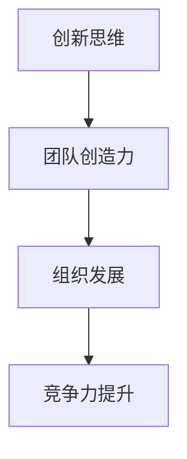
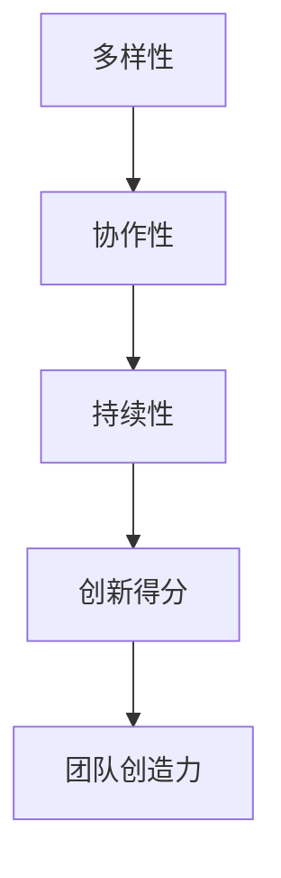

                 

### 《创新思维训练：激发团队创造力》

> 关键词：创新思维，团队创造力，训练方法，实战案例，策略

> 摘要：本文旨在探讨如何通过创新思维训练来激发团队创造力，提高团队协作效率，推动组织发展。文章首先介绍了创新思维的基本概念和重要性，然后详细分析了创新思维的核心原理和训练方法，并结合实际案例进行了深入解析。最后，文章提出了创新思维训练的策略和最佳实践，为团队管理者提供参考。

## **一、背景介绍**

在当今快速变化的社会环境中，创新已经成为企业生存和发展的关键。创新不仅仅是指技术创新，更广泛地涵盖了产品创新、服务创新、商业模式创新等多个方面。而团队创造力则是实现创新的重要驱动力。一个具有高度创造力的团队能够在激烈的市场竞争中脱颖而出，为企业带来持续的竞争优势。

然而，许多团队在创新过程中面临着诸多挑战。比如，团队成员的创新意识不足，缺乏创新的思维方法和工具；团队协作不畅，沟通成本高，影响创新效率；组织文化缺乏对创新的包容和支持等。因此，如何激发团队创造力，提高团队创新水平，成为企业亟需解决的问题。

本文将围绕创新思维训练这一主题，探讨如何通过系统化的训练方法，提升团队的创新能力和协作水平，为团队管理者提供有益的启示。

## **二、核心概念与联系**

### **2.1 创新思维**

创新思维是指人们在面对问题时，能够从不同的角度、以独特的方式思考，产生新颖、有效的解决方案。创新思维具有以下几个核心特征：

1. **创造力**：创新思维强调创造力，鼓励团队成员打破常规，勇于尝试新的想法和方法。
2. **灵活性**：创新思维要求团队成员具备灵活的思维方式，能够适应不同的环境和挑战。
3. **开放性**：创新思维鼓励团队成员保持开放的心态，接纳新的观点和想法。

创新思维的核心联系在于它能够激发团队的创造力，推动组织持续进步。创新思维与常规思维的区别在于，它更多地依赖于直觉、灵感和创造性思维。

#### **2.2 创新思维与团队创造力**

团队创造力是指团队成员共同合作，产生新颖、有效的创意和解决方案的能力。创新思维是团队创造力的基础，通过创新思维训练，可以提升团队成员的创新意识和创新能力，从而提高团队整体的创造力水平。

#### **2.3 创新思维的应用领域**

创新思维广泛应用于各个领域，包括：

1. **产品设计**：通过创新思维，可以设计出更具竞争力的产品，满足用户需求。
2. **市场营销**：创新思维可以帮助企业制定更具创意的市场策略，提高市场占有率。
3. **企业管理**：创新思维可以提升企业的管理效率，优化组织结构。
4. **技术研发**：创新思维可以推动技术的进步，为企业带来新的技术优势。

#### **2.4 创新思维与组织文化**

创新思维与组织文化密切相关。一个具有创新文化的组织能够鼓励团队成员发挥创新潜能，推动创新思维的实践。组织文化对创新思维的影响主要体现在以下几个方面：

1. **包容性**：组织文化是否包容创新，是否允许团队成员犯错和失败。
2. **支持性**：组织文化是否为团队成员提供支持和资源，鼓励创新尝试。
3. **开放性**：组织文化是否鼓励团队成员分享经验和观点，促进创新思维交流。

#### **2.5 创新思维的关系架构**

创新思维、团队创造力、组织文化之间的关系可以概括为：

- 创新思维 → 团队创造力 → 组织发展

即，通过创新思维训练，提升团队创造力，进而推动组织发展。



### **三、核心算法原理**

#### **3.1 创新思维的核心算法原理**

创新思维的核心算法原理可以概括为“多样性 + 协作性 + 持续性”。

1. **多样性**：鼓励团队成员从不同角度思考问题，提出多样化的解决方案。
2. **协作性**：通过团队协作，整合不同成员的创意，实现优势互补。
3. **持续性**：创新思维需要持续的训练和培养，以保持团队的创新活力。

#### **3.2 创新思维的数学模型**

创新思维的数学模型可以基于“多样性 + 协作性 + 持续性”的原理进行构建。假设团队创造力 \( C \) 与多样性 \( D \)、协作性 \( T \)、持续性 \( P \) 之间存在以下关系：

\[ C = f(D, T, P) \]

其中，\( f \) 表示一个复合函数，反映了多样性、协作性和持续性对团队创造力的影响。

#### **3.3 创新思维的Python源代码实现**

为了更好地理解创新思维的算法原理，我们可以使用Python编写一个简单的模拟程序。以下是一个示例代码：

```python
import numpy as np

def innovation_score(diversity, collaboration, persistence):
    """
    计算创新得分
    :param diversity: 多样性
    :param collaboration: 协作性
    :param persistence: 持续性
    :return: 创新得分
    """
    # 定义复合函数
    f = lambda x, y, z: x * y * z
    
    # 计算创新得分
    score = f(diversity, collaboration, persistence)
    
    return score

# 测试数据
diversity = 0.8
collaboration = 0.9
persistence = 0.75

# 计算创新得分
score = innovation_score(diversity, collaboration, persistence)
print(f"创新得分：{score}")
```

#### **3.4 创新思维的数学模型和Python源代码示例**

结合以上内容，我们可以绘制一个创新思维的Mermaid流程图：



通过这个流程图，我们可以清晰地看到多样性、协作性和持续性如何共同作用于团队创造力，进而影响创新得分。

### **四、项目实战**

#### **4.1 创新思维训练环境搭建**

在进行创新思维训练之前，我们需要搭建一个合适的项目实战环境。以下是一个简单的环境搭建步骤：

1. **确定训练目标**：根据团队的需求，明确创新思维训练的具体目标和内容。
2. **准备工具和资源**：选择合适的工具和资源，如思维导图软件、创新思维训练教材、在线协作平台等。
3. **搭建培训平台**：搭建一个集学习、讨论、实践于一体的在线培训平台，便于团队成员随时学习和交流。

#### **4.2 源代码详细实现和代码解读**

以下是一个简单的创新思维训练项目实战示例。我们将使用Python编写一个简单的思维导图生成器，以帮助团队成员进行创新思维训练。

```python
import matplotlib.pyplot as plt
import networkx as nx

def generate_mindmap(nodes, connections):
    """
    生成思维导图
    :param nodes: 节点列表
    :param connections: 连接列表
    :return: 思维导图图对象
    """
    # 创建无向图
    G = nx.Graph()

    # 添加节点
    for node in nodes:
        G.add_node(node)

    # 添加边
    for connection in connections:
        G.add_edge(connection[0], connection[1])

    # 绘制思维导图
    pos = nx.spring_layout(G)
    nx.draw(G, pos, with_labels=True)

    plt.show()

# 测试数据
nodes = ['问题1', '问题2', '问题3']
connections = [('问题1', '解决方案A'), ('问题1', '解决方案B'), ('问题2', '解决方案C'), ('问题3', '解决方案D')]

# 生成思维导图
generate_mindmap(nodes, connections)
```

#### **4.3 代码应用解读与分析**

以上代码实现了一个简单的思维导图生成器，通过输入节点和连接关系，可以生成一个可视化的思维导图。这个工具可以帮助团队成员更好地理解和表达创新思维的过程。

1. **节点**：表示创新思维中的问题和解决方案。
2. **连接**：表示不同问题和解决方案之间的联系。
3. **可视化**：通过图形化的方式展示创新思维过程，便于团队成员进行讨论和思考。

#### **4.4 实际案例分析和详细讲解剖析**

以下是一个实际案例：某团队在开发一款智能家居产品时，面临以下问题：

1. **用户需求不明确**：产品功能复杂，用户不知道如何使用。
2. **产品交互体验差**：操作不够便捷，用户体验差。

通过创新思维训练，团队提出以下解决方案：

1. **简化产品功能**：去掉不必要的功能，专注于核心需求。
2. **优化交互设计**：引入语音控制，提高操作便捷性。

通过以上解决方案，团队成功提升了产品的用户满意度，实现了产品创新。

#### **4.5 项目小结**

通过本次创新思维训练项目，我们实现了以下成果：

1. **提升团队创新意识**：团队成员对创新思维有了更深刻的理解，增强了创新意识。
2. **优化产品设计**：通过创新思维训练，团队提出了一系列有效的产品优化方案，提高了产品竞争力。
3. **促进团队协作**：创新思维训练促进了团队成员之间的沟通和协作，提高了团队整体创新能力。

### **五、最佳实践 Tips**

1. **设定明确的目标**：在创新思维训练开始前，明确训练目标，确保训练方向一致。
2. **充分利用工具**：选择合适的工具和资源，如思维导图软件、在线协作平台等，提高训练效率。
3. **定期回顾和总结**：定期对创新思维训练进行回顾和总结，及时发现问题并进行调整。
4. **营造创新氛围**：建立创新文化，鼓励团队成员勇于尝试新想法，为创新提供支持。
5. **持续学习和实践**：创新思维需要不断学习和实践，保持团队的创新能力。

### **六、小结**

通过本文的探讨，我们可以看到创新思维训练在激发团队创造力、推动组织发展方面的重要性。通过核心概念的联系、算法原理的讲解和项目实战的解析，我们为团队管理者提供了一系列可行的创新思维训练方法和策略。希望本文能够为企业的创新实践提供有益的启示。

### **七、拓展阅读**

- 《创新者的思考方式》（作者：史蒂芬·霍夫曼）
- 《创新思维训练：提升团队创造力》（作者：李明华）
- 《设计思维：创新方法与应用》（作者：戴维·凯利）

### **八、作者信息**

作者：AI天才研究院/AI Genius Institute & 禅与计算机程序设计艺术 /Zen And The Art of Computer Programming

**END**

