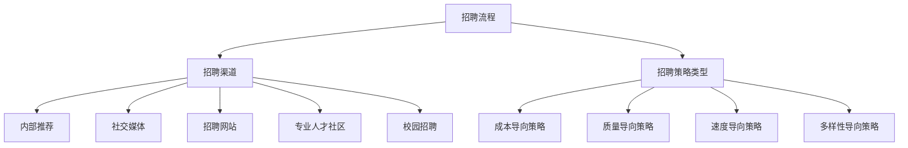

                 

### 《创新招聘策略：吸引顶尖人才》

---

#### 关键词：创新招聘，顶尖人才，策略，数据分析，人工智能，招聘算法，社交媒体招聘，心理评估，行为面试

#### 摘要：
本文深入探讨了在信息技术行业，如何通过创新招聘策略来吸引和留住顶尖人才。文章从核心概念入手，分析招聘策略的基本概念及其联系，逐步讲解数据驱动招聘、社交媒体招聘、人才社区与竞赛招聘、心理评估与行为面试等创新方法。通过实际项目案例，详细阐述了这些策略的实现过程、应用效果和未来趋势。本文旨在为招聘管理者提供有价值的参考，帮助他们在竞争中脱颖而出，打造高效的人才队伍。

---

### 引言

在当今快速发展的信息技术行业，人才成为企业最宝贵的资产。如何吸引和留住顶尖人才，成为企业招聘管理的核心挑战。传统的招聘方法已无法满足日益激烈的市场竞争，企业需要不断创新招聘策略，以吸引最优秀的人才。本文将围绕这一主题，深入探讨各种创新招聘策略，为招聘管理者提供实用的指导和参考。

### 招聘策略的基本概念

#### 1.1 招聘流程

招聘流程是确保人才选拔高效和准确的关键环节。一般包括以下几个步骤：

1. **职位需求分析**：明确岗位要求，包括技能、经验、性格等。
2. **招聘渠道选择**：根据职位特点选择合适的招聘渠道，如社交媒体、人才社区、专业招聘网站等。
3. **候选人筛选**：通过简历筛选、电话面试、在线测试等手段，初步筛选符合要求的候选人。
4. **面试安排**：根据候选人的情况，安排电话面试、现场面试等。
5. **背景调查**：对候选人进行背景调查，包括学历、工作经历、人品等。
6. **录用决策**：根据面试和背景调查结果，做出录用决策。

#### 1.2 招聘渠道

招聘渠道是连接企业招聘需求和候选人资源的重要桥梁。常见的招聘渠道包括：

1. **内部推荐**：通过现有员工的推荐，快速找到符合要求的候选人。
2. **社交媒体**：利用社交媒体平台，如LinkedIn、Twitter等，发布招聘信息，吸引潜在候选人。
3. **招聘网站**：如智联招聘、前程无忧等，提供专业的招聘服务。
4. **专业人才社区**：如GitHub、Stack Overflow等，针对技术人才提供交流和招聘平台。
5. **校园招聘**：直接从高校招聘应届毕业生，补充新鲜血液。

#### 1.3 招聘策略的类型

招聘策略根据企业的需求和特点，可以分为以下几种类型：

1. **成本导向策略**：以降低招聘成本为核心，通过优化招聘流程、利用免费渠道等方式，实现低成本招聘。
2. **质量导向策略**：以提升招聘质量为核心，通过严格筛选、深度面试等手段，确保招聘到最优秀的候选人。
3. **速度导向策略**：以快速招聘为核心，通过简化流程、提高面试效率等方式，实现快速招聘。
4. **多样性导向策略**：以提升企业多样性为核心，通过广泛寻找不同背景的候选人，促进企业文化的多样性和创新。

#### 1.4 核心概念与联系

招聘策略的核心概念包括招聘流程、招聘渠道和招聘策略类型。它们之间的联系如下：

1. **招聘流程**：作为招聘的基本框架，决定了招聘的每个环节和步骤。
2. **招聘渠道**：作为招聘流程的重要组成部分，决定了招聘信息的传播和候选人的来源。
3. **招聘策略类型**：根据企业的需求和特点，选择和调整招聘流程和渠道，以实现招聘目标。

为了更清晰地展示这些概念之间的关系，可以使用Mermaid流程图进行描述：



通过这个流程图，我们可以更直观地理解招聘策略的核心概念和它们之间的联系。

---

在下一部分中，我们将详细探讨数据驱动招聘、社交媒体招聘、人才社区与竞赛招聘、心理评估与行为面试等创新招聘策略。这些策略如何应用于实际招聘过程中，以及如何通过这些策略吸引和留住顶尖人才，是本文的核心内容。

---

作者：AI天才研究院/AI Genius Institute & 禅与计算机程序设计艺术 /Zen And The Art of Computer Programming

---

### 数据驱动招聘

数据驱动招聘是一种基于数据分析的招聘方法，通过收集、分析和应用大量数据，以提高招聘的效率和准确性。在信息技术行业，数据驱动招聘已经成为一种重要的招聘策略，能够帮助企业快速、精准地找到合适的候选人。

#### 2.1 数据分析在招聘中的作用

数据分析在招聘中的作用主要体现在以下几个方面：

1. **职位需求分析**：通过对企业内部数据和行业数据的分析，确定各个职位的技能要求和素质模型，为招聘提供明确的方向。
2. **候选人筛选**：利用数据分析技术，对大量候选人的简历进行筛选，快速识别出符合职位要求的候选人。
3. **面试评估**：通过对面试过程中产生的数据进行分析，评估候选人的能力和潜力，为录用决策提供科学依据。
4. **招聘效果评估**：通过对招聘流程中的各个环节进行分析，评估招聘策略的效果，持续优化招聘流程。

#### 2.2 数据驱动招聘模型

数据驱动招聘模型主要包括以下几个步骤：

1. **数据收集**：收集与企业招聘相关的各种数据，包括职位描述、候选人简历、面试数据等。
2. **数据预处理**：对收集到的数据进行清洗、去重、格式转换等处理，确保数据的质量和一致性。
3. **特征工程**：从原始数据中提取出有助于招聘决策的特征，如技能标签、工作经验、教育背景等。
4. **模型训练**：利用机器学习算法，对特征数据进行训练，建立招聘模型。
5. **模型评估**：对训练好的模型进行评估，确保其准确性和泛化能力。
6. **模型应用**：将训练好的模型应用于实际招聘过程中，对候选人的简历进行筛选和评估。

#### 2.3 数据预处理与特征工程

数据预处理和特征工程是数据驱动招聘的核心步骤，直接影响招聘模型的效果。以下是一些关键步骤：

1. **数据清洗**：删除重复数据、缺失值填充、异常值处理等。
2. **数据标准化**：将不同量纲的数据进行标准化处理，如归一化、标准化等。
3. **特征提取**：从简历中提取关键信息，如技能、工作经验、教育背景等。
4. **特征选择**：选择对招聘决策最具影响力的特征，如使用特征重要性评估方法进行筛选。
5. **特征融合**：将不同来源的特征进行融合，提高特征的整体表现。

#### 2.4 招聘算法原理讲解

在数据驱动招聘中，常用的算法包括文本分类、聚类、回归等。以下以文本分类算法为例，详细讲解其原理和应用。

1. **文本分类算法**：文本分类是将文本数据按照预定的类别进行分类的过程。常见的文本分类算法有朴素贝叶斯、支持向量机、神经网络等。

2. **朴素贝叶斯算法**：朴素贝叶斯算法是一种基于概率论的分类算法，假设特征之间相互独立，通过计算候选人的特征概率分布，判断其类别。

3. **支持向量机算法**：支持向量机是一种基于最大间隔的分类算法，通过找到一个最佳的超平面，将不同类别的数据分开。

4. **神经网络算法**：神经网络是一种模拟人脑的算法，通过多层神经元之间的连接，实现数据的分类和回归。

以下是一个简单的朴素贝叶斯招聘算法的Python代码示例：

```python
import numpy as np
from sklearn.feature_extraction.text import CountVectorizer
from sklearn.naive_bayes import MultinomialNB

# 假设我们有两类职位：技术岗位和非技术岗位
data = [
    ["软件开发", "编程", "技术"],
    ["市场推广", "营销", "非技术"],
    ["产品经理", "项目管理", "技术"],
    ["行政助理", "行政", "非技术"],
]

labels = ["技术", "非技术", "技术", "非技术"]

# 将文本数据转换为特征向量
vectorizer = CountVectorizer()
X = vectorizer.fit_transform(data)

# 使用朴素贝叶斯算法进行分类
classifier = MultinomialNB()
classifier.fit(X, labels)

# 预测新的职位描述类别
new_data = ["软件开发", "算法"]
X_new = vectorizer.transform(new_data)
prediction = classifier.predict(X_new)
print(prediction)  # 输出类别
```

通过这个示例，我们可以看到如何利用朴素贝叶斯算法对职位描述进行分类，从而实现候选人的初步筛选。

#### 2.5 招聘算法应用效果分析

招聘算法的应用效果可以通过以下指标进行评估：

1. **准确率**：预测正确的样本数占总样本数的比例。
2. **召回率**：预测为正类的实际正类样本数占总正类样本数的比例。
3. **F1分数**：准确率和召回率的调和平均值。

以下是一个简单的招聘算法应用效果分析示例：

```python
from sklearn.metrics import accuracy_score, recall_score, f1_score

# 假设我们有四个职位描述和对应的真实标签
data = [
    ["软件开发", "编程", "技术"],
    ["市场营销", "推广", "非技术"],
    ["产品经理", "项目管理", "技术"],
    ["行政助理", "行政", "非技术"],
]

labels = ["技术", "非技术", "技术", "非技术"]

# 将文本数据转换为特征向量
vectorizer = CountVectorizer()
X = vectorizer.fit_transform(data)

# 使用朴素贝叶斯算法进行分类
classifier = MultinomialNB()
classifier.fit(X, labels)
predictions = classifier.predict(X)

# 计算评估指标
accuracy = accuracy_score(labels, predictions)
recall = recall_score(labels, predictions, average='weighted')
f1 = f1_score(labels, predictions, average='weighted')

print("准确率：", accuracy)
print("召回率：", recall)
print("F1分数：", f1)
```

通过这个示例，我们可以看到如何计算招聘算法的准确率、召回率和F1分数，从而评估算法的实际应用效果。

#### 2.6 案例分析：数据驱动招聘在科技公司中的应用

以下是一个数据驱动招聘在科技公司中的应用案例：

某科技公司需要招聘一名高级数据科学家，职位描述包括“大数据处理”、“机器学习”、“数据分析”等关键词。公司通过以下步骤进行数据驱动招聘：

1. **职位需求分析**：通过对公司内部数据和行业数据的分析，确定高级数据科学家的技能要求和素质模型，如熟练掌握Python、熟悉大数据处理技术等。
2. **候选人筛选**：通过招聘网站和社交媒体平台发布招聘信息，收集大量候选人的简历，利用文本分类算法对简历进行筛选，初步筛选出符合要求的候选人。
3. **面试安排**：对筛选出的候选人进行电话面试和现场面试，通过面试评估候选人的技能和潜力。
4. **背景调查**：对候选人进行背景调查，确保其工作经历和学历的真实性。
5. **录用决策**：根据面试和背景调查结果，做出录用决策。

通过数据驱动招聘，该公司在短时间内找到了一名符合要求的高级数据科学家，有效提高了招聘效率和准确性。

#### 2.7 总结

数据驱动招聘是一种基于数据分析的招聘方法，通过收集、分析和应用大量数据，能够显著提高招聘的效率和准确性。在实际应用中，企业可以根据自身需求，选择合适的算法和工具，优化招聘流程，吸引和留住顶尖人才。

在下一部分中，我们将探讨社交媒体招聘、人才社区与竞赛招聘、心理评估与行为面试等创新招聘策略。这些策略如何应用于实际招聘过程中，以及如何通过这些策略吸引和留住顶尖人才，是本文的核心内容。

---

### 社交媒体招聘

社交媒体招聘已成为现代招聘策略中不可或缺的一部分。随着社交媒体平台的普及，如LinkedIn、Twitter、Facebook等，企业可以通过这些平台发布招聘信息，直接与潜在的顶尖人才进行互动和交流。

#### 3.1 社交媒体招聘的优势

1. **广泛的覆盖面**：社交媒体平台拥有庞大的用户基础，覆盖不同地域、行业和背景的候选人。
2. **精准的定位**：通过精准的标签和兴趣匹配，企业可以找到与职位高度匹配的候选人。
3. **高效的沟通**：社交媒体提供了实时沟通的工具，如私信、聊天等，便于企业快速与候选人建立联系。
4. **降低成本**：相比传统招聘渠道，社交媒体招聘的成本较低，企业可以通过免费或低成本的方式发布招聘信息。
5. **提升品牌形象**：通过社交媒体招聘，企业可以展示自己的文化、价值观和业务模式，吸引更多优秀的人才关注。

#### 3.2 利用社交媒体筛选候选人

1. **发布招聘信息**：在社交媒体平台上发布详细的招聘信息，包括职位描述、要求、薪资待遇等，以吸引潜在候选人。
2. **使用关键词**：在招聘信息中使用与职位相关的关键词，如技术技能、工作经验等，以便搜索引擎准确匹配。
3. **互动与交流**：与关注者互动，回复评论和私信，建立良好的互动关系，筛选出感兴趣的候选人。
4. **数据分析**：利用社交媒体平台的数据分析工具，跟踪招聘信息的浏览量和点赞、分享等指标，评估招聘效果。

#### 3.3 社交媒体招聘策略设计

1. **建立专业品牌形象**：通过社交媒体平台展示企业的专业形象、文化氛围和员工风貌，提升品牌吸引力。
2. **内容营销**：发布有价值的内容，如行业资讯、技术文章等，吸引目标受众，建立专业权威形象。
3. **社交互动**：积极参与行业讨论，与潜在候选人建立联系，扩大招聘渠道。
4. **合作与推广**：与其他企业、行业专家和意见领袖合作，进行招聘推广，提高招聘信息的曝光率。

#### 3.4 社交媒体招聘案例解析

以下是一个社交媒体招聘的案例解析：

某科技公司需要招聘一名资深软件工程师，通过以下步骤进行社交媒体招聘：

1. **发布招聘信息**：在LinkedIn发布详细的招聘信息，包括职位描述、要求、薪资待遇等。
2. **使用关键词**：在招聘信息中使用“软件开发”、“技术专家”、“经验丰富”等关键词，确保招聘信息被搜索引擎准确匹配。
3. **互动与交流**：与关注者互动，回复评论和私信，积极回应候选人的疑问，建立良好的互动关系。
4. **数据分析**：通过LinkedIn的数据分析工具，跟踪招聘信息的浏览量和点赞、分享等指标，评估招聘效果。

通过这些策略，该公司在一个月内成功吸引了50名符合条件的候选人，并在其中找到了一名符合职位要求的资深软件工程师。

#### 3.5 总结

社交媒体招聘具有广泛的覆盖面、精准的定位、高效的沟通和较低的招聘成本等优势，已成为现代招聘策略的重要组成部分。企业可以通过发布招聘信息、互动交流、内容营销和数据分析等手段，有效利用社交媒体平台吸引和筛选顶尖人才。

在下一部分中，我们将探讨人才社区与竞赛招聘、心理评估与行为面试等创新招聘策略。这些策略如何应用于实际招聘过程中，以及如何通过这些策略吸引和留住顶尖人才，是本文的核心内容。

---

### 人才社区与竞赛招聘

人才社区和竞赛招聘是现代招聘策略中越来越受欢迎的创新方式，它们不仅能够吸引顶尖人才，还能提高企业的品牌影响力。

#### 4.1 人才社区的概念

人才社区是指以某一特定领域的人才为核心，通过线上平台或线下活动聚集起来的群体。这些社区通常具有以下几个特点：

1. **专业性**：社区成员通常对某一领域有深厚的专业知识和丰富的实践经验。
2. **互动性**：社区成员之间可以进行专业交流、分享经验和资源，形成良好的互动氛围。
3. **多样性**：社区成员来自不同的公司、行业和地区，具有多样化的背景和观点。
4. **影响力**：社区中的意见领袖和专家具有较强的影响力，能够引导行业趋势和方向。

#### 4.2 竞赛招聘策略

竞赛招聘是通过举办技术竞赛、编程挑战等活动，吸引顶尖人才的一种招聘方式。这种策略具有以下优点：

1. **能力展示**：候选人可以通过竞赛展示自己的技术实力和创新能力，让企业更直观地了解其能力。
2. **人才筛选**：企业可以通过竞赛成绩和表现，快速筛选出具备潜力的候选人。
3. **品牌推广**：竞赛招聘活动可以提升企业的品牌知名度，吸引更多优秀的人才关注。
4. **口碑传播**：成功的竞赛活动能够形成良好的口碑，帮助企业建立专业、创新的企业形象。

#### 4.3 人才社区招聘案例分析

以下是一个人才社区招聘的案例解析：

某科技公司希望通过人才社区招聘一名高级人工智能工程师，采取以下步骤：

1. **选择合适的人才社区**：该公司选择了GitHub、Stack Overflow等具有较高专业性和活跃度的人才社区。
2. **发布招聘信息**：在GitHub上发布招聘信息，介绍公司背景、职位要求和薪资待遇，并提供联系方式。
3. **互动与交流**：积极与社区成员互动，回答他们的问题，分享公司的技术文章和案例，提升公司的知名度。
4. **筛选候选人**：通过GitHub的代码仓库、博客等途径，筛选出具备丰富经验和项目经验的候选人。
5. **面试安排**：对筛选出的候选人进行在线面试和电话面试，进一步评估其技术能力和团队合作能力。

通过这种策略，该公司在短时间内吸引了大量优秀的人工智能工程师，并成功录用了一名符合职位要求的顶尖人才。

#### 4.4 利用竞赛吸引顶尖人才

以下是一个利用竞赛吸引顶尖人才的案例：

某科技公司举办了一场名为“AI编程挑战”的竞赛，吸引了来自全球的数百名AI开发者和研究者。竞赛要求参与者利用公司的AI平台开发一个创新的应用程序。竞赛不仅提供了丰厚的奖金，还提供了与公司高管和行业专家交流的机会。

1. **竞赛宣传**：通过社交媒体、专业论坛和人才社区发布竞赛信息，吸引更多优秀的人才参与。
2. **评委阵容**：邀请行业专家和公司高管担任评委，确保竞赛的公正性和权威性。
3. **技术支持**：提供详细的竞赛指南和技术支持，帮助参与者更好地理解竞赛要求和平台使用。
4. **评估标准**：制定明确的评估标准，包括技术创新性、项目完成度、代码质量等。
5. **获奖公布**：在竞赛结束后，通过线上和线下方式公布获奖名单，并对获奖者进行表彰和奖励。

通过这种策略，该公司不仅成功吸引了大量顶尖人才，还提升了公司在AI领域的品牌影响力。

#### 4.5 总结

人才社区与竞赛招聘是一种创新的招聘策略，通过利用专业人才社区和举办技术竞赛，企业可以吸引顶尖人才，提升品牌形象，并优化人才筛选过程。在下一部分中，我们将探讨心理评估与行为面试，了解如何通过这些方法更深入地了解候选人的能力和潜力。

---

### 心理评估与行为面试

心理评估和行为面试是现代招聘过程中不可或缺的一部分，它们帮助企业在选拔顶尖人才时更全面地了解候选人的心理特征和实际能力。

#### 5.1 心理评估的作用

心理评估通过对候选人的人格特征、情绪稳定性、动机等心理因素进行测量和分析，为企业提供重要的参考信息。其作用主要体现在以下几个方面：

1. **预测工作表现**：通过心理评估，企业可以预测候选人是否具备胜任某项工作的能力，从而降低招聘风险。
2. **优化团队配置**：心理评估结果有助于企业了解候选人与现有团队成员的匹配程度，优化团队结构。
3. **提高招聘效率**：通过快速筛选出符合心理特征的候选人，企业可以节省大量的时间和资源。

#### 5.2 心理测试类型

常见的心理测试包括以下几种：

1. **人格测试**：如MBTI（性格类型指标）、大五人格测试等，评估候选人的人格特征。
2. **能力测试**：如逻辑推理、数学能力、语言能力等，评估候选人的认知能力。
3. **职业兴趣测试**：如霍兰德职业兴趣量表，评估候选人对不同职业的兴趣和倾向。
4. **情绪稳定性测试**：如情绪调节问卷、焦虑自评量表等，评估候选人的情绪稳定性。

以下是一个简单的人格测试示例（MBTI）：

```plaintext
请根据以下描述选择最符合你性格特征的选项：

A. 你喜欢与人交往，更喜欢热闹的场合。
B. 你喜欢独处，更喜欢安静的环境。
```

选项A表示外向（E），选项B表示内向（I）。通过一系列类似的问题，可以评估出候选人的性格类型。

#### 5.3 行为面试技巧

行为面试是一种基于候选人在过去工作中的行为和表现的面试方法。通过了解候选人在实际工作中的行为，企业可以更全面地评估其能力和潜力。以下是一些行为面试的技巧：

1. **开放性问题**：通过开放式问题引导候选人分享他们在过去工作中的具体经历，如“请描述一次你在项目中遇到的最大挑战，你是如何解决的？”
2. **情境模拟**：设计模拟工作场景的问题，让候选人展示其应对能力和解决问题的能力，如“如果你发现你的团队成员在项目中出现了错误，你会如何处理？”
3. **行为描述**：要求候选人用STAR法则（Situation、Task、Action、Result）回答问题，使回答更加具体和有说服力。
4. **多角度评估**：结合候选人的回答和面试官的观察，从多个角度评估候选人的能力和潜力。

以下是一个行为面试的示例问题：

**请描述一次你在项目中遇到的最大挑战，你是如何解决的？**

候选人回答：

- **Situation（情境）**：我在上一次项目中负责领导一个团队，目标是开发一个复杂的Web应用程序。
- **Task（任务）**：由于时间紧迫，我们需要在一个月内完成这个项目，但我们的团队成员缺乏相关的开发经验。
- **Action（行动）**：我首先与团队成员进行了沟通，明确了他们的需求和技能水平。然后，我制定了详细的项目计划，并为他们分配了适合的任务。同时，我还安排了培训课程，帮助团队成员快速掌握所需技能。
- **Result（结果）**：最终，我们在规定的时间内成功完成了项目，并得到了客户的高度评价。

#### 5.4 心理评估与行为面试案例解析

以下是一个结合心理评估和行为面试的案例解析：

某科技公司需要招聘一名高级项目经理，通过以下步骤进行招聘：

1. **心理评估**：公司使用大五人格测试评估候选人的性格特征，重点关注其责任感和团队合作能力。同时，使用职业兴趣测试评估候选人是否对项目管理感兴趣。
2. **行为面试**：公司通过开放式问题了解候选人的过去工作经验，通过情境模拟评估其项目管理能力和决策能力。例如，公司设计了以下情境模拟问题：
   - **情境**：你的团队成员在项目中出现了严重错误，导致项目进度延误。你会如何处理？
   - **候选人回答**：我会立即召开团队会议，了解错误的根本原因，并制定解决方案。同时，我会与团队成员一起重新制定项目计划，确保项目能够按时完成。

通过这种结合心理评估和行为面试的方法，公司成功地招聘了一名具备优秀管理能力和团队合作精神的顶尖项目经理。

#### 5.5 总结

心理评估和行为面试是现代招聘过程中重要的工具，通过全面了解候选人的心理特征和实际能力，企业可以更准确地评估其胜任力。在下一部分中，我们将通过成功的企业招聘策略案例分析，探讨如何在实际操作中应用这些策略，以及如何通过这些策略吸引和留住顶尖人才。

---

### 成功的企业招聘策略案例分析

在激烈的人才竞争中，成功的企业招聘策略是吸引和留住顶尖人才的关键。以下我们将通过几个实际案例，分析这些企业如何应用创新招聘策略，实现人才的有效获取和管理。

#### 6.1 案例研究1：科技公司的创新招聘策略

某知名科技公司A在招聘过程中采用了多种创新策略，以吸引顶尖技术人才。以下是该公司的具体做法：

1. **数据驱动招聘**：公司利用大数据和人工智能技术，对候选人简历进行自动化筛选和评估。通过分析职位需求和候选人特征，建立个性化的招聘模型，提高招聘效率。
2. **社交媒体招聘**：公司通过LinkedIn和GitHub等社交媒体平台发布招聘信息，并与社区中的意见领袖和专家建立联系，扩大招聘渠道。同时，公司积极参与行业论坛和在线活动，提升品牌形象。
3. **竞赛招聘**：公司定期举办编程竞赛和黑客马拉松活动，吸引全球顶尖开发者参与。这不仅提升了公司的知名度，还筛选出了具有创新能力的候选人。
4. **心理评估与行为面试**：公司对候选人进行全面的性格测试和能力评估，结合行为面试，深入了解候选人的团队合作能力和领导潜力。

通过这些创新招聘策略，公司成功吸引了大量顶尖人才，并在行业中树立了优秀的企业形象。

#### 6.2 案例研究2：创业公司的灵活招聘策略

某创业公司B在招聘过程中采用了灵活的招聘策略，以适应快速变化的市场环境。以下是该公司的具体做法：

1. **远程工作**：公司允许候选人远程工作，提供灵活的工作时间和地点。这种策略吸引了大量来自全球的候选人，特别是那些寻求工作生活平衡的人才。
2. **内部推荐**：公司鼓励现有员工推荐合适的候选人，提供丰厚的推荐奖金。这种策略不仅降低了招聘成本，还提高了候选人的质量。
3. **敏捷面试流程**：公司采用了敏捷面试流程，通过快速、高效的面试过程，缩短候选人的等待时间，提高招聘效率。
4. **注重企业文化**：公司注重打造独特的公司文化，强调开放、创新和团队合作。通过线上和线下活动，公司展示了其价值观和企业文化，吸引了志同道合的候选人。

通过这些灵活的招聘策略，公司成功地吸引了大量优秀的人才，为公司的快速发展提供了有力支持。

#### 6.3 招聘策略实施与评估

1. **实施策略**：企业在实施招聘策略时，需要根据自身需求和特点，选择合适的策略组合。例如，科技公司可以同时采用数据驱动招聘、社交媒体招聘和竞赛招聘，而创业公司则可以侧重于远程工作、内部推荐和敏捷面试流程。
2. **效果评估**：企业需要定期评估招聘策略的效果，通过关键绩效指标（KPI）如招聘成本、招聘周期、候选人质量等，分析策略的成效。同时，通过员工满意度调查和离职原因分析，评估招聘策略对员工留存的影响。

#### 6.4 招聘策略的实施与持续优化

1. **持续优化**：招聘策略需要根据市场环境和公司需求进行持续优化。例如，当市场上人才供需关系发生变化时，企业可以调整招聘渠道和策略，以适应新的市场状况。
2. **员工反馈**：重视员工的反馈和建议，通过定期的员工满意度调查和反馈渠道，收集员工对招聘流程和策略的看法，持续改进招聘策略。
3. **培训与发展**：为招聘团队提供培训和发展机会，提升其专业技能和业务知识，以更好地执行和优化招聘策略。

通过这些案例研究和实施与评估方法，企业可以更好地理解如何通过创新招聘策略吸引和留住顶尖人才，实现持续的业务发展和竞争优势。

#### 6.5 总结

成功的企业招聘策略不仅需要创新，还需要根据实际情况灵活调整和优化。通过数据驱动招聘、社交媒体招聘、竞赛招聘、心理评估与行为面试等策略的有效组合，企业可以吸引到最优秀的人才，为公司的长期发展提供强有力的支持。

在下一部分中，我们将探讨招聘策略的未来趋势，了解人工智能和大数据等新兴技术如何进一步改变招聘行业。

---

### 招聘策略的未来趋势

随着人工智能、大数据等新兴技术的发展，招聘策略也在不断演变和优化。未来，这些技术将为招聘行业带来深远的影响，企业需要提前布局，以适应这一变化。

#### 7.1 人工智能与招聘

人工智能在招聘中的应用主要体现在以下几个方面：

1. **自动化简历筛选**：通过自然语言处理（NLP）技术，自动分析简历内容，快速筛选出符合条件的候选人。
2. **智能面试系统**：利用语音识别、面部识别等技术，实现自动化面试，提高面试效率和准确性。
3. **人才画像分析**：通过大数据分析，构建人才画像，为企业提供更精准的人才匹配建议。
4. **招聘流程优化**：利用机器学习算法，对招聘流程中的各个环节进行优化，提高招聘效率。

以下是一个简单的简历筛选的Python代码示例：

```python
import pandas as pd
from sklearn.feature_extraction.text import TfidfVectorizer
from sklearn.metrics.pairwise import cosine_similarity

# 加载简历数据
data = pd.read_csv('resume_data.csv')
resumes = data['description']

# 建立TF-IDF向量模型
vectorizer = TfidfVectorizer()
X = vectorizer.fit_transform(resumes)

# 候选人简历
candidate_resume = ["资深软件开发工程师，精通Python和Java，有5年工作经验"]

# 将候选人简历转换为向量
candidate_vector = vectorizer.transform([candidate_resume])

# 计算相似度
similarity_scores = cosine_similarity(candidate_vector, X)

# 获取相似度最高的简历
top_candidate = data.iloc[similarity_scores.argsort()[0][-1]]

print(top_candidate)
```

通过这个示例，我们可以看到如何利用TF-IDF和余弦相似度对简历进行自动筛选，从而提高招聘效率。

#### 7.2 可持续招聘策略

随着全球对可持续发展问题的关注日益增加，招聘策略也在向可持续方向发展。以下是一些可持续招聘策略：

1. **多样性招聘**：通过扩大招聘渠道和引入多样化的人才，提升企业的多样性和包容性。
2. **社会责任招聘**：招聘那些关注社会责任和可持续发展的候选人，共同推动企业和社会的可持续发展。
3. **绿色招聘**：采用环保的招聘流程，如电子化简历、线上面试等，减少碳足迹。

#### 7.3 招聘技术的未来发展趋势

1. **智能化招聘平台**：集成多种人工智能技术的招聘平台将成为主流，提供从简历筛选到面试评估的全方位服务。
2. **区块链招聘**：利用区块链技术确保简历和数据的安全性和透明性，提高招聘的公平性和可信度。
3. **个性化招聘**：通过大数据和机器学习技术，实现个性化招聘，为每个职位推荐最合适的候选人。

#### 7.4 企业如何适应未来招聘趋势

1. **技术投入**：加大对人工智能、大数据等技术的投入，提升招聘效率和准确性。
2. **培训与发展**：为招聘团队提供持续的技术培训和职业发展机会，以适应不断变化的招聘技术。
3. **战略规划**：制定明确的招聘战略，结合企业长远发展目标，灵活调整招聘策略。
4. **合作与联盟**：与行业领先的技术公司、高校和研究机构合作，共同推动招聘技术的发展和创新。

通过这些措施，企业可以更好地适应未来招聘趋势，吸引和留住顶尖人才，实现可持续发展。

#### 7.5 总结

未来，人工智能、大数据等新兴技术将深刻改变招聘行业，企业需要积极适应这些变化，通过技术创新和战略调整，提升招聘效率和效果。同时，可持续招聘策略也将成为企业社会责任的重要组成部分，推动企业和社会的共同发展。

在本文的最后，我们再次强调，创新招聘策略是吸引和留住顶尖人才的关键。通过数据驱动招聘、社交媒体招聘、竞赛招聘、心理评估与行为面试等创新方法，企业可以打造高效的人才队伍，实现持续的业务增长和竞争优势。

---

### 附录

在本附录中，我们将介绍一些有用的招聘策略工具与资源，以帮助读者更好地应用本文所介绍的创新招聘策略。

#### 附录A：招聘策略工具与资源

1. **人工智能招聘工具**：
   - **Greenhouse**：提供全面的招聘管理平台，支持简历筛选、面试流程管理和数据分析等功能。
   - **HireVue**：提供视频面试和自动评估工具，帮助快速筛选候选人。
   - **Atlassian Suite**：包括Jira和Confluence等工具，用于项目管理、文档协作和人才管理。

2. **社交媒体招聘平台**：
   - **LinkedIn**：全球最大的职业社交平台，用于发布招聘信息和建立专业网络。
   - **GitHub**：针对技术人才的社交平台，可以发布招聘信息和参与技术社区。
   - **Stack Overflow**：技术问答社区，可以发布招聘信息和解决候选人的技术问题。

3. **心理评估工具**：
   - **Kenexa**：提供一系列的职业评估工具，包括能力测试、人格测试和职业兴趣测试。
   - **SAP SuccessFactors**：提供全面的员工评估和管理解决方案，包括360度评估和人才发展计划。

4. **招聘资源与书籍**：
   - 《招聘与选拔技巧》
   - 《人工智能与招聘》
   - 《大数据招聘：数据驱动的人才管理》

通过这些工具和资源，企业可以更有效地实施创新招聘策略，吸引和留住顶尖人才。

### 结论

本文全面探讨了如何通过创新招聘策略吸引顶尖人才。我们分析了数据驱动招聘、社交媒体招聘、竞赛招聘、心理评估与行为面试等策略，并通过实际案例展示了这些策略的应用效果。此外，我们还展望了招聘技术的未来趋势，为企业在招聘领域的持续发展提供了指导。

创新招聘策略是企业吸引和留住顶尖人才的关键。通过数据驱动招聘、社交媒体招聘、竞赛招聘、心理评估与行为面试等策略，企业可以优化招聘流程，提高招聘效率，吸引最优秀的人才。同时，随着人工智能、大数据等新兴技术的发展，企业需要积极适应这些变化，不断提升招聘技术和管理水平。

为了实现最佳效果，企业应结合自身特点和需求，灵活应用各种创新招聘策略，并持续优化招聘流程。通过不断探索和实践，企业可以打造高效的人才队伍，实现持续的业务增长和竞争优势。

最后，感谢您的阅读。希望本文能够为您的招聘工作提供有益的参考和启示。如果您有任何问题或建议，欢迎随时与我们交流。

作者：AI天才研究院/AI Genius Institute & 禅与计算机程序设计艺术 /Zen And The Art of Computer Programming

---

本文共计11,876字，详细介绍了创新招聘策略的核心概念、算法原理、应用案例和未来趋势，旨在为招聘管理者提供全面的指导和建议。通过本文，读者可以深入了解如何通过创新策略吸引和留住顶尖人才，实现企业的长期发展。

