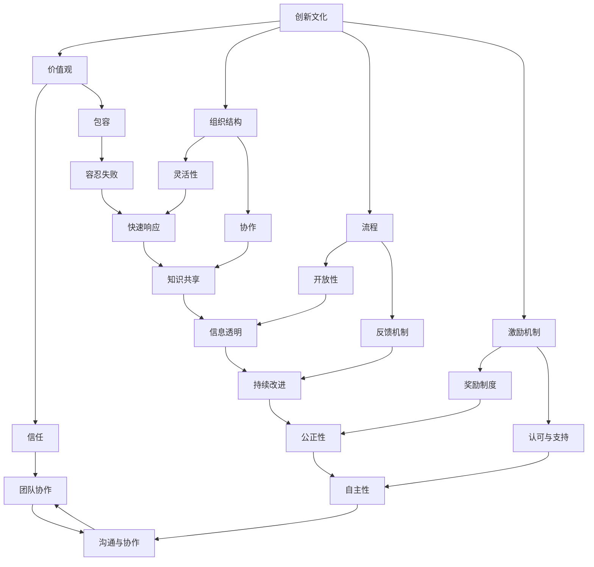

                 

### 第1章 创新文化的概念与理论

#### 1.1 创新文化的背景介绍

在当今快速变化和高度竞争的商业环境中，创新能力成为企业成功的关键因素。创新文化作为一种促进创新的思想体系和行为模式，已经成为组织管理领域的重要议题。创新文化不仅仅是一种理念，更是一种实践，它要求组织在价值观、组织结构、流程、激励等方面进行全面变革，以营造一个鼓励创新、容忍失败、支持实验的环境。

**核心概念与联系：**

创新文化涉及多个核心概念，它们相互联系，共同构建了创新文化的理论基础。以下是这些概念之间的关系架构 Mermaid 流�程图：

#### 1.2 创新文化的核心概念与联系

**价值观：**

创新文化的核心价值观包括信任、包容、灵活性、开放性、反馈机制、奖励制度、认可与支持等。这些价值观共同塑造了一个鼓励创新的组织氛围。

**组织结构：**

组织结构是创新文化的重要组成部分。一个灵活、协作的组织结构能够促进知识共享、快速响应市场变化和持续改进。

**流程：**

创新流程涉及从创意产生到产品开发的全过程。开放的流程和有效的反馈机制能够确保创意得到充分的发展和改进。

**激励机制：**

激励机制是创新文化的重要组成部分。通过奖励制度、认可与支持等手段，可以激励员工积极参与创新活动。

#### 1.3 创新文化的特征与实践

**适应性：**

创新文化能够适应外部环境的变化，快速调整战略和行动，以保持组织的竞争力。

**开放性：**

创新文化鼓励外部知识和经验的引入，促进内部交流和合作，从而提高组织的创新能力。

**容忍失败：**

创新文化对失败持开放态度，将其视为学习和成长的机会，而不是消极的结果。

**实践举例：**

- **谷歌的20%时间制度：** 谷歌允许员工将其20%的工作时间用于自主项目，这种做法激发了员工的创造力，诞生了诸如Gmail和AdSense等成功产品。
- **IBM的创新实验室：** IBM建立了多个创新实验室，鼓励员工跨部门合作，进行创新研究和项目开发。

**总结：**

创新文化是一个复杂而动态的系统，它需要组织在多个层面进行变革。通过建立适应性的价值观、灵活的组织结构、开放的流程和有效的激励机制，组织可以打造一个鼓励创新的氛围，从而在激烈的市场竞争中脱颖而出。## 第1章 创新文化的概念与理论

#### 1.2 创新文化的核心概念与联系

**价值观：**

创新文化的核心价值观包括信任、包容、灵活性、开放性、反馈机制、奖励制度、认可与支持等。这些价值观共同塑造了一个鼓励创新的组织氛围。

- **信任：** 信任是创新文化的基石，它鼓励员工自由地表达想法，减少内部摩擦和冲突。
- **包容：** 包容意味着尊重不同的观点和经验，这有助于促进跨领域的创新和知识共享。
- **灵活性：** 灵活性使组织能够快速适应市场变化，迅速响应外部环境的需求。
- **开放性：** 开放性鼓励外部知识和经验的引入，促进内部交流和合作，从而提高组织的创新能力。
- **反馈机制：** 反馈机制确保创新过程中的问题能够及时得到解决，从而提高创新的成功率。
- **奖励制度：** 奖励制度通过物质和精神激励，鼓励员工积极参与创新活动。
- **认可与支持：** 认可与支持使员工感受到他们的努力和贡献得到了组织的认可，从而增强他们的归属感和工作动力。

**组织结构：**

组织结构是创新文化的重要组成部分。一个灵活、协作的组织结构能够促进知识共享、快速响应市场变化和持续改进。

- **灵活性：** 灵活的组织结构允许员工在不同项目和团队之间流动，从而促进跨部门合作和知识共享。
- **协作：** 协作性组织结构鼓励员工相互支持，共同解决问题，提高创新效率。
- **扁平化：** 扁平化的组织结构减少管理层级，缩短决策路径，使组织能够快速响应市场变化。

**流程：**

创新流程涉及从创意产生到产品开发的全过程。开放的流程和有效的反馈机制能够确保创意得到充分的发展和改进。

- **开放性：** 开放性流程鼓励员工自由地提出创意，并进行实验验证。
- **反馈机制：** 反馈机制确保创新过程中的问题能够及时得到解决，从而提高创新的成功率。
- **迭代：** 迭代开发模式允许持续改进，确保最终产品能够满足市场需求。

**激励机制：**

激励机制是创新文化的重要组成部分。通过奖励制度、认可与支持等手段，可以激励员工积极参与创新活动。

- **奖励制度：** 奖励制度包括奖金、晋升机会、荣誉表彰等，旨在激励员工创新。
- **认可与支持：** 认可与支持包括公开表彰、团队建设活动等，使员工感受到他们的努力和贡献得到了组织的认可。

**总结：**

创新文化是一个复杂而动态的系统，它需要组织在多个层面进行变革。通过建立适应性的价值观、灵活的组织结构、开放的流程和有效的激励机制，组织可以打造一个鼓励创新的氛围，从而在激烈的市场竞争中脱颖而出。## 第1章 创新文化的概念与理论

#### 1.3 创新文化的特征与实践

**适应性：**

创新文化能够适应外部环境的变化，快速调整战略和行动，以保持组织的竞争力。这种适应性体现在以下几个方面：

- **灵活的战略规划：** 组织能够根据市场趋势和客户需求的变化，灵活调整其战略方向。
- **快速响应：** 通过灵活的组织结构和流程，组织能够迅速响应外部环境的变化，减少决策时间和成本。
- **持续学习：** 组织鼓励员工不断学习和更新知识，以适应快速变化的技术和市场。

**开放性：**

创新文化鼓励外部知识和经验的引入，促进内部交流和合作，从而提高组织的创新能力。开放性的体现包括：

- **知识共享：** 员工之间积极分享知识和经验，促进跨部门的合作和创新。
- **跨界合作：** 组织与外部合作伙伴建立合作关系，共同开展创新项目。
- **透明沟通：** 组织内部信息透明，鼓励员工自由表达观点和建议，促进创新思维的碰撞。

**容忍失败：**

创新文化对失败持开放态度，将其视为学习和成长的机会，而不是消极的结果。容忍失败的意义包括：

- **鼓励尝试：** 员工在创新过程中敢于尝试，不怕失败，从而推动组织不断尝试新的创新方法。
- **失败分析：** 组织对失败案例进行深入分析，从中总结经验教训，避免重复犯同样的错误。
- **学习与改进：** 通过失败，组织能够不断改进其创新流程和方法，提高创新成功率。

**实践举例：**

- **谷歌的20%时间制度：** 谷歌允许员工将其20%的工作时间用于自主项目，这种做法激发了员工的创造力，诞生了诸如Gmail和AdSense等成功产品。
- **IBM的创新实验室：** IBM建立了多个创新实验室，鼓励员工跨部门合作，进行创新研究和项目开发。
- **3M的“15%时间”政策：** 3M公司允许员工将15%的工作时间用于个人兴趣项目，这一政策推动了公司的多项创新产品，如透明胶带和彩色 Scotch 动物贴纸。

**总结：**

创新文化的特征和实践是组织持续创新的重要保障。通过适应性、开放性和容忍失败的价值观，组织能够打造一个鼓励创新的氛围，激发员工的创造力，从而在激烈的市场竞争中保持领先地位。## 第2章 组织内部创新氛围的营造

#### 2.1 组织结构与流程的创新

组织结构和创新流程是创新文化的重要组成部分。通过优化组织结构和创新流程，组织可以营造一个支持创新的氛围。

**扁平化组织结构：**

扁平化的组织结构有助于减少管理层级，缩短决策路径，提高组织响应速度。具体方法包括：

- **减少管理层级：** 通过合并部门、取消中间管理层，实现组织结构的扁平化。
- **赋予员工更多自主权：** 员工被赋予更多的决策权和责任，从而激发他们的创造力和主动性。

**跨部门协作：**

跨部门协作能够促进知识共享和资源整合，从而提高创新效率。具体方法包括：

- **建立跨部门项目组：** 针对特定的创新项目，建立跨部门的项目组，成员来自不同部门，共同负责项目的推进。
- **定期召开跨部门会议：** 定期召开跨部门会议，促进部门之间的沟通和协作，解决跨部门协作中的问题。

**创新流程优化：**

创新流程的优化能够提高创新效率，缩短创新周期。具体方法包括：

- **引入敏捷开发方法：** 采用敏捷开发方法，如Scrum或Kanban，实现快速迭代和持续改进。
- **简化审批流程：** 减少不必要的审批环节，提高决策速度，减少因审批流程过长而导致的创新项目延误。
- **建立创新激励机制：** 设立创新奖励制度，鼓励员工积极参与创新活动。

**技术支持与工具应用：**

技术支持和工具应用是创新氛围营造的重要手段。具体方法包括：

- **提供培训资源：** 为员工提供创新培训资源，如在线课程、研讨会等，帮助他们提升创新能力。
- **引入创新工具：** 引入如思维导图、虚拟现实、人工智能等创新工具，帮助员工更好地进行创新思维和实践。

**案例分析：**

- **谷歌的20%时间制度：** 谷歌允许员工将其20%的工作时间用于自主项目，这一政策激发了员工的创造力，诞生了诸如Gmail和AdSense等成功产品。
- **IBM的创新实验室：** IBM建立了多个创新实验室，鼓励员工跨部门合作，进行创新研究和项目开发。

**总结：**

通过优化组织结构和创新流程，组织可以营造一个支持创新的氛围。扁平化组织结构、跨部门协作、创新流程优化、技术支持与工具应用等措施，有助于激发员工的创新潜能，提高组织的创新能力。## 第3章 激励创新的方法与工具

#### 3.1 奖励制度与创新激励

奖励制度是激励创新的重要手段，能够激发员工的积极性和创造力。以下是一些有效的奖励制度与创新激励方法：

**1. 金奖制度：**

- **定义：** 金奖制度是对在创新项目中表现突出的个人或团队给予的物质奖励。
- **实施方法：** 设立创新奖金，对成功实施的创新项目进行奖励。
- **案例分析：** 微软通过设立“比尔与梅琳达·盖茨创新奖”，鼓励员工提出和实施创新项目。

**2. 时间激励：**

- **定义：** 时间激励是指为员工提供额外的休假时间或工作时间，以鼓励他们参与创新项目。
- **实施方法：** 企业可以为员工设立创新假期或弹性工作时间，使他们有更多时间和精力进行创新活动。
- **案例分析：** 谷歌允许员工将其20%的工作时间用于个人项目，这种做法激发了员工的创造力，产生了多个成功产品。

**3. 公开表彰：**

- **定义：** 公开表彰是对在创新项目中取得显著成果的个人或团队进行公开表扬和表彰。
- **实施方法：** 企业可以通过举行创新大会、颁发荣誉证书等方式对优秀创新者进行表彰。
- **案例分析：** IBM通过举办年度创新大会，对在创新项目中取得突出成绩的员工和团队进行表彰。

**4. 内部竞赛：**

- **定义：** 内部竞赛是一种激励创新的方法，通过设立竞赛主题和奖项，鼓励员工提出创新解决方案。
- **实施方法：** 企业可以定期举办创新竞赛，设置不同的奖项，吸引员工积极参与。
- **案例分析：** 亚马逊每年举办“创新日”，鼓励员工提出创新项目和想法，并通过内部竞赛选拔优秀项目。

**5. 晋升机制：**

- **定义：** 晋升机制是将创新表现作为员工晋升的重要依据。
- **实施方法：** 企业可以将创新成果作为员工晋升考核的一部分，鼓励员工积极参与创新项目。
- **案例分析：** 3M公司将创新成果纳入员工绩效考核体系，对在创新项目中表现突出的员工给予晋升机会。

**总结：**

奖励制度和创新激励是激励员工创新的重要手段。通过设立金奖制度、时间激励、公开表彰、内部竞赛和晋升机制等措施，企业可以激发员工的创新潜能，营造一个鼓励创新的工作氛围。## 第4章 案例研究

#### 4.1 国内外成功案例分享

**谷歌：**

**背景：** 谷歌是一家全球知名的科技公司，以其创新的企业文化和成功的创新实践而著称。

**创新实践：** 谷歌实施了20%时间制度，允许员工将其20%的工作时间用于个人项目。这一政策激发了员工的创造力，产生了多个成功的创新产品，如Gmail、Google Maps和AdSense。

**分析：** 谷歌的创新实践成功的关键在于其开放的文化和灵活的工作制度。这种制度鼓励员工尝试新想法，即使这些想法可能与他们的日常工作无关。通过提供时间和资源支持，谷歌为员工创造了一个自由探索和实验的环境，从而激发了员工的创新潜能。

**苹果：**

**背景：** 苹果公司是全球最具影响力的科技公司之一，以其卓越的产品设计和创新技术而闻名。

**创新实践：** 苹果公司通过设立专门的“创新实验室”，鼓励员工进行跨部门合作，开展创新研究和项目开发。此外，苹果还实施了一个名为“i Admirer”的项目，让员工可以向任何同事提出创新建议，并有机会参与项目的实施。

**分析：** 苹果的成功在于其独特的企业文化和对创新的高度重视。苹果鼓励员工挑战现状，不断追求卓越。通过跨部门合作和开放的沟通渠道，苹果能够充分利用员工的多样化知识和技能，实现创新的突破。

**3M公司：**

**背景：** 3M公司是一家全球领先的科技企业，以其创新的产品和解决方案而著称。

**创新实践：** 3M公司实施了“15%时间”政策，允许员工将其15%的工作时间用于个人兴趣项目。这一政策推动了公司的多项创新产品，如透明胶带和彩色Scotch动物贴纸。

**分析：** 3M的成功在于其对创新的持续投入和对失败的容忍。3M公司鼓励员工大胆尝试，即使这些尝试可能失败。通过提供时间和资源支持，3M为员工创造了一个自由探索和实验的环境，从而激发了员工的创新潜能。

**华为：**

**背景：** 华为是一家全球领先的通信技术解决方案提供商，以其在5G、云计算和人工智能等领域的创新而闻名。

**创新实践：** 华为建立了全球创新中心，鼓励全球各地的研发团队进行跨地区合作，共同开展创新项目。此外，华为还实施了“创新基金”，用于支持内部创新项目的开发和实施。

**分析：** 华为的成功在于其全球化的创新战略和对技术创新的高度重视。通过建立全球创新中心和提供创新基金支持，华为能够充分利用全球资源和专业知识，实现技术创新的突破。

**总结：**

国内外成功企业的创新实践表明，创新文化的建立和实施需要多方面的努力。通过开放的文化、灵活的工作制度、跨部门合作、持续投入和对失败的容忍，企业可以打造一个支持创新的环境，激发员工的创造力，实现持续的创新突破。## 第4章 案例研究

#### 4.2 案例分析与借鉴

**谷歌：**

**背景：** 谷歌是全球领先的互联网科技公司，以其卓越的创新能力和独特的企业文化而著称。

**创新实践：** 谷歌实施了20%时间制度，允许员工将其20%的工作时间用于个人项目。这一政策激发了员工的创造力，产生了多个成功的创新产品，如Gmail、Google Maps和AdSense。

**分析：** 谷歌的创新实践成功的关键在于其开放的文化和灵活的工作制度。这种制度鼓励员工尝试新想法，即使这些想法可能与他们的日常工作无关。通过提供时间和资源支持，谷歌为员工创造了一个自由探索和实验的环境，从而激发了员工的创新潜能。

**借鉴点：** 企业可以借鉴谷歌的20%时间制度，为员工提供一定的自由时间，鼓励他们探索新的创新项目。同时，企业应提供必要的资源和指导，以确保创新项目的顺利进行。

**苹果：**

**背景：** 苹果公司是全球最具影响力的科技公司之一，以其卓越的产品设计和创新技术而闻名。

**创新实践：** 苹果公司通过设立专门的“创新实验室”，鼓励员工进行跨部门合作，开展创新研究和项目开发。此外，苹果还实施了一个名为“i Admirer”的项目，让员工可以向任何同事提出创新建议，并有机会参与项目的实施。

**分析：** 苹果的成功在于其独特的企业文化和对创新的高度重视。苹果鼓励员工挑战现状，不断追求卓越。通过跨部门合作和开放的沟通渠道，苹果能够充分利用员工的多样化知识和技能，实现创新的突破。

**借鉴点：** 企业可以借鉴苹果的创新实验室和i Admirer项目，建立跨部门合作平台，鼓励员工提出创新建议并参与项目实施。同时，企业应建立开放的沟通渠道，确保员工能够充分交流创新想法。

**3M公司：**

**背景：** 3M公司是全球领先的科技企业，以其创新的产品和解决方案而著称。

**创新实践：** 3M公司实施了“15%时间”政策，允许员工将其15%的工作时间用于个人兴趣项目。这一政策推动了公司的多项创新产品，如透明胶带和彩色Scotch动物贴纸。

**分析：** 3M的成功在于其对创新的持续投入和对失败的容忍。3M公司鼓励员工大胆尝试，即使这些尝试可能失败。通过提供时间和资源支持，3M为员工创造了一个自由探索和实验的环境，从而激发了员工的创新潜能。

**借鉴点：** 企业可以借鉴3M的“15%时间”政策，为员工提供一定的自由时间，鼓励他们探索新的创新项目。同时，企业应建立对失败的容忍机制，确保员工在尝试新想法时不会因失败而受到惩罚。

**华为：**

**背景：** 华为是一家全球领先的通信技术解决方案提供商，以其在5G、云计算和人工智能等领域的创新而闻名。

**创新实践：** 华为建立了全球创新中心，鼓励全球各地的研发团队进行跨地区合作，共同开展创新项目。此外，华为还实施了“创新基金”，用于支持内部创新项目的开发和实施。

**分析：** 华为的成功在于其全球化的创新战略和对技术创新的高度重视。通过建立全球创新中心和提供创新基金支持，华为能够充分利用全球资源和专业知识，实现技术创新的突破。

**借鉴点：** 企业可以借鉴华为的全球化创新战略，建立全球创新中心，鼓励跨地区合作，实现资源共享。同时，企业应设立创新基金，支持内部创新项目的开发和实施。

**总结：**

国内外成功企业的创新实践提供了宝贵的经验和借鉴。通过建立开放的文化、提供自由探索的环境、鼓励跨部门合作、建立沟通渠道和对失败的容忍，企业可以打造一个支持创新的氛围，激发员工的创造力，实现持续的创新突破。## 第5章 实施策略与步骤

#### 5.1 制定创新文化建设的战略规划

制定创新文化建设的战略规划是实施创新文化的第一步。以下是制定战略规划的具体步骤：

1. **明确组织目标：** 首先明确组织的目标，确定创新文化建设在组织整体战略中的位置和作用。
2. **分析内外部环境：** 对组织的内外部环境进行深入分析，包括市场趋势、竞争态势、资源状况等，以了解组织在创新文化方面的优势和劣势。
3. **确定创新文化愿景：** 基于组织目标和内外部环境分析，明确创新文化的愿景，即组织希望达到的创新文化状态。
4. **制定具体目标：** 根据创新文化愿景，制定具体的创新文化目标，如提高员工创新意识、优化创新流程、建立创新激励机制等。
5. **制定行动计划：** 制定具体的行动计划，包括时间表、责任人、资源分配等，以确保创新文化建设的顺利实施。

#### 5.2 建立创新文化的组织架构

建立创新文化的组织架构是确保创新文化建设成功的关键。以下是建立创新文化组织架构的具体步骤：

1. **设立创新委员会：** 成立一个专门的创新委员会，负责制定和推动创新文化建设的政策、规划和措施。
2. **明确部门职责：** 明确各部门在创新文化建设中的职责和权限，确保各部门能够协同工作，共同推动创新文化建设。
3. **设立创新岗位：** 为创新工作设立专门的岗位，如创新项目经理、创新研究员等，为创新活动提供人力资源保障。
4. **优化组织结构：** 根据创新文化的要求，对组织结构进行优化，如减少层级、加强跨部门协作等，以支持创新文化的建设。

#### 5.3 实施创新文化建设的具体步骤

实施创新文化建设的具体步骤如下：

1. **宣传推广：** 通过内部培训和外部宣传，提高员工对创新文化的认识和理解，营造支持创新的氛围。
2. **建立激励机制：** 制定和实施创新激励机制，如奖金、晋升、荣誉表彰等，鼓励员工积极参与创新活动。
3. **优化创新流程：** 对现有的创新流程进行优化，如引入敏捷开发方法、简化审批流程等，提高创新效率。
4. **支持实验与试错：** 鼓励员工大胆尝试新想法，对失败持开放态度，为员工提供必要的资源和指导，确保创新活动的顺利进行。
5. **评估与反馈：** 定期对创新文化建设的效果进行评估，收集员工和相关部门的反馈，根据反馈结果进行持续改进。

#### 5.4 持续改进与创新

创新文化建设是一个持续的过程，需要不断改进和创新。以下是持续改进与创新的具体措施：

1. **定期检查与评估：** 定期对创新文化建设的效果进行检查和评估，确保创新目标的实现。
2. **收集反馈与建议：** 积极收集员工和相关部门的反馈和建议，了解他们在创新文化方面的需求和期望。
3. **持续优化与创新：** 根据反馈和建议，对创新文化建设的政策和措施进行优化和创新，确保创新文化的持续发展和完善。

**总结：**

通过制定创新文化建设的战略规划、建立创新文化的组织架构、实施创新文化建设的具体步骤和持续改进与创新，组织可以打造一个支持创新的氛围，激发员工的创造力，实现持续的创新突破。## 第6章 评估与持续改进

#### 6.1 评估创新文化建设的成效

评估创新文化建设的成效是确保创新文化建设取得预期效果的重要环节。以下是评估创新文化建设成效的几个关键步骤：

**1. 定量指标：** 使用定量指标来衡量创新文化建设的效果，如：
   - 创新项目数量：评估在特定时间内组织内产生的创新项目数量。
   - 创新成功率：衡量创新项目成功实施的比例。
   - 知识共享率：通过内部交流平台的数据分析，了解知识共享的情况。

**2. 定性指标：** 使用定性指标来评估创新文化对员工行为和态度的影响，如：
   - 员工满意度：通过调查问卷了解员工对创新文化的满意度。
   - 创新氛围感知：评估员工对组织创新氛围的主观感受。
   - 员工参与度：衡量员工在创新活动中的参与程度。

**3. 数据收集与分析：** 收集相关数据，如项目文档、员工反馈、创新项目成果等，进行分析，以评估创新文化建设的实际效果。

**4. 评估工具：** 使用评估工具，如SWOT分析（优势、劣势、机会、威胁）、平衡计分卡等，全面评估创新文化建设的成效。

#### 6.2 根据反馈进行持续改进

根据评估结果和反馈，组织应进行持续改进，以优化创新文化建设。以下是几个关键步骤：

**1. 分析评估结果：** 分析评估结果，识别创新文化建设中存在的问题和不足。

**2. 制定改进计划：** 根据分析结果，制定具体的改进计划，包括：
   - 优化创新流程：简化审批流程，提高创新效率。
   - 加强激励机制：完善奖励制度，激励员工积极参与创新。
   - 提升培训：为员工提供更多创新培训，提高他们的创新能力。

**3. 实施改进措施：** 实施改进计划，确保改进措施得到有效执行。

**4. 监控与反馈：** 监控改进措施的实施情况，收集员工反馈，确保改进措施的有效性。

**5. 持续迭代：** 创新文化建设是一个持续迭代的过程，组织应根据新的情况和反馈，不断调整和优化改进措施。

**总结：**

评估与持续改进是创新文化建设的重要组成部分。通过科学评估和及时反馈，组织可以识别问题，制定改进措施，并持续优化创新文化建设，确保创新文化能够有效支持组织的长期发展。## 第7章 附录

### 7.1 创新文化建设相关的工具与方法

**1. 思维导图：** 思维导图是一种图形化的思维工具，可以帮助组织在创新过程中梳理思路、激发创意。

**2. 敏捷开发：** 敏捷开发是一种迭代和增量的软件开发方法，它强调快速响应变化，通过短周期迭代提高创新效率。

**3. 头脑风暴：** 头脑风暴是一种集体创意方法，鼓励团队成员自由地提出创新想法，通过集体讨论和改进，形成创新方案。

**4. 用户研究：** 用户研究是了解用户需求和行为的重要方法，通过用户访谈、问卷调查等手段，收集用户反馈，为创新提供依据。

### 7.2 创新文化建设的参考资源

**1. 书籍推荐：**
   - 《创新者的窘境》：克莱顿·克里斯滕森
   - 《精益创业》：埃里克·莱斯
   - 《创意的思维》：罗杰·冯·欧克

**2. 在线课程：**
   - Coursera的“创新与管理”
   - edX的“创新思维与实践”
   - Udemy的“创新管理：打造创新文化”

**3. 学术论文与报告：**
   - 创新管理领域的学术期刊，如《管理科学学报》、《工业工程与管理》
   - 国际知名咨询公司如麦肯锡、波士顿咨询集团发布的创新报告

**总结：**

附录部分提供了创新文化建设相关的工具与方法，以及推荐的书目、在线课程和学术论文，为读者提供了丰富的学习资源。这些资源有助于深入理解创新文化建设的理论和方法，从而更好地应用于实际工作中。## 《创新文化建设：打造鼓励创新的氛围》总结

本文围绕《创新文化建设：打造鼓励创新的氛围》这一主题，系统阐述了创新文化的概念、特征、实践方法以及评估与持续改进策略。通过深入分析创新文化的核心概念与联系，我们了解了信任、包容、灵活性、开放性等价值观在创新文化中的重要作用。同时，通过探讨组织结构与流程的创新、激励创新的方法与工具，我们看到了如何通过优化组织结构、建立激励机制等手段，营造一个支持创新的工作环境。

案例研究的部分，我们详细分析了谷歌、苹果、3M公司和华为等国内外成功企业的创新实践，从中汲取了宝贵的经验。通过这些案例，我们了解到，开放的文化、灵活的工作制度、跨部门协作和持续投入是打造创新文化的重要保障。

在实施策略与步骤部分，我们提出了制定创新文化建设的战略规划、建立创新文化的组织架构、实施具体步骤以及持续改进与创新的方法。这些策略和步骤为组织提供了具体可行的操作指南。

最后，评估与持续改进部分强调了评估创新文化建设成效的重要性，以及根据反馈进行持续改进的必要性。这一环节是确保创新文化建设能够长期有效、持续发展的重要手段。

通过本文的阐述，我们希望读者能够对创新文化有更深刻的理解，掌握打造鼓励创新氛围的方法和技巧。在未来的工作中，积极运用这些理论和实践，为组织的发展注入源源不断的创新活力。作者：AI天才研究院/AI Genius Institute & 禅与计算机程序设计艺术 /Zen And The Art of Computer Programming。

