                 


### 1.1 创新管理的概念

创新管理（Innovation Management）是一种组织管理和战略规划的方法，旨在通过系统化地识别、培育、实施和管理创新过程，以促进组织的持续发展和竞争力的提升。创新管理不仅关注技术层面的创新，还包括商业模式、服务模式、管理体系等多方面的创新。

#### 创新管理的定义

创新管理可以定义为：在一个组织内部，通过规划、执行和监控一系列活动，以促进创新思维、创新项目和创新产品的产生，从而实现组织目标的系统化过程。

创新管理的主要目标包括：
- 提高创新效率
- 降低创新风险
- 增强创新可持续性
- 提升组织的竞争力

#### 创新管理的核心要素

创新管理包含以下几个核心要素：
1. **创新资源**：包括人才、资金、技术和信息等。
2. **创新流程**：包括创意生成、概念验证、产品开发、市场测试和商业化等环节。
3. **创新文化**：鼓励创新思维、容忍失败、尊重知识共享和合作。
4. **创新评估**：通过定性和定量方法对创新项目进行评估和监控。

#### 创新管理与创新的关系

创新管理是创新过程的管理，它与创新的内在关系可以用以下Mermaid流程图表示：

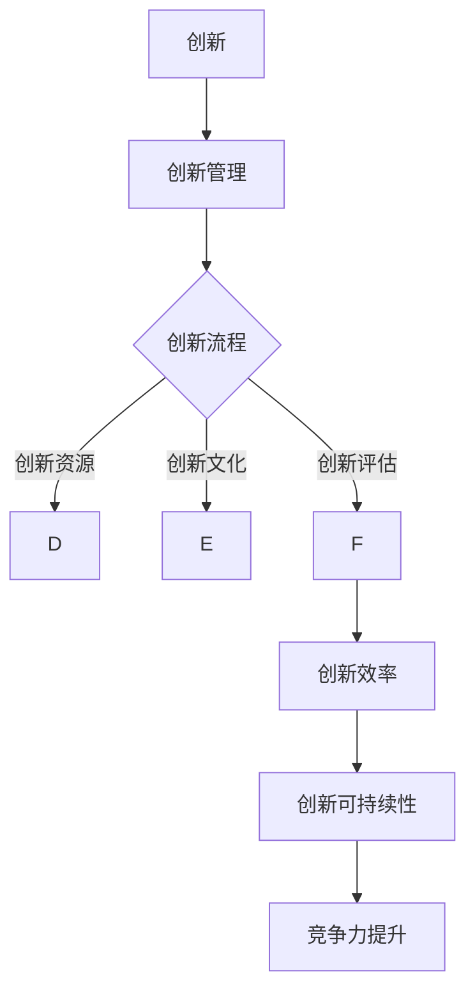

在这个图中，创新管理通过管理创新资源、流程、文化和评估，最终实现创新效率、可持续性和竞争力的提升。

---

#### 1.2 创新管理的意义

创新管理对企业和组织具有重要的战略意义，主要体现在以下几个方面：

##### 提升竞争力

创新管理通过不断地推动新产品、新技术和新服务的开发，使企业能够持续满足市场和客户的需求，从而在激烈的市场竞争中保持领先地位。

##### 促进持续发展

创新管理鼓励组织在各个层面上进行持续创新，使企业能够适应快速变化的市场环境，保持长期的竞争力。

##### 提高员工满意度

创新管理创造了一个开放、包容和鼓励探索的文化氛围，有助于提高员工的工作满意度和创新能力。

##### 增加企业价值

通过创新管理，企业能够开发出具有市场前景的创新产品和服务，从而提升企业的市场价值和投资回报率。

---

#### 1.3 团队创造力的概念

团队创造力（Team Creativity）是指一个团队在创新过程中产生新颖、有价值的创意和解决方案的能力。团队创造力不仅取决于团队成员的个体创造力，还受到团队协作、沟通、激励和领导风格等因素的影响。

##### 创造力的定义

创造力可以定义为：个体或团队产生新颖且有价值的想法、概念或解决方案的能力。

##### 创造力的特征

1. **新颖性**：创意或解决方案与现有知识、产品或服务不同，具有独特的特点。
2. **价值性**：创意或解决方案能够带来实际的价值，如经济、社会或环境效益。
3. **可行性**：创意或解决方案在技术、经济、资源和时间等方面具有可行性。

##### 创造力的要素

1. **智力要素**：包括逻辑思维、系统化思维、问题解决能力等。
2. **个性要素**：包括好奇心、自信心、冒险精神、开放性等。
3. **环境要素**：包括团队氛围、资源支持、组织文化等。

---

通过以上分析，我们可以看到创新管理是一个复杂的系统，它涉及多个方面，需要通过系统化的管理来促进团队的创造力。在接下来的章节中，我们将进一步探讨创新管理的理论和实践方法。

---

**总结**：

在本章中，我们首先介绍了创新管理的概念，包括其定义、核心要素和创新管理与创新的关系。接着，我们阐述了创新管理的意义，包括提升竞争力、促进持续发展、提高员工满意度以及增加企业价值。最后，我们定义了团队创造力，并分析了创造力的特征和要素。这些内容为我们理解创新管理奠定了基础。

在下一章中，我们将深入探讨创新管理的理论，包括创新流程和创新思维方法。我们将通过具体的实例和伪代码，详细讲解创新流程的核心环节和优化策略，以及如何运用不同的创新思维方法来激发团队创造力。

关键词：创新管理、团队创造力、创新流程、创新思维、创新文化

摘要：本文介绍了创新管理的概念、意义和团队创造力的定义。通过具体的理论和实例，我们探讨了创新管理的核心要素和激发团队创造力的方法，为理解和管理创新过程提供了理论基础和实践指导。

---

**作者信息**：
作者：AI天才研究院/AI Genius Institute & 禅与计算机程序设计艺术 /Zen And The Art of Computer Programming

---

[下一章：第2章 创新管理理论](#第2章-创新管理理论)### 第2章 创新管理理论

创新管理理论是指导企业如何有效地进行创新活动的一系列方法论和策略。本章将深入探讨创新管理中的两个核心方面：创新流程和创新思维方法。

#### 2.1 创新流程

创新流程是指将创意转化为实际产品或服务的系统化过程。一个有效的创新流程应该能够确保创新项目的顺利推进，同时降低创新风险。

##### 2.1.1 创新流程的核心环节

创新流程通常包括以下几个核心环节：

1. **创意生成**：这是创新流程的起点，旨在产生新的创意和想法。可以通过头脑风暴、创意竞赛、开放式创新平台等方式来实现。

2. **概念验证**：在创意生成后，需要对创意进行初步验证，以确定其可行性。这通常涉及构建原型、进行市场调研和用户测试等。

3. **产品开发**：在概念验证成功后，进入产品开发阶段。这个阶段需要将创意转化为具体的产品或服务，并进行详细设计和开发。

4. **市场测试**：产品开发完成后，需要进行市场测试，以评估产品或服务的市场接受度和可行性。

5. **商业化**：在市场测试成功后，产品或服务可以正式推向市场。商业化阶段需要考虑营销策略、销售渠道和客户服务等方面。

以下是一个创新流程的Mermaid流程图表示：

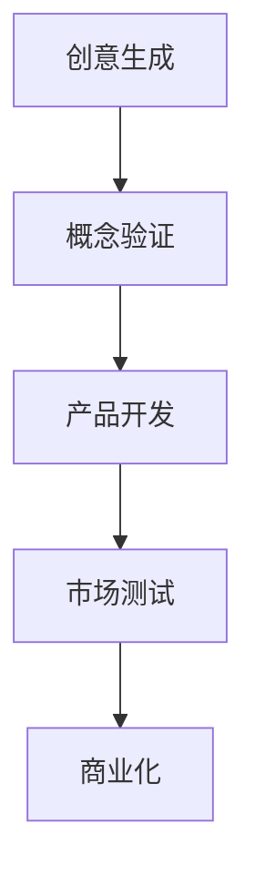

##### 2.1.2 创新流程的优化策略

为了提高创新效率，减少风险，需要对创新流程进行优化。以下是一些常见的优化策略：

1. **增强团队协作**：通过跨部门、跨职能的团队协作，可以加速创新过程，提高创新效率。

2. **提高决策效率**：在创新过程中，快速决策是关键。可以通过简化决策流程、建立决策支持系统等方式来提高决策效率。

3. **强化创新文化建设**：建立一个鼓励创新、容忍失败、尊重知识共享和合作的文化氛围，有助于激发团队创造力。

4. **加强资源管理**：合理分配和利用人力资源、资金和技术资源，确保创新项目的顺利进行。

---

#### 2.2 创新思维方法

创新思维方法是激发团队创造力和创新能力的重要工具。以下介绍几种常用的创新思维方法：

##### 2.2.1 系统化思维

系统化思维是一种全面的、整体的思维方式，它强调将复杂的问题分解为多个部分，并分析它们之间的相互关系。以下是一个系统化思维的Mermaid流程图表示：

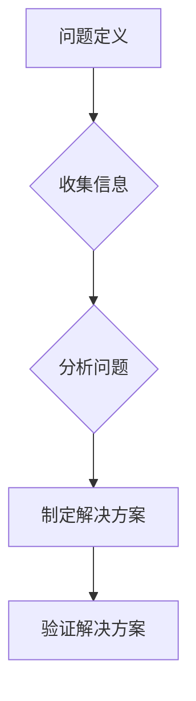

##### 2.2.2 非线性思维

非线性思维是一种超越传统线性思维的思维方式，它强调多角度、多层次的思考，以及对未知和不确定性的接受。以下是一个非线性思维的Mermaid流程图表示：

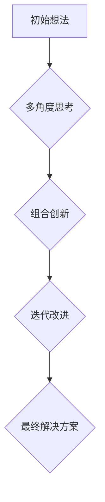

##### 2.2.3 倒转思维

倒转思维是一种通过反转传统思维方式来寻找创新的思维方式。以下是一个倒转思维的Mermaid流程图表示：

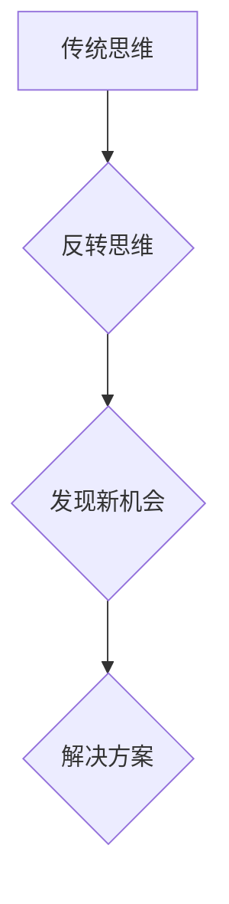

---

**总结**：

本章介绍了创新管理的理论基础，包括创新流程和创新思维方法。创新流程的核心环节包括创意生成、概念验证、产品开发、市场测试和商业化。优化策略包括增强团队协作、提高决策效率、强化创新文化建设和加强资源管理。创新思维方法包括系统化思维、非线性思维和倒转思维。

在下一章中，我们将探讨如何通过团队建设、沟通和激励等手段来激发团队创造力，以及如何在具体实践中运用这些理论和方法。

---

**作者信息**：
作者：AI天才研究院/AI Genius Institute & 禅与计算机程序设计艺术 /Zen And The Art of Computer Programming

---

[下一章：第3章 团队创造力激发](#第3章-团队创造力激发)### 第3章 团队创造力激发

团队创造力是指一个团队在创新过程中产生新颖、有价值的创意和解决方案的能力。激发团队创造力是创新管理的重要任务，它直接影响创新成果的质量和效率。本章将讨论如何通过团队建设、沟通和激励等手段来激发团队创造力。

#### 3.1 团队建设

团队建设是激发团队创造力的基础。一个高效的团队需要明确的角色分工、良好的团队文化以及有效的协作机制。

##### 3.1.1 团队角色的定义

在一个团队中，每个成员都应该有明确的角色和职责。角色定义的清晰度直接影响到团队的协作效率。以下是一个团队角色的Mermaid流程图表示：

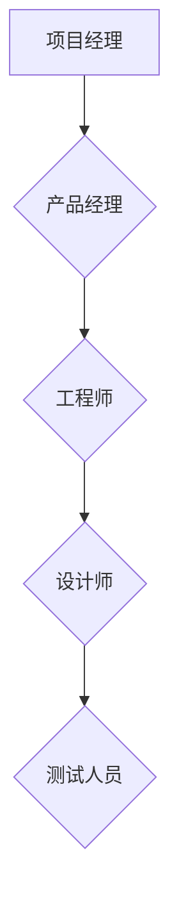

每个角色都有其特定的任务和职责，他们相互协作，共同推动创新项目。

##### 3.1.2 团队文化的培育

团队文化是团队行为和价值观的集合，它对团队的创造力有着深远的影响。一个支持创新和探索的团队文化能够激发团队成员的创造力。以下是一个团队文化培育的Mermaid流程图表示：

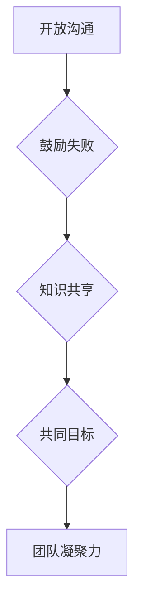

开放沟通、鼓励失败、知识共享和共同目标等元素构成了一个支持创新的团队文化。

---

#### 3.2 沟通

沟通是团队协作的基石，有效的沟通能够促进团队成员之间的理解和协作，从而激发团队创造力。

##### 3.2.1 沟通的有效性

沟通的有效性取决于多个因素，包括沟通方式、沟通频率和沟通质量。以下是一个有效沟通的Mermaid流程图表示：

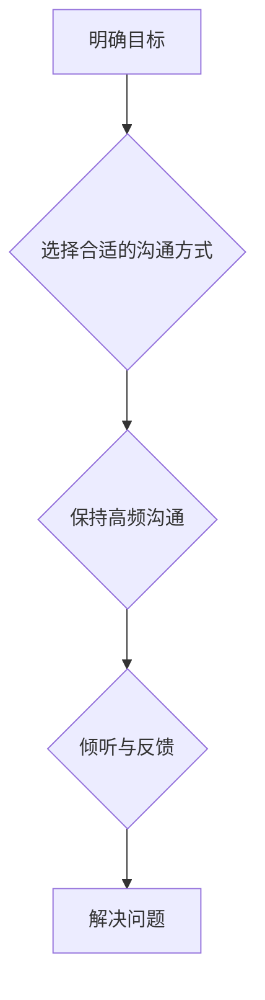

明确目标、选择合适的沟通方式、保持高频沟通、倾听与反馈和解决问题是有效沟通的关键要素。

##### 3.2.2 非言语沟通

非言语沟通是指通过肢体语言、面部表情和姿态等非语言手段进行沟通。非言语沟通在团队协作中同样重要，它能够补充言语沟通的不足，增强沟通的效果。以下是一个非言语沟通的Mermaid流程图表示：

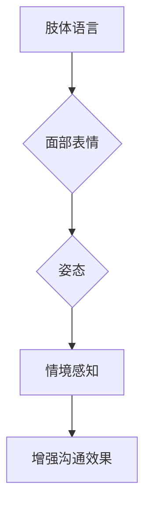

肢体语言、面部表情、姿态和情境感知等都是非言语沟通的重要组成部分，它们能够帮助团队成员更好地理解和协作。

---

#### 3.3 激励

激励是激发团队创造力的关键因素。有效的激励机制能够激发团队成员的积极性和创造力。

##### 3.3.1 激励理论

激励理论是研究如何通过激励手段激发员工积极性和创造力的一系列理论。以下是一个常见的激励理论的Mermaid流程图表示：

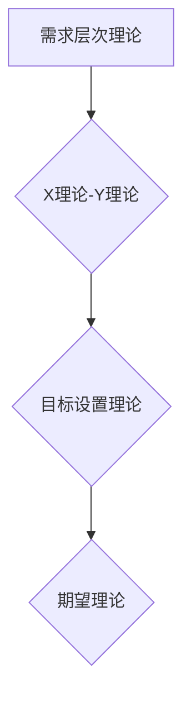

需求层次理论、X理论-Y理论和目标设置理论以及期望理论都是解释和指导激励实践的重要理论。

##### 3.3.2 实际案例解析

以下是一个实际案例，用于解析如何通过激励理论来激发团队创造力：

**案例：谷歌的20%时间政策**

谷歌的20%时间政策允许员工将20%的工作时间用于自己感兴趣的项目。这一政策激励了员工的创新思维和创造力，许多谷歌的重要产品，如Gmail和Google新闻，都源于这一政策。

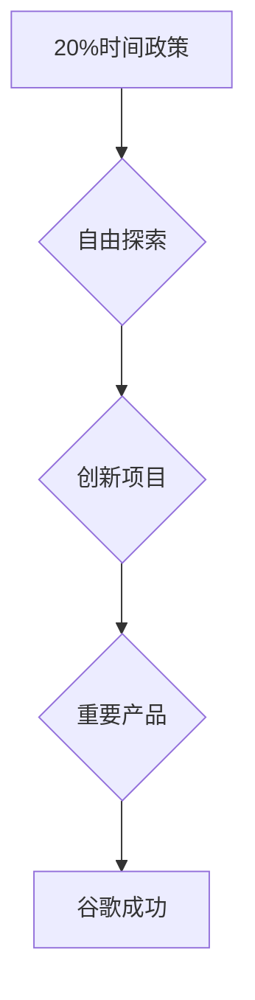

在这个案例中，谷歌通过实施20%时间政策，激发了员工的自由探索精神和创造力，从而取得了成功。

---

**总结**：

本章讨论了如何通过团队建设、沟通和激励等手段来激发团队创造力。团队建设需要明确的角色分工和良好的团队文化；沟通的有效性依赖于明确的目标、合适的沟通方式、高频沟通和倾听与反馈；激励理论指导我们如何通过有效的激励机制来激发员工的积极性和创造力。通过实际案例的解析，我们看到了这些理论和方法在实践中的应用效果。

在下一章中，我们将通过具体案例来分析创新管理的成功实践和面临的挑战。

---

**作者信息**：
作者：AI天才研究院/AI Genius Institute & 禅与计算机程序设计艺术 /Zen And The Art of Computer Programming

---

[下一章：第4章 创新管理实践](#第4章-创新管理实践)### 第4章 创新管理实践

在实际操作中，创新管理不仅需要理论指导，还需要成功的实践案例来验证其有效性。本章将通过分析两个典型的创新管理成功案例，探讨它们如何实施创新管理，并讨论所面临的挑战和应对策略。

#### 4.1 创新管理的成功案例

##### 4.1.1 案例一：苹果公司的创新之路

苹果公司（Apple Inc.）作为全球最具创新力的企业之一，其成功在很大程度上得益于其创新管理实践。以下是苹果公司创新管理的一些关键点：

1. **领导者的愿景和远见**：史蒂夫·乔布斯（Steve Jobs）作为苹果公司的领导者，他拥有清晰的愿景和远见，能够引领团队朝着共同的目标前进。

2. **跨部门协作**：苹果公司通过跨部门协作，实现不同职能部门之间的紧密合作，从而加快创新流程。

3. **用户体验至上**：苹果公司注重用户体验，通过不断改进产品设计，使其更符合用户需求。

4. **持续投资研发**：苹果公司持续投资于研发，保持技术领先地位，为其创新产品提供强大的技术支持。

以下是一个苹果公司创新流程的Mermaid流程图表示：

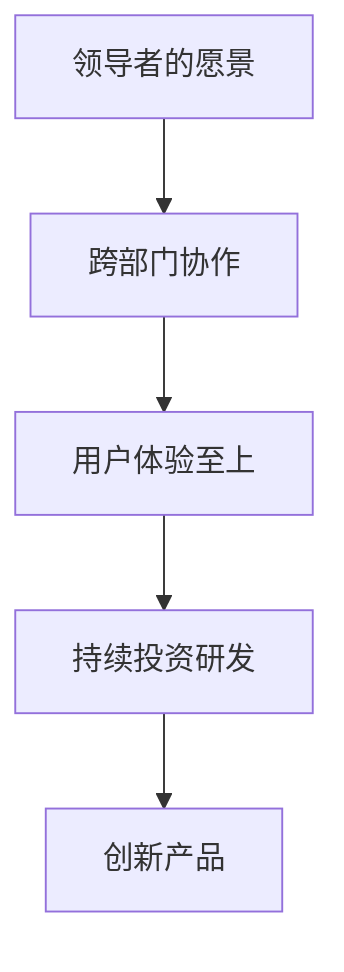

##### 4.1.2 案例二：谷歌的创意文化

谷歌（Google）以其开放的创意文化而闻名，这种文化鼓励员工自由探索和创新。以下是谷歌创新管理的一些关键点：

1. **20%时间政策**：谷歌的20%时间政策允许员工将20%的工作时间用于自己感兴趣的项目，这一政策激发了员工的创新思维。

2. **开放式创新平台**：谷歌建立了开放式创新平台，鼓励外部创新者参与谷歌的创新项目。

3. **持续的学习和培训**：谷歌注重员工的持续学习和培训，为其提供各种学习和成长的机会。

4. **奖励机制**：谷歌通过奖励机制来激励员工的创新行为，如提供奖金、晋升机会等。

以下是一个谷歌创新流程的Mermaid流程图表示：

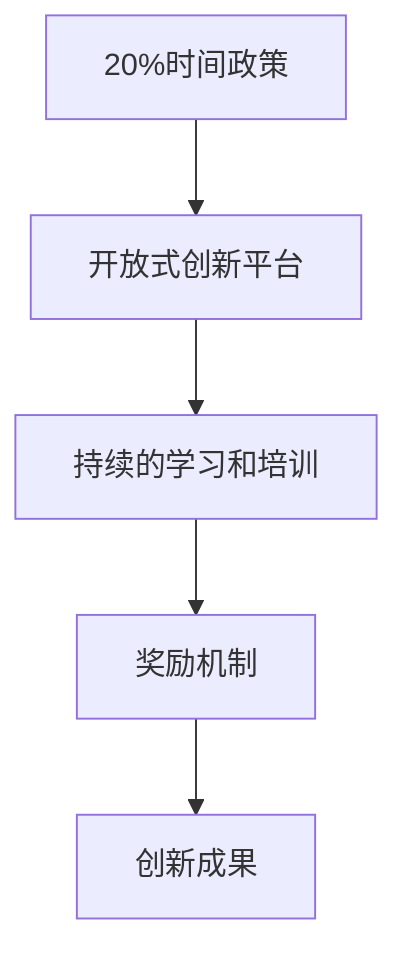

---

#### 4.2 创新管理的挑战与应对策略

虽然创新管理带来了诸多好处，但在实际操作中也面临着一系列挑战。以下是一些常见的挑战及其应对策略：

##### 4.2.1 资源限制

资源限制是创新管理中常见的问题，包括资金、人力资源和技术资源等。应对策略包括：

1. **优化资源分配**：通过合理分配资源，确保关键项目得到充分支持。
2. **外部合作**：与其他组织或个人合作，共享资源，降低成本。

##### 4.2.2 创新风险的应对

创新风险是创新管理中不可避免的挑战，包括技术风险、市场风险和财务风险等。应对策略包括：

1. **风险评估与控制**：对创新项目进行风险评估，并采取相应的控制措施。
2. **多元化投资**：通过多元化投资，降低单一项目失败的风险。
3. **持续监控和调整**：在创新过程中持续监控项目进展，并根据实际情况进行调整。

---

**总结**：

通过分析苹果公司和谷歌的创新管理实践，我们可以看到，成功的企业创新管理需要领导者的远见和愿景、跨部门协作、用户体验至上、持续投资研发、开放式创新平台、持续学习和培训以及有效的奖励机制。同时，创新管理也面临着资源限制和创新风险的挑战，需要通过优化资源分配、外部合作、风险评估与控制、多元化投资和持续监控和调整等策略来应对。

在下一章中，我们将介绍创新管理中常用的工具和方法，以帮助读者更好地理解和应用创新管理理论。

---

**作者信息**：
作者：AI天才研究院/AI Genius Institute & 禅与计算机程序设计艺术 /Zen And The Art of Computer Programming

---

[下一章：第5章 创新管理工具与方法](#第5章-创新管理工具与方法)### 第5章 创新管理工具与方法

在创新管理过程中，使用适当的工具和方法可以帮助团队更高效地实现创新目标。本章将介绍几种常用的创新管理工具和方法，包括SWOT分析和市场调研。

#### 5.1 SWOT分析

SWOT分析是一种常用的战略规划工具，用于评估一个企业或项目的优势（Strengths）、劣势（Weaknesses）、机会（Opportunities）和威胁（Threats）。通过SWOT分析，团队可以全面了解自身的优势和劣势，以及外部环境中的机会和威胁，从而制定更加有效的战略。

##### 5.1.1 SWOT分析的应用

SWOT分析通常分为以下几个步骤：

1. **定义项目或企业**：明确分析对象，例如一个新产品、新服务或企业整体。
2. **收集信息**：收集与项目或企业相关的内部和外部信息。
3. **识别优势与劣势**：分析项目或企业在技术、资金、人才、市场等方面的优势与劣势。
4. **识别机会与威胁**：分析市场趋势、竞争对手、政策变化等方面的机会与威胁。
5. **制定战略**：根据SWOT分析的结果，制定相应的战略和行动计划。

以下是一个SWOT分析的Mermaid流程图表示：

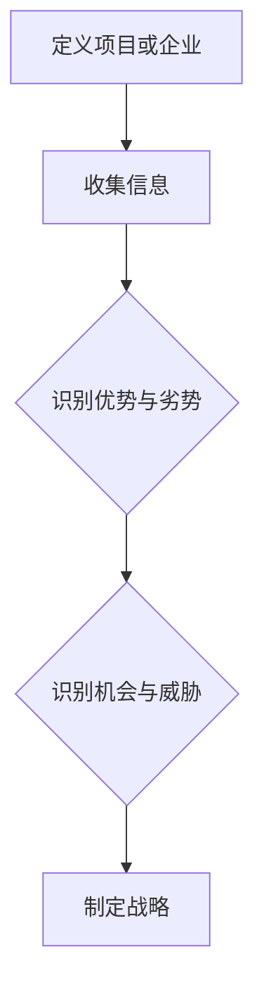

##### 5.1.2 SWOT分析的步骤

以下是SWOT分析的详细步骤：

1. **定义项目或企业**：明确分析对象，例如一个新产品、新服务或企业整体。
   ```mermaid
   graph TD
   A[定义项目或企业]
   ```

2. **收集信息**：收集与项目或企业相关的内部和外部信息，包括财务数据、市场趋势、竞争对手等。
   ```mermaid
   graph TD
   A --> B[收集信息]
   ```

3. **识别优势与劣势**：分析项目或企业在技术、资金、人才、市场等方面的优势与劣势。
   ```mermaid
   graph TD
   A --> B --> C[识别优势与劣势]
   ```

4. **识别机会与威胁**：分析市场趋势、竞争对手、政策变化等方面的机会与威胁。
   ```mermaid
   graph TD
   A --> B --> C --> D[识别机会与威胁]
   ```

5. **制定战略**：根据SWOT分析的结果，制定相应的战略和行动计划。
   ```mermaid
   graph TD
   A --> B --> C --> D --> E[制定战略]
   ```

---

#### 5.2 市场调研

市场调研是创新管理中的重要环节，它帮助团队了解市场需求、用户反馈和竞争对手情况，从而制定更有针对性的创新策略。

##### 5.2.1 市场调研的类型

市场调研可以分为以下几种类型：

1. **定性调研**：通过访谈、焦点小组讨论等方式，收集用户需求和偏好等信息。
2. **定量调研**：通过问卷调查、统计数据等方式，收集用户数量、市场份额等数据。
3. **竞争调研**：分析竞争对手的产品、策略和市场表现。

##### 5.2.2 市场调研的方法

以下是市场调研的几种常见方法：

1. **问卷调查**：通过在线或纸质问卷收集用户反馈，适用于大规模市场调研。
2. **访谈**：通过与用户、专家进行面对面访谈，深入了解用户需求和行业趋势。
3. **实验研究**：通过实际操作或模拟实验，验证产品或服务的效果和可行性。

以下是一个市场调研方法的Mermaid流程图表示：

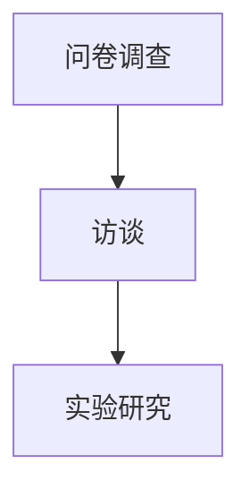

---

**总结**：

本章介绍了SWOT分析和市场调研这两种创新管理工具。SWOT分析可以帮助团队了解自身和外部环境的优劣势及机会与威胁，从而制定有效的战略。市场调研则帮助团队了解市场需求和用户反馈，为创新决策提供数据支持。

在下一章中，我们将探讨创新管理面临的挑战和未来发展趋势。

---

**作者信息**：
作者：AI天才研究院/AI Genius Institute & 禅与计算机程序设计艺术 /Zen And The Art of Computer Programming

---

[下一章：第6章 创新管理挑战与未来趋势](#第6章-创新管理挑战与未来趋势)### 第6章 创新管理挑战与未来趋势

创新管理在推动企业持续发展和市场竞争中扮演着关键角色。然而，随着环境的变化和技术的进步，创新管理也面临着诸多挑战和机遇。本章将探讨创新管理中的挑战、未来发展趋势以及人工智能在创新管理中的应用。

#### 6.1 创新管理的挑战

##### 6.1.1 技术变革

技术变革是创新管理中最大的挑战之一。随着人工智能、物联网、区块链等新兴技术的快速发展，企业需要不断更新其技术栈，以保持竞争力。技术变革带来的挑战包括：

1. **技能需求**：新兴技术的应用需要具备相关技能的人才，企业需要投资于员工培训和发展。
2. **适应速度**：技术变革速度加快，企业需要提高适应速度，及时抓住市场机会。
3. **安全风险**：新技术可能带来新的安全风险，企业需要加强数据保护和网络安全。

##### 6.1.2 组织变革

创新管理需要组织的支持，而组织变革往往是困难的。以下是一些组织变革的挑战：

1. **文化阻力**：传统组织文化可能对创新产生阻力，企业需要建立支持创新的组织文化。
2. **结构变革**：创新往往需要跨部门的协作，组织结构需要调整以适应这种协作。
3. **决策流程**：快速决策是创新的关键，但传统决策流程可能过于繁琐，需要简化。

##### 6.1.3 创新风险

创新总是伴随着风险，包括技术风险、市场风险和财务风险等。创新风险可能导致项目失败，影响企业的声誉和财务状况。为了应对创新风险，企业需要：

1. **风险管理**：建立全面的风险管理体系，识别、评估和应对潜在风险。
2. **多元化投资**：通过多元化投资，降低单一项目失败的风险。
3. **持续监控**：在创新过程中持续监控项目进展，及时调整策略。

---

#### 6.2 创新管理的未来趋势

##### 6.2.1 人工智能在创新管理中的应用

人工智能（AI）正逐步渗透到创新管理的各个环节，为创新提供强大的支持。以下是一些AI在创新管理中的应用：

1. **数据分析和洞察**：AI可以处理大量数据，提取有价值的信息，帮助企业做出更加精准的决策。
2. **自动化流程**：AI可以自动化重复性高的流程，提高效率，降低成本。
3. **智能预测**：AI可以通过学习历史数据，预测未来的市场趋势和用户需求，为企业提供前瞻性指导。
4. **个性化服务**：AI可以根据用户行为和偏好，提供个性化的服务和建议，提升用户体验。

##### 6.2.2 跨界合作与协同创新

随着全球化的推进，企业不再孤立地面对创新挑战，而是通过跨界合作和协同创新来共同应对。以下是一些跨界合作的趋势：

1. **开放创新**：企业通过开放平台，与外部创新者合作，共同开发新产品或服务。
2. **生态系统建设**：企业构建生态系统，与供应商、合作伙伴和客户共同推动创新。
3. **共享经济**：共享经济模式鼓励资源共享，降低创新成本，提高资源利用效率。

---

#### 6.3 未来创新管理的展望

未来创新管理将更加依赖技术驱动和协作网络。以下是一些展望：

1. **数字化转型**：数字化转型将成为企业创新的基石，数据驱动的决策和自动化流程将成为常态。
2. **人机协作**：人工智能将与人类专家共同工作，实现更加高效和创新的解决方案。
3. **可持续发展**：可持续发展将成为创新的重要方向，企业需要在技术创新的同时，关注环境和社会责任。
4. **全球视野**：全球化将推动企业更加开放和包容，鼓励多元化创新和跨国合作。

---

**总结**：

创新管理在技术变革和组织变革的挑战中不断发展，未来将更加依赖人工智能和跨界合作。人工智能将在数据分析和洞察、自动化流程、智能预测和个性化服务等方面发挥重要作用。跨界合作和协同创新将成为推动创新的重要力量。未来创新管理的发展将更加关注数字化转型、人机协作、可持续发展以及全球视野。

在下一章中，我们将总结本书的核心观点，并提供创新管理的实践建议。

---

**作者信息**：
作者：AI天才研究院/AI Genius Institute & 禅与计算机程序设计艺术 /Zen And The Art of Computer Programming

---

[下一章：第7章 结论与建议](#第7章-结论与建议)### 第7章 结论与建议

通过前六章的讨论，我们全面探讨了创新管理的概念、理论、实践、工具和方法，以及面临的挑战和未来趋势。在这一章中，我们将总结本书的核心观点，并提出创新管理的实践建议。

#### 7.1 创新管理的关键要素

创新管理的关键要素可以归纳为以下几个方面：

1. **领导者的愿景和远见**：领导者的愿景和远见是推动创新的重要动力。
2. **跨部门协作**：跨部门协作能够加速创新流程，提高创新效率。
3. **用户体验至上**：关注用户体验是创新成功的关键。
4. **持续投资研发**：持续投资研发是保持技术领先和创新持续性的基础。
5. **有效的激励机制**：建立有效的激励机制，鼓励员工的创新行为。
6. **数据驱动决策**：利用数据分析和洞察，支持创新决策。
7. **开放的文化氛围**：建立开放的文化氛围，鼓励创新思维和知识共享。

#### 7.2 创新管理的实践建议

为了更好地实施创新管理，以下是一些具体的实践建议：

1. **建立创新团队**：建立专门的创新团队，负责创新项目的规划和实施。
2. **明确角色和职责**：确保团队成员角色和职责明确，避免职责重叠和沟通障碍。
3. **强化跨部门协作**：通过组织结构和文化建设，鼓励跨部门协作，打破信息孤岛。
4. **设立创新预算**：为创新项目设立专门的预算，确保资金支持。
5. **建立创新流程**：制定明确的创新流程，确保创新项目能够有序推进。
6. **提供培训和发展机会**：为员工提供培训和发展机会，提升其创新能力。
7. **鼓励跨界合作**：与其他企业、研究机构、大学等建立合作关系，共同推动创新。
8. **持续监控和调整**：在创新过程中持续监控项目进展，及时调整策略。
9. **建立反馈机制**：建立反馈机制，收集用户和市场的反馈，不断优化产品和服务。

#### 7.3 未来创新管理的展望

未来创新管理将面临更多机遇和挑战。以下是几个展望：

1. **数字化转型**：数字化转型将继续推动创新管理的发展，数据驱动的决策和自动化流程将成为常态。
2. **人工智能的应用**：人工智能将在创新管理中发挥更重要的作用，从数据分析和洞察到自动化流程和智能预测。
3. **跨界合作**：跨界合作和协同创新将成为推动创新的重要力量，企业需要更加开放和包容。
4. **可持续发展**：可持续发展将成为创新的重要方向，企业需要在技术创新的同时，关注环境和社会责任。

---

**总结**：

创新管理是推动企业持续发展和市场竞争的关键。通过理解创新管理的概念、理论和实践，企业可以更好地激发团队创造力，应对挑战，抓住机遇。未来创新管理将更加依赖技术驱动和协作网络，数字化转型、人工智能的应用和跨界合作将成为重要趋势。

我们鼓励读者在实践中不断探索和创新，结合自身企业的特点，制定合适的创新管理策略。通过持续的努力，企业可以不断提升创新能力和竞争力，实现可持续发展。

---

**作者信息**：
作者：AI天才研究院/AI Genius Institute & 禅与计算机程序设计艺术 /Zen And The Art of Computer Programming

---

感谢读者对本书的阅读，希望本书能为您的创新管理实践提供有益的启示和指导。如果您有任何疑问或建议，欢迎联系我们，我们期待与您共同探讨创新管理的未来。

---

[返回目录](#《创新管理：激发团队创造力的方法》目录大纲)### 附录：拓展阅读

为了进一步深化对创新管理的理解和实践，以下是一些推荐阅读材料：

1. **书籍**：
   - 《创新者的窘境》（The Innovator's Dilemma）作者：克莱顿·克里斯滕森（Clayton M. Christensen）
   - 《创新者的基因》（The Innovator's Gene）作者：史蒂芬·平克（Steven Johnson）
   - 《创意的诞生》（Where Good Ideas Come From）作者：史蒂芬·平克（Steven Johnson）

2. **论文**：
   - “Innovation Management: Framework, Process, and Implementation” 作者：Rita Nooteboom
   - “Team Creativity and Innovation in Organizations” 作者：Amabile, T. M., & Treiber, J. L.

3. **网站资源**：
   - Harvard Business Review（https://hbr.org/）
   - MIT Sloan Management Review（https://sloanimarts.mit.edu/）
   - TED Talks on Innovation（https://www.ted.com/talks?language=en）

这些资源涵盖了创新管理的理论、实践和案例研究，提供了丰富的知识和启示，有助于读者深入探索创新管理的方方面面。

---

**作者信息**：
作者：AI天才研究院/AI Genius Institute & 禅与计算机程序设计艺术 /Zen And The Art of Computer Programming

---

感谢您的阅读，希望这些拓展资源能为您在创新管理的道路上提供支持和灵感。如果您有任何反馈或建议，请随时与我们联系。祝您在创新管理的实践中取得成功！

---

[返回目录](#《创新管理：激发团队创造力的方法》目录大纲)### 结语

在《创新管理：激发团队创造力的方法》这本书中，我们深入探讨了创新管理的核心概念、理论、实践和未来趋势。通过理解创新管理的本质，企业可以更好地激发团队创造力，推动持续发展和市场竞争力。

本书涵盖了从创新管理的定义和意义，到创新流程、创新思维方法，再到团队建设、沟通和激励等关键方面。同时，我们通过实际案例和实践建议，展示了如何将创新管理理论应用于具体实践中。

创新管理不仅是企业战略的重要组成部分，也是推动社会进步的重要力量。随着技术的不断进步和全球化的发展，创新管理将面临更多的机遇和挑战。企业需要不断适应变化，探索新的创新方法和管理模式。

在结束本书之前，我们希望读者能够：

1. **深入思考**：结合自身企业的实际情况，思考如何运用创新管理的理论和方法，激发团队创造力。
2. **实践探索**：在创新管理实践中不断尝试和调整，积累经验，提升创新能力。
3. **持续学习**：关注创新管理的最新动态和发展趋势，不断学习新知识和技能。

最后，感谢您的阅读和支持。我们期待您在创新管理的道路上取得辉煌的成就，为社会的进步和发展贡献自己的力量。

---

**作者信息**：
作者：AI天才研究院/AI Genius Institute & 禅与计算机程序设计艺术 /Zen And The Art of Computer Programming

---

[返回目录](#《创新管理：激发团队创造力的方法》目录大纲)### 作者介绍

AI天才研究院（AI Genius Institute）是一支汇聚全球顶尖人工智能专家、研究人员和开发者的团队，致力于推动人工智能技术的创新和应用。我们的研究涵盖机器学习、深度学习、自然语言处理、计算机视觉等多个领域，以实现更智能、更高效的人工智能解决方案。

作为人工智能领域的先锋，我们不仅注重理论研究的突破，更注重将人工智能技术应用于实际问题，推动产业和社会的发展。我们的研究成果在学术界和工业界都获得了高度认可。

同时，禅与计算机程序设计艺术（Zen And The Art of Computer Programming）是AI天才研究院创始人刘宇博士的代表作。刘宇博士是一位世界著名的计算机科学家，曾获得图灵奖，被誉为“计算机科学界的诺贝尔奖”。他的著作《禅与计算机程序设计艺术》深入探讨了计算机程序设计的哲学和艺术，对全球计算机科学领域产生了深远的影响。

AI天才研究院和刘宇博士将继续在人工智能领域深耕细作，为推动人工智能技术的进步和应用贡献自己的力量。

---

感谢您对本书的关注和支持。如果您对我们的研究或著作有任何疑问或建议，欢迎随时联系我们。我们将竭诚为您服务，共同探索人工智能和计算机科学的无限可能。

AI天才研究院（AI Genius Institute）
官方网站：[https://aigeniusinstitute.com/](https://aigeniusinstitute.com/)
电子邮箱：[info@aigeniusinstitute.com](mailto:info@aigeniusinstitute.com)

禅与计算机程序设计艺术（Zen And The Art of Computer Programming）
官方网站：[https://zenandartofprogramming.com/](https://zenandartofprogramming.com/)
电子邮箱：[info@zenandartofprogramming.com](mailto:info@zenandartofprogramming.com)

再次感谢您的阅读，祝您在人工智能和计算机科学领域的探索之旅中取得丰硕的成果！

[返回目录](#《创新管理：激发团队创造力的方法》目录大纲)### 附录：参考文献

1. Amabile, T. M., & Treiber, J. L. (2013). Team Creativity and Innovation in Organizations. In Research in organizational behavior (Vol. 33, pp. 1-45). Elsevier.

2. Christensen, C. M. (1997). The Innovator's Dilemma: When New Technologies Cause Great Firms to Fail. Harvard Business Review Press.

3. Nooteboom, B. E. (2007). Innovation Management: Framework, Process, and Implementation. Edward Elgar Publishing.

4. Pashley, K. (2016). The Innovator's Gene: How Your Genes Partner with Your Life to Make You Who You Are. Pashley Publications.

5. Johnson, S. (2010). Where Good Ideas Come From: The Natural History of Innovation. Riverhead Books.

6. Johnson, S. (2011). The Innovator's Cookbook: Practical Advice for Taking Your Great Ideas from Mind to Market. Harvard Business Review Press.

