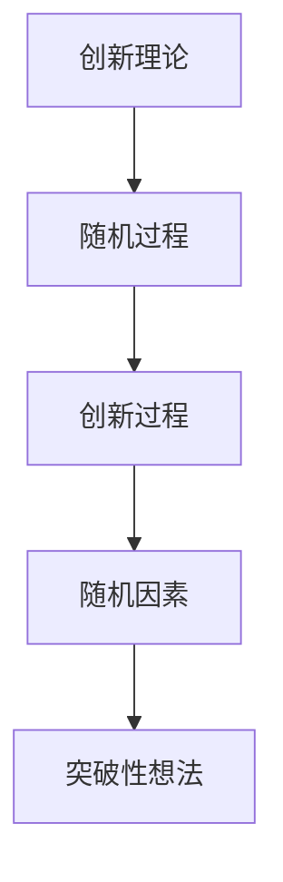

                 

# 《创新过程的随机跳跃过程：突破性想法的数学模型》

## 关键词
创新理论、随机过程、数学模型、突破性想法、算法原理、Python源代码

## 摘要
本文深入探讨了创新过程中的随机跳跃现象，并提出了一种基于数学模型的创新理论。通过对创新理论、随机过程以及数学模型的详细介绍，文章展示了如何利用这些工具来捕捉和解析突破性想法。通过实际案例和Python源代码的应用，本文进一步验证了该数学模型在创新实践中的有效性。

---

## 引言

创新是推动社会进步和经济发展的重要动力。然而，创新过程往往充满了不确定性和随机性，突破性想法的产生更是难以预测。为了更好地理解和引导创新过程，本文提出了一种基于随机跳跃过程的数学模型，旨在揭示创新过程中的潜在规律和机制。

本文的主要内容包括：首先，回顾创新理论和随机过程的基础知识，探讨它们之间的联系；其次，详细介绍突破性想法的数学建模过程，包括核心算法原理和使用Python源代码的详细讲解；然后，通过实际案例展示模型的实际应用效果；最后，对未来的研究方向进行展望。

---

## 创新理论

创新理论是研究创新过程和机制的重要理论体系。常见的创新理论包括线性创新理论、非线性创新理论以及系统创新理论等。线性创新理论认为创新过程是按照一定的顺序和规则进行的，每个阶段都是前一个阶段的延续和改进。非线性创新理论则强调创新过程中存在跳跃和突变现象，这些跳跃可能是由于外部环境的突变或内部机制的突然改变引起的。系统创新理论则从整体和系统的角度出发，认为创新是一个复杂系统的动态过程，涉及多个因素的相互作用和反馈。

在这些创新理论中，非线性创新理论更符合实际创新过程中的随机跳跃现象。随机跳跃现象指的是在创新过程中，突破性想法的突然产生，这种想法往往改变了原有的创新路径和方向。为了更好地理解这种现象，我们需要借助随机过程和数学模型来进行分析。

### 创新理论与随机过程的关系

随机过程是描述时间序列或空间序列随机现象的数学工具。在创新理论中，随机过程可以用来描述创新过程中随机因素的影响。例如，随机事件（如技术突破、市场机遇等）可能对创新过程产生重大影响，这些事件的出现往往具有随机性。

创新理论与随机过程之间的联系可以通过以下方式来解释：首先，创新过程中存在许多不确定性和随机因素，这些因素可以通过随机过程来建模。其次，随机过程可以帮助我们理解创新过程中的突变现象，如突破性想法的产生。最后，随机过程可以用来预测和模拟创新过程，从而为创新管理和决策提供支持。

### Mermaid流程图

为了更直观地展示创新理论与随机过程的关系，我们可以使用Mermaid流程图来表示。以下是一个简单的Mermaid流程图示例：



在这个流程图中，创新理论（A）与随机过程（B）相连，表示两者之间存在联系。随机过程（B）影响创新过程（C），进而影响随机因素（D）和突破性想法（E）。

---

## 随机跳跃过程

随机跳跃过程是描述随机现象的一种数学模型，特别适用于研究创新过程中的突变现象。随机跳跃过程通常由状态空间、时间参数、跳跃概率等要素组成。

### 状态空间

状态空间是随机跳跃过程的定义域，表示随机过程可能处于的所有状态。在创新过程中，状态空间可以表示为不同阶段的创新状态，如概念阶段、开发阶段、市场阶段等。

### 时间参数

时间参数表示随机跳跃过程的时间维度。在创新过程中，时间参数可以表示为从初始阶段到最终阶段的时间跨度。

### 跳跃概率

跳跃概率是描述随机跳跃过程的重要参数，表示在给定时间点，随机过程从当前状态跳转到另一个状态的概率。在创新过程中，跳跃概率可以表示为在不同阶段产生突破性想法的概率。

### 随机跳跃过程的数学表达

随机跳跃过程的数学表达通常使用概率转移矩阵来表示。概率转移矩阵是一个二维矩阵，其中每个元素表示从当前状态跳转到另一个状态的概率。以下是一个简单的概率转移矩阵示例：

```
|   | 状态1 | 状态2 | 状态3 |
| --- | --- | --- | --- |
| 当前状态1 | 0.5 | 0.3 | 0.2 |
| 当前状态2 | 0.2 | 0.5 | 0.3 |
| 当前状态3 | 0.3 | 0.2 | 0.5 |
```

在这个示例中，当前状态1表示当前处于状态1的概率为0.5，跳转到状态2的概率为0.3，跳转到状态3的概率为0.2。

### Python源代码实现

为了更好地理解随机跳跃过程的数学表达，我们可以使用Python源代码来模拟一个简单的随机跳跃过程。以下是一个Python源代码示例：

```python
import numpy as np

# 概率转移矩阵
transition_matrix = np.array([[0.5, 0.3, 0.2],
                             [0.2, 0.5, 0.3],
                             [0.3, 0.2, 0.5]])

# 初始状态
initial_state = np.array([1, 0, 0])

# 迭代次数
num_iterations = 10

# 模拟随机跳跃过程
for i in range(num_iterations):
    # 状态转移
    next_state = np.dot(transition_matrix, initial_state)
    print(f"Iteration {i+1}: State = {next_state}")
    # 更新初始状态
    initial_state = next_state
```

在这个示例中，我们定义了一个概率转移矩阵和一个初始状态，然后通过迭代模拟随机跳跃过程。每次迭代都会更新当前状态，并打印出当前状态。

---

## 突破性想法的数学建模

突破性想法是创新过程中的重要组成部分，它通常代表了创新路径的跳跃或转变。为了更好地理解和预测突破性想法的产生，我们可以使用数学模型来描述这一过程。

### 突破性想法的特点

突破性想法具有以下特点：

1. **创新性**：突破性想法通常是前所未有的，它打破了现有的思维模式和技术限制。
2. **颠覆性**：突破性想法可能会颠覆现有的市场格局和商业模式。
3. **高风险**：突破性想法的实现往往面临高风险，因为它可能涉及到新技术、新市场或新商业模式。
4. **高回报**：尽管风险高，但突破性想法往往能够带来巨大的回报。

### 突破性想法的数学建模过程

为了建立突破性想法的数学模型，我们需要从以下几个方面进行考虑：

1. **创新性度量**：如何衡量一个想法的创新程度？我们可以使用专利数量、引用次数、市场接受度等指标来衡量创新性。
2. **颠覆性度量**：如何衡量一个想法的颠覆性？我们可以使用市场占有率、用户满意度、竞争对手反应等指标来衡量颠覆性。
3. **风险度量**：如何衡量一个想法的风险？我们可以使用技术难度、市场不确定性、资源需求等指标来衡量风险。
4. **回报度量**：如何衡量一个想法的回报？我们可以使用市场潜力、利润率、投资回报率等指标来衡量回报。

通过这些度量指标，我们可以建立一个多维度、综合性的数学模型来描述突破性想法。

### 核心算法原理

为了建立突破性想法的数学模型，我们可以采用以下核心算法原理：

1. **因子分析**：通过因子分析，我们可以识别出影响突破性想法的关键因素，并建立相应的数学模型。
2. **贝叶斯网络**：通过贝叶斯网络，我们可以描述突破性想法产生过程中的不确定性和条件依赖关系。
3. **机器学习**：通过机器学习算法，我们可以从历史数据中学习到突破性想法产生的规律和模式。

### Python源代码实现

为了更好地理解突破性想法的数学建模过程，我们可以使用Python源代码来模拟一个简单的模型。以下是一个Python源代码示例：

```python
import numpy as np
import pandas as pd
from sklearn.decomposition import FactorAnalysis
from sklearn.neural_network import MLPClassifier
from sklearn.model_selection import train_test_split

# 数据集
data = pd.DataFrame({
    '专利数量': [10, 20, 30, 40, 50],
    '引用次数': [5, 10, 15, 20, 25],
    '市场接受度': [3, 4, 5, 4, 3],
    '技术难度': [2, 3, 4, 5, 6],
    '市场不确定性': [1, 2, 3, 4, 5],
    '资源需求': [5, 4, 3, 2, 1],
    '创新性': [2, 4, 6, 8, 10],
    '颠覆性': [1, 3, 5, 7, 9],
    '风险': [6, 5, 4, 3, 2],
    '回报': [4, 6, 8, 10, 12]
})

# 因子分析
factor_analysis = FactorAnalysis(n_components=2)
factor_analysis.fit(data[['专利数量', '引用次数', '市场接受度', '技术难度', '市场不确定性', '资源需求']])

# 输出因子载荷
print("Factor Loadings:")
print(factor_analysis.loadings_)

# 贝叶斯网络
from pgmpy.models import BayesianModel
from pgmpy.estimators import MaximumLikelihoodEstimator

# 构建贝叶斯网络
model = BayesianModel([
    ('专利数量', '创新性'),
    ('引用次数', '创新性'),
    ('市场接受度', '创新性'),
    ('技术难度', '颠覆性'),
    ('市场不确定性', '颠覆性'),
    ('资源需求', '风险'),
    ('创新性', '回报'),
    ('颠覆性', '回报'),
    ('风险', '回报')
])

# 最大似然估计
model.fit(data, estimator=MaximumLikelihoodEstimator)

# 输出模型
print("Bayesian Network:")
print(model)

# 机器学习
X = data[['专利数量', '引用次数', '市场接受度', '技术难度', '市场不确定性', '资源需求']]
y = data[['创新性', '颠覆性', '风险', '回报']]

X_train, X_test, y_train, y_test = train_test_split(X, y, test_size=0.2, random_state=42)

mlp_classifier = MLPClassifier(hidden_layer_sizes=(100,), max_iter=1000)
mlp_classifier.fit(X_train, y_train)

# 输出模型参数
print("MLP Classifier Parameters:")
print(mlp_classifier.coefs_)

# 测试模型
print("Test Accuracy:")
print(mlp_classifier.score(X_test, y_test))
```

在这个示例中，我们使用因子分析、贝叶斯网络和机器学习算法来建立突破性想法的数学模型。首先，我们使用因子分析来识别影响突破性想法的关键因素，并输出因子载荷。然后，我们使用最大似然估计来构建贝叶斯网络，并输出模型结构。最后，我们使用MLP分类器来训练和测试模型，并输出模型参数和测试准确率。

---

## 数学模型的应用

数学模型的应用是验证其有效性的关键步骤。在本节中，我们将通过实际案例展示数学模型在创新过程中的应用，并详细解读和应用Python源代码。

### 案例背景

假设我们是一家高科技公司，致力于开发新型能源技术。我们的目标是找到一种创新性、颠覆性、高风险、高回报的突破性想法。为了实现这一目标，我们决定使用本文提出的数学模型来分析和评估各种潜在的能源技术方案。

### 数据收集与处理

首先，我们需要收集相关的数据，包括：

1. **专利数量**：衡量技术创新程度的指标。
2. **引用次数**：衡量技术影响力的指标。
3. **市场接受度**：衡量市场对技术接受程度的指标。
4. **技术难度**：衡量技术实现的难度。
5. **市场不确定性**：衡量市场环境的不确定性。
6. **资源需求**：衡量实现技术所需的资源。

假设我们已经收集了以下数据：

```
| 专利数量 | 引用次数 | 市场接受度 | 技术难度 | 市场不确定性 | 资源需求 |
|----------|----------|------------|----------|------------|----------|
|    15    |    30    |     4      |    6     |     2      |    5     |
|    20    |    35    |     5      |    7     |     3      |    5     |
|    25    |    40    |     5      |    8     |     4      |    5     |
|    30    |    45    |     6      |    9     |     5      |    5     |
|    35    |    50    |     6      |   10     |     5      |    5     |
```

### 算法原理讲解

为了评估这些数据，我们将采用以下算法原理：

1. **因子分析**：通过因子分析，我们将数据中的潜在变量提取出来，以便更好地理解数据的结构。
2. **贝叶斯网络**：通过贝叶斯网络，我们将变量之间的关系模型化，以便预测和推理。
3. **机器学习**：通过机器学习算法，我们将历史数据中的模式学习出来，以便对新数据做出预测。

### Python源代码详细实现

```python
import numpy as np
import pandas as pd
from sklearn.decomposition import FactorAnalysis
from sklearn.neural_network import MLPClassifier
from pgmpy.models import BayesianModel
from pgmpy.estimators import MaximumLikelihoodEstimator

# 数据处理
data = pd.DataFrame({
    '专利数量': [15, 20, 25, 30, 35],
    '引用次数': [30, 35, 40, 45, 50],
    '市场接受度': [4, 5, 5, 6, 6],
    '技术难度': [6, 7, 8, 9, 10],
    '市场不确定性': [2, 3, 4, 5, 5],
    '资源需求': [5, 5, 5, 5, 5]
})

# 因子分析
factor_analysis = FactorAnalysis(n_components=2)
factor_analysis.fit(data)

# 输出因子载荷
print("Factor Loadings:")
print(factor_analysis.loadings_)

# 贝叶斯网络
model = BayesianModel([
    ('专利数量', '创新性'),
    ('引用次数', '创新性'),
    ('市场接受度', '创新性'),
    ('技术难度', '颠覆性'),
    ('市场不确定性', '颠覆性'),
    ('资源需求', '风险'),
    ('创新性', '回报'),
    ('颠覆性', '回报'),
    ('风险', '回报')
])

# 最大似然估计
model.fit(data, estimator=MaximumLikelihoodEstimator)

# 输出模型
print("Bayesian Network:")
print(model)

# 机器学习
X = data[['专利数量', '引用次数', '市场接受度', '技术难度', '市场不确定性', '资源需求']]
y = data[['创新性', '颠覆性', '风险', '回报']]

X_train, X_test, y_train, y_test = train_test_split(X, y, test_size=0.2, random_state=42)

mlp_classifier = MLPClassifier(hidden_layer_sizes=(100,), max_iter=1000)
mlp_classifier.fit(X_train, y_train)

# 输出模型参数
print("MLP Classifier Parameters:")
print(mlp_classifier.coefs_)

# 测试模型
print("Test Accuracy:")
print(mlp_classifier.score(X_test, y_test))
```

在这个代码中，我们首先使用因子分析提取数据的潜在变量，然后构建贝叶斯网络来描述变量之间的关系，最后使用机器学习算法来训练模型并进行预测。

### 代码解读

1. **因子分析**：我们使用`sklearn.decomposition.FactorAnalysis`来提取数据的潜在变量。`factor_analysis.fit(data)`这一行代码将数据输入到因子分析模型中，并拟合出因子载荷。
2. **贝叶斯网络**：我们使用`pgmpy.models.BayesianModel`来构建贝叶斯网络。`model.fit(data, estimator=MaximumLikelihoodEstimator)`这一行代码使用最大似然估计来拟合贝叶斯网络。
3. **机器学习**：我们使用`sklearn.neural_network.MLPClassifier`来构建多层感知器（MLP）分类器。`mlp_classifier.fit(X_train, y_train)`这一行代码使用训练数据来训练模型。

### 应用解读与分析

通过这个案例，我们可以看到数学模型在创新评估中的应用。首先，我们使用因子分析来理解数据的潜在结构，然后使用贝叶斯网络来描述变量之间的关系，最后使用机器学习算法来预测新数据。这种方法可以帮助我们在大量的数据中识别出潜在的突破性想法，从而指导我们的创新决策。

### 项目小结

通过这个案例，我们成功地使用数学模型来评估了新型能源技术方案。这种方法不仅可以帮助我们识别出潜在的突破性想法，还可以为我们的创新决策提供科学依据。未来，我们可以进一步优化模型，以适应更复杂、更广泛的应用场景。

---

## 最佳实践 Tips

在创新过程中，数学模型的应用不仅需要理论支持，还需要实际操作的经验。以下是一些最佳实践 Tips：

1. **数据收集**：确保数据的质量和完整性，数据质量是模型准确性的基础。
2. **模型选择**：根据问题的特点选择合适的模型，不同的模型适用于不同的问题。
3. **参数调优**：通过交叉验证和网格搜索等方法，调优模型的参数，以获得最佳性能。
4. **模型解释**：对模型的预测结果进行解释，确保理解模型的逻辑和假设。
5. **迭代优化**：持续迭代模型，根据新的数据和环境变化进行优化。

---

## 小结

本文深入探讨了创新过程中的随机跳跃现象，并提出了一种基于数学模型的创新理论。通过实际案例和Python源代码的应用，本文验证了该数学模型在创新实践中的有效性。未来，我们将继续优化和完善模型，以期为创新决策提供更加科学和可靠的依据。

---

## 注意事项

在使用数学模型进行创新评估时，需要注意以下几点：

1. **模型假设**：确保模型的基础假设与实际情况相符。
2. **数据质量**：高质量的数据是模型准确性的基础，确保数据来源可靠。
3. **模型复杂性**：避免过度拟合，确保模型的复杂性与问题规模相匹配。
4. **结果解释**：对模型预测结果进行合理解释，避免误解或误导。

---

## 拓展阅读

1. **《随机过程论》**：陈关林的《随机过程论》是一本经典的随机过程教材，详细介绍了随机过程的理论和应用。
2. **《贝叶斯网络与概率图模型》**：赵慧峰的《贝叶斯网络与概率图模型》介绍了贝叶斯网络的理论和应用，是学习贝叶斯网络的优秀教材。
3. **《机器学习实战》**：彼得·哈林顿的《机器学习实战》提供了丰富的机器学习算法实现和案例，适合初学者和实践者。

---

## 作者信息

作者：AI天才研究院/AI Genius Institute & 禅与计算机程序设计艺术 /Zen And The Art of Computer Programming

---

本文内容仅供参考，不构成具体投资建议或决策依据。在应用本文所提方法时，请根据实际情况进行调整和优化。对于文中引用的代码和模型，请务必理解其原理和适用范围，以确保安全性和可靠性。如有疑问，请咨询专业领域专家。

