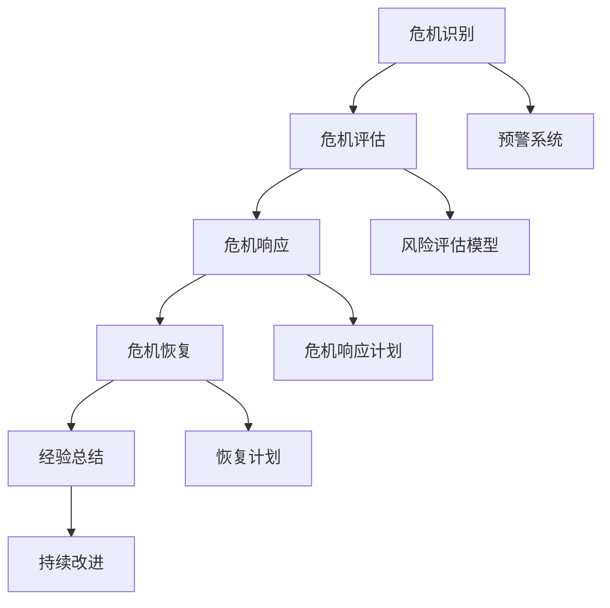
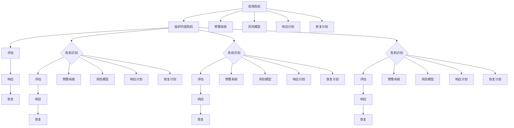
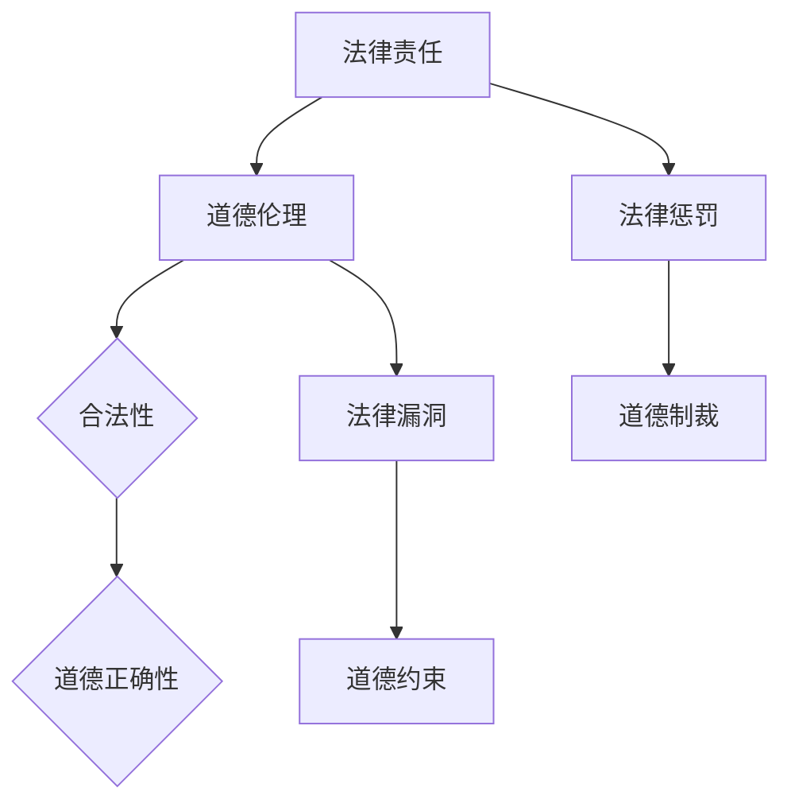

                 

### 引言：危机管理的必要性和挑战

在现代商业环境中，危机管理已成为企业运营中不可或缺的一部分。无论是在科技行业、金融领域，还是制造业，危机的发生随时可能对企业造成严重的损害，影响其声誉、客户信任和市场份额。危机管理不仅关乎企业自身的生存和发展，也关乎整个社会的稳定和繁荣。

#### 背景介绍

首先，我们需要了解什么是危机。危机通常被定义为一种不可预见的事件，可能对组织造成严重威胁，包括财务损失、声誉受损、法律诉讼、员工流失等。危机可能来自内部，如管理层决策失误、产品质量问题、员工行为失范；也可能来自外部，如市场变化、竞争对手的恶意攻击、自然灾害、社会事件等。

#### 核心概念与联系

为了更系统地理解危机管理，我们可以引入危机生命周期的概念。危机生命周期一般包括四个阶段：危机识别、危机评估、危机响应和危机恢复。

1. **危机识别**：这一阶段的关键是及时发现潜在危机的信号，包括市场趋势、竞争对手动态、政策变化、内部管理问题等。
   
2. **危机评估**：在识别危机后，需要对危机的严重性、影响范围、潜在风险等进行评估，以便制定相应的应对策略。

3. **危机响应**：这是危机管理中最关键的一步，需要迅速、果断地采取行动，通过内部沟通、外部沟通、法律手段等手段来控制和减轻危机的影响。

4. **危机恢复**：危机响应后，组织需要采取措施进行危机后的恢复，包括修复受损的形象、重建信任、改进管理流程等。

#### 核心概念之间的关系架构

以下是一个简单的Mermaid流程图，展示了危机生命周期的各个阶段及其相互关系：



#### 危机管理的挑战

危机管理面临许多挑战，包括：

1. **时间紧迫**：危机往往突发性强，留给组织的时间非常有限，需要快速反应。
   
2. **信息不对称**：危机发生时，组织可能面临信息不足或信息失真的问题，这会影响危机评估和决策。

3. **资源限制**：危机管理需要投入大量的人力、物力和财力，而组织资源有限，需要合理调配。

4. **利益冲突**：在危机管理中，组织内部可能存在不同的利益诉求，需要平衡不同利益相关方的需求。

#### 本书的结构

本书旨在系统地介绍危机管理的理论和实践，帮助读者理解和应对各种类型的危机。全书分为八个章节：

1. **引言**：介绍危机管理的背景、定义和重要性。
   
2. **核心概念与框架**：阐述危机生命周期的概念，以及危机识别、评估、响应和恢复的具体内容。

3. **预防与缓解策略**：介绍风险识别、风险评估、内部管理和外部沟通等预防与缓解策略。

4. **传播与媒体管理**：探讨媒体环境分析、媒体沟通技巧、社交媒体管理等传播与媒体管理策略。

5. **法律和伦理考虑**：讨论法律责任和道德伦理在危机管理中的重要性。

6. **危机响应与恢复**：详细介绍紧急响应和恢复计划的具体步骤和策略。

7. **案例研究和经验教训**：分析成功的危机管理案例和失败的教训，提炼经验教训。

8. **实践工具和模板**：提供危机管理计划、传播策略和应急响应模板，帮助读者在实际工作中应用。

通过本书的学习，读者将能够系统地了解危机管理的各个方面，掌握危机管理的核心技能，为组织应对各种危机提供有力支持。在接下来的章节中，我们将详细探讨每一个部分的内容。

```markdown
## 核心概念与框架

### 危机生命周期的概念

危机生命周期是一个描述危机从发生到解决的一系列阶段的概念模型。这个模型有助于我们理解危机管理的全过程，并制定相应的策略。危机生命周期通常包括以下四个阶段：

1. **危机识别**：在这一阶段，组织需要及时发现潜在的危机信号，这些信号可能来自内部或外部。内部信号可能包括员工的不满、财务状况的恶化、产品或服务的问题等；外部信号可能包括市场变化、政策调整、竞争对手的动态等。及时识别危机信号对于减少危机的影响至关重要。

2. **危机评估**：在识别危机后，组织需要对危机的严重性、影响范围、潜在风险等进行评估。评估可以帮助组织确定危机的优先级，并制定相应的应对策略。评估方法包括定量分析和定性分析，如问卷调查、访谈、数据分析等。

3. **危机响应**：这一阶段是危机管理的核心，组织需要迅速采取行动来控制和减轻危机的影响。响应策略可能包括内部沟通、外部沟通、法律手段、公关活动等。有效的危机响应可以迅速降低危机的严重性，减少损失。

4. **危机恢复**：危机响应后，组织需要采取措施进行危机后的恢复。恢复计划可能包括修复受损的形象、重建信任、改进管理流程等。恢复阶段的目标是确保组织能够从危机中恢复过来，并增强其抗风险能力。

### 危机生命周期的各个阶段及其相互关系

以下是危机生命周期的各个阶段及其相互关系的Mermaid流程图：


### 主要危机类型

1. **信用危机**：信用危机通常是由于财务状况恶化、债务违约、信用评级下调等原因导致的。这类危机可能对企业的财务稳定性和市场信誉造成严重影响。

2. **法律危机**：法律危机通常是由于法律诉讼、违规操作、法律风险等原因导致的。这类危机可能对企业造成法律后果，影响其运营和声誉。

3. **公众形象危机**：公众形象危机通常是由于负面媒体报道、公众不满、品牌形象受损等原因导致的。这类危机可能影响企业的市场份额和客户忠诚度。

4. **组织内部危机**：组织内部危机通常是由于员工行为问题、管理失误、企业文化问题等原因导致的。这类危机可能影响组织的运营效率和员工士气。

### 危机生命周期与主要危机类型的关系

以下是危机生命周期与主要危机类型关系的Mermaid流程图：



### 总结

核心概念与框架是危机管理的基石，通过对危机生命周期的理解，我们可以更好地识别、评估、响应和恢复危机。了解不同类型的危机，有助于我们在实际工作中制定更有针对性的策略。在下一章中，我们将深入探讨预防和缓解策略，帮助组织降低危机风险。

```markdown
## 预防和缓解策略

在危机管理中，预防和缓解策略是减少危机影响的重要手段。有效的预防和缓解策略能够帮助组织在危机发生前识别潜在风险，并在危机发生时迅速采取行动，减轻损失。以下将详细介绍预防策略和缓解策略的具体方法。

### 风险识别

风险识别是危机预防的第一步，它涉及识别可能导致危机的因素。以下是一些常用的风险识别方法：

1. **头脑风暴**：通过团队讨论，列出可能的风险因素。
2. **SWOT分析**：分析组织的优势、劣势、机会和威胁，识别潜在的风险。
3. **历史数据分析**：分析过去的危机事件，总结经验教训，识别未来可能的风险。
4. **专家咨询**：咨询行业专家或顾问，获取专业的风险识别意见。

### 风险评估

在识别风险后，需要对其严重性和发生概率进行评估，以便制定相应的缓解策略。以下是一些常用的风险评估方法：

1. **概率分析**：通过统计数据和模型，评估风险的发生概率。
2. **影响分析**：评估风险发生后的影响范围和程度，包括财务损失、声誉受损等。
3. **风险评估矩阵**：使用矩阵方法，将风险发生的概率和影响程度进行综合评估，确定风险优先级。
4. **情景分析**：通过模拟不同情景，评估风险的可能后果。

### 风险应对策略

根据风险评估的结果，组织需要制定相应的风险应对策略。以下是一些常见的风险应对策略：

1. **风险规避**：通过改变业务模式或运营方式，避免风险的发生。
2. **风险减轻**：通过改进流程、增加安全措施等方式，降低风险的发生概率或影响程度。
3. **风险转移**：通过保险或其他方式，将风险转移给第三方。
4. **风险接受**：在无法规避或减轻风险的情况下，制定应对计划，接受风险。

### 内部管理

内部管理是危机预防和缓解的重要环节，以下是一些内部管理的策略：

1. **员工培训**：定期对员工进行危机管理培训，提高员工的危机意识和应对能力。
2. **应急预案**：制定详细的应急预案，确保在危机发生时能够迅速响应。
3. **内部沟通机制**：建立有效的内部沟通渠道，确保信息畅通，减少信息不对称。
4. **团队协作**：鼓励团队协作，提高危机应对的效率。

### 外部沟通

外部沟通是危机管理的重要组成部分，以下是一些外部沟通的策略：

1. **沟通计划**：制定详细的沟通计划，明确沟通目标、沟通对象、沟通渠道和沟通时间。
2. **沟通渠道选择**：根据目标受众的特点，选择合适的沟通渠道，如电话、邮件、社交媒体等。
3. **媒体关系管理**：建立与媒体的良好关系，及时回应媒体报道，控制信息传播。
4. **社会责任**：积极履行社会责任，提升公众对组织的信任。

### 预防和缓解策略的实际应用

以下是一个简单的示例，说明预防和缓解策略在实际中的应用：

#### 风险识别

通过SWOT分析，我们发现公司存在以下风险因素：
- 市场竞争加剧
- 产品质量不稳定
- 财务状况不佳
- 法律法规变化

#### 风险评估

通过概率分析和影响分析，我们评估出以下风险：
- 市场竞争加剧：低概率，高影响
- 产品质量不稳定：高概率，中影响
- 财务状况不佳：中概率，高影响
- 法律法规变化：低概率，中影响

#### 风险应对策略

- 风险规避：通过市场调研，寻找新的市场机会，避免市场竞争加剧的风险。
- 风险减轻：通过质量管理和财务监控，降低产品质量不稳定和财务状况不佳的风险。
- 风险转移：购买产品责任保险，将产品质量风险转移给保险公司。
- 风险接受：制定法律法规应对计划，确保在法规变化时能够迅速响应。

#### 内部管理

- 员工培训：定期对员工进行质量管理和财务管理培训。
- 应急预案：制定产品质量和财务危机应急预案。
- 内部沟通机制：建立内部沟通平台，确保信息畅通。
- 团队协作：组建危机管理团队，提高协作效率。

#### 外部沟通

- 沟通计划：制定危机沟通计划，明确沟通目标、对象、渠道和时间。
- 沟通渠道选择：通过公司官网、社交媒体和电话热线与客户沟通。
- 媒体关系管理：与主流媒体建立良好关系，及时回应负面报道。
- 社会责任：积极参与社会公益活动，提升公司形象。

### 总结

预防和缓解策略是危机管理的重要组成部分，通过有效的风险识别、评估和应对，组织可以降低危机发生的概率和影响。在下一章中，我们将探讨传播与媒体管理，帮助组织在危机中有效沟通，维护声誉。

```markdown
## 传播与媒体管理

在危机管理中，传播与媒体管理扮演着至关重要的角色。一个有效的传播策略可以帮助组织在危机发生时迅速回应，减少负面影响，甚至可能将危机转化为机遇。以下是关于媒体环境分析、媒体沟通技巧、社交媒体管理等传播与媒体管理的策略。

### 媒体环境分析

了解当前媒体环境是制定传播策略的第一步。以下是一些关键的考虑因素：

1. **媒体生态**：分析不同类型的媒体，包括传统媒体（如报纸、电视、广播）和新兴媒体（如社交媒体、在线新闻网站）。了解每种媒体的覆盖范围、影响力、受众特征和传播速度。

2. **媒体影响力**：评估不同媒体对公众舆论的影响程度。一些媒体可能具有强大的影响力，能够在短时间内引起公众关注。

3. **媒体策略**：分析组织与媒体之间的关系，包括媒体报道倾向、记者的专业背景和兴趣点等。

### 媒体沟通技巧

有效的媒体沟通技巧是危机管理的关键。以下是一些实用的技巧：

1. **提问技巧**：在与媒体沟通时，掌握提问技巧至关重要。要学会如何引导记者的问题，避免泄露敏感信息或做出错误的表态。

2. **发言人准备**：确保发言人熟悉危机背景、应对策略和关键信息。进行模拟演练，提高发言人的应对能力。

3. **应对负面报道**：当面对负面报道时，要保持冷静，迅速采取行动。可以通过发布官方声明、召开新闻发布会或通过媒体回应等方式，积极应对。

### 社交媒体管理

在当今社交媒体高度发达的时代，社交媒体管理成为危机管理中不可或缺的一环。以下是一些策略：

1. **社交媒体策略**：制定社交媒体沟通策略，包括确定目标、内容规划、发布频率和监测方法。

2. **社交媒体危机处理**：在危机发生时，社交媒体平台可以迅速传播信息。因此，组织需要建立快速响应机制，及时发布权威信息，纠正错误信息，并保持与公众的互动。

3. **社交媒体监控**：定期监控社交媒体上的舆论动态，及时发现潜在的危机信号，并采取措施进行应对。

### 实际应用案例

以下是一个关于社交媒体管理的实际应用案例：

#### 案例背景

某知名科技公司发生数据泄露事件，涉及大量用户个人信息。这一事件迅速在社交媒体上引起了广泛关注，负面舆论迅速蔓延。

#### 应对措施

1. **媒体环境分析**：分析社交媒体上涉及该事件的讨论，发现主要讨论集中在用户的隐私保护和公司责任上。

2. **社交媒体策略**：立即启动社交媒体危机响应计划，通过官方社交媒体账号发布声明，说明事件基本情况、公司对此事的重视程度以及已采取的措施。

3. **提问技巧和发言人准备**：指定发言人接受媒体采访，准备好回答可能的问题，如数据泄露的具体细节、已采取的补救措施和未来的预防措施。

4. **应对负面报道**：通过社交媒体平台积极回应负面评论，解释数据泄露的原因和公司采取的补救措施，争取公众理解。

5. **社交媒体监控**：持续监控社交媒体上的舆论动态，及时调整沟通策略，确保信息的准确性和及时性。

#### 结果

通过有效的社交媒体管理，公司成功控制了舆论的扩散，避免了更多负面影响的产生。尽管事件对公司声誉造成了一定的损害，但公司通过透明和积极的沟通，赢得了公众的一定理解和支持。

### 总结

传播与媒体管理是危机管理的重要组成部分。通过了解媒体环境、掌握媒体沟通技巧和有效管理社交媒体，组织可以更好地应对危机，维护其声誉。在下一章中，我们将探讨法律和伦理考虑，帮助组织在危机管理中遵循法律和道德规范。

```markdown
## 法律和伦理考虑

在危机管理中，法律和伦理问题往往是组织必须面对的重要挑战。正确的法律和伦理处理不仅能够帮助组织避免法律责任，还能提升公众对组织的信任。以下将详细讨论危机管理中的法律责任和道德伦理问题。

### 法律责任

1. **刑事责任**：如果危机事件构成犯罪，组织和个人可能面临刑事责任。例如，财务造假可能导致管理层被起诉。了解相关法律法规，采取合法行动是危机管理的首要任务。

2. **民事责任**：组织在危机中可能面临因产品缺陷、合同违约等原因导致的民事赔偿。在处理危机时，应确保所有决策和行动都有法律依据，以避免法律纠纷。

3. **行政责任**：政府可能对组织在危机管理中的不当行为进行行政处罚，如吊销营业执照、罚款等。组织需要了解并遵守相关行政规定。

### 道德伦理

1. **诚信原则**：在危机管理中，诚信是组织最基本的道德原则。无论在内部沟通还是与外部公众互动中，组织都应保持透明和诚实，避免任何误导或欺诈行为。

2. **公平原则**：组织在危机管理中应公平对待所有利益相关者，包括员工、客户、供应商和社区。确保资源分配和决策过程的公平性，避免因偏见导致的利益损害。

3. **责任原则**：组织应对危机事件承担应有的责任。这包括对受害者的赔偿、对公众的道歉、对内部管理流程的改进等。通过承担责任，组织能够重建公众信任。

### 法律责任和道德伦理的关系

法律责任和道德伦理在危机管理中相互关联，但并不总是完全一致。以下是一个简单的Mermaid流程图，展示了法律责任和道德伦理的关系：



### 实际应用

以下是一个关于法律责任和道德伦理实际应用案例：

#### 案例背景

某制药公司在药物临床试验中因违规操作导致多名患者死亡。这一事件引发了公众的广泛关注，公司面临法律和伦理的双重压力。

#### 应对措施

1. **法律责任**：公司立即启动法律咨询，确保所有应对措施符合法律规定。同时，积极配合相关部门的调查，提供所有必要的信息。

2. **道德伦理**：公司发布公开道歉，承认错误，并承诺对受害者进行赔偿。公司还成立了道德委员会，对临床试验流程进行全面审查，确保不再发生类似事件。

#### 结果

通过合法和道德的应对措施，公司成功缓解了公众的愤怒和不满。尽管面临高额的赔偿和法律罚款，但公司通过透明和负责任的行动，维护了其声誉，并赢得了公众的一定理解。

### 总结

法律和伦理在危机管理中至关重要。组织必须了解并遵守相关法律法规，同时遵循道德伦理原则。这不仅有助于避免法律责任，还能提升公众对组织的信任。在下一章中，我们将探讨危机响应与恢复策略，帮助组织在危机中迅速采取行动，降低损失。

```markdown
## 危机响应与恢复

在危机发生时，迅速而有效的响应是减轻危机影响、保护组织声誉的关键。危机响应包括紧急响应和恢复计划两个阶段。以下将详细阐述每个阶段的步骤、策略和具体实践。

### 紧急响应

紧急响应是危机管理中的第一道防线，旨在迅速控制危机，减少损失。以下是一些关键步骤和策略：

1. **紧急事件评估**：在危机发生时，组织需要迅速评估危机的性质、严重性和影响范围。这可以通过现场调查、数据分析和专家咨询来完成。

2. **紧急决策**：在评估的基础上，组织需要迅速做出决策，确定危机响应的优先事项和具体行动。这包括启动应急预案、调配资源、明确责任人等。

3. **应急资源的调配**：根据危机响应计划，组织需要迅速调配所需的资源，如人力资源、物资设备和资金。确保所有必要资源能够及时到位，支持危机响应行动。

4. **内部沟通**：危机发生时，组织内部沟通至关重要。通过紧急会议、内部邮件、短信和电话等方式，确保所有相关人员了解危机状况和响应计划。

5. **外部沟通**：同时，组织需要与外部利益相关者进行有效沟通，包括客户、供应商、合作伙伴和公众。发布紧急声明，解释危机状况和组织的应对措施。

### 恢复计划

危机响应后，组织需要制定恢复计划，以逐步恢复正常运营并重建信任。以下是一些关键步骤和策略：

1. **损失评估**：在危机响应过程中，组织应不断评估损失情况，包括财务损失、声誉受损和运营中断等。这有助于制定针对性的恢复计划。

2. **恢复策略**：根据损失评估的结果，组织需要制定具体的恢复策略。这可能包括技术修复、法律补救、公关活动等。确保所有恢复措施有明确的目标和时间表。

3. **资源调配**：在恢复计划实施过程中，组织需要合理调配资源，确保恢复行动的顺利进行。这可能包括增加人力资源、采购物资设备、寻求外部支持等。

4. **内部沟通**：在恢复过程中，组织需要持续与内部员工沟通，提供最新进展和指导。通过定期的内部会议和邮件更新，确保员工了解情况，减少恐慌和不确定性。

5. **外部沟通**：同时，组织需要与外部利益相关者保持沟通，更新他们关于恢复进展的信息。通过新闻发布会、社交媒体和官方网站等方式，增强透明度，重建信任。

### 实际应用案例

以下是一个危机响应与恢复的实际应用案例：

#### 案例背景

某互联网公司在一次软件更新中发生严重漏洞，导致大量用户个人信息泄露。这一事件引发了公众的广泛关注和恐慌。

#### 应对措施

1. **紧急响应**：
   - 紧急事件评估：公司迅速评估漏洞的性质和影响，确定紧急响应的优先事项。
   - 紧急决策：公司决定立即停止软件更新，并通知所有受影响的用户。
   - 应急资源的调配：公司调集技术团队和公关团队，全力应对危机。
   - 内部沟通：公司通过内部会议和邮件，确保所有员工了解危机状况和响应计划。
   - 外部沟通：公司发布紧急声明，解释漏洞情况，承诺采取补救措施。

2. **恢复计划**：
   - 损失评估：公司评估了漏洞导致的数据损失和声誉受损情况，制定了恢复策略。
   - 恢复策略：公司采取了以下措施：
     - 技术修复：立即修复漏洞，确保用户数据的安全。
     - 法律补救：与律师团队合作，采取法律手段追究相关责任。
     - 公关活动：通过新闻发布会和社交媒体，积极回应公众关切，重建信任。
   - 资源调配：公司增加了技术支持和客户服务团队，提供24/7的客户支持。
   - 内部沟通：公司定期召开内部会议，更新员工关于恢复进展的信息。
   - 外部沟通：公司通过官方网站和社交媒体，持续更新恢复进展，增强透明度。

#### 结果

通过有效的危机响应和恢复计划，公司成功控制了危机的影响，恢复了用户对公司的信任。尽管事件对公司造成了一定的损失，但公司通过透明和负责任的应对措施，维护了其声誉。

### 总结

危机响应与恢复是危机管理的重要组成部分。通过迅速的紧急响应和全面的恢复计划，组织可以减轻危机影响，重建声誉。在下一章中，我们将通过案例分析，深入探讨危机管理的实际应用和经验教训。

```markdown
## 案例研究和经验教训

为了更好地理解危机管理的实际应用，我们将分析几个真实的案例，总结成功和失败的危机管理经验，提炼出有价值的教训。

### 案例一：公司财务危机

#### 背景信息

某大型科技公司因为市场变化和内部管理问题，导致财务状况急剧恶化，甚至面临破产的风险。这一事件引发了投资者和公众的广泛关注。

#### 成功的管理实践

- **快速识别**：公司高层及时识别到财务危机的信号，迅速采取措施。
- **透明沟通**：公司通过定期发布财务报告，与投资者和公众保持透明沟通。
- **法律咨询**：公司聘请专业律师团队，确保所有决策符合法律规定。
- **资源调配**：公司通过裁员和优化供应链，减少运营成本。
- **外部支持**：公司寻求政府和社会资本的支持，渡过难关。

#### 教训与启示

- **及时识别**：危机管理的关键在于及时识别潜在问题。
- **透明沟通**：透明沟通有助于建立信任，减少谣言和恐慌。
- **法律合规**：遵守法律是避免法律风险的关键。
- **资源调配**：在危机中，合理调配资源是缓解压力的重要手段。

### 案例二：产品质量问题

#### 背景信息

某知名汽车品牌因为一辆汽车发生严重故障，导致车主受伤和车辆损毁。这一事件迅速成为新闻焦点，引发了公众的广泛关注。

#### 成功的管理实践

- **紧急召回**：公司立即召回问题车辆，进行检修和更换。
- **客户沟通**：公司通过电话和邮件与受影响客户进行沟通，了解他们的关切。
- **技术改进**：公司对相关零部件进行技术改进，确保问题不再发生。
- **媒体回应**：公司通过新闻发布会和社交媒体，回应媒体的提问，控制信息传播。

#### 教训与启示

- **快速响应**：在危机发生时，迅速采取行动是减少损失的关键。
- **客户至上**：关注客户利益，积极回应客户关切，有助于维护品牌形象。
- **技术改进**：持续的技术改进是防止危机再次发生的有效手段。
- **媒体管理**：有效管理媒体，控制信息传播，有助于减少负面影响。

### 案例三：网络安全事件

#### 背景信息

某电子商务平台遭受黑客攻击，导致大量用户数据泄露。这一事件对公司的声誉和用户信任造成了严重损害。

#### 成功的管理实践

- **应急响应**：公司立即启动网络安全应急响应计划，阻止攻击。
- **数据修复**：公司迅速修复数据，确保用户信息安全。
- **内部培训**：对公司员工进行网络安全培训，提高防范意识。
- **公众沟通**：公司通过官方网站和邮件，向用户通报事件进展和采取的措施。

#### 教训与启示

- **应急响应**：建立完善的应急响应机制，确保在危机发生时能够迅速响应。
- **数据安全**：确保数据安全是网络安全管理的核心任务。
- **员工培训**：提高员工的网络安全意识和技能，减少安全漏洞。
- **透明沟通**：与公众保持透明沟通，重建信任。

### 总结

通过以上案例，我们可以看到，危机管理不仅需要迅速响应，还需要透明沟通、技术改进和法律合规。成功的危机管理实践能够帮助组织在危机中保持稳定，而失败的教训则为我们提供了宝贵的经验。在下一章中，我们将提供实践工具和模板，帮助读者在实际工作中应用危机管理策略。

```markdown
## 实践工具和模板

为了帮助读者在实际工作中应用危机管理策略，本章将提供一些实用的工具和模板，包括危机管理计划模板、传播策略模板和应急响应模板。

### 危机管理计划模板

**模板示例**：

```markdown
# 危机管理计划

## 1. 引言
- **目的**：确保组织在面临危机时能够迅速响应，降低风险和损失。
- **适用范围**：本计划适用于所有可能的危机情景。

## 2. 危机类型
- **财务危机**
- **法律危机**
- **公众形象危机**
- **运营中断危机**

## 3. 风险评估
- **风险识别**：列出可能的风险因素。
- **风险评估**：评估每个风险的严重性和发生概率。

## 4. 危机响应
- **紧急事件评估**：在危机发生时，立即评估危机的性质和影响。
- **紧急决策**：根据评估结果，制定应对策略。
- **应急资源调配**：确保所有必要资源能够迅速调配。

## 5. 恢复计划
- **损失评估**：评估危机造成的损失。
- **恢复策略**：制定恢复策略，包括技术修复、法律补救、公关活动等。
- **资源调配**：确保恢复计划有足够的资源支持。

## 6. 沟通计划
- **内部沟通**：确保所有相关人员了解危机状况和应对计划。
- **外部沟通**：与利益相关者保持沟通，发布官方声明。

## 7. 持续改进
- **经验总结**：在危机结束后，总结经验教训。
- **持续改进**：根据经验教训，改进危机管理计划。

```

### 传播策略模板

**模板示例**：

```markdown
# 传播策略模板

## 1. 目标
- **目标受众**：确定目标受众，如媒体、客户、员工等。
- **沟通目标**：明确沟通的目标，如提高品牌知名度、重建公众信任等。

## 2. 沟通计划
- **内容规划**：制定沟通内容，包括关键信息、声明等。
- **发布频率**：确定沟通的频率，如每天、每周等。
- **渠道选择**：选择合适的沟通渠道，如电话、邮件、社交媒体等。

## 3. 媒体关系管理
- **媒体名单**：列出主要的媒体联系人。
- **关系维护**：定期与媒体保持沟通，建立良好的关系。

## 4. 社交媒体管理
- **社交媒体策略**：制定社交媒体策略，包括发布内容、互动等。
- **危机响应**：建立社交媒体危机响应机制，确保能够迅速回应负面舆论。

## 5. 沟通评估
- **沟通效果评估**：定期评估沟通效果，调整策略。
- **反馈收集**：收集受众反馈，改进沟通策略。

```

### 应急响应模板

**模板示例**：

```markdown
# 应急响应模板

## 1. 紧急事件评估
- **事件识别**：迅速识别危机事件。
- **影响评估**：评估危机事件的影响范围和程度。

## 2. 紧急决策
- **响应策略**：根据评估结果，制定应对策略。
- **责任分配**：明确各部门和个人的职责。

## 3. 资源调配
- **人力资源**：确保有足够的人力支持。
- **物资设备**：确保所有必要的物资和设备到位。
- **资金支持**：确保有足够的资金支持危机响应行动。

## 4. 内部沟通
- **紧急会议**：召开紧急会议，确保所有相关人员了解危机状况。
- **内部邮件**：通过内部邮件更新员工关于危机的最新信息。

## 5. 外部沟通
- **官方声明**：发布官方声明，解释危机状况和组织的应对措施。
- **媒体回应**：及时回应媒体询问，控制信息传播。

## 6. 监控和调整
- **监控舆情**：持续监控社交媒体和新闻媒体的舆论动态。
- **策略调整**：根据实际情况，调整危机响应策略。

```

### 最佳实践 Tips

1. **制定详细的危机管理计划**：确保组织在面临危机时能够迅速响应。
2. **定期培训和演练**：提高员工对危机管理的意识和应对能力。
3. **建立良好的媒体关系**：有助于在危机中控制信息传播，减少负面影响。
4. **实时监测舆情**：及时了解公众对组织的看法，快速采取应对措施。

### 小结

通过本章提供的实践工具和模板，读者可以更好地理解和应用危机管理策略。在实际工作中，应根据组织的具体情况进行调整和优化，确保危机管理计划的有效实施。

### 注意事项

1. **确保沟通一致性**：在危机管理中，内部和外部沟通应保持一致性，避免信息混乱。
2. **遵守法律法规**：在危机管理中，所有决策和行动都应符合相关法律法规。
3. **持续改进**：危机管理是一个动态的过程，需要不断总结经验教训，持续改进。

### 拓展阅读

- **《危机管理：应对战略与案例分析》**：详细介绍了危机管理的理论和实践。
- **《公关危机处理实务》**：提供了丰富的危机管理案例和操作指南。
- **《社交媒体危机管理》**：专注于社交媒体在危机管理中的应用。

作者：AI天才研究院/AI Genius Institute & 禅与计算机程序设计艺术 /Zen And The Art of Computer Programming

---

通过以上详细的章节内容和实践工具，我们希望读者能够对危机管理有一个全面的理解，并在实际工作中有效地应对各种危机。无论面对的是财务危机、产品质量问题还是网络安全事件，有效的危机管理都能帮助组织度过难关，维护声誉。希望读者能够学以致用，为组织的可持续发展做出贡献。

