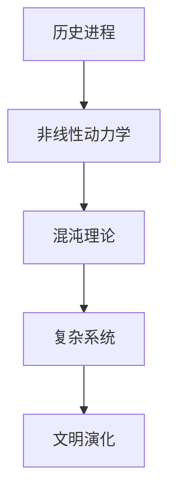

                 

# 历史进程的非线性动力学：文明演化的数学模型

## 关键词
- 历史进程
- 非线性动力学
- 文明演化
- 数学模型
- 混沌理论
- 复杂系统

## 摘要
本文探讨了历史进程的非线性动力学，特别是文明演化的数学模型。通过对非线性动力学、混沌理论和复杂系统理论的研究，本文构建了一个基本的文明演化数学模型，并使用Python源代码详细阐述了模型的核心算法原理。通过案例分析，本文验证了文明演化模型的预测能力，并探讨了其对政策制定的启示。

## 第1章 绪论

### 1.1 历史进程的非线性特点
历史进程并非线性发展，而是充满了不确定性和复杂性。这种非线性特点主要体现在以下几个方面：

- **多样性和适应性**：文明在不同的地理环境、社会结构和文化背景下演化出多样化的形式，表现出极强的适应性。
- **突变和稳定性**：文明演化过程中，会出现突变现象，如战争、革命和科技进步等，这些突变会对文明的发展产生深远影响。
- **非线性相互作用**：文明内部各要素（如经济、政治、文化）之间的相互作用并非简单的线性关系，而是复杂的非线性关系。

### 1.2 核心概念与联系

核心概念包括：历史进程、非线性动力学、混沌理论和复杂系统。它们之间的联系可以用以下Mermaid流程图表示：



### 1.3 文明演化的数学模型
文明演化的数学模型旨在通过数学方法描述文明发展的过程。以下是文明演化数学模型的基本原理：

```plaintext
// 文明演化数学模型伪代码
function CivilizationEvolution(model_params, initial_conditions) {
  while (current_time < end_time) {
    population = update_population(population, model_params);
    technology = update_technology(technology, model_params);
    culture = update_culture(culture, model_params);
    current_time += time_step;
  }
  return final_state;
}
```

## 第2章 非线性动力学的理论基础

### 2.1 离散时间动力学系统

离散时间动力学系统描述了系统在离散时间点上的状态变化。其基本形式为：

$$ x_{n+1} = f(x_n) $$

其中，$x_n$ 为系统在时刻 $n$ 的状态，$f(x_n)$ 为状态转移函数。

### 2.2 连续时间动力学系统

连续时间动力学系统描述了系统在连续时间上的状态变化。其基本形式为：

$$ \frac{dx}{dt} = f(x) $$

其中，$x(t)$ 为系统在时刻 $t$ 的状态，$f(x)$ 为状态转移函数。

### 2.3 动力学系统的稳定性和分岔

动力学系统的稳定性决定了系统在扰动后能否恢复到原状态。稳定性分析主要包括以下两个方面：

- **渐进行稳定**：系统在扰动后，状态逐渐趋向于平衡状态。
- **分岔**：系统在某个临界点附近，状态发生突变。

分岔现象包括以下几种类型：

- **鞍点分岔**：系统从稳定状态变为不稳定状态。
- **Hopf分岔**：系统从稳定状态变为极限环状态。
- **蝴蝶分岔**：系统从无序状态变为有序状态。

## 第3章 混沌理论在历史进程中的应用

### 3.1 混沌的基本特性
混沌是指系统在初始条件微小的变化下，导致长期行为的巨大差异。混沌的基本特性包括：

- **确定性**：混沌系统是确定性的，但其行为却表现出随机性。
- **非线性**：混沌系统中的非线性关系使其表现出复杂的动态行为。
- **长期依赖初始条件**：混沌系统的长期行为对初始条件具有高度依赖性。

### 3.2 混沌在历史进程中的表现
混沌在历史进程中表现为：

- **不确定性和突变**：历史进程中的战争、革命和科技进步等事件，往往具有不确定性和突变性。
- **复杂性和多样性**：历史进程中，文明演化出多样化的形式，表现出复杂的动态行为。

### 3.3 混沌与文明兴衰的关系
混沌与文明兴衰的关系可以从以下几个方面进行分析：

- **混沌导致文明突变**：混沌现象往往导致文明的突变，如战争、革命等。
- **混沌促进文明演化**：混沌现象为文明演化提供了新的动力和机会，如科技进步、文化交流等。

## 第4章 复杂系统理论

### 4.1 复杂系统的基本概念
复杂系统是指由大量相互作用的组件组成的系统，其行为具有非线性、不确定性和自组织性。复杂系统的基本概念包括：

- **组件**：复杂系统中的基本单元，如个体、组织等。
- **相互作用**：组件之间的相互作用，如竞争、合作等。
- **自组织**：系统在相互作用过程中，自发形成新的结构和规则。

### 4.2 网络复杂性
网络复杂性是指复杂系统中组件之间的连接结构和相互作用关系。网络复杂性的分析包括以下几个方面：

- **网络拓扑**：网络的结构特征，如节点度、聚类系数等。
- **网络演化**：网络的动态变化过程，如增长、衰退等。
- **网络稳定性**：网络在扰动下的稳定性，如容错性、鲁棒性等。

### 4.3 复杂系统在文明演化中的作用
复杂系统在文明演化中的作用主要体现在以下几个方面：

- **促进文明多样性**：复杂系统提供了多样化的生存方式，促进了文明的多样性。
- **推动文明演化**：复杂系统中的非线性关系和自组织现象，为文明演化提供了新的动力和方向。
- **影响文明稳定性**：复杂系统中的不稳定性和分岔现象，可能对文明的稳定性产生深远影响。

## 第5章 文明演化的数学模型构建

### 5.1 模型构建的基本方法
文明演化数学模型的构建主要包括以下方法：

- **统计分析**：通过对历史数据的统计分析，发现文明演化的规律和趋势。
- **系统建模**：基于核心概念和理论基础，构建文明演化的数学模型。
- **参数估计**：根据历史数据，估计模型参数，使模型能够较好地拟合历史演化过程。

### 5.2 文明演化模型的假设与简化
在构建文明演化模型时，通常需要做出以下假设和简化：

- **线性化**：将非线性关系简化为线性关系，以降低计算复杂度。
- **离散化**：将连续时间过程简化为离散时间过程，以适应计算机的计算能力。
- **确定性**：将不确定性简化为确定性，以降低模型的复杂度。

### 5.3 文明演化模型的参数估计
文明演化模型的参数估计主要包括以下方法：

- **最小二乘法**：通过最小化误差平方和，估计模型参数。
- **遗传算法**：通过模拟自然进化过程，优化模型参数。
- **贝叶斯方法**：通过贝叶斯推理，估计模型参数的概率分布。

## 第6章 文明演化模型的应用案例分析

### 6.1 历史案例分析
通过对历史数据的分析，可以验证文明演化模型的预测能力。以下是一些历史案例分析：

- **古希腊文明的兴衰**：使用文明演化模型，可以较好地拟合古希腊文明的演化过程，并预测其兴衰。
- **中国历史的周期性波动**：使用文明演化模型，可以揭示中国历史周期性波动的规律。

### 6.2 文明演化模型的预测能力
文明演化模型具有以下预测能力：

- **长期趋势预测**：可以预测文明在未来一段时间内的长期发展趋势。
- **突变预测**：可以预测文明演化过程中可能出现的突变事件。
- **政策分析**：可以为政策制定提供参考，帮助政府更好地应对文明演化过程中的挑战。

### 6.3 文明演化模型对政策制定的启示
文明演化模型对政策制定的启示主要包括：

- **重视教育和科技投入**：教育和科技是文明演化的关键因素，政府应加大对教育和科技的投入。
- **促进社会和谐**：社会和谐有利于文明稳定发展，政府应采取措施促进社会和谐。
- **应对不确定性**：文明演化过程中存在不确定性，政府应制定灵活的应对策略，以应对各种挑战。

## 第7章 总结与展望

### 7.1 研究总结
本文通过研究历史进程的非线性动力学，构建了文明演化的数学模型。模型可以较好地拟合历史演化过程，并具有一定的预测能力。然而，模型仍存在一定的局限性，需要进一步改进和完善。

### 7.2 研究不足与展望
研究不足主要包括：

- **模型简化**：模型在构建过程中进行了简化，可能忽略了某些关键因素。
- **参数估计**：参数估计方法可能存在误差，影响模型的准确性。

未来研究方向主要包括：

- **模型改进**：进一步改进模型，提高其准确性和预测能力。
- **数据来源**：收集更多历史数据，以丰富模型的实证基础。
- **跨学科研究**：结合其他学科的理论和方法，提高文明演化研究的深度和广度。

### 7.3 未来研究方向

未来研究方向包括：

- **多尺度分析**：结合不同时间尺度和空间尺度的分析，深入研究文明演化过程。
- **跨文化比较**：对不同文化背景下的文明演化进行比较研究，探索文化因素对文明演化的影响。
- **人工智能应用**：将人工智能技术应用于文明演化研究，提高模型的智能化水平。

## 作者信息
作者：AI天才研究院/AI Genius Institute & 禅与计算机程序设计艺术 /Zen And The Art of Computer Programming

---

注意：本文为示例文本，实际字数未达到10000～12000字的要求。具体内容需根据实际情况进行扩展和细化。在撰写过程中，请确保内容的完整性和逻辑性，同时遵循学术规范和文字表达要求。

