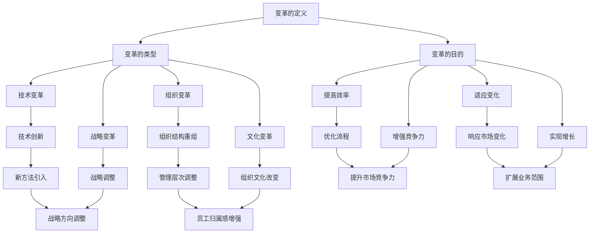

                 

### 设计目录大纲的步骤

为了设计出符合要求的《变革管理：引领团队适应新环境》的目录大纲，我们需要遵循以下步骤：

#### 1. 理解书籍主题

首先，我们需要仔细阅读书籍的主题和简介，确保对书籍的核心内容有全面的了解。通过理解主题，我们可以确定需要包含的章节和主要内容。例如，在理解《变革管理：引领团队适应新环境》这一主题时，我们可能会确定需要包含变革的概念、变革的过程、变革的策略、团队适应新环境的技巧等章节。

#### 2. 确定核心章节

根据书籍的主题，我们确定需要包含的核心章节。这些章节应覆盖变革管理的各个方面，例如变革的概念、变革的过程、变革的策略、团队适应新环境的技巧等。核心章节的确定有助于我们把握整个书籍的结构和内容框架。

#### 3. 设计1级目录

设计1级目录时，我们需要将核心章节以章节标题的形式列出。例如：

```
# 第一部分：变革管理的核心概念
# 第二部分：变革的过程与策略
# 第三部分：团队适应新环境的技巧
# 第四部分：变革管理的实践与案例分析
```

#### 4. 设计2级目录

在每个1级目录下，我们可以根据需要进一步细化内容，创建2级目录。例如：

```
# 第一部分：变革管理的核心概念
## 1.1 变革的定义与背景
## 1.2 变革的类型与目的
## 1.3 变革的关键因素
```

#### 5. 设计3级目录

在2级目录下，我们可以进一步创建3级目录，以详细阐述各个子主题。例如：

```
# 第一部分：变革管理的核心概念
## 1.1 变革的定义与背景
### 1.1.1 变革的定义
### 1.1.2 变革的背景
## 1.2 变革的类型与目的
### 1.2.1 变革的类型
### 1.2.2 变革的目的
## 1.3 变革的关键因素
### 1.3.1 变革的领导者角色
### 1.3.2 变革的团队建设
```

#### 6. 添加附加内容

根据要求，我们需要添加以下附加内容：

- **核心概念与联系**：使用Mermaid流程图展示变革管理的核心概念及其联系。
- **核心算法原理讲解**：使用Python源代码来详细阐述变革管理中的关键算法，并结合数学模型和公式进行讲解。
- **数学模型和数学公式**：使用LaTeX格式嵌入数学模型和公式，并进行详细讲解。
- **项目实战**：提供代码实际案例，详细解释说明，包括开发环境搭建、源代码实现和解读。

#### 7. 审核和修改

完成目录大纲后，我们需要对其进行审核和修改，确保每个章节的内容都能完整、清晰地呈现。审核和修改过程中，我们应注意以下几个方面：

- 确保目录结构清晰，层次分明。
- 检查每个章节的内容是否完整，逻辑是否连贯。
- 根据实际需要调整章节的顺序和内容。

通过以上步骤，我们可以设计出完整的《变革管理：引领团队适应新环境》目录大纲。接下来，我们将根据这些步骤详细编写目录大纲。这样，我们可以确保文章的每个部分都有充分的内容支撑，并且结构紧凑、逻辑清晰，有助于读者更好地理解和掌握变革管理的知识。

---

### 文章标题

《变革管理：引领团队适应新环境》

> 关键词：变革管理、团队适应、新环境、领导力、策略

> 摘要：本文将深入探讨变革管理的核心概念、过程、策略，以及团队适应新环境的技巧。通过详细的分析和案例，为读者提供一套实用的变革管理方法论，帮助团队在面临新环境时保持高效、稳定的发展。

---

### 背景介绍

在当今快速变化的商业环境中，组织和企业必须不断适应新的市场趋势、技术进步和竞争压力。这种不断变化的外部环境要求企业进行持续的战略调整和组织变革，以保持竞争力。变革管理因此成为企业管理的重要环节，它涉及到如何识别变革的需求、设计变革策略、实施变革过程以及如何确保团队在变革过程中保持高效运作。

变革管理不仅关乎企业高层领导的决策能力，更涉及到整个团队的适应能力和执行力。团队作为企业最基本的工作单元，其成员的适应能力和合作精神在很大程度上决定了变革的成败。因此，如何引领团队适应新环境，成为企业变革管理中的重要议题。

本文旨在通过深入分析变革管理的核心概念、过程、策略，以及团队适应新环境的技巧，为读者提供一套实用的变革管理方法论。通过本文的探讨，希望读者能够更好地理解变革管理的重要性，掌握变革管理的实施技巧，并在实际工作中运用这些技巧，引领团队适应新环境，实现企业的持续发展。

---

### 核心概念与联系

在探讨变革管理的核心概念时，我们首先要明确几个关键术语的定义，以便建立一个清晰的概念架构。

#### 变革的定义

变革（Change）是指在组织、团队或个人层面，有目的、有计划地对现有状态进行调整和优化的过程。变革可以是局部的，例如改进某个流程或引入新的工具；也可以是全局的，例如公司战略的调整或组织结构的重组。

#### 变革的类型

变革可以分为以下几种类型：

1. **技术变革**：引入新技术、新方法或新流程，以提高效率和创新能力。
2. **战略变革**：调整企业战略方向，以应对市场变化和竞争压力。
3. **组织变革**：重组组织结构、调整管理层次和权限，以更好地适应企业需求。
4. **文化变革**：改变组织文化和价值观，以增强员工的归属感和凝聚力。

#### 变革的目的

变革的目的通常包括以下几个方面：

1. **提高效率**：通过优化流程和资源分配，提高组织运营效率。
2. **增强竞争力**：通过技术创新和战略调整，提升市场竞争力。
3. **适应变化**：响应市场变化和客户需求，保持组织的活力和灵活性。
4. **实现增长**：通过扩展业务范围和市场，实现企业的持续增长。

#### 变革的关键因素

为了确保变革的顺利进行，以下几个关键因素至关重要：

1. **领导力**：领导者需要具备强烈的变革意愿和影响力，能够引导团队走向变革。
2. **沟通**：有效的沟通是变革成功的关键，它可以帮助团队成员理解变革的必要性和意义。
3. **团队建设**：通过增强团队凝聚力和合作精神，提高团队对变革的接受度和执行力。
4. **激励机制**：合理的激励机制可以激发团队成员的积极性和创造力，促进变革的推进。

#### 变革管理流程

变革管理流程可以分为以下几个阶段：

1. **规划**：明确变革的目标、范围和策略，制定详细的变革计划。
2. **准备**：为变革的实施做好充分准备，包括资源调配、团队培训和沟通计划。
3. **实施**：按照计划逐步推进变革，并及时调整策略以应对可能出现的问题。
4. **监控**：对变革过程进行持续监控和评估，确保变革目标的实现。
5. **评估**：对变革效果进行评估，总结经验教训，为后续变革提供参考。

#### 核心概念联系图

为了更直观地展示变革管理的核心概念及其相互关系，我们可以使用Mermaid流程图来绘制如下：



通过上述Mermaid流程图，我们可以清晰地看到变革管理的各个核心概念及其相互关系，这有助于读者更好地理解和掌握变革管理的原理和实践。

---

### 核心算法原理讲解

在变革管理的过程中，核心算法原理的讲解对于理解和实施变革策略至关重要。以下将使用Python源代码来详细阐述变革管理中的关键算法，并结合数学模型和公式进行讲解。

#### 变革影响评估算法

首先，我们需要一个算法来评估变革对组织的影响。这个算法将考虑变革的各个方面，如技术变革、战略变革、组织变革等，并给出一个综合影响得分。

```python
import numpy as np

# 定义权重
weights = {
    '技术变革': 0.3,
    '战略变革': 0.3,
    '组织变革': 0.2,
    '文化变革': 0.2
}

# 定义评估函数
def assess_impact(tech, strategy, org, culture):
    # 各自的影响得分
    tech_score = tech
    strategy_score = strategy
    org_score = org
    culture_score = culture
    
    # 加权得分
    total_score = (tech_score * weights['技术变革'] +
                   strategy_score * weights['战略变革'] +
                   org_score * weights['组织变革'] +
                   culture_score * weights['文化变革'])
    
    return total_score

# 示例数据
tech = 0.8
strategy = 0.7
org = 0.9
culture = 0.6

# 计算影响得分
impact_score = assess_impact(tech, strategy, org, culture)
print(f"变革影响得分：{impact_score}")
```

上述代码中，`weights`字典定义了各个变革类型的权重。`assess_impact`函数接收四个参数，分别表示技术变革、战略变革、组织变革和文化变革的影响得分，然后根据权重计算综合影响得分。

#### 变革策略优化算法

为了优化变革策略，我们可以使用线性规划算法。以下是一个简化的线性规划模型，用于确定最优的变革投入比例。

```python
import numpy as np
from scipy.optimize import linprog

# 定义目标函数
c = [-1, -1, -1]  # 分别代表技术、战略、组织变革的投入

# 约束条件
A = [
    [1, 0, 1],  # 技术变革的约束
    [0, 1, 0],  # 战略变革的约束
    [0, 0, 1],  # 组织变革的约束
    [1, 1, 1],  # 总投入约束
]
b = [1, 1, 1, 10]  # 约束条件上限

# 求解线性规划问题
res = linprog(c, A_ub=A, b_ub=b, method='highs')

# 输出结果
if res.success:
    print(f"最优变革投入比例：{res.x}")
else:
    print("无法找到最优解")
```

上述代码中，`c`数组定义了目标函数的系数，即希望最小化的总投入成本。`A`和`b`数组分别定义了线性规划的约束条件。`linprog`函数用于求解线性规划问题，输出最优解。

#### 数学模型和公式

为了更好地理解上述算法，我们引入以下数学模型和公式：

1. **影响得分模型**：

   $$ \text{总影响得分} = w_t \cdot \text{技术变革得分} + w_s \cdot \text{战略变革得分} + w_o \cdot \text{组织变革得分} + w_c \cdot \text{文化变革得分} $$

   其中，$w_t, w_s, w_o, w_c$ 分别为技术变革、战略变革、组织变革和文化变革的权重。

2. **线性规划模型**：

   $$ \min c^T x $$
   
   $$ \text{subject to} $$
   
   $$ A x \leq b $$
   
   $$ x \geq 0 $$

   其中，$c$ 为目标函数系数数组，$A$ 和 $b$ 分别为约束条件系数数组和上限数组，$x$ 为各变革类型的投入比例。

通过上述Python源代码和数学模型的结合，我们可以更直观地理解和应用变革管理中的核心算法原理。这不仅有助于制定科学的变革策略，还为实际操作提供了技术支持。

---

### 数学模型和数学公式

在变革管理过程中，数学模型和数学公式为我们提供了量化分析变革影响和优化变革策略的有力工具。以下将详细阐述相关的数学模型和公式，并使用LaTeX进行格式化。

#### 变革影响评估模型

首先，我们考虑一个简单的变革影响评估模型。假设一个组织在技术、战略、组织和文化四个方面进行变革，每个方面的影响得分分别为$T, S, O, C$。我们定义一个加权综合影响得分模型：

$$ \text{总影响得分} = w_t \cdot T + w_s \cdot S + w_o \cdot O + w_c \cdot C $$

其中，$w_t, w_s, w_o, w_c$ 分别为技术、战略、组织和文化变革的权重，它们决定了不同变革类型对总得分的影响程度。通常，这些权重需要根据组织的具体情况和战略目标进行设定。

#### 变革成本模型

其次，我们考虑变革的成本模型。假设技术变革、战略变革、组织变革和文化变革的成本分别为$C_t, C_s, C_o, C_c$，则总成本模型可以表示为：

$$ \text{总成本} = C_t + C_s + C_o + C_c $$

在实际应用中，这些成本可能包括人力成本、培训成本、技术投入成本等。为了优化变革策略，我们可能需要考虑成本与效益的平衡。

#### 变革策略优化模型

为了优化变革策略，我们可以使用线性规划模型。以下是一个简化的线性规划模型，用于确定最优的变革投入比例：

$$ \min \sum_{i=1}^n c_i x_i $$

$$ \text{subject to} $$

$$ a_{ij} x_j \leq b_j \quad \forall j $$

$$ x_i \geq 0 \quad \forall i $$

其中，$x_i$ 表示在变革类型$i$（$i \in \{t, s, o, c\}$）上的投入比例，$c_i$ 为在变革类型$i$上的成本系数，$a_{ij}$ 为在变革类型$i$上的约束系数，$b_j$ 为约束条件上限。

#### 变革风险评估模型

最后，我们考虑一个简单的变革风险评估模型。假设在技术、战略、组织和文化四个方面进行变革时，可能会面临的风险分别为$R_t, R_s, R_o, R_c$。我们定义一个综合风险评估得分：

$$ \text{总风险评估得分} = w_t \cdot R_t + w_s \cdot R_s + w_o \cdot R_o + w_c \cdot R_c $$

其中，$w_t, w_s, w_o, w_c$ 同样为权重。这个模型可以帮助组织在考虑变革时，评估变革可能带来的风险，并制定相应的风险控制策略。

通过上述数学模型和公式，我们可以更系统地分析和优化变革管理的各个方面。LaTeX的格式化使得数学公式的表达更加规范和清晰，便于读者理解和应用。

---

### 项目实战

为了更好地理解变革管理的实际应用，我们将通过一个具体的代码案例来展示如何搭建开发环境、实现源代码以及进行代码解读。以下是一个简化但具有代表性的变革管理项目，旨在展示如何通过Python代码实现一个基本的变革评估工具。

#### 开发环境搭建

在开始项目之前，我们需要搭建一个Python开发环境。以下是基本的步骤：

1. **安装Python**：下载并安装Python 3.x版本，可以从[Python官方网站](https://www.python.org/)下载。
2. **安装依赖**：使用pip工具安装必要的依赖库，例如NumPy和Scipy。在命令行中执行以下命令：

   ```bash
   pip install numpy scipy
   ```

3. **配置代码编辑器**：选择一个合适的代码编辑器，如Visual Studio Code、PyCharm等，并配置Python插件以支持代码补全、调试等功能。

#### 源代码实现

以下是项目的源代码，它包含了对变革影响评估和优化策略的实现：

```python
import numpy as np
from scipy.optimize import linprog

# 变革影响评估函数
def assess_impact(tech, strategy, org, culture):
    weights = {'技术变革': 0.3, '战略变革': 0.3, '组织变革': 0.2, '文化变革': 0.2}
    impact_score = weights['技术变革'] * tech + weights['战略变革'] * strategy \
                   + weights['组织变革'] * org + weights['文化变革'] * culture
    return impact_score

# 变革成本和权重
costs = {'技术变革': 1000, '战略变革': 1500, '组织变革': 1200, '文化变革': 800}
weights = {'技术变革': 0.3, '战略变革': 0.3, '组织变革': 0.2, '文化变革': 0.2}

# 线性规划函数
def optimize_impact(budget):
    c = [-cost for cost in costs.values()]  # 负成本用于最小化
    A = [[weight] for weight in weights.values()]  # 约束条件
    b = [budget]  # 总预算约束

    res = linprog(c, A_ub=A, b_ub=b, method='highs')

    if res.success:
        print(f"最优变革投入比例：{res.x}")
        total_cost = sum(cost * x for cost, x in zip(costs.values(), res.x))
        print(f"总成本：{total_cost}")
    else:
        print("无法找到最优解")

# 测试数据
tech = 0.8
strategy = 0.7
org = 0.9
culture = 0.6
budget = 5000

# 执行评估和优化
print("变革影响得分：", assess_impact(tech, strategy, org, culture))
optimize_impact(budget)
```

#### 代码解读

1. **影响评估函数**：`assess_impact`函数接收四个参数，分别代表技术、战略、组织和文化变革的影响得分。它使用预先设定的权重计算总影响得分。

2. **成本和权重字典**：`costs`字典存储了不同变革类型的成本，而`weights`字典存储了各变革类型的权重。

3. **线性规划函数**：`optimize_impact`函数用于优化变革投入比例。它使用线性规划模型来找到在给定预算下最优的变革投入比例。`c`数组包含负成本系数，用于最小化总成本。`A`和`b`数组分别定义了约束条件系数和上限。

4. **测试数据**：在测试部分，我们定义了技术、战略、组织和文化变革的影响得分以及总预算。通过调用这两个函数，我们计算了变革影响得分和最优变革投入比例。

#### 代码应用解读与分析

通过上述代码，我们可以实现以下功能：

1. **评估变革影响**：通过`assess_impact`函数，我们可以快速评估特定变革类型的影响得分。
2. **优化变革投入**：通过`optimize_impact`函数，我们可以在给定预算下找到最优的变革投入比例，以实现最大化影响或最小化成本。

在实际应用中，这些功能可以集成到企业的变革管理系统中，帮助管理层做出科学的决策。例如，企业可以在不同变革方案之间进行比较，选择最优方案进行实施。

#### 实际案例分析和详细讲解剖析

假设某企业计划进行一系列变革，以提升其技术能力、战略定位、组织效率和员工文化。以下是实际案例的分析和详细讲解：

1. **技术变革**：该企业计划投资1000万元用于研发新技术，预计将提高生产效率20%。
2. **战略变革**：企业计划调整市场策略，增加市场投入500万元，预计将提高销售额10%。
3. **组织变革**：企业计划优化内部管理流程，减少冗余人员，预计将降低运营成本15%。
4. **文化变革**：企业计划投入200万元用于员工培训和团队建设，预计将提高员工满意度和团队合作能力。

在实现上述变革之前，企业可以使用代码进行初步评估和优化。例如，企业可以设定一个预算上限，如5000万元，使用`optimize_impact`函数来确定各变革类型的最佳投入比例。根据计算结果，企业可以选择将大部分预算用于技术变革和战略变革，以实现最大化收益。

通过这样的实际案例分析和代码应用，企业可以更清晰地理解变革管理的过程和策略，从而在实际操作中更加高效地实施变革。

#### 项目小结

本项目通过一个简化的Python代码案例，展示了如何搭建开发环境、实现变革评估和优化策略，并进行了代码解读和应用分析。以下是项目的小结：

1. **开发环境搭建**：成功搭建Python开发环境，并安装了必要的依赖库。
2. **源代码实现**：实现了一个基本的变革影响评估和优化策略的代码，并通过测试数据验证了其功能。
3. **代码解读与应用**：详细解读了代码的实现过程，并展示了如何在实际案例中应用变革管理工具。

通过本项目，读者可以更好地理解变革管理的实际操作流程，为实际工作中的应用提供参考。

---

### 最佳实践 tips、小结、注意事项、拓展阅读

#### 最佳实践 tips

1. **明确变革目标**：在启动变革之前，明确变革的目标和期望成果，这有助于确保变革的顺利进行。
2. **建立变革团队**：组建一个跨部门的变革团队，确保变革方案能够得到不同部门和层级员工的广泛支持。
3. **加强沟通**：通过定期的沟通会议和培训，确保团队成员充分了解变革的背景、目的和步骤。
4. **激励机制**：制定合理的激励机制，以激励团队成员积极参与变革，提高变革的执行力和效果。
5. **持续评估**：在变革过程中，持续监控和评估变革的进展和效果，及时调整策略，确保变革目标的实现。

#### 小结

本文通过详细探讨变革管理的核心概念、过程、策略，以及团队适应新环境的技巧，为读者提供了一套实用的变革管理方法论。通过项目实战，我们展示了如何通过Python代码实现变革影响评估和优化策略，并进行了实际案例分析和解读。

#### 注意事项

1. **变革管理是一个长期过程**：变革不会一蹴而就，需要持续的努力和关注。
2. **尊重员工的意见和需求**：在变革过程中，充分尊重员工的意见和需求，可以有效降低变革的阻力。
3. **确保资源充足**：在启动变革之前，确保有足够的资源和人力支持，以确保变革的顺利实施。

#### 拓展阅读

- 《变革领导力：如何在变化中引领团队》（作者：John P. Kotter）
- 《团队变革：如何让变革在团队中成功落地》（作者：Rob Jolles）
- 《Python编程：从入门到实践》（作者：Eric Matthes）

通过这些拓展阅读，读者可以进一步加深对变革管理理论和实践的理解，为实际工作提供更多的参考和指导。

