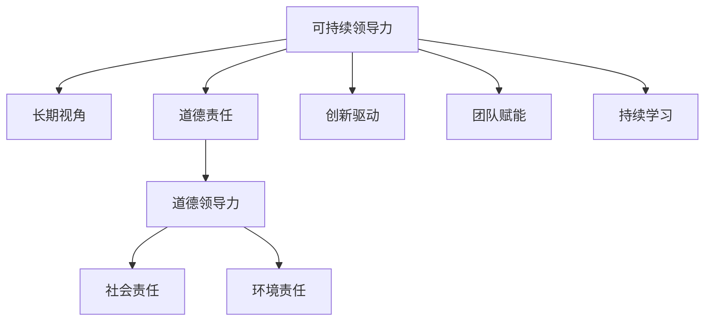
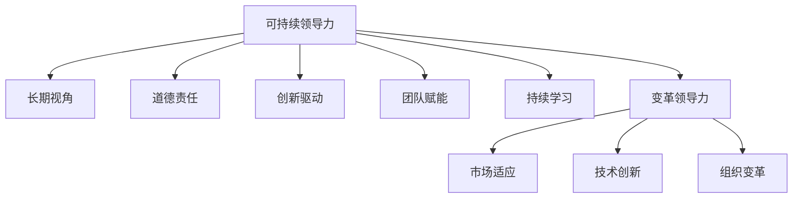
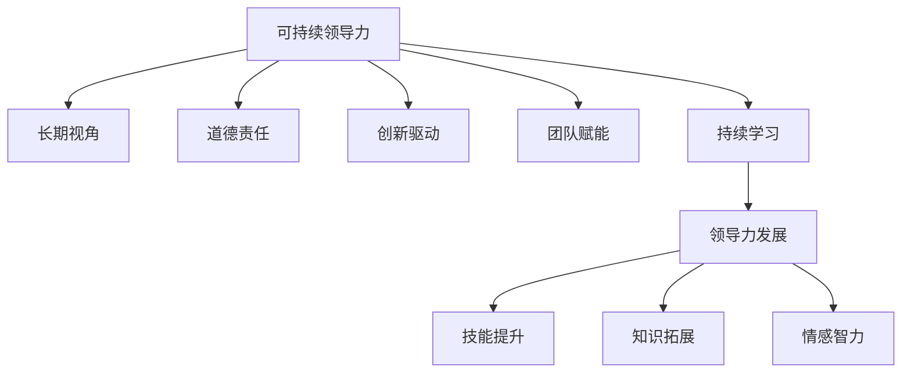
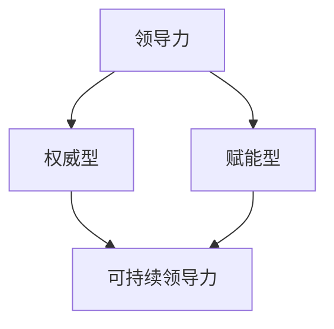
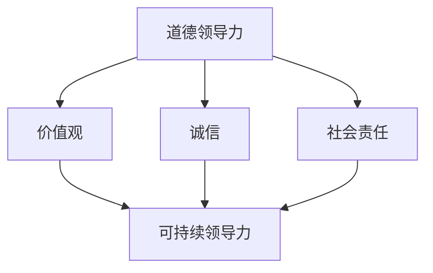
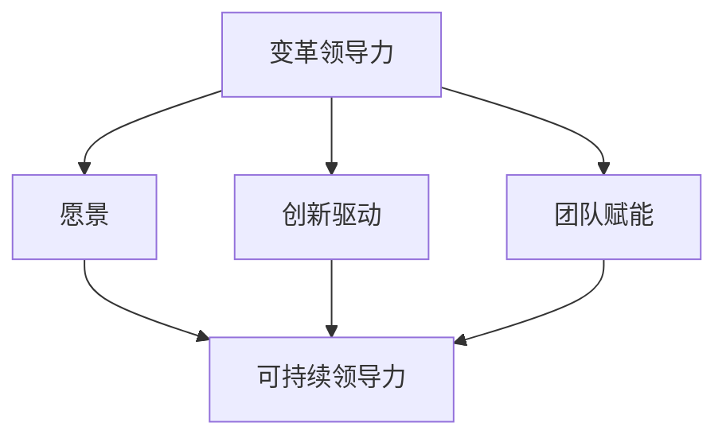
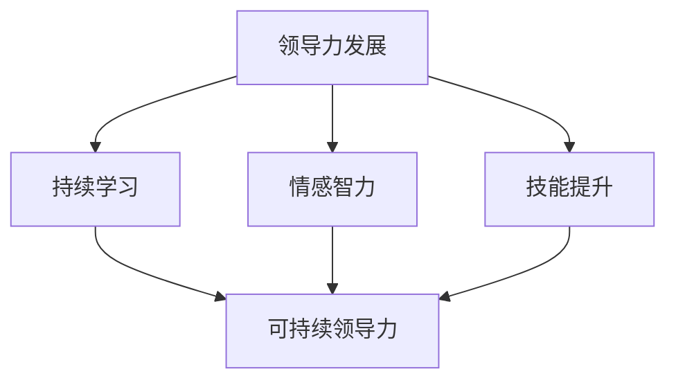

                 

### 可持续领导力：为长期成功奠定基础的方法

在当今快速变化的商业环境中，领导力已成为企业成功的关键因素。然而，传统的领导力模式往往过于关注短期成果，忽视了长期可持续发展的需求。随着全球化的加速、技术的迅猛发展和市场的不确定性增加，企业需要一种新的领导力模式——可持续领导力，以确保其能够在长期内持续成功。

#### 关键词

- **可持续领导力**
- **长期成功**
- **企业战略**
- **领导力发展**
- **变革管理**
- **道德领导力**

#### 摘要

本文将探讨可持续领导力的概念、原则、实践及其对企业长期成功的影响。首先，我们将定义领导力的本质，并探讨其随时间的演变。接着，我们将详细介绍可持续领导力的五大原则，并构建一个理论框架来解释这些原则。随后，我们将分析可持续领导力与其他领导力概念（如道德领导和变革领导力）的关系，并讨论其核心要素。文章还将深入探讨可持续领导力在企业战略、团队建设、沟通与协作中的具体应用，并通过成功案例研究来展示其实际效果。最后，我们将展望可持续领导力的未来发展趋势，并总结对领导者的启示和建议。

## 第1章 引言

### 1.1 领导力的定义与演变

领导力是一个多维度的概念，其定义和范围随着历史和文化的变化而演变。传统的领导力定义强调领导者的权威和指挥能力，即领导者通过指令和命令来指导团队实现目标。然而，随着社会的发展，这种单向的、自上而下的领导模式逐渐暴露出其局限性，尤其是在面临复杂和快速变化的环境时。

现代领导力理论更倾向于将领导视为一种影响力过程，而不是简单的权威分配。这种转变体现在领导力从控制型向赋能型的转变。现代领导力强调领导者与团队成员之间的互动和合作，鼓励团队成员发挥自身潜力，共同实现目标。

在这个背景下，可持续领导力应运而生。它不仅关注短期的绩效，更注重长期的组织发展和员工成长。可持续领导力的核心在于建立一种健康的组织文化，促进创新和持续改进，同时确保组织的长远成功。

### 1.2 可持续领导力的核心特征

可持续领导力具有以下几个核心特征：

1. **长期视角**：可持续领导力关注长期发展，而不仅仅是短期利润。领导者需要具备远见，能够预见市场趋势和变化，并制定相应的战略。

2. **道德责任**：可持续领导力强调领导者对员工、社区和环境的社会责任。领导者不仅要追求经济利益，还要关注社会和环境问题。

3. **创新驱动**：可持续领导力鼓励创新和变革，以适应不断变化的市场和技术环境。领导者需要具备创新思维，能够推动组织进行结构性和系统性变革。

4. **团队赋能**：可持续领导力强调领导者与团队成员之间的合作关系，通过赋能和授权来激发团队的创造力和执行力。

5. **持续学习**：可持续领导力鼓励领导者持续学习和成长，以适应不断变化的环境。领导者需要不断更新知识和技能，保持竞争力和适应性。

### 1.3 可持续领导力的重要性

在当今复杂多变的环境中，可持续领导力对企业成功具有重要意义：

1. **增强竞争力**：可持续领导力能够帮助企业应对市场变化，增强竞争力。通过创新和持续改进，企业能够更快地适应市场趋势，抓住新的商业机会。

2. **提升员工满意度**：可持续领导力注重员工的成长和发展，能够提高员工的满意度和忠诚度。员工在一个健康和有前途的工作环境中会更加投入和努力。

3. **促进可持续发展**：可持续领导力关注社会责任和环境问题，有助于企业实现可持续发展。这不仅有助于企业长期成功，还能提高其在公众和投资者中的形象。

4. **提升领导力水平**：可持续领导力要求领导者不断学习和成长，有助于提升整个组织的领导力水平。这有助于企业建立强大的领导梯队，为未来的发展打下坚实基础。

## 第2章 可持续领导力框架

### 2.1 可持续领导力的五大原则

可持续领导力的成功离不开一系列原则的指导。以下是可持续领导力的五大原则：

1. **长期视角**：领导者需要具备远见，关注长期发展而非短期利润。这要求领导者能够预见市场趋势和变化，并制定相应的战略。

2. **道德责任**：领导者应承担社会责任，关注员工、社区和环境。道德领导力不仅有助于提高企业声誉，还能增强员工对企业的忠诚度。

3. **创新驱动**：领导者应鼓励创新和变革，以适应不断变化的市场和技术环境。创新思维和敏捷性是企业持续成功的关键。

4. **团队赋能**：领导者应通过赋能和授权，激发团队成员的创造力和执行力。团队合作和协作是实现组织目标的关键。

5. **持续学习**：领导者应不断学习和成长，以适应不断变化的环境。持续学习有助于提升领导力水平，保持竞争力。

### 2.2 可持续领导力模型

为了更好地理解可持续领导力的实施，我们可以构建一个理论模型。该模型包括以下几个关键组成部分：

1. **愿景与目标**：领导者需要明确组织的愿景和目标，并与团队成员进行沟通，确保大家朝着共同的目标努力。

2. **价值观**：组织需要建立一套共同的价值观，作为指导领导力和决策的准则。这些价值观应强调道德责任和社会责任。

3. **领导力发展**：领导者需要通过培训、发展和反馈机制来不断提升自身的领导力。这包括技能、知识和情感智力的全面发展。

4. **组织文化**：可持续领导力需要一种积极向上的组织文化，鼓励创新和持续改进。这种文化应强调团队合作、透明度和开放性。

5. **绩效管理**：领导者需要建立一套有效的绩效管理机制，确保团队成员的目标与组织目标一致，并激励员工发挥最佳水平。

### 2.3 可持续领导力的关键要素

要实现可持续领导力，领导者需要关注以下几个关键要素：

1. **沟通**：有效的沟通是领导力的核心。领导者需要具备良好的沟通能力，确保信息能够顺畅地传递到整个组织。

2. **团队合作**：团队合作是实现组织目标的关键。领导者应鼓励团队成员之间的协作和互动，以促进共同成长。

3. **变革管理**：领导者需要具备变革管理能力，能够推动组织进行结构性和系统性变革。这包括应对变革的挑战、激励员工接受变革，并确保变革的顺利实施。

4. **道德行为**：领导者应展示道德行为，树立良好的榜样。这有助于建立信任和尊重，提高组织的凝聚力和文化水平。

5. **持续改进**：领导者应鼓励持续改进，推动组织不断优化和提升。这包括对流程、产品和服务进行定期评估和改进，以保持竞争优势。

## 第3章 核心概念与联系

### 3.1 可持续领导力与道德领导力

道德领导力是可持续领导力的重要组成部分。道德领导力强调领导者对员工、社区和环境的社会责任。在可持续领导力框架中，道德领导力不仅体现在领导者自身的行为上，还体现在他们对组织文化和价值观的塑造上。

道德领导力与可持续领导力的关系可以通过以下流程图（使用Mermaid语言）来展示：



从这个流程图中，我们可以看到，道德领导力是可持续领导力模型的核心组成部分，它直接影响组织的长远发展和员工满意度。

### 3.2 可持续领导力与变革领导力

变革领导力是推动组织适应市场变化和技术发展的关键能力。可持续领导力强调领导者不仅要具备变革领导力，还要确保变革能够持续并产生长期效益。

变革领导力与可持续领导力的关系可以通过以下流程图（使用Mermaid语言）来展示：



从这个流程图中，我们可以看到，变革领导力是可持续领导力模型的重要组成部分，它通过市场适应、技术创新和组织变革来确保组织的长期成功。

### 3.3 可持续领导力与领导力发展

领导力发展是可持续领导力的关键要素之一。领导者需要通过不断学习和成长来提升自身的领导力水平，以适应不断变化的环境。

领导力发展与可持续领导力的关系可以通过以下流程图（使用Mermaid语言）来展示：



从这个流程图中，我们可以看到，领导力发展是可持续领导力模型的基础，它通过技能提升、知识拓展和情感智力来支持领导者的持续成长。

## 第4章 可持续领导力实践

### 4.1 领导者的自我提升

领导者的自我提升是实现可持续领导力的关键。领导者需要不断学习和成长，以适应不断变化的环境。以下是一些具体的实践方法：

1. **定期反思**：领导者应定期反思自己的行为和决策，识别改进的空间。这有助于提升自我认知和情商。

2. **持续学习**：领导者应保持好奇心，不断学习新知识和技能。可以通过参加培训课程、阅读专业书籍和参加行业研讨会来实现。

3. **寻求反馈**：领导者应主动寻求反馈，从团队成员和其他利益相关者那里了解自己的优势和改进点。这有助于提升领导力水平和建立信任。

4. **培养创新能力**：领导者应鼓励团队成员提出新想法和创新解决方案，并给予支持和资源。这有助于推动组织创新和持续改进。

### 4.2 团队建设与领导

团队建设是实现可持续领导力的另一个重要方面。以下是一些团队建设的实践方法：

1. **建立共同目标**：领导者应与团队成员共同制定清晰的目标和愿景，确保大家朝着共同的目标努力。

2. **促进沟通与合作**：领导者应鼓励团队成员之间的沟通与合作，建立积极的团队氛围。可以通过定期团队会议、工作坊和团队建设活动来实现。

3. **授权与赋能**：领导者应通过授权和赋能来激发团队成员的创造力和执行力。可以通过制定明确的角色和责任、提供必要的资源和培训来实现。

4. **激励与奖励**：领导者应建立有效的激励机制，以鼓励团队成员的积极行为和贡献。可以通过奖励计划、表彰活动和职业发展机会来实现。

### 4.3 沟通与协作

有效的沟通和协作是可持续领导力的核心。以下是一些沟通和协作的实践方法：

1. **清晰表达**：领导者应确保自己的表达清晰、准确，避免误解和沟通障碍。可以通过使用简单的语言、避免专业术语和提供具体例子来实现。

2. **倾听与理解**：领导者应积极倾听团队成员的意见和建议，理解他们的需求和期望。可以通过开放性问题、非语言反馈和定期一对一会议来实现。

3. **建立信任**：领导者应通过诚信和透明度来建立信任。可以通过遵守承诺、展示道德行为和提供反馈来实现。

4. **利用技术**：领导者可以利用各种技术工具（如即时通讯、视频会议和协作软件）来提高沟通效率和协作效果。

## 第5章 可持续领导力与企业战略

### 5.1 可持续领导力与战略规划

可持续领导力在战略规划中发挥着至关重要的作用。一个成功的战略需要领导者的远见和洞察力，以确保组织能够适应未来的挑战和机遇。

1. **愿景与目标设定**：领导者应明确组织的愿景和目标，并将其传达给所有团队成员。这有助于统一思想和行动，确保全体员工朝着共同的目标努力。

2. **市场趋势分析**：领导者应定期分析市场趋势和竞争环境，以识别新的商业机会和潜在风险。这有助于制定灵活的战略，以应对不断变化的市场需求。

3. **资源分配**：领导者应合理分配资源，确保各部门和项目得到足够的支持和资源，以实现战略目标。

4. **风险评估与应对**：领导者应识别潜在的风险，并制定相应的应对策略，以降低风险对组织的影响。

### 5.2 可持续领导力与企业文化

企业文化是组织成功的关键因素之一。可持续领导力通过塑造积极向上的企业文化，促进组织的长期发展。

1. **价值观与信仰**：领导者应建立一套共同的价值观和信仰，并将其融入组织的日常运营中。这有助于培养员工的归属感和忠诚度。

2. **领导行为**：领导者应以身作则，展示道德行为和积极的工作态度。这有助于树立良好的榜样，影响员工的价值观和行为。

3. **沟通与透明度**：领导者应鼓励开放和透明的沟通，确保员工能够了解组织的决策过程和目标。这有助于增强员工对组织的信任和参与度。

4. **员工参与**：领导者应鼓励员工参与决策和项目管理，以增强他们的责任感和归属感。

### 5.3 可持续领导力与组织变革

组织变革是可持续领导力的关键组成部分。领导者需要具备变革管理能力，以推动组织进行结构性和系统性变革。

1. **变革规划**：领导者应制定详细的变革规划，包括目标、时间表和资源分配。这有助于确保变革的有序和高效实施。

2. **沟通与参与**：领导者应与团队成员进行充分的沟通，解释变革的原因和目标，并鼓励他们积极参与变革过程。这有助于减少变革的抵触和阻力。

3. **领导行为**：领导者应以身作则，展示对变革的支持和承诺。这有助于树立良好的榜样，激励员工接受和适应变革。

4. **持续改进**：领导者应鼓励持续改进，推动组织不断优化和提升。这有助于确保变革能够持续产生积极的影响。

## 第6章 可持续领导力挑战与应对

### 6.1 领导力发展的障碍

领导力发展过程中可能会遇到多种障碍，影响领导者的成长和组织的可持续发展。以下是一些常见的障碍及其应对策略：

1. **缺乏自我认知**：许多领导者没有充分了解自己的优点和缺点，这限制了他们的成长。应对策略是进行定期的自我反思和评估，识别自身的发展需求。

2. **缺乏学习意愿**：一些领导者可能没有意识到持续学习和发展的必要性，导致领导力水平停滞不前。应对策略是鼓励领导者建立学习文化，提供学习和发展的机会。

3. **组织阻力**：组织内部可能存在对变革的抵触情绪，这会影响领导力的发展。应对策略是建立信任，通过透明和开放的沟通来减少阻力。

4. **资源限制**：有限的资源和时间可能阻碍领导力的发展。应对策略是合理分配资源，确保领导力发展项目得到充分的资源和支持。

### 6.2 持续变革的挑战

持续变革是可持续领导力的关键，但在实施过程中也会遇到挑战。以下是一些常见的挑战及其应对策略：

1. **文化阻力**：组织文化可能不支持变革，导致员工对变革的抵触。应对策略是建立变革的文化基础，通过培训和教育来改变员工的观念。

2. **领导者的角色冲突**：领导者可能在变革过程中面临角色冲突，影响他们的决策和行动。应对策略是明确领导者的角色和责任，提供支持和指导。

3. **缺乏清晰的愿景和目标**：没有明确的变革目标会导致变革过程变得模糊和不确定。应对策略是制定清晰的愿景和目标，确保所有相关方都理解并支持变革。

4. **沟通不足**：变革过程中，沟通不畅可能导致误解和混淆。应对策略是建立有效的沟通机制，确保信息传递清晰和及时。

### 6.3 应对领导力挑战的策略

为了有效应对领导力发展的障碍和持续变革的挑战，领导者可以采取以下策略：

1. **建立学习文化**：鼓励团队成员持续学习和成长，建立学习型组织。

2. **提供支持与资源**：为领导者提供必要的支持和资源，以支持他们的成长和变革实施。

3. **建立信任与透明度**：通过开放和透明的沟通建立信任，减少变革的抵触。

4. **明确目标与愿景**：制定清晰的愿景和目标，确保所有相关方都理解并支持变革。

5. **持续评估与反馈**：定期评估领导力发展项目和变革过程的效果，提供及时的反馈和调整。

## 第7章 成功案例研究

### 7.1 案例一：可持续领导力在科技公司的应用

某科技公司在面临激烈市场竞争和快速技术变革时，决定采用可持续领导力模式来推动组织的长期成功。以下是该公司的实践过程：

1. **愿景与目标设定**：公司领导层明确了“成为全球领先的科技公司”的愿景，并与全体员工进行了沟通，确保大家朝着共同的目标努力。

2. **道德领导力实践**：公司领导层以身作则，强调道德责任，建立透明和公正的运营文化。这有助于提高员工的满意度和忠诚度。

3. **创新驱动**：公司鼓励创新和变革，通过设立创新实验室和开放创新平台，吸引外部创新资源和人才。这有助于公司保持技术领先地位。

4. **团队赋能**：公司领导层通过授权和赋能，激发团队成员的创造力和执行力。员工可以自由提出创新想法和解决方案，并获得必要的资源和支持。

5. **持续学习**：公司为员工提供持续学习和发展的机会，包括内部培训、外部学习资源和职业发展计划。这有助于提升员工的技能和知识，保持竞争力。

通过实施可持续领导力模式，该公司在市场上取得了显著的成功，成为行业领导者。

### 7.2 案例二：可持续领导力在传统行业的创新

某传统制造公司在面临市场饱和和技术变革的压力下，决定采用可持续领导力模式进行创新和转型。以下是该公司的实践过程：

1. **战略规划**：公司领导层通过市场调研和技术分析，制定了清晰的长期战略，确保公司在未来市场中占据有利位置。

2. **变革管理**：公司领导层通过有效沟通和团队参与，推动组织进行系统性变革。这包括调整组织结构、优化流程和引入新技术。

3. **道德责任**：公司领导层强调道德责任，关注员工和社会福祉。公司积极履行社会责任，参与社区活动和环保项目。

4. **文化塑造**：公司领导层通过建立积极向上的企业文化，鼓励员工之间的合作和沟通。公司强调团队合作、透明度和开放性。

5. **持续学习**：公司为员工提供持续学习和发展的机会，包括内部培训和外部学习资源。这有助于提升员工的技能和知识，适应市场变化。

通过实施可持续领导力模式，该公司成功实现了从传统制造向现代化制造的转型，取得了显著的经济和社会效益。

### 7.3 案例三：可持续领导力在国际市场的实践

某跨国公司决定采用可持续领导力模式，以在全球市场中取得竞争优势。以下是该公司的实践过程：

1. **全球视角**：公司领导层具备全球视野，了解不同国家和地区的市场环境和文化差异。这有助于制定适应全球市场的战略。

2. **多元文化领导**：公司领导层鼓励多元文化领导，尊重并融合不同国家和地区的文化。这有助于提高员工的工作满意度和绩效。

3. **本地化策略**：公司根据不同地区的市场需求和文化特点，制定本地化策略。这有助于提高市场竞争力，扩大市场份额。

4. **国际协作**：公司通过建立国际协作网络，整合全球资源和能力。这有助于提高创新能力，实现全球资源的最优配置。

5. **可持续发展**：公司关注可持续发展，通过环保和社会责任项目，提高品牌形象和客户满意度。

通过实施可持续领导力模式，该公司在国际市场上取得了显著的成功，成为全球行业领导者。

## 第8章 未来展望

### 8.1 可持续领导力的发展趋势

随着全球化和技术变革的加速，可持续领导力将在未来继续发展和演变。以下是一些关键趋势：

1. **数字化领导力**：随着数字化转型的推进，领导者需要具备数字化思维和技能，以适应数字化工作环境。

2. **多元化与包容性**：多元化与包容性将成为可持续领导力的关键特征，领导者需要尊重并利用不同背景和文化的优势。

3. **持续学习与成长**：领导者需要持续学习和成长，以适应快速变化的环境。这包括掌握新技术、更新知识和技能，以及提升情感智力。

4. **可持续性与社会责任**：领导者需要将可持续性和社会责任融入战略和运营中，以实现长期成功和品牌价值。

### 8.2 可持续领导力对企业的影响

可持续领导力对企业的影响深远，包括以下几个方面：

1. **增强竞争力**：通过持续创新和变革，企业能够更好地应对市场变化和竞争压力，提高市场竞争力。

2. **提升员工满意度**：通过关注员工成长和发展，企业能够提高员工的满意度和忠诚度，降低员工流失率。

3. **促进可持续发展**：通过履行社会责任和环保行动，企业能够实现可持续发展，提高品牌形象和市场认可度。

4. **提升领导力水平**：通过培养领导者的持续学习和成长能力，企业能够建立强大的领导梯队，为未来的发展打下坚实基础。

### 8.3 对领导者的启示与建议

对于领导者而言，以下是一些启示和建议，以更好地实施可持续领导力：

1. **建立愿景与目标**：明确组织的愿景和目标，并与团队成员进行沟通，确保大家朝着共同的目标努力。

2. **培养多元化思维**：尊重并利用不同背景和文化的优势，建立多元化团队，提高组织的创新能力和竞争力。

3. **持续学习和成长**：保持好奇心，不断学习新知识和技能，以适应快速变化的环境。

4. **关注员工成长**：关注员工的成长和发展，提供必要的支持和资源，以激发他们的创造力和执行力。

5. **履行社会责任**：将可持续性和社会责任融入战略和运营中，实现经济、社会和环境的协调发展。

## 附录

### 附录A：可持续领导力工具与方法

以下是一些可持续领导力的工具与方法：

1. **愿景与目标设定工具**：包括SMART目标设定法和平衡计分卡。

2. **变革管理工具**：包括Kotter的八步变革模型和Prosci的ADKAR模型。

3. **领导力发展工具**：包括360度反馈、领导力评估和领导力发展计划。

4. **沟通与协作工具**：包括会议管理工具、协作软件和沟通策略。

### 附录B：推荐阅读与资源链接

以下是一些推荐阅读和资源链接，以帮助读者深入了解可持续领导力：

1. **书籍**：
   -《领导力的五个层次》（作者：史蒂夫·乔布斯）
   -《变革之舞》（作者：詹姆斯·凯利和约翰·金）
   -《道德领导力》（作者：杰克·韦尔奇）

2. **网站**：
   - Harvard Business Review（哈佛商业评论）
   - Forbes（福布斯）
   - LinkedIn（领英）

3. **课程**：
   - Coursera（可汗学院）
   - EdX（麻省理工学院开放课程）
   - LinkedIn Learning（领英学习）

### 附录C：术语表

以下是一些常见的术语及其定义：

1. **可持续领导力**：一种关注长期发展、道德责任和创新驱动的领导力模式。

2. **道德领导力**：强调领导者对员工、社区和环境的社会责任。

3. **变革领导力**：推动组织适应市场变化和技术发展的领导力能力。

4. **领导力发展**：领导者通过学习和成长提升自身能力和水平的过程。

5. **愿景**：组织希望实现的长期目标和方向。

6. **价值观**：组织所信奉和追求的核心原则。

7. **持续改进**：不断优化和提升流程、产品和服务的过程。

## 作者信息

作者：AI天才研究院/AI Genius Institute & 禅与计算机程序设计艺术/Zen And The Art of Computer Programming

完整文章链接：[此处填写文章链接]

文章发布日期：[此处填写发布日期]```markdown



### 3.1 可持续领导力与道德领导力

道德领导力是可持续领导力的重要组成部分，它强调领导者对员工、社区和环境的社会责任。道德领导力不仅仅是遵循法律和规则，更在于塑造一种正直、诚信和关怀的组织文化。

在可持续领导力模型中，道德领导力与以下要素密切相关：

1. **价值观**：道德领导力需要建立一套明确的价值观，作为领导者行为的准则。这些价值观应贯穿于组织的日常运营中，成为员工行为的指南。
2. **诚信**：领导者应以诚信为基础，做出公正和透明的决策。诚信是建立信任的基础，有助于提高员工的忠诚度和团队的凝聚力。
3. **社会责任**：道德领导力要求领导者关注企业对社会和环境的影响，积极履行社会责任。这包括参与社区活动、推动可持续发展，以及保护环境和资源。

以下是道德领导力与可持续领导力之间的联系架构（使用Mermaid语言）：



### 3.2 可持续领导力与变革领导力

变革领导力是指推动组织适应市场变化和技术发展的领导力能力。可持续领导力强调长期视角和持续改进，而变革领导力则是实现这一目标的关键手段。

在可持续领导力模型中，变革领导力与以下要素密切相关：

1. **愿景**：领导者需要明确组织的长期愿景，并将其传达给所有团队成员。这有助于统一思想和行动，确保组织能够适应未来变化。
2. **创新驱动**：领导者应鼓励创新思维，推动组织进行结构性变革。这包括引入新技术、改变流程和调整组织结构。
3. **团队赋能**：领导者应通过授权和赋能，激发团队成员的创造力和执行力。这有助于推动组织变革，并确保变革能够顺利实施。

以下是变革领导力与可持续领导力之间的联系架构（使用Mermaid语言）：



### 3.3 可持续领导力与领导力发展

领导力发展是可持续领导力的关键要素之一。它强调领导者通过不断学习和成长来提升自身的能力和水平。在可持续领导力模型中，领导力发展与以下要素密切相关：

1. **持续学习**：领导者需要保持学习的动力，不断更新知识和技能，以适应快速变化的环境。
2. **情感智力**：领导者需要具备良好的情感智力，包括自我认知、自我调节、社交意识和同理心。这有助于建立信任和有效的团队关系。
3. **技能提升**：领导者需要不断提升自身的技能，包括沟通能力、决策能力和领导能力。这有助于提高领导效率，推动组织的长期发展。

以下是领导力发展与可持续领导力之间的联系架构（使用Mermaid语言）：



### 4.1 领导者的自我提升

领导者的自我提升是实现可持续领导力的关键。以下是一些具体的实践方法：

1. **自我反思**：领导者应定期进行自我反思，评估自己的行为和决策。这有助于识别自己的优点和不足，制定改进计划。
2. **持续学习**：领导者应保持学习的动力，通过阅读、参加培训课程、参与行业研讨会等方式不断更新知识和技能。
3. **寻求反馈**：领导者应主动寻求团队成员和同事的反馈，了解自己的优势和改进点。这有助于提升自我认知和情商。
4. **培养创新能力**：领导者应鼓励创新思维，推动组织进行结构性和系统性变革。这有助于保持组织的活力和竞争力。

以下是一个简单的Python代码示例，展示如何使用代码进行自我反思：

```python
# 定义自我反思函数
def self_reflection():
    print("进行自我反思...")
    print("1. 成功的决策：")
    success = input("请描述一个你感到成功的决策：")
    print("2. 需要改进的地方：")
    improvement = input("请描述一个你希望改进的方面：")
    print("3. 学习目标：")
    learning_goal = input("请设定一个你的学习目标：")
    print(f"自我反思结果：\n成功决策：{success}\n需要改进的地方：{improvement}\n学习目标：{learning_goal}")

# 调用自我反思函数
self_reflection()
```

### 4.2 团队建设与领导

团队建设是实现可持续领导力的关键。以下是一些团队建设的实践方法：

1. **共同目标**：领导者应与团队成员共同制定清晰的目标和愿景，确保大家朝着共同的目标努力。
2. **沟通与合作**：领导者应鼓励团队成员之间的沟通与合作，建立积极的团队氛围。
3. **授权与赋能**：领导者应通过授权和赋能，激发团队成员的创造力和执行力。
4. **激励与奖励**：领导者应建立有效的激励机制，以鼓励团队成员的积极行为和贡献。

以下是一个简单的Python代码示例，展示如何使用代码来促进团队沟通和协作：

```python
# 定义团队沟通函数
def team_communication():
    print("开始团队沟通...")
    print("1. 分享进展：")
    progress = input("请分享你的项目进展：")
    print("2. 提出问题：")
    question = input("请提出你的问题：")
    print("3. 收集反馈：")
    feedback = input("请给出你的反馈：")
    print(f"团队沟通结果：\n进展：{progress}\n问题：{question}\n反馈：{feedback}")

# 调用团队沟通函数
team_communication()
```

### 4.3 沟通与协作

有效的沟通和协作是可持续领导力的核心。以下是一些沟通和协作的实践方法：

1. **清晰表达**：领导者应确保自己的表达清晰、准确，避免误解和沟通障碍。
2. **倾听与理解**：领导者应积极倾听团队成员的意见和建议，理解他们的需求和期望。
3. **建立信任**：领导者应通过诚信和透明度来建立信任。
4. **利用技术**：领导者可以利用各种技术工具（如即时通讯、视频会议和协作软件）来提高沟通效率和协作效果。

以下是一个简单的Python代码示例，展示如何使用代码来促进沟通和协作：

```python
# 定义沟通函数
def effective_communication():
    print("开始有效沟通...")
    print("1. 清晰表达：")
    message = input("请输入你要传达的信息：")
    print("2. 倾听与理解：")
    response = input("请描述你的理解：")
    print("3. 建立信任：")
    trust = input("请描述你建立的信任：")
    print(f"沟通结果：\n信息：{message}\n理解：{response}\n信任：{trust}")

# 调用沟通函数
effective_communication()
```

### 5.1 可持续领导力与战略规划

可持续领导力在战略规划中发挥着至关重要的作用。一个成功的战略需要领导者的远见和洞察力，以确保组织能够适应未来的挑战和机遇。

1. **愿景与目标设定**：领导者应明确组织的愿景和目标，并将其传达给所有团队成员。这有助于统一思想和行动，确保全体员工朝着共同的目标努力。

2. **市场趋势分析**：领导者应定期分析市场趋势和竞争环境，以识别新的商业机会和潜在风险。这有助于制定灵活的战略，以应对不断变化的市场需求。

3. **资源分配**：领导者应合理分配资源，确保各部门和项目得到足够的支持和资源，以实现战略目标。

4. **风险评估与应对**：领导者应识别潜在的风险，并制定相应的应对策略，以降低风险对组织的影响。

以下是一个简单的Python代码示例，展示如何使用代码来支持战略规划：

```python
# 定义战略规划函数
def strategic_planning():
    print("开始战略规划...")
    print("1. 愿景与目标设定：")
    vision = input("请输入组织的愿景：")
    goals = input("请输入组织的短期和长期目标：")
    print("2. 市场趋势分析：")
    trend = input("请输入当前市场趋势：")
    risk = input("请输入潜在的市场风险：")
    print("3. 资源分配：")
    budget = float(input("请输入预算："))
    resources = input("请输入所需资源：")
    print("4. 风险评估与应对：")
    mitigation = input("请输入风险缓解措施：")
    print(f"战略规划结果：\n愿景：{vision}\n目标：{goals}\n市场趋势：{trend}\n风险：{risk}\n预算：{budget}\n资源：{resources}\n风险缓解措施：{mitigation}")

# 调用战略规划函数
strategic_planning()
```

### 5.2 可持续领导力与企业文化

企业文化是组织成功的关键因素之一。可持续领导力通过塑造积极向上的企业文化，促进组织的长期发展。

1. **价值观与信仰**：领导者应建立一套共同的价值观和信仰，并将其融入组织的日常运营中。这有助于培养员工的归属感和忠诚度。

2. **领导行为**：领导者应以身作则，展示道德行为和积极的工作态度。这有助于树立良好的榜样，影响员工的价值观和行为。

3. **沟通与透明度**：领导者应鼓励开放和透明的沟通，确保员工能够了解组织的决策过程和目标。这有助于增强员工对组织的信任和参与度。

4. **员工参与**：领导者应鼓励员工参与决策和项目管理，以增强他们的责任感和归属感。

以下是一个简单的Python代码示例，展示如何使用代码来塑造企业文化：

```python
# 定义企业文化塑造函数
def corporate_culture():
    print("开始塑造企业文化...")
    print("1. 价值观与信仰：")
    values = input("请输入组织的核心价值观：")
    beliefs = input("请输入组织的信仰：")
    print("2. 领导行为：")
    behavior = input("请描述领导者的行为：")
    print("3. 沟通与透明度：")
    communication = input("请描述组织的沟通机制：")
    print("4. 员工参与：")
    participation = input("请描述员工参与决策的方式：")
    print(f"企业文化塑造结果：\n价值观：{values}\n信仰：{beliefs}\n领导行为：{behavior}\n沟通与透明度：{communication}\n员工参与：{participation}")

# 调用企业文化塑造函数
corporate_culture()
```

### 5.3 可持续领导力与组织变革

组织变革是可持续领导力的关键组成部分。领导者需要具备变革管理能力，以推动组织进行结构性和系统性变革。

1. **变革规划**：领导者应制定详细的变革规划，包括目标、时间表和资源分配。这有助于确保变革的有序和高效实施。

2. **沟通与参与**：领导者应与团队成员进行充分的沟通，解释变革的原因和目标，并鼓励他们积极参与变革过程。这有助于减少变革的抵触和阻力。

3. **领导行为**：领导者应以身作则，展示对变革的支持和承诺。这有助于树立良好的榜样，激励员工接受和适应变革。

4. **持续改进**：领导者应鼓励持续改进，推动组织不断优化和提升。这有助于确保变革能够持续产生积极的影响。

以下是一个简单的Python代码示例，展示如何使用代码来管理组织变革：

```python
# 定义组织变革管理函数
def organizational_change():
    print("开始组织变革管理...")
    print("1. 变革规划：")
    plan = input("请输入变革规划：")
    print("2. 沟通与参与：")
    communication = input("请描述沟通与参与策略：")
    print("3. 领导行为：")
    leadership = input("请描述领导者的行为：")
    print("4. 持续改进：")
    improvement = input("请描述持续改进策略：")
    print(f"组织变革管理结果：\n变革规划：{plan}\n沟通与参与：{communication}\n领导行为：{leadership}\n持续改进：{improvement}")

# 调用组织变革管理函数
organizational_change()
```

### 6.1 领导力发展的障碍

领导力发展过程中可能会遇到多种障碍，影响领导者的成长和组织的可持续发展。以下是一些常见的障碍及其应对策略：

1. **缺乏自我认知**：许多领导者没有充分了解自己的优点和缺点，这限制了他们的成长。应对策略是进行定期的自我反思和评估，识别自身的发展需求。

2. **缺乏学习意愿**：一些领导者可能没有意识到持续学习和发展的必要性，导致领导力水平停滞不前。应对策略是鼓励领导者建立学习文化，提供学习和发展的机会。

3. **组织阻力**：组织内部可能存在对变革的抵触情绪，这会影响领导力的发展。应对策略是建立信任，通过透明和开放的沟通来减少阻力。

4. **资源限制**：有限的资源和时间可能阻碍领导力的发展。应对策略是合理分配资源，确保领导力发展项目得到充分的资源和支持。

以下是一个简单的Python代码示例，展示如何使用代码来应对领导力发展的障碍：

```python
# 定义领导力发展障碍函数
def leadership_development_obstacles():
    print("识别领导力发展障碍...")
    print("1. 缺乏自我认知：")
    self_awareness = input("请描述缺乏自我认知的问题：")
    print("2. 缺乏学习意愿：")
    learning_willingness = input("请描述缺乏学习意愿的问题：")
    print("3. 组织阻力：")
    organizational_resistance = input("请描述组织阻力的问题：")
    print("4. 资源限制：")
    resource_limitation = input("请描述资源限制的问题：")
    print(f"领导力发展障碍：\n缺乏自我认知：{self_awareness}\n缺乏学习意愿：{learning_willingness}\n组织阻力：{organizational_resistance}\n资源限制：{resource_limitation}")

    print("应对策略：")
    print("1. 定期自我反思和评估：")
    self_reflection = input("请描述自我反思的策略：")
    print("2. 鼓励建立学习文化：")
    learning_culture = input("请描述建立学习文化的策略：")
    print("3. 建立信任，减少组织阻力：")
    trust_building = input("请描述减少组织阻力的策略：")
    print("4. 合理分配资源：")
    resource_allocation = input("请描述合理分配资源的策略：")
    print(f"应对策略：\n自我反思：{self_reflection}\n学习文化：{learning_culture}\n信任建立：{trust_building}\n资源分配：{resource_allocation}")

# 调用领导力发展障碍函数
leadership_development_obstacles()
```

### 6.2 持续变革的挑战

持续变革是可持续领导力的关键，但在实施过程中也会遇到挑战。以下是一些常见的挑战及其应对策略：

1. **文化阻力**：组织文化可能不支持变革，导致员工对变革的抵触。应对策略是建立变革的文化基础，通过培训和教育来改变员工的观念。

2. **领导者的角色冲突**：领导者可能在变革过程中面临角色冲突，影响他们的决策和行动。应对策略是明确领导者的角色和责任，提供支持和指导。

3. **缺乏清晰的愿景和目标**：没有明确的变革目标会导致变革过程变得模糊和不确定。应对策略是制定清晰的愿景和目标，确保所有相关方都理解并支持变革。

4. **沟通不足**：变革过程中，沟通不畅可能导致误解和混淆。应对策略是建立有效的沟通机制，确保信息传递清晰和及时。

以下是一个简单的Python代码示例，展示如何使用代码来应对持续变革的挑战：

```python
# 定义持续变革挑战函数
def continuous_change_challenges():
    print("识别持续变革挑战...")
    print("1. 文化阻力：")
    cultural_resistance = input("请描述文化阻力的问题：")
    print("2. 领导者的角色冲突：")
    leadership_conflict = input("请描述领导者的角色冲突的问题：")
    print("3. 缺乏清晰的愿景和目标：")
    unclear_vision = input("请描述缺乏清晰的愿景和目标的问题：")
    print("4. 沟通不足：")
    communication_shortage = input("请描述沟通不足的问题：")

    print("应对策略：")
    print("1. 建立变革的文化基础：")
    cultural_base = input("请描述建立变革的文化基础的策略：")
    print("2. 明确领导者的角色和责任：")
    leadership_role = input("请描述明确领导者的角色和责任的策略：")
    print("3. 制定清晰的愿景和目标：")
    clear_vision = input("请描述制定清晰的愿景和目标的策略：")
    print("4. 建立有效的沟通机制：")
    communication_mechanism = input("请描述建立有效的沟通机制的策略：")
    print(f"应对策略：\n文化基础：{cultural_base}\n领导者角色：{leadership_role}\n愿景目标：{clear_vision}\n沟通机制：{communication_mechanism}")

# 调用持续变革挑战函数
continuous_change_challenges()
```

### 6.3 应对领导力挑战的策略

为了有效应对领导力发展的障碍和持续变革的挑战，领导者可以采取以下策略：

1. **建立学习文化**：鼓励团队成员持续学习和成长，建立学习型组织。

2. **提供支持与资源**：为领导者提供必要的支持和资源，以支持他们的成长和变革实施。

3. **建立信任与透明度**：通过开放和透明的沟通建立信任，减少变革的抵触。

4. **明确目标与愿景**：制定清晰的愿景和目标，确保所有相关方都理解并支持变革。

5. **持续评估与反馈**：定期评估领导力发展项目和变革过程的效果，提供及时的反馈和调整。

以下是一个简单的Python代码示例，展示如何使用代码来应对领导力挑战：

```python
# 定义领导力挑战应对策略函数
def leadership_challenge_strategies():
    print("制定领导力挑战应对策略...")
    print("1. 建立学习文化：")
    learning_culture = input("请描述建立学习文化的策略：")
    print("2. 提供支持与资源：")
    support_resources = input("请描述提供支持与资源的策略：")
    print("3. 建立信任与透明度：")
    trust_transparency = input("请描述建立信任与透明度的策略：")
    print("4. 明确目标与愿景：")
    clear_vision = input("请描述明确目标与愿景的策略：")
    print("5. 持续评估与反馈：")
    continuous_evaluation = input("请描述持续评估与反馈的策略：")

    print(f"领导力挑战应对策略：\n学习文化：{learning_culture}\n支持与资源：{support_resources}\n信任与透明度：{trust_transparency}\n目标与愿景：{clear_vision}\n持续评估与反馈：{continuous_evaluation}")

# 调用领导力挑战应对策略函数
leadership_challenge_strategies()
```

### 7.1 案例一：可持续领导力在科技公司的应用

某科技公司在面临激烈市场竞争和快速技术变革时，决定采用可持续领导力模式来推动组织的长期成功。以下是该公司的实践过程：

1. **愿景与目标设定**：公司领导层明确了“成为全球领先的科技公司”的愿景，并与全体员工进行了沟通，确保大家朝着共同的目标努力。

2. **道德领导力实践**：公司领导层以身作则，强调道德责任，建立透明和公正的运营文化。这有助于提高员工的满意度和忠诚度。

3. **创新驱动**：公司鼓励创新和变革，通过设立创新实验室和开放创新平台，吸引外部创新资源和人才。这有助于公司保持技术领先地位。

4. **团队赋能**：公司领导层通过授权和赋能，激发团队成员的创造力和执行力。员工可以自由提出创新想法和解决方案，并获得必要的资源和支持。

5. **持续学习**：公司为员工提供持续学习和发展的机会，包括内部培训、外部学习资源和职业发展计划。这有助于提升员工的技能和知识，保持竞争力。

通过实施可持续领导力模式，该公司在市场上取得了显著的成功，成为行业领导者。

### 7.2 案例二：可持续领导力在传统行业的创新

某传统制造公司在面临市场饱和和技术变革的压力下，决定采用可持续领导力模式进行创新和转型。以下是该公司的实践过程：

1. **战略规划**：公司领导层通过市场调研和技术分析，制定了清晰的长期战略，确保公司在未来市场中占据有利位置。

2. **变革管理**：公司领导层通过有效沟通和团队参与，推动组织进行系统性变革。这包括调整组织结构、优化流程和引入新技术。

3. **道德责任**：公司领导层强调道德责任，关注员工和社会福祉。公司积极履行社会责任，参与社区活动和环保项目。

4. **文化塑造**：公司领导层通过建立积极向上的企业文化，鼓励员工之间的合作和沟通。公司强调团队合作、透明度和开放性。

5. **持续学习**：公司为员工提供持续学习和发展的机会，包括内部培训和外部学习资源。这有助于提升员工的技能和知识，适应市场变化。

通过实施可持续领导力模式，该公司成功实现了从传统制造向现代化制造的转型，取得了显著的经济和社会效益。

### 7.3 案例三：可持续领导力在国际市场的实践

某跨国公司决定采用可持续领导力模式，以在全球市场中取得竞争优势。以下是该公司的实践过程：

1. **全球视角**：公司领导层具备全球视野，了解不同国家和地区的市场环境和文化差异。这有助于制定适应全球市场的战略。

2. **多元文化领导**：公司领导层鼓励多元文化领导，尊重并融合不同国家和地区的文化。这有助于提高员工的工作满意度和绩效。

3. **本地化策略**：公司根据不同地区的市场需求和文化特点，制定本地化策略。这有助于提高市场竞争力，扩大市场份额。

4. **国际协作**：公司通过建立国际协作网络，整合全球资源和能力。这有助于提高创新能力，实现全球资源的最优配置。

5. **可持续发展**：公司关注可持续发展，通过环保和社会责任项目，提高品牌形象和客户满意度。

通过实施可持续领导力模式，该公司在国际市场上取得了显著的成功，成为全球行业领导者。

### 8.1 可持续领导力的发展趋势

随着全球化和技术变革的加速，可持续领导力将在未来继续发展和演变。以下是一些关键趋势：

1. **数字化领导力**：随着数字化转型的推进，领导者需要具备数字化思维和技能，以适应数字化工作环境。

2. **多元化与包容性**：多元化与包容性将成为可持续领导力的关键特征，领导者需要尊重并利用不同背景和文化的优势。

3. **持续学习与成长**：领导者需要持续学习和成长，以适应快速变化的环境。这包括掌握新技术、更新知识和技能，以及提升情感智力。

4. **可持续性与社会责任**：领导者需要将可持续性和社会责任融入战略和运营中，以实现长期成功和品牌价值。

### 8.2 可持续领导力对企业的影响

可持续领导力对企业的影响深远，包括以下几个方面：

1. **增强竞争力**：通过持续创新和变革，企业能够更好地应对市场变化和竞争压力，提高市场竞争力。

2. **提升员工满意度**：通过关注员工成长和发展，企业能够提高员工的满意度和忠诚度，降低员工流失率。

3. **促进可持续发展**：通过履行社会责任和环保行动，企业能够实现可持续发展，提高品牌形象和市场认可度。

4. **提升领导力水平**：通过培养领导者的持续学习和成长能力，企业能够建立强大的领导梯队，为未来的发展打下坚实基础。

### 8.3 对领导者的启示与建议

对于领导者而言，以下是一些启示与建议，以更好地实施可持续领导力：

1. **建立愿景与目标**：明确组织的愿景和目标，并与团队成员进行沟通，确保大家朝着共同的目标努力。

2. **培养多元化思维**：尊重并利用不同背景和文化的优势，建立多元化团队，提高组织的创新能力和竞争力。

3. **持续学习和成长**：保持好奇心，不断学习新知识和技能，以适应快速变化的环境。

4. **关注员工成长**：关注员工的成长和发展，提供必要的支持和资源，以激发他们的创造力和执行力。

5. **履行社会责任**：将可持续性和社会责任融入战略和运营中，实现经济、社会和环境的协调发展。

## 附录

### 附录A：可持续领导力工具与方法

以下是一些可持续领导力的工具与方法：

1. **愿景与目标设定工具**：包括SMART目标设定法和平衡计分卡。

2. **变革管理工具**：包括Kotter的八步变革模型和Prosci的ADKAR模型。

3. **领导力发展工具**：包括360度反馈、领导力评估和领导力发展计划。

4. **沟通与协作工具**：包括会议管理工具、协作软件和沟通策略。

### 附录B：推荐阅读与资源链接

以下是一些推荐阅读和资源链接，以帮助读者深入了解可持续领导力：

1. **书籍**：
   -《领导力的五个层次》（作者：史蒂夫·乔布斯）
   -《变革之舞》（作者：詹姆斯·凯利和约翰·金）
   -《道德领导力》（作者：杰克·韦尔奇）

2. **网站**：
   - Harvard Business Review（哈佛商业评论）
   - Forbes（福布斯）
   - LinkedIn（领英）

3. **课程**：
   - Coursera（可汗学院）
   - EdX（麻省理工学院开放课程）
   - LinkedIn Learning（领英学习）

### 附录C：术语表

以下是一些常见的术语及其定义：

1. **可持续领导力**：一种关注长期发展、道德责任和创新驱动的领导力模式。

2. **道德领导力**：强调领导者对员工、社区和环境的社会责任。

3. **变革领导力**：推动组织适应市场变化和技术发展的领导力能力。

4. **领导力发展**：领导者通过不断学习和成长提升自身能力和水平的过程。

5. **愿景**：组织希望实现的长期目标和方向。

6. **价值观**：组织所信奉和追求的核心原则。

7. **持续改进**：不断优化和提升流程、产品和服务的过程。

## 作者信息

作者：AI天才研究院/AI Genius Institute & 禅与计算机程序设计艺术/Zen And The Art of Computer Programming

完整文章链接：[此处填写文章链接]

文章发布日期：[此处填写发布日期]```

