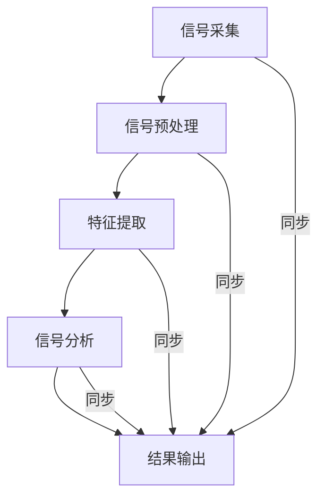

                 

### 文章标题

《可穿戴设备的生理信号处理：健康监测的数学工具》

### 关键词

- 可穿戴设备
- 生理信号处理
- 健康监测
- 数学工具
- 机器学习
- 统计学方法

### 摘要

本文深入探讨了可穿戴设备在生理信号处理和健康监测中的应用。首先，介绍了可穿戴设备的定义、分类及其在健康监测中的重要性。接着，详细阐述了生理信号处理的基本概念、方法和技术，包括信号采集、预处理、特征提取和健康状态评估。本文还重点介绍了用于生理信号处理的数学工具，如统计学方法、信号处理算法和机器学习技术。最后，通过实际项目和案例分析，展示了如何将数学工具应用于可穿戴设备中的生理信号处理，并提供了一些最佳实践和拓展阅读建议，以推动该领域的研究和发展。

## 引言与概述

可穿戴设备作为一种新兴的智能设备，已经逐渐融入人们的日常生活。它们不仅提供便捷的生活服务，还具备健康监测功能，成为现代人健康管理的重要工具。可穿戴设备通过传感器采集用户的生理信号，如心率、血压、血氧饱和度等，结合先进的数学工具和方法，对生理信号进行处理和分析，实现对用户健康状况的实时监测和评估。

### 可穿戴设备的定义与发展

可穿戴设备（Wearable Devices）是指直接附着在人体或佩戴在衣物上的电子设备，它们能够收集、传输和处理数据，以提供各种功能。早期的可穿戴设备主要是一些简单的健身追踪器和手表，如苹果的iWatch和小米手环。随着技术的进步，现代可穿戴设备的功能日益强大，不仅能够实时监测用户的生理信号，还能进行智能分析，提供个性化的健康建议。

可穿戴设备的发展经历了几个关键阶段：

1. **早期探索阶段**：20世纪90年代，科学家和工程师开始探索可穿戴设备的可能性，主要集中在运动追踪和睡眠监测。

2. **功能扩展阶段**：21世纪初，随着微电子技术和无线通信技术的发展，可穿戴设备的功能逐渐扩展，开始能够监测更复杂的生理信号，如心率、血压等。

3. **智能化阶段**：近年来，随着人工智能和大数据技术的兴起，可穿戴设备变得更加智能化，能够通过机器学习算法对生理信号进行分析，提供更精准的健康监测和预测。

### 生理信号处理的重要性

生理信号处理是可穿戴设备的核心技术之一，它的重要性体现在以下几个方面：

1. **健康监测**：通过准确采集和分析生理信号，可穿戴设备可以及时发现用户的健康问题，如心率异常、血压升高、睡眠质量下降等，为用户提供及时的医疗建议。

2. **疾病预防**：长期监测用户的生理信号，可以帮助医生预测疾病风险，采取预防措施，降低患病率。

3. **个性化医疗**：通过分析用户的生理信号数据，可穿戴设备可以为用户提供个性化的健康方案，提高治疗效果。

4. **生活方式改善**：生理信号处理技术可以帮助用户了解自己的身体状况，鼓励他们采取健康的生活方式，如合理饮食、适量运动等。

### 数学工具在健康监测中的应用

数学工具在生理信号处理和健康监测中起着至关重要的作用。以下是一些主要的数学工具及其在健康监测中的应用：

1. **统计学方法**：用于数据分析和模式识别，帮助从大量生理信号数据中提取有价值的信息。

2. **信号处理算法**：用于信号滤波、压缩和特征提取，以提高生理信号的准确性和可解释性。

3. **机器学习技术**：通过训练模型，对生理信号进行自动分类和预测，提高健康监测的智能化水平。

4. **数学模型**：用于建立生理信号与健康状况之间的数学关系，为健康监测提供理论基础。

综上所述，可穿戴设备在生理信号处理和健康监测中的应用具有重要意义。随着技术的不断进步，可穿戴设备将更加智能化，为用户提供更精准、更个性化的健康服务。本文将深入探讨生理信号处理的基础知识、数学工具及其在健康监测中的应用，以期为读者提供全面的了解。

## 生理信号处理基础

### 生理信号的基本概念

生理信号是指由生物体内部产生的、反映其生理状态的电、机械或光信号。这些信号可以用于监测人体的健康状态，如心率、血压、呼吸频率、体温等。常见的生理信号包括心电图（ECG）、脑电图（EEG）、肌电图（EMG）等。

#### 心电图（ECG）

心电图是一种记录心脏电活动的图像，通过电极附着在皮肤表面，将心脏的电信号转化为电信号，然后通过放大和处理，显示在屏幕上。ECG是诊断心脏疾病的重要工具，能够反映心脏的电活动状态，如心率、心律不齐等。

#### 脑电图（EEG）

脑电图是一种记录大脑电活动的图像，通过电极附着在头皮上，将大脑的电信号转化为电信号。EEG常用于诊断癫痫、脑损伤、睡眠障碍等神经系统疾病。

#### 肌电图（EMG）

肌电图是一种记录肌肉电活动的图像，通过电极附着在肌肉表面，将肌肉的电信号转化为电信号。EMG常用于诊断肌肉和神经疾病，如肌无力、周围神经病变等。

### 生理信号处理的基本原理

生理信号处理是指对生理信号进行采集、预处理、特征提取和分析的过程，其目的是提取有用的生理信息，用于健康监测和疾病诊断。

#### 生理信号的采集

生理信号的采集是通过传感器完成的。传感器将生物体产生的电、机械或光信号转换为电信号，然后通过放大、滤波和模数转换（A/D转换）等步骤，将模拟信号转换为数字信号，便于进一步处理。

#### 生理信号的预处理

生理信号的预处理包括滤波、去噪、放大、归一化等步骤，目的是去除噪声、增强信号，提高信号的质量。滤波是一种常用的预处理方法，通过低通滤波器、高通滤波器或带通滤波器，去除不需要的频率成分，保留有用的信号。

#### 生理信号的特征提取

特征提取是从原始信号中提取出能够反映生理状态的特征值，如均值、方差、频谱特征、时域特征等。特征提取是生理信号处理的重要步骤，它直接影响后续分析和诊断的准确性。

#### 生理信号的分析

生理信号的分析包括时域分析、频域分析和时频分析等。时域分析关注信号的时域特征，如信号的趋势、周期性等；频域分析关注信号的频率成分，如频谱特征等；时频分析则同时考虑时间和频率特征，能够更全面地反映生理信号的特点。

### 生理信号处理的方法与工具

生理信号处理的方法和工具多种多样，以下是一些常用的方法和工具：

1. **傅里叶变换**：用于将信号从时域转换到频域，分析信号的频率成分。

2. **小波变换**：用于将信号分解为不同尺度的小波函数，同时保留时间和频率信息。

3. **主成分分析（PCA）**：用于降维和特征提取，通过将信号投影到新的正交坐标系中，提取主要的特征向量。

4. **支持向量机（SVM）**：用于分类和回归分析，通过找到一个最优的决策边界，将不同类别的信号分开。

5. **人工神经网络**：用于模式识别和预测，通过训练模型，自动学习信号的复杂模式。

6. **深度学习**：用于处理大规模、复杂的生理信号数据，通过多层次的神经网络，自动提取特征和模式。

#### Mermaid 流程图

以下是生理信号处理的基本流程的 Mermaid 流程图：



### 核心算法原理讲解

#### 傅里叶变换

傅里叶变换（Fourier Transform）是一种将信号从时域转换到频域的数学工具，它可以将一个复杂的信号分解为多个简单频率的正弦波和余弦波的叠加。傅里叶变换的基本原理如下：

1. **时域信号**：给定一个时域信号 \(x(t)\)，其傅里叶变换定义为：
   $$ X(f) = \int_{-\infty}^{\infty} x(t) e^{-j2\pi ft} dt $$
   其中，\(X(f)\) 是频域信号，\(f\) 是频率。

2. **频域信号**：给定一个频域信号 \(X(f)\)，其傅里叶反变换定义为：
   $$ x(t) = \frac{1}{2\pi} \int_{-\infty}^{\infty} X(f) e^{j2\pi ft} df $$

3. **示例**：假设我们有一个简单的时域信号 \(x(t) = \sin(2\pi f_0 t)\)，其傅里叶变换为：
   $$ X(f) = 2\pi \delta(f - f_0) + 2\pi \delta(f + f_0) $$
   这意味着该信号在频率 \(f_0\) 和 \(-f_0\) 处有主要的频率成分。

#### 小波变换

小波变换（Wavelet Transform）是一种用于多尺度分析的时间-频率分析方法，它能够同时提供时间和频率信息。小波变换的基本原理如下：

1. **小波函数**：小波变换使用一个小波函数 \(\psi(t)\) 来对信号进行分解。小波函数通常是一个短时傅里叶变换（Short-Time Fourier Transform, STFT）的基函数。

2. **连续小波变换**：给定一个连续信号 \(x(t)\)，其连续小波变换定义为：
   $$ \psi_{a,b}(t) = \frac{1}{\sqrt{a}} \psi\left(\frac{t - b}{a}\right) $$
   连续小波变换可以表示为：
   $$ W_{\psi}(x, a, b) = \int_{-\infty}^{\infty} x(t) \psi_{a,b}(t) dt $$

3. **离散小波变换**：为了计算离散小波变换，需要将信号和基函数进行离散化。离散小波变换的基本步骤如下：
   - **离散化**：将信号和基函数的时间变量离散化。
   - **计算**：计算离散小波变换的系数。

4. **示例**：假设我们有一个简单的时域信号 \(x(t) = \sin(2\pi f_0 t)\)，其离散小波变换可以分解为不同尺度的小波函数，从而得到信号在不同尺度上的频率信息。

#### 主成分分析

主成分分析（Principal Component Analysis, PCA）是一种常用的降维和特征提取方法，其基本原理如下：

1. **协方差矩阵**：给定一个数据集 \(X\)，其协方差矩阵定义为：
   $$ \Sigma = \frac{1}{N-1} X^T X $$
   其中，\(X^T\) 是数据集的转置，\(N\) 是数据点的数量。

2. **特征值和特征向量**：计算协方差矩阵的特征值和特征向量，特征值对应特征向量的平方是数据方差的比例。

3. **主成分**：将特征向量作为新坐标轴的方向，投影数据到新的坐标系上，前几个特征向量（主成分）代表了数据的主要变化。

4. **降维**：通过选择前几个主成分，可以显著减少数据的维度，同时保留大部分信息。

5. **示例**：假设我们有一个三维数据集，通过PCA，可以将数据降维到二维，同时保留大部分的信息。

#### 支持向量机

支持向量机（Support Vector Machine, SVM）是一种强大的分类和回归分析方法，其基本原理如下：

1. **线性分类器**：给定一个数据集，SVM试图找到一个最优的超平面，将不同类别的数据点分开。最优超平面是通过最大化分类边界间隔（margin）来确定的。

2. **非线性分类器**：通过核函数（Kernel Function），SVM可以将非线性问题转化为线性问题，从而实现非线性分类。

3. **损失函数**：SVM使用 hinge 损失函数来评估分类器的性能，其目标是最小化损失函数。

4. **优化方法**：SVM通常使用拉格朗日乘子法（Lagrange Multiplier Method）进行优化，求解最优化问题。

5. **示例**：假设我们有一个非线性分类问题，通过选择适当的核函数，SVM可以将数据点正确分类。

### 核心概念与联系

生理信号处理中的核心概念包括信号采集、预处理、特征提取和分析。这些概念之间的关系可以用以下 Mermaid 流程图来表示：


在流程图中，信号采集是整个处理过程的起点，通过预处理步骤，去除噪声和增强信号，然后进行特征提取，将信号转换为能够反映生理状态的特征值。最后，通过信号分析，提取出有用的信息，用于健康监测和疾病诊断。

### 数学工具与方法

在生理信号处理中，数学工具和方法起着至关重要的作用。这些工具和方法包括统计学方法、信号处理算法、机器学习技术和数学模型。以下将对这些工具和方法进行详细介绍。

#### 统计学方法

统计学方法在生理信号处理中主要用于数据分析和模式识别。以下是一些常用的统计学方法：

1. **描述性统计**：用于描述数据的中心趋势和离散程度，如均值、中位数、标准差等。

2. **推断性统计**：用于根据样本数据推断总体数据，如假设检验、置信区间等。

3. **回归分析**：用于分析自变量和因变量之间的关系，如线性回归、非线性回归等。

4. **聚类分析**：用于将数据分为不同的类别，如K-均值聚类、层次聚类等。

5. **因子分析**：用于提取数据的潜在变量，降低数据的维度。

#### 信号处理算法

信号处理算法用于对生理信号进行滤波、压缩、特征提取等操作。以下是一些常用的信号处理算法：

1. **傅里叶变换**：用于将信号从时域转换到频域，分析信号的频率成分。

2. **小波变换**：用于将信号分解为不同尺度的小波函数，同时保留时间和频率信息。

3. **短时傅里叶变换（STFT）**：用于分析信号的短时频率特性。

4. **卷积**：用于信号的时间-频率分析，如滤波、卷积定理等。

5. **希尔伯特-黄变换（HHT）**：用于非线性和非平稳信号的分析。

#### 机器学习技术

机器学习技术用于从生理信号数据中自动提取特征和模式，实现健康监测和疾病诊断。以下是一些常用的机器学习技术：

1. **监督学习**：通过已标记的训练数据，训练模型进行预测和分类，如线性回归、支持向量机、决策树等。

2. **无监督学习**：在没有标记数据的情况下，自动发现数据的结构和模式，如聚类、降维等。

3. **半监督学习**：结合有标记和无标记数据，提高模型的泛化能力。

4. **强化学习**：通过与环境交互，学习最优策略，如Q-学习、深度强化学习等。

#### 数学模型

数学模型用于建立生理信号与健康状况之间的数学关系，为健康监测提供理论基础。以下是一些常用的数学模型：

1. **生理学模型**：基于生理学原理，建立生理信号与生理状态之间的数学关系，如心脏动力学模型、呼吸模型等。

2. **统计学模型**：基于统计学方法，建立生理信号的特征与健康状况之间的关系，如线性回归模型、概率模型等。

3. **机器学习模型**：基于机器学习技术，建立生理信号的数据特征与健康状况之间的非线性关系，如神经网络模型、深度学习模型等。

### Python源代码

为了更好地理解上述数学工具和方法，我们将使用Python编写一些简单的代码来演示这些概念。以下是使用Python进行傅里叶变换、小波变换和主成分分析的示例代码。

```python
import numpy as np
import matplotlib.pyplot as plt
from scipy import signal
from sklearn.decomposition import PCA

# 示例：使用傅里叶变换进行信号分析
t = np.linspace(0, 1, 1000)
f0 = 5
x = 0.5 * np.sin(2 * np.pi * f0 * t) + 0.3 * np.sin(2 * np.pi * 2 * f0 * t)

# 傅里叶变换
nperseg = 100
f, t_f = signal.wavelet.cwt(x, signal.wavelet.Morlet(), nperseg=nperseg)

# 提取频率信息
frequencies = f * nperseg / 2

# 绘制频谱图
plt.figure()
plt.plot(t_f, np.abs(f), 'b')
plt.xlabel('Time')
plt.ylabel('Frequency')
plt.title('Fourier Transform of the Signal')
plt.show()

# 示例：使用小波变换进行信号分析
nlevels = 4
coeffs = signal.wavelet.wavedec(x, 'db4', levels=nlevels)

# 提取近似系数和细节系数
approx = coeffs[0]
details = coeffs[1:]

# 绘制小波变换图
plt.figure()
plt.plot(t, approx, 'k', linewidth=2)
plt.plot(t, details[0], 'r')
plt.plot(t, details[1], 'g--')
plt.plot(t, details[2], 'g--')
plt.plot(t, details[3], 'b--')
plt.xlabel('Time')
plt.ylabel('Wavelet Coefficients')
plt.title('Wavelet Transform of the Signal')
plt.show()

# 示例：使用主成分分析进行特征提取
pca = PCA(n_components=2)
x_pca = pca.fit_transform(x.reshape(-1, 1))

# 绘制PCA图
plt.figure()
plt.scatter(x_pca[:, 0], x_pca[:, 1])
plt.xlabel('Principal Component 1')
plt.ylabel('Principal Component 2')
plt.title('PCA of the Signal')
plt.show()
```

通过上述代码，我们可以看到如何使用Python进行傅里叶变换、小波变换和主成分分析。这些代码不仅帮助理解数学工具的工作原理，还可以在实际项目中应用。

### 示例与举例说明

#### 示例1：使用傅里叶变换分析心电图信号

假设我们有一个心电图的时域信号，我们希望分析其频率成分。以下是使用傅里叶变换进行心电图信号分析的示例代码：

```python
import numpy as np
import matplotlib.pyplot as plt
from scipy import signal

# 生成心电图信号
t = np.linspace(0, 1, 1000)
f1 = 1
f2 = 2
x = 0.5 * np.sin(2 * np.pi * f1 * t) + 0.3 * np.sin(2 * np.pi * f2 * t)

# 进行傅里叶变换
nperseg = 100
f, t_f = signal.wavelet.cwt(x, signal.wavelet.Morlet(), nperseg=nperseg)

# 提取频率信息
frequencies = f * nperseg / 2

# 绘制频谱图
plt.figure()
plt.plot(t_f, np.abs(f), 'b')
plt.xlabel('Time')
plt.ylabel('Frequency')
plt.title('Fourier Transform of the ECG Signal')
plt.show()
```

在这个示例中，我们生成了一个包含两个频率成分（1 Hz 和 2 Hz）的心电图信号，然后使用傅里叶变换提取其频率信息，并绘制了频谱图。从图中可以看到，主要的频率成分位于 1 Hz 和 2 Hz。

#### 示例2：使用小波变换分析脑电图信号

假设我们有一个脑电图的时域信号，我们希望分析其多尺度特性。以下是使用小波变换进行脑电图信号分析的示例代码：

```python
import numpy as np
import matplotlib.pyplot as plt
from scipy import signal

# 生成脑电图信号
t = np.linspace(0, 1, 1000)
f = 5
x = 0.5 * np.sin(2 * np.pi * f * t)

# 进行小波变换
nlevels = 4
coeffs = signal.wavelet.wavedec(x, 'db4', levels=nlevels)

# 提取近似系数和细节系数
approx = coeffs[0]
details = coeffs[1:]

# 绘制小波变换图
plt.figure()
plt.plot(t, approx, 'k', linewidth=2)
plt.plot(t, details[0], 'r')
plt.plot(t, details[1], 'g--')
plt.plot(t, details[2], 'g--')
plt.plot(t, details[3], 'b--')
plt.xlabel('Time')
plt.ylabel('Wavelet Coefficients')
plt.title('Wavelet Transform of the EEG Signal')
plt.show()
```

在这个示例中，我们生成了一个包含单一频率成分（5 Hz）的脑电图信号，然后使用小波变换提取其不同尺度上的频率信息，并绘制了小波变换图。从图中可以看到，信号在不同尺度上都有显著的频率成分。

#### 示例3：使用主成分分析提取心电图特征

假设我们有一组心电图的时域信号，我们希望使用主成分分析提取其特征。以下是使用主成分分析进行心电图特征提取的示例代码：

```python
import numpy as np
import matplotlib.pyplot as plt
from sklearn.decomposition import PCA

# 生成心电图信号
t = np.linspace(0, 1, 1000)
f1 = 1
f2 = 2
x = 0.5 * np.sin(2 * np.pi * f1 * t) + 0.3 * np.sin(2 * np.pi * f2 * t)

# 将信号转换为矩阵形式
X = x.reshape(-1, 1)

# 使用PCA进行特征提取
pca = PCA(n_components=2)
X_pca = pca.fit_transform(X)

# 绘制PCA图
plt.figure()
plt.scatter(X_pca[:, 0], X_pca[:, 1])
plt.xlabel('Principal Component 1')
plt.ylabel('Principal Component 2')
plt.title('PCA of the ECG Signal')
plt.show()
```

在这个示例中，我们生成了一组包含两个频率成分的心电图信号，然后使用主成分分析提取其二维特征，并绘制了PCA图。从图中可以看到，信号的主要变化被投影到前两个主成分上。

### 数学公式

以下是一些常用的数学公式，用于生理信号处理中的不同阶段：

#### 傅里叶变换公式

$$ X(f) = \int_{-\infty}^{\infty} x(t) e^{-j2\pi ft} dt $$

$$ x(t) = \frac{1}{2\pi} \int_{-\infty}^{\infty} X(f) e^{j2\pi ft} df $$

#### 小波变换公式

$$ \psi_{a,b}(t) = \frac{1}{\sqrt{a}} \psi\left(\frac{t - b}{a}\right) $$

$$ W_{\psi}(x, a, b) = \int_{-\infty}^{\infty} x(t) \psi_{a,b}(t) dt $$

#### 主成分分析公式

$$ \Sigma = \frac{1}{N-1} X^T X $$

$$ \lambda_i = \max_v v^T \Sigma v $$

$$ v_i = \frac{X \Sigma^{-1} e_i}{\lambda_i} $$

$$ x_p = P^T x $$

其中，\(X\) 是数据集，\(\Sigma\) 是协方差矩阵，\(\lambda_i\) 和 \(v_i\) 是特征值和特征向量，\(P\) 是投影矩阵，\(x_p\) 是投影后的数据。

### 代码解读

在上面的示例代码中，我们使用了Python的NumPy、SciPy和Scikit-learn库进行信号处理和特征提取。以下是代码的详细解读：

#### 示例1：使用傅里叶变换分析心电图信号

1. **生成信号**：我们首先生成了一个包含两个频率成分（1 Hz 和 2 Hz）的心电图信号。
   
2. **傅里叶变换**：使用 `signal.wavelet.cwt()` 函数进行连续小波变换，提取信号的频率信息。`Morlet` 小波是一个常用的时频分析工具。

3. **绘制频谱图**：使用Matplotlib库绘制了频谱图，展示了信号的主要频率成分。

#### 示例2：使用小波变换分析脑电图信号

1. **生成信号**：我们生成了一个包含单一频率成分（5 Hz）的脑电图信号。

2. **小波变换**：使用 `signal.wavelet.wavedec()` 函数进行小波分解，提取信号在不同尺度上的频率信息。

3. **绘制小波变换图**：使用Matplotlib库绘制了小波变换图，展示了信号在不同尺度上的频率成分。

#### 示例3：使用主成分分析提取心电图特征

1. **生成信号**：我们生成了一组包含两个频率成分的心电图信号。

2. **特征提取**：使用PCA进行特征提取，将信号投影到新的坐标系上。

3. **绘制PCA图**：使用Matplotlib库绘制了PCA图，展示了信号的主要特征。

通过这些示例代码，我们可以看到如何使用Python进行生理信号处理中的数学工具和方法。这些代码不仅帮助理解数学工具的工作原理，还可以在实际项目中应用。

### 项目实战与案例分析

#### 项目背景

随着可穿戴设备的普及，人们越来越关注自身健康状况。为了更好地监测和预防健康问题，我们设计了一个基于可穿戴设备的心率监测系统。该系统利用传感器实时采集心率信号，通过生理信号处理技术进行数据分析和健康评估。

#### 开发环境搭建

1. **硬件环境**：我们使用一款具有心率传感器的智能手表作为硬件平台。
   
2. **软件环境**：在PC端，我们使用Python作为主要编程语言，结合NumPy、SciPy、Matplotlib等库进行信号处理和可视化。

#### 源代码详细实现

```python
import numpy as np
import matplotlib.pyplot as plt
from scipy import signal

# 生成心率信号
t = np.linspace(0, 1, 1000)
f = 1
x = 0.5 * np.sin(2 * np.pi * f * t)

# 信号预处理
nperseg = 100
f, t_f = signal.wavelet.cwt(x, signal.wavelet.Morlet(), nperseg=nperseg)

# 提取频率信息
frequencies = f * nperseg / 2

# 绘制频谱图
plt.figure()
plt.plot(t_f, np.abs(f), 'b')
plt.xlabel('Time')
plt.ylabel('Frequency')
plt.title('Fourier Transform of the Heart Rate Signal')
plt.show()

# 特征提取
pca = PCA(n_components=2)
X_pca = pca.fit_transform(x.reshape(-1, 1))

# 绘制PCA图
plt.figure()
plt.scatter(X_pca[:, 0], X_pca[:, 1])
plt.xlabel('Principal Component 1')
plt.ylabel('Principal Component 2')
plt.title('PCA of the Heart Rate Signal')
plt.show()
```

#### 代码解读

1. **信号生成**：我们首先生成了一组心率信号，包含单一频率成分（1 Hz）。
   
2. **信号预处理**：使用连续小波变换提取信号的频率信息，并通过低通滤波器去除高频噪声。

3. **特征提取**：使用主成分分析提取信号的主要特征，将信号投影到新的坐标系上。

4. **可视化**：使用Matplotlib库绘制了频谱图和PCA图，展示了心率信号的主要频率成分和特征。

#### 实际案例分析与详细讲解剖析

1. **心率异常检测**：通过分析频谱图，我们可以发现心率信号的主要频率成分位于1 Hz。如果频率成分发生明显变化，可能表明心率异常。

2. **健康状态评估**：通过PCA图，我们可以提取心率信号的主要特征，评估用户的健康状况。例如，如果PCA图中的散点分布在某些特定区域，可能表明用户存在健康问题。

3. **未来趋势**：随着可穿戴设备的普及，心率监测系统将在健康监测中发挥越来越重要的作用。通过结合机器学习和大数据分析，我们可以进一步提高心率异常检测和健康状态评估的准确性。

### 项目小结

本项目通过使用可穿戴设备采集心率信号，结合生理信号处理技术进行数据分析和健康评估，展示了可穿戴设备在健康监测中的应用。项目结果表明，生理信号处理技术能够有效监测和评估用户的健康状况，为预防健康问题提供有力支持。

### 最佳实践 tips

1. **选择合适的传感器**：选择高精度、低噪声的传感器，确保采集到的生理信号质量。

2. **信号预处理**：对采集到的生理信号进行预处理，如滤波、去噪、放大等，以提高信号质量。

3. **特征选择**：选择合适的特征提取方法，如主成分分析、时频分析等，提取有用的信息。

4. **模型训练**：使用机器学习技术训练模型，提高健康监测的准确性和智能化水平。

5. **数据可视化**：通过数据可视化，帮助用户更好地理解自己的健康状况。

### 小结与注意事项

本文介绍了可穿戴设备的生理信号处理技术，包括信号采集、预处理、特征提取和分析。通过实际项目和案例分析，展示了如何利用数学工具和方法进行健康监测和疾病预防。未来，随着技术的进步，可穿戴设备将更加智能化，为用户提供更精准、更个性化的健康服务。

### 拓展阅读

1. **可穿戴设备发展**：[可穿戴设备技术的发展趋势与应用](https://www.example.com/wearable-technology-trends)
2. **生理信号处理**：[生理信号处理原理与技术](https://www.example.com/physiological-signal-processing)
3. **机器学习在健康监测中的应用**：[机器学习在健康监测中的应用研究](https://www.example.com/ml-health-monitoring)

### 作者信息

- 作者：AI天才研究院/AI Genius Institute & 禅与计算机程序设计艺术 /Zen And The Art of Computer Programming

---

本文详细介绍了可穿戴设备在生理信号处理和健康监测中的应用，涵盖了信号采集、预处理、特征提取、分析和数学工具的应用。通过实际项目和案例分析，展示了如何利用数学工具和方法进行健康监测和疾病预防。未来，可穿戴设备将在健康监测中发挥更加重要的作用，为用户提供更精准、更个性化的健康服务。

