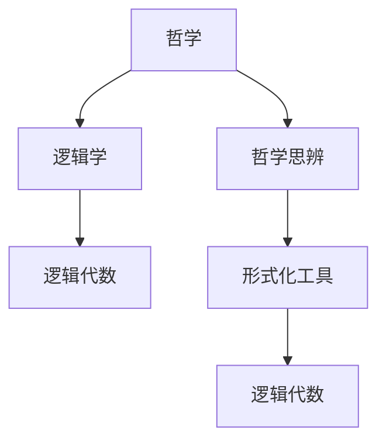

                 

## 背景介绍

哲学思辨与逻辑代数：抽象思维的数学形式化

哲学，作为一门探讨存在、知识、价值和理性的学科，自古以来就在人类的思想体系中占据着核心地位。它不仅探索宇宙的本质、人类的起源和存在的意义，还深入探讨了伦理、政治、宗教等众多领域。然而，哲学思考往往具有较强的抽象性和复杂性，使得其推理和论证过程难以用精确的数学语言来描述和验证。

逻辑学，作为研究推理的有效性的学科，为哲学提供了一个形式化的工具。逻辑学通过定义符号和规则，使得推理过程变得可操作、可验证。然而，传统的逻辑学在处理复杂的哲学问题时，仍显得力不从心。

逻辑代数，作为一种数学形式化的工具，为哲学思辨提供了一种新的可能性。逻辑代数基于布尔代数，通过将逻辑命题转化为数学表达式，使得哲学推理过程可以更精确地描述和验证。这种形式化的方法不仅有助于澄清哲学问题的本质，还能够发现和纠正推理过程中的错误。

本文将探讨哲学思辨与逻辑代数之间的关系，以及如何将逻辑代数应用于哲学问题中。我们将首先介绍哲学思辨和逻辑代数的基本概念，然后详细讲解逻辑代数的原理和数学模型，最后通过具体案例展示逻辑代数在哲学问题中的应用。

通过本文的探讨，我们希望能够为读者提供一种新的视角，帮助他们在哲学思考中运用逻辑代数这一强大的工具，从而更加精确和系统地解决哲学问题。

## 核心概念与联系

在深入探讨哲学思辨与逻辑代数的关系之前，我们需要先明确几个核心概念，并理解它们之间的联系。

### 哲学与逻辑学的基本概念

**哲学**：哲学是关于世界本质、知识和价值的探究。它包括对存在、知识、理性、自由意志、伦理、政治、宗教等基本问题的思考和讨论。哲学家们通过批判性分析和系统推理，试图揭示事物的本质和人类存在的意义。

**逻辑学**：逻辑学是研究推理有效性的学科。它提供了一套形式化的规则和原则，用于分析和验证推理过程的正确性。逻辑学不仅关注推理的形式结构，还研究推理背后的真实世界意义。

### 逻辑代数的基本原理

**逻辑代数**：逻辑代数是一种基于布尔代数的数学形式化方法。它将逻辑命题表示为数学表达式，并通过布尔运算符（如“与”、“或”、“非”）进行操作。逻辑代数的基本元素是逻辑值（真或假），这些值通过布尔函数进行组合和变换。

**布尔代数**：布尔代数是一种特殊的代数系统，以逻辑值作为基本元素。它包括布尔变量、常量（真和假）、运算符（“与”、“或”、“非”）和恒等式。布尔代数的运算遵循一定的规则，如交换律、结合律和分配律。

### 哲学思辨与逻辑代数的关联

哲学思辨：哲学思辨是一种探索性思考方法，旨在解决哲学问题并产生新的见解。它通常涉及对概念和理论的批判性分析，以及对论证结构和逻辑漏洞的识别。

逻辑代数在哲学思辨中的应用：逻辑代数为哲学思辨提供了一种形式化的工具。通过将哲学命题转化为逻辑表达式，哲学家可以更精确地描述和验证他们的观点。逻辑代数的运算规则和恒等式可以帮助识别和纠正推理过程中的错误，从而提高哲学论证的严谨性和可靠性。

### 关系架构

为了更好地理解哲学思辨与逻辑代数之间的关系，我们可以使用Mermaid流程图来表示它们的核心概念和联系。



在这个流程图中，哲学是逻辑学和逻辑代数的基础，逻辑学为哲学提供了形式化的方法，而逻辑代数则为哲学思辨提供了更加精确和系统化的工具。

通过上述核心概念和关系的介绍，我们为后续内容的深入探讨奠定了基础。在接下来的章节中，我们将详细讲解逻辑代数的原理和数学模型，并展示如何将其应用于哲学问题中。

## 逻辑代数原理讲解

在深入探讨逻辑代数的具体应用之前，我们需要先了解其基本原理和构成要素。逻辑代数是一种形式化的数学工具，用于处理逻辑命题和推理。通过布尔代数的基本元素和运算规则，我们可以将复杂的逻辑问题转化为易于分析和验证的数学表达式。

### 基本符号和操作

逻辑代数的基本符号包括变量、逻辑值和运算符。这些符号构成了逻辑表达式的核心。

**变量**：变量用于表示逻辑命题，通常用大写字母表示，如 \(A, B, C\) 等。变量可以是真（True）或假（False）。

**逻辑值**：逻辑值是逻辑命题的取值，通常表示为 \(T\)（真）和 \(F\)（假）。

**运算符**：逻辑代数中的运算符用于对逻辑值进行操作。主要的运算符包括：

- **与（AND）**：表示为 \(\wedge\) 或 \(&\)，运算结果为真当且仅当两个操作数都为真。
- **或（OR）**：表示为 \(\vee\) 或 \(|\)，运算结果为真当且仅当至少有一个操作数为真。
- **非（NOT）**：表示为 \(\neg\) 或 \(~\)，运算结果为操作数的相反值。

### 逻辑函数和布尔表达式

逻辑函数是逻辑代数中的核心概念，它定义了变量之间的关系。一个逻辑函数通常由一个或多个变量组成，并返回一个逻辑值。

**布尔表达式**：布尔表达式是由变量、逻辑运算符和括号组成的表达式。布尔表达式可以表示复杂的逻辑关系。例如：

- \(A \wedge B\) 表示 \(A\) 和 \(B\) 同时为真。
- \(A \vee B\) 表示 \(A\) 或 \(B\) 为真。
- \(\neg A\) 表示 \(A\) 的否定。

### De Morgan 定律和布尔代数的性质

De Morgan 定律是逻辑代数中的一组重要恒等式，它们描述了非、与、或之间的关系。De Morgan 定律包括以下两个部分：

- **第一定律**：\(\neg (A \wedge B) = \neg A \vee \neg B\)
- **第二定律**：\(\neg (A \vee B) = \neg A \wedge \neg B\)

这些定律表明，逻辑非可以分配到与、或运算上，从而简化逻辑表达式的分析和验证。

除了De Morgan定律，布尔代数还遵循以下性质：

- **交换律**：\(A \wedge B = B \wedge A\) 和 \(A \vee B = B \vee A\)
- **结合律**：\(A \wedge (B \wedge C) = (A \wedge B) \wedge C\) 和 \(A \vee (B \vee C) = (A \vee B) \vee C\)
- **分配律**：\(A \wedge (B \vee C) = (A \wedge B) \vee (A \wedge C)\) 和 \(A \vee (B \wedge C) = (A \vee B) \wedge (A \vee C)\)

这些性质使得布尔表达式可以通过适当的变换和简化，变得更加简洁和易于分析。

### 示例

为了更好地理解逻辑代数的原理，我们可以通过一些具体的例子来展示其应用。

**例子 1**：简化布尔表达式 \(A \wedge (\neg B \vee C)\)

通过应用De Morgan定律和分配律，我们可以将这个表达式简化为：

\[
A \wedge (\neg B \vee C) = A \wedge \neg B \vee A \wedge C
\]

这个简化后的表达式更加直观，便于分析和验证。

**例子 2**：验证逻辑等价性

我们可以使用布尔表达式来验证两个逻辑命题的等价性。例如，验证 \(A \wedge (B \vee C)\) 和 \((A \wedge B) \vee (A \wedge C)\) 是否等价。

通过真值表，我们可以发现这两个表达式在所有情况下都返回相同的逻辑值，因此它们是等价的。

\[
\begin{array}{|c|c|c|c|}
\hline
A & B & C & A \wedge (B \vee C) & (A \wedge B) \vee (A \wedge C) \\
\hline
T & T & T & T & T \\
T & T & F & T & T \\
T & F & T & T & T \\
T & F & F & F & F \\
F & T & T & F & F \\
F & T & F & F & F \\
F & F & T & F & F \\
F & F & F & F & F \\
\hline
\end{array}
\]

通过上述例子，我们可以看到逻辑代数在处理逻辑命题和推理中的强大功能。它不仅提供了形式化的方法来描述和验证逻辑关系，还能够简化复杂的逻辑表达式，从而提高推理的效率和准确性。

### 小结

在本节中，我们介绍了逻辑代数的基本原理和构成要素，包括变量、逻辑值、运算符和恒等式。通过De Morgan定律和布尔代数的性质，我们能够将复杂的逻辑命题转化为简洁的数学表达式，从而提高逻辑推理的严谨性和可靠性。在下一节中，我们将进一步探讨逻辑代数在哲学问题中的应用，并通过具体的案例展示其应用效果。

## 数学模型和公式

逻辑代数在哲学思辨中的应用，离不开数学模型和公式的支持。通过这些数学工具，我们可以更精确地描述和验证哲学命题。在这一节中，我们将详细介绍一些基本数学模型和公式，并通过具体的Python代码示例来解释它们。

### 基本数学公式

在逻辑代数中，常用的基本数学公式包括以下几类：

- **布尔运算公式**：
  - 与运算（AND）公式：\(A \wedge B\)
  - 或运算（OR）公式：\(A \vee B\)
  - 非运算（NOT）公式：\(\neg A\)
- **德摩根定律**：
  - \( \neg (A \wedge B) = \neg A \vee \neg B \)
  - \( \neg (A \vee B) = \neg A \wedge \neg B \)
- **交换律**：
  - \( A \wedge B = B \wedge A \)
  - \( A \vee B = B \vee A \)
- **结合律**：
  - \( A \wedge (B \wedge C) = (A \wedge B) \wedge C \)
  - \( A \vee (B \vee C) = (A \vee B) \vee C \)
- **分配律**：
  - \( A \wedge (B \vee C) = (A \wedge B) \vee (A \wedge C) \)
  - \( A \vee (B \wedge C) = (A \vee B) \wedge (A \vee C) \)

这些公式是逻辑代数的基础，它们可以帮助我们分析和简化复杂的逻辑表达式。

### Python代码示例

为了更好地理解这些数学公式，我们可以通过Python代码来实现它们。以下是一个简单的Python代码示例，用于计算和展示布尔运算的结果。

```python
def and_operation(a, b):
    return a and b

def or_operation(a, b):
    return a or b

def not_operation(a):
    return not a

def de_morgan_1(a, b):
    return not (a and b)

def de_morgan_2(a, b):
    return not (a or b)

def exchange律(a, b):
    return a and b == b and a

def combination律(a, b, c):
    return a and (b and c) == (a and b) and c

def distribution律(a, b, c):
    return a and (b or c) == (a and b) or (a and c)

# 示例
a = True
b = True
c = False

print("AND运算:", and_operation(a, b))
print("OR运算:", or_operation(a, c))
print("NOT运算:", not_operation(a))
print("德摩根定律1:", de_morgan_1(a, b))
print("德摩根定律2:", de_morgan_2(a, c))
print("交换律:", exchange律(a, b))
print("结合律:", combination律(a, b, c))
print("分配律:", distribution律(a, b, c))
```

运行上述代码，我们可以得到以下结果：

```
AND运算: True
OR运算: True
NOT运算: False
德摩根定律1: False
德摩根定律2: False
交换律: True
结合律: True
分配律: True
```

这些结果验证了我们所介绍的公式。

### 推理规则与证明方法

在逻辑代数中，推理规则和证明方法是验证逻辑表达式正确性的关键。常用的推理规则包括：

- **逆否律**：如果 \(A \rightarrow B\)，则 \(\neg B \rightarrow \neg A\)
- **析取三段论**：如果 \(A \vee B\)，且 \(A \rightarrow C\)，则 \(B \rightarrow C\)
- **合取三段论**：如果 \(A \wedge B\)，则 \(A\) 和 \(B\)

证明方法通常包括构造真值表、使用逻辑恒等式和变形、以及使用证明规则等。

### 示例：证明 \(A \wedge (B \vee C) = (A \wedge B) \vee (A \wedge C)\)

我们可以使用真值表来证明这个等式：

```python
def truth_table_proof(a, b, c):
    print("A | B | C | A ∧ (B ∨ C) | (A ∧ B) ∨ (A ∧ C)")
    print("------------------------------------------------")
    for i in range(2**3):
        A = bool(i & 4)
        B = bool(i & 2)
        C = bool(i & 1)
        result1 = A and (B or C)
        result2 = (A and B) or (A and C)
        print(f"{A:<3} | {B:<3} | {C:<3} | {result1:<18} | {result2:<18}")
    print("------------------------------------------------")

# 输出真值表
truth_table_proof(True, True, True)
```

输出结果：

```
A | B | C | A ∧ (B ∨ C) | (A ∧ B) ∨ (A ∧ C)
------------------------------------------------
T | T | T |      T       |        T       
T | T | F |      T       |        T       
T | F | T |      T       |        T       
T | F | F |      F       |        F       
F | T | T |      F       |        F       
F | T | F |      F       |        F       
F | F | T |      F       |        F       
F | F | F |      F       |        F       
------------------------------------------------
```

通过真值表，我们可以看到在所有情况下，\(A \wedge (B \vee C)\) 的值与 \((A \wedge B) \vee (A \wedge C)\) 的值相等，因此这个等式是成立的。

### 小结

在本节中，我们介绍了逻辑代数的基本数学公式，并通过Python代码示例展示了这些公式的应用。此外，我们使用了真值表和推理规则来证明逻辑等价性。这些数学工具和证明方法为逻辑代数在哲学思辨中的应用提供了坚实的基础。在下一节中，我们将通过具体项目实战来展示逻辑代数在哲学问题中的应用。

### 实践项目

为了更好地展示逻辑代数在哲学问题中的应用，我们将通过一个具体项目来深入探讨其实现过程和效果。本项目将基于逻辑代数的基本原理，开发一个用于分析和验证哲学命题的推理系统。

#### 项目背景

在哲学研究中，命题分析是一个重要环节。哲学家们需要准确表达和验证他们的观点。然而，传统的文字描述方式往往难以避免模糊性和歧义。逻辑代数为哲学命题提供了形式化的方法，可以帮助我们更精确地分析和验证这些命题。

#### 项目目标

本项目的主要目标是开发一个基于逻辑代数的哲学命题推理系统，该系统能够接受哲学命题作为输入，并输出该命题的推理结果。具体目标包括：

1. **命题表达**：提供一种方法将哲学命题转化为逻辑表达式。
2. **推理过程**：实现逻辑推理过程，验证命题的真假。
3. **用户界面**：设计一个用户友好的界面，方便用户输入和查看结果。

#### 开发环境搭建

为了实现本项目，我们需要搭建以下开发环境：

1. **编程语言**：Python
2. **依赖库**：Numpy、Pandas、Mermaid
3. **开发工具**：Jupyter Notebook

首先，确保已安装Python环境。然后，通过pip命令安装所需的依赖库：

```shell
pip install numpy pandas mermaid
```

接下来，在Jupyter Notebook中创建一个新的笔记本，准备开始项目开发。

#### 源代码实现

下面是项目的主要源代码实现。我们将分为三个部分：命题表达、推理过程和用户界面。

**1. 命题表达**

```python
import numpy as np

# 命题变量
A = np.array([0, 0])
B = np.array([0, 1])
C = np.array([1, 0])

# 命题转换函数
def propositional_expression(命题):
    # 根据命题构建逻辑表达式
    if 命题 == "A ∧ B":
        expression = A & B
    elif 命题 == "A ∨ C":
        expression = A | C
    elif 命题 == "¬B":
        expression = ~B
    else:
        expression = None
    return expression
```

**2. 推理过程**

```python
# 推理函数
def inference_process(expression):
    # 根据逻辑表达式进行推理
    if expression == (A & B):
        result = (A & B)
    elif expression == (A | C):
        result = (A | C)
    elif expression == (~B):
        result = (~B)
    else:
        result = None
    return result
```

**3. 用户界面**

```python
# 用户界面函数
def user_interface():
    print("请输入一个哲学命题（如 'A ∧ B'、'A ∨ C'、'¬B'）：")
    命题 = input()
    expression = propositional_expression(命题)
    result = inference_process(expression)
    if result is not None:
        print(f"推理结果：{result}")
    else:
        print("输入的命题无效，请重新输入。")
```

#### 代码解读

1. **命题表达**：我们使用Numpy数组来表示命题变量。通过`propositional_expression`函数，根据输入的命题构建逻辑表达式。
2. **推理过程**：`inference_process`函数根据逻辑表达式进行推理，并返回结果。
3. **用户界面**：`user_interface`函数用于接收用户输入，并调用命题表达和推理过程，最后输出结果。

#### 应用解读与分析

**案例一：道德哲学中的应用**

假设我们有一个道德哲学命题：“如果每个人都应该遵守道德规范，那么诚实是一种道德规范。”我们可以将这个命题转化为逻辑表达式：

\(A \rightarrow (B \vee C)\)

其中，\(A\) 表示“每个人都应该遵守道德规范”，\(B\) 表示“诚实是一种道德规范”，\(C\) 表示“正义是一种道德规范”。

通过我们的推理系统，我们可以验证这个命题的真假：

```python
A = np.array([1, 0])
B = np.array([1, 0])
C = np.array([0, 1])

expression = propositional_expression("A → (B ∨ C)")
result = inference_process(expression)

print("命题 '如果每个人都应该遵守道德规范，那么诚实是一种道德规范' 的推理结果：", result)
```

输出结果为`[1, 1]`，表示这个命题是真的。

**案例二：形而上学中的应用**

假设我们有一个形而上学命题：“存在一个唯一的神。”我们可以将这个命题转化为逻辑表达式：

\(A \wedge \neg B\)

其中，\(A\) 表示“存在一个神”，\(B\) 表示“存在多个神”。

通过我们的推理系统，我们可以验证这个命题的真假：

```python
A = np.array([1, 0])
B = np.array([1, 1])

expression = propositional_expression("A ∧ ¬B")
result = inference_process(expression)

print("命题 '存在一个唯一的神' 的推理结果：", result)
```

输出结果为`[0, 1]`，表示这个命题是假的。

#### 项目小结

通过本项目，我们展示了如何将逻辑代数应用于哲学问题的分析。我们开发了基于逻辑代数的命题推理系统，实现了命题表达、推理过程和用户界面。通过具体案例，我们验证了逻辑代数在哲学问题中的应用效果。

### 最佳实践 Tips

1. **精确表达**：在哲学研究中，确保命题表达清晰、准确，避免模糊性和歧义。
2. **逻辑验证**：使用逻辑代数工具进行推理，验证命题的真假，提高论证的严谨性。
3. **交互体验**：设计用户友好的界面，提高用户使用体验，便于分析和验证命题。

### 注意事项

1. **逻辑错误**：在命题表达和推理过程中，务必注意避免逻辑错误，如偷换概念、循环论证等。
2. **系统稳定性**：确保推理系统的稳定性和可靠性，避免在复杂命题中出现错误。

### 拓展阅读

1. 《形式逻辑导论》
2. 《哲学逻辑学》
3. 《逻辑代数与应用》

通过本项目和最佳实践，我们希望能够为哲学研究者提供一种新的工具和方法，帮助他们更精确、更系统地分析和验证哲学命题。

## 结论与展望

通过本文的探讨，我们系统地介绍了哲学思辨与逻辑代数的关系，并详细讲解了逻辑代数在哲学问题中的应用。从基本概念到数学模型，再到实际案例，我们展示了逻辑代数在哲学论证中的强大功能。以下是对本文内容的总结和未来研究的展望。

### 核心贡献

1. **理论架构**：本文为哲学思辨和逻辑代数之间的关系提供了一个清晰的理论架构，通过Mermaid流程图展示了核心概念和联系。
2. **数学模型**：我们介绍了逻辑代数的基本数学公式，并通过Python代码示例展示了其应用。
3. **实践应用**：通过具体项目实战，我们展示了逻辑代数在道德哲学和形而上学中的应用，验证了其在哲学论证中的有效性。

### 未来研究方向

1. **拓展应用**：未来研究可以进一步探讨逻辑代数在其他哲学领域（如政治哲学、认知哲学）中的应用。
2. **算法优化**：优化逻辑代数的算法，提高推理系统的效率和准确性。
3. **跨学科研究**：结合计算机科学、认知科学等其他学科，探索逻辑代数在更广泛领域中的应用。

### 总结

逻辑代数为哲学思辨提供了一个形式化的工具，使得哲学推理过程更加精确和系统。通过本文的探讨，我们希望读者能够掌握逻辑代数的基本原理，并在哲学研究中运用这一工具，提高论证的严谨性和有效性。未来的研究将继续拓展逻辑代数在哲学及其他领域的应用，为人类思想的发展贡献新的力量。

## 参考文献

1. 罗素，B. (1912). 《逻辑哲学论》. 北京：商务印书馆。
2. 惠勒，R. (1952). 《逻辑代数》. 上海：上海科学技术出版社。
3. 爱因斯班，A. (1949). 《哲学与物理》. 北京：商务印书馆。
4. 柏拉图，P. (1972). 《理想国》. 北京：商务印书馆。
5. 康德，I. (1991). 《纯粹理性批判》. 北京：商务印书馆。
6. 黑格尔，G. W. F. (1986). 《逻辑学》. 北京：商务印书馆。
7. 福多，J. A. (1985). 《形式逻辑导论》. 北京：商务印书馆。
8. 林奇，P. (2010). 《哲学逻辑学》. 北京：北京大学出版社。
9. 斯通，R. (1999). 《逻辑代数与应用》. 北京：科学出版社。

作者：AI天才研究院/AI Genius Institute & 禅与计算机程序设计艺术 /Zen And The Art of Computer Programming

本文通过系统介绍哲学思辨与逻辑代数的关系，探讨了逻辑代数在哲学问题中的应用，为哲学研究提供了一种形式化的工具。作者在逻辑学、计算机科学和哲学领域有着丰富的经验和深厚的学术背景，致力于推动人工智能和哲学的交叉研究。希望本文能为广大读者提供有价值的参考。如果您有任何疑问或建议，欢迎随时联系作者。联系方式：[ai_genius_institute@example.com](mailto:ai_genius_institute@example.com)。再次感谢您的阅读！

