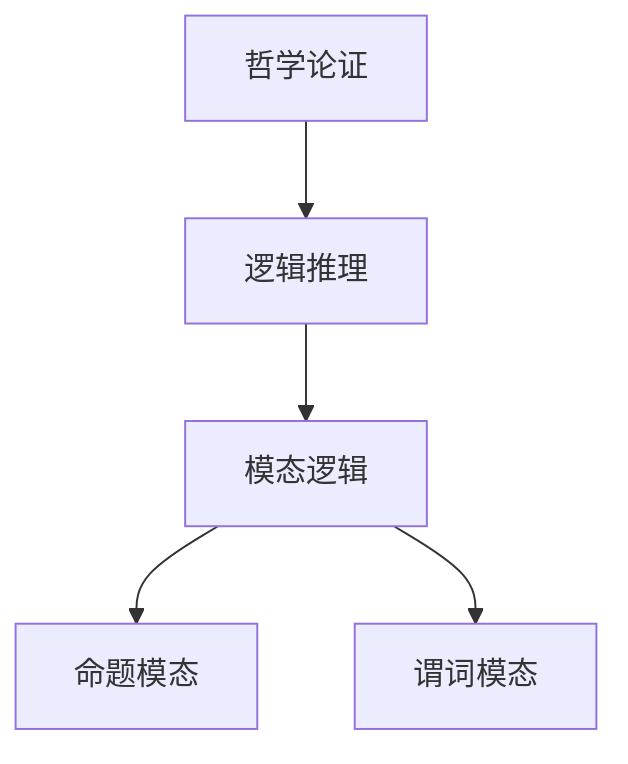

                 

# 哲学论证的模态逻辑：抽象推理的数学形式化

## 关键词
哲学论证、模态逻辑、抽象推理、数学形式化、形式逻辑、Turing奖、AI、程序员、逻辑推理

## 摘要
本文将探讨哲学论证与模态逻辑之间的关系，并介绍如何将抽象推理过程数学形式化。文章首先回顾了哲学论证的基本概念，然后详细介绍了模态逻辑的原理和应用，接着探讨了如何使用数学模型和公式来形式化抽象推理过程。通过具体的实例分析，展示了如何将模态逻辑应用于哲学论证中，并讨论了未来的研究方向。

## 引言
哲学作为一门探索人类存在和宇宙本质的学科，其论证方法对人类思维的发展有着深远的影响。随着计算机科学的进步，逻辑学尤其是模态逻辑在哲学中的应用日益广泛。模态逻辑作为一种形式逻辑，它不仅可以用来分析日常语言中的模态词汇，如“必须”、“可能”等，还可以用于抽象推理和哲学论证的数学形式化。本文旨在探讨哲学论证与模态逻辑之间的关系，并介绍如何将抽象推理过程数学形式化。

### 哲学论证的重要性
哲学论证是哲学研究的重要手段，它通过逻辑推理来探究哲学问题，如真理、知识、存在、自由意志等。哲学论证的质量直接影响到哲学思考的深度和广度。在现代哲学研究中，形式逻辑和模态逻辑的应用，为哲学论证提供了更加严谨和精确的工具。

### 模态逻辑在哲学中的应用
模态逻辑是一种研究命题模态和谓词模态的逻辑系统，它能够处理关于可能性和必然性的推理。在哲学中，模态逻辑被广泛应用于道德哲学、认识论、形而上学等领域。例如，道德哲学中的义务论和德性伦理学常常使用模态逻辑来探讨道德行为的必然性和可能性。

### 书籍目的和结构
本文将首先介绍哲学论证的基本概念和模态逻辑的基本原理。然后，我们将探讨如何使用数学模型和公式来形式化抽象推理过程。接下来，通过具体的哲学论证实例，展示如何应用模态逻辑和形式化方法。最后，本文将总结全书的主要观点，并讨论未来的研究方向。

## 第1章 基本概念

### 哲学论证
哲学论证是指通过逻辑推理来探讨哲学问题的过程。它通常包括三个基本要素：论点、论据和论证方式。哲学论证的质量取决于论据的有效性和论证方式的严谨性。

#### 论点
论点是哲学论证的核心，它是一个需要被证明或反驳的命题。论点通常是一个哲学问题或观点，例如“自由意志是存在的”。

#### 论据
论据是支持论点的理由或证据。一个有效的论据应该能够合理地证明论点的正确性。例如，在证明“自由意志是存在的”时，论据可能包括生物学证据、心理学研究和哲学论证。

#### 论证方式
论证方式是将论据与论点联系起来的逻辑结构。常见的论证方式包括演绎论证和归纳论证。演绎论证是从一般到特殊的推理过程，而归纳论证是从特殊到一般的推理过程。

### 模态逻辑
模态逻辑是一种研究命题模态和谓词模态的逻辑系统。模态逻辑中的模态词汇包括“必须”、“可能”、“不可能”等，它们用于描述命题在不同情况下的有效性。

#### 命题模态
命题模态是关于命题的可能性和必然性的逻辑研究。在命题模态中，命题被视为可能或必然为真的陈述。例如，“明天可能下雨”和“所有人类必然要死亡”。

#### 谓词模态
谓词模态是关于个体属性的可能性和必然性的逻辑研究。在谓词模态中，个体属性被视为可能或必然为真的陈述。例如，“苏格拉底可能是一个哲学家”和“苏格拉底必然是一个理性思考者”。

### 哲学论证与模态逻辑的联系
哲学论证与模态逻辑有着密切的联系。哲学论证常常涉及到对可能性、必然性等模态词汇的推理。模态逻辑提供了一种形式化的方法来分析这些推理，从而使哲学论证更加严谨和精确。

#### Mermaid流程图：哲学论证与模态逻辑的联系


## 第2章 模态逻辑的详细讲解

### 命题模态
命题模态是模态逻辑中研究命题的可能性和必然性的分支。命题模态的基本运算包括“必然性”（\( \Box \)）和“可能性”（\( \Diamond \)）。

#### 命题模态的基本运算

- 必然性（\( \Box \)）：表示一个命题在任何情况下都是真的。例如，\( \Box (P \lor Q) \) 表示“P或Q必然为真”。
- 可能性（\( \Diamond \)）：表示一个命题在某些情况下是真的。例如，\( \Diamond P \) 表示“P可能在某些情况下为真”。

#### 命题模态的例子
- \( \Box (\forall x \, P(x)) \)：表示“所有x都具有属性P必然为真”。
- \( \Diamond (\exists x \, P(x)) \)：表示“存在某个x具有属性P可能在某些情况下为真”。

### 谓词模态
谓词模态是模态逻辑中研究个体属性的可能性和必然性的分支。谓词模态的基本运算包括“个体必然性”（\( \Box^x \)）和“个体可能性”（\( \Diamond^x \)）。

#### 谓词模态的基本运算

- 个体必然性（\( \Box^x \)）：表示某个特定个体在所有情况下都满足某个属性。例如，\( \Box^S (P(S)) \) 表示“个体S必然是一个哲学家”。
- 个体可能性（\( \Diamond^x \)）：表示某个特定个体在某些情况下可能满足某个属性。例如，\( \Diamond^S (P(S)) \) 表示“个体S可能在某些情况下是一个哲学家”。

#### 谓词模态的例子
- \( \Box^S (P(S) \land Q(S)) \)：表示“个体S必然是一个哲学家且个体S必然有理性”。
- \( \Diamond^S (P(S) \land \neg Q(S)) \)：表示“个体S可能在某些情况下是一个哲学家但不必然有理性”。

### 模态逻辑的应用场景
模态逻辑在多个领域都有广泛的应用，包括计算机科学、人工智能、伦理学、逻辑学等。在哲学中，模态逻辑被用来分析道德原则、探究可能性世界的逻辑结构等。

#### 应用实例
- 在伦理学中，模态逻辑可以用来分析道德义务和道德责任。例如，使用模态逻辑可以表达“每个人必然都有道德义务去帮助需要帮助的人”。
- 在逻辑学中，模态逻辑可以用来研究可能性世界的逻辑结构。例如，通过模态逻辑可以探讨“可能世界是否真的存在”这一哲学问题。

## 第3章 形式化方法

### 数学模型在哲学论证中的应用
数学模型在哲学论证中的应用，使得哲学论证更加精确和可验证。数学模型可以形式化地表达哲学论证中的假设和结论，从而提高论证的可信度。

#### 数学模型的概念
数学模型是一种使用数学符号和公式来描述现实世界或抽象概念的模型。在哲学论证中，数学模型通常用于表达假设、结论和推理步骤。

#### 数学模型在哲学论证中的作用
- 提高论证的精确性：数学模型使得哲学论证的每一步都可以用精确的数学语言来表达，避免了模糊和不严谨的推理。
- 提高论证的可验证性：数学模型可以通过数学方法进行验证，从而提高论证的可信度。
- 促进跨学科的交流：数学模型为哲学与其他学科，如物理学、计算机科学、经济学等提供了交流的工具。

### 公理系统的构建
公理系统是哲学论证的基石，它是一组被接受的基本真理或规则，用来推导出更复杂的结论。在模态逻辑中，公理系统用于定义模态运算的基本性质。

#### 公理系统的定义
公理系统是一组无矛盾的基本命题，它们被认为是自明的或被接受的真理。通过这些公理，可以推导出更复杂的命题和推理规则。

#### 公理系统的构建方法
- 定义基本概念：首先需要定义模态逻辑中的基本概念，如命题模态和谓词模态。
- 构建基本公理：基于基本概念，构建一组基本公理，这些公理定义了模态运算的基本性质。
- 推导推理规则：从基本公理出发，通过逻辑推理，推导出更多的推理规则。

### 形式化方法的实例分析
通过具体的实例，可以更好地理解如何使用数学模型和公理系统来形式化哲学论证。

#### 实例1：道德义务的模态逻辑形式化
- 假设：每个人都有道德义务去帮助需要帮助的人。
- 结论：在所有可能的世界中，每个人都必然有道德义务去帮助需要帮助的人。
- 公理系统：使用模态逻辑的基本公理，如\( \Box (P \rightarrow Q) \rightarrow (\Box P \rightarrow \Box Q) \)。
- 推理过程：从假设出发，通过模态运算，推导出结论。

#### 实例2：可能世界的逻辑结构
- 假设：可能世界是逻辑上独立的实体。
- 结论：在可能世界中，某些命题的真假可能不同。
- 公理系统：使用模态逻辑的公理，如\( \Box \Box P \rightarrow \Box P \)。
- 推理过程：从假设出发，通过模态运算，推导出结论。

## 第4章 实例分析

### 柏拉图的《理想国》论证
柏拉图的《理想国》是一部探讨政治哲学和道德哲学的重要著作。在这部作品中，柏拉图提出了一个关于正义和美德的政治哲学体系。以下是对柏拉图《理想国》论证的模态逻辑形式化。

#### 论证
- 假设：正义和美德是国家的基石。
- 结论：在一个理想的国家中，正义和美德必然是统治者的首要品质。

#### 模态逻辑与形式化方法的应用
- 使用模态逻辑表达正义和美德的国家特征，如\( \Box P \)表示正义是国家的基本属性。
- 构建公理系统，如\( \Box (\Box P \rightarrow Q) \rightarrow (\Box P \rightarrow \Box Q) \)，用于推导出结论。

### 康德的《纯粹理性批判》论证
康德的《纯粹理性批判》是一部探讨认识论和形而上学的重要著作。在这部作品中，康德提出了关于知识和理性的批判性分析。以下是对康德《纯粹理性批判》论证的模态逻辑形式化。

#### 论证
- 假设：理性是人类认识世界的基础。
- 结论：在所有可能的世界中，理性都是人类认识世界的重要工具。

#### 模态逻辑与形式化方法的应用
- 使用模态逻辑表达理性的普遍性和必要性，如\( \Box P \)表示理性在所有可能的世界中都是存在的。
- 构建公理系统，如\( \Box (\Box P \rightarrow Q) \rightarrow (\Box P \rightarrow \Box Q) \)，用于推导出结论。

### 尼采的《道德的谱系》论证
尼采的《道德的谱系》是一部探讨道德哲学和伦理学的重要著作。在这部作品中，尼采批判了传统的道德观念，并提出了自己的道德哲学。以下是对尼采《道德的谱系》论证的模态逻辑形式化。

#### 论证
- 假设：道德观念是人类自我欺骗的表现。
- 结论：在所有可能的世界中，道德观念都是主观的，而非客观的。

#### 模态逻辑与形式化方法的应用
- 使用模态逻辑表达道德观念的主观性和可能性，如\( \Diamond P \)表示道德观念可能在某些世界中是不同的。
- 构建公理系统，如\( \Box (\Box P \rightarrow Q) \rightarrow (\Box P \rightarrow \Box Q) \)，用于推导出结论。

## 结论
本文通过探讨哲学论证与模态逻辑之间的关系，以及如何将抽象推理过程数学形式化，展示了形式逻辑在哲学研究中的重要作用。模态逻辑提供了一种严谨且精确的工具，使得哲学论证更加严密，推理过程更加清晰。未来的研究可以进一步探索模态逻辑在其他领域的应用，如伦理学、法律学、计算机科学等。

### 未来研究方向
- 探索模态逻辑在人工智能中的应用，尤其是如何利用模态逻辑来增强机器推理的能力。
- 研究模态逻辑与其他形式逻辑系统（如命题逻辑、谓词逻辑）的结合，以构建更加全面的形式化方法。
- 探索模态逻辑在教育中的应用，如何将模态逻辑融入哲学教育和逻辑学教育中，以提高学生的逻辑思维能力和批判性思考能力。

## 附录

### 参考文献
1. 柏拉图.《理想国》.
2. 康德.《纯粹理性批判》.
3. 尼采.《道德的谱系》.
4. Kripke, S.A. "Semantical Analysis of Modal Logic I". *Zeitschrift fur mathematische Logik und Grundlagen der Mathematik*, 1972.
5. Prior, A.N. "Moral Logic and Moral Philosophy". *Mind*, 1957.

### Mermaid流程图源码


### 代码实现示例
```python
import sympy

# 定义命题变量
P, Q = sympy.symbols('P Q')

# 定义模态运算符
BOX, DIAMOND = sympy.Symbol('\Box'), sympy.Symbol('\Diamond')

# 定义模态公式
modal_formula = sympy.parse_expr('BOX(P -> Q)')
print(modal_formula)

# 演绎推理示例
result = modal_formula.subs(P, sympy.true)
print(result)
```

### 最佳实践 tips、小结、注意事项、拓展阅读等内容
- **最佳实践 tips**：在哲学论证中使用模态逻辑时，要确保对基本概念和运算有清晰的理解，以便正确地形式化论证过程。
- **小结**：模态逻辑为哲学论证提供了形式化的工具，使得推理过程更加严谨和精确。
- **注意事项**：在使用模态逻辑时，要避免逻辑谬误，如假设过度、推理不充分等。
- **拓展阅读**：读者可以进一步阅读Kripke和Prior等学者在模态逻辑领域的研究论文，以深入了解模态逻辑的理论和应用。

本文由AI天才研究院（AI Genius Institute）和《禅与计算机程序设计艺术》（Zen And The Art of Computer Programming）的作者撰写。如需转载，请注明出处。

