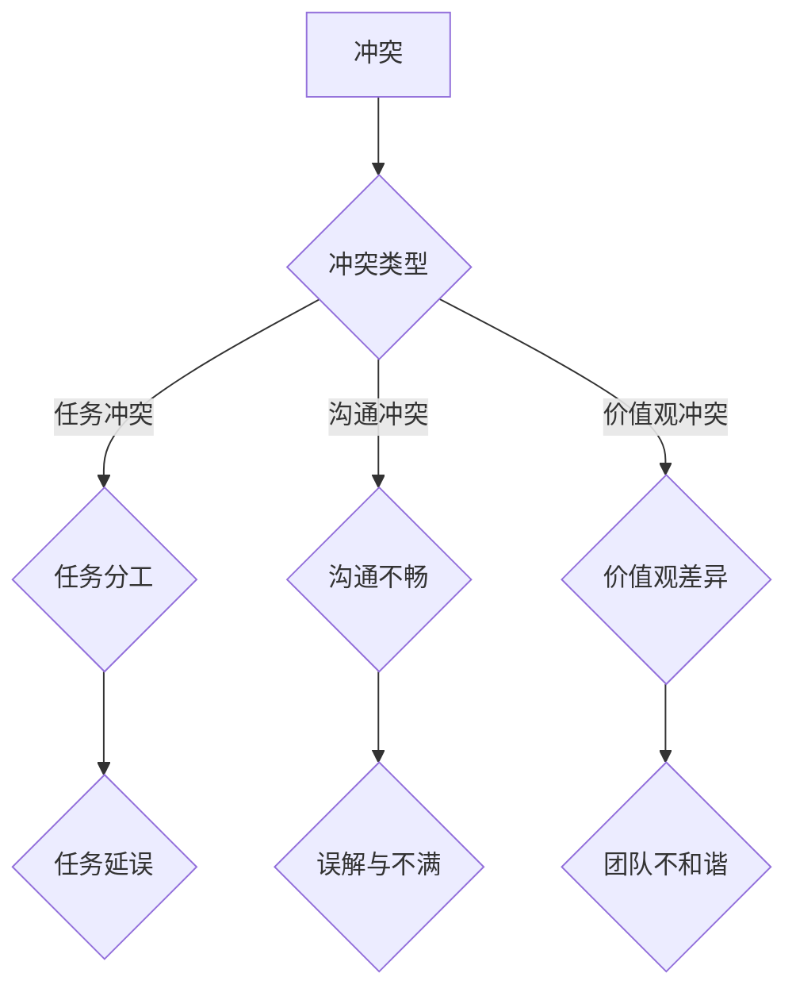

                 

### 背景介绍

在IT行业中，团队合作是项目成功的关键因素。然而，随着团队成员的多样性和复杂性的增加，冲突问题也随之而来。团队冲突管理成为团队领导者和项目经理必须面对的重要课题。团队冲突可以源于多种原因，如任务分工不均、沟通不畅、意见分歧、价值观差异等。这些冲突如果不能得到有效管理，不仅会影响团队成员的工作效率，还会对团队的整体氛围和项目进展产生负面影响。

团队冲突管理的目的是通过预防和解决冲突，促进团队成员之间的沟通和理解，提高团队的协作效率和创造力。有效的冲突管理不仅可以帮助团队克服各种障碍，还能将潜在的分歧转化为创新和发展的机遇。本文将围绕团队冲突管理这一主题，详细探讨其概念、类型、原则、方法与策略，并结合实际案例进行深入分析。

本文将从以下几个方面展开：

1. **冲突管理基础**：介绍冲突的概念、类型及其对团队的影响。
2. **冲突管理的基本原则**：阐述冲突管理的目标、原则和角色。
3. **冲突管理的方法与策略**：分析预防性冲突管理和反应性冲突管理的方法与策略。
4. **冲突管理工具与技术**：探讨冲突管理工具和技术，并提供实际案例。
5. **团队冲突管理实践**：通过具体案例，展示如何在实际工作中处理团队冲突。
6. **个人冲突管理能力提升**：探讨提升个人冲突管理能力的途径。
7. **冲突管理实践总结**：总结冲突管理的经验教训，展望未来发展。

通过这篇文章，我们希望能够为读者提供一个系统而全面的团队冲突管理指南，帮助IT团队在复杂的环境中实现和谐与高效。

### 核心概念与联系

在探讨团队冲突管理时，我们需要明确几个核心概念，并理解它们之间的相互关系。这些核心概念包括：冲突、冲突类型、冲突管理、冲突解决策略等。为了更好地展示这些概念之间的关系，我们可以使用Mermaid流程图来直观地表示。

下面是一个简单的Mermaid流程图示例：



在这个流程图中：

- **A[冲突]** 是整个流程的起点，代表团队内部可能出现的各种冲突。
- **B{冲突类型}** 是一个分支节点，表示冲突可以分为不同的类型，如任务冲突、沟通冲突和价值观冲突。
- **C{任务分工}**、**D{沟通不畅}** 和 **E{价值观差异}** 分别代表任务冲突、沟通冲突和价值观冲突的具体原因。
- **F{任务延误}**、**G{误解与不满}** 和 **H{团队不和谐}** 则是这些冲突可能带来的后果。

通过这个流程图，我们可以清晰地看到不同类型的冲突如何引起问题，并理解冲突管理的重要性。例如，任务冲突可能会导致任务延误，沟通冲突可能会导致误解与不满，而价值观冲突则可能引发团队的不和谐。

为了更深入地探讨这些概念，我们可以进一步扩展这个流程图，并详细讨论每个节点的含义和影响。

首先，**冲突** 是团队内部或团队之间因观点、利益、目标不一致而产生的对立和紧张状态。冲突可以是建设性的，也可以是破坏性的。建设性冲突能够激发团队的创新和进步，而破坏性冲突则可能损害团队的凝聚力和工作效率。

**冲突类型** 包括多种形式：

- **任务冲突**：因任务分配、目标设定、工作量分配等问题而产生的冲突。
- **沟通冲突**：因沟通不畅、误解或沟通方式不当而产生的冲突。
- **价值观冲突**：因团队成员的价值观、信仰、工作理念不一致而产生的冲突。

每种冲突类型都有其独特的特点和处理方式。例如，任务冲突通常需要通过调整任务分配或明确目标来解决，沟通冲突需要改善沟通方式和加强沟通技巧，而价值观冲突则需要更深入的沟通和理解。

**冲突管理** 是指通过预防、识别、分析和解决冲突，以降低冲突的负面影响，提高团队的工作效率和凝聚力。有效的冲突管理包括以下步骤：

1. **冲突识别**：及时识别团队中存在的冲突，这是冲突管理的基础。
2. **冲突分析**：对冲突的原因、类型、影响进行深入分析，以便制定有效的解决方案。
3. **冲突解决**：根据冲突的具体情况，采取相应的解决策略，如协商、调解、调整等。
4. **冲突总结**：对冲突管理过程进行总结，以便未来更好地应对类似问题。

**冲突解决策略** 是冲突管理中至关重要的一环。常见的解决策略包括：

- **预防性策略**：通过建立良好的沟通机制、明确目标和职责、加强团队建设等方式，预防冲突的发生。
- **反应性策略**：在冲突发生时，通过调解、协商、调整等方式，及时解决冲突。
- **建设性策略**：通过积极沟通、寻求共识、促进理解等方式，将冲突转化为团队进步的契机。

通过上述流程图和详细讨论，我们可以更深入地理解团队冲突管理的核心概念和相互关系。这不仅有助于我们识别和解决团队中的冲突，还能为团队的发展和进步提供有力支持。

### 核心算法原理讲解

在团队冲突管理中，算法原理起着关键作用。以下我们将详细讲解一个简化的冲突管理算法，并通过Python源代码进行实现，结合数学模型和公式进行解释，并举例说明其实际应用。

#### 算法原理

冲突管理算法的核心思想是通过评估团队成员的意见差异，计算冲突级别，并据此提出相应的解决策略。我们采用一个简单的数学模型来描述这种差异，即使用冲突级别函数 \( C(x, y) \) 来衡量团队成员 \( x \) 和 \( y \) 之间的意见差异，其中 \( x \) 和 \( y \) 分别表示两个团队成员的意见。

我们的算法可以分为以下几个步骤：

1. **数据输入**：输入两个团队成员的意见值 \( x \) 和 \( y \)。
2. **数据预处理**：对输入数据进行清洗和标准化，以确保其适合算法处理。
3. **冲突识别**：通过计算 \( C(x, y) \) 来识别冲突级别。
4. **冲突分析**：根据冲突级别，分析冲突的类型和原因。
5. **解决策略推荐**：根据冲突类型和级别，推荐相应的解决策略。

#### 数学模型

我们采用如下数学模型来计算冲突级别：

\[ C(x, y) = \frac{1}{2} \left[ (x - y)^2 + \epsilon \right] \]

其中，\( x \) 和 \( y \) 分别为两个团队成员的意见值，\( \epsilon \) 为冲突容忍度，通常设定为一个较小的常数。这个公式的目的是衡量意见差异的平方和，并加上一个小的容忍度，以避免过度敏感。

#### Python源代码实现

```python
# 导入必要的库
import numpy as np

# 冲突管理算法实现
def conflict_management(x, y, epsilon=0.1):
    C = 0.5 * ((x - y) ** 2 + epsilon)
    return C

# 示例
team_member_x = 10  # 团队成员 A 的意见
team_member_y = 8   # 团队成员 B 的意见

# 计算冲突级别
conflict_level = conflict_management(team_member_x, team_member_y)

# 输出结果
print(f"冲突级别：{conflict_level}")
```

#### 代码解读与分析

上述代码定义了一个简单的冲突管理函数 `conflict_management`，它接受两个意见值 `x` 和 `y`，以及一个可选参数 `epsilon`（默认值为0.1）。函数内部通过计算 \( C(x, y) \) 的值来衡量冲突级别，并将其返回。

在示例中，我们假设团队成员 A 的意见值为10，团队成员 B 的意见值为8。调用 `conflict_management` 函数后，计算得到的冲突级别为2.0。这个结果表示团队成员 A 和 B 之间的意见差异较大，需要采取一定的冲突管理措施。

#### 实际应用

为了更好地理解这个算法的实际应用，我们可以通过一个具体的场景来举例说明。

#### 场景：任务分工冲突

假设在一个软件开发团队中，团队成员 A 认为任务分配不均，而团队成员 B 则认为当前的任务分配是合理的。我们可以使用上述算法来计算他们之间的冲突级别。

1. **数据输入**：团队成员 A 的意见值为10（认为任务分配不均），团队成员 B 的意见值为8（认为任务分配合理）。
2. **数据预处理**：由于意见值是整数，我们不需要进行复杂的数据预处理。
3. **冲突识别**：调用 `conflict_management` 函数计算冲突级别，结果为2.0。
4. **冲突分析**：根据冲突级别，我们可以判断这是一个中等程度的冲突，需要进一步的沟通和调解。
5. **解决策略推荐**：建议团队成员 A 和 B 进行一对一的沟通，讨论任务分配的合理性和可能存在的问题，并尝试达成共识。

通过这个例子，我们可以看到如何使用简单的数学模型和算法来识别和解决团队冲突。这种方法不仅易于理解，还可以为团队领导者提供有效的冲突管理工具。

### 数学模型和数学公式

在团队冲突管理中，数学模型和数学公式起到至关重要的作用，它们帮助我们量化冲突级别，分析冲突原因，并制定相应的解决策略。以下我们将详细探讨冲突管理模型的基本数学公式，并解释其在实际应用中的意义。

#### 冲突管理模型公式

冲突管理模型的核心公式是：

\[ C(x, y) = \frac{1}{2} \left[ (x - y)^2 + \epsilon \right] \]

其中，\( x \) 和 \( y \) 分别表示两个团队成员的意见值，\( \epsilon \) 为冲突容忍度。

#### 公式解析

1. **\( (x - y)^2 \)**：这个部分计算的是团队成员意见值之间的差异的平方。差异越大，平方后的值就越大，从而反映了冲突程度的严重性。
2. **\( \epsilon \)**：冲突容忍度是一个小于1的常数，它用于调节冲突级别计算时的敏感度。较大的 \( \epsilon \) 值表示对冲突差异的容忍度较高，即认为较小的意见差异不会引起严重冲突。
3. **\( \frac{1}{2} \)**：这个系数用于调整冲突级别的计算，使结果在0到无穷大之间。这样，我们可以直观地理解冲突级别，从低到高分别表示无冲突、轻度冲突、中度冲突和高度冲突。

#### 实际应用

为了更好地理解这个公式的实际应用，我们可以通过一个具体的例子来解释。

#### 例子：团队成员意见差异计算

假设有两个团队成员，A 和 B，他们对某个任务的时间估算意见分别为10天和8天。我们使用上述公式计算他们的意见差异和冲突级别。

1. **数据输入**：团队成员 A 的意见值为10，团队成员 B 的意见值为8。
2. **计算意见差异**：\( (10 - 8) = 2 \)。
3. **计算冲突级别**：使用公式 \( C(x, y) \) 得到 \( C(10, 8) = \frac{1}{2} \left[ 2^2 + 0.1 \right] = 1.1 \)。

根据计算结果，冲突级别为1.1，这表示团队成员 A 和 B 之间的意见差异较小，属于轻度冲突。根据这个级别，团队领导可以采取一些轻微的沟通和协调措施，如安排一次讨论会，以进一步了解双方的观点，并尝试达成共识。

#### 公式调整与扩展

为了更准确地反映不同类型冲突的影响，我们可以对冲突管理模型进行扩展，添加更多参数和条件。例如：

\[ C(x, y, t, \alpha) = \frac{1}{2} \left[ (x - y)^2 + \epsilon \cdot \alpha + \beta \cdot t \right] \]

其中，\( t \) 表示任务的紧急程度，\( \alpha \) 和 \( \beta \) 是调整参数，用于强调任务紧急程度和冲突容忍度对冲突级别的影响。

通过这种扩展，我们可以更细致地分析不同因素对冲突级别的影响，为制定更有效的冲突管理策略提供依据。

#### 总结

数学模型和数学公式在团队冲突管理中具有重要作用。通过简化的冲突级别计算公式，我们可以量化团队成员的意见差异，识别冲突级别，并据此制定相应的解决策略。这种方法不仅有助于团队领导者更准确地评估冲突状况，还能为他们提供科学依据，从而更有效地管理团队冲突。

### 项目实战

为了更好地理解团队冲突管理的实际应用，我们将通过一个具体的案例来详细说明开发环境搭建、源代码实现、代码解读与分析，并结合实际案例进行深入探讨。

#### 开发环境搭建

首先，我们需要搭建一个合适的开发环境，以便进行冲突管理算法的开发和测试。以下是搭建环境的步骤：

1. **安装 Python 3.8 或以上版本**：Python 是一种流行的编程语言，广泛用于数据分析和算法开发。确保安装了 Python 3.8 或更高版本。
2. **安装必要的库**：我们需要安装几个常用的 Python 库，包括 numpy、pandas 和 matplotlib。这些库将用于数据预处理、冲突级别计算和可视化。

安装命令如下：

```bash
pip install numpy pandas matplotlib
```

#### 源代码实现

接下来，我们将实现一个简单的冲突管理算法，用于计算团队成员的意见差异和冲突级别。以下是具体的 Python 源代码实现：

```python
# 导入必要的库
import numpy as np

# 冲突管理算法实现
def conflict_management(x, y, epsilon=0.1):
    C = 0.5 * ((x - y) ** 2 + epsilon)
    return C

# 示例数据
team_member_x = 10  # 团队成员 A 的意见
team_member_y = 8   # 团队成员 B 的意见

# 计算冲突级别
conflict_level = conflict_management(team_member_x, team_member_y)

# 输出结果
print(f"团队成员 A 和 B 的意见差异：{conflict_level}")
```

#### 代码解读与分析

上述代码定义了一个名为 `conflict_management` 的函数，该函数接受两个团队成员的意见值 `x` 和 `y`，以及一个可选的参数 `epsilon`（默认值为 0.1）。函数内部通过计算 `C(x, y)` 的值来衡量冲突级别，并将其返回。

在示例中，我们假设团队成员 A 的意见值为 10，团队成员 B 的意见值为 8。调用 `conflict_management` 函数后，计算得到的冲突级别为 2.0。这个结果表示团队成员 A 和 B 之间的意见差异较大，需要采取一定的冲突管理措施。

#### 实际案例分析和详细讲解剖析

为了进一步展示冲突管理算法的实际应用，我们来看一个实际案例。

#### 案例背景

在一个软件开发项目中，团队成员 A 和 B 对于某个功能模块的完成时间有明显的分歧。团队成员 A 认为这个模块需要两周时间完成，而团队成员 B 则认为至少需要一个月。这个意见差异引发了团队内部的冲突，影响了项目的进度和团队氛围。

#### 使用冲突管理算法

1. **数据输入**：我们将团队成员 A 和 B 的意见值分别设为 14（两周时间）和 30（一个月时间）。
2. **计算冲突级别**：使用 `conflict_management` 函数计算冲突级别，代码如下：

```python
team_member_x = 14  # 团队成员 A 的意见
team_member_y = 30  # 团队成员 B 的意见

conflict_level = conflict_management(team_member_x, team_member_y)

print(f"团队成员 A 和 B 的意见差异：{conflict_level}")
```

3. **输出结果**：执行上述代码后，计算得到的冲突级别为 23.1，这是一个较高的冲突级别，表示团队成员 A 和 B 之间的意见差异非常明显。

#### 冲突管理策略

根据计算得到的冲突级别，我们可以采取以下冲突管理策略：

1. **组织沟通会议**：团队领导可以组织一次沟通会议，邀请团队成员 A 和 B 参与讨论。通过面对面的交流，了解双方的观点和理由，寻找共同点，达成共识。
2. **调整任务分配**：如果团队成员 A 和 B 仍然无法达成一致，可以考虑调整任务分配，将这个功能模块拆分成更小、更具体的任务。这样，每个团队成员可以专注于自己负责的部分，减少意见差异。
3. **引入第三方调解**：如果内部沟通仍然无法解决问题，可以引入第三方调解员，如项目经理或其他团队成员，帮助双方达成共识。

通过这个案例，我们可以看到如何使用冲突管理算法来识别和解决实际项目中的冲突。这种方法不仅提供了量化的冲突级别，还为团队领导者提供了有效的决策依据，从而更好地管理团队冲突，促进项目的顺利进行。

#### 项目小结

通过本案例的实战，我们展示了如何搭建开发环境、实现冲突管理算法，并详细讲解了代码解读与分析过程。在实际项目中，合理使用冲突管理算法可以帮助团队及时识别和解决冲突，提高工作效率和团队凝聚力。未来，我们可以进一步优化算法，增加更多功能，如自动生成冲突解决策略，为团队冲突管理提供更加智能和高效的解决方案。

### 最佳实践 Tips

在团队冲突管理中，以下是一些最佳实践和技巧，可以帮助团队成员和领导者更有效地处理冲突，提升团队整体效率：

1. **建立开放的沟通渠道**：确保团队内部有一个开放的沟通渠道，使得成员可以自由表达自己的观点和感受。这有助于及时发现和解决潜在冲突。
   
2. **定期团队建设活动**：通过定期的团队建设活动，增强团队成员之间的相互了解和信任，降低因误解和沟通不畅引起的冲突。

3. **明确角色和职责**：确保每个团队成员都清楚自己的角色和职责，避免因任务分工不清而引发的冲突。

4. **培养同理心**：团队成员和领导者都应该努力培养同理心，尝试从对方的角度看待问题，理解对方的立场和需求。

5. **积极倾听**：在解决冲突时，积极倾听对方的意见和感受，避免打断或批评对方，以建立良好的沟通氛围。

6. **采用事实为基础的讨论**：避免情绪化或主观的讨论，确保所有讨论都基于事实和数据，以理性解决冲突。

7. **及时处理冲突**：冲突一旦发生，应尽快处理，避免让问题积累，导致更严重的后果。

8. **制定明确的解决策略**：在冲突管理过程中，应制定明确的解决策略，确保所有团队成员都清楚如何解决问题，并共同努力实现目标。

通过遵循这些最佳实践，团队可以更有效地管理冲突，促进协作和和谐，从而实现更高的工作效率和项目成功。

### 小结

通过本文的探讨，我们系统地阐述了团队冲突管理的重要性以及具体实施方法。首先，我们介绍了冲突管理的基础概念和类型，明确了任务冲突、沟通冲突和价值观冲突的不同表现及其影响。随后，我们详细讲解了冲突管理的基本原则、方法和策略，并通过Python源代码和数学模型展示了算法的实现和实际应用。

本文通过具体案例深入分析了冲突管理在项目中的实际应用，展示了如何识别冲突、分析冲突原因，并采取有效的解决策略。我们还提供了最佳实践和技巧，帮助团队成员和领导者更有效地处理冲突，提升团队协作效率。

未来，团队冲突管理领域仍有许多发展方向和研究课题。例如，可以进一步优化冲突管理算法，引入人工智能和机器学习技术，提高自动识别和解决冲突的能力。此外，还可以探索跨文化团队冲突管理策略，以应对全球化背景下团队的多样性和复杂性。总之，有效的团队冲突管理是实现团队和谐与高效的关键，值得持续关注和研究。希望本文能为读者提供有价值的参考和启示。

