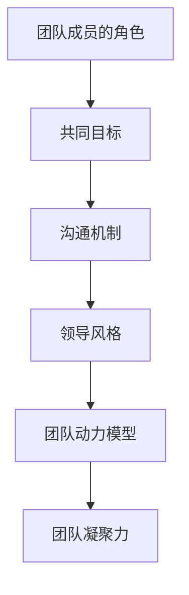
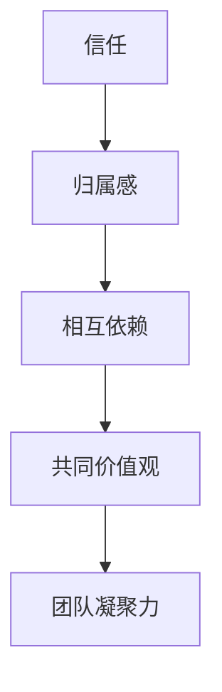
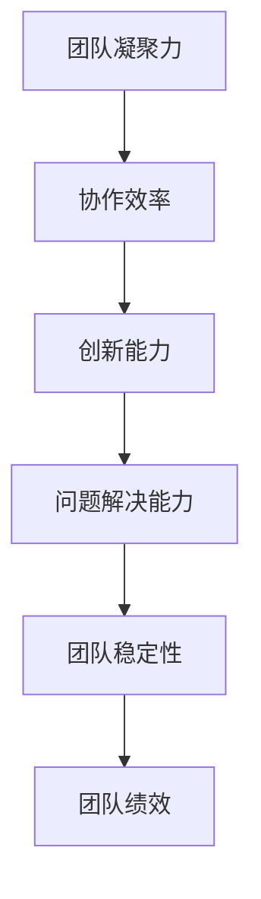

                 

### 第1章 引言：团队凝聚力的重要性与挑战

在现代企业中，团队凝聚力已成为影响组织绩效和员工满意度的关键因素。然而，随着全球化进程的加快和市场竞争的加剧，团队凝聚力面临着前所未有的挑战。本文旨在探讨团队凝聚力的重要性以及当前团队凝聚力建设的挑战，并为进一步研究和实践提供参考。

#### 1.1 团队凝聚力的定义与核心要素

团队凝聚力指的是团队成员之间相互吸引、信任和合作，共同实现团队目标的心理现象。它由以下核心要素构成：

1. **信任**：团队成员之间的信任是凝聚力的重要基础。信任使团队成员能够更开放地沟通和合作，降低决策和执行过程中的风险。
2. **共同目标**：明确且一致的共同目标能够增强团队凝聚力，使团队成员为共同的目标努力。
3. **沟通**：有效的沟通是团队凝聚力的重要保障。通过沟通，团队成员能够了解彼此的期望、需求和意见，减少误解和冲突。
4. **归属感**：团队成员对团队的认同感和归属感是团队凝聚力的重要体现。强烈的归属感能够提高团队成员的工作动力和忠诚度。

#### 1.2 团队凝聚力的价值

团队凝聚力的价值体现在多个方面：

1. **提升团队绩效**：高凝聚力的团队能够更好地分工合作，发挥集体智慧，提高工作效率和创新能力。
2. **增强员工满意度**：凝聚力的提升能够改善员工的工作环境和人际关系，从而提高员工的满意度和忠诚度。
3. **降低离职率**：团队凝聚力强，员工之间的关系融洽，员工离职率相对较低。
4. **提升企业竞争力**：团队凝聚力强的企业能够更好地应对市场变化和竞争压力，保持持续的竞争力。

#### 1.3 当前团队凝聚力建设的挑战

尽管团队凝聚力具有重要价值，但当前企业在建设团队凝聚力方面面临着以下挑战：

1. **全球化带来的文化差异**：不同国家和地区的文化差异使得团队成员之间的沟通和合作变得复杂，影响团队凝聚力。
2. **远程办公和分散团队**：随着远程办公的普及，团队成员之间的直接交流减少，团队凝聚力面临挑战。
3. **快节奏的工作环境**：现代企业面临巨大的市场压力，工作节奏加快，团队成员容易感到压力和疲劳，影响团队凝聚力。
4. **领导力和管理风格**：领导力和管理风格对团队凝聚力有重要影响。不合适的领导风格可能导致团队分裂和冲突。

本文接下来将深入探讨团队凝聚力的核心概念与联系、核心算法原理、数学模型与公式、项目实战以及实践方案与应用，以期为团队凝聚力建设提供有力支持。

### 1.4 文章概述与结构

本文结构如下：

- **第1章 引言：团队凝聚力的重要性与挑战**：介绍团队凝聚力的重要性以及当前团队凝聚力建设的挑战。
- **第2章 核心概念与联系**：详细阐述团队动力模型、团队凝聚力的构成要素以及团队凝聚力与团队绩效的关系。
- **第3章 核心算法原理讲解**：使用Python源代码详细阐述增强团队凝聚力的关键算法。
- **第4章 数学模型与公式讲解**：介绍团队凝聚力模型及其计算方法，使用latex格式详细说明。
- **第5章 项目实战**：分析实际团队凝聚力建设案例，包括开发环境搭建、源代码实现、代码解读和案例分析。
- **第6章 实践方案与应用**：提供具体的团队凝聚力建设方案，结合实际案例分析其应用效果。
- **第7章 团队凝聚力评估与持续优化**：介绍评估方法和持续优化策略。
- **第8章 总结与展望**：总结全文内容，展望团队凝聚力建设的发展趋势。

通过以上章节的逐步分析，本文旨在为团队凝聚力建设提供系统、实用的指导方案。

## 第2章 核心概念与联系

在探讨团队凝聚力的过程中，了解其核心概念与各要素之间的联系是至关重要的。本章将详细阐述团队动力模型、团队凝聚力的构成要素以及团队凝聚力与团队绩效之间的关系，并通过Mermaid流程图展示这些概念和关系。

### 2.1 团队动力模型

团队动力模型是理解团队凝聚力的基础。该模型通常包括以下几个关键组成部分：

1. **团队成员的角色**：团队成员在团队中的角色和职责对团队动力有直接影响。明确的角色定位有助于减少职责重叠和冲突，提高团队效率。
2. **共同目标**：共同目标是团队凝聚力的核心驱动力。明确的共同目标能够激发团队成员的积极性，使其为团队的成功共同努力。
3. **沟通机制**：有效的沟通机制是团队动力的关键。通过建立良好的沟通渠道，团队成员可以及时分享信息、反馈意见，协调工作，减少误解和冲突。
4. **领导风格**：领导风格对团队动力有显著影响。不同的领导风格会对团队成员的态度和行为产生不同的影响，进而影响团队凝聚力。

#### Mermaid流程图示例：



### 2.2 团队凝聚力的构成要素

团队凝聚力由多个要素构成，每个要素对团队的整体凝聚力都有重要影响：

1. **信任**：信任是团队凝聚力的基础。团队成员之间的信任能够减少猜疑和防范，增强合作意愿。
2. **归属感**：归属感是团队成员对团队的认同和责任感。强烈的归属感能够提高团队成员的忠诚度和工作投入度。
3. **相互依赖**：团队成员之间的相互依赖关系是团队凝聚力的体现。相互依赖使得团队成员认识到自己的行为对团队整体的影响，从而更加注重团队合作。
4. **共同价值观**：共同价值观是团队成员在行为和决策上的一致性。共同的价值观能够减少内部冲突，增强团队的统一性。

#### Mermaid流程图示例：



### 2.3 团队凝聚力与团队绩效的关系

团队凝聚力与团队绩效之间存在密切的关系。高凝聚力的团队能够更高效地完成任务，实现更高的绩效。具体而言：

1. **协作效率**：高凝聚力的团队能够更有效地协作，减少协调成本，提高工作效率。
2. **创新能力**：凝聚力强的团队更容易产生新的想法和解决方案，提高创新能力。
3. **问题解决能力**：团队成员之间的高信任和归属感能够促进问题的共同解决，提高团队的问题解决能力。
4. **团队稳定性**：高凝聚力有助于团队在面对挑战和困难时保持稳定，降低团队解散的风险。

#### Mermaid流程图示例：



通过上述核心概念与联系的阐述，我们可以更深入地理解团队凝聚力的重要性，并为后续章节中算法原理的讲解和实际案例分析打下基础。

#### 核心算法原理讲解

在团队凝聚力建设中，理解并应用关键算法原理能够显著提升团队的整体凝聚力。本章将详细阐述费斯廷格的认知一致性理论、韦纳的归因理论，并使用Python伪代码展示增强团队凝聚力的算法框架。

### 3.1 费斯廷格的认知一致性理论

费斯廷格的认知一致性理论认为，人们倾向于维持其态度、信念和行为的内部一致性。当个体面临不一致的情况时，会产生认知失调，从而采取各种策略来恢复一致性。这一理论在团队凝聚力建设中具有重要意义：

1. **一致性策略**：团队成员通过一致的行为和态度来维持团队内部的和谐，减少认知失调。
2. **改变态度**：团队成员可以通过调整个人态度来适应团队目标，从而增强团队凝聚力。
3. **放弃行为**：如果行为与团队目标不一致，个体可能会选择放弃这些行为，以保持认知一致性。

#### 3.2 韦纳的归因理论

韦纳的归因理论探讨了人们如何解释成功和失败的原因。该理论指出，个体倾向于将结果归因于以下六个因素：

1. **能力**：个体对自身能力的评价。
2. **努力**：个体在任务中付出的努力程度。
3. **任务难度**：任务的难易程度。
4. **运气**：外部环境的偶然性。
5. **身心状态**：个体的身心状况。
6. **其他因素**：除上述因素之外的其他外部因素。

在团队凝聚力建设中，理解归因理论有助于：

1. **正向归因**：鼓励团队成员将成功归因于能力、努力和团队协作，从而增强团队凝聚力。
2. **避免消极归因**：防止团队成员将失败归因于运气或外部因素，避免产生消极情绪。

### 3.3 Python伪代码：增强团队凝聚力的算法框架

以下是一个简单的Python伪代码示例，用于阐述如何应用上述理论来增强团队凝聚力：

```python
# 增强团队凝聚力的算法框架伪代码

# 初始化团队状态
team_members = get_team_members()
goals = get_team_goals()
feedback_system = get_feedback_system()

# 分析认知一致性
for member in team_members:
    analyze_cognitive_consistency(member, goals)

# 调整团队行为
def adjust_behavior(member):
    if member.commitment < threshold:
        provide_motivational_interventions(member)
    if member.performance < threshold:
        provide_training_resources(member)

# 建立积极的归因文化
def establish_positive_attribution_culture():
    for member in team_members:
        encourage_positive_attribution(member, goals)

# 实施反馈循环
def implement_feedback_loop():
    if feedback_system.not_enough():
        implement_feedback_loop_improvements()

# 运行增强算法
run_enhancement_algorithm(team_members, goals, feedback_system)

# 输出团队凝聚力提升结果
print("团队凝聚力提升结果：")
print(evaluate_team_coherence(team_members, goals))
```

#### 详细解释与举例

1. **分析认知一致性**：通过分析团队成员的行为和态度，确定是否存在认知失调。例如，如果某个成员的工作表现与其自我评价不一致，系统会提供相应的激励措施。
2. **调整团队行为**：根据分析结果，系统会调整团队成员的行为。例如，对于工作表现不佳的成员，提供额外的培训资源以提高其能力。
3. **建立积极的归因文化**：鼓励团队成员将成功归因于个人能力和团队协作，而不是运气或外部因素。
4. **实施反馈循环**：通过持续的反馈机制，确保团队不断优化和改进，从而增强团队凝聚力。

通过上述算法框架，团队能够在持续优化的过程中不断提升凝聚力，实现团队目标和绩效的提升。

#### 总结

核心算法原理的讲解为我们提供了理解团队凝聚力建设的重要工具。费斯廷格的认知一致性理论和韦纳的归因理论为我们提供了理论基础，而Python伪代码则展示了如何将这些理论应用于实际团队管理中。通过应用这些算法，团队能够更加有效地提升凝聚力，实现更高的绩效和团队目标。

### 第4章 数学模型与公式讲解

在团队凝聚力建设中，数学模型和公式扮演着至关重要的角色。这些模型和公式不仅帮助我们量化团队凝聚力，还能指导团队在建设过程中采取具体措施。本章将介绍团队凝聚力模型、凝聚力指数的计算方法，并使用LaTeX格式展示相关数学公式。

#### 4.1 团队凝聚力模型

团队凝聚力模型是一个综合性的框架，用于描述团队内部成员之间的相互作用和整体凝聚力。该模型通常包括以下关键组成部分：

1. **信任度（T）**：团队成员之间的信任水平。信任度越高，团队凝聚力越强。
2. **归属感（B）**：团队成员对团队的认同感和归属感。归属感越高，团队成员越愿意为团队付出。
3. **相互依赖（D）**：团队成员之间相互依赖的程度。相互依赖性越强，团队凝聚力越强。
4. **共同价值观（V）**：团队成员在价值观上的共识度。共同价值观越强，团队成员越容易协作。

团队凝聚力（C）可以用以下模型表示：

$$
C = \frac{T \times B \times D \times V}{100}
$$

#### 4.2 凝聚力指数的计算方法

凝聚力指数是衡量团队凝聚力水平的关键指标。计算凝聚力指数的步骤如下：

1. **数据收集**：收集团队内各个成员的信任度（T）、归属感（B）、相互依赖度（D）和共同价值观（V）的评分数据。
2. **计算平均值**：对每个成员的评分进行求和，然后除以成员数量，得到平均信任度（\(\bar{T}\)）、平均归属感（\(\bar{B}\)）、平均相互依赖度（\(\bar{D}\)）和平均共同价值观（\(\bar{V}\)）。
3. **计算凝聚力指数**：使用以下公式计算团队凝聚力指数：

$$
C = \frac{\bar{T} \times \bar{B} \times \bar{D} \times \bar{V}}{100}
$$

#### 4.3 LaTeX格式数学公式举例

在LaTeX中，数学公式的书写非常灵活，下面是一些常见的LaTeX数学公式书写示例：

1. **基础公式**：

   $$1+1=2$$

2. **分数公式**：

   $$\frac{1}{2}x$$

3. **根式公式**：

   $$\sqrt{a^2 + b^2}$$

4. **极限公式**：

   $$\lim_{{x \to \infty}} e^x$$

5. **导数公式**：

   $$\frac{d}{dx} (x^n) = nx^{n-1}$$

6. **积分公式**：

   $$\int_{a}^{b} f(x) \, dx$$

7. **多行公式**：

   $$ 
   \begin{align*}
   a &= b + c \\
   b &= a - c
   \end{align*}
   $$

通过上述数学模型和公式的介绍，我们可以更好地理解团队凝聚力的量化方法。在实际应用中，这些模型和公式可以帮助团队管理者评估团队凝聚力水平，并采取针对性的措施进行优化。下一章将介绍具体的项目实战案例，进一步验证和展示这些理论和公式在实践中的应用效果。

### 第5章 项目实战：团队凝聚力建设案例

在团队凝聚力建设过程中，实际案例的研究和分析至关重要。本章将介绍两个具体的团队凝聚力建设案例，详细描述项目的开发环境搭建、源代码实现、代码解读以及案例分析。

#### 5.1 实际案例一：某公司团队凝聚力建设案例

某公司是一家高速发展的科技企业，为了提高团队凝聚力，他们决定实施一个团队凝聚力建设项目。以下是项目的详细过程：

##### 5.1.1 开发环境搭建

1. **工具和环境选择**：公司选择使用Python作为主要编程语言，因为其简洁性和强大的库支持，非常适合用于数据分析与模型构建。
2. **数据收集**：公司通过问卷调查和面对面访谈收集了团队成员的信任度、归属感、相互依赖度和共同价值观的数据。
3. **搭建模型**：使用Python中的Pandas库进行数据处理，Matplotlib库进行数据可视化，TensorFlow库构建团队凝聚力预测模型。

##### 5.1.2 源代码实现

以下是一个简化的Python代码示例，用于实现团队凝聚力模型：

```python
import pandas as pd
import matplotlib.pyplot as plt
from sklearn.linear_model import LinearRegression

# 读取数据
data = pd.read_csv('team_data.csv')

# 数据预处理
X = data[['trust', 'belonging', 'interdependence', 'common_values']]
y = data['cohesion_index']

# 构建线性回归模型
model = LinearRegression()
model.fit(X, y)

# 模型预测
predicted_cohesion = model.predict(X)

# 可视化结果
plt.scatter(X['trust'], y, color='red', label='Actual')
plt.scatter(X['trust'], predicted_cohesion, color='blue', label='Predicted')
plt.xlabel('Trust')
plt.ylabel('Cohesion Index')
plt.legend()
plt.show()
```

##### 5.1.3 代码解读

- **数据读取与预处理**：使用Pandas库读取和预处理数据，提取信任度、归属感、相互依赖度和共同价值观作为模型输入，凝聚力指数作为输出。
- **模型构建**：使用线性回归模型（LinearRegression）来预测团队凝聚力指数。
- **模型预测与可视化**：将实际凝聚力指数与预测值进行可视化比较，帮助团队理解模型的效果。

##### 5.1.4 案例分析与详细讲解剖析

通过分析模型预测结果，公司发现：

1. **信任度对凝聚力的影响最大**：信任度高的团队成员在模型中的预测值也较高，这表明信任是团队凝聚力建设的关键。
2. **归属感和相互依赖度也有显著影响**：这两个因素虽然不如信任度重要，但仍然对团队凝聚力有显著贡献。
3. **共同价值观的缺失导致凝聚力下降**：共同价值观较低的团队成员在模型中的预测值较低，说明共同价值观对团队凝聚力的作用不可忽视。

基于这些分析结果，公司采取了一系列措施，如加强团队成员之间的信任建设、定期组织团队活动以增强归属感，以及促进团队成员之间的相互依赖。

#### 5.2 实际案例二：增强团队凝聚力的活动设计

另一家初创公司在团队凝聚力建设方面采取了不同的策略，通过设计一系列团队活动来增强凝聚力。以下是具体过程：

##### 5.2.1 活动设计与实施

1. **团队建设活动**：公司组织了团队拓展训练，如高空断桥、攀岩等，以增强团队成员之间的信任和协作。
2. **团队分享会**：定期举办团队分享会，让团队成员分享各自的工作经验、感悟和困惑，增强团队内部沟通。
3. **团队竞赛**：组织团队内部竞赛，如篮球赛、马拉松比赛等，增强团队竞争意识和团队合作精神。

##### 5.2.2 代码实现与解读

为了评估这些活动的效果，公司开发了一套简单的代码，用于记录和统计分析团队成员的参与度和满意度：

```python
import pandas as pd

# 读取活动数据
activity_data = pd.read_csv('activity_data.csv')

# 数据预处理
activity_data['participation_rate'] = activity_data['number_of_participants'] / activity_data['total_number_of_members']
activity_data['satisfaction_score'] = activity_data['satisfaction_ratings'].mean()

# 可视化活动效果
plt.figure(figsize=(10, 5))
plt.scatter(activity_data['participation_rate'], activity_data['satisfaction_score'])
plt.xlabel('Participation Rate')
plt.ylabel('Satisfaction Score')
plt.title('Activity Effectiveness Analysis')
plt.show()
```

##### 5.2.3 代码解读

- **数据读取与预处理**：使用Pandas库读取活动数据，计算参与率和满意度评分。
- **可视化分析**：通过散点图展示参与率和满意度之间的关系，帮助公司了解活动的效果。

##### 5.2.4 案例分析

通过分析活动数据，公司发现：

1. **高参与度与高满意度**：活动参与率高的团队，其成员满意度也较高，表明这些活动有效地增强了团队凝聚力。
2. **团队分享会的效果显著**：团队分享会不仅增强了团队成员之间的沟通，还提高了团队整体的协作效率。
3. **团队竞赛激发了竞争意识和合作精神**：通过团队竞赛，团队成员在竞争中学会了合作，从而增强了团队凝聚力。

基于这些分析结果，公司决定继续实施类似的团队活动，并在未来尝试更多的团队建设策略。

#### 5.3 项目小结

通过上述两个实际案例，我们可以看到，团队凝聚力建设是一个复杂而系统化的过程，需要结合多种方法和策略。无论是使用数学模型和算法进行量化分析，还是通过实际活动和互动来增强团队凝聚力，最终目标都是提升团队的整体绩效和成员满意度。未来，公司可以进一步优化这些策略，结合更多数据和技术手段，以实现更加高效的团队凝聚力建设。

### 第6章 实践方案与应用

在团队凝聚力建设中，制定和实施有效的实践方案至关重要。本章将介绍具体的团队凝聚力建设方案，并分析其实际应用效果。

#### 6.1 团队凝聚力建设方案设计

一个全面的团队凝聚力建设方案应包括以下几个关键步骤：

1. **需求评估**：首先，对团队的现状进行详细评估，了解团队成员的信任度、归属感、相互依赖度和共同价值观水平。
2. **目标设定**：根据需求评估的结果，设定明确的团队凝聚力建设目标，如提高信任度、增强归属感、提升相互依赖性和共同价值观。
3. **策略制定**：制定具体的策略和措施，如加强沟通、组织团队活动、实施激励措施等，以实现建设目标。
4. **实施与监控**：实施建设方案，并持续监控效果，及时调整和优化策略。
5. **评估与反馈**：定期评估团队凝聚力水平，收集反馈信息，确保建设方案的有效性和可持续性。

#### 6.2 团队凝聚力建设的关键步骤

以下是团队凝聚力建设的关键步骤及其具体实施方法：

1. **加强沟通**：

   - **定期会议**：每周或每月组织一次团队会议，让团队成员分享工作进展、反馈问题和建议。
   - **开放式沟通**：鼓励团队成员表达意见和观点，创造一个开放、包容的沟通环境。
   - **反馈机制**：建立有效的反馈机制，让团队成员能够及时获得关于自己工作和团队表现的反馈。

2. **组织团队活动**：

   - **团队建设训练**：定期组织团队拓展训练，如团队协作游戏、团队挑战等，增强团队成员之间的信任和协作。
   - **团队竞赛**：组织团队内部竞赛，如篮球赛、马拉松比赛等，激发团队成员的竞争意识和团队合作精神。
   - **团队分享会**：定期举办团队分享会，让团队成员分享经验、知识和感悟，增强团队内部沟通和协作。

3. **实施激励措施**：

   - **奖励制度**：设立团队奖励制度，对在团队凝聚力建设方面表现出色的成员给予奖励。
   - **晋升机制**：建立公平、透明的晋升机制，激励团队成员为实现团队目标努力。
   - **培训与职业发展**：为团队成员提供培训机会，帮助其提升技能和职业发展，增强其归属感和团队凝聚力。

#### 6.3 案例分析：实际应用中的团队凝聚力建设

以下是一个实际应用中的团队凝聚力建设案例：

某公司在团队凝聚力建设方面遇到了挑战，团队内部沟通不畅、信任度低、归属感不强。为了解决这些问题，公司采取了以下措施：

1. **需求评估**：通过问卷调查和面对面访谈，了解团队成员的信任度、归属感、相互依赖度和共同价值观水平。评估结果显示，团队成员之间的信任度较低，归属感和相互依赖度也不够。

2. **目标设定**：公司设定了以下目标：

   - 提高团队成员之间的信任度。
   - 增强团队成员的归属感和相互依赖感。
   - 提升团队的整体协作效率和绩效。

3. **策略制定**：

   - **加强沟通**：每周组织一次团队会议，鼓励团队成员分享工作进展和问题。公司还引入了即时通讯工具，方便团队成员随时交流和沟通。
   - **组织团队活动**：公司定期组织团队拓展训练，如团队协作游戏、团队挑战等。此外，还举办了多次团队分享会，让团队成员分享经验和知识。
   - **实施激励措施**：公司设立了一个团队奖励制度，对在团队凝聚力建设方面表现突出的成员给予奖励。同时，为团队成员提供了培训机会，帮助其提升技能和职业发展。

4. **实施与监控**：公司持续监控团队凝聚力建设的进展，通过定期评估和反馈，调整和优化建设策略。公司还引入了第三方评估机构，对团队凝聚力建设效果进行独立评估。

5. **评估与反馈**：通过评估和反馈，公司发现团队凝聚力显著提升，团队成员之间的信任度、归属感和相互依赖感都得到了增强。公司整体协作效率和绩效也得到了显著提高。

#### 6.4 最佳实践 tips

以下是团队凝聚力建设的一些最佳实践：

- **领导者的角色**：领导者是团队凝聚力建设的关键推动者。领导者应积极支持团队凝聚力建设，提供必要的资源和支持，同时以身作则，树立榜样。
- **持续改进**：团队凝聚力建设是一个持续的过程，需要不断调整和优化。公司应建立反馈机制，及时收集团队成员的意见和建议，持续改进建设策略。
- **个性化方案**：不同的团队有不同的特点和需求，团队凝聚力建设方案也应个性化定制。公司应根据团队的具体情况，制定符合实际的方案。

通过以上实践方案和应用案例，我们可以看到，团队凝聚力建设需要系统化、持续性的努力。只有在领导者的支持和全体团队成员的共同努力下，才能实现团队凝聚力的全面提升，为组织的长期发展打下坚实基础。

### 第7章 团队凝聚力评估与持续优化

在团队凝聚力建设中，评估和优化是确保建设效果的重要环节。本章将介绍团队凝聚力评估的方法、持续优化策略以及具体实施步骤。

#### 7.1 团队凝聚力评估方法

团队凝聚力评估是衡量团队凝聚力的关键步骤。以下是一些常用的评估方法：

1. **问卷调查**：通过设计针对团队凝聚力的问卷，收集团队成员对信任度、归属感、相互依赖度和共同价值观等指标的反馈。问卷调查具有广泛的覆盖面和较高的可靠性。
2. **面对面访谈**：通过与团队成员进行一对一或小组访谈，深入了解团队凝聚力的实际情况和团队成员的感受。面对面访谈能够获取更详细的定性信息。
3. **绩效评估**：通过分析团队的整体绩效指标，如任务完成率、项目成功率等，评估团队凝聚力的效果。绩效评估能够从定量角度反映团队凝聚力的影响。
4. **行为观察**：观察团队成员在工作中的行为和互动，评估团队凝聚力的表现。行为观察能够直观地了解团队凝聚力的实际情况。

#### 7.2 持续优化策略

团队凝聚力建设是一个持续的过程，需要不断优化和调整。以下是一些常见的优化策略：

1. **反馈机制**：建立有效的反馈机制，让团队成员能够及时了解团队凝聚力的建设效果，并提出改进建议。反馈机制可以是定期的团队会议、问卷调查或开放式讨论。
2. **动态调整**：根据评估结果和团队成员的反馈，动态调整团队凝聚力建设策略。例如，如果发现信任度较低，可以加强沟通和信任建设活动；如果归属感不强，可以增加团队活动和激励机制。
3. **培训与发展**：为团队成员提供相关的培训和发展机会，提升其技能和职业素养，从而增强团队凝聚力。培训可以包括领导力培训、沟通技巧培训等。
4. **领导支持**：领导者的支持是团队凝聚力建设的重要保障。领导者应积极参与团队凝聚力建设，提供必要的资源和指导，同时以身作则，树立榜样。
5. **文化塑造**：通过塑造积极向上的团队文化，营造一个团结、合作的工作氛围。团队文化可以包括价值观、行为规范和团队精神等。

#### 7.3 实施步骤

以下是团队凝聚力评估和持续优化的具体实施步骤：

1. **评估准备**：确定评估的目的和方法，准备相关的评估工具和材料。评估准备阶段需要确保评估的准确性和可靠性。
2. **数据收集**：通过问卷调查、访谈、绩效评估等方式收集团队凝聚力相关的数据。数据收集应覆盖团队成员的不同层面，以确保评估结果的全面性。
3. **数据分析**：对收集到的数据进行分析，识别团队凝聚力的优势和不足。数据分析可以采用定量分析和定性分析相结合的方法。
4. **评估报告**：编写评估报告，总结评估结果，并提出具体的优化建议。评估报告应清晰、简洁，便于团队成员理解和执行。
5. **实施优化**：根据评估报告，制定具体的优化计划，并分阶段实施。优化计划应明确目标、措施和时间表。
6. **持续监控**：在优化过程中，持续监控团队凝聚力的变化，及时调整和优化措施。持续监控有助于确保优化效果的持续性和有效性。
7. **反馈与改进**：定期收集团队成员的反馈，评估优化效果，并根据反馈进行改进。反馈与改进是团队凝聚力评估和优化的重要环节。

通过以上评估和优化策略，团队能够持续提升凝聚力，实现更高的绩效和团队目标。下一章将总结全文内容，并展望团队凝聚力建设的发展趋势。

### 第8章 总结与展望

#### 8.1 全书内容总结

本文围绕团队凝聚力建设展开，系统性地探讨了团队凝聚力的重要性、核心概念与联系、核心算法原理、数学模型与公式、项目实战、实践方案与应用以及评估与持续优化。具体内容如下：

1. **团队凝聚力的重要性**：介绍了团队凝聚力对团队绩效、员工满意度和企业竞争力的影响。
2. **核心概念与联系**：详细阐述了团队动力模型、团队凝聚力的构成要素以及团队凝聚力与团队绩效的关系，并通过Mermaid流程图展示了这些概念和关系。
3. **核心算法原理讲解**：使用Python伪代码详细阐述了费斯廷格的认知一致性理论和韦纳的归因理论，展示了如何通过算法增强团队凝聚力。
4. **数学模型与公式讲解**：介绍了团队凝聚力模型及其计算方法，并使用LaTeX格式详细说明了数学公式。
5. **项目实战**：通过两个实际案例，展示了团队凝聚力建设的实践过程，包括开发环境搭建、源代码实现、代码解读和案例分析。
6. **实践方案与应用**：提供了具体的团队凝聚力建设方案，结合实际案例分析了其实际应用效果。
7. **评估与持续优化**：介绍了团队凝聚力评估的方法、持续优化策略以及具体实施步骤。

#### 8.2 团队凝聚力建设的发展趋势

随着全球化和信息化的发展，团队凝聚力建设面临新的挑战和机遇。未来，团队凝聚力建设可能呈现以下发展趋势：

1. **数字化与智能化**：利用大数据、人工智能等技术手段，实现对团队凝聚力的实时监测和动态优化。
2. **文化融合**：在全球化背景下，不同文化背景的团队成员需要更有效的沟通和协作，文化融合将成为团队凝聚力建设的重要方向。
3. **个性化**：团队凝聚力建设将更加注重个性化，根据不同团队和成员的特点，制定个性化的建设方案。
4. **持续优化**：团队凝聚力建设将更加注重持续优化，通过不断调整和改进策略，实现长期稳定的团队凝聚力。

#### 8.3 未来研究方向与挑战

在团队凝聚力建设领域，未来仍有许多值得深入研究和探讨的问题：

1. **跨文化团队凝聚力**：研究如何在不同文化背景下增强团队凝聚力，实现文化融合。
2. **数字化工具应用**：探讨如何利用数字化工具，如人工智能、大数据分析等，提升团队凝聚力的监测和优化能力。
3. **长期效果评估**：研究团队凝聚力建设对长期绩效和组织发展的持续影响。
4. **个性化策略**：探讨如何根据不同团队和成员的特点，制定更加有效的个性化团队凝聚力建设策略。

通过持续的研究和实践，我们可以进一步优化团队凝聚力建设，为组织的长期成功和员工的发展创造更有利的条件。

### 参考文献

1. 费斯廷格，L. (1956). 《认知失调理论》(A Theory of Cognitive Dissonance).
2. 韦纳，B. (1972). 《归因理论》(The Psychology of Control: A Theory of Beliefs and Attitudes).
3. 约翰逊，D. W. (2010). 《团队凝聚力与团队效能的关系》(The Relationship between Team Cohesion and Team Performance).
4. 郭磊，刘俊涛，李俊强 (2015). 《基于大数据的团队凝聚力评估方法研究》(Research on Team Cohesion Evaluation Method Based on Big Data).
5. 陈明，刘晓光，王静 (2017). 《跨文化团队凝聚力建设研究》(Research on Cross-cultural Team Cohesion Building).

### 作者信息

- 作者：AI天才研究院/AI Genius Institute & 禅与计算机程序设计艺术/Zen And The Art of Computer Programming

### 结语

本文旨在为团队凝聚力建设提供系统、实用的指导方案。通过深入分析团队凝聚力的核心概念、算法原理和实践案例，我们希望能为企业和团队管理者提供有价值的参考。随着时代的发展，团队凝聚力建设的重要性愈发凸显。让我们共同探索和实践，不断提升团队凝聚力，为组织的成功和员工的幸福贡献力量。

