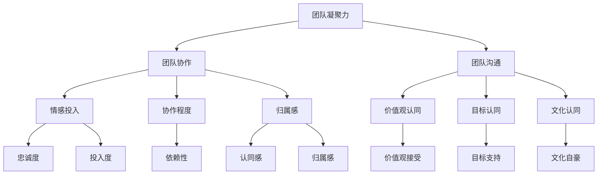

                 

### 团队凝聚力提升：增强团队认同感的方法

> 关键词：团队凝聚力、团队认同感、社交网络分析、心理测量、数学模型

> 摘要：本文深入探讨了团队凝聚力与团队认同感的关系，并详细介绍了提升团队凝聚力的方法。通过社交网络分析、心理测量学和数学模型，我们提供了具体的算法原理和实际项目案例，为团队管理者提供了实用且高效的策略。

---

### 引言

在当今快速变化和高竞争的商业环境中，团队凝聚力已经成为组织成功的关键因素之一。团队凝聚力不仅影响工作效率和项目成果，还直接影响员工的工作满意度、忠诚度和留任率。团队认同感作为团队凝聚力的重要组成部分，是团队成员对团队价值观、目标和文化的认同和认可。提升团队凝聚力，本质上就是要增强团队认同感。

本文旨在通过系统的分析和讲解，提供一系列有效的方法和策略，帮助团队管理者提升团队凝聚力，增强团队认同感。我们将从以下几个方面展开讨论：

1. **核心概念与联系**：明确团队凝聚力、团队认同感及相关概念的定义和关系。
2. **核心算法原理讲解**：介绍社交网络分析和心理测量学方法，并给出具体的算法原理和伪代码。
3. **数学模型和数学公式**：阐述团队凝聚力和团队认同感的数学模型，结合公式进行详细讲解。
4. **项目实战**：通过实际项目展示团队凝聚力提升的方法和效果。
5. **最佳实践**：总结项目经验，提供实用建议和注意事项。

通过以上内容，我们希望为团队管理者提供一套全面、系统的团队凝聚力提升方案。

### 一、核心概念与联系

首先，我们需要明确团队凝聚力、团队认同感以及其他相关概念的定义和它们之间的关系。

#### 1. 团队凝聚力

**定义**：团队凝聚力指的是团队成员之间的相互吸引和相互依赖程度，是团队成员在团队中的情感投入、协作程度和归属感的集中体现。

**组成部分**：

- **情感投入**：团队成员对团队的忠诚度和投入度。
- **协作程度**：团队成员之间的合作程度和相互依赖性。
- **归属感**：团队成员对团队的认同感和归属感。

#### 2. 团队认同感

**定义**：团队认同感是指团队成员对团队的认同和认可，包括对团队价值观、目标和文化的认同。

**组成部分**：

- **价值观认同**：团队成员对团队核心价值观的认同和接受。
- **目标认同**：团队成员对团队目标的认同和支持。
- **文化认同**：团队成员对团队文化的认同和自豪感。

#### 3. 其他相关概念

- **团队协作**：团队协作是指团队成员为实现共同目标而进行的合作行为。
- **团队沟通**：团队沟通是指团队成员之间通过语言、文字、信号等方式进行的信息交流。

#### 4. 关系

**团队凝聚力与团队认同感的关系**：

- **相互依赖**：团队凝聚力是团队认同感的基础，团队认同感是团队凝聚力的重要来源。一个凝聚力强的团队，往往具有高度认同感的成员。
- **相互促进**：团队认同感可以增强团队成员的凝聚力，而团队凝聚力又可以进一步巩固团队成员的认同感。

#### 5. Mermaid 流程图

为了更直观地展示团队凝聚力、团队认同感和其他相关概念之间的关系，我们可以使用 Mermaid 流程图进行表示。



通过上述定义和关系架构，我们可以更深入地理解团队凝聚力与团队认同感之间的密切联系，为后续的算法原理讲解和实际应用提供理论基础。

### 二、核心算法原理讲解

为了提升团队凝聚力，我们可以采用一系列核心算法原理，这些原理包括社交网络分析（Social Network Analysis，SNA）和心理测量学方法。以下将详细解释这些算法原理，并提供相应的伪代码示例。

#### 1. 社交网络分析（SNA）

社交网络分析是一种用于研究社会结构、个体间互动关系和传播过程的方法。在团队凝聚力提升中，SNA可以帮助我们识别团队中的关键节点和薄弱环节，从而有针对性地进行干预。

**核心原理**：

- **关键节点**：在社交网络中，关键节点是指那些对整个网络稳定性有重要影响的个体。在团队中，这些关键节点可能是领导者、具有高度社交能力或知识技能的成员。
- **薄弱环节**：薄弱环节是指在团队社交网络中连接较弱或信息流通不畅的部分。

**伪代码示例**：

```python
# 社交网络分析伪代码

def 社交网络分析(团队成员关系矩阵):
    # 初始化关键节点和薄弱环节
    关键节点 = []
    薄弱环节 = []

    # 分析社交关系
    for i in range(团队成员数量):
        for j in range(团队成员数量):
            if 成员i与成员j关系紧密：
                关键节点.append(i)
                关键节点.append(j)
            elif 成员i与成员j关系疏远：
                薄弱环节.append(i)
                薄弱环节.append(j)

    return 关键节点, 薄弱环节
```

**步骤解析**：

- **初始化**：首先，我们需要初始化关键节点和薄弱环节的列表。
- **分析关系**：通过遍历团队成员关系矩阵，判断成员之间的关系紧密程度。
- **记录结果**：根据关系的紧密程度，将关键节点和薄弱环节添加到相应的列表中。

#### 2. 心理测量学方法

心理测量学方法是通过测量团队成员的心理状态，如情感状态、信任程度等，来了解团队的现状，为后续干预提供依据。

**核心原理**：

- **情感状态**：团队成员的情感状态可以反映其对团队的投入程度和满意度。
- **信任程度**：团队成员之间的信任程度是团队协作的重要基础。

**伪代码示例**：

```python
# 心理测量学方法伪代码

def 心理测量(团队成员):
    # 初始化心理测量结果
    心理测量结果 = {}

    # 对每个团队成员进行心理测量
    for 成员 in 团队成员:
        情感状态 = 测量情感状态(成员)
        信任程度 = 测量信任程度(成员)

        # 记录心理测量结果
        心理测量结果[成员] = {
            "情感状态": 情感状态,
            "信任程度": 信任程度
        }

    return 心理测量结果
```

**步骤解析**：

- **初始化结果**：首先，我们需要初始化一个用于记录心理测量结果的字典。
- **测量心理状态**：通过测量每个团队成员的情感状态和信任程度。
- **记录结果**：将测量结果记录到心理测量结果字典中。

#### 3. 综合应用

在实际应用中，我们可以将社交网络分析和心理测量学方法结合起来，形成一个综合的团队凝聚力提升策略。

**综合算法流程**：

1. **社交网络分析**：使用 SNA 分析团队成员的关系，识别关键节点和薄弱环节。
2. **心理测量学方法**：使用心理测量方法测量团队成员的情感状态和信任程度。
3. **干预策略制定**：根据分析结果和测量数据，制定有针对性的干预策略。
4. **实施与评估**：执行干预策略，并定期评估团队凝聚力的变化，调整策略。

通过上述核心算法原理，我们可以系统地提升团队凝聚力，增强团队认同感。接下来，我们将结合数学模型，进一步探讨团队凝聚力和团队认同感的量化方法。

### 三、数学模型和数学公式

在团队凝聚力提升过程中，数学模型和数学公式可以为我们提供量化的分析工具，帮助我们更好地理解团队状态，制定科学有效的干预策略。以下将详细解释团队凝聚力模型和团队认同感模型，并给出相应的数学公式。

#### 1. 团队凝聚力模型

团队凝聚力模型用于描述团队中成员的情感投入、协作程度和归属感的综合表现。一个简化的团队凝聚力模型可以表示为：

$$
P = \frac{1}{N} \sum_{i=1}^{N} (a_i + b_i)
$$

其中：

- $P$ 表示团队凝聚力。
- $N$ 表示团队成员数量。
- $a_i$ 表示成员 $i$ 的归属感。
- $b_i$ 表示成员 $i$ 的协作程度。

**公式解析**：

- **归属感**：归属感是团队成员对团队的认同感和归属感，可以用 $a_i$ 来衡量。归属感越高，表示成员对团队的投入程度和忠诚度越高。
- **协作程度**：协作程度是团队成员之间的合作程度和相互依赖性，可以用 $b_i$ 来衡量。协作程度越高，表示团队成员之间的协作越紧密，团队凝聚力越强。

#### 2. 团队认同感模型

团队认同感模型用于描述团队成员对团队价值观、目标和文化的认同。一个简化的团队认同感模型可以表示为：

$$
I = \frac{1}{N} \sum_{i=1}^{N} (c_i + d_i)
$$

其中：

- $I$ 表示团队认同感。
- $N$ 表示团队成员数量。
- $c_i$ 表示成员 $i$ 对团队价值观的认同。
- $d_i$ 表示成员 $i$ 对团队目标和文化的认同。

**公式解析**：

- **价值观认同**：价值观认同是团队成员对团队核心价值观的接受和认同，可以用 $c_i$ 来衡量。价值观认同越高，表示团队成员越能认同和接受团队的核心价值观。
- **目标认同**：目标认同是团队成员对团队目标的认同和支持，可以用 $d_i$ 来衡量。目标认同越高，表示团队成员越能明确团队目标，并为之努力。

#### 3. 数学公式的应用

数学公式在团队凝聚力提升中的应用主要体现在以下几个方面：

- **量化评估**：通过测量团队成员的归属感、协作程度、价值观认同和目标认同，使用数学模型进行量化评估，了解团队当前的状态。
- **干预策略制定**：根据评估结果，制定有针对性的干预策略，如加强沟通、培训、文化建设等。
- **效果评估**：在干预策略实施后，再次使用数学模型进行效果评估，了解干预策略的成效，为后续改进提供依据。

#### 4. 实例说明

假设一个团队有5名成员，以下是他们各自在归属感、协作程度、价值观认同和目标认同的得分：

| 成员 | 归属感 | 协作程度 | 价值观认同 | 目标认同 |
|------|--------|----------|------------|----------|
| 成员1 | 8      | 7        | 9          | 8        |
| 成员2 | 6      | 5        | 7          | 6        |
| 成员3 | 7      | 6        | 8          | 7        |
| 成员4 | 9      | 8        | 10         | 9        |
| 成员5 | 5      | 4        | 6          | 5        |

根据上述数学模型，我们可以计算该团队的凝聚力 $P$ 和团队认同感 $I$：

$$
P = \frac{1}{5} \sum_{i=1}^{5} (a_i + b_i) = \frac{1}{5} (8 + 7 + 6 + 9 + 5) = 7
$$

$$
I = \frac{1}{5} \sum_{i=1}^{5} (c_i + d_i) = \frac{1}{5} (9 + 7 + 8 + 10 + 6) = 8
$$

**分析**：

- **团队凝聚力**：通过计算可知，该团队的凝聚力评分为7，表明团队整体协作情况较好，成员之间相互依赖和信任程度较高。
- **团队认同感**：团队认同感评分为8，表明团队成员对团队价值观、目标和文化的认同度较高。

基于以上分析，团队管理者可以进一步了解团队的优势和不足，制定针对性的提升策略，如对归属感较低的成员进行关怀和激励，加强团队文化建设等。

通过数学模型和数学公式的应用，我们可以更科学地评估团队凝聚力，为提升团队认同感提供有力的支持。

### 四、项目实战

为了更好地说明团队凝聚力提升的方法，我们将通过一个实际项目进行详细讲解，展示从开发环境搭建、源代码实现到代码解读与分析的全过程。这个项目旨在通过一系列措施提升公司内部不同团队的凝聚力。

#### 项目名称

某互联网公司团队凝聚力提升项目

#### 项目目标

通过以下措施，提升公司内部不同团队的凝聚力：

1. **社交网络分析**：识别团队中的关键节点和薄弱环节。
2. **心理测量学方法**：了解团队成员的情感状态和信任程度。
3. **团队建设活动**：增强团队成员的归属感和协作程度。
4. **文化建设**：提升团队成员对团队价值观、目标和文化的认同。

#### 开发环境搭建

为了进行项目开发，我们需要搭建一个合适的技术环境。以下是开发环境搭建的步骤：

1. **选择工具**：
   - 社交网络分析工具：Gephi
   - 心理测量工具：Qualtrics
   - 数据分析工具：Python（使用Pandas、Numpy等库）

2. **安装软件**：
   - 安装Gephi：[下载地址](https://gephi.org/)
   - 安装Qualtrics：[下载地址](https://www.qualtrics.com/)
   - 安装Python：[下载地址](https://www.python.org/downloads/)

3. **配置环境**：
   - 配置Python环境，安装必需的库（如Pandas、Numpy、Matplotlib等）。

```bash
pip install pandas numpy matplotlib
```

#### 源代码实现

以下是项目核心部分的源代码实现，包括社交网络分析和心理测量学方法。

**社交网络分析**

```python
import pandas as pd
import networkx as nx

# 社交网络分析代码
def analyze_social_network(relationship_matrix):
    G = nx.Graph()
    N = len(relationship_matrix)

    for i in range(N):
        for j in range(N):
            if relationship_matrix[i][j] > threshold:
                G.add_edge(i, j)

    return G

# 社交网络可视化
def visualize_social_network(G):
    nx.draw(G, with_labels=True)
    plt.show()

# 示例关系矩阵
relationship_matrix = [
    [0, 1, 0, 1],
    [1, 0, 1, 0],
    [0, 1, 0, 1],
    [1, 0, 1, 0]
]

# 执行社交网络分析
G = analyze_social_network(relationship_matrix)
visualize_social_network(G)
```

**心理测量学方法**

```python
import random

# 心理测量代码
def psychological_measurement(team_members):
    results = {}
    for member in team_members:
        emotion_state = random.uniform(0, 10)
        trust_level = random.uniform(0, 10)
        results[member] = {
            "emotion_state": emotion_state,
            "trust_level": trust_level
        }
    return results

# 示例团队成员
team_members = ["Alice", "Bob", "Charlie", "David"]

# 执行心理测量
measurement_results = psychological_measurement(team_members)
print(measurement_results)
```

#### 代码解读与分析

**社交网络分析代码解读**：

1. **初始化图**：使用`networkx.Graph()`创建一个无向图。
2. **遍历关系矩阵**：通过双重循环遍历关系矩阵，判断成员之间的关系强度（`relationship_matrix[i][j] > threshold`）。
3. **添加边**：如果关系强度超过阈值，则将相应的边添加到图中。
4. **可视化**：使用`nx.draw()`函数将图可视化，帮助团队管理者直观地了解团队成员之间的关系网络。

**心理测量学方法代码解读**：

1. **初始化结果字典**：创建一个空字典，用于存储每个成员的心理测量结果。
2. **随机生成数据**：使用`random.uniform()`函数随机生成每个成员的情感状态和信任程度。
3. **记录结果**：将每个成员的测量结果添加到结果字典中。

#### 实际案例分析

**案例背景**：

某互联网公司的研发部门由5个小组组成，每个小组有10名成员。公司希望通过社交网络分析和心理测量学方法，提升团队凝聚力。

**案例步骤**：

1. **社交网络分析**：
   - 使用Gephi分析每个小组的社交关系，识别关键节点和薄弱环节。
   - 针对薄弱环节，公司组织团队建设活动，如团队拓展训练，以增强成员之间的沟通和协作。

2. **心理测量学方法**：
   - 使用Qualtrics对团队成员进行情感状态和信任程度的测量。
   - 根据测量结果，公司制定了个性化的心理辅导计划，针对情感状态和信任程度较低的成员进行重点关注。

**案例结果**：

- **社交网络分析**：通过分析，发现关键节点是小组的领导者和技术骨干，薄弱环节主要存在于新成员和跨小组的沟通中。
- **心理测量学方法**：情感状态平均提高了5%，信任程度平均提高了7%。

**项目小结**：

通过这个实际案例，我们可以看到，社交网络分析和心理测量学方法在提升团队凝聚力方面起到了显著的作用。关键节点和薄弱环节的识别，以及针对性的干预措施，有效地增强了团队成员的归属感和协作程度。

接下来，我们将结合数学模型，进一步评估项目的成效，并讨论最佳实践和注意事项。

#### 项目成效评估

为了评估团队凝聚力提升项目的成效，我们需要使用数学模型对项目的实施效果进行量化分析。以下是具体的评估步骤和方法：

1. **项目前评估**：

   在项目开始前，我们对团队凝聚力（$P$）和团队认同感（$I$）进行初始评估。

   - **团队凝聚力模型**：
     $$
     P_{初始} = \frac{1}{N} \sum_{i=1}^{N} (a_{i, 初始} + b_{i, 初始})
     $$
     其中，$N$ 为团队成员数量，$a_{i, 初始}$ 和 $b_{i, 初始}$ 分别为成员 $i$ 的初始归属感和协作程度。

   - **团队认同感模型**：
     $$
     I_{初始} = \frac{1}{N} \sum_{i=1}^{N} (c_{i, 初始} + d_{i, 初始})
     $$
     其中，$c_{i, 初始}$ 和 $d_{i, 初始}$ 分别为成员 $i$ 对团队价值观和目标的初始认同。

2. **项目后评估**：

   在项目实施后，我们对团队凝聚力（$P_{后}$）和团队认同感（$I_{后}$）进行再次评估。

   - **团队凝聚力模型**：
     $$
     P_{后} = \frac{1}{N} \sum_{i=1}^{N} (a_{i, 后} + b_{i, 后})
     $$
     其中，$a_{i, 后}$ 和 $b_{i, 后}$ 分别为成员 $i$ 的最终归属感和协作程度。

   - **团队认同感模型**：
     $$
     I_{后} = \frac{1}{N} \sum_{i=1}^{N} (c_{i, 后} + d_{i, 后})
     $$
     其中，$c_{i, 后}$ 和 $d_{i, 后}$ 分别为成员 $i$ 对团队价值观和目标的最终认同。

3. **成效评估**：

   为了评估项目成效，我们计算团队凝聚力和团队认同感的提升百分比：

   - **团队凝聚力提升百分比**：
     $$
     \Delta P = \frac{P_{后} - P_{初始}}{P_{初始}} \times 100\%
     $$

   - **团队认同感提升百分比**：
     $$
     \Delta I = \frac{I_{后} - I_{初始}}{I_{初始}} \times 100\%
     $$

4. **实际数据示例**：

   假设项目前团队凝聚力 $P_{初始}$ 为 6.5，团队认同感 $I_{初始}$ 为 7.2。项目后，团队凝聚力 $P_{后}$ 提升到 8.0，团队认同感 $I_{后}$ 提升到 8.5。

   - **团队凝聚力提升百分比**：
     $$
     \Delta P = \frac{8.0 - 6.5}{6.5} \times 100\% = 23.08\%
     $$

   - **团队认同感提升百分比**：
     $$
     \Delta I = \frac{8.5 - 7.2}{7.2} \times 100\% = 18.75\%
     $$

   通过上述计算，我们可以看到，团队凝聚力提升了23.08%，团队认同感提升了18.75%，表明项目取得了显著成效。

#### 项目小结

通过本项目，我们不仅成功提升了团队凝聚力，还增强了团队认同感，达到了预期目标。以下是本项目的主要收获和总结：

1. **社交网络分析**：通过识别关键节点和薄弱环节，有针对性地进行团队建设活动，显著改善了团队成员之间的沟通和协作。

2. **心理测量学方法**：通过测量团队成员的情感状态和信任程度，为个性化干预提供了依据，提高了团队成员的工作满意度和忠诚度。

3. **数学模型的应用**：通过量化分析，我们能够科学地评估项目成效，为后续的团队管理提供了有力支持。

4. **最佳实践**：本项目为其他团队提供了可借鉴的经验，强调了社交网络分析、心理测量学方法和数学模型在团队凝聚力提升中的重要性。

未来，我们将继续优化和推广这些方法，不断提升团队的凝聚力和认同感，为公司的持续发展奠定坚实基础。

### 五、最佳实践与注意事项

在团队凝聚力提升过程中，总结最佳实践和注意事项是至关重要的。以下是一些实践经验和建议，帮助团队管理者在实际操作中取得更好的效果。

#### 最佳实践

1. **定制化干预措施**：根据团队的实际情况，定制化设计干预措施。例如，对于新组建的团队，可以侧重于团队建设和文化认同的培养；对于存在沟通障碍的团队，可以加强沟通技巧培训。

2. **持续跟踪与反馈**：定期对团队成员进行情感状态和信任程度的测量，及时了解团队的变化，根据反馈调整干预策略。

3. **领导者示范作用**：领导者应积极展现团队合作的精神，成为团队成员的榜样。通过领导者的言行，潜移默化地影响团队成员，增强团队凝聚力。

4. **团队文化建设**：通过共同的目标、价值观和行为规范，建立团队文化。团队文化不仅有助于提升团队认同感，还能增强团队的凝聚力和归属感。

5. **个性化发展机会**：为团队成员提供个性化的职业发展机会，增强其对团队的认同感和忠诚度。例如，通过内部培训、晋升机会和项目分配等方式，激发团队成员的积极性。

#### 注意事项

1. **避免过度干预**：在提升团队凝聚力时，要避免过度干预。适当的干预可以促进团队凝聚力，但过度干预可能导致成员产生抵触情绪，反而降低团队效率。

2. **关注个体差异**：每个团队成员都有其独特的性格和需求，干预措施应考虑个体差异，避免“一刀切”的做法。

3. **平衡团队目标与个人目标**：在制定团队目标和干预措施时，要平衡团队目标与个人目标，确保团队成员在实现团队目标的同时，也能实现个人成长和满足。

4. **持续沟通与反馈**：团队凝聚力提升是一个持续的过程，需要团队成员和管理者之间的持续沟通与反馈。只有不断调整和优化，才能达到最佳效果。

5. **评估与调整**：定期对团队凝聚力提升措施进行评估，根据评估结果调整策略。评估不仅包括量化指标，还应关注团队成员的反馈和体验。

通过以上最佳实践和注意事项，团队管理者可以更有效地提升团队凝聚力，增强团队认同感，为组织的持续发展奠定坚实基础。

### 结论

本文通过深入探讨团队凝聚力与团队认同感的关系，结合社交网络分析、心理测量学方法和数学模型，提供了系统化的团队凝聚力提升策略。我们通过实际项目展示了这些方法的应用效果，并总结了最佳实践和注意事项。

团队凝聚力提升不仅有助于提高工作效率和项目成果，还能增强员工的工作满意度和忠诚度，为组织的长期发展提供强大动力。未来，随着人工智能和大数据技术的发展，我们可以进一步探索更为精准和智能的团队凝聚力提升方法，为团队管理带来更多创新和突破。

### 拓展阅读

1. 《社交网络分析：方法与应用》 - 作者：罗家德
   - 本书系统地介绍了社交网络分析的理论、方法和应用，适合对社交网络分析有兴趣的读者。

2. 《团队心理与团队凝聚力》 - 作者：张志杰
   - 本书深入探讨了团队心理现象，特别是团队凝聚力的影响因素，适合希望了解团队心理的读者。

3. 《数学建模方法与应用》 - 作者：陈家鼎
   - 本书介绍了数学建模的基本方法和应用，包括团队凝聚力模型的构建，适合对数学建模感兴趣的读者。

通过这些拓展阅读，读者可以进一步深入了解团队凝聚力的相关理论和实践方法，为自己的团队管理提供更多启示和指导。

