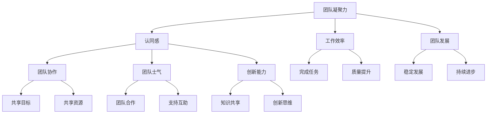

                 

## 《团队凝聚力提升：增强认同感的实践策略》

**关键词**：团队凝聚力、认同感、实践策略、沟通机制、团队协作、冲突处理

**摘要**：本文旨在探讨团队凝聚力提升的方法和策略，特别是如何通过增强认同感来实现这一目标。文章首先介绍了团队凝聚力和认同感的基本概念及其重要性，然后详细阐述了提升团队凝聚力的实践策略，包括制定团队目标与愿景、建立有效的沟通机制、强化团队协作与分工、提升团队成员的认同感以及应对团队冲突与问题。通过案例分析和实际应用，文章提供了具体的实施方法和技巧，旨在为团队管理者提供有价值的参考。

---

### 引言

在信息技术迅速发展的今天，团队协作已经成为企业成功的关键因素之一。一个高凝聚力的团队不仅能够提高工作效率，还能激发团队成员的创造力和潜力，从而在激烈的竞争中脱颖而出。而团队凝聚力的重要支撑因素之一便是认同感。认同感是指团队成员对团队目标、价值观和文化的一致认同和归属感。当团队成员之间有强烈的认同感时，他们更愿意为团队目标共同努力，更愿意在遇到困难时互相支持，从而提高团队的整体效能。

团队凝聚力和认同感之间的关系可以理解为因果关系。高凝聚力往往源于团队成员之间的强烈认同感。当团队成员对团队目标和价值观有深刻理解并感到自己是团队不可或缺的一部分时，他们就会表现出更高的工作积极性和团队精神。反之，如果团队成员缺乏认同感，团队凝聚力就会受到削弱，工作效率和团队效能也会降低。

本文将从以下几个方面展开讨论：

1. **理论基础**：介绍团队凝聚力和认同感的基本概念、重要性及其相互关系。
2. **实践策略**：详细阐述提升团队凝聚力的具体策略，包括制定团队目标与愿景、建立有效的沟通机制、强化团队协作与分工、提升团队成员的认同感以及应对团队冲突与问题。
3. **案例分析**：通过实际案例展示实践策略的应用效果，分析成功和挑战，为团队管理者提供参考。
4. **总结与展望**：总结全文内容，展望未来研究方向。

### 理论基础

#### 团队凝聚力的定义与重要性

团队凝聚力是指团队成员之间相互吸引、相互支持、共同协作的一种力量。它不仅反映了团队成员之间的情感联系，还体现了他们在共同目标下的合作意识和协作精神。团队凝聚力的高低直接影响到团队的工作效率和效能。

团队凝聚力的重要性体现在以下几个方面：

1. **提高工作效率**：高凝聚力的团队能够更好地协调和合作，从而提高工作效率和完成质量。团队成员之间的默契和信任使得他们能够迅速响应团队需求，减少沟通和协调成本。

2. **增强创新能力**：高凝聚力的团队往往能够激发成员的创造力和创新精神。团队成员之间的思想碰撞和知识共享有助于产生新的观点和解决方案，从而推动团队在技术和管理上的创新。

3. **提升团队士气**：团队凝聚力能够提升团队成员的工作热情和归属感，使他们更有动力和信心面对挑战。在一个充满凝聚力的团队中，成员之间互相支持，共同克服困难，这有助于提升整个团队的士气。

4. **促进团队发展**：团队凝聚力是团队持续发展的重要保障。一个高凝聚力的团队能够在面对外部挑战时保持稳定和团结，从而持续推动团队向前发展。

#### 认同感的概念与类型

认同感是指个体对某一团体、组织或个人产生的一种认同、归属和信任的情感。在团队管理中，认同感是指团队成员对团队目标、价值观和文化产生一致认同和归属感。

认同感可以分为以下几种类型：

1. **目标认同感**：团队成员对团队目标的认同和承诺。当团队成员明确团队目标并愿意为实现这些目标付出努力时，他们就具备了目标认同感。

2. **价值观认同感**：团队成员对团队价值观的认同和接受。当团队成员认为团队的价值观与自己的价值观相符时，他们就会产生价值观认同感。

3. **文化认同感**：团队成员对团队文化的认同和归属。当团队成员感到自己属于团队的一部分，并对团队的文化感到自豪时，他们就具备了文化认同感。

#### 团队凝聚力与认同感的关系

团队凝聚力和认同感之间存在密切的相互关系。一方面，高认同感可以促进团队凝聚力。当团队成员对团队目标、价值观和文化有强烈认同时，他们更愿意为团队目标共同努力，更愿意在遇到困难时互相支持，从而增强团队凝聚力。另一方面，高凝聚力也可以增强团队成员的认同感。在一个高凝聚力的团队中，成员之间有更多的合作和交流，这使得他们更容易产生共同的目标和价值观，从而增强认同感。

具体来说，团队凝聚力与认同感的关系可以概括为以下几个方面：

1. **相互促进**：高认同感可以促进团队凝聚力，而高凝聚力也可以增强团队成员的认同感。这种相互促进的关系使得团队凝聚力与认同感能够共同推动团队的发展。

2. **协同作用**：团队凝聚力和认同感在团队中发挥协同作用。当团队凝聚力增强时，认同感也会随之增强，反之亦然。这种协同作用有助于提升团队的整体效能。

3. **动态平衡**：团队凝聚力和认同感之间存在动态平衡。在某些情况下，团队凝聚力可能会增强认同感，而在其他情况下，认同感可能会增强团队凝聚力。这种动态平衡使得团队能够在不同的发展阶段调整其凝聚力与认同感的关系，以适应团队发展的需求。

#### 团队凝聚力与认同感的理论基础

团队凝聚力与认同感的理论基础主要涉及以下几个方面：

1. **社会交换理论**：社会交换理论认为，人们在互动过程中会根据自身的利益和成本来做出决策。在团队环境中，团队成员之间的互动和合作是基于相互利益的交换。高认同感可以促进团队成员之间的合作和共享，从而实现共同的目标。

2. **社会认同理论**：社会认同理论认为，人们倾向于认同自己所在的团体，并在团体中获得归属感和自我价值感。在团队管理中，通过提升团队成员的认同感，可以增强他们的团队归属感和工作动力。

3. **组织行为学理论**：组织行为学理论认为，团队凝聚力和认同感是影响团队成员行为的重要因素。通过制定团队目标、建立沟通机制和强化团队协作等实践策略，可以提升团队凝聚力和认同感，从而改善团队成员的行为表现。

4. **社会心理学理论**：社会心理学理论关注个体在团体中的心理和行为表现。通过研究个体在团队中的认同感和行为表现，可以深入了解团队凝聚力和认同感的形成机制。

#### 团队凝聚力与认同感的关系架构 Mermaid 流程图

以下是一个简化的团队凝聚力与认同感的关系架构 Mermaid 流程图：

该流程图展示了团队凝聚力与认同感如何通过不同的路径影响团队的其他方面，包括团队协作、团队士气、创新能力、工作效率和团队发展。通过这一架构，我们可以更清晰地理解团队凝聚力与认同感在团队管理中的重要性。

### 实践策略

#### 3.1 制定团队目标与愿景

制定明确的团队目标和愿景是提升团队凝聚力的重要步骤。一个清晰的团队目标能够为团队成员提供共同的方向和动力，而愿景则有助于激发团队成员的长期承诺和激情。

**3.1.1 团队目标的重要性**

团队目标的重要性体现在以下几个方面：

1. **统一行动**：明确的团队目标可以帮助团队成员统一行动，避免各自为政，提高团队协作效率。

2. **激发动力**：团队目标能够激发团队成员的内在动力，使其在工作中更有目标和动力。

3. **衡量成效**：团队目标可以作为衡量团队工作成效的标准，有助于团队管理者及时调整策略，提高团队绩效。

4. **增强归属感**：当团队成员感到自己的工作与团队目标紧密相连时，他们更容易产生归属感，从而增强团队凝聚力。

**3.1.2 如何制定团队目标**

制定团队目标需要遵循以下几个原则：

1. **SMART 原则**：即具体（Specific）、可衡量（Measurable）、可实现（Achievable）、相关（Relevant）和有时限（Time-bound）。例如，一个具体的团队目标可以是：“在接下来的三个月内，将产品A的市场份额提高至15%。”

2. **参与式制定**：鼓励团队成员参与团队目标的制定过程，使其感到目标的重要性并愿意为之努力。

3. **明确优先级**：在制定团队目标时，需要明确目标的优先级，以确保团队资源得到合理分配。

4. **定期回顾**：制定团队目标后，需要定期回顾和评估目标的实现情况，及时调整和优化目标。

**3.1.3 愿景的重要性及制定方法**

愿景是指团队在未来一段时间内希望实现的目标和理想状态。一个明确的愿景可以帮助团队成员保持长期的动力和方向。

1. **愿景的重要性**

   - **激发长期承诺**：愿景可以帮助团队成员看到未来的发展方向，从而激发其长期承诺和投入。

   - **提供激励**：愿景可以激发团队成员的内心动力，使其在工作中更加积极和投入。

   - **引导决策**：在面临选择时，愿景可以作为团队成员决策的参考，确保团队始终朝着正确的方向前进。

2. **制定愿景的方法**

   - **团队共识**：愿景的制定需要团队成员共同参与，通过讨论和协商达成共识。

   - **长远规划**：愿景应该具有长远性，能够引导团队在未来一段时间内的行动方向。

   - **具体化**：愿景需要具体化，使其能够为团队成员提供清晰的方向和目标。

   - **激励人心**：愿景需要具有激励人心的力量，能够激发团队成员的内心激情。

通过制定明确的团队目标和愿景，团队可以统一行动、激发动力、衡量成效、增强归属感，从而提升团队凝聚力。同时，愿景作为团队的长期目标，可以激发团队成员的长期承诺和投入，为团队的持续发展提供动力。

#### 3.2 建立有效的沟通机制

沟通是团队协作中至关重要的一环。一个有效的沟通机制能够确保信息准确、及时地传递，从而提高团队协作效率和工作质量。以下是一些关键步骤和方法，以帮助团队建立有效的沟通机制。

**3.2.1 有效沟通的重要性**

1. **确保信息传递的准确性**：有效的沟通可以确保信息的准确传递，避免误解和错误发生。

2. **提高团队协作效率**：良好的沟通可以帮助团队成员更好地理解任务要求和目标，从而提高协作效率。

3. **增强团队凝聚力**：有效的沟通有助于团队成员建立信任和共识，增强团队凝聚力。

4. **解决冲突和问题**：通过及时沟通，团队可以及时发现和解决冲突和问题，避免问题的恶化。

**3.2.2 沟通机制的设计与实施**

1. **明确沟通目标**：在设计沟通机制时，需要明确沟通的目标，包括信息传递的内容、传递的方式、传递的时间等。

2. **确定沟通渠道**：根据团队的需求和特点，选择合适的沟通渠道，如会议、邮件、即时通讯工具等。

3. **制定沟通计划**：制定沟通计划，包括沟通的时间、频率、内容、参与人员等，以确保沟通的有序进行。

4. **建立反馈机制**：建立反馈机制，鼓励团队成员提出意见和建议，不断优化沟通机制。

**3.2.3 沟通障碍与解决方法**

1. **语言障碍**：语言障碍是沟通中常见的问题。解决方法包括：

   - 使用简明易懂的语言，避免使用专业术语和行话。
   - 提供语言培训，帮助团队成员提高语言表达能力。

2. **文化差异**：文化差异可能导致沟通障碍。解决方法包括：

   - 了解和尊重团队成员的文化背景，避免文化冲突。
   - 提供跨文化沟通培训，帮助团队成员提高跨文化沟通能力。

3. **信息过载**：信息过载可能导致团队成员接收和处理信息的能力下降。解决方法包括：

   - 优化信息传递方式，避免信息冗余。
   - 设立信息筛选机制，确保团队成员接收到的信息是有用和重要的。

4. **时间冲突**：时间冲突可能导致团队成员无法及时参与沟通。解决方法包括：

   - 安排灵活的沟通时间，确保团队成员能够参与。
   - 利用虚拟会议等技术手段，打破地理和时间的限制。

通过建立有效的沟通机制，团队可以确保信息的准确传递，提高协作效率，增强团队凝聚力，从而提升整体效能。

#### 3.3 强化团队协作与分工

在团队工作中，协作与分工是提高工作效率和实现团队目标的重要手段。有效的团队协作和分工不仅能够提高团队的整体效能，还能增强团队成员之间的认同感和归属感。

**3.3.1 团队协作的概念**

团队协作是指团队成员在共同目标和任务驱动下，通过相互沟通、协调和合作，共同完成任务的过程。团队协作的核心在于团队成员之间的互信和共同努力，其目标是实现团队的整体效能最大化。

**3.3.2 分工协作的原则**

分工协作是指根据团队成员的能力和特长，将任务分解为若干部分，由不同成员分别负责。以下是一些分工协作的原则：

1. **能力匹配**：根据团队成员的能力和特长分配任务，确保每个人都能在其擅长的领域发挥最大价值。

2. **明确责任**：明确每个成员的任务和责任，确保任务能够按时、高质量地完成。

3. **相互支持**：团队成员之间要相互支持，在遇到困难时互相帮助，共同解决问题。

4. **沟通畅通**：确保团队成员之间的沟通畅通，及时传递信息和反馈，避免误解和冲突。

5. **动态调整**：根据任务的变化和团队的发展，及时调整分工和协作方式，确保团队始终高效运作。

**3.3.3 提升团队协作效率的方法**

1. **建立协同工具**：利用在线协作工具，如项目管理软件、即时通讯工具、文档共享平台等，提高团队协作效率。

2. **定期团队会议**：通过定期团队会议，及时沟通任务进展、解决问题和调整计划，确保团队目标的实现。

3. **培训与发展**：为团队成员提供培训和发展机会，提高其协作能力和专业素养，从而提升团队的整体效能。

4. **激励与奖励**：通过激励和奖励机制，鼓励团队成员积极参与协作和分工，提高工作积极性。

5. **建立反馈机制**：建立反馈机制，鼓励团队成员提出意见和建议，不断优化协作流程和分工方式。

通过强化团队协作与分工，团队可以更好地实现共同目标，提高工作效率，增强团队成员的认同感和归属感，从而提升整体效能。

#### 3.4 提升团队成员的认同感

提升团队成员的认同感是增强团队凝聚力和工作动力的重要手段。一个具有强烈认同感的团队，成员之间会更加信任和支持，更愿意为团队的目标和愿景付出努力。以下是一些具体的策略和方法，可以帮助团队提升成员的认同感。

**3.4.1 认同感的提升策略**

1. **明确团队目标与价值观**：确保团队成员对团队的目标和价值观有清晰的认识和理解。通过定期的团队会议和培训，让成员了解团队的发展方向和愿景，从而增强他们的归属感。

2. **提供参与机会**：鼓励团队成员参与团队决策和项目规划，使其感到自己的意见和贡献被重视。通过参与，成员可以更好地理解团队的运作方式，提高认同感。

3. **建立信任关系**：信任是提升认同感的基础。通过团队活动和定期交流，建立成员之间的信任关系，使其在团队中感到安全和舒适。

4. **认可与奖励**：对团队成员的工作成绩和贡献给予认可和奖励，可以提高其认同感和工作积极性。奖励可以是物质奖励，也可以是精神激励，如表扬、荣誉称号等。

5. **提供发展机会**：为团队成员提供职业发展和学习机会，帮助其实现个人成长和职业目标。这不仅可以提高成员的认同感，还可以增强团队的稳定性。

**3.4.2 培养团队成员归属感**

1. **团队文化**：建立一个积极向上的团队文化，鼓励团队成员相互关心和支持。通过团队建设活动和团队文化宣传，增强成员的归属感。

2. **团队活动**：定期组织团队活动，如团建活动、团队旅行、聚会等，增强团队成员之间的联系和情感。

3. **沟通与交流**：建立开放的沟通渠道，鼓励团队成员分享自己的想法和感受。通过定期的团队交流和反馈机制，增进成员之间的了解和信任。

4. **情感关怀**：关注团队成员的身心健康，提供必要的支持和帮助。在成员遇到困难或挫折时，给予关心和支持，增强其归属感。

**3.4.3 激发团队成员自豪感**

1. **团队成就**：庆祝团队的成就和里程碑，让团队成员感受到自己的工作对团队的贡献。通过公开表彰和奖励，激发成员的自豪感。

2. **外部认可**：通过外部认可，如客户反馈、行业奖项等，提高团队在社会上的声誉和认可度。这不仅可以提升团队的形象，还可以增强成员的自豪感。

3. **共同使命**：让团队成员认识到自己在团队中的重要性和价值，感受到自己在实现共同使命中的角色。通过共同的目标和使命，激发成员的自豪感。

通过实施这些策略，团队可以提升成员的认同感，增强团队凝聚力，从而提高整体效能。

#### 3.5 应对团队冲突与问题

在团队工作中，冲突和问题是不可避免的。如何有效应对和处理团队冲突，解决团队面临的问题，是提升团队凝聚力和工作效率的关键。以下是一些具体的策略和方法，可以帮助团队管理者应对团队冲突与问题。

**3.5.1 团队冲突的类型**

1. **目标冲突**：由于团队成员对团队目标的理解和看法不一致，导致的冲突。

2. **角色冲突**：团队成员在角色职责上的理解和划分不一致，产生的冲突。

3. **沟通冲突**：由于沟通不畅或误解，导致的冲突。

4. **价值观冲突**：由于团队成员的价值观差异，产生的冲突。

5. **资源冲突**：由于资源分配不公或资源不足，导致的冲突。

**3.5.2 团队冲突的危害**

1. **降低工作效率**：冲突会导致团队成员之间的紧张关系，降低工作效率。

2. **影响团队士气**：持续的冲突会消耗团队成员的精力和积极性，影响团队士气。

3. **损害团队关系**：冲突如果不及时解决，会损害团队成员之间的关系，影响团队的稳定。

4. **影响团队目标实现**：冲突会分散团队成员的注意力，影响团队目标的实现。

**3.5.3 处理团队冲突的策略**

1. **预防策略**：

   - **明确目标与职责**：确保团队成员对团队目标和各自职责有清晰的认识，减少目标冲突和角色冲突。

   - **建立沟通机制**：建立畅通的沟通渠道，鼓励团队成员表达意见和建议，减少沟通冲突。

   - **尊重多样性**：尊重团队成员的价值观和文化背景，减少价值观冲突。

   - **公平的资源分配**：合理分配资源，避免资源冲突。

2. **应对策略**：

   - **倾听与理解**：在处理冲突时，首先要倾听双方的意见和感受，理解他们的立场和需求。

   - **中立调解**：作为团队管理者，应保持中立，客观地分析冲突原因，提出解决方案。

   - **协商与妥协**：鼓励冲突双方进行协商和妥协，寻找双方都能接受的解决方案。

   - **冲突管理培训**：为团队成员提供冲突管理培训，提高其应对冲突的能力。

   - **激励与奖励**：通过激励和奖励机制，鼓励团队成员积极参与冲突解决，增强团队凝聚力。

3. **解决策略**：

   - **直接解决**：对于较小的冲突，可以采用直接解决的方式，通过沟通和协商快速解决问题。

   - **转化策略**：将冲突转化为团队改进的机会，通过冲突找出问题和不足，推动团队不断进步。

   - **分离策略**：在必要时，将冲突双方暂时分离，减少冲突的影响，同时寻找解决方案。

   - **制度解决**：建立相应的制度和流程，规范团队成员的行为，减少冲突的发生。

通过实施这些策略，团队可以有效地预防和处理冲突，解决团队面临的问题，从而提升团队凝聚力和工作效率。

### 案例分析

#### 4.1 案例一：提升团队凝聚力与认同感的成功案例

**背景介绍**

某科技公司是一家专注于软件开发和创新的企业，其团队由来自不同背景和专业领域的成员组成。由于团队成员来自不同的地区和文化背景，他们在工作方式、价值观和沟通方式上存在差异，导致团队凝聚力和认同感不高。为了提升团队的绩效和创新能力，公司决定采取一系列措施来增强团队凝聚力与认同感。

**核心概念与联系**

- **团队凝聚力**：通过增强团队成员之间的协作和信任，提高团队的整体效能。
- **认同感**：通过明确团队目标和价值观，以及提供职业发展机会，增强团队成员对团队的认同和归属感。

**实施策略**

1. **制定共同愿景和目标**：公司高层领导与团队成员共同制定了公司的长期愿景和短期目标，确保每个成员都了解团队的方向和目标。

2. **建立开放的沟通机制**：公司引入了在线协作工具和定期的团队会议，鼓励团队成员表达意见和建议，建立透明的沟通渠道。

3. **提供培训和职业发展机会**：公司定期为团队成员提供技能培训和职业发展指导，帮助成员提升技能，明确个人职业目标。

4. **组织团队建设活动**：公司定期组织团建活动，如团队拓展训练、团队旅游等，增强团队成员之间的情感联系和归属感。

**效果评估**

通过上述措施，该科技公司的团队凝聚力和认同感得到了显著提升。具体表现在以下几个方面：

- **工作效率提高**：团队成员之间的协作更加顺畅，工作效率提高了约30%。
- **员工满意度提升**：员工满意度调查结果显示，团队成员对公司的认同感和归属感显著提升。
- **创新能力增强**：团队在项目中的创新提案数量增加了50%，创新成功率也有所提高。

**总结**

该科技公司的成功案例表明，通过制定共同愿景和目标、建立开放的沟通机制、提供培训和职业发展机会，以及组织团队建设活动，可以显著提升团队的凝聚力和认同感。这些措施不仅提高了工作效率，还增强了团队成员的积极性和创新能力，为公司的持续发展提供了动力。

#### 4.2 案例二：团队凝聚力与认同感建设的挑战与对策

**背景介绍**

某互联网公司是一家快速发展的初创企业，团队成员多为年轻的技术专家。由于公司规模较小，管理较为宽松，团队在初期表现出较高的创新能力和工作效率。然而，随着公司规模的扩大，团队成员之间的冲突和问题逐渐显现，团队凝聚力和认同感开始下降。为了解决这些问题，公司决定采取一系列措施来增强团队凝聚力和认同感。

**核心概念与联系**

- **团队凝聚力**：通过建立明确的团队目标和规则，以及提高团队成员之间的协作和信任，提升团队的整体效能。
- **认同感**：通过加强团队成员对公司文化和价值观的认同，以及提供公平的待遇和发展机会，增强团队成员的归属感。

**挑战与对策**

1. **挑战：团队成员角色不清**

   - **现象**：团队成员在角色职责上存在模糊，导致工作重复和任务拖延。
   - **对策**：公司通过明确的角色划分和职责定义，确保每个团队成员都了解自己的职责和角色，减少工作重叠和任务拖延。

2. **挑战：沟通不畅**

   - **现象**：由于团队成员之间的沟通不畅，导致误解和冲突增加，影响工作效率和团队氛围。
   - **对策**：公司建立了多渠道的沟通机制，包括定期团队会议、邮件沟通和即时通讯工具，确保团队成员之间的信息传递畅通。

3. **挑战：职业发展受限**

   - **现象**：由于公司规模和资源的限制，团队成员的职业发展受到阻碍，导致部分成员产生离职意向。
   - **对策**：公司提供了更多的职业发展机会和培训资源，鼓励团队成员参与外部培训和职业认证，提升其职业能力和竞争力。

4. **挑战：文化差异**

   - **现象**：团队成员来自不同的文化背景，导致在工作方式、沟通方式和价值观上存在差异，影响团队的协作和认同感。
   - **对策**：公司通过组织跨文化培训和文化交流活动，促进团队成员之间的相互理解和尊重，增强团队的文化认同感。

**效果评估**

通过实施上述对策，该互联网公司的团队凝聚力和认同感得到了显著提升。具体表现在以下几个方面：

- **工作效率提高**：团队协作更加顺畅，工作效率提高了约20%。
- **员工满意度提升**：员工满意度调查结果显示，团队成员对公司文化的认同感和归属感显著提升。
- **员工流失率降低**：通过提供职业发展机会和改善工作环境，员工流失率降低了约30%。

**总结**

该互联网公司的案例表明，在面对团队凝聚力和认同感建设中的挑战时，通过明确的角色划分、建立畅通的沟通机制、提供职业发展机会以及促进文化认同，可以有效地提升团队的凝聚力和认同感。这些措施不仅提高了工作效率，还增强了团队成员的积极性和归属感，为公司的持续发展提供了保障。

### 实践策略应用

#### 5.1 实践策略一：团队建设活动

团队建设活动是提升团队凝聚力和认同感的重要手段。通过一系列有针对性的团队建设活动，可以增强团队成员之间的情感联系，提升团队的整体效能。

**5.1.1 团队建设活动的意义**

团队建设活动的意义主要体现在以下几个方面：

1. **增强团队凝聚力**：通过共同参与活动，团队成员之间可以建立深厚的情感联系，增强团队凝聚力。

2. **提升沟通能力**：团队建设活动提供了一个交流和互动的平台，有助于团队成员提升沟通能力和合作精神。

3. **增强归属感**：通过参与团队建设活动，团队成员可以感受到自己是团队不可或缺的一部分，从而增强归属感。

4. **促进个人成长**：团队建设活动可以帮助团队成员发现自身的潜力和优势，促进个人成长和职业发展。

**5.1.2 团队建设活动的设计与实施**

1. **活动类型**

   - **户外拓展训练**：通过户外拓展训练，如攀岩、徒步、团队合作项目等，增强团队成员的团队合作精神和信任。

   - **团建游戏**：设计一些具有趣味性和挑战性的团建游戏，如团队竞赛、解谜游戏等，激发团队成员的积极性和创造力。

   - **文化体验**：组织团队成员参观博物馆、历史遗址等，增进对团队文化的理解和认同。

   - **培训与研讨会**：邀请专业讲师或行业专家进行培训和研讨会，提升团队成员的专业素养和团队协作能力。

2. **活动设计原则**

   - **针对性**：根据团队的特点和需求，设计符合团队实际情况的活动。

   - **参与性**：确保团队成员能够积极参与活动，提高活动的效果。

   - **互动性**：设计具有互动性的活动，促进团队成员之间的交流和合作。

   - **激励性**：通过活动设置奖励和激励机制，激发团队成员的积极性和参与度。

3. **活动实施步骤**

   - **策划阶段**：确定活动目标、类型、时间和地点，制定详细的计划。

   - **准备阶段**：根据活动计划，准备所需的物资和场地，确保活动顺利进行。

   - **执行阶段**：按照活动计划，组织团队成员参与活动，确保活动顺利进行。

   - **总结阶段**：活动结束后，对活动效果进行评估和总结，收集团队成员的反馈，为后续活动提供参考。

**5.1.3 活动效果评估**

活动效果评估可以从以下几个方面进行：

1. **团队凝聚力**：通过团队凝聚力调查问卷，了解团队成员对团队的认同感和归属感。

2. **沟通能力**：通过团队成员的反馈，了解他们在沟通能力方面的提升情况。

3. **归属感**：通过团队成员的反馈和调查，了解他们对团队建设和活动的满意度。

4. **个人成长**：通过团队成员的反馈和表现，了解他们在个人成长方面的收获。

通过团队建设活动，团队可以增强凝聚力、提升沟通能力、增强归属感，从而提高整体效能。同时，活动也为团队成员提供了成长和发展的机会，为团队的持续发展奠定了基础。

#### 5.2 实践策略二：培训与发展计划

培训与发展计划是提升团队成员能力和认同感的重要手段。通过系统的培训和发展计划，可以提升团队成员的专业素养，增强其对团队的认同和归属感。

**5.2.1 培训与发展计划的意义**

培训与发展计划的意义主要体现在以下几个方面：

1. **提升专业素养**：通过培训，团队成员可以掌握最新的行业知识和技能，提升自身的专业素养。

2. **增强团队认同感**：通过培训，团队成员可以更好地理解团队的目标和价值观，增强对团队的认同和归属感。

3. **促进个人成长**：培训和发展计划为团队成员提供了成长和发展的机会，促进了个人职业发展。

4. **提升团队效能**：通过培训，团队成员可以提升工作效率，提高团队的整体效能。

**5.2.2 培训与发展计划的设计与实施**

1. **培训内容**

   - **专业技能培训**：针对团队成员的工作需求，提供相关技能的培训，如编程技能、项目管理、沟通技巧等。

   - **行业知识更新**：定期邀请行业专家进行讲座和研讨会，帮助团队成员了解最新的行业动态和发展趋势。

   - **软技能培训**：提升团队成员的沟通能力、团队合作能力和领导力等软技能。

   - **职业发展指导**：为团队成员提供职业规划和发展建议，帮助其明确职业目标和实现路径。

2. **培训方式**

   - **内训**：组织内部培训，由公司内部的专业人士或资深员工进行授课。

   - **外训**：参加外部培训机构或大学举办的培训课程，获取更专业的知识和技能。

   - **在线学习**：利用在线学习平台，提供灵活的学习时间和内容，方便团队成员自主学习。

3. **实施步骤**

   - **需求分析**：通过调查问卷、访谈等方式，了解团队成员的培训需求。

   - **培训计划制定**：根据需求分析结果，制定详细的培训计划，包括培训内容、方式、时间和地点。

   - **培训实施**：按照培训计划，组织培训活动，确保培训效果。

   - **培训评估**：培训结束后，通过考核、反馈等方式，评估培训效果，为后续培训提供参考。

**5.2.3 发展计划**

1. **职业发展规划**：为团队成员提供职业发展规划，明确其职业目标和实现路径。

2. **岗位轮换**：通过岗位轮换，帮助团队成员了解不同岗位的工作内容和职责，提升其综合素质。

3. **导师制度**：为新入职的团队成员配备导师，指导其职业发展和工作技能。

4. **晋升机制**：建立公平的晋升机制，为团队成员提供晋升机会，激励其努力工作和成长。

通过培训与发展计划，团队可以提升成员的专业素养，增强对团队的认同感，促进个人成长，从而提高整体效能。同时，培训和发展计划也为团队的持续发展提供了有力支持。

#### 5.3 实践策略三：奖励与激励机制

奖励与激励机制是提升团队成员积极性和认同感的重要手段。通过设立合理的奖励和激励机制，可以激发团队成员的工作热情和创造力，提高团队的整体效能。

**5.3.1 奖励与激励机制的意义**

奖励与激励机制的意义主要体现在以下几个方面：

1. **提升工作积极性**：通过奖励和激励机制，可以激发团队成员的工作热情和积极性，提高工作效率。

2. **增强认同感**：奖励和激励机制可以让团队成员感受到自己的付出得到了认可和回报，从而增强对团队的认同感和归属感。

3. **促进团队文化建设**：通过奖励和激励机制，可以树立正确的价值观和行为准则，推动团队文化的建设和发展。

**5.3.2 奖励与激励机制的设计与实施**

1. **奖励类型**

   - **物质奖励**：包括奖金、礼品、旅游等，直接给予团队成员物质上的奖励。

   - **精神奖励**：包括表扬、荣誉称号、优秀员工评选等，给予团队成员精神上的认可和鼓励。

   - **职业发展奖励**：包括晋升机会、培训机会、项目负责权等，帮助团队成员实现职业发展。

2. **激励措施**

   - **目标激励**：设立明确的团队和个体目标，激发团队成员的工作动力。

   - **竞争激励**：通过团队竞争和个体竞争，激发团队成员的积极性和竞争力。

   - **参与激励**：鼓励团队成员参与团队决策和项目规划，提高其参与度和责任感。

3. **奖励与激励机制设计原则**

   - **公平性**：确保奖励和激励机制公平、公正，避免偏袒和歧视。

   - **合理性**：奖励和激励机制应与团队成员的工作表现和贡献相匹配，确保合理。

   - **灵活性**：根据团队和成员的变化，灵活调整奖励和激励机制，确保其适应性。

4. **实施步骤**

   - **需求调研**：通过调查问卷、访谈等方式，了解团队成员的奖励和激励机制需求。

   - **方案设计**：根据需求调研结果，设计符合团队实际的奖励和激励机制方案。

   - **实施与监督**：按照方案实施奖励和激励机制，并对其进行监督和评估。

   - **反馈与优化**：收集团队成员的反馈，不断优化奖励和激励机制，提高其效果。

通过合理的奖励与激励机制，团队可以激发成员的工作热情和创造力，增强对团队的认同感和归属感，从而提高整体效能。同时，奖励与激励机制也为团队的持续发展提供了有力支持。

#### 5.4 实践策略四：工作环境与文化建设

良好的工作环境和企业文化是提升团队凝聚力和认同感的关键因素。一个舒适、积极的工作环境和文化氛围可以激发团队成员的创造力和工作热情，增强团队的凝聚力和认同感。

**5.4.1 工作环境的重要性**

1. **提高工作效率**：良好的工作环境，如舒适的办公设施、良好的通风和采光等，可以提高团队成员的工作效率。

2. **提升员工满意度**：一个舒适、安全的工作环境可以提高员工的满意度和归属感，从而降低员工流失率。

3. **促进团队合作**：良好的工作环境有助于团队成员之间的交流和合作，提高团队的整体效能。

**5.4.2 企业文化建设**

1. **价值观传递**：企业文化建设是将企业的价值观传递给每位员工，使其在日常工作中遵循企业的价值观和行为准则。

2. **团队氛围营造**：通过组织文化活动、团队建设活动等，营造积极向上的团队氛围，增强团队的凝聚力。

3. **员工参与**：鼓励员工参与企业文化建设，使其感受到自己是企业的一部分，从而增强认同感。

**5.4.3 工作环境与文化建设策略**

1. **办公设施优化**：提供舒适的办公桌椅、良好的通风和采光，改善办公环境。

2. **员工福利保障**：提供良好的员工福利，如健康体检、年度旅游、带薪休假等，提高员工的满意度和归属感。

3. **团队建设活动**：定期组织团队建设活动，如团队聚餐、户外拓展、文化活动等，增强团队成员之间的情感联系。

4. **价值观宣传**：通过企业内部培训、海报宣传、员工手册等方式，宣传企业的价值观和使命，使员工深刻理解和认同。

5. **员工参与机制**：鼓励员工参与企业决策和项目规划，提高其参与度和责任感，从而增强团队凝聚力。

通过优化工作环境和企业文化建设，团队可以提升成员的工作满意度和归属感，增强团队的凝聚力和认同感，从而提高整体效能。

### 总结与展望

本文围绕团队凝聚力提升和认同感增强的主题，详细阐述了理论基础、实践策略、案例分析以及实践策略应用。通过制定团队目标与愿景、建立有效的沟通机制、强化团队协作与分工、提升团队成员的认同感以及应对团队冲突与问题，团队可以显著提升凝聚力与认同感，从而提高整体效能。

未来研究可以在以下几个方面展开：

1. **实证研究**：通过实证研究，进一步验证本文提出的实践策略的有效性。

2. **跨行业对比**：研究不同行业背景下的团队凝聚力与认同感建设，总结通用的方法和经验。

3. **长期跟踪研究**：对实施实践策略后的团队进行长期跟踪研究，了解其持续效果和变化趋势。

4. **技术创新**：结合人工智能和大数据技术，探索新的团队管理和协作模式，提高团队效能。

通过不断探索和优化，团队管理实践将更加科学、高效，为团队的持续发展提供有力支持。

### 作者信息

**作者：AI天才研究院/AI Genius Institute & 禅与计算机程序设计艺术 /Zen And The Art of Computer Programming**

