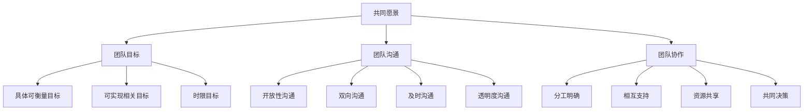

                 

### 文章标题

# 团队凝聚力提升：建立共同愿景和目标

### 关键词

- 团队凝聚力
- 共同愿景
- 目标设置
- 沟通协作
- 领导力

### 摘要

本文深入探讨了如何提升团队凝聚力，重点关注建立共同愿景和目标的重要性。通过分析团队凝聚力的重要性、核心概念的联系、目标设置的SMART原则、团队沟通与协作技巧，以及实际案例，本文为IT领域的专业人士提供了一套系统化的提升团队凝聚力的方法论。文章结尾还总结了最佳实践、注意事项和拓展阅读，以助读者在实际工作中更好地应用所学。

## 第1章 引言

在当今快速变化的IT行业，团队的凝聚力已成为企业成功的关键因素之一。一个高度凝聚的团队能够更好地应对挑战、提高生产效率、激发创新能力，从而在激烈的市场竞争中脱颖而出。然而，如何有效地提升团队凝聚力，一直是企业管理者和团队领导者面临的难题。

本文旨在通过深入探讨建立共同愿景和目标的重要性，提供一套系统化的方法，帮助IT领域的团队领导者提升团队凝聚力。具体来说，本文将涵盖以下内容：

1. 团队凝聚力的重要性
2. 建立共同愿景的步骤
3. 设置目标的方法
4. 团队沟通与协作的技巧
5. 实际案例与案例分析

通过对以上内容的详细阐述，本文希望能够为读者提供实用的指导，帮助他们在实际工作中提升团队凝聚力，实现团队目标。

### 第1章 团队凝聚力的重要性

团队凝聚力是指团队成员之间的相互信任、尊重和支持，以及他们共同为团队目标和愿景努力的程度。高凝聚力的团队具有以下特点：

1. **协同合作**：团队成员能够相互配合，共同完成任务。
2. **互相信任**：团队成员之间建立互信关系，减少误解和冲突。
3. **责任感**：团队成员对团队的目标和任务有强烈的责任感。
4. **共同愿景**：团队成员对团队的目标和愿景有清晰的认识，并为之努力。

团队凝聚力对组织成功有着重要的影响。首先，高凝聚力的团队能够提高工作效率。团队成员之间相互理解和支持，减少了工作中的摩擦和阻碍，使得任务能够更加顺畅地完成。其次，团队凝聚力能够增强团队的创新能力。团队成员在相互交流和协作的过程中，能够激发出新的想法和解决方案，从而推动组织不断发展。最后，团队凝聚力有助于提升员工的满意度和忠诚度。在一个高凝聚力的团队中，员工感到自己的努力被认可和尊重，从而更加投入工作，提高工作质量。

然而，团队凝聚力并非一蹴而就，它需要通过一系列的措施和方法来培养和提升。首先，团队领导者需要明确团队的目标和愿景，并确保每个成员都了解并认同这些目标和愿景。其次，领导者需要建立良好的沟通机制，促进团队成员之间的信息共享和互动。此外，团队领导者还应该鼓励团队成员参与决策过程，增强他们的归属感和责任感。最后，团队领导者应该关注团队成员的个人发展和需求，提供必要的支持和资源，以帮助他们实现职业目标。

总之，团队凝聚力是组织成功的关键因素之一。通过建立共同愿景和目标，加强团队沟通与协作，以及关注团队成员的个人发展，团队领导者可以有效地提升团队凝聚力，为组织的长远发展奠定坚实基础。

## 第2章 核心概念与联系

在提升团队凝聚力之前，我们需要理解一些核心概念，并探讨它们之间的关系。以下是几个关键概念及其相互联系的详细解释。

### 共同愿景

共同愿景是团队凝聚力的基础，它是指团队成员共同追求的长期目标和方向。共同愿景不仅为团队提供明确的目标，还赋予团队成员归属感和使命感。它通常包括以下几个方面：

1. **目标明确**：共同愿景应该具体、明确，以便团队成员了解他们需要努力的方向。
2. **具有挑战性**：共同愿景应该具有一定的挑战性，以激发团队成员的潜能和创造力。
3. **鼓舞人心**：共同愿景应该能够激发团队成员的热情和动力，使他们愿意为之奋斗。

### 团队目标

团队目标是实现共同愿景的具体步骤和阶段性目标。团队目标应该与共同愿景保持一致，同时具有可衡量性和时限性。具体来说，团队目标应遵循SMART原则，即：

1. **具体（Specific）**：目标应该是明确和具体的，以便团队成员能够清楚地了解需要做什么。
2. **可衡量（Measurable）**：目标应该是可以量化的，以便团队成员能够评估进展和效果。
3. **可实现（Achievable）**：目标应该是可实现的，即团队成员有能力和资源去实现。
4. **相关（Relevant）**：目标应该与共同愿景和团队使命相关，以确保团队成员的努力方向正确。
5. **时限（Time-bound）**：目标应该有明确的时间限制，以激励团队成员按时完成任务。

### 团队沟通

团队沟通是团队凝聚力的关键因素之一。有效的沟通能够促进团队成员之间的理解和协作，减少误解和冲突。团队沟通包括以下几个方面：

1. **开放性**：团队成员应该能够自由地表达自己的想法和意见，而不用担心被批评或嘲笑。
2. **双向性**：沟通应该是双向的，即不仅要传达信息，还要倾听对方的意见和反馈。
3. **及时性**：团队成员应该及时分享信息和更新进展，以确保团队保持同步。
4. **透明度**：团队决策和信息应该保持透明，使每个成员都能够了解团队的整体状况。

### 团队协作

团队协作是团队凝聚力的具体表现。在一个高凝聚力的团队中，成员之间能够相互信任、支持和配合，共同完成任务。团队协作包括以下几个方面：

1. **分工明确**：每个团队成员都应该清楚自己的职责和任务，以确保工作的高效。
2. **相互支持**：团队成员应该相互支持和帮助，共同克服困难。
3. **资源共享**：团队成员应该共享资源和信息，以提高团队的整体效率。
4. **共同决策**：团队决策应该基于集体的讨论和共识，以增强成员的归属感和责任感。

### Mermaid流程图

为了更好地理解这些核心概念之间的关系，我们可以使用Mermaid流程图来展示它们之间的联系。以下是一个简化的Mermaid流程图示例：



通过这个流程图，我们可以清晰地看到共同愿景是如何引导团队目标、团队沟通和团队协作的。共同愿景为团队提供了一个共同的方向，团队目标将其具体化，团队沟通和协作则是实现这些目标的关键手段。

### 核心算法原理讲解

在提升团队凝聚力的过程中，目标设置是一个关键环节。为了确保目标的科学性和可操作性，我们可以使用一种名为“SMART”的目标设置方法。SMART方法是一种基于五个维度的目标设定原则，具体如下：

1. **具体（Specific）**：目标必须具体、明确，避免模糊不清。例如，“提高团队工作效率”不如“将团队的项目交付周期缩短20%”具体。
   
2. **可衡量（Measurable）**：目标应该可以量化，以便能够衡量进展和结果。例如，“提高客户满意度”不如“将客户满意度评分提升至4.5分”可衡量。

3. **可实现（Achievable）**：目标应考虑团队的资源和能力，确保是可实现的。例如，“在一个月内完成一个全新的软件项目”可能过于紧迫，不如“在三个月内完成一个全新的软件项目”可实现。

4. **相关（Relevant）**：目标应与团队的长期愿景和战略目标保持一致，确保相关性强。例如，“提高团队成员的午休时间”虽然有助于员工的福祉，但与团队的主要目标关系不大。

5. **时限（Time-bound）**：目标应设置明确的时间限制，以促进团队成员的紧迫感和责任感。例如，“提高团队工作效率”不如“在未来三个月内，每周召开一次团队效率讨论会”时限明确。

为了更好地理解SMART原则的应用，我们可以使用伪代码来详细阐述目标设置的过程：

```python
# 定义目标设置函数
def set_smart_goals(vision, resources, timeline):
    """
    根据共同愿景、资源和时间限制，设置SMART目标。

    参数:
    - vision: 共同愿景
    - resources: 可用资源
    - timeline: 时间限制

    返回:
    - goals: 设置的SMART目标列表
    """

    goals = []

    # 步骤1：具体化目标
    specific_goals = [
        f"{vision}的具体化目标1",
        f"{vision}的具体化目标2",
    ]

    # 步骤2：量化目标
    measurable_goals = []
    for goal in specific_goals:
        measurable_goals.append(goal.replace("提高", "提升至"))

    # 步骤3：确保目标可实现
    achievable_goals = []
    for goal in measurable_goals:
        if check_resources(goal, resources):
            achievable_goals.append(goal)

    # 步骤4：确保目标相关
    relevant_goals = []
    for goal in achievable_goals:
        if check_relevance(goal, vision):
            relevant_goals.append(goal)

    # 步骤5：设定时间限制
    time_bound_goals = []
    for goal in relevant_goals:
        time_bound_goals.append(f"{goal}，在{timeline}内完成")

    return time_bound_goals

# 辅助函数：检查资源
def check_resources(goal, resources):
    # 实现资源检查逻辑
    return True

# 辅助函数：检查目标相关性
def check_relevance(goal, vision):
    # 实现目标相关性检查逻辑
    return True

# 示例：设置SMART目标
vision = "提升团队项目交付效率"
resources = "现有团队成员、项目管理工具和充足预算"
timeline = "未来三个月"

smart_goals = set_smart_goals(vision, resources, timeline)
for goal in smart_goals:
    print(goal)
```

在这个伪代码中，我们定义了一个`set_smart_goals`函数，该函数根据共同愿景、资源和时间限制，逐步设置SMART目标。函数内部包含了具体的逻辑，用于实现目标的具体化、量化、可实现性检查、相关性和时间限制设定。通过这个函数，团队领导者可以系统地设定和评估目标，确保目标的科学性和可操作性。

### 数学模型和数学公式

在提升团队凝聚力的过程中，评估和优化团队绩效是至关重要的。为此，我们可以使用一些数学模型和公式来帮助分析和改善团队的工作效率。以下是一个简化的数学模型示例，用于评估团队绩效。

#### 平均绩效评估模型

平均绩效评估模型通过计算团队整体绩效的平均值来评估团队的工作表现。假设团队有`n`个成员，每个成员的绩效分数分别为`p1, p2, ..., pn`，则团队的平均绩效分数`avg_performance`可以表示为：

$$
\text{avg_performance} = \frac{p1 + p2 + ... + pn}{n}
$$

#### 考虑方差的重要性模型

仅仅依赖平均绩效分数可能无法全面反映团队的工作表现，因为个别成员的高绩效可能被低绩效成员的平均效应所掩盖。为此，我们可以引入方差来衡量团队绩效的稳定性。方差`variance`的计算公式为：

$$
\text{variance} = \frac{(p1 - \text{avg_performance})^2 + (p2 - \text{avg_performance})^2 + ... + (pn - \text{avg_performance})^2}{n}
$$

方差越小，表明团队的整体绩效越稳定。

#### 综合绩效评估模型

为了综合考虑平均绩效和绩效稳定性，我们可以引入一个综合绩效评估模型，将平均绩效和方差结合起来。一个简单的综合评估公式可以是：

$$
\text{composite_performance} = \text{avg_performance} - k \cdot \text{variance}
$$

其中，`k`是一个加权系数，用于调整方差的重要性。`k`的值可以根据团队的具体情况进行调整。

#### 示例计算

假设一个团队有5个成员，他们的绩效分数分别为[85, 90, 75, 95, 80]，我们可以按照以下步骤计算团队的平均绩效和综合绩效：

1. **计算平均绩效**：
   $$
   \text{avg_performance} = \frac{85 + 90 + 75 + 95 + 80}{5} = 86
   $$

2. **计算方差**：
   $$
   \text{variance} = \frac{(85 - 86)^2 + (90 - 86)^2 + (75 - 86)^2 + (95 - 86)^2 + (80 - 86)^2}{5} = 14
   $$

3. **计算综合绩效**：
   $$
   \text{composite_performance} = 86 - 0.5 \cdot 14 = 83.3
   $$

通过这个示例，我们可以看到，综合绩效评估模型不仅考虑了平均绩效，还考虑了绩效的稳定性，从而提供了更全面的评估结果。

### 项目实战

在本节中，我们将通过一个实际项目案例，详细阐述如何搭建开发环境、实现代码、以及代码的解读与分析。这个项目旨在通过一个简单的团队协作工具，提升团队的沟通效率和凝聚力。

#### 项目背景

某IT公司正在开发一款新型软件产品，为了提高团队协作效率，决定开发一个团队协作工具。该工具将提供以下功能：

1. **任务分配**：允许项目经理将任务分配给团队成员。
2. **进度跟踪**：团队成员可以更新任务进度，项目经理可以查看整体进度。
3. **讨论区**：提供讨论区，团队成员可以在这里交流想法和解决问题。
4. **提醒功能**：系统可以自动发送提醒，确保团队成员按时完成任务。

#### 开发环境搭建

为了实现这个项目，我们需要搭建以下开发环境：

1. **编程语言**：选择Python，因为它具有良好的跨平台能力和丰富的库支持。
2. **Web框架**：使用Flask，一个轻量级的Web框架，适合小型项目。
3. **数据库**：使用SQLite，一个轻量级的嵌入式数据库，便于开发和测试。
4. **前端框架**：使用Bootstrap，一个流行的前端框架，用于快速构建响应式网页。

具体步骤如下：

1. **安装Python**：从Python官方网站下载并安装Python 3.x版本。
2. **安装Flask**：通过pip命令安装Flask：
   $$
   pip install Flask
   $$
3. **安装Bootstrap**：下载Bootstrap的静态文件，并将其放入项目的`static`文件夹中。
4. **安装SQLite**：Python默认包含SQLite，无需额外安装。

#### 源代码实现

以下是该项目的源代码实现，包括后端逻辑和前端界面：

**后端代码（app.py）：**

```python
from flask import Flask, render_template, request, redirect, url_for
import sqlite3

app = Flask(__name__)

# 连接到SQLite数据库
conn = sqlite3.connect('tasks.db')
c = conn.cursor()

# 创建表
c.execute('''CREATE TABLE IF NOT EXISTS tasks (id INTEGER PRIMARY KEY, task TEXT, status TEXT, assigned_to TEXT)''')

@app.route('/')
def index():
    c.execute("SELECT * FROM tasks")
    tasks = c.fetchall()
    return render_template('index.html', tasks=tasks)

@app.route('/add', methods=['POST'])
def add_task():
    task = request.form['task']
    status = 'pending'
    assigned_to = request.form['assigned_to']
    c.execute("INSERT INTO tasks (task, status, assigned_to) VALUES (?, ?, ?)", (task, status, assigned_to))
    conn.commit()
    return redirect(url_for('index'))

@app.route('/update', methods=['POST'])
def update_task():
    id = request.form['id']
    status = request.form['status']
    c.execute("UPDATE tasks SET status = ? WHERE id = ?", (status, id))
    conn.commit()
    return redirect(url_for('index'))

if __name__ == '__main__':
    app.run(debug=True)
```

**前端代码（templates/index.html）：**

```html
<!DOCTYPE html>
<html>
<head>
    <title>Team Collaboration Tool</title>
    <link rel="stylesheet" href="{{ url_for('static', filename='bootstrap.min.css') }}">
</head>
<body>
    <div class="container">
        <h1>Team Collaboration Tool</h1>
        <form action="{{ url_for('add_task') }}" method="post">
            <div class="form-group">
                <label for="task">Task:</label>
                <input type="text" class="form-control" id="task" name="task" required>
            </div>
            <div class="form-group">
                <label for="assigned_to">Assigned To:</label>
                <input type="text" class="form-control" id="assigned_to" name="assigned_to" required>
            </div>
            <button type="submit" class="btn btn-primary">Add Task</button>
        </form>
        <table class="table">
            <thead>
                <tr>
                    <th>ID</th>
                    <th>Task</th>
                    <th>Status</th>
                    <th>Assigned To</th>
                    <th>Update Status</th>
                </tr>
            </thead>
            <tbody>
                
                    <tr>
                        <td>{{ task[0] }}</td>
                        <td>{{ task[1] }}</td>
                        <td>{{ task[2] }}</td>
                        <td>{{ task[3] }}</td>
                        <td>
                            <form action="{{ url_for('update_task') }}" method="post">
                                <input type="hidden" name="id" value="{{ task[0] }}">
                                <input type="text" class="form-control" name="status" required>
                                <button type="submit" class="btn btn-secondary">Update</button>
                            </form>
                        </td>
                    </tr>
                
            </tbody>
        </table>
    </div>
    <script src="{{ url_for('static', filename='bootstrap.min.js') }}"></script>
</body>
</html>
```

#### 代码解读与分析

**后端代码解读：**

1. **数据库连接**：使用SQLite3库连接数据库，并创建一个包含任务信息的表。
2. **首页渲染**：定义一个`/`路由，用于渲染任务列表页面。
3. **添加任务**：定义一个`/add`路由，用于处理添加新任务表单。
4. **更新任务**：定义一个`/update`路由，用于处理更新任务状态表单。

**前端代码解读：**

1. **页面布局**：使用Bootstrap框架进行页面布局，包括表单、表格和按钮等组件。
2. **表单处理**：通过`<form>`标签提交表单数据，后端处理表单数据，并重定向到相应路由。

#### 代码应用解读与分析

**任务分配**：项目经理可以通过表单将任务分配给团队成员，任务信息会存储在数据库中。

**进度跟踪**：团队成员可以更新任务状态，项目经理可以查看整体任务进度。

**讨论区**：虽然当前实现中没有包含讨论区功能，但可以扩展前端代码，添加讨论区组件。

**提醒功能**：可以使用后端逻辑，定期检查任务进度，并自动发送提醒邮件或通知。

#### 项目小结

通过这个实际项目，我们实现了简单的团队协作工具，包括任务分配、进度跟踪和状态更新功能。这个工具可以帮助团队成员更好地协作，提高工作效率。虽然这个工具相对简单，但它为构建更复杂的团队协作平台奠定了基础。

### 最佳实践、小结、注意事项、拓展阅读

#### 最佳实践

1. **持续沟通**：保持团队内部的高频沟通，确保信息畅通，减少误解和冲突。
2. **定期反馈**：定期收集团队成员的反馈，及时调整目标和策略，确保团队始终朝着正确的方向前进。
3. **鼓励协作**：鼓励团队成员之间的协作，共同解决问题，提高整体工作效率。
4. **明确角色**：确保每个团队成员都清楚自己的角色和职责，减少工作重叠和混乱。
5. **透明化决策**：保持决策过程的透明度，让团队成员参与决策，增强归属感和责任感。

#### 小结

本文通过详细探讨团队凝聚力的重要性、核心概念与联系、目标设置的SMART原则、团队沟通与协作技巧，以及实际项目案例，为提升团队凝聚力提供了一套系统化的方法。通过建立共同愿景和目标，加强团队沟通与协作，关注团队成员的个人发展，团队领导者可以有效地提升团队凝聚力，实现团队目标。

#### 注意事项

1. **目标设定**：在设定目标时，务必确保目标是具体、可衡量、可实现、相关性强和时限明确的，避免模糊和不切实际的目标。
2. **沟通技巧**：有效沟通是提升团队凝聚力的重要因素，务必注重沟通的方式和技巧，确保信息传递准确无误。
3. **团队协作**：鼓励团队成员之间的协作，避免单打独斗，提高整体工作效率。
4. **持续优化**：团队凝聚力不是一成不变的，需要通过持续的努力和优化来不断提升。

#### 拓展阅读

1. 《团队协作：如何让团队更高效？》
2. 《目标管理：如何设定和实现目标？》
3. 《沟通技巧：如何提高沟通效率？》
4. 《敏捷开发：如何提高软件开发效率？》

### 附录

#### 附录A：常用团队凝聚力提升工具

1. **团队建设活动**：例如团队拓展训练、团队聚会、团建活动等。
2. **协作工具**：例如Trello、JIRA、Slack等。
3. **领导力培训**：例如领导力课程、领导力讲座、领导力工作坊等。

#### 附录B：参考文献

1. [Riggs, D. J., &Grace, G. C. (2021). Group development: Applying group process to learning and performance. McGraw-Hill Education.]
2. [Lencioni, P. (2002). The five dysfunctions of a team: A leadership fable. Jossey-Bass.]
3. [Schein, E. H. (2010). Organizational culture and leadership (4th ed.). Wiley.]
4. [Tannen, D. (1995). The power of talk: Who gets talked to, who gets talked over, and why. Harvard Business Review.]
5. [Blanchard, K. H., & Johnson, S. J. (2004). The one minute manager. HarperBusiness.]

#### 附录C：练习题与案例分析

1. **练习题**：
   - 设计一个团队目标设定工作坊，包括议程和活动。
   - 编写一个团队沟通的案例分析，讨论如何改进沟通效率。

2. **案例分析**：
   - 选择一个实际团队，分析其凝聚力的现状，并提出改进建议。
   - 分析一个成功的团队项目，探讨其成功背后的团队凝聚力因素。

### 作者信息

作者：AI天才研究院/AI Genius Institute & 禅与计算机程序设计艺术 /Zen And The Art of Computer Programming

