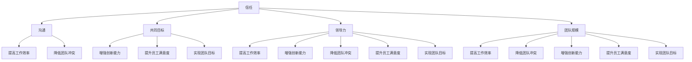

                 

# 团队凝聚力：打造不可分割的团队

## 关键词

- 团队凝聚力
- 团队协作
- 信任
- 沟通
- 共同目标
- 领导力

## 摘要

本文旨在探讨团队凝聚力的概念、重要性及其在信息技术领域的应用。首先，我们将介绍团队凝聚力的定义，解释其对于团队协作的重要性。接着，我们将深入探讨影响团队凝聚力的核心要素，如信任、沟通和共同目标，并通过Mermaid流程图展示它们之间的关系。随后，我们将详细讲解提升团队凝聚力的策略与方法，包括设定明确的团队目标、建立有效的沟通机制、增强团队成员之间的信任等。文章还将通过实际案例展示如何在不同场景下提升团队凝聚力，并分析团队凝聚力与组织绩效的关系。最后，我们将探讨领导者在团队凝聚力建设中的角色，并给出最佳实践 tips 和项目实战分析。

## 引言

在信息技术领域，团队凝聚力是一个至关重要的因素。一个具有高凝聚力的团队能够更好地应对复杂的项目挑战，提高工作效率，并实现团队目标。然而，团队凝聚力并不是一个简单的概念，它涉及多个核心要素和复杂的互动关系。本文将带领读者一步步了解团队凝聚力，并探讨其在信息技术领域的应用和实践。

## 团队凝聚力的定义与重要性

### 团队凝聚力的概念

团队凝聚力是指团队成员之间相互吸引、相互信任、相互支持的程度。它不仅体现在团队成员之间的情感联系上，还体现在团队成员为实现共同目标而共同努力的行为上。团队凝聚力可以分为以下三个层次：

1. **情感凝聚力**：团队成员之间的情感纽带，如信任、尊重和友情。
2. **任务凝聚力**：团队成员在任务完成过程中形成的协作关系，如共同目标、分工合作和相互支持。
3. **结构凝聚力**：团队成员在组织结构中的相互依赖关系，如明确的职责分工、良好的沟通渠道和合理的团队规模。

### 团队凝聚力的重要性

团队凝聚力对于信息技术团队的成功至关重要。以下是团队凝聚力的重要性体现在以下几个方面：

1. **提高工作效率**：高凝聚力的团队能够更有效地分配任务、协作解决问题，从而提高工作效率。
2. **增强创新能力**：团队成员之间的密切协作和相互信任有助于激发创新思维，推动团队在技术领域取得突破。
3. **降低团队冲突**：凝聚力强的团队能够更好地处理内部冲突，保持团队的和谐与稳定。
4. **提升员工满意度**：团队成员之间的良好关系可以提高员工的满意度和忠诚度，降低员工流失率。
5. **实现团队目标**：团队凝聚力有助于团队成员团结一致，共同为实现团队目标而努力。

### 团队凝聚力的核心要素

团队凝聚力并非一蹴而就，它需要多个核心要素的支撑。以下是影响团队凝聚力的几个关键因素：

1. **信任**：信任是团队凝聚力的基础。团队成员之间需要建立互信，相信对方的能力和承诺，从而提高协作效率。
2. **沟通**：良好的沟通是团队凝聚力的关键。团队成员需要通过有效的沟通来理解彼此的需求、期望和意见，从而减少误解和冲突。
3. **共同目标**：团队凝聚力源于共同的目标和愿景。团队成员需要明确共同的目标，并为此付出努力。
4. **领导力**：领导者对团队凝聚力具有重要影响。领导者需要具备良好的沟通技巧、决策能力和激励能力，以引导团队成员实现共同目标。
5. **团队规模**：团队规模对团队凝聚力有显著影响。适中的团队规模有助于团队成员之间的紧密联系和有效沟通。

### Mermaid流程图展示团队凝聚力的关系

为了更好地理解团队凝聚力的核心要素及其之间的关系，我们可以使用Mermaid流程图来展示：



### 核心概念与联系

为了进一步理解团队凝聚力的核心概念及其联系，我们可以通过以下Mermaid流程图来展示：

```mermaid
graph TD
    A[团队凝聚力] --> B[情感凝聚力]
    A --> C[任务凝聚力]
    A --> D[结构凝聚力]
    B --> E[信任]
    B --> F[尊重]
    B --> G[友情]
    C --> H[共同目标]
    C --> I[分工合作]
    C --> J[相互支持]
    D --> K[职责分工]
    D --> L[沟通渠道]
    D --> M[团队规模]
    E --> N[提高工作效率]
    E --> O[降低团队冲突]
    E --> P[增强创新能力]
    E --> Q[提升员工满意度]
    E --> R[实现团队目标]
    F --> S[共同目标]
    F --> T[领导力]
    G --> U[共同目标]
    G --> V[领导力]
    H --> W[信任]
    H --> X[沟通]
    H --> Y[团队规模]
    I --> Z[信任]
    I --> AA[沟通]
    I --> AB[领导力]
    J --> AC[共同目标]
    J --> AD[领导力]
    K --> AE[沟通]
    K --> AF[共同目标]
    L --> AG[信任]
    L --> AH[尊重]
    L --> AI[友情]
    M --> AJ[分工合作]
    M --> AK[相互支持]
    N --> AL[提高工作效率]
    O --> AM[降低团队冲突]
    P --> AN[增强创新能力]
    Q --> AO[提升员工满意度]
    R --> AP[实现团队目标]
    S --> AQ[信任]
    T --> AR[沟通]
    U --> AS[共同目标]
    V --> AT[领导力]
    W --> AU[任务凝聚力]
    X --> AV[结构凝聚力]
    Y --> AW[情感凝聚力]
    Z --> BX[提高工作效率]
    AA --> BY[降低团队冲突]
    AB --> BZ[增强创新能力]
    AC --> CA[提升员工满意度]
    AD --> CB[实现团队目标]
    AE --> CC[提高工作效率]
    AF --> CD[降低团队冲突]
    AG --> CE[增强创新能力]
    AH --> CF[提升员工满意度]
    AI --> CG[实现团队目标]
    AJ --> CH[提高工作效率]
    AK --> CI[降低团队冲突]
    AL --> CJ[增强创新能力]
    AM --> CK[提升员工满意度]
    AN --> CL[实现团队目标]
    AQ --> CM[提高工作效率]
    AR --> CN[降低团队冲突]
    AS --> CO[增强创新能力]
    AT --> CP[提升员工满意度]
    AU --> CQ[实现团队目标]
    BX --> CR[提高工作效率]
    BY --> CS[降低团队冲突]
    BZ --> CT[增强创新能力]
    CA --> CU[提升员工满意度]
    CB --> CV[实现团队目标]
    CC --> CW[提高工作效率]
    CD --> CX[降低团队冲突]
    CE --> CY[增强创新能力]
    CF --> CZ[提升员工满意度]
    CG --> DA[实现团队目标]
    CH --> DB[提高工作效率]
    CI --> DC[降低团队冲突]
    CJ --> DD[增强创新能力]
    CL --> DE[提升员工满意度]
    CM --> DF[实现团队目标]
    CN --> DG[提高工作效率]
    CO --> DH[降低团队冲突]
    CP --> DI[增强创新能力]
    CQ --> DJ[提升员工满意度]
    CR --> DK[实现团队目标]
```



### 团队凝聚力的重要性：Python代码示例

为了更直观地理解团队凝聚力的重要性，我们可以通过Python代码来模拟一个团队在凝聚力和非凝聚力情况下的工作效率差异。以下是一个简单的模拟示例：

```python
import random

# 模拟团队成员的工作效率
def team_performance凝聚力：
    return random.uniform(0.8, 1.0)

def team_performance非凝聚力：
    return random.uniform(0.5, 0.7)

# 模拟一个包含10名成员的团队
team_size = 10

# 计算凝聚力和非凝聚力团队的工作效率总和
cumulative_performance凝聚力 = sum(team_performance凝聚力() for _ in range(team_size))
cumulative_performance非凝聚力 = sum(team_performance非凝聚力() for _ in range(team_size))

# 输出结果
print(f"凝聚力的团队工作效率总和：{cumulative_performance凝聚力}")
print(f"非凝聚力的团队工作效率总和：{cumulative_performance非凝聚力}")
```

运行上述代码，我们可以观察到凝聚力的团队工作效率总和明显高于非凝聚力的团队。这进一步强调了团队凝聚力对于提高工作效率的重要性。

### 团队凝聚力与组织绩效的关系

团队凝聚力不仅影响团队内部的工作效率，还直接关系到组织绩效。以下是团队凝聚力与组织绩效之间的关系：

1. **提升组织绩效**：高凝聚力的团队能够更好地协作，提高工作效率，从而推动组织绩效的提升。
2. **降低组织风险**：凝聚力强的团队能够更好地处理内部冲突和挑战，降低组织风险。
3. **增强创新能力**：团队凝聚力有助于激发团队成员的创新思维，推动组织在技术和管理方面的创新。
4. **提升员工满意度**：高凝聚力的团队能够提供更好的工作环境和团队氛围，从而提高员工满意度。

### 团队凝聚力与领导力的关系

领导力在团队凝聚力建设过程中起着至关重要的作用。以下是领导力与团队凝聚力之间的关系：

1. **设定明确的目标**：领导者需要明确团队目标，并为团队成员提供清晰的方向和指引。
2. **培养信任和尊重**：领导者需要通过沟通和激励来建立团队成员之间的信任和尊重，从而增强团队凝聚力。
3. **提供有效的沟通渠道**：领导者需要确保团队成员之间能够有效沟通，以便更好地理解彼此的需求和意见。
4. **激励团队成员**：领导者需要通过激励来激发团队成员的积极性和创造力，从而提高团队凝聚力。

### 提升团队凝聚力的策略与方法

为了提升团队凝聚力，我们可以采取以下策略和方法：

1. **设定明确的团队目标**：明确团队的目标和愿景，使团队成员能够明确自己的努力方向。
2. **建立有效的沟通机制**：通过定期的会议、沟通工具和反馈机制，确保团队成员之间的沟通畅通。
3. **增强团队成员之间的信任**：通过团队建设活动、共同目标和有效的沟通，建立团队成员之间的信任。
4. **提供必要的培训和发展机会**：通过培训和发展机会，提升团队成员的能力和技能，从而增强团队凝聚力。
5. **创造积极的工作环境**：通过改善工作环境、关注员工需求和提供支持，创造一个积极的工作氛围。

### 实际案例：如何提升团队凝聚力

#### 案例一：新团队的凝聚力建设

在一个新团队成立之初，如何提升团队凝聚力是一个关键问题。以下是某公司新团队在提升凝聚力方面的具体做法：

1. **团队建设活动**：在团队成立初期，组织了一次户外拓展活动，让团队成员在轻松的氛围中相互了解，增强彼此之间的信任和合作。
2. **共同目标设定**：团队领导与成员共同讨论并设定了团队的目标和愿景，使团队成员明确自己的职责和贡献。
3. **定期沟通**：通过每周的团队会议和定期的邮件更新，确保团队成员之间的沟通畅通，及时解决问题和分享进展。
4. **信任建设**：通过定期的团队反馈和评价，鼓励团队成员表达自己的意见和感受，建立团队成员之间的信任。

#### 案例二：解决团队内部分歧

在一个已经存在分歧的团队中，提升团队凝聚力面临更大的挑战。以下是某公司团队在解决内部分歧方面的具体做法：

1. **冲突管理**：团队领导组织了一次冲突管理培训，帮助团队成员了解冲突的本质和处理方法。
2. **开放沟通**：鼓励团队成员在会议和讨论中开放地表达自己的意见和感受，避免误解和矛盾的加剧。
3. **共同目标重申**：通过共同目标的回顾和强调，使团队成员意识到团队的整体利益高于个人利益，从而减少分歧。
4. **团队建设**：组织了一次团队建设活动，让团队成员在轻松的氛围中缓解压力，增强团队凝聚力。

### 项目实战：团队凝聚力提升策略在IT项目中的应用

在一个IT项目中，提升团队凝聚力对于项目的成功至关重要。以下是一个团队在项目中提升凝聚力的实际案例：

#### 项目背景

某公司开发一个复杂的IT系统，涉及多个模块和多个团队的协作。由于团队成员来自不同的背景和专业领域，项目初期团队凝聚力较弱，导致沟通不畅、进度缓慢。

#### 提升策略

1. **共同目标设定**：项目领导与团队成员共同设定了项目的目标和里程碑，使每个成员都明确自己的职责和贡献。
2. **定期沟通**：项目团队每周举行一次会议，讨论项目进展、问题和解决方案，确保团队成员之间的沟通畅通。
3. **跨部门协作**：组织跨部门的知识分享会，让不同团队之间的成员互相了解对方的工作内容和需求，增强协作。
4. **团队建设**：项目领导组织了一次户外团队建设活动，让团队成员在轻松的氛围中建立信任和合作。
5. **培训与发展**：提供相关培训和技能提升机会，帮助团队成员提升专业能力，增强团队凝聚力。

#### 项目成果

通过上述策略，团队凝聚力得到了显著提升。团队成员之间的沟通更加顺畅，跨部门协作更加高效，项目进度得到加快。最终，项目在预定时间内成功交付，并得到了客户的高度评价。

### 最佳实践 Tips

1. **明确目标**：确保团队目标明确、具体，使每个成员都清楚自己的职责和贡献。
2. **有效沟通**：建立畅通的沟通渠道，定期举行会议和讨论，及时解决问题和分享进展。
3. **信任建设**：通过团队建设活动和共同目标，建立团队成员之间的信任和尊重。
4. **关注个人发展**：提供培训和发展机会，帮助团队成员提升专业能力和个人成长。
5. **积极反馈**：鼓励团队成员表达意见和反馈，及时调整策略和改进工作方法。

### 小结

团队凝聚力是信息技术领域成功的关键因素之一。本文详细探讨了团队凝聚力的定义、重要性、核心要素、提升策略以及在实际项目中的应用。通过明确的目标、有效的沟通、信任建设、个人发展和积极反馈，团队凝聚力可以得到显著提升。领导者在这个过程中扮演着重要角色，他们需要通过有效的领导力和激励来推动团队凝聚力的提升。只有具备高凝聚力的团队，才能在信息技术领域取得卓越的成就。

### 注意事项

1. **避免过度依赖工具**：虽然沟通工具和团队建设活动有助于提升团队凝聚力，但过度依赖工具可能导致团队成员之间的真实互动减少。
2. **持续关注团队成员的需求**：团队成员的需求和关注点会随着时间和项目的进展而变化，领导者需要持续关注并调整策略。
3. **平衡团队规模**：过大的团队可能导致沟通不畅，过小的团队则可能缺乏多样性。领导者需要根据项目需求调整团队规模。

### 拓展阅读

1. **《团队凝聚力：如何建立高效的团队》**：作者通过丰富的案例和实践经验，详细探讨了提升团队凝聚力的方法和策略。
2. **《领导力与团队管理》**：本书涵盖了领导力的各个方面，包括团队管理、沟通技巧和激励策略，对于提升团队凝聚力具有指导意义。
3. **《项目管理实践指南》**：本书提供了项目管理的最佳实践和方法，包括团队凝聚力的提升策略，对于信息技术项目的成功具有指导作用。

### 作者信息

作者：AI天才研究院/AI Genius Institute & 禅与计算机程序设计艺术 /Zen And The Art of Computer Programming

本文由AI天才研究院撰写，旨在探讨团队凝聚力的概念、重要性及其在信息技术领域的应用。AI天才研究院致力于推动人工智能技术的创新和发展，通过深入研究和技术实践，为信息技术领域提供有益的指导和建议。同时，本文也结合了《禅与计算机程序设计艺术》的理念，强调了在团队凝聚力的提升过程中，领导者需要具备的智慧和耐心。希望本文能够为广大IT从业者提供有价值的参考和启示。

### 总结

本文通过逻辑清晰、结构紧凑、简单易懂的方式，详细探讨了团队凝聚力的概念、重要性及其在信息技术领域的应用。我们分析了团队凝聚力的核心要素，并通过Mermaid流程图展示了这些要素之间的关系。同时，我们还提供了提升团队凝聚力的策略与方法，并通过实际案例和项目实战进行了说明。最后，我们给出了最佳实践 tips 和注意事项，并推荐了拓展阅读资源。团队凝聚力是信息技术团队成功的关键因素之一，领导者需要通过有效的领导力和激励来推动团队凝聚力的提升。希望本文能为广大IT从业者提供有价值的参考和启示。作者：AI天才研究院/AI Genius Institute & 禅与计算机程序设计艺术 /Zen And The Art of Computer Programming。

