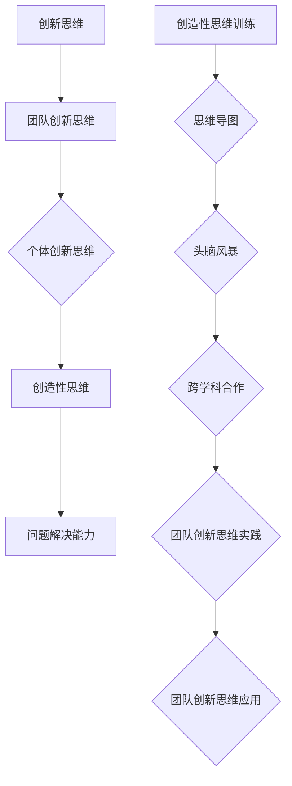

                 

### 团队创新思维：激发团队创意的方法

#### 关键词：
- 团队创新思维
- 创意激发
- 创造性思维
- 跨学科合作
- 头脑风暴
- 思维导图

#### 摘要：
在快速变化的技术时代，团队创新思维成为推动企业进步的关键力量。本文从团队创新思维的概述、激发创意的方法、实践应用及案例分析四个部分，深入探讨了如何通过系统的方法激发团队创意，提升团队的创新能力和竞争力。文章旨在为IT领域的团队提供实用的创新思维工具和策略，帮助他们在复杂的项目和挑战中找到创新解决方案。

### 第一部分：团队创新思维概述

#### 第1章：团队创新思维的重要性

##### 1.1 创新思维的概念与特点

创新思维是指从新的角度分析和解决问题的思维方式，它不仅仅是想象力和创造力，更是一种有目的、有计划的认知活动。在团队中，创新思维的特点包括：

- **多元性**：团队成员来自不同的背景，拥有不同的专业知识和经验，这种多元性为创新提供了丰富的视角和思路。
- **协作性**：创新思维在团队中是通过协作实现的，每个成员的贡献都是不可或缺的。
- **系统化**：创新思维不是随机产生的，它需要通过系统的方法和工具来引导和激发。

##### 1.2 团队创新思维的作用

团队创新思维在企业发展中具有重要的作用，包括：

- **提高竞争力**：创新思维能够帮助企业找到新的市场机会，提高产品和服务的竞争力。
- **推动创新**：团队创新思维是推动企业技术创新和管理创新的重要动力。
- **提升团队凝聚力**：通过共同的创新活动，团队成员之间的信任和合作得到加强，团队凝聚力得到提升。

##### 1.3 团队创新思维与个人创新的区别

团队创新思维与个人创新相比，具有以下不同：

- **目标导向**：团队创新思维更注重目标的实现，而个人创新可能更关注个人兴趣和专长。
- **资源整合**：团队创新思维强调资源的整合和优化，而个人创新可能局限于个人拥有的资源。
- **沟通协作**：团队创新思维需要团队成员之间的沟通和协作，而个人创新通常是独立完成的。

### 第二部分：激发团队创意的方法

在这一部分，我们将介绍几种激发团队创意的有效方法。

#### 第2章：思维导图与创意激发

##### 2.1 思维导图的基本概念

思维导图是一种表达思维过程的图形工具，它通过节点、分支和链接展示信息之间的逻辑关系。思维导图的基本概念包括：

- **中心主题**：思维导图的中心主题是整个思维导图的起点，它代表思考的核心。
- **分支**：分支是从中心主题延伸出的各个子主题，每个分支代表不同的思考方向。
- **链接**：链接是不同分支之间的连接，它表明了分支之间的逻辑关系。

##### 2.2 思维导图的应用

思维导图在激发团队创意中的应用非常广泛：

- **头脑风暴**：通过绘制思维导图，团队成员可以快速记录和整理创意，形成系统的思维框架。
- **问题解决**：思维导图可以帮助团队从不同角度分析和解决问题，找到创新的解决方案。
- **项目规划**：思维导图可以用来规划和设计项目，明确项目目标和关键任务。

##### 2.3 思维导图激发创意的案例

以下是一个使用思维导图激发创意的案例：

1. **确定中心主题**：以“提升客户体验”为中心主题。
2. **绘制分支**：从中心主题延伸出“产品功能”、“用户界面”、“服务流程”等分支。
3. **添加子分支**：在每个分支下添加子分支，例如在“产品功能”分支下，可以添加“个性化推荐”、“智能搜索”等子分支。
4. **连接和优化**：通过调整分支和链接，使思维导图更加清晰和有条理。

#### 第3章：头脑风暴与创意碰撞

##### 3.1 头脑风暴的原理

头脑风暴是一种通过快速产生和分享创意来激发创新的方法。其原理包括：

- **自由畅想**：在头脑风暴过程中，鼓励团队成员无拘无束地提出各种创意，不进行评判和筛选。
- **数量优先**：鼓励团队成员尽可能多地提出创意，因为数量往往是质量的前提。
- **思维碰撞**：团队成员之间的思维碰撞可以激发新的创意，从而提高创意的质量。

##### 3.2 头脑风暴的技巧

进行有效的头脑风暴需要掌握以下技巧：

- **明确目标**：在开始头脑风暴前，需要明确讨论的主题和目标，确保团队成员围绕同一主题进行讨论。
- **创造轻松氛围**：营造一个轻松、开放的氛围，让团队成员感到自由和放松，有助于激发创意。
- **记录创意**：及时记录团队成员提出的创意，以免遗忘。

##### 3.3 头脑风暴激发创意的实战案例

以下是一个使用头脑风暴法激发创意的实战案例：

1. **确定主题**：以“开发一款新的社交媒体应用”为主题。
2. **邀请团队成员**：邀请团队成员参与头脑风暴，确保涵盖不同背景和专业领域。
3. **自由畅想**：团队成员提出各种创意，例如“社交圈子功能”、“个性化推荐算法”、“实时直播功能”等。
4. **筛选和优化**：对提出的创意进行筛选和优化，选择具有实际操作性和市场潜力的创意。

#### 第4章：跨学科合作与创意融合

##### 4.1 跨学科合作的优势

跨学科合作是指来自不同学科背景的团队成员共同参与创新活动。其优势包括：

- **知识互补**：不同学科背景的团队成员可以互补知识和技能，从而提供更全面的解决方案。
- **创新突破**：跨学科合作可以打破传统思维模式的限制，促进创新突破。
- **团队凝聚力**：跨学科合作可以增强团队成员之间的沟通和协作，提高团队凝聚力。

##### 4.2 跨学科合作的挑战

跨学科合作也面临一些挑战，包括：

- **沟通障碍**：不同学科背景的团队成员可能存在沟通障碍，导致信息传递不畅。
- **文化差异**：不同学科背景的团队成员可能存在文化差异，影响合作效果。
- **时间压力**：跨学科合作通常需要较长的准备和协调时间，可能影响项目进度。

##### 4.3 跨学科合作激发创意的实际案例

以下是一个跨学科合作激发创意的实际案例：

1. **确定项目目标**：以“开发一款智能家居控制系统”为目标。
2. **邀请团队成员**：邀请来自电气工程、计算机科学、产品设计等不同学科背景的团队成员。
3. **知识分享**：团队成员分享各自领域的知识和经验，共同探讨解决方案。
4. **协同创新**：团队成员共同进行创新设计，形成智能家居控制系统的完整解决方案。

#### 第5章：创造性思维训练方法

##### 5.1 创造性思维的基本理论

创造性思维是一种有目的、有计划的认知活动，其基本理论包括：

- **思维过程**：创造性思维包括感知、理解、联想、思考等多个阶段。
- **思维品质**：创造性思维的品质包括灵活性、流畅性、独特性和相关性。
- **思维障碍**：创造性思维可能受到思维定式、心理压力、知识局限等障碍的影响。

##### 5.2 创造性思维的训练方法

以下是一些常用的创造性思维训练方法：

- **头脑风暴**：通过头脑风暴，团队成员可以快速产生和分享创意。
- **思维导图**：通过思维导图，团队成员可以系统地组织和优化思维过程。
- **问题解决训练**：通过问题解决训练，团队成员可以提高解决问题的能力。

##### 5.3 创造性思维训练的实战案例

以下是一个创造性思维训练的实战案例：

1. **确定训练目标**：以提高团队成员的创造性思维能力和团队协作能力为目标。
2. **设计训练方案**：设计包括头脑风暴、思维导图和问题解决训练等环节的训练方案。
3. **实施训练**：组织团队成员进行训练，并提供指导和反馈。
4. **评估效果**：评估训练效果，根据评估结果调整训练方案。

### 第三部分：团队创新思维的实践与应用

在这一部分，我们将探讨如何将团队创新思维应用于实际项目，并分享一些成功案例。

#### 第6章：团队创新思维的实践策略

##### 6.1 团队创新思维实践的关键步骤

团队创新思维的实践可以分为以下几个关键步骤：

1. **明确目标和需求**：在项目开始前，明确项目目标和需求，确保团队成员对项目有共同的理解。
2. **组建团队**：组建具有多元背景和专业能力的团队，确保团队能够提供多样化的创意和解决方案。
3. **制定创新计划**：制定详细的创新计划，包括创新方法、时间表、资源分配等。
4. **实施创新活动**：按照创新计划，组织团队进行创新活动，如头脑风暴、思维导图、跨学科合作等。
5. **评估和反馈**：对创新活动进行评估和反馈，根据评估结果调整和创新计划。

##### 6.2 团队创新思维实践的工具与技巧

团队创新思维实践需要使用一些工具和技巧，包括：

- **思维导图**：用于组织和优化思维过程。
- **头脑风暴**：用于快速产生和分享创意。
- **问题解决训练**：用于提高解决问题的能力。
- **跨学科合作**：用于整合不同领域的知识和经验。

##### 6.3 团队创新思维实践的实际案例

以下是一个团队创新思维实践的实际案例：

1. **项目背景**：一家互联网公司计划开发一款新的社交应用。
2. **组建团队**：组建包括产品经理、设计师、工程师和市场营销专家在内的多元背景团队。
3. **制定创新计划**：制定包括头脑风暴、思维导图、跨学科合作等环节的创新计划。
4. **实施创新活动**：组织团队进行创新活动，产生多个有价值的创意。
5. **评估和反馈**：对创新活动进行评估和反馈，根据评估结果调整创新计划。

#### 第7章：团队创新思维的案例分析

##### 7.1 国内外团队创新思维的典型成功案例

以下是一些国内外团队创新思维的典型成功案例：

1. **谷歌**：谷歌通过鼓励员工进行自由探索和创新，推出了一系列具有影响力的产品和服务，如Google Search、Gmail和Google Maps等。
2. **苹果**：苹果公司通过跨学科合作和持续创新，推出了iPhone、iPad和Mac等产品，成为全球最具创新力的公司之一。
3. **阿里巴巴**：阿里巴巴通过跨学科合作和大规模创新，推出了支付宝、淘宝和天猫等平台，改变了中国的电子商务格局。

##### 7.2 案例分析：团队创新思维的运用与效果

以下是对上述案例的分析：

1. **谷歌**：谷歌通过开放的创新文化和灵活的工作环境，鼓励员工进行自由探索和创新，从而实现了持续的技术突破和产品创新。
2. **苹果**：苹果公司通过跨学科合作，将设计、工程和市场营销等领域的专业知识和技能结合起来，实现了产品的创新和市场的成功。
3. **阿里巴巴**：阿里巴巴通过大规模的创新活动，不断推出新的产品和服务，从而抓住了中国电子商务市场的巨大机遇，实现了快速发展。

##### 7.3 从案例中学习团队创新思维的方法与策略

从上述案例中，我们可以学习到以下团队创新思维的方法和策略：

1. **鼓励自由探索和创新**：为员工提供自由探索和创新的空间，鼓励他们提出新的想法和解决方案。
2. **跨学科合作**：通过跨学科合作，整合不同领域的专业知识和技能，实现创新突破。
3. **持续创新**：通过持续的创新活动，不断推出新的产品和服务，保持竞争优势。
4. **建立创新文化**：建立鼓励创新、包容失败的文化，为员工提供支持和激励。

### 附录：团队创新思维资源汇总

#### 附录1：创新思维相关的书籍与文章推荐

1. **《创新者的思考方式》**：作者史蒂夫·乔布斯，介绍了乔布斯在创新过程中的思考方式和实践方法。
2. **《创意思考的秘诀》**：作者罗伯特·迪尔茨，提供了多种创意思考的技巧和方法。
3. **《创意的根源》**：作者斯蒂芬·平克，探讨了创意的起源和大脑如何产生创意。

#### 附录2：创新思维工具与资源清单

1. **思维导图软件**：如XMind、MindManager等，用于绘制思维导图。
2. **头脑风暴工具**：如Google Jamboard、Mural等，用于在线进行头脑风暴。
3. **跨学科合作平台**：如Slack、Trello等，用于团队沟通和协作。

#### 附录3：团队创新思维培训课程推荐

1. **《团队创新思维培训课程》**：提供关于团队创新思维的基础知识和实践技巧。
2. **《创造性思维训练课程》**：专注于提高团队成员的创造性思维能力。
3. **《跨学科合作培训课程》**：介绍如何通过跨学科合作实现创新突破。

### 结语

团队创新思维是推动企业持续发展和创新的重要力量。通过本文的介绍，我们了解了团队创新思维的重要性、激发创意的方法以及实践应用。希望读者能够运用这些方法和策略，激发团队创意，提升团队的创新能力和竞争力。

#### 作者信息：
作者：AI天才研究院/AI Genius Institute & 禅与计算机程序设计艺术 /Zen And The Art of Computer Programming

### 核心概念与联系



### 核心算法原理讲解

```python
# 创造性思维训练算法

# 初始化思维模型
mind_model = CreativityModel()

# 训练思维模型
for epoch in range(num_epochs):
    for data in training_data:
        # 输入数据
        input_data = data
        
        # 训练模型
        mind_model.train(input_data)
        
        # 输出结果
        output = mind_model.generate_idea()

        # 评估结果
        evaluate(output, true_idea)
```

### 数学模型和数学公式

```latex
# 创造性思维评分模型

\text{评分} = \frac{\sum_{i=1}^{n} weight_i \cdot score_i}{n}

其中，$weight_i$ 是第 $i$ 个评分指标的权重，$score_i$ 是第 $i$ 个评分指标的得分。
```

### 项目实战

```python
# 项目实战：使用头脑风暴法激发团队创意

# 初始化头脑风暴会
brainstorm_session = BrainstormSession()

# 邀请团队成员参与头脑风暴
members = ["Alice", "Bob", "Charlie"]
for member in members:
    brainstorm_session.invite_member(member)

# 开始头脑风暴
brainstorm_session.start()

# 记录创意
ideas = brainstorm_session.record_ideas()

# 分析创意
analyzed_ideas = brainstorm_session.analyze_ideas(ideas)

# 输出创意分析结果
print("创意分析结果：")
for idea, analysis in analyzed_ideas.items():
    print(f"{idea}: {analysis}")
```

### 最佳实践 tips、小结、注意事项、拓展阅读等内容

#### 最佳实践 tips

1. **明确目标和需求**：在进行团队创新思维实践前，务必明确项目目标和需求，确保团队成员对项目有共同的理解。
2. **鼓励自由探索和创新**：为员工提供自由探索和创新的空间，鼓励他们提出新的想法和解决方案。
3. **跨学科合作**：通过跨学科合作，整合不同领域的专业知识和技能，实现创新突破。
4. **持续创新**：通过持续的创新活动，不断推出新的产品和服务，保持竞争优势。
5. **建立创新文化**：建立鼓励创新、包容失败的文化，为员工提供支持和激励。

#### 小结

本文从团队创新思维的概述、激发创意的方法、实践应用及案例分析四个部分，深入探讨了如何通过系统的方法激发团队创意，提升团队的创新能力和竞争力。通过本文的介绍，读者可以了解到团队创新思维的重要性、激发创意的方法以及实践应用。

#### 注意事项

1. **团队创新思维需要持续培养**：创新思维不是一蹴而就的，需要团队成员持续培养和练习。
2. **创新思维实践要结合实际情况**：不同的项目和环境需要不同的创新方法，要结合实际情况灵活运用。
3. **创新思维实践要注重团队协作**：团队协作是创新思维实践的关键，要注重团队成员之间的沟通和协作。

#### 拓展阅读

1. **《创新者的思考方式》**：作者史蒂夫·乔布斯，介绍了乔布斯在创新过程中的思考方式和实践方法。
2. **《创意思考的秘诀》**：作者罗伯特·迪尔茨，提供了多种创意思考的技巧和方法。
3. **《创意的根源》**：作者斯蒂芬·平克，探讨了创意的起源和大脑如何产生创意。

### 结论

团队创新思维是推动企业持续发展和创新的重要力量。通过本文的介绍，我们了解了团队创新思维的重要性、激发创意的方法以及实践应用。希望读者能够运用这些方法和策略，激发团队创意，提升团队的创新能力和竞争力。在未来的工作中，不断创新，为企业和社会创造更大的价值。作者：AI天才研究院/AI Genius Institute & 禅与计算机程序设计艺术 /Zen And The Art of Computer Programming

