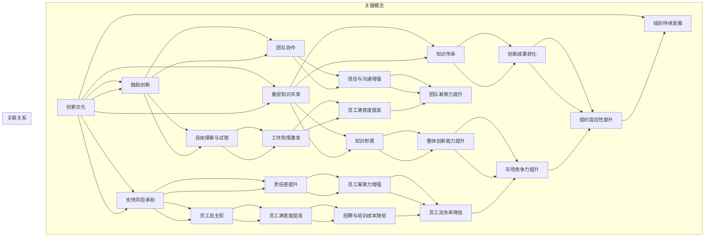

                 

### 创新文化的定义与重要性

#### 创新文化的概念

创新文化是指一种鼓励创新、支持风险承担、重视知识共享的组织氛围。它不仅仅体现在组织的制度层面，更是渗透到组织的日常运作、员工的心态和行为之中。创新文化强调集体智慧的重要性，倡导通过协作与互动来实现突破性的创新成果。

在一个具有创新文化的组织中，员工通常拥有自由探索和试错的空间，他们被鼓励提出新的想法，并参与到创新项目的全过程中。这种文化氛围激发了员工的工作热情和创造力，使组织能够不断适应外部环境的变化，保持持续的竞争力。

#### 创新文化的重要性

1. **提升组织竞争力**

   创新文化能够促使组织持续地开发新产品、改进现有产品和服务，从而满足市场的不断变化需求。通过不断地创新，组织能够在竞争激烈的市场中脱颖而出，提高市场份额和品牌影响力。

2. **增强员工凝聚力**

   在一个创新文化中，员工感受到组织的支持和信任，他们更有动力为组织的成功而努力工作。创新文化能够促进团队协作，增强员工之间的信任和沟通，从而提升整个团队的凝聚力。

3. **提高员工满意度**

   创新文化给予员工更多的自主权和责任感，使他们能够充分发挥个人特长和创造力。这种工作环境能够显著提高员工的满意度，降低员工流失率，从而降低招聘和培训成本。

4. **促进知识共享**

   创新文化鼓励员工分享知识、经验和技能，从而促进整个组织的知识积累和传承。这种知识共享的文化氛围有助于提高组织的整体创新能力，加速创新成果的转化和应用。

5. **提升组织适应性**

   在快速变化的市场环境中，创新文化能够帮助组织快速适应外部环境的变化，及时调整战略和运营模式。这种适应性使组织能够更好地应对市场挑战，保持持续的竞争力。

#### 总结

创新文化是一种推动组织持续发展的关键因素。它不仅能够提升组织的竞争力，还能够增强员工凝聚力和满意度，促进知识共享和提升组织适应性。因此，建立和培育创新文化是每个组织都应该重视的任务。

在接下来的章节中，我们将深入探讨构建创新团队的基石，以及如何在实践中培养和维护创新文化。这不仅有助于理解创新文化的本质，更为实际操作提供了可行的指导。

### 核心概念原理关系架构

为了更好地理解创新文化中各个核心概念之间的关联，我们可以通过Mermaid流程图来展示它们之间的逻辑关系。以下是创新文化中几个关键概念之间的关系架构：

从上述Mermaid流程图中可以看出，创新文化是一个多维度的概念，它包括了鼓励创新、支持风险承担、重视知识共享等核心要素。这些要素之间相互关联，共同作用于组织的发展和员工的体验。

- **鼓励创新**与**自由探索与试错**、**团队协作**紧密相关，这些因素共同激发员工的工作热情。
- **支持风险承担**则与**员工自主权**和**责任感提升**密切相关，这有助于提高员工的满意度和团队凝聚力。
- **重视知识共享**促进了**知识积累**和**知识传承**，从而提升了整体创新能力和组织适应性。

通过这个流程图，我们可以清晰地看到创新文化中各个要素之间的逻辑关系，有助于我们更好地理解和实践创新文化。

### 构建创新团队的基石

#### 创新团队的特性

构建一个创新团队是培育创新文化的重要一步。创新团队具有以下几个显著特性：

1. **多样性**

   创新团队应当具备多样化的背景、技能和观点。这种多样性不仅包括不同文化和教育背景的成员，还应包括不同专业技能和思维方式的人。多样性能带来不同的视角和解决问题的方法，从而促进创新的产生。

2. **自主性**

   创新团队应当拥有一定的自主权，可以自由地决定项目的方向和策略。这种自主性鼓励团队成员发挥创造力，勇于尝试新的想法和方法，从而提高团队的创新潜力。

3. **协作精神**

   协作精神是创新团队成功的关键。团队成员之间应建立良好的沟通和合作机制，共同面对挑战，分享知识和资源。协作精神能够促进团队的凝聚力和信任，有助于实现共同的目标。

4. **灵活性**

   创新团队应当具备灵活调整计划和策略的能力，以适应不断变化的外部环境。这种灵活性有助于团队快速响应市场变化，抓住创新机会。

#### 创新团队的构建要素

要构建一个成功的创新团队，需要考虑以下几个关键要素：

1. **人才选拔**

   在选拔团队成员时，应注重多样性和技能互补。除了专业技能，还应关注团队成员的思维方式、团队合作精神和创新能力。通过多渠道的招聘和选拔，确保团队具备丰富的背景和知识。

2. **组织架构**

   创新团队的架构应支持灵活性和快速响应能力。团队应采用扁平化的结构，减少决策层级，提高决策效率。此外，团队内部应建立有效的沟通和协作机制，确保信息流畅和知识共享。

3. **激励机制**

   为了激发团队成员的创新能力，应建立合理的激励机制。这包括提供竞争性的薪酬、晋升机会、培训和发展计划等。同时，还应设立创新奖励机制，鼓励团队成员提出和实施创新项目。

4. **创新氛围**

   创新氛围是培育创新文化的基础。组织应营造一个鼓励创新、支持试错和包容失败的环境。通过举办创新工作坊、分享会等活动，促进团队成员之间的交流和协作，激发创新的火花。

5. **资源支持**

   创新项目通常需要一定的资源支持，包括资金、技术设备和人力资源。组织应提供必要的资源，确保创新团队能够顺利开展项目，并在遇到困难时提供帮助和支持。

#### 团队协作的方法

团队协作是创新团队成功的关键。以下是一些有效的团队协作方法：

1. **头脑风暴**

   头脑风暴是一种集体思考的方法，鼓励团队成员自由地提出各种创意和想法。通过头脑风暴，团队成员可以相互启发，碰撞出新的火花。

2. **团队建设活动**

   定期的团队建设活动有助于增强团队成员之间的信任和协作精神。这些活动可以包括团队拓展、团队合作游戏等，通过互动和合作，提升团队的凝聚力。

3. **知识共享平台**

   建立一个知识共享平台，如内部论坛或Wiki，让团队成员能够方便地分享知识和经验。这有助于提高团队的整体创新能力，并促进知识的传承和积累。

4. **定期会议**

   定期召开团队会议，讨论项目的进展、挑战和解决方案。会议应保持高效和聚焦，确保团队成员能够充分沟通和协作。

#### 总结

构建一个创新团队需要考虑多个方面的要素，包括多样性、自主性、协作精神和灵活性。通过合理的人才选拔、组织架构设计、激励机制、创新氛围营造和资源支持，可以有效地培育和维护一个创新团队。同时，团队协作方法是实现团队目标的重要手段，通过有效的协作，团队能够更好地应对挑战，实现创新目标。

在下一章节中，我们将探讨如何培养成长心态和创造力，以及它们在创新团队中的重要性。

### 培养成长心态和创造力

#### 成长心态的概念

成长心态（Growth Mindset）是由心理学家卡罗尔·德韦克（Carol Dweck）提出的概念，它指的是个体对待学习和挑战的态度。具有成长心态的人相信能力可以通过努力和学习得到提升，而不仅仅是天赋或遗传决定的。相反，固定心态（Fixed Mindset）的人则认为能力是固定的，无法改变，因此更倾向于避免挑战和失败。

#### 成长心态与创造力

成长心态在创新团队中扮演着至关重要的角色。它鼓励团队成员面对失败和挑战时保持积极态度，从中学习和成长。这种心态有助于培养以下几方面的创造力：

1. **勇于尝试**

   成长心态使团队成员更愿意尝试新的想法和方法，即使这些尝试可能失败。这种勇于尝试的精神是创新过程中不可或缺的，因为它推动了新想法的产生和尝试。

2. **持续学习**

   成长心态强调学习和知识的重要性，使团队成员不断追求新知识和技能。这种持续学习的态度有助于团队在面对复杂问题时能够运用多种方法进行解决。

3. **适应变化**

   成长心态的人能够更好地适应外部环境的变化。在创新过程中，外部环境往往快速变化，具有成长心态的团队能够迅速调整策略，抓住新的机遇。

4. **积极应对失败**

   成长心态帮助团队成员从失败中学习，并将其视为成长的机会。这种积极应对失败的态度能够增强团队的韧性和创造力。

#### 创造力的培养方法

在创新团队中，培养创造力是提升整体创新能力的核心。以下是一些有效的创造力培养方法：

1. **提供挑战性任务**

   为团队成员分配具有挑战性的任务，鼓励他们跳出舒适区。这种挑战能够激发团队成员的思考和创造力，促使他们寻找创新的解决方案。

2. **鼓励跨学科合作**

   跨学科合作能够带来不同的视角和思路，从而激发创造力。通过将来自不同领域的团队成员组织在一起，可以促进知识的交叉融合，产生创新的思维。

3. **创造一个安全的环境**

   创造一个安全、包容的环境，使团队成员感到自由表达自己的想法，而不必担心失败或批评。这种环境有助于激发创造力，使团队成员敢于尝试新想法。

4. **定期进行头脑风暴**

   定期进行头脑风暴是一种有效的激发创造力的方法。通过自由地提出各种创意和想法，团队成员可以相互启发，碰撞出新的火花。

5. **提供学习和发展机会**

   为团队成员提供持续学习和发展的机会，如培训、研讨会和在线课程等。这些机会有助于提升团队成员的技能和知识，从而提高创造力。

#### 成长心态与创造力之间的关系

成长心态和创造力之间存在着密切的关系。具有成长心态的团队成员更倾向于追求创新和挑战，他们相信通过不断学习和努力，能够提升自己的能力。这种信念激发了他们的创造力，使他们能够在面对困难和挑战时保持积极态度，并从中学习和成长。

此外，成长心态有助于培养一种积极的心态，使团队成员在面对失败时能够从错误中汲取教训，而不是放弃或感到沮丧。这种积极的心态进一步促进了创造力的发展，因为团队成员愿意尝试新的方法，并从失败中寻找机会。

#### 总结

培养成长心态和创造力是构建创新团队的重要一环。通过提供挑战性任务、鼓励跨学科合作、创造一个安全的环境、定期进行头脑风暴和提供学习和发展机会，可以有效地提升团队的创造力。成长心态则为这种创造力提供了坚实的基础，使团队成员在面对挑战和失败时能够保持积极态度，并从中学习和成长。在下一章节中，我们将探讨如何在创新团队中实现有效的沟通与协作。

### 有效的沟通与协作

#### 沟通在创新团队中的作用

在创新团队中，沟通是确保项目顺利进行和达成目标的关键环节。有效的沟通不仅能够确保信息的准确传递，还能够促进团队成员之间的理解和协作，从而提高团队的整体创新能力。以下是沟通在创新团队中的几个重要作用：

1. **信息共享**

   创新团队通常需要处理大量的信息，包括市场动态、技术进展、用户反馈等。有效的沟通可以帮助团队成员及时获取和共享这些信息，使整个团队能够基于最新的信息做出决策，从而更好地应对外部环境的变化。

2. **促进理解**

   创新过程中往往涉及复杂的技术和概念。通过有效的沟通，团队成员可以清晰地传达自己的想法和观点，从而促进相互理解，避免误解和冲突。这种理解有助于团队成员更好地协作，共同推进创新项目。

3. **增强团队凝聚力**

   沟通不仅仅是信息的传递，更是团队成员之间的情感交流和互动。通过积极的沟通，团队成员可以建立深厚的信任和合作关系，从而增强团队的凝聚力。这种凝聚力有助于团队在面对挑战时保持团结一致，共同克服困难。

4. **提高决策效率**

   在创新团队中，决策往往需要快速而准确。有效的沟通可以帮助团队成员快速交换意见，讨论和评估各种方案，从而提高决策效率。同时，透明和开放的沟通环境也能够减少决策过程中的阻力，使团队能够更迅速地响应市场变化。

#### 协作技巧与实践

协作是创新团队成功的重要保障。以下是一些有效的协作技巧和实践，可以帮助团队成员更好地合作：

1. **定期会议**

   定期召开团队会议是确保团队成员保持沟通的重要手段。会议可以分为日常工作更新、项目进展讨论、决策制定等类型。通过定期会议，团队成员可以及时了解项目动态，讨论和解决遇到的问题，确保项目按计划进行。

2. **明确角色和责任**

   在创新团队中，明确每个成员的角色和责任是非常重要的。通过角色分配，团队成员可以清楚地知道自己的工作内容和预期成果，从而提高工作效率和责任感。此外，明确的责任分配也有助于避免工作重复和职责不清的情况。

3. **共享工具和平台**

   使用共享工具和平台，如项目管理软件、即时通讯工具、协作平台等，可以方便团队成员之间的沟通和协作。这些工具可以记录项目进展、共享文档和资源、实时讨论和协作，从而提高团队的工作效率。

4. **鼓励反馈和改进**

   鼓励团队成员之间进行积极的反馈和改进，有助于提高团队的整体表现。通过反馈，团队成员可以了解自己的优势和不足，从而不断改进工作方法和技能。同时，反馈也是一种重要的沟通方式，可以促进团队成员之间的理解和信任。

5. **团队建设活动**

   定期组织团队建设活动，如团队拓展训练、团建聚会等，可以增强团队成员之间的互动和信任，提升团队凝聚力。这些活动不仅有助于缓解工作压力，还可以促进团队成员之间的交流，激发创新思维。

#### 实际案例

以下是一个实际案例，展示如何在创新团队中实现有效的沟通与协作：

**案例：一家科技公司的新产品开发团队**

- **问题背景**：该团队负责开发一款智能家居产品，项目涉及多个领域的技术和复杂的开发任务。团队成员来自不同的背景，沟通和协作成为项目成功的关键。

- **解决方案**：
  1. **定期会议**：团队每周召开一次项目会议，讨论项目进展、遇到的问题和解决方案。会议通过视频会议工具进行，确保团队成员能够实时参与。
  2. **角色和责任分配**：根据团队成员的技能和专长，明确每个成员的具体职责，如技术架构设计、前端开发、后端开发、测试等。每位成员都清楚自己的任务和目标。
  3. **共享工具和平台**：团队使用项目管理软件（如Trello）记录项目进度、任务分配和问题跟踪。同时，使用即时通讯工具（如Slack）进行日常沟通和协作，确保信息的及时传递。
  4. **鼓励反馈和改进**：团队鼓励成员在会议和即时通讯工具中分享自己的工作进展和遇到的问题，并进行讨论和改进。通过这种方式，团队成员能够相互学习，共同进步。
  5. **团队建设活动**：团队每月组织一次团队建设活动，如技术分享会、户外团建等，增强团队成员之间的互动和信任。

- **结果**：通过上述措施，团队在项目开发过程中保持了高效的沟通和协作。项目最终按计划顺利完成，并得到了市场的积极反响。

#### 总结

有效的沟通与协作是创新团队成功的关键。通过定期会议、明确角色和责任、共享工具和平台、鼓励反馈和改进以及团队建设活动，可以确保团队成员之间的信息共享和理解，提高决策效率和工作效率。在下一章节中，我们将探讨如何克服创新过程中的障碍和利用多样性来推动团队创新。

### 克服障碍与利用多样性

#### 创新过程中的障碍

在创新过程中，团队常常会遇到各种障碍，这些障碍可能会限制团队的创新能力，影响项目的进展。以下是一些常见的障碍及其解决方法：

1. **资源限制**

   创新项目通常需要大量的资源，包括资金、人力和技术等。资源限制可能导致团队无法实施某些创新想法。解决方法包括：
   - **优化资源分配**：合理规划和分配资源，确保关键任务得到充分支持。
   - **外部合作**：寻求外部合作伙伴或投资者，共同分担资源压力。

2. **技术难题**

   技术难题是创新过程中不可避免的挑战。复杂的技术问题可能需要大量的时间和精力来解决。解决方法包括：
   - **技术创新**：通过研究和开发，寻找新的技术解决方案。
   - **专家咨询**：聘请行业专家或顾问，提供技术支持和指导。

3. **团队协作问题**

   团队协作问题可能导致沟通不畅、意见分歧和执行力下降。解决方法包括：
   - **建立沟通机制**：通过定期会议、即时通讯工具等，确保团队成员之间的信息共享和沟通。
   - **团队建设**：通过团队建设活动，增强团队成员之间的信任和协作精神。

4. **时间压力**

   创新项目往往面临时间限制，时间压力可能导致团队无法充分准备和实施创新计划。解决方法包括：
   - **时间管理**：制定详细的项目计划和时间表，确保任务按时完成。
   - **灵活调整**：在项目进展过程中，根据实际情况及时调整计划和策略。

5. **外部阻力**

   外部因素，如市场竞争、客户需求变化等，也可能对创新项目产生阻力。解决方法包括：
   - **市场调研**：通过市场调研，了解客户需求和市场竞争情况，调整创新方向。
   - **战略调整**：根据市场变化，及时调整创新策略和目标。

#### 多样性的作用

多样性是推动团队创新的重要力量。通过引入不同背景、技能和观点的成员，团队可以带来更多的视角和解决问题的方法，从而激发创新。以下是多样性的几个重要作用：

1. **激发创新思维**

   多样性能够激发团队成员的创造性思维。不同的文化背景和思维方式可以带来新的想法和观点，使团队能够从不同的角度看待问题，从而产生创新的解决方案。

2. **提高问题解决能力**

   面对复杂问题时，多样性的团队能够运用不同的知识和技能，更全面地分析问题，提出多种解决方案。这种多元化的思维方式有助于团队快速找到问题的根源，并提出有效的解决方案。

3. **增强团队适应性**

   多样性使团队能够更好地适应外部环境的变化。不同的观点和技能可以帮助团队迅速应对市场变化和技术进步，从而保持竞争力。

4. **提高团队凝聚力**

   多样性可以增强团队的凝聚力。通过尊重和欣赏不同的观点和技能，团队成员之间能够建立更深层次的信任和合作关系，从而提高团队的凝聚力。

#### 利用多样性的策略

为了充分利用多样性，团队可以采取以下策略：

1. **多样化的招聘**

   在招聘过程中，注重多样性和包容性，吸引不同背景和技能的人才。这可以通过开放性职位描述、多元化的招聘渠道和积极的多样性培训来实现。

2. **建立包容性文化**

   在团队中建立包容性文化，鼓励团队成员尊重和欣赏不同的观点和技能。这可以通过团队建设活动、定期的多样性培训和文化活动来实现。

3. **促进知识共享**

   鼓励团队成员分享知识和经验，使整个团队能够从多样性的资源中受益。这可以通过内部论坛、知识共享平台和定期会议来实现。

4. **利用跨学科合作**

   促进跨学科合作，将不同领域的知识和技能结合起来，激发创新的火花。这可以通过组织跨学科团队、项目合作和知识交流来实现。

#### 总结

在创新过程中，团队可能会遇到多种障碍，但通过合理的策略和多样性的利用，可以有效地克服这些障碍。多样化的团队不仅能够激发创新思维，提高问题解决能力，还能够增强团队的适应性和凝聚力。因此，培育和利用多样性是推动团队创新的重要策略。在下一章节中，我们将通过实际案例研究，探讨成功创新文化的实践和启示。

### 创新文化的案例研究

#### 案例一：谷歌（Google）

**背景**：

谷歌是一家全球知名的技术公司，以其创新文化和开放的工作环境而闻名。谷歌的创始人拉里·佩奇和谢尔盖·布林倡导“不作恶”（Don’t Be Evil）的价值观，并致力于创造一个鼓励创新和自由探索的工作环境。

**实践**：

1. **资源自由分配**：谷歌为员工提供大量的资源，包括资金、技术和时间，以支持他们的创新项目。员工可以自由选择感兴趣的项目，甚至可以暂时脱离日常的工作任务，专注于自己的创新想法。

2. **创新激励**：谷歌设有多种创新奖励机制，如“10%时间”政策，允许员工将每周10%的工作时间用于个人项目。此外，公司还设有年度“谷歌创新奖”，表彰在技术创新和业务发展方面取得突出成就的员工。

3. **知识共享平台**：谷歌内部设有多种知识共享平台，如内部论坛和Wiki，员工可以在这里分享自己的知识和经验，促进团队之间的协作和知识积累。

**结果**：

谷歌通过这些实践，营造了一个高度创新的工作环境，不断推出具有突破性的产品和服务，如Google Search、Gmail、Google Maps等。这些创新不仅使谷歌在市场竞争中脱颖而出，还使公司成为全球创新文化的典范。

**启示**：

- 提供自由和开放的资源支持，鼓励员工自由探索和创新。
- 设立明确的创新激励和奖励机制，激发员工的创新热情。
- 建立有效的知识共享平台，促进团队间的协作和知识积累。

#### 案例二：特斯拉（Tesla）

**背景**：

特斯拉是一家专注于电动汽车和清洁能源技术的公司。以埃隆·马斯克（Elon Musk）为核心的领导层倡导创新和快速迭代的工作方法，致力于推动能源革命的进程。

**实践**：

1. **扁平化管理结构**：特斯拉采用扁平化的组织结构，减少管理层级，提高决策效率。这种结构使得创新想法能够迅速得到实施和反馈。

2. **跨界合作**：特斯拉积极与其他领域的公司合作，如软件、硬件、能源等，以实现技术的跨界融合和创新。

3. **员工参与决策**：特斯拉鼓励员工参与公司决策，通过定期的内部会议和讨论，确保员工的意见和建议能够被听取和采纳。

**结果**：

特斯拉通过这些实践，迅速发展壮大，成为全球领先的电动汽车制造商和清洁能源技术企业。公司的产品和服务在市场上取得了显著的竞争优势，并受到了广泛认可。

**启示**：

- 采用扁平化的管理结构，提高决策效率和创新能力。
- 促进跨界合作，实现技术融合和创新。
- 鼓励员工参与决策，增强员工的归属感和创新热情。

#### 案例三：阿里巴巴（Alibaba）

**背景**：

阿里巴巴是一家全球领先的互联网公司，以其电商业务和云计算服务闻名。阿里巴巴的创始人马云强调企业文化的重要性，致力于打造一个具有高度创新能力的团队。

**实践**：

1. **持续学习**：阿里巴巴鼓励员工持续学习，提供丰富的培训和学习资源，帮助员工不断提升技能和知识。

2. **跨团队协作**：阿里巴巴推动跨团队的协作和合作，通过“双11”购物节等大型活动，激发团队的创新能力和协同作战精神。

3. **员工福利**：阿里巴巴为员工提供良好的工作环境和福利待遇，如弹性工作时间、员工股票期权等，增强员工的满意度和忠诚度。

**结果**：

通过这些实践，阿里巴巴在电商、云计算、数字支付等多个领域取得了巨大的成功，成为全球互联网企业的领军者。

**启示**：

- 鼓励员工持续学习和提升技能，为创新提供知识储备。
- 促进跨团队协作，激发创新的火花。
- 提供良好的员工福利和工作环境，增强员工的满意度和忠诚度。

#### 总结

通过上述案例，我们可以看到成功创新文化的实践和启示。无论是谷歌的开放资源支持、特斯拉的扁平化管理结构，还是阿里巴巴的持续学习和跨团队协作，这些实践都为团队的创新提供了有力的支持和保障。在构建创新文化时，组织应当根据自身特点和需求，灵活运用这些成功经验，营造一个鼓励创新、支持风险承担、重视知识共享的工作环境，从而推动组织的持续发展和竞争力提升。

### 实用工具与策略

在培养创新文化过程中，使用适当的工具和策略可以显著提升团队的创新能力。以下是一些实用的工具和策略，帮助组织在实践过程中有效培养和维护创新文化。

#### 常见创新工具

1. **头脑风暴**

   头脑风暴是一种集思广益的方法，通过快速生成大量想法，激发团队成员的创造力。以下是一些实施头脑风暴的技巧：
   - **限制时间**：设定一个时间限制，以保持头脑风暴的流畅性。
   - **无限制表达**：鼓励团队成员自由地表达任何想法，无论其是否合理或可行。
   - **记录和分类**：将所有提出的想法记录下来，并进行分类，以进一步讨论和评估。

2. **思维导图**

   思维导图是一种图形化的思维工具，可以帮助团队组织和可视化复杂的信息。通过将相关的想法和观点连接起来，思维导图可以揭示概念之间的关系，促进创新思维的发散。

3. **设计思考**

   设计思考是一种以用户为中心的创新方法，通过理解用户需求和痛点，创造出具有实际应用价值的产品和服务。设计思考的步骤包括：
   - **理解用户**：通过用户调研和访谈，了解用户的需求和行为。
   - **定义问题**：明确需要解决的问题，并形成具体的用户场景。
   - **生成想法**：基于用户需求，生成多种可能的解决方案。
   - **原型制作**：制作可交互的原型，用于测试和反馈。

#### 激励创新策略

1. **设立创新奖励**

   通过设立创新奖励，可以激励团队成员提出和实施创新项目。这些奖励可以包括奖金、晋升机会和公开表彰等。设立明确的创新标准和评估机制，确保奖励的公平性和透明度。

2. **提供发展机会**

   为团队成员提供持续的学习和发展机会，如内部培训、外部研讨会和在线课程等。这不仅可以提升团队成员的技能和知识，还可以激发他们的创新潜力。

3. **灵活的工作安排**

   提供灵活的工作时间和地点，为团队成员创造一个宽松和创新的工作环境。例如，实施远程工作制度、弹性工作时间等，使员工能够更加自由地安排工作和生活。

4. **跨部门合作**

   鼓励跨部门合作，打破部门壁垒，促进知识和资源的共享。通过跨部门的团队合作，可以激发不同的观点和思路，推动创新项目的实施。

#### 实践案例分析

以下是一个创新工具和策略的实践案例：

**案例：一家科技公司的新产品开发团队**

- **问题背景**：该团队负责开发一款智能家居产品，项目涉及多个领域的技术和复杂的开发任务。团队成员来自不同的背景，沟通和协作成为项目成功的关键。

- **解决方案**：
  1. **头脑风暴**：团队每周进行一次头脑风暴会议，讨论项目面临的挑战和可能的解决方案。通过限制时间和无限制表达，团队成员提出了大量创新的想法。
  2. **思维导图**：将头脑风暴中产生的想法记录在思维导图上，并分析其相互关系和可行性，从而筛选出最具潜力的创新点。
  3. **设计思考**：团队采用设计思考方法，通过用户调研和访谈，了解用户的需求和行为，明确了产品需要解决的核心问题。
  4. **设立创新奖励**：公司设立“创新先锋奖”，对在项目中提出和实施创新方案的个人和团队进行奖励，以激发团队成员的创新热情。
  5. **跨部门合作**：团队与市场部、用户服务部等跨部门合作，共同开发和推广产品，确保产品能够满足市场需求。

- **结果**：通过上述措施，团队在项目开发过程中保持了高效的沟通和协作，创新方案得到有效实施。产品在市场上取得了良好的反响，销售额显著提升。

#### 总结

通过使用适当的创新工具和策略，团队可以有效地培养和维护创新文化。头脑风暴、思维导图、设计思考等工具可以帮助团队激发创新思维，而设立创新奖励、提供发展机会、灵活的工作安排和跨部门合作等策略则可以激励团队成员积极参与创新项目，推动组织的持续发展。

### 创新文化的领导力

#### 领导者在创新文化中的角色

在创新文化的塑造和维护中，领导者的角色至关重要。领导者不仅是创新文化的倡导者，更是实践者和推动者。以下是一些领导者应承担的关键角色：

1. **文化塑造者**

   领导者需要明确和创新文化的价值观，并将其融入到组织的日常运作中。通过树立榜样和倡导创新精神，领导者能够激发团队成员的创造力和积极性。

2. **支持者**

   领导者应成为团队成员创新活动的有力支持者。这包括提供必要的资源、时间和空间，使员工能够在安全和自由的环境中尝试新的想法和方案。

3. **激励者**

   领导者需要通过激励措施，如奖励和认可，鼓励团队成员积极参与创新活动。这种激励不仅能够提高员工的工作热情，还能增强团队的凝聚力和创新能力。

4. **沟通者**

   领导者应积极与团队成员进行沟通，了解他们的想法和困惑，并及时提供反馈和支持。这种开放和透明的沟通有助于建立信任，促进创新思维的碰撞和分享。

#### 领导力与团队创新的关系

领导力对团队创新具有深远的影响。以下从几个方面探讨领导力与团队创新之间的关系：

1. **领导风格**

   领导者的风格直接影响团队的创新氛围。民主型领导风格鼓励团队成员参与决策，促进知识共享和创意的交流，有助于激发团队的创新能力。相反，专制型领导风格可能会抑制创新，使团队成员缺乏表达和参与的机会。

2. **信任与支持**

   领导者对团队成员的信任和支持是创新文化的重要基石。当团队成员感受到领导者的信任和支持时，他们更愿意承担风险，提出新的想法和尝试。这种信任和支持能够营造一个安全、包容的创新环境，促进团队的创新活力。

3. **激励与认可**

   激励和认可能够显著提升团队的创新积极性。领导者通过设立创新目标和奖励机制，对在创新活动中表现突出的团队成员进行表彰和奖励，能够激发团队成员的创新热情，增强他们的工作动力。

4. **资源配置**

   创新活动通常需要大量的资源支持。领导者需要合理配置资源，确保团队在创新过程中能够获得所需的技术、资金和人力等资源。同时，领导者还应建立灵活的资源配置机制，使团队能够根据项目需求进行调整和优化。

#### 实践中的领导力策略

以下是一些在实践中有效的领导力策略，帮助领导者培养和维护创新文化：

1. **鼓励试错**

   领导者应鼓励团队成员在创新过程中勇于尝试，接受失败并从中学习。通过建立试错文化，领导者可以消除团队成员的恐惧和顾虑，激发他们的创新勇气。

2. **提供反馈**

   领导者应及时为团队成员提供反馈，帮助他们了解自己的优势和不足，并提供改进的建议。这种及时的反馈不仅能够促进团队成员的成长，还能增强他们的创新能力和自信心。

3. **促进知识共享**

   领导者应积极推动团队成员之间的知识共享和经验交流，通过组织内部培训、研讨会和分享会等活动，促进团队整体的知识积累和创新。

4. **建立激励机制**

   领导者应建立合理的创新激励机制，对在创新活动中取得显著成绩的团队成员进行奖励和认可。这种激励机制不仅能够激发创新热情，还能增强团队的凝聚力和向心力。

5. **倡导开放沟通**

   领导者应倡导开放和透明的沟通文化，鼓励团队成员自由表达意见和想法，建立信任和尊重的团队氛围。这种沟通文化有助于团队成员之间的协作和创新思维的产生。

#### 总结

领导者在创新文化中扮演着至关重要的角色。通过塑造文化、提供支持、激励员工、促进知识共享等策略，领导者可以有效地培养和维护创新文化，推动团队创新。在创新过程中，领导者不仅需要具备前瞻性的眼光和战略思维，还需要具备良好的沟通能力和团队管理能力。通过不断的实践和改进，领导者可以成为团队创新的推动者和引领者，为组织的持续发展和竞争力提升奠定坚实的基础。

### 创新文化的组织架构

#### 组织架构对创新文化的影响

组织架构是创新文化的基础之一，它直接影响团队的创新能力和文化氛围。以下从几个方面探讨组织架构对创新文化的影响：

1. **层级结构**

   层级结构较为严格的组织可能会抑制创新。在高度层级的组织中，决策过程往往繁琐且缺乏灵活性，创新想法可能难以迅速得到实施。相反，扁平化的组织结构能够减少管理层级，提高决策效率，从而促进创新。

2. **部门壁垒**

   部门壁垒会限制信息共享和协作，阻碍创新文化的形成。在高度部门化的组织中，各部门往往关注自身的目标和利益，导致资源分散和信息孤岛。相反，跨部门的合作和资源共享有助于激发创新思维，提升整体创新能力。

3. **职责分工**

   明确的职责分工有助于提高工作效率，但也可能限制员工的创新空间。在高度分工的组织中，员工的职责相对固定，创新机会有限。相反，灵活的职责分工和跨职能团队可以促进员工之间的互动和协作，激发创新潜力。

#### 创新文化组织架构的设计原则

为了培育和维护创新文化，组织架构设计应遵循以下原则：

1. **灵活性**

   创新文化需要灵活的组织架构，能够快速适应外部环境的变化。这包括灵活的工作安排、灵活的职责分工和灵活的决策过程。通过减少约束和限制，组织可以更好地激发员工的创造力和创新热情。

2. **协作性**

   创新文化强调团队合作和知识共享。组织架构设计应促进跨部门协作，消除部门壁垒，建立高效的沟通和协作机制。通过建立跨职能团队、设立共享平台和定期举办协作活动，可以促进团队成员之间的互动和协作。

3. **开放性**

   开放性是创新文化的核心特征之一。组织架构应鼓励开放沟通和自由表达，使员工能够畅所欲言，分享自己的想法和观点。通过建立透明的决策过程和开放的工作环境，组织可以培养一种包容、尊重和信任的文化氛围。

4. **激励性**

   创新文化需要激励员工积极参与创新活动。组织架构设计应包括合理的激励机制，如绩效评估、晋升机会和创新奖励。通过设立明确的目标和激励措施，组织可以激发员工的创新热情，提升整体创新能力。

#### 实践中的创新组织架构案例

以下是一些在实践中的创新组织架构案例：

1. **扁平化组织**

   谷歌是一家著名的扁平化组织，其管理结构相对简单，减少了管理层级和决策路径。这种结构使得员工能够更加自由地提出和实施创新想法，促进了公司内部的信息流动和创新能力的提升。

2. **跨职能团队**

   亚马逊采用跨职能团队（Cross-functional Teams）模式，将不同部门的专业人员组成一个团队，共同负责一个项目的开发和推进。这种模式促进了团队成员之间的协作和知识共享，提升了项目的创新性和效率。

3. **开放性组织**

   布朗大学采用开放性组织架构，鼓励教师和学生在教学和科研中自由探索和创新。学校设立多种开放性平台和论坛，促进学术交流和思想碰撞，培养了一种充满活力和创新氛围的校园文化。

#### 总结

创新文化的组织架构设计对于培育和维护创新文化至关重要。通过灵活、协作、开放和激励的设计原则，组织可以建立一种支持创新和知识共享的工作环境，激发员工的创造力和创新热情。在下一章节中，我们将探讨创新文化的发展趋势及其对社会的影响。

### 未来展望

#### 创新文化的发展趋势

随着全球化和技术的快速发展，创新文化正面临着新的机遇和挑战。以下是一些创新文化的发展趋势：

1. **数字化创新**

   随着数字技术的不断进步，数字化创新将成为未来创新文化的重要方向。组织将更加依赖数据分析、人工智能和区块链等技术，推动产品和服务创新。

2. **可持续发展**

   可持续发展成为全球关注的焦点，创新文化将更加注重环保和可持续发展。绿色技术和可持续商业模式将成为企业竞争力的重要来源。

3. **跨界合作**

   跨界合作将成为创新文化的重要组成部分。通过与其他行业和领域的合作，组织可以整合不同的资源和技术，实现创新突破。

4. **个性化创新**

   随着消费者需求的多样化，个性化创新将成为企业的重要战略。通过定制化产品和服务，企业可以更好地满足不同消费者的需求。

#### 创新文化对社会的影响

创新文化不仅对组织内部产生深远影响，也对整个社会产生积极的作用：

1. **经济增长**

   创新文化能够推动经济增长，通过技术创新和商业模式创新，创造新的就业机会和市场需求。

2. **社会进步**

   创新文化有助于社会进步，通过解决社会问题、提升生活质量，推动社会可持续发展。

3. **文化多样性**

   创新文化鼓励多样性，促进不同文化、观点和技能的交流与融合，增强社会包容性。

4. **教育变革**

   创新文化将推动教育变革，培养学生的创新思维和创造力，为社会培养更多的创新人才。

#### 总结

未来，创新文化将继续发展，为组织和社会带来新的机遇和挑战。通过数字化创新、可持续发展、跨界合作和个性化创新，组织可以不断提升创新能力，实现持续发展。创新文化对社会的影响也将进一步扩大，推动经济增长、社会进步和文化多样性。因此，培育和维护创新文化将成为每个组织和社会发展的重要任务。

### 全文总结

本文从多个角度探讨了创新文化的核心概念、构建方法、实践策略及其对组织和社会的影响。首先，我们明确了创新文化的定义和重要性，阐述了它在提升组织竞争力、增强员工满意度和促进知识共享等方面的作用。接着，通过Mermaid流程图展示了创新文化中各个核心概念之间的关系架构。

在构建创新团队方面，我们探讨了团队多样性的重要性、构建要素和协作技巧，强调了自主性、协作精神和灵活性的关键作用。随后，我们深入分析了成长心态和创造力的培养方法，以及沟通与协作在创新团队中的关键作用。

在克服障碍与利用多样性方面，我们讨论了创新过程中常见的障碍及其解决方法，强调了多样性的重要作用。通过实际案例，我们展示了如何通过多样化招聘、建立包容性文化和促进知识共享来推动团队创新。

在案例分析章节中，我们详细介绍了谷歌、特斯拉和阿里巴巴等成功企业的创新实践，总结了它们的成功经验。这些案例为我们提供了宝贵的启示，展示了如何在不同组织和行业中培育和维护创新文化。

在实用工具与策略章节中，我们介绍了头脑风暴、思维导图、设计思考等创新工具，以及设立创新奖励、提供发展机会和促进跨部门合作等激励创新策略。这些工具和策略为组织在实践创新文化时提供了具体的指导。

在领导力和组织架构章节中，我们探讨了领导者在创新文化中的角色和作用，分析了领导力与团队创新的关系，并提出了实践中的领导力策略和组织架构设计原则。这为组织在构建创新文化时提供了理论支持和实践指导。

最后，在展望未来章节中，我们分析了创新文化的发展趋势，包括数字化创新、可持续发展、跨界合作和个性化创新等，并探讨了创新文化对社会的影响。这为读者提供了对未来创新文化的宏观视角和前瞻性思考。

总之，创新文化是组织持续发展和竞争力提升的关键因素。通过深入理解和实践创新文化，组织可以激发员工的创造力，推动技术创新，实现可持续发展。本文旨在为读者提供一个全面、系统的创新文化指南，帮助他们成功培育和维护创新文化，为组织的未来奠定坚实基础。

### 小结与拓展阅读

#### 小结

本文系统地探讨了团队创新文化的重要性、构建方法、实践策略及其对社会的影响。首先，明确了创新文化的核心概念和重要性，阐述了其在提升组织竞争力、增强员工满意度和促进知识共享等方面的作用。接着，通过Mermaid流程图展示了创新文化中各个核心概念之间的关系架构，为理解创新文化奠定了理论基础。

在构建创新团队方面，我们探讨了团队多样性的重要性、构建要素和协作技巧，强调了自主性、协作精神和灵活性的关键作用。随后，我们深入分析了成长心态和创造力的培养方法，以及沟通与协作在创新团队中的关键作用。在克服障碍与利用多样性方面，我们讨论了创新过程中常见的障碍及其解决方法，强调了多样性的重要作用。

在案例分析章节中，我们详细介绍了谷歌、特斯拉和阿里巴巴等成功企业的创新实践，总结了它们的成功经验。这些案例为我们提供了宝贵的启示，展示了如何在不同组织和行业中培育和维护创新文化。

在实用工具与策略章节中，我们介绍了头脑风暴、思维导图、设计思考等创新工具，以及设立创新奖励、提供发展机会和促进跨部门合作等激励创新策略。这些工具和策略为组织在实践创新文化时提供了具体的指导。

在领导力和组织架构章节中，我们探讨了领导者在创新文化中的角色和作用，分析了领导力与团队创新的关系，并提出了实践中的领导力策略和组织架构设计原则。这为组织在构建创新文化时提供了理论支持和实践指导。

最后，在展望未来章节中，我们分析了创新文化的发展趋势，包括数字化创新、可持续发展、跨界合作和个性化创新等，并探讨了创新文化对社会的影响。这为读者提供了对未来创新文化的宏观视角和前瞻性思考。

#### 拓展阅读

1. **《创新者的窘境》（The Innovator's Dilemma）** by Clayton M. Christensen
   - 该书详细探讨了企业如何在竞争激烈的市场中保持创新，对理解创新文化的挑战和机遇具有重要意义。

2. **《精益创新》（Lean Innovation）** by Ash Maurya
   - 本书提供了关于如何通过精益方法进行创新的实用指南，有助于企业在实践中有效推动创新。

3. **《创新者的基因》（The Innovator's Gene）** by Larry Keely
   - 该书探讨了创新者的心理特质和行为模式，为读者提供了培养创新思维和行为的启示。

4. **《设计思维》（Design Thinking）** by Tim Brown
   - 本书介绍了设计思维的方法和工具，为创新团队提供了一种系统的创新方法论。

5. **《领导力的变革》（The Change Leader's Guide）** by John P. Kotter
   - 本书提供了关于如何通过领导力变革推动组织创新的具体指导，对领导者具有极大的参考价值。

通过阅读这些书籍，读者可以进一步深入了解创新文化的理论和实践，为自己的组织创新提供更多的指导和建议。希望本文和推荐的拓展阅读能够帮助读者更好地理解和实践创新文化，推动组织的持续发展和成功。作者：AI天才研究院/AI Genius Institute & 禅与计算机程序设计艺术 /Zen And The Art of Computer Programming。

