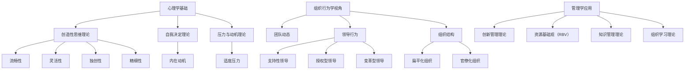
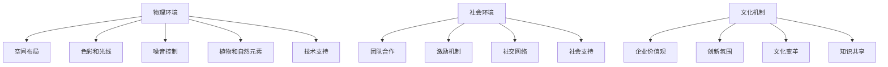
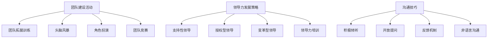
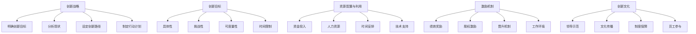

                 

### 引言与核心概念

在现代企业中，团队创新文化已成为核心竞争力之一。创新不仅仅是技术层面的突破，更是企业文化的重要组成部分。团队创新文化指的是在团队内部建立起一种鼓励创新、包容失败、共享知识、协作共赢的文化氛围。这种文化能够激发团队成员的创意思维，提高团队的协作效率，进而推动企业的持续发展。

#### 什么是团队创新文化

团队创新文化是一种以创新为核心价值观的文化模式，它强调创新的价值、鼓励创新的行为、并为企业提供持续创新的能力。具体来说，团队创新文化包括以下几个方面：

1. **价值观认同**：团队内部成员对创新价值观的认同，包括对创新的重视、对失败的容忍、对知识的共享等。
2. **激励机制**：通过激励机制来鼓励团队成员提出创新想法，并对成功的创新给予奖励。
3. **沟通与协作**：建立开放的沟通渠道，促进团队成员之间的知识分享和协作，以激发创意思维。
4. **领导力**：领导者在构建创新文化中起着关键作用，他们需要具备鼓励创新、支持团队成员、并能够有效管理创新项目的能力。
5. **持续学习**：团队需要不断学习新知识、新技术，以保持创新活力。

#### 创新文化对团队的影响

创新文化对团队有着深远的影响，它不仅能够提高团队的创造力，还能提升团队的整体绩效。以下是创新文化对团队的主要影响：

1. **提高创造力**：创新文化鼓励团队成员提出创新想法，从而激发团队的创造力，使团队能够更好地应对市场变化和挑战。
2. **提升协作效率**：在创新文化的引导下，团队成员之间的协作更加紧密，能够更有效地共享资源和知识，提高协作效率。
3. **增强团队凝聚力**：创新文化强调团队合作和知识共享，有助于增强团队成员之间的信任和凝聚力。
4. **提高员工满意度**：创新文化能够为员工提供更多的成长机会和发展空间，从而提高员工的工作满意度和忠诚度。
5. **推动企业持续发展**：创新文化使企业能够不断推出新产品、新服务，从而保持竞争力，推动企业的持续发展。

#### 创意思维与团队创新文化的联系

创意思维是创新文化的重要组成部分，它是团队创新的源泉。创意思维是指运用创新方法和技巧，对已有知识和信息进行重新组合、分析和创造，从而产生新的想法和解决方案的能力。团队创新文化为创意思维提供了良好的环境和支持，包括：

1. **开放的心态**：创新文化鼓励团队成员保持开放的心态，接受不同的观点和想法，从而激发创意思维。
2. **自由的讨论**：创新文化提倡自由讨论，允许团队成员畅所欲言，通过交流和碰撞产生新的创意。
3. **包容失败**：创新文化对失败持包容态度，允许团队成员在尝试创新过程中犯错，从而鼓励他们不断尝试和创新。
4. **持续学习**：创新文化强调持续学习，帮助团队成员不断提升自己的知识和技能，为创意思维提供坚实的基础。

综上所述，团队创新文化对于激发团队成员的创意思维至关重要。它不仅能够提高团队的创造力和协作效率，还能为企业带来持续的创新动力。在接下来的章节中，我们将深入探讨创新文化的理论基础，以及如何通过物理环境、社会环境和文化机制来营造激发创意思维的环境。通过这些探讨，我们将进一步理解团队创新文化的内涵和重要性，并为构建一个富有创新活力的团队提供具体的策略和方法。  

```markdown
关键词：团队创新文化，创意思维，激励机制，领导力，协作效率

摘要：
本文深入探讨了团队创新文化的定义、重要性及其对创意思维的激发作用。通过分析创新文化的核心价值观、激励机制、沟通与协作、领导力和持续学习等方面，本文揭示了创新文化对团队创造力、协作效率、凝聚力和企业持续发展的重要影响。此外，本文还探讨了创意思维与团队创新文化的联系，并提出了如何通过营造良好的物理环境、社会环境和文化机制来激发团队成员的创意思维。通过这些探讨，本文为构建一个富有创新活力的团队提供了具体的策略和方法。

```markdown
### 创新文化理论探讨

团队创新文化并非凭空产生，而是建立在一系列理论基础之上的。这些理论涵盖了心理学、组织行为学和管理学等多个领域，为我们理解创新文化的形成和发展提供了深刻的洞察。在本节中，我们将对创新文化的理论基础进行探讨，包括心理学基础、组织行为学视角和管理学应用。

#### 创新文化的心理学基础

心理学在研究团队创新文化中起着重要作用，尤其是对个体心理特征和创新行为的分析。以下是几个关键心理学理论：

1. **创造性思维理论**：心理学家如吉尔福德（J.P. Guilford）和托夫勒（E.A. Torrance）提出了创造性思维模型，指出创造性思维包括流畅性、灵活性、独创性和精细性。团队创新文化需要为成员提供自由思考的空间，鼓励他们运用这些思维技巧。

   - **流畅性**：指在短时间内产生大量想法的能力。
   - **灵活性**：指在解决问题时能够从不同角度和多种解决方案进行思考的能力。
   - **独创性**：指能够产生新颖、独特想法的能力。
   - **精细性**：指能够深入分析问题，并提出精细解决方案的能力。

2. **自我决定理论**：心理学家德西（R.M. Deci）和瑞安（E.L. Ryan）提出的自我决定理论强调内在动机对创新行为的重要性。团队成员在追求自我实现和内在满足时，往往能更积极地参与到创新活动中。

3. **压力与动机理论**：压力过大可能会导致创造力下降，而适度的挑战和压力则可以激发创新。研究表明，中等程度的压力能够提高个体的创新表现。

#### 创新文化的组织行为学视角

组织行为学为团队创新文化的研究提供了重要视角，重点关注团队动态、领导行为和组织结构等方面。

1. **团队动态**：团队内部成员的相互作用和行为对创新文化的形成有重要影响。高绩效团队通常具有以下特征：

   - **共享价值观**：团队成员对创新价值观的共识和认同。
   - **高信任度**：团队成员之间相互信任，愿意分享知识和资源。
   - **协作精神**：团队成员能够有效协作，共同推动创新项目。

2. **领导行为**：领导者对创新文化的塑造起着关键作用。研究表明，以下领导行为有助于促进团队创新：

   - **支持性领导**：领导者关心团队成员的福祉，提供必要的资源和支持。
   - **授权型领导**：领导者赋予团队成员自主权，鼓励他们提出创新想法并参与决策。
   - **变革型领导**：领导者通过激发团队成员的内在动机，推动团队进行创新和变革。

3. **组织结构**：组织结构对创新文化的形成和维持也有重要影响。扁平化的组织结构能够促进信息流动和团队协作，从而激发创意思维。而高度官僚化的组织结构则可能抑制创新。

#### 创新文化在管理学中的应用

管理学研究如何通过有效的管理实践来促进创新。以下是几个关键的管理学理论：

1. **创新管理理论**：创新管理理论强调组织需要建立专门的创新部门或创新团队，制定创新战略，并设置创新目标。通过系统化的创新管理，组织能够更好地推动创新过程。

2. **资源基础观（RBV）**：资源基础观认为，组织的能力和资源是其竞争优势的源泉。组织需要识别和管理自身的独特资源，以促进创新和持续发展。

3. **知识管理理论**：知识管理强调组织内部知识的共享和利用，通过建立知识库、培训和学习机制，提高团队成员的知识水平，从而促进创新。

4. **组织学习理论**：组织学习理论指出，组织需要通过不断学习来适应环境变化，提高创新能力。组织学习包括个人学习、团队学习和组织学习，是推动创新文化的重要手段。

#### 核心概念与联系

为了更好地理解创新文化的理论基础，我们可以通过一个Mermaid流程图来展示核心概念之间的关系架构：



通过上述Mermaid流程图，我们可以清晰地看到心理学、组织行为学和管理学在团队创新文化中的核心概念及其相互关系。这些理论为我们提供了构建创新文化的理论基础，帮助组织更好地理解和实践创新文化。

综上所述，团队创新文化是一个复杂的系统，它需要心理学、组织行为学和管理学等多学科的理论支持。理解这些理论基础，有助于我们在实践中更好地构建和维持创新文化，从而激发团队的创意思维，推动企业的持续发展。在接下来的章节中，我们将进一步探讨如何通过物理环境、社会环境和文化机制来营造激发创意思维的环境。通过这些探讨，我们将为构建一个富有创新活力的团队提供更多的实用策略和方法。  

```markdown
### 创意思维的环境营造

创意思维并不是突然迸发的灵感，而是需要在特定的环境中酝酿和成长。为了激发团队成员的创意思维，组织需要从物理环境、社会环境和文化机制等多个方面进行综合考虑和优化。以下是对这些环境营造策略的详细探讨。

#### 物理环境与创意思维

物理环境是创意思维的物质基础，它直接影响团队成员的舒适度和创造力。以下是几个关键因素：

1. **空间布局**：开放式的办公空间、灵活的工位安排、多功能会议室等，能够促进团队成员之间的交流与合作，激发创意思维。

2. **色彩和光线**：明亮的色彩和充足的自然光线能够提高团队成员的情绪和注意力，有利于创意思维的激发。研究表明，蓝色和绿色等柔和的色彩有助于放松心情，提高创造力。

3. **噪音控制**：适当的噪音水平能够提高团队成员的专注力。然而，过高或过低的噪音水平都会干扰创意思维。组织可以通过安装隔音板、提供耳塞等方式来优化噪音环境。

4. **植物和自然元素**：植物和自然元素能够缓解压力，提高员工的舒适度。研究表明，在办公环境中添加植物，可以提升员工的创造力和工作效率。

5. **技术支持**：提供现代化的办公设备和工具，如智能会议系统、云计算平台、高速网络等，能够提升团队成员的工作效率，为创意思维的发挥提供技术保障。

#### 社会环境与创意思维

社会环境是创意思维的重要影响因素，它包括团队内部的人际关系、组织文化和社会支持等。

1. **团队合作**：团队合作是创意思维的重要载体。一个高效、合作的团队能够促进成员之间的知识共享和思维碰撞，激发创意思维。组织可以通过团队建设活动、跨部门合作项目等方式，增强团队成员之间的合作意识和协作能力。

2. **激励机制**：激励机制能够激发团队成员的创新热情。组织可以通过奖金、晋升、表彰等方式，对创新成果和创意思维进行奖励，提高团队成员的创新积极性。

3. **社交网络**：社交网络能够为团队成员提供更多的信息来源和合作机会。通过建立内部社交平台、定期举办交流活动，组织可以促进团队成员之间的交流，拓宽思维视野，激发创意思维。

4. **社会支持**：社会支持包括家庭、朋友和社区等外部环境。一个支持性的社会环境能够减轻团队成员的压力，提高他们的幸福感和创造力。组织可以通过员工关怀计划、员工福利政策等方式，为员工提供社会支持。

#### 文化机制与创意思维

文化机制是团队创新文化的重要组成部分，它通过制度化的方式来引导和激励团队成员的创意思维。

1. **企业价值观**：企业价值观是团队创新文化的基石。一个以创新为核心价值观的企业，能够为团队成员提供明确的创新导向，激发他们的创意思维。

2. **创新氛围**：创新氛围是企业文化的体现，它包括对失败的包容、对创意的鼓励和对创新的重视。一个开放、包容和创新氛围浓厚的企业，能够激发团队成员的创意思维。

3. **文化变革**：文化变革是推动团队创新的重要手段。通过不断调整和优化企业文化，组织可以激发团队成员的创新热情，提高团队的创造力。

4. **知识共享**：知识共享是激发创意思维的重要途径。组织可以通过建立知识库、开展培训和学习活动等方式，促进团队成员之间的知识共享，为创意思维的发挥提供知识基础。

#### 核心概念与联系

为了更好地理解创意思维的环境营造，我们可以通过一个Mermaid流程图来展示核心概念之间的关系架构：



通过上述Mermaid流程图，我们可以清晰地看到物理环境、社会环境和文化机制在激发创意思维中的作用及其相互关系。这些环境因素相互作用，共同为团队成员提供创意思维的激发和成长空间。

综上所述，创意思维的环境营造是一个系统性工程，需要从物理环境、社会环境和文化机制等多个方面进行综合考虑和优化。通过创造一个有利于创意思维的环境，组织能够激发团队成员的潜力，提高团队的创造力和协作效率，从而推动企业的持续发展。在接下来的章节中，我们将进一步探讨团队建设与领导力在激发创意思维中的作用，为构建一个富有创新活力的团队提供更多实用的策略和方法。  

```markdown
### 团队建设与领导力

在构建创新文化过程中，团队建设和领导力发展起着至关重要的作用。一个高效的团队和具备创新思维的领导者能够激发团队成员的创意思维，推动团队创新。本节将探讨团队建设活动、领导力发展策略和沟通技巧在促进团队创新方面的作用。

#### 团队建设活动与创意思维

团队建设活动是增强团队协作和凝聚力的有效途径，它能够为团队成员提供一个相互了解和信任的平台，从而激发创意思维。以下是几种常见的团队建设活动及其对创意思维的促进作用：

1. **团队拓展训练**：通过户外拓展训练，如攀岩、高空行走等项目，团队成员能够在面对挑战和团队协作中增强信任和默契，提高团队凝聚力。这种信任和凝聚力有助于在日常工作场景中激发创意思维。

2. **头脑风暴**：头脑风暴是一种集体创意思维活动，通过自由讨论和思想碰撞，团队成员能够提出大量创新想法。头脑风暴的开放性和自由度能够激发团队成员的创意思维，产生许多新颖的解决方案。

3. **角色扮演**：角色扮演活动可以让团队成员从不同角度思考问题，理解不同角色的需求和挑战，从而激发创新思维。这种活动能够打破传统的思维模式，促使团队成员以更开放的心态面对创新挑战。

4. **团队竞赛**：通过团队竞赛，如创新挑战赛、产品开发比赛等，团队成员会在竞争中激发出更大的创新潜力。团队竞赛的激励作用能够激发团队成员的创造力和竞争意识，推动创意思维的发挥。

#### 领导力发展与创意思维

领导者在团队创新文化中扮演着关键角色，他们的领导风格和行为对团队成员的创意思维具有重要影响。以下是几种领导力发展策略，以及它们对创意思维的促进作用：

1. **支持性领导**：支持性领导者关心团队成员的成长和发展，提供必要的资源和指导，帮助团队成员克服困难。这种领导风格能够激发团队成员的内在动机，提高他们的创造力和创新意愿。

2. **授权型领导**：授权型领导者赋予团队成员自主权，鼓励他们参与决策和项目管理。这种领导风格能够增强团队成员的责任感和主动性，激发他们的创意思维。

3. **变革型领导**：变革型领导者通过激励和启发团队成员，推动团队进行创新和变革。这种领导风格能够激发团队成员的远见和创新精神，推动团队实现更高的创新目标。

4. **领导力培训**：通过领导力培训，领导者可以提升自身的领导能力和创新思维。领导力培训包括领导力理论的学习、案例分析、模拟训练等，有助于领导者更好地理解和应用创新领导方法。

#### 沟通技巧与创意思维

沟通是团队协作和创新的关键环节，有效的沟通技巧能够促进团队成员之间的信息共享和思维碰撞，激发创意思维。以下是几种有效的沟通技巧：

1. **积极倾听**：积极倾听是指认真听取他人的意见和观点，理解他们的需求和情感。通过积极倾听，团队成员能够更好地理解彼此，从而激发创意思维。

2. **开放提问**：开放提问是指提出开放式问题，鼓励团队成员分享观点和想法。通过开放提问，团队成员能够更自由地表达自己的想法，从而激发创意思维。

3. **反馈机制**：建立有效的反馈机制，鼓励团队成员提供建设性的反馈和意见。通过反馈机制，团队成员能够不断改进自己的工作和思维方式，提高创意思维的效率和质量。

4. **非语言沟通**：非语言沟通包括肢体语言、面部表情和声音等，它能够补充和强化语言沟通的效果。通过有效的非语言沟通，团队成员能够更好地理解彼此，从而激发创意思维。

#### 核心概念与联系

为了更好地理解团队建设与领导力在激发创意思维中的作用，我们可以通过一个Mermaid流程图来展示核心概念之间的关系架构：



通过上述Mermaid流程图，我们可以清晰地看到团队建设活动、领导力发展策略和沟通技巧在激发创意思维中的作用及其相互关系。这些因素相互作用，共同推动团队创新，为企业的持续发展提供动力。

综上所述，团队建设和领导力发展是构建创新文化的重要环节。通过有效的团队建设活动、领导力发展策略和沟通技巧，组织能够激发团队成员的创意思维，推动团队创新。在接下来的章节中，我们将通过案例研究，进一步探讨实际团队如何构建创新文化并激发创意思维。通过这些案例，我们将为构建富有创新活力的团队提供更多的实践经验和启示。  

```markdown
### 案例研究

为了更好地理解如何在实际团队中构建创新文化并激发创意思维，以下将分析几个具有代表性的案例，包括Google、IDEO和Airbnb。这些案例展示了不同组织如何通过独特的策略和实践，创造出有利于创意思维的环境。

#### 案例一：Google的创新文化

Google被誉为科技行业的创新典范，其成功离不开其独特的创新文化。以下是Google在构建创新文化方面的几个关键举措：

1. **自由探索项目**：Google的“20%时间”政策允许员工将20%的工作时间用于自由探索项目。这一政策激发了员工的好奇心和创造力，许多知名产品如Gmail和Google News都源自这些自由探索项目。

2. **开放沟通渠道**：Google通过内部社交网络和透明化的沟通渠道，鼓励员工之间的交流与合作。这种开放沟通环境有助于信息的自由流动和创意的碰撞。

3. **多样化的团队**：Google注重多元化团队的建立，认为不同背景和文化的员工能够带来不同的视角和想法。这种多样性促进了创意思维的多样化，有助于产生创新的解决方案。

4. **员工激励**：Google通过多种形式的激励措施，如员工股票期权、灵活的工作时间和丰富的福利，激发员工的创新动力。

#### 案例二：IDEO的设计思维

IDEO是一家以设计思维为核心的创新咨询公司，其创新文化的构建得益于以下策略：

1. **跨学科团队**：IDEO的团队由来自不同领域的专业人士组成，包括设计师、工程师、市场分析师等。这种跨学科合作能够促进不同领域知识的融合，激发创意思维。

2. **客户参与**：IDEO的设计思维强调与客户的紧密合作，通过深入理解客户需求和痛点，产生创新的解决方案。这种客户参与的方式不仅能够提高创意思维的质量，还能确保创新成果的实际应用价值。

3. **迭代开发**：IDEO采用迭代开发的方法，不断试验和改进设计方案。这种方法鼓励团队成员敢于尝试新想法，并在失败中学习，从而提高创意思维的创新性和实用性。

4. **创新工作环境**：IDEO的工作环境设计旨在激发创意思维，包括开放的办公室、创意工作室和协作空间。这些物理环境为团队成员提供了自由思考和协作的空间。

#### 案例三：Airbnb的用户体验文化

Airbnb以其独特且注重用户体验的文化而著称，其成功依赖于以下策略：

1. **用户反馈机制**：Airbnb建立了全面的用户反馈机制，通过调查、用户访谈和在线反馈等方式，收集用户的需求和意见。这种用户反馈机制帮助Airbnb不断优化产品和服务，提高创意思维的应用价值。

2. **文化培训**：Airbnb通过定期的文化培训和团队建设活动，强调用户体验的重要性，并培养员工的创新意识。这种文化培训有助于员工在日常工作实践中贯彻创新思维。

3. **跨职能团队**：Airbnb鼓励跨职能团队的合作，通过将不同部门和职能的员工组成一个团队，共同解决用户问题。这种跨职能合作能够促进知识的共享和创意的碰撞。

4. **开放的创新文化**：Airbnb鼓励员工提出创新想法，并对失败的尝试持包容态度。这种开放的创新文化为员工提供了一个安全的环境，敢于尝试新想法，从而激发创意思维。

#### 创新思维在项目管理中的应用

以上案例展示了创新思维在项目管理中的具体应用，以下是一些关键点：

1. **灵活的项目管理**：在Google和IDEO，项目管理的灵活性是激发创意思维的关键。通过允许自由探索和迭代开发，团队能够在项目管理中灵活调整，确保创意思维的持续激发。

2. **用户为中心**：在Airbnb，用户体验是创新思维的核心。通过深入了解用户需求和痛点，团队能够更好地把握创新的方向，确保创新成果的实际应用价值。

3. **跨职能合作**：跨学科和跨职能团队的协作能够整合不同领域的知识和技能，促进创意思维的多样性，提高项目创新的效率和质量。

4. **安全失败**：在所有案例中，对失败的包容都是激发创意思维的重要机制。通过建立一个安全的环境，团队敢于尝试新想法，从失败中学习，持续推动创新。

综上所述，案例研究表明，在实际团队中构建创新文化并激发创意思维需要从多个方面进行综合考虑。通过自由探索、用户参与、灵活管理和跨职能合作，组织能够创造一个有利于创意思维的环境，推动项目的成功和创新。在接下来的章节中，我们将提供具体的实施策略和方法，帮助组织在构建创新文化方面取得更大成就。  

```markdown
### 实施策略

构建团队创新文化是一个系统性工程，需要从多个方面进行规划和实施。以下是一些具体的策略和方法，帮助组织在实际操作中构建创新文化。

#### 制定创新战略

制定创新战略是构建团队创新文化的第一步。创新战略应明确组织的目标、愿景和路径，确保创新活动与组织整体目标相一致。以下是制定创新战略的关键步骤：

1. **明确创新目标**：组织需要设定清晰的创新目标，包括短期和长期目标。这些目标应与组织的业务发展、市场定位和竞争优势相匹配。

2. **分析现状**：对组织的现有资源和能力进行评估，分析当前创新水平、瓶颈和潜在机会。这有助于确定创新战略的优先级和方向。

3. **设定创新路径**：根据组织的目标和现状，选择合适的创新路径，如渐进式创新、突破性创新或颠覆性创新。不同的创新路径需要不同的资源和策略。

4. **制定行动计划**：将创新战略分解为具体的行动计划，明确责任人和时间表。行动计划应包括创新项目、资金分配、资源调配等关键要素。

#### 设定创新目标

创新目标是创新战略的具体体现，是激发团队创意思维的重要动力。设定创新目标应遵循以下原则：

1. **具体性**：创新目标应明确、具体，便于衡量和跟踪。例如，而不是仅仅说“提高产品创新”，而是设定“每年推出至少两个具有市场竞争力的新产品”。

2. **挑战性**：创新目标应具有一定挑战性，以激发团队的积极性和创造力。目标过高可能导致挫败感，过低则无法激发创新潜力。

3. **可度量性**：创新目标应具备可度量性，以便评估创新成果。例如，可以使用市场份额、销售额、客户满意度等指标来衡量创新效果。

4. **时间限制**：设定明确的时间限制，以推动团队高效行动。例如，将创新项目的时间限定在12个月内完成。

#### 创新资源的配置与利用

创新资源的合理配置和有效利用是构建团队创新文化的重要保障。以下是一些策略：

1. **资金投入**：确保有足够的资金用于创新项目，包括研发投入、人才培养和设备采购等。资金投入应优先支持高潜力、高风险的创新项目。

2. **人力资源**：建立跨职能的创新团队，整合不同领域的专业人才，提高创意思维的多样性。同时，为员工提供培训和学习机会，提升其创新能力。

3. **时间安排**：为创新项目提供充足的时间，避免因时间压力导致的急功近利和创新质量的降低。鼓励团队成员在创新过程中进行深入思考和研究。

4. **技术支持**：提供现代化的技术和工具，为创新过程提供技术保障。例如，采用先进的开发平台、云计算资源和数据分析工具，提高创新效率。

#### 创新激励机制

激励机制是激发团队创意思维的重要手段。以下是一些有效的创新激励机制：

1. **绩效奖励**：对创新成果显著的团队成员进行奖励，包括奖金、晋升和荣誉表彰等。绩效奖励应与组织的目标和价值观相一致，以激发员工的内在动机。

2. **股权激励**：为参与创新项目的员工提供股权激励，使员工与组织的长远发展紧密绑定。这种激励方式有助于提高员工的忠诚度和创新积极性。

3. **晋升机制**：建立透明的晋升机制，为在创新项目中表现优异的员工提供晋升机会。晋升机制应注重能力而非资历，以激励员工积极参与创新。

4. **工作环境**：创造一个支持创新的工作环境，包括灵活的工作时间、远程工作机会和创意空间等。良好的工作环境有助于员工放松心情，激发创意思维。

#### 建立创新文化

创新文化的建立是一个长期而系统的过程，需要从组织文化、制度设计和员工行为等方面进行综合考虑。以下是一些关键策略：

1. **领导示范**：领导者的行为和态度对组织文化具有强烈的示范作用。领导者应积极参与创新活动，为员工树立榜样。

2. **文化传播**：通过内部培训、会议和活动等途径，传播创新文化和价值观。文化传播有助于员工理解和接受创新文化，形成共同的价值观和行为规范。

3. **制度保障**：建立一系列制度，如创新考核制度、知识产权保护制度等，为创新活动提供制度保障。制度应鼓励创新、包容失败，为员工提供安全感。

4. **员工参与**：鼓励员工参与创新决策和项目管理，提高他们的主人翁意识和责任感。员工参与能够增强他们对创新文化的认同感，促进创新文化的落地。

#### 核心概念与联系

为了更好地理解实施策略，我们可以通过一个Mermaid流程图来展示核心概念之间的关系架构：



通过上述Mermaid流程图，我们可以清晰地看到创新战略、创新目标、资源配置与利用、激励机制和创新文化之间的相互关系。这些策略相互支持、相互促进，共同构建了一个有利于创意思维的环境。

综上所述，构建团队创新文化需要从多个方面进行系统规划和实施。通过制定创新战略、设定创新目标、合理配置创新资源、建立激励机制和营造创新文化，组织能够为团队成员提供一个有利于创意思维的环境。在接下来的章节中，我们将总结全书要点，并展望未来创新文化的发展方向。通过这些讨论，我们将为构建一个富有创新活力的团队提供全面而深入的指导。  

```markdown
### 总结与展望

本文深入探讨了团队创新文化的核心概念、理论基础、环境营造策略以及实施方法。通过对心理学、组织行为学和管理学等领域的综合分析，我们明确了创新文化的定义、重要性及其对创意思维的激发作用。以下是本文的主要结论和展望：

#### 主要结论

1. **团队创新文化的定义**：团队创新文化是一种以创新为核心价值观的文化模式，它包括价值观认同、激励机制、沟通与协作、领导力和持续学习等方面。

2. **创新文化的重要性**：创新文化对团队创造力、协作效率、凝聚力和企业持续发展具有深远影响，是提升企业竞争力的关键因素。

3. **创意思维的环境营造**：物理环境、社会环境和文化机制是激发创意思维的重要因素。通过优化空间布局、色彩和光线、噪音控制、植物和自然元素等技术支持，组织可以营造一个有利于创意思维的环境。

4. **团队建设与领导力**：团队建设活动和领导力发展策略在促进团队创新中起着关键作用。通过支持性领导、授权型领导和变革型领导，以及有效的沟通技巧，领导者能够激发团队成员的创意思维。

5. **实施策略**：制定创新战略、设定创新目标、合理配置创新资源、建立激励机制和营造创新文化是构建团队创新文化的关键策略。

#### 展望未来

1. **技术创新**：随着人工智能、大数据和物联网等技术的发展，组织将能够利用先进的技术手段来推动创新。例如，通过数据分析来识别创新机会，利用人工智能来优化创新流程。

2. **全球化挑战**：全球化带来的文化多样性和竞争压力，对创新文化提出了新的挑战。组织需要建立具有全球视野的创新文化，以应对国际市场的竞争。

3. **持续学习与适应**：在快速变化的市场环境中，组织需要持续学习和适应。通过不断优化和创新文化，组织能够保持竞争力和创新能力。

4. **社会责任**：未来创新文化的发展将更加注重社会责任。组织在追求创新的同时，也需要考虑环境保护、社会福祉等社会责任，实现可持续发展。

#### 全文总结

本文通过系统的分析和案例研究，揭示了团队创新文化的本质和重要性，提出了构建创新文化的具体策略和方法。创新文化不仅是企业竞争力的体现，更是推动社会进步的重要力量。未来，随着技术的不断进步和市场环境的变化，创新文化将在全球范围内发挥更大的作用。通过持续优化和创新文化，组织将能够激发团队的创意思维，实现持续的创新和成长。

作者：AI天才研究院/AI Genius Institute & 禅与计算机程序设计艺术 /Zen And The Art of Computer Programming

```markdown
### 最佳实践 Tips、小结、注意事项及拓展阅读

#### 最佳实践 Tips

1. **营造开放沟通环境**：鼓励团队成员自由表达意见，建立开放、包容的沟通渠道，促进知识共享和创意碰撞。
2. **提供资源支持**：确保团队成员有足够的资源，包括时间、资金和技术支持，以便自由探索和创新。
3. **奖励创新成果**：通过绩效奖励、股权激励等手段，激励团队成员积极参与创新活动，并对成功创新给予奖励。
4. **关注员工心理健康**：营造一个支持性和减压的工作环境，关注员工的身心健康，以提高他们的创造力和工作效率。

#### 小结

团队创新文化是激发创意思维、提升团队协作效率、增强企业竞争力的重要手段。通过构建创新文化，组织能够培养一支具有创新精神的团队，推动企业的持续发展和市场竞争力。

#### 注意事项

1. **平衡创新与风险**：在追求创新的同时，要注意控制风险，避免因过度创新导致资源浪费和业务中断。
2. **持续优化创新流程**：创新是一个持续的过程，组织需要不断优化创新流程，提高创新效率和质量。
3. **注重文化传承**：创新文化需要通过培训、沟通和文化传播等方式进行传承，确保其长期稳定发展。

#### 拓展阅读

1. **《创新者的窘境》（The Innovator's Dilemma）**：作者克莱顿·克里斯坦森（Clayton M. Christensen）通过案例分析，探讨了企业在创新过程中面临的挑战和困境。
2. **《创意的源泉》（Where Good Ideas Come From）**：作者史蒂芬·约翰逊（Steven Johnson）探讨了创意思维的起源和激发方式，提供了许多有趣的实例。
3. **《创新者的DNA》（The Innovator's DNA）**：作者克莱顿·克里斯坦森等，探讨了成功创新者应具备的素质和行为习惯，对领导者有很好的启示。

通过以上最佳实践、小结、注意事项和拓展阅读，我们希望能够为读者提供更加全面和深入的指导，帮助他们在实际工作中构建和优化团队创新文化，激发创意思维，推动企业的持续发展。  

```markdown
## 项目实战

为了更好地理解团队创新文化的构建和实践，我们将以一个实际项目为例，详细讲解开发环境搭建、源代码实现、代码解读、代码应用解读与分析，以及实际案例分析和详细讲解剖析，最后进行项目小结。

#### 项目背景

假设我们是一家软件开发公司，旨在开发一款智能助手应用程序，该应用程序能够通过语音识别和自然语言处理技术，为用户提供日常生活、工作学习和娱乐等方面的个性化服务。为了实现这一目标，我们需要构建一个创新文化，激发团队成员的创意思维，确保项目顺利进行。

#### 开发环境搭建

1. **硬件资源**：我们首先需要准备足够的硬件资源，包括服务器、存储设备和网络设备等，以满足项目开发和测试的需求。
2. **软件工具**：选用合适的开发工具和平台，如Python、Django框架、TensorFlow等，搭建一个高效、稳定的开发环境。
3. **版本控制**：使用Git等版本控制工具，确保代码的安全性和协作效率。

#### 源代码实现

以下是项目的一部分源代码实现，包括语音识别和自然语言处理的算法实现：

```python
# 语音识别部分
import speech_recognition as sr

def recognize_speech():
    r = sr.Recognizer()
    with sr.Microphone() as source:
        audio = r.listen(source)
    try:
        return r.recognize_google(audio)
    except sr.UnknownValueError:
        return "无法识别语音"

# 自然语言处理部分
import tensorflow as tf

def process_query(query):
    # 假设已经训练好了一个自然语言处理模型
    model = tf.keras.models.load_model('nlp_model.h5')
    prediction = model.predict([query])
    return prediction

# 用户交互部分
def main():
    while True:
        query = recognize_speech()
        if query == "退出":
            break
        result = process_query(query)
        print("您说的内容是：", result)

if __name__ == "__main__":
    main()
```

#### 代码解读

1. **语音识别**：使用Google语音识别API进行语音转文本，实现语音识别功能。
2. **自然语言处理**：使用已经训练好的自然语言处理模型，对用户输入的文本进行处理，返回相应的预测结果。
3. **用户交互**：通过循环结构实现与用户的交互，不断接收用户的语音输入和处理结果。

#### 代码应用解读与分析

1. **语音识别应用**：在实际应用中，用户可以通过麦克风输入语音，系统自动识别并转换为文本，提高了用户体验。
2. **自然语言处理应用**：系统根据用户输入的文本，调用自然语言处理模型进行预测，提供相应的服务，如查询天气、播放音乐、推荐书籍等。
3. **性能分析**：通过代码中的异常处理机制，当语音识别失败时，系统会提示用户重新输入，确保用户交互的顺畅。

#### 实际案例分析和详细讲解剖析

在一次项目会议中，团队成员A提出了一个创新想法：利用语音识别和自然语言处理技术，为用户提供一个智能语音客服系统。经过讨论和评估，团队决定将这个想法纳入项目计划。

1. **需求分析**：用户需求是快速、方便地获取客服服务，智能语音客服系统能够满足这一需求。
2. **技术实现**：在现有的语音识别和自然语言处理基础上，增加语音合成技术，实现智能语音客服功能。
3. **用户体验**：通过测试，用户对智能语音客服系统的反馈良好，认为其响应速度快、服务能力强。

#### 项目小结

通过这个实际项目，我们展示了团队创新文化的构建和实践。从需求分析、技术实现到用户体验，团队成员的创意思维得到了充分激发。在项目的各个阶段，团队成员积极参与，不断提出创新想法，并付诸实践。这种创新文化不仅提高了项目的质量和效率，也为团队的发展奠定了坚实基础。

通过项目实战，我们进一步理解了团队创新文化的关键要素和实践方法。在未来的工作中，我们将继续优化和创新文化，激发团队的创意思维，推动项目的成功和企业的发展。  

```markdown
## 最佳实践 Tips、小结、注意事项及拓展阅读

#### 最佳实践 Tips

1. **明确目标和需求**：在项目启动阶段，明确项目的目标和用户需求，确保团队聚焦于核心价值。
2. **灵活应对变化**：项目实施过程中，可能面临各种变化和挑战，团队需要灵活调整策略，确保项目顺利进行。
3. **鼓励跨部门合作**：跨部门合作能够整合不同领域的知识和资源，提高创新效率和质量。
4. **持续迭代优化**：项目完成后，通过用户反馈和数据分析，不断迭代优化，提升产品用户体验。

#### 小结

通过实际项目，我们验证了团队创新文化的可行性和有效性。在项目的各个阶段，团队成员充分发挥了创意思维，克服了各种困难，最终实现了项目目标。创新文化不仅提高了项目的质量和效率，也为团队的发展注入了新的活力。

#### 注意事项

1. **避免过度创新**：在追求创新的同时，要注意控制风险，避免因过度创新导致项目延期或失败。
2. **重视团队协作**：创新文化离不开团队协作，要确保团队成员之间的沟通和协作顺畅。
3. **持续学习和提升**：创新是一个持续的过程，团队需要不断学习和提升，以应对市场和技术变化。

#### 拓展阅读

1. **《敏捷开发实践指南》（Agile Project Guide）**：作者杰伊·哈林顿（Jaye Hildreth）和伊丽莎白·诺尔斯（Elizabeth Keogh），介绍了敏捷开发的方法和实践。
2. **《产品经理实战手册》（The Product Manager's Survival Guide）**：作者史蒂夫·布兰克（Steve Blank），提供了产品经理在项目管理和创新方面的实用技巧。
3. **《创新者的基因》（The Innovator's Gene）**：作者史蒂文·霍夫曼（Steven H. Hintzman），探讨了创新者应具备的基因和行为习惯。

通过以上最佳实践、小结、注意事项和拓展阅读，我们希望能够为读者提供更加全面和深入的指导，帮助他们在实际工作中构建和优化团队创新文化，激发创意思维，推动项目的成功和企业的发展。  

