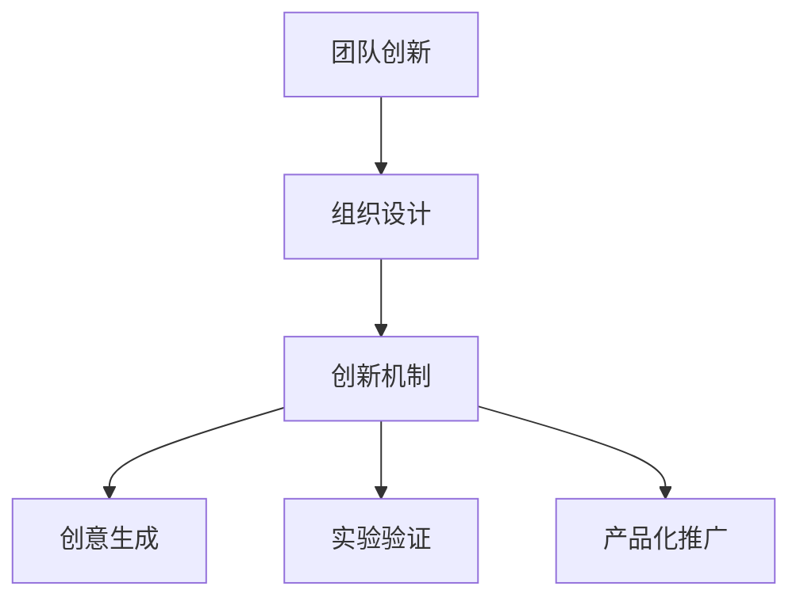

                 

### 《团队创新机制：激发持续创新的组织设计》

---

## 文章标题：团队创新机制：激发持续创新的组织设计

## 关键词：团队创新、组织设计、创新机制、持续创新、创新效率

## 摘要：

本文旨在探讨团队创新机制在组织设计中的重要性，通过详细分析核心概念、创新过程模型、团队协作机制以及数学模型，提供一套完整的团队创新机制设计框架。文章还将通过项目实战，展示实际应用中的创新环境搭建、源代码实现以及代码解读与分析，为读者提供实用的指导和建议。

---

### 确定核心概念与联系

在探讨团队创新机制之前，我们需要明确几个关键概念，并分析它们之间的相互关系。

#### 核心概念：

1. **团队创新**：指团队通过创造性思维和实践活动，产生新的思想、方法或产品，以提升组织的竞争力和适应能力。
2. **组织设计**：涉及组织的结构、流程、文化和资源分配，旨在最大化团队的效率和创新能力。
3. **创新机制**：是一套系统的过程和方法，用于激发、培养和支持团队的创新能力。

#### 相互关系：

- **团队创新**是**组织设计**的目标之一，而**创新机制**则是实现这一目标的手段。
- **组织设计**为**团队创新**提供了必要的结构和支持，而**团队创新**则为**组织设计**注入了新的活力和思路。
- **创新机制**包括**团队创新**的各个环节，如创意生成、实验验证、产品化推广等，这些环节共同构成了一个闭环的创新过程。

为了更直观地展示这些核心概念之间的关系，我们可以使用Mermaid流程图：



### 确定核心算法原理讲解

#### 创新过程模型

创新过程模型是一个描述团队如何从创意到产品化的框架。根据经验，我们可以将其分为以下几个阶段：

1. **创意生成**：通过头脑风暴、跨学科交流等方式，激发团队的创造力。
2. **实验验证**：对创意进行实验和测试，以验证其可行性和有效性。
3. **产品化推广**：将验证成功的创意转化为产品或服务，并推向市场。

以下是一个简化的伪代码，描述创新过程模型的实现：

```python
# 创新过程模型伪代码

def innovation_process(idea):
    if validate_idea(idea):
        prototype = create_prototype(idea)
        if test_prototype(prototype):
            product = productize(prototype)
            market_product(product)
    else:
        print("Idea validation failed.")

# 验证创意
def validate_idea(idea):
    # 实现具体的验证逻辑
    return True  # 假设创意通过了验证

# 创建原型
def create_prototype(idea):
    # 实现具体的原型创建逻辑
    return prototype

# 测试原型
def test_prototype(prototype):
    # 实现具体的原型测试逻辑
    return True  # 假设原型通过了测试

# 产品化
def productize(prototype):
    # 实现具体的原型产品化逻辑
    return product

# 推向市场
def market_product(product):
    # 实现具体的推向市场逻辑
    print("Product is now on the market.")
```

#### 团队协作机制

团队协作机制是指如何通过技术和管理手段，提升团队的协作效率和创新能力。以下是一个简化的伪代码，描述团队协作机制的基本框架：

```python
# 团队协作机制伪代码

def team_collaboration_toolkit():
    # 初始化团队协作工具
    initialize_tools()

    # 配置沟通渠道
    configure_communication()

    # 分配任务和责任
    assign_tasks()

    # 监控进度和反馈
    monitor_progress()

    # 提供支持和帮助
    provide_support()

# 初始化团队协作工具
def initialize_tools():
    # 实现工具的初始化逻辑
    print("Team collaboration tools initialized.")

# 配置沟通渠道
def configure_communication():
    # 实现沟通渠道的配置逻辑
    print("Communication channels configured.")

# 分配任务和责任
def assign_tasks():
    # 实现任务分配和责任归属的逻辑
    print("Tasks and responsibilities assigned.")

# 监控进度和反馈
def monitor_progress():
    # 实现进度监控和反馈收集的逻辑
    print("Progress monitored and feedback collected.")

# 提供支持和帮助
def provide_support():
    # 实现支持和帮助的逻辑
    print("Support and assistance provided.")
```

### 确定数学模型和数学公式

数学模型在团队创新机制中扮演着重要的角色，用于量化评估创新过程和团队协作效果。以下是一个简化的数学模型和相关的数学公式：

#### 创新效率公式

$$ E = f(I, T, C, O) $$

- \( E \)：创新效率
- \( I \)：创新能力
- \( T \)：团队协作效率
- \( C \)：创新成本
- \( O \)：创新成果

#### 创新能力指标

$$ I = f(Q, D, M) $$

- \( Q \)：创新能力质量
- \( D \)：创新能力多样性
- \( M \)：创新能力可维护性

#### 团队协作效率指标

$$ T = f(C, S, M) $$

- \( C \)：沟通效率
- \( S \)：共享效率
- \( M \)：协作模式匹配度

#### 创新成本与成果

$$ C = f(P, V, R) $$

- \( P \)：人力成本
- \( V \)：物力成本
- \( R \)：研发周期

$$ O = f(S, M, E) $$

- \( S \)：市场反馈
- \( M \)：市场需求
- \( E \)：经济效益

以下是一个使用LaTeX格式展示的数学公式：

```latex
\section{Mathematical Models}

\subsection{Innovation Efficiency Formula}

$$
E = f(I, T, C, O)
$$

where \( E \) is the innovation efficiency, \( I \) is the innovation capability, \( T \) is the team collaboration efficiency, \( C \) is the innovation cost, and \( O \) is the innovation outcome.

\subsection{Innovation Capability Indicators}

$$
I = f(Q, D, M)
$$

where \( Q \) is the quality of innovation capability, \( D \) is the diversity of innovation capability, and \( M \) is the maintainability of innovation capability.

\subsection{Team Collaboration Efficiency Indicators}

$$
T = f(C, S, M)
$$

where \( C \) is the communication efficiency, \( S \) is the sharing efficiency, and \( M \) is the match degree of collaboration mode.

\subsection{Innovation Cost and Outcome}

$$
C = f(P, V, R)
$$

where \( P \) is the human cost, \( V \) is the material cost, and \( R \) is the research and development cycle.

$$
O = f(S, M, E)
$$

where \( S \) is the market feedback, \( M \) is the market demand, and \( E \) is the economic benefit.
```

### 确定项目实战

为了使读者能够更好地理解书中的理论，我们将通过一个实际项目实战来展示团队创新机制的设计和应用。

#### 项目背景

假设我们正在开发一款智能医疗诊断系统。该系统需要利用深度学习算法进行疾病预测，并且需要快速迭代和优化，以满足医疗行业的快速变化。

#### 开发环境搭建

为了搭建一个支持团队创新的环境，我们需要以下工具和平台：

- **深度学习框架**：如TensorFlow或PyTorch
- **版本控制系统**：如Git
- **代码管理平台**：如GitHub或GitLab
- **协作工具**：如Slack或Trello

以下是搭建开发环境的伪代码：

```python
# 开发环境搭建伪代码

def setup_dev_environment():
    install_framework("TensorFlow")
    install_version_control("Git")
    configure_code_management_platform("GitHub")
    install_collaboration_tools("Slack")
    print("Development environment is set up.")

# 安装深度学习框架
def install_framework(framework_name):
    # 实现框架安装逻辑
    print(f"{framework_name} installed.")

# 安装版本控制系统
def install_version_control(version_control_system):
    # 实现版本控制系统安装逻辑
    print(f"{version_control_system} installed.")

# 配置代码管理平台
def configure_code_management_platform(platform_name):
    # 实现代码管理平台配置逻辑
    print(f"{platform_name} configured.")

# 安装协作工具
def install_collaboration_tools(tool_name):
    # 实现协作工具安装逻辑
    print(f"{tool_name} installed.")
```

#### 源代码实现

在开发智能医疗诊断系统时，我们需要编写以下关键代码：

- **数据预处理代码**：用于清洗和格式化医疗数据
- **深度学习模型代码**：用于训练和预测疾病
- **后处理代码**：用于解释和可视化预测结果

以下是关键代码实现的伪代码：

```python
# 数据预处理代码伪代码

def preprocess_data(data):
    # 清洗和格式化数据
    cleaned_data = clean_data(data)
    formatted_data = format_data(cleaned_data)
    return formatted_data

# 深度学习模型代码伪代码

def train_model(model, training_data):
    # 训练模型
    model.fit(training_data)
    return model

def predict_disease(model, test_data):
    # 预测疾病
    predictions = model.predict(test_data)
    return predictions

# 后处理代码伪代码

def postprocess_predictions(predictions):
    # 解释和可视化预测结果
    explanation = explain_predictions(predictions)
    visualization = visualize_predictions(predictions)
    return explanation, visualization
```

#### 代码解读与分析

在实现代码的过程中，我们需要进行以下分析和解读：

- **数据预处理**：分析数据的质量和特点，选择合适的数据清洗和格式化方法。
- **深度学习模型**：选择合适的模型架构和训练策略，优化模型的性能。
- **后处理**：分析预测结果的准确性和可解释性，为医生提供有用的决策支持。

以下是代码解读和分析的伪代码：

```python
# 代码解读与分析伪代码

def analyze_code段：
    # 分析数据预处理代码
    analyze_data_preprocessing_code(preprocess_data)

    # 分析深度学习模型代码
    analyze_model_code(train_model, predict_disease)

    # 分析后处理代码
    analyze_postprocessing_code(postprocess_predictions)

    print("Code analysis completed.")
```

#### 项目小结

通过以上项目实战，我们展示了如何搭建一个支持团队创新的环境，如何编写关键代码，并进行了代码解读和分析。这个过程不仅帮助我们理解了团队创新机制的理论，还提供了实际操作的经验。

### 最佳实践 Tips、小结、注意事项、拓展阅读

#### 最佳实践 Tips：

1. **持续沟通与反馈**：团队成员之间要保持频繁的沟通和反馈，以便快速响应问题和调整方向。
2. **敏捷开发**：采用敏捷开发方法，快速迭代和测试，以便快速发现和解决问题。
3. **资源合理分配**：确保团队有足够的资源，如时间、技术和资金，以支持创新活动。

#### 小结：

本文通过分析核心概念、创新过程模型、团队协作机制和数学模型，提供了一套完整的团队创新机制设计框架。并通过实际项目实战，展示了创新机制在实践中的应用。

#### 注意事项：

1. **确保团队协作**：创新成功的关键在于团队的协作效率，需要建立有效的沟通和协作机制。
2. **灵活应对变化**：创新过程中会面临各种挑战和变化，需要灵活调整策略和方法。

#### 拓展阅读：

1. **《敏捷开发实践指南》**：介绍敏捷开发方法，帮助团队提高协作效率和创新能力。
2. **《创新与企业家精神》**：探讨创新和企业家精神的本质，提供创新的思维方法和实践策略。

---

通过以上内容，我们完成了一份详细的目录大纲和核心内容的初步分析。接下来，我们将逐步完善每个章节的具体内容，确保文章的逻辑清晰、内容丰富，并在字数范围内达到要求。在完成初稿后，我们将进行多次修订和审核，以确保文章的质量和可读性。

